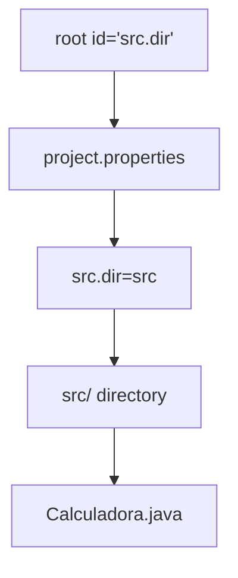
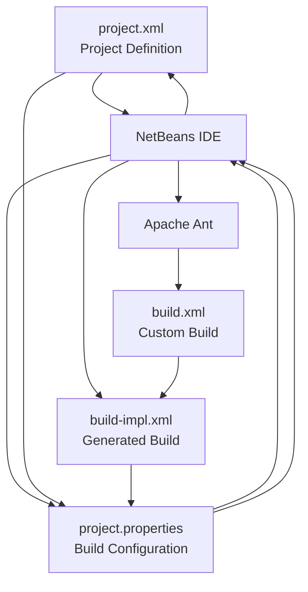

# Project Definition

> **Relevant source files**
> * [nbproject/project.properties](https://github.com/ricardo-alan/SimpleCalculator/blob/e9524f29/nbproject/project.properties)
> * [nbproject/project.xml](https://github.com/ricardo-alan/SimpleCalculator/blob/e9524f29/nbproject/project.xml)

## Purpose and Scope

This document describes the structure and contents of [nbproject/project.xml L1-L16](https://github.com/ricardo-alan/SimpleCalculator/blob/e9524f29/nbproject/project.xml#L1-L16)

 the core project definition file for the SimpleCalculator application. This XML file provides NetBeans IDE with essential metadata about the project type, structure, and source locations.

For build-time configuration settings (compiler versions, classpaths, directory paths), see [Project Properties](/ricardo-alan/SimpleCalculator/6.1-project-properties). For user-specific and machine-local settings, see [Private Configuration](/ricardo-alan/SimpleCalculator/6.3-private-configuration).

**Sources:** [nbproject/project.xml L1-L16](https://github.com/ricardo-alan/SimpleCalculator/blob/e9524f29/nbproject/project.xml#L1-L16)

---

## File Overview

The `project.xml` file is a NetBeans-specific project descriptor that defines the fundamental characteristics of the SimpleCalculator project. Unlike `project.properties` which contains key-value configuration pairs, `project.xml` uses an XML schema to declare project metadata that NetBeans requires to correctly interpret and build the project.

**Location:** `nbproject/project.xml`

**File Size:** 16 lines

**Format:** XML 1.0, UTF-8 encoded

**Primary Purpose:** Project type declaration and source root mapping

**Sources:** [nbproject/project.xml L1-L16](https://github.com/ricardo-alan/SimpleCalculator/blob/e9524f29/nbproject/project.xml#L1-L16)

---

## XML Document Structure

The following diagram illustrates the complete XML structure with exact element names as they appear in the codebase:

```

```

**Sources:** [nbproject/project.xml L1-L16](https://github.com/ricardo-alan/SimpleCalculator/blob/e9524f29/nbproject/project.xml#L1-L16)

---

## Root Element and Namespaces

The document begins with the standard XML declaration and the root `<project>` element:

| Element | Attribute | Value |
| --- | --- | --- |
| `<?xml>` | `version` | `1.0` |
| `<?xml>` | `encoding` | `UTF-8` |
| `<project>` | `xmlns` | `http://www.netbeans.org/ns/project/1` |

The namespace declaration at [nbproject/project.xml L2](https://github.com/ricardo-alan/SimpleCalculator/blob/e9524f29/nbproject/project.xml#L2-L2)

 indicates this file conforms to NetBeans project schema version 1. This schema defines the valid structure for all NetBeans project descriptors.

**Sources:** [nbproject/project.xml L1-L2](https://github.com/ricardo-alan/SimpleCalculator/blob/e9524f29/nbproject/project.xml#L1-L2)

---

## Project Type Declaration

```mermaid
flowchart TD

TYPE[""]
VALUE["org.netbeans.modules.java.j2seproject"]
IDE["NetBeans IDE"]
HANDLER["J2SE Project Handler"]
BUILD["J2SE Build System"]

TYPE --> VALUE
VALUE --> IDE
IDE --> HANDLER
HANDLER --> BUILD
```

The `<type>` element at [nbproject/project.xml L3](https://github.com/ricardo-alan/SimpleCalculator/blob/e9524f29/nbproject/project.xml#L3-L3)

 specifies:

```

```

This declares the project as a **Java 2 Standard Edition (J2SE) project**. This type designation instructs NetBeans to:

* Use the J2SE project handler module
* Apply J2SE-specific build templates
* Enable J2SE-related IDE features (GUI builder, standard Java libraries)
* Generate the appropriate `build-impl.xml` structure

The fully qualified module name `org.netbeans.modules.java.j2seproject` corresponds to NetBeans' internal module system architecture.

**Sources:** [nbproject/project.xml L3](https://github.com/ricardo-alan/SimpleCalculator/blob/e9524f29/nbproject/project.xml#L3-L3)

---

## Configuration Section

The `<configuration>` element at [nbproject/project.xml L4](https://github.com/ricardo-alan/SimpleCalculator/blob/e9524f29/nbproject/project.xml#L4-L4)

 wraps all project-specific settings. It contains a single `<data>` child element that uses a different XML namespace:

```

```

This namespace declaration at [nbproject/project.xml L5](https://github.com/ricardo-alan/SimpleCalculator/blob/e9524f29/nbproject/project.xml#L5-L5)

 specifies the schema version for J2SE project data structures (version 3). This versioning allows NetBeans to maintain backward compatibility while evolving project formats.

**Sources:** [nbproject/project.xml L4-L5](https://github.com/ricardo-alan/SimpleCalculator/blob/e9524f29/nbproject/project.xml#L4-L5)

---

## Project Name

The `<name>` element at [nbproject/project.xml L6](https://github.com/ricardo-alan/SimpleCalculator/blob/e9524f29/nbproject/project.xml#L6-L6)

 defines the project identifier:

```

```

This name serves multiple purposes:

| Usage Context | Purpose |
| --- | --- |
| IDE Project Tree | Display name in NetBeans Projects panel |
| Build System | Referenced in build scripts and error messages |
| Distribution | Default base name for generated artifacts (though overridden by `dist.jar` in `project.properties`) |

The name "Calculadora" (Spanish for "Calculator") identifies this project throughout the NetBeans ecosystem.

**Sources:** [nbproject/project.xml L6](https://github.com/ricardo-alan/SimpleCalculator/blob/e9524f29/nbproject/project.xml#L6-L6)

---

## Source Root Configuration

The `<source-roots>` element at [nbproject/project.xml L7-L9](https://github.com/ricardo-alan/SimpleCalculator/blob/e9524f29/nbproject/project.xml#L7-L9)

 declares where application source code resides:

```

```

### Source Root Mapping



The `id="src.dir"` attribute references a property defined in `project.properties`. The mapping chain is:

1. **project.xml reference:** `<root id="src.dir"/>` at [nbproject/project.xml L8](https://github.com/ricardo-alan/SimpleCalculator/blob/e9524f29/nbproject/project.xml#L8-L8)
2. **project.properties definition:** `src.dir=src` at [nbproject/project.properties L74](https://github.com/ricardo-alan/SimpleCalculator/blob/e9524f29/nbproject/project.properties#L74-L74)
3. **Physical location:** `src/` directory in project root
4. **Contents:** `calculadora/` package with `Calculadora.java` and `Calculadora.form`

This indirection allows the physical directory path to be changed in `project.properties` without modifying `project.xml`.

**Sources:** [nbproject/project.xml L7-L9](https://github.com/ricardo-alan/SimpleCalculator/blob/e9524f29/nbproject/project.xml#L7-L9)

 [nbproject/project.properties L74](https://github.com/ricardo-alan/SimpleCalculator/blob/e9524f29/nbproject/project.properties#L74-L74)

---

## Test Root Configuration

The `<test-roots>` element at [nbproject/project.xml L10-L12](https://github.com/ricardo-alan/SimpleCalculator/blob/e9524f29/nbproject/project.xml#L10-L12)

 declares where test source code should reside:

```

```

### Test Root Mapping

Similar to source roots, the test root uses property indirection:

1. **project.xml reference:** `<root id="test.src.dir"/>` at [nbproject/project.xml L11](https://github.com/ricardo-alan/SimpleCalculator/blob/e9524f29/nbproject/project.xml#L11-L11)
2. **project.properties definition:** `test.src.dir=test` at [nbproject/project.properties L75](https://github.com/ricardo-alan/SimpleCalculator/blob/e9524f29/nbproject/project.properties#L75-L75)
3. **Physical location:** `test/` directory (not present in current repository)

Although the SimpleCalculator project does not currently contain test sources, this configuration enables NetBeans to support test development if tests are added in the future.

**Sources:** [nbproject/project.xml L10-L12](https://github.com/ricardo-alan/SimpleCalculator/blob/e9524f29/nbproject/project.xml#L10-L12)

 [nbproject/project.properties L75](https://github.com/ricardo-alan/SimpleCalculator/blob/e9524f29/nbproject/project.properties#L75-L75)

---

## Relationship to Build System

The following diagram shows how `project.xml` integrates with other configuration files and the build process:



**Interaction Flow:**

1. NetBeans reads `project.xml` to determine project type
2. Based on project type, NetBeans generates appropriate `build-impl.xml`
3. `project.xml` references property IDs (e.g., `src.dir`)
4. Property values are resolved from `project.properties`
5. Build system uses resolved paths during compilation

**Sources:** [nbproject/project.xml L1-L16](https://github.com/ricardo-alan/SimpleCalculator/blob/e9524f29/nbproject/project.xml#L1-L16)

 [nbproject/project.properties L74-L75](https://github.com/ricardo-alan/SimpleCalculator/blob/e9524f29/nbproject/project.properties#L74-L75)

---

## Schema Compliance

The `project.xml` file conforms to two NetBeans XML schemas:

| Schema | Version | Namespace URI | Purpose |
| --- | --- | --- | --- |
| Project Schema | 1 | `http://www.netbeans.org/ns/project/1` | Defines valid project descriptor structure |
| J2SE Project Schema | 3 | `http://www.netbeans.org/ns/j2se-project/3` | Defines valid J2SE-specific configuration |

These schemas are maintained by the NetBeans project and are part of the IDE's internal contract for project definitions. The schema version numbers allow NetBeans to handle projects created with different IDE versions.

**Sources:** [nbproject/project.xml L2-L5](https://github.com/ricardo-alan/SimpleCalculator/blob/e9524f29/nbproject/project.xml#L2-L5)

---

## Project Metadata Summary

The complete project metadata defined in `project.xml`:

| Metadata Element | Value | Line Reference |
| --- | --- | --- |
| **Project Type** | `org.netbeans.modules.java.j2seproject` | [nbproject/project.xml L3](https://github.com/ricardo-alan/SimpleCalculator/blob/e9524f29/nbproject/project.xml#L3-L3) |
| **Project Name** | `Calculadora` | [nbproject/project.xml L6](https://github.com/ricardo-alan/SimpleCalculator/blob/e9524f29/nbproject/project.xml#L6-L6) |
| **Source Root ID** | `src.dir` | [nbproject/project.xml L8](https://github.com/ricardo-alan/SimpleCalculator/blob/e9524f29/nbproject/project.xml#L8-L8) |
| **Test Root ID** | `test.src.dir` | [nbproject/project.xml L11](https://github.com/ricardo-alan/SimpleCalculator/blob/e9524f29/nbproject/project.xml#L11-L11) |

These four elements constitute the minimal required metadata for a NetBeans J2SE project. All other project configuration (compiler versions, classpaths, output directories) is handled in `project.properties`.

**Sources:** [nbproject/project.xml L1-L16](https://github.com/ricardo-alan/SimpleCalculator/blob/e9524f29/nbproject/project.xml#L1-L16)

---

## Modification Guidelines

The `project.xml` file is typically generated and managed by NetBeans IDE. Manual modifications should be rare and follow these guidelines:

### Safe Modifications

* Changing the `<name>` element to rename the project
* Adding additional `<root>` elements for multiple source directories

### Unsafe Modifications

* Changing the `<type>` element (requires project recreation)
* Modifying namespace URIs (breaks IDE compatibility)
* Removing required elements (causes project load failures)

**Recommendation:** Use NetBeans IDE's Project Properties dialog rather than manually editing this file.

**Sources:** [nbproject/project.xml L1-L16](https://github.com/ricardo-alan/SimpleCalculator/blob/e9524f29/nbproject/project.xml#L1-L16)

---

## Version Control Considerations

The `project.xml` file should be committed to version control because:

1. **Project Type:** Essential for IDE to recognize project structure
2. **Source Roots:** Required to locate application code
3. **Portability:** Enables other developers to open project correctly
4. **Reproducibility:** Ensures consistent project structure across environments

Unlike files in `nbproject/private/`, which contain user-specific paths, `project.xml` contains only portable, team-wide project definitions.

**Sources:** [nbproject/project.xml L1-L16](https://github.com/ricardo-alan/SimpleCalculator/blob/e9524f29/nbproject/project.xml#L1-L16)