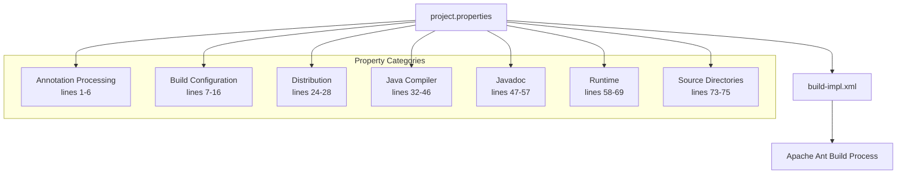
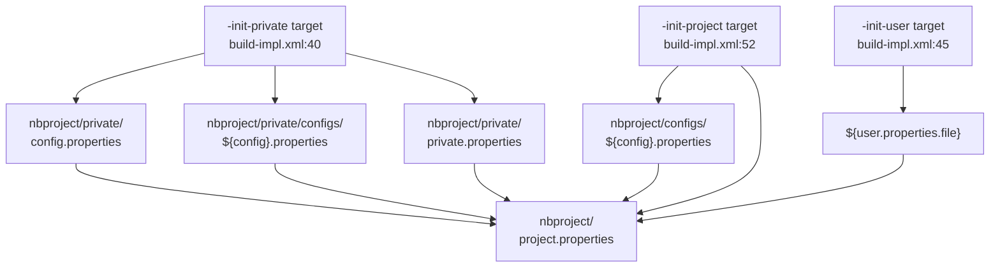
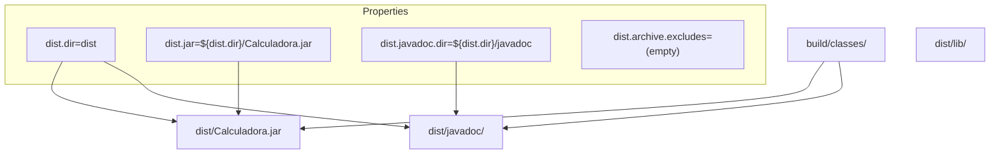
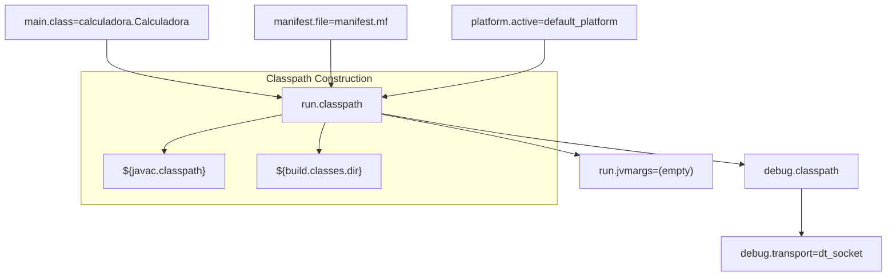
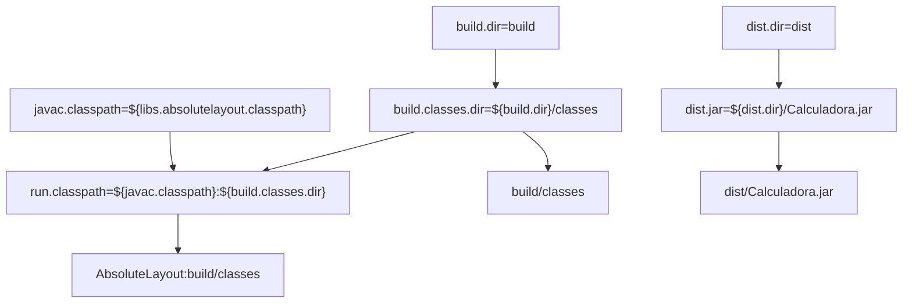

# Project Properties

> **Relevant source files**
> * [nbproject/build-impl.xml](https://github.com/ricardo-alan/SimpleCalculator/blob/e9524f29/nbproject/build-impl.xml)
> * [nbproject/project.properties](https://github.com/ricardo-alan/SimpleCalculator/blob/e9524f29/nbproject/project.properties)

This page provides reference documentation for the `nbproject/project.properties` file, which contains all build and project configuration settings for the SimpleCalculator application. This file is the primary configuration source that controls compilation, packaging, testing, and deployment behavior.

For information about the NetBeans project definition structure, see [Project Definition](/ricardo-alan/SimpleCalculator/6.2-project-definition). For build process implementation details, see [Build Configuration](/ricardo-alan/SimpleCalculator/5.1-build-configuration).

---

## Overview

The `project.properties` file is a standard Java properties file located at [nbproject/project.properties L1-L76](https://github.com/ricardo-alan/SimpleCalculator/blob/e9524f29/nbproject/project.properties#L1-L76)

 that defines key-value pairs consumed by the Apache Ant build system. These properties are loaded early in the build lifecycle by the initialization targets in [nbproject/build-impl.xml L52-L54](https://github.com/ricardo-alan/SimpleCalculator/blob/e9524f29/nbproject/build-impl.xml#L52-L54)

**Sources:** [nbproject/project.properties L1-L76](https://github.com/ricardo-alan/SimpleCalculator/blob/e9524f29/nbproject/project.properties#L1-L76)

 [nbproject/build-impl.xml L52-L54](https://github.com/ricardo-alan/SimpleCalculator/blob/e9524f29/nbproject/build-impl.xml#L52-L54)

---

## Property Loading Order

The build system loads properties in a specific hierarchy, with later sources overriding earlier ones. This allows for user-specific and configuration-specific customization.

**Sources:** [nbproject/build-impl.xml L40-L54](https://github.com/ricardo-alan/SimpleCalculator/blob/e9524f29/nbproject/build-impl.xml#L40-L54)

---

## Annotation Processing Configuration

Controls Java annotation processor behavior during compilation.

| Property | Value | Description |
| --- | --- | --- |
| `annotation.processing.enabled` | `true` | Enables annotation processing during compilation |
| `annotation.processing.enabled.in.editor` | `false` | Disables annotation processing in the IDE editor |
| `annotation.processing.processor.options` | (empty) | Command-line options passed to annotation processors |
| `annotation.processing.processors.list` | (empty) | Comma-separated list of specific processors to run |
| `annotation.processing.run.all.processors` | `true` | Runs all discovered processors on classpath |
| `annotation.processing.source.output` | `${build.generated.sources.dir}/ap-source-output` | Directory for generated source files |

These properties are consumed by [nbproject/build-impl.xml L861-L873](https://github.com/ricardo-alan/SimpleCalculator/blob/e9524f29/nbproject/build-impl.xml#L861-L873)

 to configure the `-processorpath` and annotation processing flags passed to `javac`.

**Sources:** [nbproject/project.properties L1-L6](https://github.com/ricardo-alan/SimpleCalculator/blob/e9524f29/nbproject/project.properties#L1-L6)

 [nbproject/build-impl.xml L861-L873](https://github.com/ricardo-alan/SimpleCalculator/blob/e9524f29/nbproject/build-impl.xml#L861-L873)

---

## Build Directory Configuration

Defines the directory structure for compiled classes, generated files, and temporary build artifacts.

| Property | Value | Description |
| --- | --- | --- |
| `build.dir` | `build` | Root directory for all build artifacts |
| `build.classes.dir` | `${build.dir}/classes` | Compiled `.class` files destination |
| `build.classes.excludes` | `**/*.java,**/*.form` | Patterns excluded from JAR packaging |
| `build.generated.dir` | `${build.dir}/generated` | Auto-generated files (not in source control) |
| `build.generated.sources.dir` | `${build.dir}/generated-sources` | Generated Java source files |
| `build.sysclasspath` | `ignore` | Prevents system classpath contamination |
| `build.test.classes.dir` | `${build.dir}/test/classes` | Compiled test classes |
| `build.test.results.dir` | `${build.dir}/test/results` | JUnit/TestNG test results |

The `build.classes.excludes` property ensures that source files (`.java`) and NetBeans form definitions (`.form`) are not copied into the final JAR, as specified in [nbproject/build-impl.xml L857](https://github.com/ricardo-alan/SimpleCalculator/blob/e9524f29/nbproject/build-impl.xml#L857-L857)

**Sources:** [nbproject/project.properties L7-L16](https://github.com/ricardo-alan/SimpleCalculator/blob/e9524f29/nbproject/project.properties#L7-L16)

 [nbproject/build-impl.xml L233-L242](https://github.com/ricardo-alan/SimpleCalculator/blob/e9524f29/nbproject/build-impl.xml#L233-L242)

 [nbproject/build-impl.xml L857](https://github.com/ricardo-alan/SimpleCalculator/blob/e9524f29/nbproject/build-impl.xml#L857-L857)

---

## Distribution Configuration

Controls the output location and naming of distributable artifacts.

| Property | Value | Description |
| --- | --- | --- |
| `dist.dir` | `dist` | Root directory for distribution artifacts |
| `dist.jar` | `${dist.dir}/Calculadora.jar` | Main executable JAR file path |
| `dist.javadoc.dir` | `${dist.dir}/javadoc` | Javadoc HTML output directory |
| `dist.archive.excludes` | (empty) | Files to exclude from JAR (in addition to `build.classes.excludes`) |

These values are referenced in multiple packaging targets including [nbproject/build-impl.xml L999-L1004](https://github.com/ricardo-alan/SimpleCalculator/blob/e9524f29/nbproject/build-impl.xml#L999-L1004)

 and [nbproject/build-impl.xml L1005-L1020](https://github.com/ricardo-alan/SimpleCalculator/blob/e9524f29/nbproject/build-impl.xml#L1005-L1020)

**Sources:** [nbproject/project.properties L24-L28](https://github.com/ricardo-alan/SimpleCalculator/blob/e9524f29/nbproject/project.properties#L24-L28)

 [nbproject/build-impl.xml L965-L1033](https://github.com/ricardo-alan/SimpleCalculator/blob/e9524f29/nbproject/build-impl.xml#L965-L1033)

---

## Java Compiler Settings

Configures the Java compiler version, classpath, and compilation options.

### Compiler Version

| Property | Value | Description |
| --- | --- | --- |
| `javac.source` | `1.8` | Java language level for source code |
| `javac.target` | `1.8` | Java bytecode version for compiled classes |
| `javac.deprecation` | `false` | Disables deprecation warnings |
| `javac.external.vm` | `true` | Forks compiler to separate VM |
| `javac.compilerargs` | (empty) | Additional compiler arguments |

The `javac.source` and `javac.target` properties ensure Java 8 compatibility, which is critical for the `javax.script.ScriptEngine` API used in [src/calculadora/Calculadora.java](https://github.com/ricardo-alan/SimpleCalculator/blob/e9524f29/src/calculadora/Calculadora.java)

 for expression evaluation. The build system validates these values in [nbproject/build-impl.xml L270](https://github.com/ricardo-alan/SimpleCalculator/blob/e9524f29/nbproject/build-impl.xml#L270-L270)

 and [nbproject/build-impl.xml L310](https://github.com/ricardo-alan/SimpleCalculator/blob/e9524f29/nbproject/build-impl.xml#L310-L310)

### Classpath Configuration

| Property | Value | Description |
| --- | --- | --- |
| `javac.classpath` | `${libs.absolutelayout.classpath}` | Compile-time classpath |
| `javac.processorpath` | `${javac.classpath}` | Annotation processor classpath |
| `javac.test.classpath` | `${javac.classpath}:${build.classes.dir}` | Test compilation classpath |
| `javac.test.processorpath` | `${javac.test.classpath}` | Test annotation processor classpath |

The `libs.absolutelayout.classpath` variable references the NetBeans AbsoluteLayout library, resolved by the NetBeans library management system. This dependency is packaged into [dist/lib/AbsoluteLayout.jar](https://github.com/ricardo-alan/SimpleCalculator/blob/e9524f29/dist/lib/AbsoluteLayout.jar)

 during distribution.

**Sources:** [nbproject/project.properties L32-L46](https://github.com/ricardo-alan/SimpleCalculator/blob/e9524f29/nbproject/project.properties#L32-L46)

 [nbproject/build-impl.xml L253-L325](https://github.com/ricardo-alan/SimpleCalculator/blob/e9524f29/nbproject/build-impl.xml#L253-L325)

---

## Javadoc Configuration

Controls API documentation generation behavior.

| Property | Value | Description |
| --- | --- | --- |
| `javadoc.additionalparam` | (empty) | Extra javadoc command-line options |
| `javadoc.author` | `false` | Omits `@author` tags from output |
| `javadoc.encoding` | `${source.encoding}` | Character encoding for source files |
| `javadoc.noindex` | `false` | Generates index files |
| `javadoc.nonavbar` | `false` | Includes navigation bar |
| `javadoc.notree` | `false` | Includes class hierarchy tree |
| `javadoc.private` | `false` | Excludes private members from documentation |
| `javadoc.splitindex` | `true` | Splits index into multiple files (one per letter) |
| `javadoc.use` | `true` | Generates class/package usage pages |
| `javadoc.version` | `false` | Omits `@version` tags from output |
| `javadoc.windowtitle` | (empty) | Browser window title (defaults to project name) |

These settings are applied in the `-javadoc-build` target at [nbproject/build-impl.xml L1202-L1236](https://github.com/ricardo-alan/SimpleCalculator/blob/e9524f29/nbproject/build-impl.xml#L1202-L1236)

**Sources:** [nbproject/project.properties L47-L57](https://github.com/ricardo-alan/SimpleCalculator/blob/e9524f29/nbproject/project.properties#L47-L57)

 [nbproject/build-impl.xml L1202-L1236](https://github.com/ricardo-alan/SimpleCalculator/blob/e9524f29/nbproject/build-impl.xml#L1202-L1236)

---

## Runtime Configuration

Specifies execution parameters for running and debugging the application.

| Property | Value | Description |
| --- | --- | --- |
| `main.class` | `calculadora.Calculadora` | Application entry point (class with `main` method) |
| `manifest.file` | `manifest.mf` | Manifest template file path |
| `platform.active` | `default_platform` | NetBeans platform identifier |
| `run.classpath` | `${javac.classpath}:${build.classes.dir}` | Runtime classpath |
| `run.jvmargs` | (empty) | JVM arguments when running the application |
| `run.test.classpath` | `${javac.test.classpath}:${build.test.classes.dir}` | Test execution classpath |

The `main.class` property is written to the JAR manifest in [nbproject/build-impl.xml L981-L984](https://github.com/ricardo-alan/SimpleCalculator/blob/e9524f29/nbproject/build-impl.xml#L981-L984)

 enabling execution via `java -jar Calculadora.jar`.

### Debug Transport

The commented-out `debug.transport` property (line 18) defaults to `dt_socket` for TCP/IP-based debugging. On Windows systems, the build system automatically substitutes `dt_shmem` (shared memory transport) in [nbproject/build-impl.xml L765-L770](https://github.com/ricardo-alan/SimpleCalculator/blob/e9524f29/nbproject/build-impl.xml#L765-L770)

**Sources:** [nbproject/project.properties L58-L69](https://github.com/ricardo-alan/SimpleCalculator/blob/e9524f29/nbproject/project.properties#L58-L69)

 [nbproject/build-impl.xml L799-L821](https://github.com/ricardo-alan/SimpleCalculator/blob/e9524f29/nbproject/build-impl.xml#L799-L821)

 [nbproject/build-impl.xml L772-L796](https://github.com/ricardo-alan/SimpleCalculator/blob/e9524f29/nbproject/build-impl.xml#L772-L796)

---

## Source and Test Configuration

Defines source code locations and file processing rules.

| Property | Value | Description |
| --- | --- | --- |
| `source.encoding` | `UTF-8` | Character encoding for all source files |
| `src.dir` | `src` | Main Java source directory |
| `test.src.dir` | `test` | Test source directory |
| `meta.inf.dir` | `${src.dir}/META-INF` | Location for JAR metadata resources |
| `includes` | `**` | File patterns to include in compilation |
| `excludes` | (empty) | File patterns to exclude from compilation |

The `source.encoding` property propagates to multiple contexts:

* Compiler encoding in [nbproject/build-impl.xml L270](https://github.com/ricardo-alan/SimpleCalculator/blob/e9524f29/nbproject/build-impl.xml#L270-L270)  and [nbproject/build-impl.xml L310](https://github.com/ricardo-alan/SimpleCalculator/blob/e9524f29/nbproject/build-impl.xml#L310-L310)
* Runtime encoding as `runtime.encoding` in [nbproject/build-impl.xml L158](https://github.com/ricardo-alan/SimpleCalculator/blob/e9524f29/nbproject/build-impl.xml#L158-L158)
* Manifest encoding in [nbproject/build-impl.xml L159](https://github.com/ricardo-alan/SimpleCalculator/blob/e9524f29/nbproject/build-impl.xml#L159-L159)

**Sources:** [nbproject/project.properties L73-L75](https://github.com/ricardo-alan/SimpleCalculator/blob/e9524f29/nbproject/project.properties#L73-L75)

 [nbproject/build-impl.xml L157-L159](https://github.com/ricardo-alan/SimpleCalculator/blob/e9524f29/nbproject/build-impl.xml#L157-L159)

---

## JAR Packaging Configuration

Controls JAR file creation and library bundling behavior.

| Property | Value | Description |
| --- | --- | --- |
| `jar.compress` | `false` | Disables JAR compression for faster builds |
| `mkdist.disabled` | `false` | Enables library copying to `dist/lib/` |

The `mkdist.disabled=false` setting triggers the `do.mkdist` condition in [nbproject/build-impl.xml L90-L98](https://github.com/ricardo-alan/SimpleCalculator/blob/e9524f29/nbproject/build-impl.xml#L90-L98)

 which activates the CopyLibs task. This task copies `dist/lib/AbsoluteLayout.jar` and updates the JAR's `Class-Path` manifest attribute to reference it, as implemented in [nbproject/build-impl.xml L823-L852](https://github.com/ricardo-alan/SimpleCalculator/blob/e9524f29/nbproject/build-impl.xml#L823-L852)

**Sources:** [nbproject/project.properties L31-L61](https://github.com/ricardo-alan/SimpleCalculator/blob/e9524f29/nbproject/project.properties#L31-L61)

 [nbproject/build-impl.xml L90-L98](https://github.com/ricardo-alan/SimpleCalculator/blob/e9524f29/nbproject/build-impl.xml#L90-L98)

 [nbproject/build-impl.xml L823-L852](https://github.com/ricardo-alan/SimpleCalculator/blob/e9524f29/nbproject/build-impl.xml#L823-L852)

---

## Property Variable Expansion

Properties support Ant-style variable expansion using `${property.name}` syntax. The build system performs recursive resolution.

**Sources:** [nbproject/project.properties L7-L28](https://github.com/ricardo-alan/SimpleCalculator/blob/e9524f29/nbproject/project.properties#L7-L28)

 [nbproject/project.properties L63-L65](https://github.com/ricardo-alan/SimpleCalculator/blob/e9524f29/nbproject/project.properties#L63-L65)

---

## Relationship to build-impl.xml

The `project.properties` file is consumed by `build-impl.xml` during the initialization phase. Key validation occurs in the `-init-check` target:

| Validation Check | Target | Line Reference |
| --- | --- | --- |
| `src.dir` must be set | `-init-check` | [nbproject/build-impl.xml L233](https://github.com/ricardo-alan/SimpleCalculator/blob/e9524f29/nbproject/build-impl.xml#L233-L233) |
| `test.src.dir` must be set | `-init-check` | [nbproject/build-impl.xml L234](https://github.com/ricardo-alan/SimpleCalculator/blob/e9524f29/nbproject/build-impl.xml#L234-L234) |
| `build.dir` must be set | `-init-check` | [nbproject/build-impl.xml L235](https://github.com/ricardo-alan/SimpleCalculator/blob/e9524f29/nbproject/build-impl.xml#L235-L235) |
| `dist.dir` must be set | `-init-check` | [nbproject/build-impl.xml L236](https://github.com/ricardo-alan/SimpleCalculator/blob/e9524f29/nbproject/build-impl.xml#L236-L236) |
| `build.classes.dir` must be set | `-init-check` | [nbproject/build-impl.xml L237](https://github.com/ricardo-alan/SimpleCalculator/blob/e9524f29/nbproject/build-impl.xml#L237-L237) |
| `dist.javadoc.dir` must be set | `-init-check` | [nbproject/build-impl.xml L238](https://github.com/ricardo-alan/SimpleCalculator/blob/e9524f29/nbproject/build-impl.xml#L238-L238) |
| `build.test.classes.dir` must be set | `-init-check` | [nbproject/build-impl.xml L239](https://github.com/ricardo-alan/SimpleCalculator/blob/e9524f29/nbproject/build-impl.xml#L239-L239) |
| `build.test.results.dir` must be set | `-init-check` | [nbproject/build-impl.xml L240](https://github.com/ricardo-alan/SimpleCalculator/blob/e9524f29/nbproject/build-impl.xml#L240-L240) |
| `build.classes.excludes` must be set | `-init-check` | [nbproject/build-impl.xml L241](https://github.com/ricardo-alan/SimpleCalculator/blob/e9524f29/nbproject/build-impl.xml#L241-L241) |
| `dist.jar` must be set | `-init-check` | [nbproject/build-impl.xml L242](https://github.com/ricardo-alan/SimpleCalculator/blob/e9524f29/nbproject/build-impl.xml#L242-L242) |

Build failures occur if any required property is undefined.

**Sources:** [nbproject/build-impl.xml L232-L243](https://github.com/ricardo-alan/SimpleCalculator/blob/e9524f29/nbproject/build-impl.xml#L232-L243)

---

## Modification Considerations

Developers should be aware of the following when modifying `project.properties`:

1. **Java Version**: Changing `javac.source` or `javac.target` may break compatibility with `javax.script.ScriptEngine` if set below 1.8.
2. **Classpath Changes**: Modifying `javac.classpath` requires ensuring the AbsoluteLayout library remains available, as the GUI depends on `org.netbeans.lib.awtextra.AbsoluteLayout`.
3. **Directory Relocations**: Changing `src.dir` or `dist.dir` impacts IDE integration and may require updates to version control ignore patterns.
4. **Encoding**: Modifying `source.encoding` affects both compilation and runtime string handling, potentially causing character corruption in the UI.
5. **Main Class**: Changing `main.class` requires the new class to have a valid `public static void main(String[] args)` method.

**Sources:** [nbproject/project.properties L40-L74](https://github.com/ricardo-alan/SimpleCalculator/blob/e9524f29/nbproject/project.properties#L40-L74)