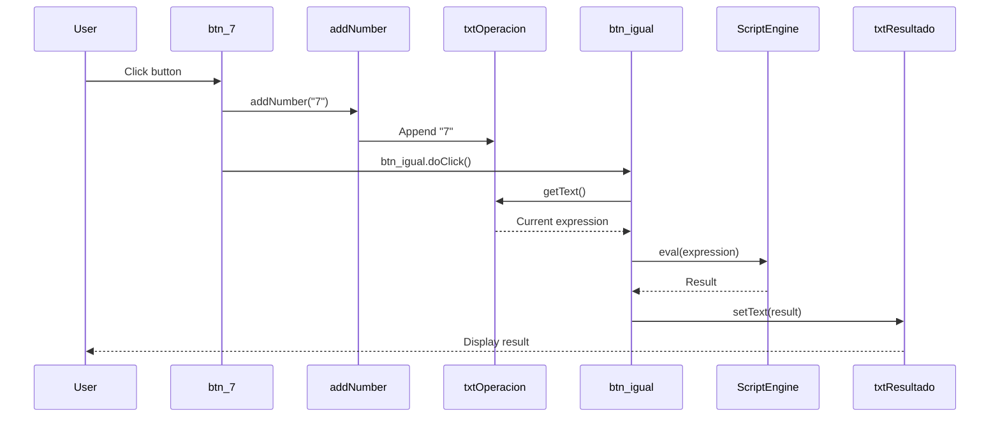
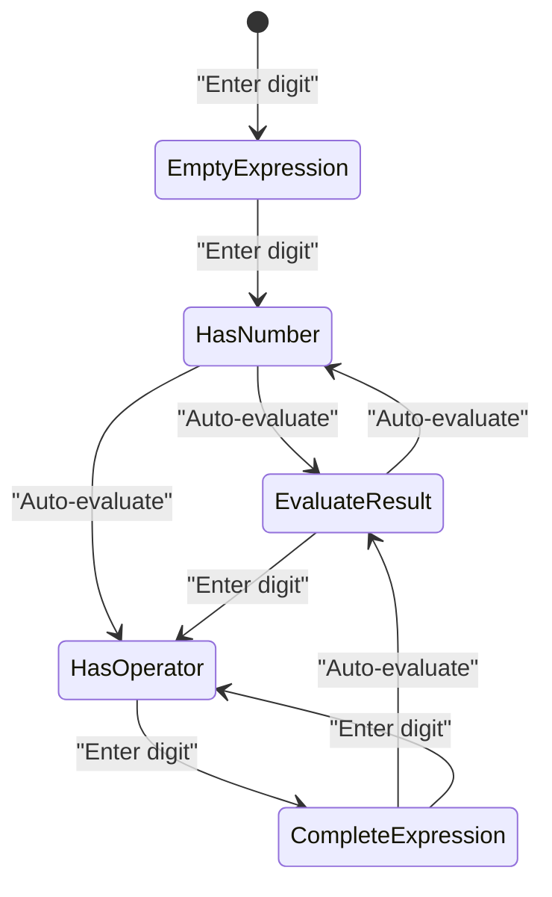

# Real-time Results

> **Relevant source files**
> * [README.md](https://github.com/ricardo-alan/SimpleCalculator/blob/e9524f29/README.md)
> * [src/calculadora/Calculadora.form](https://github.com/ricardo-alan/SimpleCalculator/blob/e9524f29/src/calculadora/Calculadora.form)
> * [src/calculadora/Calculadora.java](https://github.com/ricardo-alan/SimpleCalculator/blob/e9524f29/src/calculadora/Calculadora.java)

## Purpose and Scope

This document describes the "results as you type" feature of the SimpleCalculator application, which provides immediate visual feedback by evaluating and displaying mathematical results as users input numbers and operations. This feature eliminates the need for users to explicitly press the equals button after entering each digit.

For information about the calculation engine that powers this feature, see [Calculation Engine](/ricardo-alan/SimpleCalculator/4.3-calculation-engine). For details on the event handling architecture, see [Event Handling](/ricardo-alan/SimpleCalculator/4.4-event-handling).

## Overview

The real-time results feature is implemented through an automatic evaluation mechanism that triggers calculation updates after specific user interactions. Unlike traditional calculators that require an explicit "equals" action, this calculator evaluates the current expression and displays the result immediately after most number inputs, creating a responsive and fluid user experience.

The feature operates on two primary display components:

* **txtOperacion** (`JLabel`) - Shows the complete mathematical expression being built
* **txtResultado** (`JLabel`) - Shows the evaluated result of the current expression

**Sources:** [README.md L14](https://github.com/ricardo-alan/SimpleCalculator/blob/e9524f29/README.md#L14-L14)

 [src/calculadora/Calculadora.java L26-L27](https://github.com/ricardo-alan/SimpleCalculator/blob/e9524f29/src/calculadora/Calculadora.java#L26-L27)

 [src/calculadora/Calculadora.java L61-L69](https://github.com/ricardo-alan/SimpleCalculator/blob/e9524f29/src/calculadora/Calculadora.java#L61-L69)

## Architecture Overview

```

```

**Diagram: Real-time Evaluation Flow**

The diagram shows how user inputs flow through the system. Number buttons trigger both text appending and automatic evaluation, while operator buttons only append text without triggering evaluation.

**Sources:** [src/calculadora/Calculadora.java L425-L494](https://github.com/ricardo-alan/SimpleCalculator/blob/e9524f29/src/calculadora/Calculadora.java#L425-L494)

 [src/calculadora/Calculadora.java L496-L505](https://github.com/ricardo-alan/SimpleCalculator/blob/e9524f29/src/calculadora/Calculadora.java#L496-L505)

 [src/calculadora/Calculadora.java L611-L613](https://github.com/ricardo-alan/SimpleCalculator/blob/e9524f29/src/calculadora/Calculadora.java#L611-L613)

## Display Components

The calculator uses two `JLabel` components to provide visual feedback:

| Component | Type | Role | Location |
| --- | --- | --- | --- |
| `txtOperacion` | `JLabel` | Displays the input expression | [src/calculadora/Calculadora.java L26](https://github.com/ricardo-alan/SimpleCalculator/blob/e9524f29/src/calculadora/Calculadora.java#L26-L26) |
| `txtResultado` | `JLabel` | Displays the evaluated result | [src/calculadora/Calculadora.java L27](https://github.com/ricardo-alan/SimpleCalculator/blob/e9524f29/src/calculadora/Calculadora.java#L27-L27) |

### txtOperacion

This label shows the complete mathematical expression as the user builds it. It is updated by the `addNumber()` method, which concatenates new digits or operators to the existing text:

```
txtOperacion.setText(txtOperacion.getText() + digito);
```

Defined at [src/calculadora/Calculadora.java L611-L613](https://github.com/ricardo-alan/SimpleCalculator/blob/e9524f29/src/calculadora/Calculadora.java#L611-L613)

 and displayed at [src/calculadora/Calculadora.form L49-L64](https://github.com/ricardo-alan/SimpleCalculator/blob/e9524f29/src/calculadora/Calculadora.form#L49-L64)

### txtResultado

This label shows the evaluated result of the current expression. It is updated by the `btn_igualActionPerformed()` method after successful expression evaluation:

```
String resultado = se.eval(txtOperacion.getText()).toString();
txtResultado.setText(resultado);
```

Defined at [src/calculadora/Calculadora.java L498-L499](https://github.com/ricardo-alan/SimpleCalculator/blob/e9524f29/src/calculadora/Calculadora.java#L498-L499)

 and displayed at [src/calculadora/Calculadora.form L65-L80](https://github.com/ricardo-alan/SimpleCalculator/blob/e9524f29/src/calculadora/Calculadora.form#L65-L80)

**Sources:** [src/calculadora/Calculadora.java L26-L27](https://github.com/ricardo-alan/SimpleCalculator/blob/e9524f29/src/calculadora/Calculadora.java#L26-L27)

 [src/calculadora/Calculadora.java L61-L69](https://github.com/ricardo-alan/SimpleCalculator/blob/e9524f29/src/calculadora/Calculadora.java#L61-L69)

 [src/calculadora/Calculadora.java L611-L613](https://github.com/ricardo-alan/SimpleCalculator/blob/e9524f29/src/calculadora/Calculadora.java#L611-L613)

## Automatic Evaluation Mechanism

The core of the real-time results feature is the programmatic triggering of the equals button after certain user actions. This is achieved through the `doClick()` method, which simulates a button press without user interaction.



**Diagram: Automatic Evaluation Sequence**

This sequence shows how clicking a number button (btn_7 as example) triggers both text appending and automatic evaluation through programmatic button clicking.

**Sources:** [src/calculadora/Calculadora.java L430-L433](https://github.com/ricardo-alan/SimpleCalculator/blob/e9524f29/src/calculadora/Calculadora.java#L430-L433)

 [src/calculadora/Calculadora.java L496-L505](https://github.com/ricardo-alan/SimpleCalculator/blob/e9524f29/src/calculadora/Calculadora.java#L496-L505)

## Selective Auto-Evaluation

Not all button interactions trigger automatic evaluation. The system distinguishes between inputs that should immediately show results and those that should not.

### Buttons That Trigger Auto-Evaluation

The following buttons call `btn_igual.doClick()` after adding their symbol:

| Button | Symbol | Action Handler | Code Reference |
| --- | --- | --- | --- |
| btn_0 | "0" | `btn_0ActionPerformed` | [src/calculadora/Calculadora.java L425-L428](https://github.com/ricardo-alan/SimpleCalculator/blob/e9524f29/src/calculadora/Calculadora.java#L425-L428) |
| btn_1 | "1" | `btn_1ActionPerformed` | [src/calculadora/Calculadora.java L476-L479](https://github.com/ricardo-alan/SimpleCalculator/blob/e9524f29/src/calculadora/Calculadora.java#L476-L479) |
| btn_2 | "2" | `btn_2ActionPerformed` | [src/calculadora/Calculadora.java L481-L484](https://github.com/ricardo-alan/SimpleCalculator/blob/e9524f29/src/calculadora/Calculadora.java#L481-L484) |
| btn_3 | "3" | `btn_3ActionPerformed` | [src/calculadora/Calculadora.java L486-L489](https://github.com/ricardo-alan/SimpleCalculator/blob/e9524f29/src/calculadora/Calculadora.java#L486-L489) |
| btn_4 | "4" | `btn_4ActionPerformed` | [src/calculadora/Calculadora.java L461-L464](https://github.com/ricardo-alan/SimpleCalculator/blob/e9524f29/src/calculadora/Calculadora.java#L461-L464) |
| btn_5 | "5" | `btn_5ActionPerformed` | [src/calculadora/Calculadora.java L466-L469](https://github.com/ricardo-alan/SimpleCalculator/blob/e9524f29/src/calculadora/Calculadora.java#L466-L469) |
| btn_6 | "6" | `btn_6ActionPerformed` | [src/calculadora/Calculadora.java L471-L474](https://github.com/ricardo-alan/SimpleCalculator/blob/e9524f29/src/calculadora/Calculadora.java#L471-L474) |
| btn_7 | "7" | `btn_7ActionPerformed` | [src/calculadora/Calculadora.java L430-L433](https://github.com/ricardo-alan/SimpleCalculator/blob/e9524f29/src/calculadora/Calculadora.java#L430-L433) |
| btn_8 | "8" | `btn_8ActionPerformed` | [src/calculadora/Calculadora.java L456-L459](https://github.com/ricardo-alan/SimpleCalculator/blob/e9524f29/src/calculadora/Calculadora.java#L456-L459) |
| btn_9 | "9" | `btn_9ActionPerformed` | [src/calculadora/Calculadora.java L451-L454](https://github.com/ricardo-alan/SimpleCalculator/blob/e9524f29/src/calculadora/Calculadora.java#L451-L454) |
| btn_dot | "." | `btn_dotActionPerformed` | [src/calculadora/Calculadora.java L491-L494](https://github.com/ricardo-alan/SimpleCalculator/blob/e9524f29/src/calculadora/Calculadora.java#L491-L494) |
| btn_exp | (backspace) | `btn_expActionPerformed` | [src/calculadora/Calculadora.java L435-L439](https://github.com/ricardo-alan/SimpleCalculator/blob/e9524f29/src/calculadora/Calculadora.java#L435-L439) |

### Buttons That Do NOT Trigger Auto-Evaluation

The following buttons only call `addNumber()` without triggering evaluation:

| Button | Symbol | Action Handler | Code Reference |
| --- | --- | --- | --- |
| btn_suma | "+" | `btn_sumaActionPerformed` | [src/calculadora/Calculadora.java L507-L509](https://github.com/ricardo-alan/SimpleCalculator/blob/e9524f29/src/calculadora/Calculadora.java#L507-L509) |
| btn_resta | "-" | `btn_restaActionPerformed` | [src/calculadora/Calculadora.java L511-L513](https://github.com/ricardo-alan/SimpleCalculator/blob/e9524f29/src/calculadora/Calculadora.java#L511-L513) |
| btn_multi | "X" (becomes "*") | `btn_multiActionPerformed` | [src/calculadora/Calculadora.java L446-L449](https://github.com/ricardo-alan/SimpleCalculator/blob/e9524f29/src/calculadora/Calculadora.java#L446-L449) |
| btn_division | "/" | `btn_divisionActionPerformed` | [src/calculadora/Calculadora.java L441-L444](https://github.com/ricardo-alan/SimpleCalculator/blob/e9524f29/src/calculadora/Calculadora.java#L441-L444) |
| btn_porcentaje | "%" | `btn_porcentajeActionPerformed` | [src/calculadora/Calculadora.java L415-L418](https://github.com/ricardo-alan/SimpleCalculator/blob/e9524f29/src/calculadora/Calculadora.java#L415-L418) |

This design choice prevents incomplete expressions (e.g., "5+") from being evaluated, which would result in syntax errors. The result is only updated after the user enters the next operand.

**Sources:** [src/calculadora/Calculadora.java L415-L513](https://github.com/ricardo-alan/SimpleCalculator/blob/e9524f29/src/calculadora/Calculadora.java#L415-L513)



**Diagram: Expression State Machine**

This state diagram illustrates how the calculator transitions between states based on user input, showing when auto-evaluation occurs (only after entering numbers, not operators).

**Sources:** [src/calculadora/Calculadora.java L425-L513](https://github.com/ricardo-alan/SimpleCalculator/blob/e9524f29/src/calculadora/Calculadora.java#L425-L513)

## Expression Evaluation Engine

The real-time results feature relies on the JavaScript ScriptEngine for expression evaluation. This engine is initialized at the class level:

```

```

Located at [src/calculadora/Calculadora.java L13-L14](https://github.com/ricardo-alan/SimpleCalculator/blob/e9524f29/src/calculadora/Calculadora.java#L13-L14)

### Evaluation Process

The `btn_igualActionPerformed()` method handles the evaluation:

```

```

Located at [src/calculadora/Calculadora.java L496-L505](https://github.com/ricardo-alan/SimpleCalculator/blob/e9524f29/src/calculadora/Calculadora.java#L496-L505)

### Key Characteristics

1. **Synchronous Evaluation**: The ScriptEngine evaluates expressions synchronously on the Event Dispatch Thread (EDT)
2. **JavaScript Syntax**: The engine uses JavaScript syntax, so "X" operators are internally converted to "*" by the button handlers
3. **Immediate Feedback**: Results appear instantly due to the lightweight nature of simple arithmetic evaluation
4. **Expression Context**: Each evaluation is stateless; the complete expression text is evaluated fresh each time

**Sources:** [src/calculadora/Calculadora.java L13-L14](https://github.com/ricardo-alan/SimpleCalculator/blob/e9524f29/src/calculadora/Calculadora.java#L13-L14)

 [src/calculadora/Calculadora.java L496-L505](https://github.com/ricardo-alan/SimpleCalculator/blob/e9524f29/src/calculadora/Calculadora.java#L496-L505)

## Error Handling

The real-time evaluation system includes basic error handling to prevent the application from crashing when users enter invalid expressions:

```

```

Located at [src/calculadora/Calculadora.java L497-L502](https://github.com/ricardo-alan/SimpleCalculator/blob/e9524f29/src/calculadora/Calculadora.java#L497-L502)

### Error Behavior

| Scenario | Expression Example | Behavior |
| --- | --- | --- |
| Incomplete operator | "5+" | No result displayed, no error shown |
| Division by zero | "5/0" | Exception caught silently, previous result remains |
| Invalid syntax | "5++3" | Exception caught silently, previous result remains |
| Empty expression | "" | Exception caught silently, no result displayed |

The system uses **silent failure** - when evaluation fails, the previous result remains in `txtResultado`, providing visual continuity without error messages that could disrupt the user experience.

**Sources:** [src/calculadora/Calculadora.java L496-L505](https://github.com/ricardo-alan/SimpleCalculator/blob/e9524f29/src/calculadora/Calculadora.java#L496-L505)

## Button Implementation Patterns

### Pattern 1: Number Buttons with Auto-Evaluation

All numeric buttons (0-9) and the decimal point follow this pattern:

```

```

Example: [src/calculadora/Calculadora.java L430-L433](https://github.com/ricardo-alan/SimpleCalculator/blob/e9524f29/src/calculadora/Calculadora.java#L430-L433)

### Pattern 2: Operator Buttons without Auto-Evaluation

All operator buttons (+, -, *, /, %) follow this pattern:

```

```

Example: [src/calculadora/Calculadora.java L507-L509](https://github.com/ricardo-alan/SimpleCalculator/blob/e9524f29/src/calculadora/Calculadora.java#L507-L509)

### Pattern 3: Backspace with Auto-Evaluation

The backspace button removes the last character and re-evaluates:

```

```

Located at [src/calculadora/Calculadora.java L435-L439](https://github.com/ricardo-alan/SimpleCalculator/blob/e9524f29/src/calculadora/Calculadora.java#L435-L439)

**Sources:** [src/calculadora/Calculadora.java L425-L513](https://github.com/ricardo-alan/SimpleCalculator/blob/e9524f29/src/calculadora/Calculadora.java#L425-L513)

## Performance Considerations

The real-time evaluation system performs efficiently for typical calculator operations:

1. **Evaluation Speed**: JavaScript ScriptEngine evaluation for simple arithmetic expressions completes in microseconds
2. **EDT Blocking**: Evaluation occurs on the Event Dispatch Thread, but the duration is negligible for calculator operations
3. **No Debouncing**: The system evaluates on every number input without debouncing, relying on the speed of the ScriptEngine
4. **Memory Impact**: No expression history is maintained; each evaluation is independent

The simplicity of the evaluation mechanism (direct string evaluation without parsing or tokenization) ensures that the real-time feature remains responsive even with rapid user input.

**Sources:** [src/calculadora/Calculadora.java L13-L14](https://github.com/ricardo-alan/SimpleCalculator/blob/e9524f29/src/calculadora/Calculadora.java#L13-L14)

 [src/calculadora/Calculadora.java L496-L505](https://github.com/ricardo-alan/SimpleCalculator/blob/e9524f29/src/calculadora/Calculadora.java#L496-L505)

## Clear and Reset Functionality

The clear button (`btn_c`) resets both display components:

```

```

Located at [src/calculadora/Calculadora.java L420-L423](https://github.com/ricardo-alan/SimpleCalculator/blob/e9524f29/src/calculadora/Calculadora.java#L420-L423)

This provides users with a way to start fresh without needing to backspace through the entire expression.

**Sources:** [src/calculadora/Calculadora.java L420-L423](https://github.com/ricardo-alan/SimpleCalculator/blob/e9524f29/src/calculadora/Calculadora.java#L420-L423)

## Integration with UI Components

The real-time results feature is tightly integrated with the Swing UI components defined in the form definition. The display labels are configured with specific visual properties:

* **txtOperacion**: Font "Montserrat Alternates Light" size 18, right-aligned at [src/calculadora/Calculadora.form L49-L64](https://github.com/ricardo-alan/SimpleCalculator/blob/e9524f29/src/calculadora/Calculadora.form#L49-L64)
* **txtResultado**: Font "Montserrat Alternates SemiBold" size 48, right-aligned at [src/calculadora/Calculadora.form L65-L80](https://github.com/ricardo-alan/SimpleCalculator/blob/e9524f29/src/calculadora/Calculadora.form#L65-L80)

The large size difference between the two labels creates a clear visual hierarchy, emphasizing the evaluated result while keeping the expression visible for reference.

**Sources:** [src/calculadora/Calculadora.form L49-L80](https://github.com/ricardo-alan/SimpleCalculator/blob/e9524f29/src/calculadora/Calculadora.form#L49-L80)