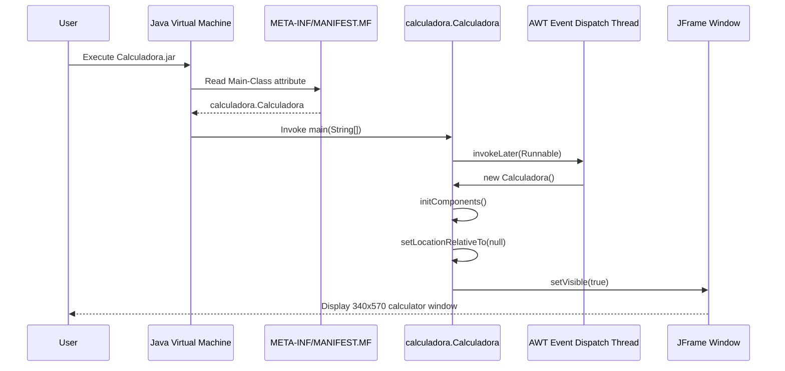
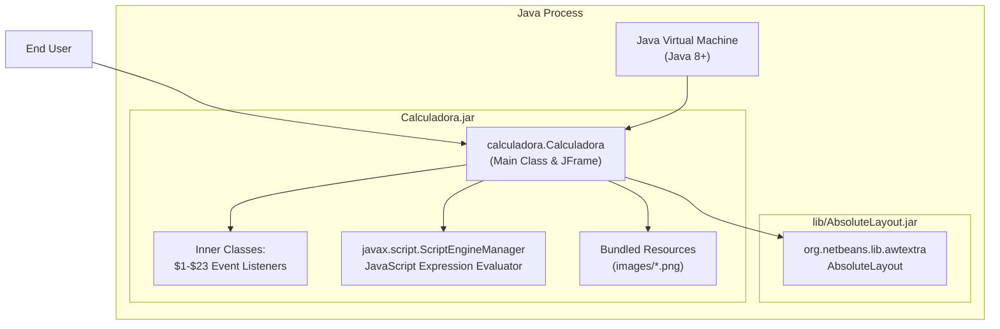
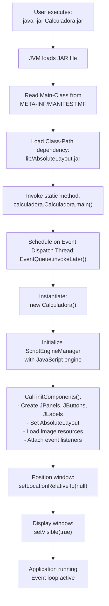

# Running the Application

> **Relevant source files**
> * [README.md](https://github.com/ricardo-alan/SimpleCalculator/blob/e9524f29/README.md)
> * [dist/Calculadora.jar](https://github.com/ricardo-alan/SimpleCalculator/blob/e9524f29/dist/Calculadora.jar)
> * [manifest.mf](https://github.com/ricardo-alan/SimpleCalculator/blob/e9524f29/manifest.mf)

This page provides instructions for executing the pre-built SimpleCalculator application using the compiled JAR file located in the `dist/` directory. This guide is intended for end users who want to run the calculator without building from source. For information about setting up a development environment, see [Development Setup](/ricardo-alan/SimpleCalculator/2.2-development-setup). For details on the build process that creates the JAR file, see [Build System](/ricardo-alan/SimpleCalculator/5-build-system).

## Purpose and Scope

This document covers:

* System requirements and prerequisites
* Location and structure of distribution artifacts
* Methods for launching the application
* Expected behavior on startup
* Common execution issues and solutions

## Prerequisites

The SimpleCalculator application requires a Java Runtime Environment (JRE) to execute. The application is compiled with Java 8 compatibility and requires **Java 8 or higher** to run.

| Requirement | Specification |
| --- | --- |
| Java Version | Java 8 (1.8) or higher |
| Operating System | Windows, macOS, Linux (any platform with JVM support) |
| Memory | Minimal (standard Swing application) |
| Display | GUI requires graphical display environment |

**Sources:** [dist/Calculadora.jar L3-L8](https://github.com/ricardo-alan/SimpleCalculator/blob/e9524f29/dist/Calculadora.jar#L3-L8)

 [README.md L1-L32](https://github.com/ricardo-alan/SimpleCalculator/blob/e9524f29/README.md#L1-L32)

## Distribution Artifacts Structure

The compiled application resides in the `dist/` directory with the following structure:

```

```

**Distribution Components:**

* **`dist/Calculadora.jar`**: The main executable JAR file containing the compiled application classes and bundled image resources
* **`dist/lib/AbsoluteLayout.jar`**: The NetBeans AbsoluteLayout library required for UI component positioning

The manifest file embedded in `Calculadora.jar` specifies:

* `Main-Class: calculadora.Calculadora` - The entry point class
* `Class-Path: lib/AbsoluteLayout.jar` - The relative path to the required dependency

**Sources:** [dist/Calculadora.jar L1-L519](https://github.com/ricardo-alan/SimpleCalculator/blob/e9524f29/dist/Calculadora.jar#L1-L519)

 [dist/Calculadora.jar L3-L8](https://github.com/ricardo-alan/SimpleCalculator/blob/e9524f29/dist/Calculadora.jar#L3-L8)

 [README.md L23](https://github.com/ricardo-alan/SimpleCalculator/blob/e9524f29/README.md#L23-L23)

## Execution Methods

### Method 1: GUI Double-Click (Recommended)

For most users with a properly configured Java installation, the simplest method is to double-click the JAR file:

1. Navigate to the `dist/` directory in your file explorer
2. Double-click `Calculadora.jar`
3. The calculator window should appear immediately

**Note:** This method requires that `.jar` files are associated with the Java runtime in your operating system. If double-clicking opens an archive manager instead, use Method 2.

### Method 2: Command Line Execution

For more control or when file associations are not configured, use the command line:

```

```

The `java -jar` command instructs the JVM to:

1. Load the specified JAR file
2. Read the `Main-Class` attribute from `META-INF/MANIFEST.MF`
3. Invoke `calculadora.Calculadora.main(String[])`
4. Load dependencies from the `Class-Path` specification

**Sources:** [dist/Calculadora.jar L3-L8](https://github.com/ricardo-alan/SimpleCalculator/blob/e9524f29/dist/Calculadora.jar#L3-L8)

 [README.md L23](https://github.com/ricardo-alan/SimpleCalculator/blob/e9524f29/README.md#L23-L23)

## Application Startup Sequence



**Key Initialization Steps:**

1. **JVM Startup**: The Java Virtual Machine loads the JAR and its manifest
2. **Main Method Invocation**: `calculadora.Calculadora.main(String[])` is called
3. **Event Dispatch Thread**: The Swing UI is created on the AWT Event Dispatch Thread using `EventQueue.invokeLater()`
4. **Component Initialization**: The `initComponents()` method constructs all UI elements (panels, buttons, labels)
5. **Window Positioning**: `setLocationRelativeTo(null)` centers the window on screen
6. **Visibility**: The undecorated, non-resizable JFrame appears at 340x570 pixels

**Sources:** [dist/Calculadora.jar L256-L519](https://github.com/ricardo-alan/SimpleCalculator/blob/e9524f29/dist/Calculadora.jar#L256-L519)

 [README.md L1-L32](https://github.com/ricardo-alan/SimpleCalculator/blob/e9524f29/README.md#L1-L32)

## Application Runtime Architecture



**Runtime Components:**

* **`calculadora.Calculadora`**: The main class extending `JFrame`, containing all UI logic and event handling
* **Event Listeners**: 23 inner classes (`Calculadora$1` through `Calculadora$23`) implementing `ActionListener` and `MouseAdapter`
* **`ScriptEngineManager`**: Initialized to obtain a JavaScript engine for expression evaluation
* **`AbsoluteLayout`**: Provides pixel-perfect component positioning for the fixed-size window
* **Image Resources**: PNG files loaded from the `images/` package for buttons and theme icons

**Sources:** [dist/Calculadora.jar L256-L519](https://github.com/ricardo-alan/SimpleCalculator/blob/e9524f29/dist/Calculadora.jar#L256-L519)

 [dist/Calculadora.jar L3-L8](https://github.com/ricardo-alan/SimpleCalculator/blob/e9524f29/dist/Calculadora.jar#L3-L8)

## Expected Behavior on Launch

When the application starts successfully:

1. **Window Appearance**: An undecorated window (340x570 pixels) appears, centered on screen
2. **Default Theme**: Light mode is active by default (`modoOscuro = false`)
3. **Display State**: Both `txtOperacion` and `txtResultado` labels are empty
4. **Interactive Elements**: * Number buttons (0-9) are clickable * Operation buttons (+, -, X, /, %) are functional * Dark mode toggle button is visible in the top-right * Close and minimize buttons (custom controls) are operational
5. **Immediate Responsiveness**: The "Results as you type" feature is active—calculations update in real-time as operations are entered

**Sources:** [README.md L9-L14](https://github.com/ricardo-alan/SimpleCalculator/blob/e9524f29/README.md#L9-L14)

 [dist/Calculadora.jar L256-L519](https://github.com/ricardo-alan/SimpleCalculator/blob/e9524f29/dist/Calculadora.jar#L256-L519)

## Troubleshooting

### Issue: "Java not found" or "java is not recognized"

**Symptom**: Command line execution fails with "java: command not found"

**Solution**:

* Verify Java is installed: `java -version`
* If not installed, download and install JDK/JRE 8 or higher
* Ensure the Java `bin` directory is in your system PATH

### Issue: "Could not find or load main class"

**Symptom**: Error message when executing JAR file

**Solution**:

* Ensure you're in the `dist/` directory or providing the correct path
* Verify the `lib/` subdirectory exists alongside `Calculadora.jar`
* Check that `lib/AbsoluteLayout.jar` is present (required dependency)

### Issue: Double-click opens archive manager instead of running

**Symptom**: JAR file opens in WinRAR, 7-Zip, or similar

**Solution**:

* Use command line execution (Method 2) instead
* Or reconfigure file associations to use Java runtime for `.jar` files

### Issue: Window appears then immediately closes

**Symptom**: Brief flash of window, then disappears

**Solution**:

* Run from command line to see error output
* Likely indicates missing dependency (`AbsoluteLayout.jar`) or Java version mismatch
* Verify Java version is 8 or higher: `java -version`

### Issue: "Exception in thread 'AWT-EventQueue-0'"

**Symptom**: Runtime errors related to ScriptEngine or UI components

**Solution**:

* Ensure full JDK is installed (not just JRE), as JavaScript ScriptEngine may require tools.jar
* Verify display environment is available (required for Swing GUI)

**Sources:** [dist/Calculadora.jar L3-L8](https://github.com/ricardo-alan/SimpleCalculator/blob/e9524f29/dist/Calculadora.jar#L3-L8)

 [dist/Calculadora.jar L256-L519](https://github.com/ricardo-alan/SimpleCalculator/blob/e9524f29/dist/Calculadora.jar#L256-L519)

## Execution Flow Diagram



**Sources:** [dist/Calculadora.jar L256-L519](https://github.com/ricardo-alan/SimpleCalculator/blob/e9524f29/dist/Calculadora.jar#L256-L519)

 [dist/Calculadora.jar L3-L8](https://github.com/ricardo-alan/SimpleCalculator/blob/e9524f29/dist/Calculadora.jar#L3-L8)

 [README.md L23](https://github.com/ricardo-alan/SimpleCalculator/blob/e9524f29/README.md#L23-L23)

## Related Topics

* For development environment setup and building from source, see [Development Setup](/ricardo-alan/SimpleCalculator/2.2-development-setup)
* For details on the build process and JAR creation, see [Build System](/ricardo-alan/SimpleCalculator/5-build-system)
* For information about the distribution process, see [Distribution and Packaging](/ricardo-alan/SimpleCalculator/5.3-distribution-and-packaging)
* For application features and functionality, see [Features](/ricardo-alan/SimpleCalculator/3-features)