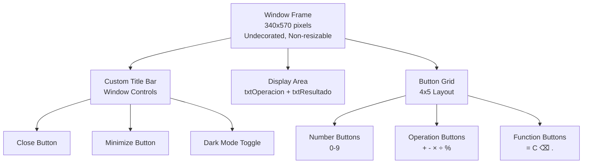
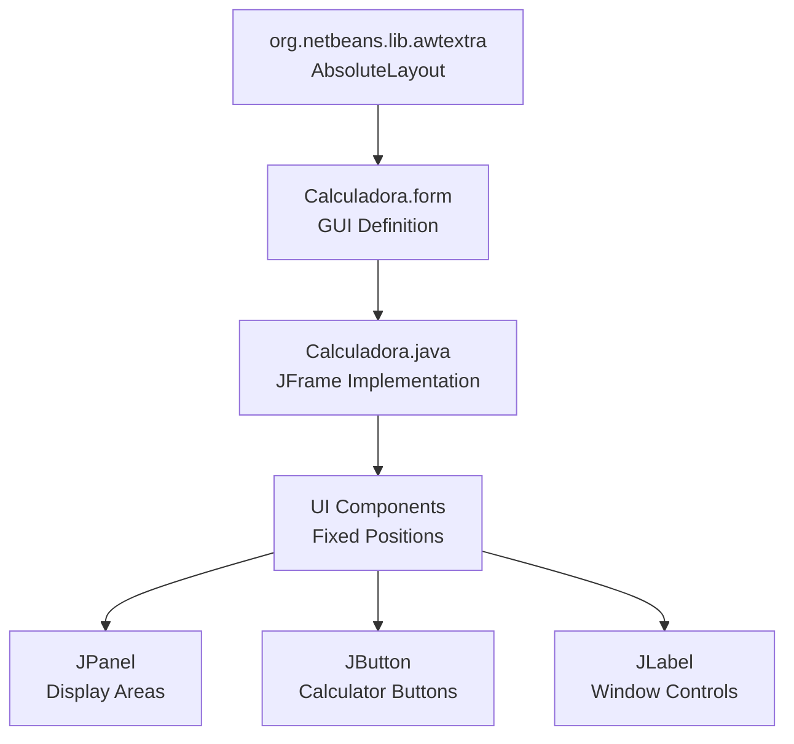
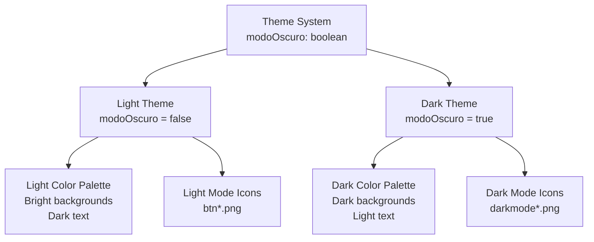
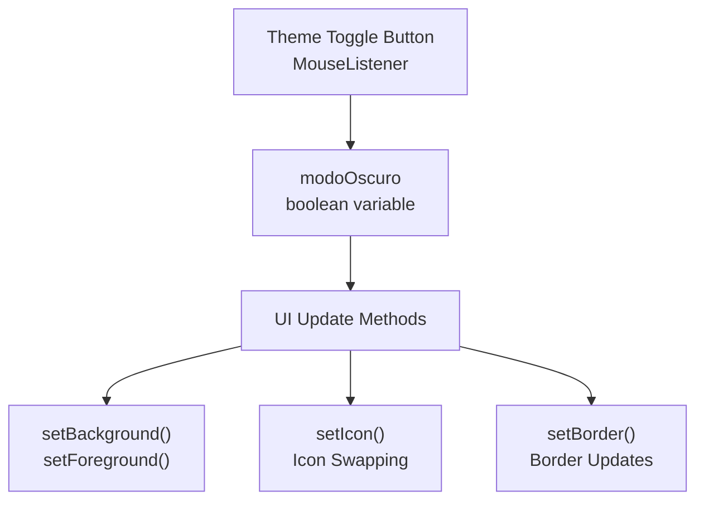
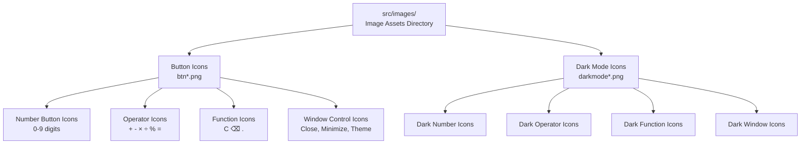
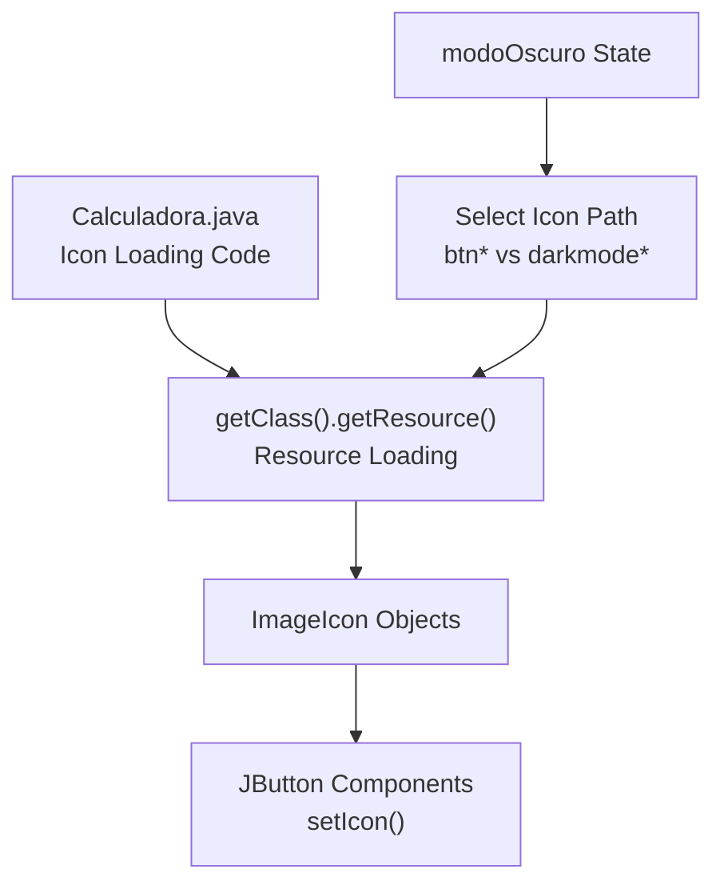
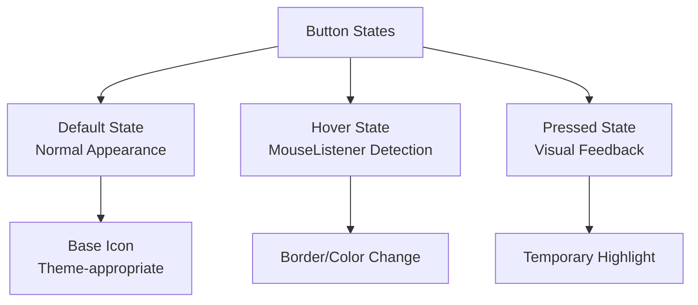
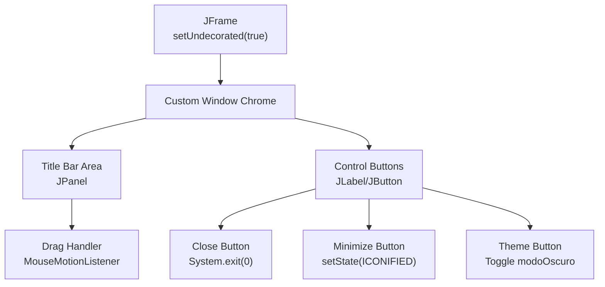
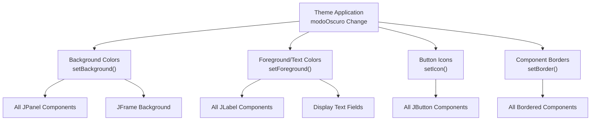
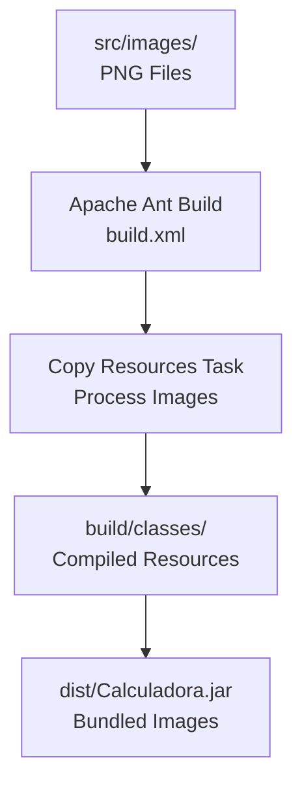

# Screenshots and Visual Design

> **Relevant source files**
> * [README.md](https://github.com/ricardo-alan/SimpleCalculator/blob/e9524f29/README.md)
> * [screenshots/dark.png](https://github.com/ricardo-alan/SimpleCalculator/blob/e9524f29/screenshots/dark.png)
> * [screenshots/light.png](https://github.com/ricardo-alan/SimpleCalculator/blob/e9524f29/screenshots/light.png)

## Purpose and Scope

This page provides visual documentation of the SimpleCalculator's user interface, covering the application's appearance in both light and dark modes, design specifications, theme system implementation, and UI asset organization. For information about the underlying UI component architecture, see [User Interface Components](/ricardo-alan/SimpleCalculator/4.2-user-interface-components). For details on the theme switching implementation logic, see [Application Structure](/ricardo-alan/SimpleCalculator/4.1-application-structure).

## Visual Appearance Overview

The SimpleCalculator features a modern, clean interface with two distinct visual themes. The application presents a fixed-size calculator window with a custom title bar and displays mathematical operations and results in real-time.

### Application Screenshots

The calculator is available in two visual modes:

**Light Mode (Default)**

The light mode features a bright color scheme with high contrast for readability. This is the default theme when the application launches.

**Dark Mode**

The dark mode provides a darker color palette designed for reduced eye strain in low-light environments. Users can toggle between modes using the theme button in the window controls.

**Sources:** [README.md L5](https://github.com/ricardo-alan/SimpleCalculator/blob/e9524f29/README.md#L5-L5)

 [screenshots/light.png](https://github.com/ricardo-alan/SimpleCalculator/blob/e9524f29/screenshots/light.png)

 [screenshots/dark.png](https://github.com/ricardo-alan/SimpleCalculator/blob/e9524f29/screenshots/dark.png)

## Design Specifications

### Window Dimensions and Layout

The application uses a fixed window size of **340 pixels wide by 570 pixels tall**. The window is non-resizable to ensure consistent layout and appearance across all platforms.

| Component | Specification |
| --- | --- |
| Window Size | 340 × 570 pixels |
| Resizable | No (fixed size) |
| Frame Decoration | Undecorated (custom title bar) |
| Layout Manager | AbsoluteLayout |
| Display Panels | 2 (operation + result) |
| Button Count | 19 (numbers, operations, functions) |

**Sources:** [README.md L11-L14](https://github.com/ricardo-alan/SimpleCalculator/blob/e9524f29/README.md#L11-L14)

 [src/calculadora/Calculadora.form](https://github.com/ricardo-alan/SimpleCalculator/blob/e9524f29/src/calculadora/Calculadora.form)

### Layout System

The calculator uses the NetBeans AbsoluteLayout library for pixel-perfect component positioning. This allows precise control over button placement and sizing within the fixed window dimensions.

**Sources:** [dist/lib/AbsoluteLayout.jar](https://github.com/ricardo-alan/SimpleCalculator/blob/e9524f29/dist/lib/AbsoluteLayout.jar)

 [src/calculadora/Calculadora.form](https://github.com/ricardo-alan/SimpleCalculator/blob/e9524f29/src/calculadora/Calculadora.form)

## Theme System Architecture

### Color Schemes

The application implements two complete color schemes that affect all visual elements:

**Light Mode Color Scheme:**

* Background: Light/bright tones
* Text: Dark/high contrast
* Buttons: Varied colors for different functions
* Borders: Subtle, light

**Dark Mode Color Scheme:**

* Background: Dark tones
* Text: Light/white for readability
* Buttons: Muted, darker variants
* Borders: Darker, subdued

**Sources:** [src/calculadora/Calculadora.java](https://github.com/ricardo-alan/SimpleCalculator/blob/e9524f29/src/calculadora/Calculadora.java)

 [src/images/](https://github.com/ricardo-alan/SimpleCalculator/blob/e9524f29/src/images/)

### Theme Toggle Implementation

The theme system is controlled by a boolean state variable and affects multiple UI components:

The theme toggle is implemented through:

1. **State Variable:** The `modoOscuro` boolean tracks the current theme state
2. **Event Handler:** Mouse click listener on the theme button
3. **UI Updates:** Methods that update colors, icons, and borders for all components
4. **Icon Swapping:** Loads different icon sets based on theme state

**Sources:** [src/calculadora/Calculadora.java](https://github.com/ricardo-alan/SimpleCalculator/blob/e9524f29/src/calculadora/Calculadora.java)

## UI Asset Organization

### Image Resource Structure

All image assets are stored in the `src/images/` directory and bundled into the JAR during the build process. The naming convention distinguishes between light and dark mode assets:

| Asset Type | Light Mode Pattern | Dark Mode Pattern |
| --- | --- | --- |
| Number Buttons | `btn0.png` - `btn9.png` | `darkmode0.png` - `darkmode9.png` |
| Operator Buttons | `btnPlus.png`, `btnMinus.png`, etc. | `darkmodePlus.png`, `darkmodeMinus.png`, etc. |
| Function Buttons | `btnClear.png`, `btnDelete.png`, etc. | `darkmodeClear.png`, `darkmodeDelete.png`, etc. |
| Window Controls | `btnClose.png`, `btnMinimize.png`, etc. | `darkmodeClose.png`, `darkmodeMinimize.png`, etc. |

**Sources:** [src/images/](https://github.com/ricardo-alan/SimpleCalculator/blob/e9524f29/src/images/)

 [README.md L11-L12](https://github.com/ricardo-alan/SimpleCalculator/blob/e9524f29/README.md#L11-L12)

### Icon Loading Mechanism

Icons are loaded as resources using the Java resource loading mechanism. The application uses `getClass().getResource()` to load PNG files from the classpath. During theme switching, the icon paths are dynamically selected based on the `modoOscuro` boolean state.

**Example Icon Path Resolution:**

* Light mode: `/images/btn0.png` → loaded from classpath
* Dark mode: `/images/darkmode0.png` → loaded from classpath
* JAR packaging: Images bundled at `/calculadora/images/` within JAR

**Sources:** [src/calculadora/Calculadora.java](https://github.com/ricardo-alan/SimpleCalculator/blob/e9524f29/src/calculadora/Calculadora.java)

 [src/images/](https://github.com/ricardo-alan/SimpleCalculator/blob/e9524f29/src/images/)

## Visual Design Patterns

### Button State Visualization

The calculator buttons implement visual feedback for user interactions:

**Visual Feedback Mechanisms:**

1. **MouseListener Events:** Detect hover and click states
2. **Border Changes:** Visual feedback during interaction
3. **Icon States:** Some buttons may have multiple icon states
4. **Color Transitions:** Background/foreground color adjustments

**Sources:** [src/calculadora/Calculadora.java](https://github.com/ricardo-alan/SimpleCalculator/blob/e9524f29/src/calculadora/Calculadora.java)

### Display Panel Design

The calculator features two display panels arranged vertically:

| Display Panel | Purpose | Styling |
| --- | --- | --- |
| `txtOperacion` | Shows the current mathematical expression being entered | Smaller font, displays full expression |
| `txtResultado` | Shows the real-time calculated result | Larger font, prominent display |

Both panels adapt their colors and text styling based on the active theme, ensuring consistent readability in both light and dark modes.

**Sources:** [src/calculadora/Calculadora.form](https://github.com/ricardo-alan/SimpleCalculator/blob/e9524f29/src/calculadora/Calculadora.form)

 [src/calculadora/Calculadora.java](https://github.com/ricardo-alan/SimpleCalculator/blob/e9524f29/src/calculadora/Calculadora.java)

## Window Chrome and Custom Controls

### Undecorated Frame Implementation

Since the application uses an undecorated JFrame, all window controls are custom-implemented:

**Custom Control Implementation:**

* **Window Dragging:** Implemented via MouseMotionListener on title bar panel
* **Close Button:** Calls `System.exit(0)` to terminate application
* **Minimize Button:** Calls `setState(JFrame.ICONIFIED)` to minimize
* **Theme Toggle:** Switches `modoOscuro` boolean and updates UI

The custom controls use the same theming system as the rest of the application, displaying appropriate icons and colors for the active theme.

**Sources:** [src/calculadora/Calculadora.java](https://github.com/ricardo-alan/SimpleCalculator/blob/e9524f29/src/calculadora/Calculadora.java)

 [src/calculadora/Calculadora.form](https://github.com/ricardo-alan/SimpleCalculator/blob/e9524f29/src/calculadora/Calculadora.form)

## Design Consistency

### Theme Application Scope

The theme system applies consistently across all UI elements:

**Consistent Theme Elements:**

* Window frame background
* Title bar and control button styling
* Display panel backgrounds and text colors
* All calculator button icons
* Button borders and hover effects
* Mathematical operator colors
* Function button styling

This comprehensive theming ensures that no UI element appears out of place when switching between light and dark modes.

**Sources:** [src/calculadora/Calculadora.java](https://github.com/ricardo-alan/SimpleCalculator/blob/e9524f29/src/calculadora/Calculadora.java)

## Build-Time Asset Processing

### Image Bundling

During the build process:

1. **Source Location:** Images stored in `src/images/`
2. **Build Processing:** Ant copies images to `build/classes/`
3. **JAR Packaging:** Images bundled into the executable JAR
4. **Runtime Access:** Loaded via classpath resources

This ensures that all visual assets are self-contained within the distributable JAR file, with no external file dependencies required at runtime.

**Sources:** [nbproject/build-impl.xml](https://github.com/ricardo-alan/SimpleCalculator/blob/e9524f29/nbproject/build-impl.xml)

 [src/images/](https://github.com/ricardo-alan/SimpleCalculator/blob/e9524f29/src/images/)

 [dist/Calculadora.jar](https://github.com/ricardo-alan/SimpleCalculator/blob/e9524f29/dist/Calculadora.jar)

---

**Page Sources:** [README.md L5-L14](https://github.com/ricardo-alan/SimpleCalculator/blob/e9524f29/README.md#L5-L14)

 [screenshots/light.png](https://github.com/ricardo-alan/SimpleCalculator/blob/e9524f29/screenshots/light.png)

 [screenshots/dark.png](https://github.com/ricardo-alan/SimpleCalculator/blob/e9524f29/screenshots/dark.png)

 [src/calculadora/Calculadora.java](https://github.com/ricardo-alan/SimpleCalculator/blob/e9524f29/src/calculadora/Calculadora.java)

 [src/calculadora/Calculadora.form](https://github.com/ricardo-alan/SimpleCalculator/blob/e9524f29/src/calculadora/Calculadora.form)

 [src/images/](https://github.com/ricardo-alan/SimpleCalculator/blob/e9524f29/src/images/)

 [dist/lib/AbsoluteLayout.jar](https://github.com/ricardo-alan/SimpleCalculator/blob/e9524f29/dist/lib/AbsoluteLayout.jar)