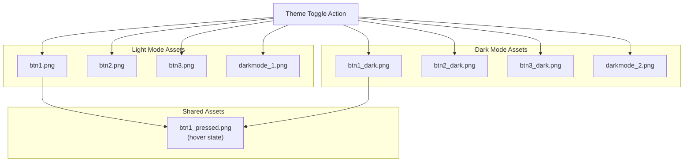
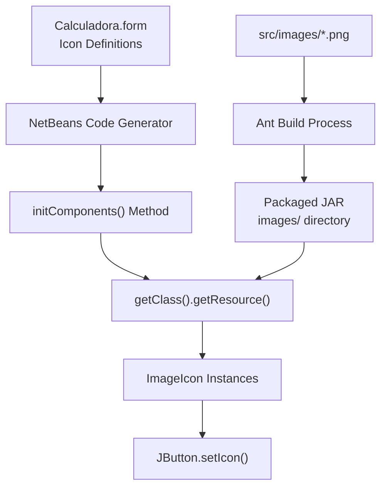

# UI Assets and Icons

> **Relevant source files**
> * [src/calculadora/Calculadora.form](https://github.com/ricardo-alan/SimpleCalculator/blob/e9524f29/src/calculadora/Calculadora.form)
> * [src/images/btn1.png](https://github.com/ricardo-alan/SimpleCalculator/blob/e9524f29/src/images/btn1.png)
> * [src/images/btn1_dark.png](https://github.com/ricardo-alan/SimpleCalculator/blob/e9524f29/src/images/btn1_dark.png)
> * [src/images/btn1_pressed.png](https://github.com/ricardo-alan/SimpleCalculator/blob/e9524f29/src/images/btn1_pressed.png)

This document provides comprehensive technical documentation of the visual assets used in the SimpleCalculator application, including button state icons, theme-specific graphics, and the resource loading mechanism. This covers the organization, naming conventions, and integration of image resources within the Swing-based user interface.

For information about the overall UI component architecture and layout management, see [User Interface Components](/ricardo-alan/SimpleCalculator/4.2-user-interface-components). For details on the theme switching logic and color management, see [Theme System](/ricardo-alan/SimpleCalculator/3.3-theme-system).

---

## Purpose and Scope

The SimpleCalculator application uses PNG image assets to create a custom, modern button appearance and support light/dark theme variants. This page documents:

* The complete inventory of image assets and their locations
* Button state mechanics (default, pressed, rollover) and associated icons
* Theme-specific asset variants for light and dark modes
* Resource path conventions and loading mechanisms
* Integration between `.form` definitions and runtime icon management

---

## Asset Organization

### Directory Structure

All visual assets are located in the `src/images/` directory and are packaged into the application JAR during the build process. The assets follow a structured naming convention to indicate their purpose and theme association.

```markdown
src/images/
├── btn1.png              # Primary button background (operations, light mode)
├── btn1_dark.png         # Primary button background (operations, dark mode)
├── btn1_pressed.png      # Button hover/rollover state
├── btn2.png              # Secondary button background (numbers, light mode)
├── btn2_dark.png         # Secondary button background (numbers, dark mode)
├── btn3.png              # Accent button background (equals, light mode)
├── btn3_dark.png         # Accent button background (equals, dark mode)
├── darkmode_1.png        # Dark mode toggle icon (light theme state)
└── darkmode_2.png        # Dark mode toggle icon (dark theme state)
```

**Sources:** [src/calculadora/Calculadora.form L84](https://github.com/ricardo-alan/SimpleCalculator/blob/e9524f29/src/calculadora/Calculadora.form#L84-L84)

 [src/calculadora/Calculadora.form L163](https://github.com/ricardo-alan/SimpleCalculator/blob/e9524f29/src/calculadora/Calculadora.form#L163-L163)

 [src/calculadora/Calculadora.form L196](https://github.com/ricardo-alan/SimpleCalculator/blob/e9524f29/src/calculadora/Calculadora.form#L196-L196)

---

## Button State Management

### State-Icon Mapping

The calculator implements three distinct visual states for each button, controlled through Swing's icon properties. The `.form` file defines these associations declaratively.

| Button State | Icon Property | Usage Pattern | Example Reference |
| --- | --- | --- | --- |
| **Default** | `icon` | Initial button appearance when idle | btn1.png, btn2.png, btn3.png |
| **Pressed** | `pressedIcon` | Appearance while button is actively pressed | btn1.png (all buttons) |
| **Hover/Rollover** | `rolloverIcon` | Appearance when mouse cursor hovers over button | btn1_pressed.png (all buttons) |

### Button Categories and Icon Assignments

```

```

**Sources:** [src/calculadora/Calculadora.form L154-L186](https://github.com/ricardo-alan/SimpleCalculator/blob/e9524f29/src/calculadora/Calculadora.form#L154-L186)

 [src/calculadora/Calculadora.form L187-L219](https://github.com/ricardo-alan/SimpleCalculator/blob/e9524f29/src/calculadora/Calculadora.form#L187-L219)

 [src/calculadora/Calculadora.form L418-L450](https://github.com/ricardo-alan/SimpleCalculator/blob/e9524f29/src/calculadora/Calculadora.form#L418-L450)

---

## Icon Property Definitions

### Number Button Example (btn_0)

The following properties from the `.form` file demonstrate the complete icon configuration for a number button:

```

```

The `iconType="3"` attribute indicates that these are classpath resources loaded from the JAR file at runtime.

**Sources:** [src/calculadora/Calculadora.form L756-L769](https://github.com/ricardo-alan/SimpleCalculator/blob/e9524f29/src/calculadora/Calculadora.form#L756-L769)

### Operation Button Example (btn_suma)

Operation buttons use a different default icon but share the same pressed and rollover states:

```

```

**Sources:** [src/calculadora/Calculadora.form L393-L407](https://github.com/ricardo-alan/SimpleCalculator/blob/e9524f29/src/calculadora/Calculadora.form#L393-L407)

### Equals Button (btn_igual)

The equals button receives visual prominence through the `btn3.png` icon:

```

```

**Sources:** [src/calculadora/Calculadora.form L162-L177](https://github.com/ricardo-alan/SimpleCalculator/blob/e9524f29/src/calculadora/Calculadora.form#L162-L177)

---

## Theme-Specific Assets

### Dark Mode Asset Variants

The application maintains parallel asset sets for light and dark themes. Theme switching involves programmatically replacing button icons at runtime.



### Asset Naming Convention

| Asset Type | Light Mode | Dark Mode |
| --- | --- | --- |
| Primary button (operations) | `btn1.png` | `btn1_dark.png` |
| Secondary button (numbers) | `btn2.png` | `btn2_dark.png` |
| Accent button (equals) | `btn3.png` | `btn3_dark.png` |
| Theme toggle icon | `darkmode_1.png` | `darkmode_2.png` |
| Hover state (shared) | `btn1_pressed.png` | `btn1_pressed.png` |

**Sources:** [src/calculadora/Calculadora.form L84](https://github.com/ricardo-alan/SimpleCalculator/blob/e9524f29/src/calculadora/Calculadora.form#L84-L84)

 [src/images/btn1.png L1](https://github.com/ricardo-alan/SimpleCalculator/blob/e9524f29/src/images/btn1.png#L1-L1)

 [src/images/btn1_dark.png L1](https://github.com/ricardo-alan/SimpleCalculator/blob/e9524f29/src/images/btn1_dark.png#L1-L1)

---

## Resource Loading Mechanism

### Classpath Resource Loading

The NetBeans form editor generates code that uses classpath-relative resource loading. Image paths in the `.form` file are specified with a leading slash, indicating root-level classpath resources:

```
/images/btn1.png
/images/btn2.png
/images/darkmode_1.png
```

At runtime, the generated Java code uses `getClass().getResource()` to load these resources from the JAR file. The Ant build system automatically packages the `src/images/` directory contents into the root of the JAR's classpath.

### Runtime Icon Replacement

While the `.form` file statically defines the initial icons for light mode, theme switching requires dynamic icon replacement. The Java implementation (not shown in the `.form` file) must:

1. Load theme-specific image resources using `getClass().getResource("/images/btn*_dark.png")`
2. Create new `ImageIcon` instances from the loaded resources
3. Call `JButton.setIcon()` to replace default icons
4. Update the dark mode toggle button's icon to reflect the current theme state

**Sources:** [src/calculadora/Calculadora.form L83-L85](https://github.com/ricardo-alan/SimpleCalculator/blob/e9524f29/src/calculadora/Calculadora.form#L83-L85)

 [src/calculadora/Calculadora.form L162-L164](https://github.com/ricardo-alan/SimpleCalculator/blob/e9524f29/src/calculadora/Calculadora.form#L162-L164)

---

## Image Asset Specifications

### Technical Details

All button icons are PNG format with consistent dimensions to ensure uniform button sizing. Based on the form definitions and the provided image files:

| Asset | Dimensions | Format | Purpose |
| --- | --- | --- | --- |
| btn1.png | 50×50 pixels | PNG-8 | Primary button background |
| btn1_dark.png | 50×50 pixels | PNG-8 | Primary button background (dark) |
| btn1_pressed.png | 50×50 pixels | PNG-8 | Hover/rollover state (all buttons) |
| btn2.png | 50×50 pixels | PNG-8 | Number button background |
| btn2_dark.png | 50×50 pixels | PNG-8 | Number button background (dark) |
| btn3.png | 50×50 pixels | PNG-8 | Equals button background |
| btn3_dark.png | 50×50 pixels | PNG-8 | Equals button background (dark) |
| darkmode_1.png | 30×20 pixels | PNG-8 | Dark mode toggle (light theme) |
| darkmode_2.png | 30×20 pixels | PNG-8 | Dark mode toggle (dark theme) |

### Button Size Configuration

Each button in the form is configured with a `preferredSize` property matching the icon dimensions:

```

```

This ensures the button component size matches the background icon size, preventing visual artifacts from scaling or clipping.

**Sources:** [src/calculadora/Calculadora.form L168-L170](https://github.com/ricardo-alan/SimpleCalculator/blob/e9524f29/src/calculadora/Calculadora.form#L168-L170)

 [src/calculadora/Calculadora.form L82-L94](https://github.com/ricardo-alan/SimpleCalculator/blob/e9524f29/src/calculadora/Calculadora.form#L82-L94)

 [src/images/btn1.png L1-L6](https://github.com/ricardo-alan/SimpleCalculator/blob/e9524f29/src/images/btn1.png#L1-L6)

---

## Dark Mode Toggle Button

### Toggle Button Configuration

The dark mode toggle button (`btn_oscuro`) uses a unique configuration optimized for its control function:

```

```

Unlike calculator buttons, the toggle button:

* Has no text label (relies solely on icon)
* Does not define `pressedIcon` or `rolloverIcon` properties in the form
* Uses smaller dimensions (30×20) compared to calculator buttons (50×50)
* Is positioned in the top-right corner of the display panel

The actual theme switching logic (implemented in Java code, not visible in the `.form` file) must:

1. Detect the toggle button click via `btn_oscuroActionPerformed`
2. Swap the toggle button's icon between `darkmode_1.png` and `darkmode_2.png`
3. Replace all calculator button icons with their theme-appropriate variants
4. Update panel background colors and text colors

**Sources:** [src/calculadora/Calculadora.form L81-L95](https://github.com/ricardo-alan/SimpleCalculator/blob/e9524f29/src/calculadora/Calculadora.form#L81-L95)

---

## Integration with Generated Code

### Form-to-Code Transformation

The NetBeans form editor automatically generates Java initialization code from the `.form` file definitions. For each button's icon properties, the generated code follows this pattern:

```

```

This code is automatically maintained by the GUI builder and should not be manually edited. Custom icon management for theme switching must occur in separate, non-generated method sections.

### Resource Resolution Flow



**Sources:** [src/calculadora/Calculadora.form L1-L3](https://github.com/ricardo-alan/SimpleCalculator/blob/e9524f29/src/calculadora/Calculadora.form#L1-L3)

 [src/calculadora/Calculadora.form L756-L769](https://github.com/ricardo-alan/SimpleCalculator/blob/e9524f29/src/calculadora/Calculadora.form#L756-L769)

---

## Asset Management Best Practices

### Adding New Icons

To add new icon assets to the calculator:

1. **Create the asset:** Place PNG files in `src/images/` directory
2. **Follow naming convention:** Use descriptive names with theme suffix (`_dark`) for dark mode variants
3. **Maintain dimensions:** Ensure new button icons are 50×50 pixels for consistency
4. **Update form definition:** Edit `Calculadora.form` in NetBeans GUI Builder to assign icons
5. **Implement theme logic:** Add icon swapping code in Java for theme switching support

### Theme Consistency

When creating theme-specific variants:

* Maintain identical dimensions and transparency between light/dark versions
* Use the same visual style (gradients, shadows, borders) across theme variants
* Test visual contrast against both panel background colors
* Ensure `btn1_pressed.png` provides adequate hover feedback for both themes

### Build Integration

The Ant build system automatically includes all files from `src/images/` in the packaged JAR. No special configuration is required in `build.xml` or `project.properties` for image resources, as they are treated as standard classpath resources by the NetBeans build infrastructure.

**Sources:** [src/calculadora/Calculadora.form L1-L31](https://github.com/ricardo-alan/SimpleCalculator/blob/e9524f29/src/calculadora/Calculadora.form#L1-L31)

 [src/images/btn1.png L1](https://github.com/ricardo-alan/SimpleCalculator/blob/e9524f29/src/images/btn1.png#L1-L1)

 [src/images/btn1_dark.png L1](https://github.com/ricardo-alan/SimpleCalculator/blob/e9524f29/src/images/btn1_dark.png#L1-L1)

---

## Complete Button-Icon Mapping

### All Button Components and Their Icon Assignments

| Button Name | Label | Default Icon | Pressed Icon | Rollover Icon | Position |
| --- | --- | --- | --- | --- | --- |
| `btn_0` | 0 | btn2.png | btn1.png | btn1_pressed.png | (20, 340) |
| `btn_1` | 1 | btn2.png | btn1.png | btn1_pressed.png | (20, 260) |
| `btn_2` | 2 | btn2.png | btn1.png | btn1_pressed.png | (100, 260) |
| `btn_3` | 3 | btn2.png | btn1.png | btn1_pressed.png | (180, 260) |
| `btn_4` | 4 | btn2.png | btn1.png | btn1_pressed.png | (20, 180) |
| `btn_5` | 5 | btn2.png | btn1.png | btn1_pressed.png | (100, 180) |
| `btn_6` | 6 | btn2.png | btn1.png | btn1_pressed.png | (180, 180) |
| `btn_7` | 7 | btn2.png | btn1.png | btn1_pressed.png | (20, 100) |
| `btn_8` | 8 | btn2.png | btn1.png | btn1_pressed.png | (100, 100) |
| `btn_9` | 9 | btn2.png | btn1.png | btn1_pressed.png | (180, 100) |
| `btn_dot` | . | btn2.png | btn1.png | btn1_pressed.png | (100, 340) |
| `btn_c` | C | btn1.png | btn1.png | btn1_pressed.png | (20, 20) |
| `btn_exp` | <- | btn1.png | btn1.png | btn1_pressed.png | (100, 20) |
| `btn_porcentaje` | % | btn1.png | btn1.png | btn1_pressed.png | (180, 20) |
| `btn_division` | / | btn1.png | btn1.png | btn1_pressed.png | (260, 20) |
| `btn_multi` | X | btn1.png | btn1.png | btn1_pressed.png | (260, 100) |
| `btn_resta` | - | btn1.png | btn1.png | btn1_pressed.png | (260, 180) |
| `btn_suma` | + | btn1.png | btn1.png | btn1_pressed.png | (260, 260) |
| `btn_igual` | = | btn3.png | btn1.png | btn1_pressed.png | (260, 340) |
| `btn_oscuro` | (icon) | darkmode_1.png | (none) | (none) | (300, 10) |

This comprehensive mapping demonstrates the systematic icon assignment strategy that creates visual distinction between number inputs (btn2.png default) and operation commands (btn1.png default), while providing consistent interactive feedback through shared pressed and rollover states.

**Sources:** [src/calculadora/Calculadora.form L748-L785](https://github.com/ricardo-alan/SimpleCalculator/blob/e9524f29/src/calculadora/Calculadora.form#L748-L785)

 [src/calculadora/Calculadora.form L682-L714](https://github.com/ricardo-alan/SimpleCalculator/blob/e9524f29/src/calculadora/Calculadora.form#L682-L714)

 [src/calculadora/Calculadora.form L154-L186](https://github.com/ricardo-alan/SimpleCalculator/blob/e9524f29/src/calculadora/Calculadora.form#L154-L186)

 [src/calculadora/Calculadora.form L81-L95](https://github.com/ricardo-alan/SimpleCalculator/blob/e9524f29/src/calculadora/Calculadora.form#L81-L95)