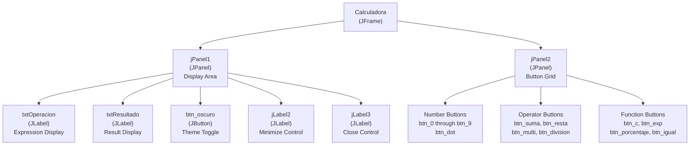
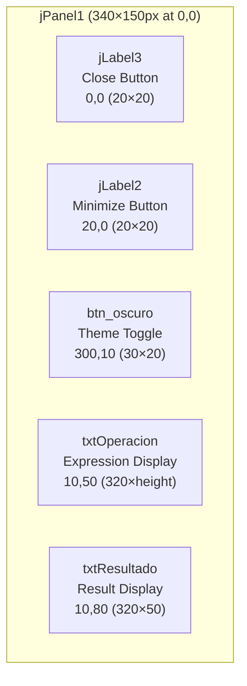
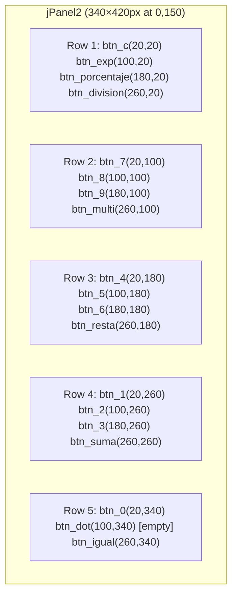
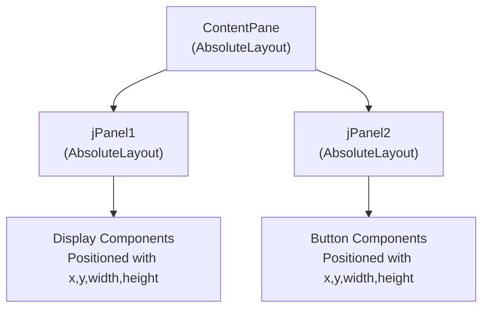
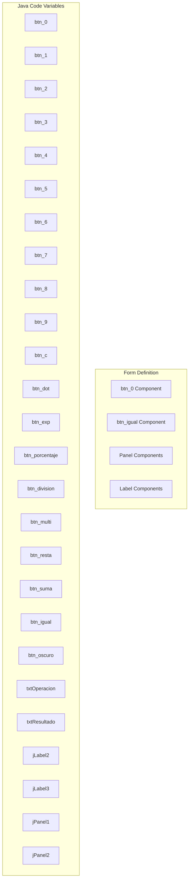

# User Interface Components

> **Relevant source files**
> * [dist/lib/AbsoluteLayout.jar](https://github.com/ricardo-alan/SimpleCalculator/blob/e9524f29/dist/lib/AbsoluteLayout.jar)
> * [src/calculadora/Calculadora.form](https://github.com/ricardo-alan/SimpleCalculator/blob/e9524f29/src/calculadora/Calculadora.form)
> * [src/calculadora/Calculadora.java](https://github.com/ricardo-alan/SimpleCalculator/blob/e9524f29/src/calculadora/Calculadora.java)

## Purpose and Scope

This document provides detailed technical documentation of the Swing GUI components that comprise the SimpleCalculator's user interface. It covers the component hierarchy, layout management, display elements, and button configurations. For information about event handling and user interactions, see [Event Handling](/ricardo-alan/SimpleCalculator/4.4-event-handling). For theme-specific icon and image resources, see [UI Assets and Icons](/ricardo-alan/SimpleCalculator/4.5-ui-assets-and-icons). For the overall application structure, see [Application Structure](/ricardo-alan/SimpleCalculator/4.1-application-structure).

**Sources:** [src/calculadora/Calculadora.form L1-L784](https://github.com/ricardo-alan/SimpleCalculator/blob/e9524f29/src/calculadora/Calculadora.form#L1-L784)

 [src/calculadora/Calculadora.java L1-L643](https://github.com/ricardo-alan/SimpleCalculator/blob/e9524f29/src/calculadora/Calculadora.java#L1-L643)

---

## Component Hierarchy

The SimpleCalculator UI is constructed as a JFrame with two main panel sections organized using AbsoluteLayout for precise pixel positioning.

### Frame Structure



**Sources:** [src/calculadora/Calculadora.form L32-L783](https://github.com/ricardo-alan/SimpleCalculator/blob/e9524f29/src/calculadora/Calculadora.form#L32-L783)

 [src/calculadora/Calculadora.java L25-L50](https://github.com/ricardo-alan/SimpleCalculator/blob/e9524f29/src/calculadora/Calculadora.java#L25-L50)

---

## Frame Properties

The main `Calculadora` JFrame is configured with specific window properties to achieve the calculator's custom appearance:

| Property | Value | Description |
| --- | --- | --- |
| `defaultCloseOperation` | `EXIT_ON_CLOSE` (3) | Application exits on close |
| `undecorated` | `true` | No native window decorations |
| `resizable` | `false` | Fixed window size |
| `background` | `#FFFFFF` (white) | Window background color |
| Size | 340 × 570 pixels | Fixed dimensions |

**Sources:** [src/calculadora/Calculadora.form L4-L11](https://github.com/ricardo-alan/SimpleCalculator/blob/e9524f29/src/calculadora/Calculadora.form#L4-L11)

 [src/calculadora/Calculadora.java L52-L55](https://github.com/ricardo-alan/SimpleCalculator/blob/e9524f29/src/calculadora/Calculadora.java#L52-L55)

---

## Display Area (jPanel1)

The top panel (`jPanel1`) contains the display and window controls, positioned at coordinates (0, 0) with dimensions 340 × 150 pixels.

### Display Area Component Map



### Display Label Components

#### txtOperacion (Expression Display)

Displays the current mathematical expression as the user types.

| Property | Value |
| --- | --- |
| Component Type | `javax.swing.JLabel` |
| Font | Montserrat Alternates Light, Bold, 18pt |
| Foreground Color | `#373E47` (dark gray) |
| Horizontal Alignment | RIGHT (4) |
| Position | (10, 50) |
| Size | 320 × auto height |

**Sources:** [src/calculadora/Calculadora.form L49-L64](https://github.com/ricardo-alan/SimpleCalculator/blob/e9524f29/src/calculadora/Calculadora.form#L49-L64)

 [src/calculadora/Calculadora.java L26-L64](https://github.com/ricardo-alan/SimpleCalculator/blob/e9524f29/src/calculadora/Calculadora.java#L26-L64)

#### txtResultado (Result Display)

Displays the evaluated result in real-time.

| Property | Value |
| --- | --- |
| Component Type | `javax.swing.JLabel` |
| Font | Montserrat Alternates SemiBold, Regular, 48pt |
| Foreground Color | `#373E47` (dark gray) |
| Horizontal Alignment | RIGHT (4) |
| Position | (10, 80) |
| Size | 320 × 50 |

**Sources:** [src/calculadora/Calculadora.form L65-L80](https://github.com/ricardo-alan/SimpleCalculator/blob/e9524f29/src/calculadora/Calculadora.form#L65-L80)

 [src/calculadora/Calculadora.java L27-L69](https://github.com/ricardo-alan/SimpleCalculator/blob/e9524f29/src/calculadora/Calculadora.java#L27-L69)

### Window Control Components

#### jLabel3 (Close Control)

A colored bullet point (`•`) that serves as the close button.

| Property | Value |
| --- | --- |
| Font | Open Sans, Bold, 36pt |
| Foreground Color | `#FF3333` (red) |
| Text | "•" (bullet point) |
| Position | (0, 0) |
| Size | 20 × 20 |
| Event Handler | `jLabel3MouseClicked` |

**Sources:** [src/calculadora/Calculadora.form L116-L135](https://github.com/ricardo-alan/SimpleCalculator/blob/e9524f29/src/calculadora/Calculadora.form#L116-L135)

 [src/calculadora/Calculadora.java L30-L559](https://github.com/ricardo-alan/SimpleCalculator/blob/e9524f29/src/calculadora/Calculadora.java#L30-L559)

#### jLabel2 (Minimize Control)

A colored bullet point (`•`) that minimizes the window.

| Property | Value |
| --- | --- |
| Font | Open Sans, Bold, 36pt |
| Foreground Color | `#FF9900` (orange) |
| Text | "•" (bullet point) |
| Position | (20, 0) |
| Size | 20 × 20 |
| Event Handler | `jLabel2MouseClicked` |

**Sources:** [src/calculadora/Calculadora.form L96-L115](https://github.com/ricardo-alan/SimpleCalculator/blob/e9524f29/src/calculadora/Calculadora.form#L96-L115)

 [src/calculadora/Calculadora.java L29-L563](https://github.com/ricardo-alan/SimpleCalculator/blob/e9524f29/src/calculadora/Calculadora.java#L29-L563)

#### btn_oscuro (Theme Toggle)

Button that toggles between light and dark modes.

| Property | Value |
| --- | --- |
| Icon | `/images/darkmode_1.png` |
| Position | (300, 10) |
| Size | 30 × 20 |
| Event Handler | `btn_oscuroActionPerformed` |

**Sources:** [src/calculadora/Calculadora.form L81-L95](https://github.com/ricardo-alan/SimpleCalculator/blob/e9524f29/src/calculadora/Calculadora.form#L81-L95)

 [src/calculadora/Calculadora.java L28-L555](https://github.com/ricardo-alan/SimpleCalculator/blob/e9524f29/src/calculadora/Calculadora.java#L28-L555)

---

## Button Grid Area (jPanel2)

The bottom panel (`jPanel2`) contains all calculator buttons, positioned at (0, 150) with dimensions 340 × 420 pixels.

### Button Layout Grid



**Sources:** [src/calculadora/Calculadora.form L138-L783](https://github.com/ricardo-alan/SimpleCalculator/blob/e9524f29/src/calculadora/Calculadora.form#L138-L783)

 [src/calculadora/Calculadora.java L31-L410](https://github.com/ricardo-alan/SimpleCalculator/blob/e9524f29/src/calculadora/Calculadora.java#L31-L410)

---

## Button Categories

### Number Buttons (0-9)

All number buttons share common properties with individual positional differences.

| Button Name | Text | Position | Font Size |
| --- | --- | --- | --- |
| `btn_0` | "0" | (20, 340) | 24pt |
| `btn_1` | "1" | (20, 260) | 24pt |
| `btn_2` | "2" | (100, 260) | 24pt |
| `btn_3` | "3" | (180, 260) | 24pt |
| `btn_4` | "4" | (20, 180) | 24pt |
| `btn_5` | "5" | (100, 180) | 24pt |
| `btn_6` | "6" | (180, 180) | 24pt |
| `btn_7` | "7" | (20, 100) | 24pt |
| `btn_8` | "8" | (100, 100) | 24pt |
| `btn_9` | "9" | (180, 100) | 24pt |
| `btn_dot` | "." | (100, 340) | 24pt (Bold) |

**Common Properties for Number Buttons:**

| Property | Value |
| --- | --- |
| Component Type | `javax.swing.JButton` |
| Font | Montserrat Medium |
| Foreground Color | `#373E47` (dark gray) |
| Size | 50 × 50 |
| Icon | `/images/btn2.png` |
| Pressed Icon | `/images/btn1.png` |
| Rollover Icon | `/images/btn1_pressed.png` |
| Focus Painted | `false` |
| Horizontal Text Position | CENTER (0) |

**Sources:** [src/calculadora/Calculadora.form L451-L780](https://github.com/ricardo-alan/SimpleCalculator/blob/e9524f29/src/calculadora/Calculadora.form#L451-L780)

 [src/calculadora/Calculadora.java L41-L408](https://github.com/ricardo-alan/SimpleCalculator/blob/e9524f29/src/calculadora/Calculadora.java#L41-L408)

### Operator Buttons

Arithmetic operation buttons positioned in the rightmost column.

| Button Name | Text | Position | Font Size | Event Handler |
| --- | --- | --- | --- | --- |
| `btn_suma` | "+" | (260, 260) | 30pt | `btn_sumaActionPerformed` |
| `btn_resta` | "-" | (260, 180) | 32pt | `btn_restaActionPerformed` |
| `btn_multi` | "X" | (260, 100) | 24pt | `btn_multiActionPerformed` |
| `btn_division` | "/" | (260, 20) | 24pt | `btn_divisionActionPerformed` |

**Common Properties for Operator Buttons:**

| Property | Value |
| --- | --- |
| Font | Montserrat Alternates Medium |
| Foreground Color | `#373E47` |
| Size | 50 × 50 |
| Icon | `/images/btn1.png` |
| Pressed Icon | `/images/btn1.png` |
| Rollover Icon | `/images/btn1_pressed.png` |

**Sources:** [src/calculadora/Calculadora.form L286-L417](https://github.com/ricardo-alan/SimpleCalculator/blob/e9524f29/src/calculadora/Calculadora.form#L286-L417)

 [src/calculadora/Calculadora.java L35-L232](https://github.com/ricardo-alan/SimpleCalculator/blob/e9524f29/src/calculadora/Calculadora.java#L35-L232)

### Function Buttons

Special function buttons for calculator operations.

| Button Name | Text | Position | Font Size | Function |
| --- | --- | --- | --- | --- |
| `btn_c` | "C" | (20, 20) | 24pt | Clear display |
| `btn_exp` | "<-" | (100, 20) | 20pt | Backspace |
| `btn_porcentaje` | "%" | (180, 20) | 21pt | Percentage |
| `btn_igual` | "=" | (260, 340) | 30pt | Evaluate expression |

#### btn_c (Clear Button)

Clears both operation and result displays.

**Sources:** [src/calculadora/Calculadora.form L418-L450](https://github.com/ricardo-alan/SimpleCalculator/blob/e9524f29/src/calculadora/Calculadora.form#L418-L450)

 [src/calculadora/Calculadora.java L40-L423](https://github.com/ricardo-alan/SimpleCalculator/blob/e9524f29/src/calculadora/Calculadora.java#L40-L423)

#### btn_exp (Backspace Button)

Removes the last character from the expression.

**Sources:** [src/calculadora/Calculadora.form L220-L252](https://github.com/ricardo-alan/SimpleCalculator/blob/e9524f29/src/calculadora/Calculadora.form#L220-L252)

 [src/calculadora/Calculadora.java L34-L439](https://github.com/ricardo-alan/SimpleCalculator/blob/e9524f29/src/calculadora/Calculadora.java#L34-L439)

#### btn_porcentaje (Percentage Button)

Adds the percentage operator to the expression.

**Sources:** [src/calculadora/Calculadora.form L253-L285](https://github.com/ricardo-alan/SimpleCalculator/blob/e9524f29/src/calculadora/Calculadora.form#L253-L285)

 [src/calculadora/Calculadora.java L35-L418](https://github.com/ricardo-alan/SimpleCalculator/blob/e9524f29/src/calculadora/Calculadora.java#L35-L418)

#### btn_igual (Equals Button)

Distinctive styling to indicate primary action.

| Property | Value |
| --- | --- |
| Icon | `/images/btn3.png` |
| Foreground Color | `#FFFFFF` (white) |
| Pressed Icon | `/images/btn1.png` |
| Rollover Icon | `/images/btn1_pressed.png` |

**Sources:** [src/calculadora/Calculadora.form L154-L186](https://github.com/ricardo-alan/SimpleCalculator/blob/e9524f29/src/calculadora/Calculadora.form#L154-L186)

 [src/calculadora/Calculadora.java L32-L505](https://github.com/ricardo-alan/SimpleCalculator/blob/e9524f29/src/calculadora/Calculadora.java#L32-L505)

---

## Layout Management System

### AbsoluteLayout Implementation

The calculator uses NetBeans AbsoluteLayout for precise component positioning. This layout manager is provided by the `org.netbeans.lib.awtextra` package.



### Layout Configuration

The layout is initialized in the generated code:

```
getContentPane().setLayout(new org.netbeans.lib.awtextra.AbsoluteLayout());
jPanel1.setLayout(new org.netbeans.lib.awtextra.AbsoluteLayout());
jPanel2.setLayout(new org.netbeans.lib.awtextra.AbsoluteLayout());
```

Components are positioned using `AbsoluteConstraints`:

```
jPanel1.add(txtOperacion, new org.netbeans.lib.awtextra.AbsoluteConstraints(10, 50, 320, -1));
jPanel2.add(btn_7, new org.netbeans.lib.awtextra.AbsoluteConstraints(20, 100, -1, -1));
```

The `-1` value indicates that the component should use its preferred size for that dimension.

**Sources:** [src/calculadora/Calculadora.form L29-L152](https://github.com/ricardo-alan/SimpleCalculator/blob/e9524f29/src/calculadora/Calculadora.form#L29-L152)

 [src/calculadora/Calculadora.java L56-L410](https://github.com/ricardo-alan/SimpleCalculator/blob/e9524f29/src/calculadora/Calculadora.java#L56-L410)

 [dist/lib/AbsoluteLayout.jar L1-L40](https://github.com/ricardo-alan/SimpleCalculator/blob/e9524f29/dist/lib/AbsoluteLayout.jar#L1-L40)

---

## Button Spacing and Grid Dimensions

The button grid follows a consistent spacing pattern:

| Attribute | Value |
| --- | --- |
| Button Size | 50 × 50 pixels |
| Horizontal Spacing | 80 pixels between button centers |
| Vertical Spacing | 80 pixels between button centers |
| Left Margin | 20 pixels |
| Top Margin (from jPanel2 top) | 20 pixels |
| Column X-Coordinates | 20, 100, 180, 260 |
| Row Y-Coordinates | 20, 100, 180, 260, 340 |

**Sources:** [src/calculadora/Calculadora.form L154-L780](https://github.com/ricardo-alan/SimpleCalculator/blob/e9524f29/src/calculadora/Calculadora.form#L154-L780)

---

## Component Initialization Sequence

The component initialization follows a specific order in the generated code:

1. **Panel Creation:** `jPanel1` and `jPanel2` instantiated
2. **Display Components:** `txtOperacion` and `txtResultado` created
3. **Control Components:** `btn_oscuro`, `jLabel2`, `jLabel3` created
4. **Button Components:** All calculator buttons instantiated
5. **Property Configuration:** Fonts, colors, icons set for each component
6. **Event Listeners:** ActionListeners and MouseListeners registered
7. **Layout Constraints:** Components added to panels with AbsoluteConstraints
8. **Panel Addition:** Panels added to ContentPane
9. **Frame Packing:** `pack()` called to realize layout

**Sources:** [src/calculadora/Calculadora.java L22-L413](https://github.com/ricardo-alan/SimpleCalculator/blob/e9524f29/src/calculadora/Calculadora.java#L22-L413)

---

## Component Reference Map

### Complete Button-to-Code Mapping



All UI component variables are declared in the auto-generated section:

**Sources:** [src/calculadora/Calculadora.java L615-L642](https://github.com/ricardo-alan/SimpleCalculator/blob/e9524f29/src/calculadora/Calculadora.java#L615-L642)

---

## Form File Structure

The `.form` file defines the UI structure in XML format with the following key sections:

| Section | Purpose | Line Range |
| --- | --- | --- |
| Properties | Frame-level properties (undecorated, resizable, etc.) | 4-11 |
| SyntheticProperties | NetBeans-specific generation settings | 12-15 |
| AuxValues | Form designer settings and metadata | 16-27 |
| Layout | Root layout manager configuration | 29-31 |
| SubComponents | Panel and component definitions | 32-783 |

Each component definition includes:

* Properties (font, color, text, icons)
* Events (action handlers, mouse listeners)
* Constraints (AbsoluteLayout positioning)

**Sources:** [src/calculadora/Calculadora.form L1-L784](https://github.com/ricardo-alan/SimpleCalculator/blob/e9524f29/src/calculadora/Calculadora.form#L1-L784)

---

## Theme-Dependent Component Properties

While theme switching is covered in detail elsewhere, certain component properties are dynamically modified during theme changes:

### Light Mode (Default)

| Component Type | Background | Foreground |
| --- | --- | --- |
| jPanel1 | `#F4FDFB` | N/A |
| jPanel2 | `#FFFFFF` | N/A |
| Text Labels | N/A | `#373E47` |

### Dark Mode

| Component Type | Background | Foreground |
| --- | --- | --- |
| jPanel1 | `#212B41` | N/A |
| jPanel2 | `#2E3951` | N/A |
| Text Labels | N/A | `#0DB387` |

The theme toggle modifies these properties along with button icons through the `cambiarColorBtn1` and `cambiarColorBtn2` helper methods.

**Sources:** [src/calculadora/Calculadora.java L515-L609](https://github.com/ricardo-alan/SimpleCalculator/blob/e9524f29/src/calculadora/Calculadora.java#L515-L609)