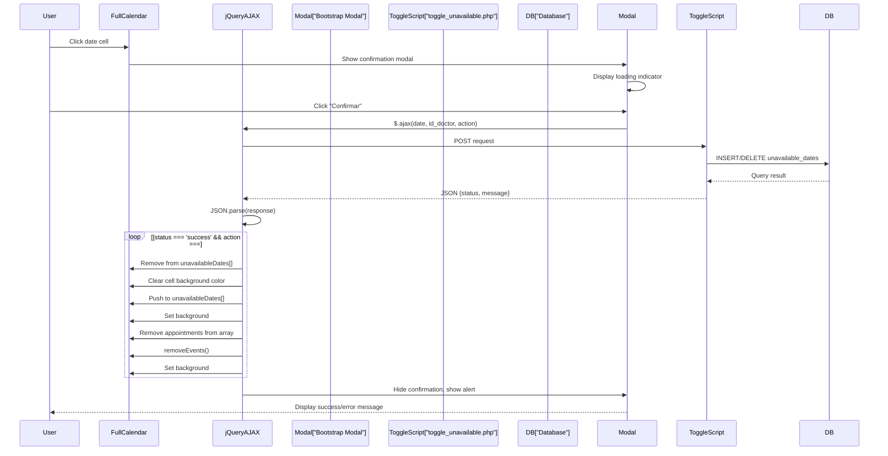
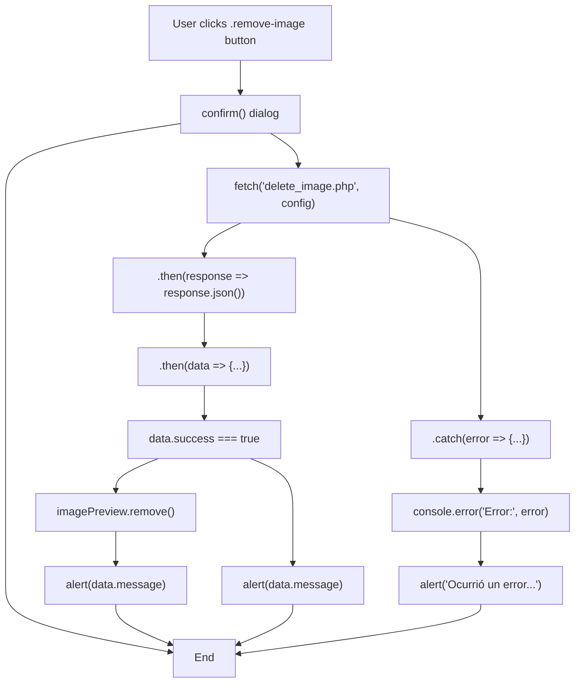
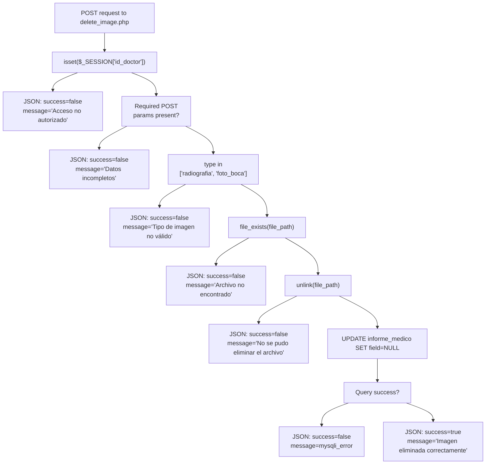

# AJAX & Dynamic Interactions

> **Relevant source files**
> * [Admin/calendar.php](https://github.com/axchisan/Consultorio_Emily_Bernal/blob/589034b9/Admin/calendar.php)
> * [Admin/delete_image.php](https://github.com/axchisan/Consultorio_Emily_Bernal/blob/589034b9/Admin/delete_image.php)
> * [Admin/informe.php](https://github.com/axchisan/Consultorio_Emily_Bernal/blob/589034b9/Admin/informe.php)

This page documents the asynchronous JavaScript patterns used throughout the system for dynamic user interactions without full page reloads. The system employs two AJAX approaches: jQuery `$.ajax()` for calendar interactions and the native Fetch API for image management operations. Both patterns communicate with server-side endpoints that return JSON responses.

For frontend framework integration, see [Bootstrap Integration & Layout](/axchisan/Consultorio_Emily_Bernal/7.1-bootstrap-integration-and-layout). For calendar-specific event handling, see [FullCalendar Integration](/axchisan/Consultorio_Emily_Bernal/7.3-fullcalendar-integration). For post-submission messaging, see [Session-Based Flash Messaging](/axchisan/Consultorio_Emily_Bernal/7.5-session-based-flash-messaging).

## Overview of AJAX Architecture

The system implements AJAX interactions in two primary workflows: calendar date availability management and medical image deletion. Both workflows follow a request-response pattern with JSON-formatted server responses, client-side validation, and dynamic DOM manipulation.

```

```

**Sources:** [Admin/calendar.php L312-L368](https://github.com/axchisan/Consultorio_Emily_Bernal/blob/589034b9/Admin/calendar.php#L312-L368)

 [Admin/informe.php L838-L857](https://github.com/axchisan/Consultorio_Emily_Bernal/blob/589034b9/Admin/informe.php#L838-L857)

 [Admin/delete_image.php L1-L50](https://github.com/axchisan/Consultorio_Emily_Bernal/blob/589034b9/Admin/delete_image.php#L1-L50)

## jQuery AJAX Pattern: Calendar Date Management

The calendar system uses jQuery's `$.ajax()` method to toggle date availability without page reloads. This implementation includes loading indicators, response validation, and synchronized UI updates.

### Request Structure

The AJAX request is triggered by the `dayClick` event handler in FullCalendar and sends three parameters to the server:

| Parameter | Type | Description |
| --- | --- | --- |
| `date` | string | Date in YYYY-MM-DD format from `$.fullCalendar.formatDate()` |
| `id_doctor` | integer | Session-based doctor ID from PHP variable |
| `action` | string | One of: 'add', 'remove', 'cancel' |

[Admin/calendar.php L304-L319](https://github.com/axchisan/Consultorio_Emily_Bernal/blob/589034b9/Admin/calendar.php#L304-L319)

 demonstrates the AJAX invocation:

```

```

### Response Handling

The server responds with JSON containing `status` and `message` fields. The client-side handler parses the response and branches based on the action type:



**Sources:** [Admin/calendar.php L312-L368](https://github.com/axchisan/Consultorio_Emily_Bernal/blob/589034b9/Admin/calendar.php#L312-L368)

### Loading State Management

The implementation includes a minimum 1-second loading indicator to provide visual feedback even for fast responses:

[Admin/calendar.php L306-L366](https://github.com/axchisan/Consultorio_Emily_Bernal/blob/589034b9/Admin/calendar.php#L306-L366)

 implements the loading state logic:

* `$('#loadingIndicator').css('display', 'block').addClass('show')` - Show spinner
* `startTime = Date.now()` - Record start timestamp
* `complete` callback calculates elapsed time and ensures 1000ms minimum display
* `setTimeout()` delays hiding until minimum duration reached

### UI Synchronization

The client maintains three synchronized data structures that must remain consistent:

| Structure | Purpose | Update Location |
| --- | --- | --- |
| `unavailableDates[]` | JavaScript array of YYYY-MM-DD strings | [Admin/calendar.php L326-L342](https://github.com/axchisan/Consultorio_Emily_Bernal/blob/589034b9/Admin/calendar.php#L326-L342) |
| `appointments[]` | Array of appointment objects from PHP | [Admin/calendar.php L330-L332](https://github.com/axchisan/Consultorio_Emily_Bernal/blob/589034b9/Admin/calendar.php#L330-L332) |
| Calendar cell CSS | Visual background color indicator | [Admin/calendar.php L327-L341](https://github.com/axchisan/Consultorio_Emily_Bernal/blob/589034b9/Admin/calendar.php#L327-L341) |

**Sources:** [Admin/calendar.php L246-L372](https://github.com/axchisan/Consultorio_Emily_Bernal/blob/589034b9/Admin/calendar.php#L246-L372)

## Fetch API Pattern: Image Deletion

The medical report editor uses the modern Fetch API for asynchronous image deletion. This pattern demonstrates POST requests with URL-encoded bodies and error handling.

### Fetch Request Configuration

[Admin/informe.php L838-L844](https://github.com/axchisan/Consultorio_Emily_Bernal/blob/589034b9/Admin/informe.php#L838-L844)

 shows the Fetch configuration:

```

```

The request body includes three parameters:

* `type`: Either 'radiografia' or 'foto_boca' from `data-type` attribute
* `file_name`: Extracted from image `src` attribute via `split('/').pop()`
* `id_cita`: Appointment ID from PHP JSON encoding

### Promise Chain Processing

The Fetch implementation uses promise chaining for response processing:



**Sources:** [Admin/informe.php L830-L860](https://github.com/axchisan/Consultorio_Emily_Bernal/blob/589034b9/Admin/informe.php#L830-L860)

### DOM Element Removal

Upon successful deletion, the image preview container is removed from the DOM. The `.image-preview` element structure includes:

* `<div class="image-preview">` - Container removed by `imagePreview.remove()`
* `` - Image element
* `<button class="remove-image" data-type="...">` - Delete button

[Admin/informe.php L735-L752](https://github.com/axchisan/Consultorio_Emily_Bernal/blob/589034b9/Admin/informe.php#L735-L752)

 defines the HTML structure that gets removed.

**Sources:** [Admin/informe.php L829-L860](https://github.com/axchisan/Consultorio_Emily_Bernal/blob/589034b9/Admin/informe.php#L829-L860)

## Server-Side JSON Response Format

Both AJAX endpoints follow consistent JSON response patterns with session validation and standardized field names.

### Authentication Validation

All endpoints validate session before processing:

[Admin/delete_image.php L5-L9](https://github.com/axchisan/Consultorio_Emily_Bernal/blob/589034b9/Admin/delete_image.php#L5-L9)

 implements the authentication check:

```

```

### Response Schema

| Field | Type | Description | Used In |
| --- | --- | --- | --- |
| `success` | boolean | Operation outcome (delete_image.php) | [Admin/delete_image.php L7-L47](https://github.com/axchisan/Consultorio_Emily_Bernal/blob/589034b9/Admin/delete_image.php#L7-L47) |
| `status` | string | Operation outcome ('success'/'error') | Calendar responses |
| `message` | string | Human-readable feedback for user display | Both endpoints |

### Error Response Patterns

The delete endpoint returns specific error messages for validation failures:



**Sources:** [Admin/delete_image.php L6-L48](https://github.com/axchisan/Consultorio_Emily_Bernal/blob/589034b9/Admin/delete_image.php#L6-L48)

## Error Handling Strategies

The system implements multi-layer error handling covering network failures, JSON parsing errors, and business logic validation.

### Try-Catch Response Parsing

[Admin/calendar.php L322-L352](https://github.com/axchisan/Consultorio_Emily_Bernal/blob/589034b9/Admin/calendar.php#L322-L352)

 wraps JSON parsing in try-catch to handle malformed responses:

```

```

### Network Error Handling

jQuery AJAX provides an `error` callback for HTTP-level failures:

[Admin/calendar.php L354-L357](https://github.com/axchisan/Consultorio_Emily_Bernal/blob/589034b9/Admin/calendar.php#L354-L357)

:

* `error: function(xhr, status, error)` - Catches network failures
* Displays error details via Bootstrap modal
* `xhr` contains status code, `error` contains error message

Fetch API uses `.catch()` for similar purposes:

[Admin/informe.php L854-L857](https://github.com/axchisan/Consultorio_Emily_Bernal/blob/589034b9/Admin/informe.php#L854-L857)

:

* `.catch(error => {...})` - Handles network errors and exceptions
* Logs to console for debugging: `console.error('Error:', error)`
* Shows generic user-facing message: `alert('Ocurrió un error al eliminar la imagen')`

**Sources:** [Admin/calendar.php L322-L357](https://github.com/axchisan/Consultorio_Emily_Bernal/blob/589034b9/Admin/calendar.php#L322-L357)

 [Admin/informe.php L854-L857](https://github.com/axchisan/Consultorio_Emily_Bernal/blob/589034b9/Admin/informe.php#L854-L857)

## Dynamic DOM Updates

Both AJAX implementations manipulate the DOM to reflect server-side state changes without page reloads.

### Calendar Cell Styling

Date availability changes update calendar cell backgrounds using direct CSS manipulation:

| Action | Array Update | CSS Update | Line Reference |
| --- | --- | --- | --- |
| Mark unavailable | `unavailableDates.push(dateStr)` | `css('background-color', '#ffcccc')` | [Admin/calendar.php L333-L341](https://github.com/axchisan/Consultorio_Emily_Bernal/blob/589034b9/Admin/calendar.php#L333-L341) |
| Remove unavailable | `unavailableDates.splice(indexOf, 1)` | `css('background-color', '')` | [Admin/calendar.php L326-L327](https://github.com/axchisan/Consultorio_Emily_Bernal/blob/589034b9/Admin/calendar.php#L326-L327) |
| Cancel appointments | `appointments = appointments.filter(...)` | `css('background-color', '#ffcccc')` | [Admin/calendar.php L330-L334](https://github.com/axchisan/Consultorio_Emily_Bernal/blob/589034b9/Admin/calendar.php#L330-L334) |

### Event Removal from Calendar

When canceling a day with appointments, events are removed using FullCalendar's API:

[Admin/calendar.php L335-L337](https://github.com/axchisan/Consultorio_Emily_Bernal/blob/589034b9/Admin/calendar.php#L335-L337)

:

```

```

The predicate function filters events by date string comparison.

### Image Preview Removal

After successful deletion, the entire image preview container is removed from the DOM tree:

[Admin/informe.php L848](https://github.com/axchisan/Consultorio_Emily_Bernal/blob/589034b9/Admin/informe.php#L848-L848)

 - `imagePreview.remove()` removes parent `<div class="image-preview">` element and all children.

This affects the HTML structure defined at [Admin/informe.php L735-L738](https://github.com/axchisan/Consultorio_Emily_Bernal/blob/589034b9/Admin/informe.php#L735-L738)

 for radiographs and [Admin/informe.php L749-L752](https://github.com/axchisan/Consultorio_Emily_Bernal/blob/589034b9/Admin/informe.php#L749-L752)

 for oral photos.

**Sources:** [Admin/calendar.php L326-L341](https://github.com/axchisan/Consultorio_Emily_Bernal/blob/589034b9/Admin/calendar.php#L326-L341)

 [Admin/informe.php L832-L848](https://github.com/axchisan/Consultorio_Emily_Bernal/blob/589034b9/Admin/informe.php#L832-L848)

## AJAX Data Flow Summary

The following table summarizes all AJAX interactions in the system:

| Interaction | Client File | Server Endpoint | Method | Request Params | Response Fields | UI Update |
| --- | --- | --- | --- | --- | --- | --- |
| Toggle date availability | calendar.php:312-368 | toggle_unavailable.php | POST | date, id_doctor, action | status, message | Cell background, array sync |
| Delete radiograph | informe.php:838-857 | delete_image.php | POST | type='radiografia', file_name, id_cita | success, message | Remove .image-preview |
| Delete oral photo | informe.php:838-857 | delete_image.php | POST | type='foto_boca', file_name, id_cita | success, message | Remove .image-preview |

All interactions use JSON for server responses and implement error handling via modal dialogs or alert notifications.

**Sources:** [Admin/calendar.php L312-L368](https://github.com/axchisan/Consultorio_Emily_Bernal/blob/589034b9/Admin/calendar.php#L312-L368)

 [Admin/informe.php L838-L857](https://github.com/axchisan/Consultorio_Emily_Bernal/blob/589034b9/Admin/informe.php#L838-L857)

 [Admin/delete_image.php L1-L50](https://github.com/axchisan/Consultorio_Emily_Bernal/blob/589034b9/Admin/delete_image.php#L1-L50)