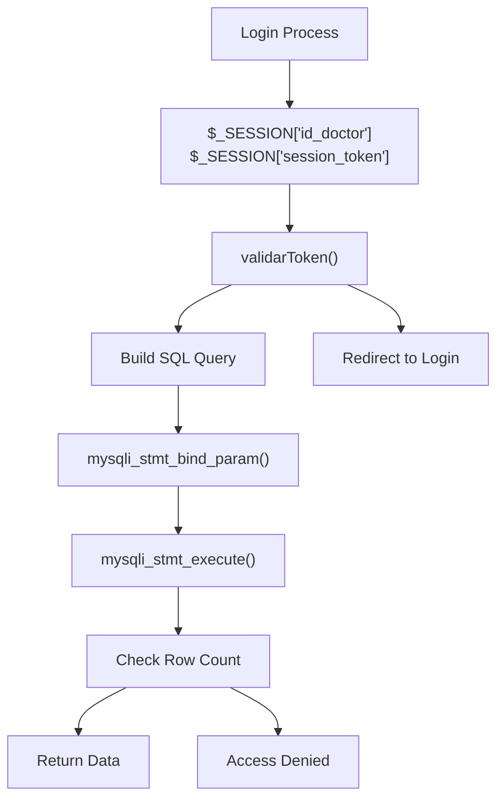
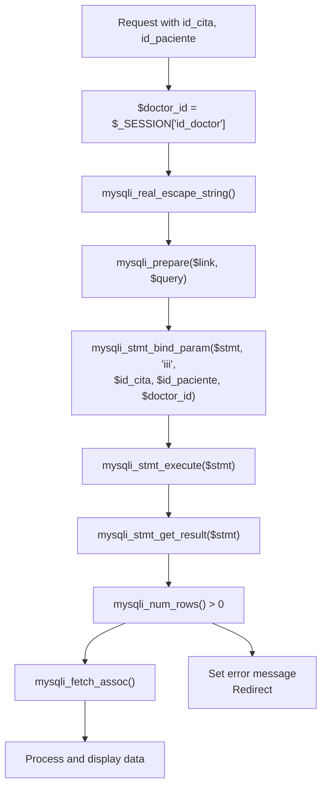

# Access Control & Authorization

> **Relevant source files**
> * [Admin/descargar_historia.php](https://github.com/axchisan/Consultorio_Emily_Bernal/blob/589034b9/Admin/descargar_historia.php)
> * [Admin/generate_informe_pdf.php](https://github.com/axchisan/Consultorio_Emily_Bernal/blob/589034b9/Admin/generate_informe_pdf.php)
> * [Admin/ver_historia.php](https://github.com/axchisan/Consultorio_Emily_Bernal/blob/589034b9/Admin/ver_historia.php)

## Purpose and Scope

This document explains how the Consultorio Emily Bernal system implements access control and authorization to ensure doctors can only access data for their own patients. The focus is on query-level authorization using `WHERE` clause constraints that match the logged-in doctor's ID against appointment records.

For session management and initial authentication, see [Session Management](/axchisan/Consultorio_Emily_Bernal/5.1-session-management). For token validation that prevents concurrent logins, see [Token Validation System](/axchisan/Consultorio_Emily_Bernal/5.2-token-validation-system). For SQL injection prevention techniques, see [SQL Injection Prevention](/axchisan/Consultorio_Emily_Bernal/5.3-sql-injection-prevention).

---

## Authorization Model Overview

The system implements a **query-level authorization model** where access control is enforced at the database layer through `WHERE` clause constraints. Every query that retrieves appointment or patient data includes a filter that matches `c.id_doctor` (the doctor assigned to the appointment) against `$_SESSION['id_doctor']` (the currently logged-in doctor).

This approach ensures:

* Doctors can only view appointments assigned to them
* Patient data is only accessible through appointments the doctor owns
* Authorization is enforced even if URLs are manually constructed or manipulated
* No horizontal privilege escalation is possible between doctors

The authorization model follows this hierarchy:

```
Doctor Session → Appointments (citas) → Patients (pacientes) → Medical Records (informe_medico)
```

A doctor can only access a patient's data if they have an appointment with that patient in the `citas` table.

**Sources:** [Admin/descargar_historia.php L57-L63](https://github.com/axchisan/Consultorio_Emily_Bernal/blob/589034b9/Admin/descargar_historia.php#L57-L63)

 [Admin/generate_informe_pdf.php L44-L49](https://github.com/axchisan/Consultorio_Emily_Bernal/blob/589034b9/Admin/generate_informe_pdf.php#L44-L49)

---

## Doctor-Patient Data Isolation

### Core Authorization Pattern

The fundamental authorization mechanism uses the `citas` table as a junction point that links doctors to patients. The `citas` table contains:

* `id_doctor` - Foreign key to the doctor table
* `id_paciente` - Foreign key to the patient table
* `id_cita` - Primary key for the appointment

Every data access query follows this pattern:

```

```

The third condition (`c.id_doctor = ?`) binds to `$_SESSION['id_doctor']`, ensuring the appointment belongs to the logged-in doctor.

### Authorization Flow Diagram

```

```

**Sources:** [Admin/descargar_historia.php L35-L73](https://github.com/axchisan/Consultorio_Emily_Bernal/blob/589034b9/Admin/descargar_historia.php#L35-L73)

 [Admin/generate_informe_pdf.php L20-L58](https://github.com/axchisan/Consultorio_Emily_Bernal/blob/589034b9/Admin/generate_informe_pdf.php#L20-L58)

---

## Implementation Patterns

### Pattern 1: Clinical History PDF Download

The `descargar_historia.php` script demonstrates the complete authorization pattern:

| Step | Code Location | Authorization Check |
| --- | --- | --- |
| 1. Extract doctor ID from session | [Admin/descargar_historia.php L16](https://github.com/axchisan/Consultorio_Emily_Bernal/blob/589034b9/Admin/descargar_historia.php#L16-L16) | `$vUsuario = $_SESSION['id_doctor'];` |
| 2. Validate session token | [Admin/descargar_historia.php L18-L25](https://github.com/axchisan/Consultorio_Emily_Bernal/blob/589034b9/Admin/descargar_historia.php#L18-L25) | `validarToken($link, $vUsuario, 'Doctor', $_SESSION['session_token'])` |
| 3. Escape input parameters | [Admin/descargar_historia.php L35-L37](https://github.com/axchisan/Consultorio_Emily_Bernal/blob/589034b9/Admin/descargar_historia.php#L35-L37) | `mysqli_real_escape_string()` on `id_cita`, `id_paciente` |
| 4. Include doctor ID in WHERE clause | [Admin/descargar_historia.php L57-L63](https://github.com/axchisan/Consultorio_Emily_Bernal/blob/589034b9/Admin/descargar_historia.php#L57-L63) | `WHERE c.id_cita = ? AND c.id_paciente = ? AND c.id_doctor = ?` |
| 5. Bind all three parameters | [Admin/descargar_historia.php L63](https://github.com/axchisan/Consultorio_Emily_Bernal/blob/589034b9/Admin/descargar_historia.php#L63-L63) | `mysqli_stmt_bind_param($stmt, "iii", $id_cita, $id_paciente, $doctor_id)` |
| 6. Check for zero results | [Admin/descargar_historia.php L66-L71](https://github.com/axchisan/Consultorio_Emily_Bernal/blob/589034b9/Admin/descargar_historia.php#L66-L71) | Return error if no rows found |

**Key Authorization Code:**

```

```

If the appointment doesn't belong to the logged-in doctor, the query returns zero rows and the script redirects with an error message.

**Sources:** [Admin/descargar_historia.php L35-L73](https://github.com/axchisan/Consultorio_Emily_Bernal/blob/589034b9/Admin/descargar_historia.php#L35-L73)

---

### Pattern 2: Medical Report PDF Generation

The `generate_informe_pdf.php` script uses a slightly different approach - it finds the most recent appointment for a patient that belongs to the logged-in doctor:

```

```

This ensures:

* Only appointments for the specified patient are considered
* Only appointments belonging to the logged-in doctor are returned
* The most recent appointment is selected

If no appointments match both criteria, the query returns zero rows and an error is displayed.

**Sources:** [Admin/generate_informe_pdf.php L20-L58](https://github.com/axchisan/Consultorio_Emily_Bernal/blob/589034b9/Admin/generate_informe_pdf.php#L20-L58)

---

### Pattern 3: Clinical History Viewer

The `ver_historia.php` page displays detailed patient information. It performs session validation and token verification, then queries appointment data:

```

```

**Note:** This query does NOT include `c.id_doctor` in the WHERE clause at [Admin/ver_historia.php L51-L55](https://github.com/axchisan/Consultorio_Emily_Bernal/blob/589034b9/Admin/ver_historia.php#L51-L55)

 This represents an **incomplete authorization implementation** where a doctor could potentially view any appointment by manipulating the `id_cita` and `id_paciente` URL parameters. The session is validated, but the query does not enforce doctor-to-appointment ownership.

**Sources:** [Admin/ver_historia.php L26-L66](https://github.com/axchisan/Consultorio_Emily_Bernal/blob/589034b9/Admin/ver_historia.php#L26-L66)

---

## Authorization Query Structure

### Database Schema for Authorization

```css
#mermaid-kd88mhg4qkk{font-family:ui-sans-serif,-apple-system,system-ui,Segoe UI,Helvetica;font-size:16px;fill:#333;}@keyframes edge-animation-frame{from{stroke-dashoffset:0;}}@keyframes dash{to{stroke-dashoffset:0;}}#mermaid-kd88mhg4qkk .edge-animation-slow{stroke-dasharray:9,5!important;stroke-dashoffset:900;animation:dash 50s linear infinite;stroke-linecap:round;}#mermaid-kd88mhg4qkk .edge-animation-fast{stroke-dasharray:9,5!important;stroke-dashoffset:900;animation:dash 20s linear infinite;stroke-linecap:round;}#mermaid-kd88mhg4qkk .error-icon{fill:#dddddd;}#mermaid-kd88mhg4qkk .error-text{fill:#222222;stroke:#222222;}#mermaid-kd88mhg4qkk .edge-thickness-normal{stroke-width:1px;}#mermaid-kd88mhg4qkk .edge-thickness-thick{stroke-width:3.5px;}#mermaid-kd88mhg4qkk .edge-pattern-solid{stroke-dasharray:0;}#mermaid-kd88mhg4qkk .edge-thickness-invisible{stroke-width:0;fill:none;}#mermaid-kd88mhg4qkk .edge-pattern-dashed{stroke-dasharray:3;}#mermaid-kd88mhg4qkk .edge-pattern-dotted{stroke-dasharray:2;}#mermaid-kd88mhg4qkk .marker{fill:#999;stroke:#999;}#mermaid-kd88mhg4qkk .marker.cross{stroke:#999;}#mermaid-kd88mhg4qkk svg{font-family:ui-sans-serif,-apple-system,system-ui,Segoe UI,Helvetica;font-size:16px;}#mermaid-kd88mhg4qkk p{margin:0;}#mermaid-kd88mhg4qkk .entityBox{fill:#ffffff;stroke:#dddddd;}#mermaid-kd88mhg4qkk .relationshipLabelBox{fill:#dddddd;opacity:0.7;background-color:#dddddd;}#mermaid-kd88mhg4qkk .relationshipLabelBox rect{opacity:0.5;}#mermaid-kd88mhg4qkk .labelBkg{background-color:rgba(221, 221, 221, 0.5);}#mermaid-kd88mhg4qkk .edgeLabel .label{fill:#dddddd;font-size:14px;}#mermaid-kd88mhg4qkk .label{font-family:ui-sans-serif,-apple-system,system-ui,Segoe UI,Helvetica;color:#333;}#mermaid-kd88mhg4qkk .edge-pattern-dashed{stroke-dasharray:8,8;}#mermaid-kd88mhg4qkk .node rect,#mermaid-kd88mhg4qkk .node circle,#mermaid-kd88mhg4qkk .node ellipse,#mermaid-kd88mhg4qkk .node polygon{fill:#ffffff;stroke:#dddddd;stroke-width:1px;}#mermaid-kd88mhg4qkk .relationshipLine{stroke:#999;stroke-width:1;fill:none;}#mermaid-kd88mhg4qkk .marker{fill:none!important;stroke:#999!important;stroke-width:1;}#mermaid-kd88mhg4qkk :root{--mermaid-font-family:"trebuchet ms",verdana,arial,sans-serif;}id_doctorid_pacienteid_citaDOCTORintid_doctorPKstringsession_tokenCITASintid_citaPKintid_doctorFKintid_pacienteFKdatefecha_citastringestadoPACIENTEintid_pacientePKstringnombrestringapellidoINFORME_MEDICOintid_informePKintid_citaFKintid_pacienteFK
```

**Sources:** [Admin/descargar_historia.php L57-L61](https://github.com/axchisan/Consultorio_Emily_Bernal/blob/589034b9/Admin/descargar_historia.php#L57-L61)

 [Admin/generate_informe_pdf.php L44-L48](https://github.com/axchisan/Consultorio_Emily_Bernal/blob/589034b9/Admin/generate_informe_pdf.php#L44-L48)

---

### Authorization Check Locations

The following table maps administrative pages to their authorization query patterns:

| Page | File | Line Range | Doctor ID Check | Notes |
| --- | --- | --- | --- | --- |
| Clinical History PDF | `descargar_historia.php` | [57-63](https://github.com/axchisan/Consultorio_Emily_Bernal/blob/589034b9/57-63) | ✅ Yes | `WHERE ... AND c.id_doctor = ?` |
| Medical Report PDF | `generate_informe_pdf.php` | [44-49](https://github.com/axchisan/Consultorio_Emily_Bernal/blob/589034b9/44-49) | ✅ Yes | `WHERE c.id_paciente = ? AND c.id_doctor = ?` |
| Clinical History Viewer | `ver_historia.php` | [51-55](https://github.com/axchisan/Consultorio_Emily_Bernal/blob/589034b9/51-55) | ❌ No | Missing `id_doctor` constraint |
| Medical Report Editor | `informe.php` | N/A | Unknown | Not in provided files |

**Sources:** [Admin/descargar_historia.php L57-L63](https://github.com/axchisan/Consultorio_Emily_Bernal/blob/589034b9/Admin/descargar_historia.php#L57-L63)

 [Admin/generate_informe_pdf.php L44-L49](https://github.com/axchisan/Consultorio_Emily_Bernal/blob/589034b9/Admin/generate_informe_pdf.php#L44-L49)

 [Admin/ver_historia.php L51-L55](https://github.com/axchisan/Consultorio_Emily_Bernal/blob/589034b9/Admin/ver_historia.php#L51-L55)

---

## Session-Based Authorization Context

### Session Variables Used for Authorization

| Variable | Source | Purpose |
| --- | --- | --- |
| `$_SESSION['id_doctor']` | Login process | Identifies the currently logged-in doctor |
| `$_SESSION['session_token']` | Login process | Validates session hasn't been hijacked (see [5.2](/axchisan/Consultorio_Emily_Bernal/5.2-token-validation-system)) |

### Authorization Context Flow



**Sources:** [Admin/descargar_historia.php L9-L25](https://github.com/axchisan/Consultorio_Emily_Bernal/blob/589034b9/Admin/descargar_historia.php#L9-L25)

 [Admin/descargar_historia.php L35-L73](https://github.com/axchisan/Consultorio_Emily_Bernal/blob/589034b9/Admin/descargar_historia.php#L35-L73)

---

## Code Entity Mapping: Authorization Functions

### Key Code Symbols for Authorization

| Symbol | Type | File | Purpose |
| --- | --- | --- | --- |
| `$_SESSION['id_doctor']` | Session Variable | All admin pages | Stores logged-in doctor's ID |
| `$doctor_id` / `$vUsuario` | Local Variable | Multiple | Holds doctor ID for query binding |
| `mysqli_prepare()` | Function | Multiple | Creates prepared statement |
| `mysqli_stmt_bind_param()` | Function | Multiple | Binds parameters including doctor ID |
| `mysqli_real_escape_string()` | Function | Multiple | Escapes input (defense in depth) |
| `validarToken()` | Function | `consultas.php` | Validates session token (see [5.2](/axchisan/Consultorio_Emily_Bernal/5.2-token-validation-system)) |
| `c.id_doctor` | Database Column | `citas` table | Doctor assigned to appointment |

### Authorization Check Pattern (Code-Level)



**Sources:** [Admin/descargar_historia.php L35-L73](https://github.com/axchisan/Consultorio_Emily_Bernal/blob/589034b9/Admin/descargar_historia.php#L35-L73)

 [Admin/generate_informe_pdf.php L20-L58](https://github.com/axchisan/Consultorio_Emily_Bernal/blob/589034b9/Admin/generate_informe_pdf.php#L20-L58)

---

## Authorization Error Handling

### Error Response Pattern

When authorization fails (query returns zero rows), the system follows this pattern:

1. Set session error message: `$_SESSION['MensajeTexto']`
2. Set message type: `$_SESSION['MensajeTipo'] = "p-3 mb-2 bg-danger text-white"`
3. Redirect to previous page: `header("Location: historia_clinica.php")`
4. Exit script: `exit()`

Example from `descargar_historia.php`:

```

```

This prevents detailed error messages that could leak information about whether records exist. From an attacker's perspective, "cita not found" could mean:

* The appointment doesn't exist, or
* The appointment exists but doesn't belong to the logged-in doctor

**Sources:** [Admin/descargar_historia.php L66-L71](https://github.com/axchisan/Consultorio_Emily_Bernal/blob/589034b9/Admin/descargar_historia.php#L66-L71)

 [Admin/generate_informe_pdf.php L54-L56](https://github.com/axchisan/Consultorio_Emily_Bernal/blob/589034b9/Admin/generate_informe_pdf.php#L54-L56)

---

## Security Considerations

### Defense in Depth Layers

The authorization system combines multiple security layers:

| Layer | Mechanism | Effectiveness |
| --- | --- | --- |
| 1. Session validation | `isset($_SESSION['id_doctor'])` | Prevents access without login |
| 2. Token validation | `validarToken()` | Prevents concurrent login exploitation |
| 3. Input escaping | `mysqli_real_escape_string()` | Defense in depth (see [5.3](/axchisan/Consultorio_Emily_Bernal/5.3-sql-injection-prevention)) |
| 4. Prepared statements | `mysqli_prepare()` + `bind_param()` | Prevents SQL injection |
| 5. Doctor ID constraint | `WHERE c.id_doctor = ?` | **Primary authorization mechanism** |
| 6. Row count validation | `mysqli_num_rows() == 0` check | Explicit authorization failure detection |

### Known Gaps

The `ver_historia.php` page at [Admin/ver_historia.php L51-L55](https://github.com/axchisan/Consultorio_Emily_Bernal/blob/589034b9/Admin/ver_historia.php#L51-L55)

 does not include the `c.id_doctor` constraint in its appointment query. This represents a potential authorization bypass where a doctor could view any patient's history by manipulating URL parameters.

**Recommended Fix:** Add `AND c.id_doctor = ?` to the WHERE clause and bind `$_SESSION['id_doctor']` as the third parameter.

**Sources:** [Admin/descargar_historia.php L9-L73](https://github.com/axchisan/Consultorio_Emily_Bernal/blob/589034b9/Admin/descargar_historia.php#L9-L73)

 [Admin/ver_historia.php L26-L66](https://github.com/axchisan/Consultorio_Emily_Bernal/blob/589034b9/Admin/ver_historia.php#L26-L66)

 [Admin/generate_informe_pdf.php L20-L58](https://github.com/axchisan/Consultorio_Emily_Bernal/blob/589034b9/Admin/generate_informe_pdf.php#L20-L58)

---

## Authorization Summary

The access control model in the Consultorio Emily Bernal system relies on:

1. **Session-based identity**: `$_SESSION['id_doctor']` establishes the current user
2. **Query-level enforcement**: `WHERE c.id_doctor = ?` constraints limit data access
3. **Prepared statements**: Parameter binding prevents injection attacks
4. **Explicit validation**: Row count checks detect authorization failures
5. **Graceful degradation**: Error messages redirect without leaking information

This approach ensures doctors can only access appointments assigned to them, and by extension, only patient data for those appointments. The pattern is consistently applied in PDF generation scripts, though some viewer pages may have incomplete implementations.

**Sources:** [Admin/descargar_historia.php L1-L293](https://github.com/axchisan/Consultorio_Emily_Bernal/blob/589034b9/Admin/descargar_historia.php#L1-L293)

 [Admin/generate_informe_pdf.php L1-L331](https://github.com/axchisan/Consultorio_Emily_Bernal/blob/589034b9/Admin/generate_informe_pdf.php#L1-L331)

 [Admin/ver_historia.php L1-L302](https://github.com/axchisan/Consultorio_Emily_Bernal/blob/589034b9/Admin/ver_historia.php#L1-L302)