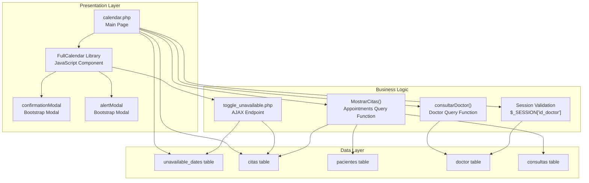
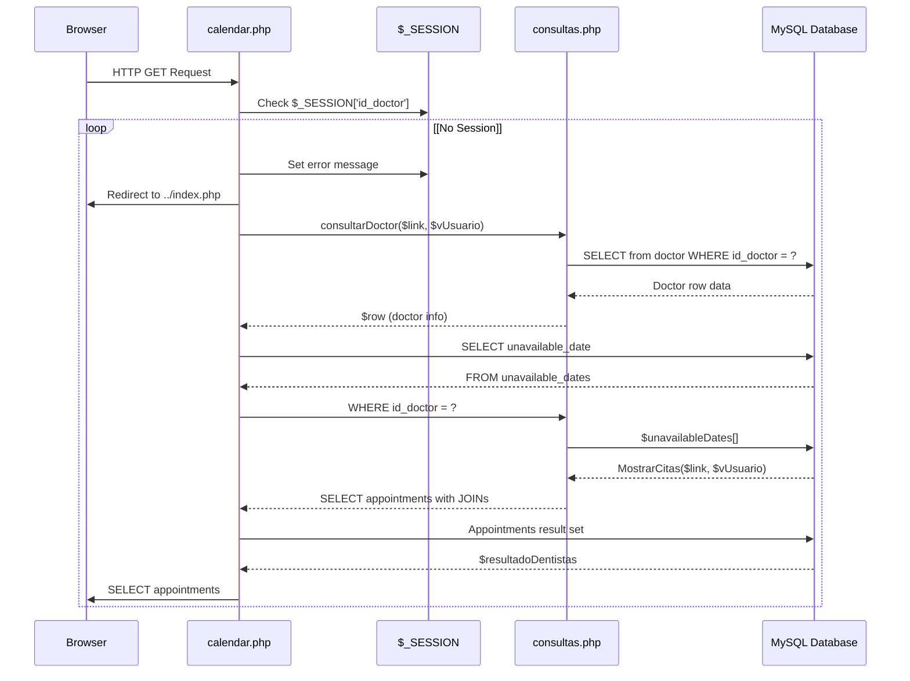
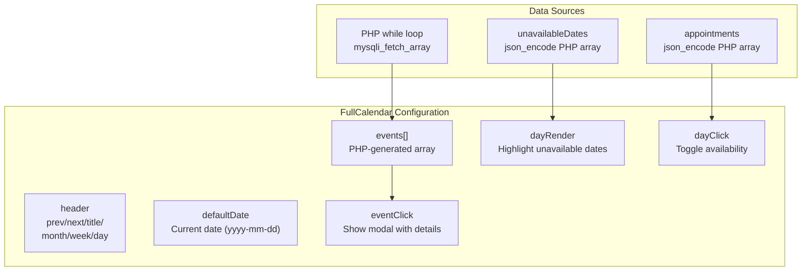
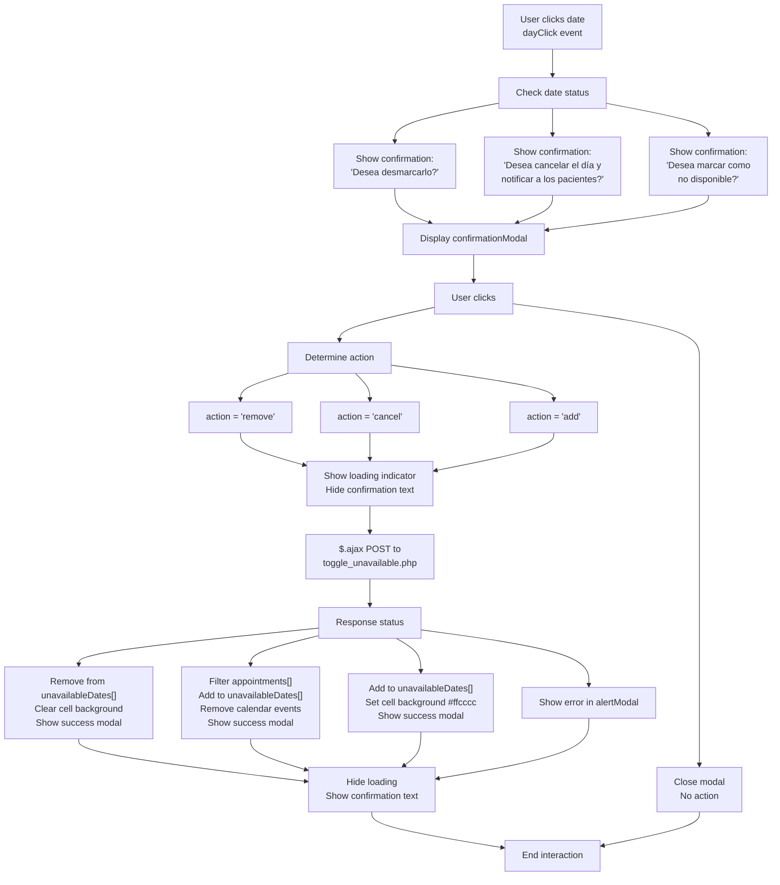

# Calendar & Scheduling System

> **Relevant source files**
> * [Admin/calendar.php](https://github.com/axchisan/Consultorio_Emily_Bernal/blob/589034b9/Admin/calendar.php)

The Calendar & Scheduling System provides a visual interface for doctors to manage their appointment schedules and date availability. This system centers around the `calendar.php` page, which integrates the FullCalendar JavaScript library to display appointments as events and allows doctors to mark dates as unavailable. The system handles three primary operations: viewing scheduled appointments, marking dates as unavailable, and canceling appointments on specific dates with patient notifications.

For patient appointment management operations (creating, updating, deleting appointments), see [Dashboard - Appointment Management](/axchisan/Consultorio_Emily_Bernal/2.1-dashboard-appointment-management). For consultation diagnosis entry, see [Consultation & Diagnosis Interface](/axchisan/Consultorio_Emily_Bernal/2.4-consultation-and-diagnosis-interface).

**Sources:** [Admin/calendar.php L1-L380](https://github.com/axchisan/Consultorio_Emily_Bernal/blob/589034b9/Admin/calendar.php#L1-L380)

---

## System Architecture Overview

The calendar system follows a client-server architecture with three main layers: presentation (FullCalendar UI), business logic (AJAX handlers), and data persistence (MySQL database).



**Description:** The system initializes by validating the doctor's session, querying their unavailable dates and appointments, and rendering them in FullCalendar. User interactions trigger AJAX calls to `toggle_unavailable.php` which modifies the `unavailable_dates` table and potentially the `citas` table when canceling appointments.

**Sources:** [Admin/calendar.php L1-L62](https://github.com/axchisan/Consultorio_Emily_Bernal/blob/589034b9/Admin/calendar.php#L1-L62)

 [Admin/calendar.php L230-L373](https://github.com/axchisan/Consultorio_Emily_Bernal/blob/589034b9/Admin/calendar.php#L230-L373)

---

## Page Initialization and Data Loading

The `calendar.php` page performs four database queries during initialization to prepare the calendar data:

| Query Purpose | Function/Query | Target Table(s) | Lines |
| --- | --- | --- | --- |
| Doctor Information | `consultarDoctor($link, $vUsuario)` | `doctor` | [18-21](https://github.com/axchisan/Consultorio_Emily_Bernal/blob/589034b9/18-21) |
| Unavailable Dates | Prepared statement with `id_doctor` filter | `unavailable_dates` | [24-32](https://github.com/axchisan/Consultorio_Emily_Bernal/blob/589034b9/24-32) |
| Calendar Events | `MostrarCitas($link, $vUsuario)` | `citas` + `pacientes` + `consultas` | [35](https://github.com/axchisan/Consultorio_Emily_Bernal/blob/589034b9/35) |
| Appointments Array | Prepared statement joining 4 tables | `citas`, `pacientes`, `doctor`, `consultas` | [38-61](https://github.com/axchisan/Consultorio_Emily_Bernal/blob/589034b9/38-61) |



**Description:** Session validation occurs first [Admin/calendar.php L8-L13](https://github.com/axchisan/Consultorio_Emily_Bernal/blob/589034b9/Admin/calendar.php#L8-L13)

 If valid, the system retrieves the doctor's profile, unavailable dates, and appointments. The unavailable dates query uses a prepared statement to prevent SQL injection [Admin/calendar.php L24-L32](https://github.com/axchisan/Consultorio_Emily_Bernal/blob/589034b9/Admin/calendar.php#L24-L32)

 Two separate appointment queries exist: one for FullCalendar events (via `MostrarCitas`) and one for JavaScript logic (direct query) [Admin/calendar.php L38-L61](https://github.com/axchisan/Consultorio_Emily_Bernal/blob/589034b9/Admin/calendar.php#L38-L61)

**Sources:** [Admin/calendar.php L4-L62](https://github.com/axchisan/Consultorio_Emily_Bernal/blob/589034b9/Admin/calendar.php#L4-L62)

---

## FullCalendar Integration and Configuration

FullCalendar is initialized in the document ready handler with the following configuration:



### FullCalendar Options

The calendar is initialized with these key options [Admin/calendar.php L251-L371](https://github.com/axchisan/Consultorio_Emily_Bernal/blob/589034b9/Admin/calendar.php#L251-L371)

:

| Option | Value | Purpose |
| --- | --- | --- |
| `header.left` | `'prev,next'` | Navigation buttons |
| `header.center` | `'title'` | Month/year title |
| `header.right` | `'month,agendaWeek,agendaDay'` | View switcher |
| `defaultDate` | `yyyy-mm-dd` (current date) | Initial view date |
| `editable` | `true` | Allow event dragging |
| `eventLimit` | `true` | Show "more" link for many events |
| `events` | PHP-generated array | Appointment events |
| `eventClick` | Function | Show appointment details modal |
| `dayRender` | Function | Highlight unavailable dates |
| `dayClick` | Function | Toggle date availability |

### Event Structure

Each appointment event includes these properties [Admin/calendar.php L265-L272](https://github.com/axchisan/Consultorio_Emily_Bernal/blob/589034b9/Admin/calendar.php#L265-L272)

:

```yaml
{
    id: 'appointment_id',
    title: 'consultation_type',
    description: 'HTML string with patient, doctor, date, time',
    start: 'YYYY-MM-DD',
    textColor: 'White',
    display: 'background'
}
```

**Sources:** [Admin/calendar.php L230-L276](https://github.com/axchisan/Consultorio_Emily_Bernal/blob/589034b9/Admin/calendar.php#L230-L276)

---

## Date Availability Management

The system maintains unavailable dates in the `unavailable_dates` table with a simple schema:

| Field | Type | Description |
| --- | --- | --- |
| `id` | INT (PK) | Primary key |
| `id_doctor` | INT (FK) | References `doctor.id_doctor` |
| `unavailable_date` | DATE | The unavailable date |

### Date Highlighting Logic

The `dayRender` callback highlights unavailable dates with a light red background [Admin/calendar.php L282-L287](https://github.com/axchisan/Consultorio_Emily_Bernal/blob/589034b9/Admin/calendar.php#L282-L287)

:

```javascript
dayRender: function(date, cell) {
    var dateStr = $.fullCalendar.formatDate(date, 'YYYY-MM-DD');
    if (unavailableDates.indexOf(dateStr) !== -1) {
        cell.css('background-color', '#ffcccc');
    }
}
```

**Sources:** [Admin/calendar.php L24-L32](https://github.com/axchisan/Consultorio_Emily_Bernal/blob/589034b9/Admin/calendar.php#L24-L32)

 [Admin/calendar.php L282-L287](https://github.com/axchisan/Consultorio_Emily_Bernal/blob/589034b9/Admin/calendar.php#L282-L287)

---

## User Interaction Workflows

The calendar supports three distinct user actions when clicking a date:



### Action Determination Logic

The system checks two conditions to determine the appropriate action [Admin/calendar.php L288-L301](https://github.com/axchisan/Consultorio_Emily_Bernal/blob/589034b9/Admin/calendar.php#L288-L301)

:

1. **Is date unavailable?** - Check if `dateStr` exists in `unavailableDates[]` array
2. **Has appointments?** - Use `appointments.some()` to find matching `fecha_cita` and `id_doctor`

**Sources:** [Admin/calendar.php L288-L370](https://github.com/axchisan/Consultorio_Emily_Bernal/blob/589034b9/Admin/calendar.php#L288-L370)

---

## AJAX Backend Communication

When the user confirms an action, the system sends an AJAX POST request to `toggle_unavailable.php`:

```mermaid
sequenceDiagram
  participant FullCalendar UI
  participant JavaScript Handler
  participant $.ajax()
  participant toggle_unavailable.php
  participant MySQL Database

  FullCalendar UI->>JavaScript Handler: User confirms action
  JavaScript Handler->>FullCalendar UI: Show loading indicator
  JavaScript Handler->>FullCalendar UI: Disable confirm button
  JavaScript Handler->>$.ajax(): POST request
  note over $.ajax(): URL: ../php/toggle_unavailable.php
  $.ajax()->>toggle_unavailable.php: HTTP POST
  toggle_unavailable.php->>MySQL Database: Execute action query
  loop [action = 'add']
    toggle_unavailable.php->>MySQL Database: INSERT INTO unavailable_dates
    toggle_unavailable.php->>MySQL Database: (id_doctor, unavailable_date)
    toggle_unavailable.php->>MySQL Database: DELETE FROM unavailable_dates
    toggle_unavailable.php->>MySQL Database: WHERE id_doctor = ? AND unavailable_date = ?
    toggle_unavailable.php->>toggle_unavailable.php: UPDATE citas SET estado = 'Cancelado'
    MySQL Database-->>toggle_unavailable.php: WHERE id_doctor = ? AND fecha_cita = ?
    toggle_unavailable.php-->>$.ajax(): INSERT INTO unavailable_dates
    $.ajax()->>JavaScript Handler: Send email notifications
    JavaScript Handler->>JavaScript Handler: Query result
    JavaScript Handler->>JavaScript Handler: JSON response
    JavaScript Handler->>FullCalendar UI: {status: 'success/error', message: '...'}
    JavaScript Handler->>FullCalendar UI: Success callback
    JavaScript Handler->>FullCalendar UI: Parse JSON response
  end
  JavaScript Handler->>FullCalendar UI: Update local arrays
  JavaScript Handler->>FullCalendar UI: (unavailableDates[], appointments[])
  JavaScript Handler->>FullCalendar UI: Update cell styling
```

### AJAX Request Parameters

The POST request includes three parameters [Admin/calendar.php L316-L319](https://github.com/axchisan/Consultorio_Emily_Bernal/blob/589034b9/Admin/calendar.php#L316-L319)

:

| Parameter | Type | Description |
| --- | --- | --- |
| `date` | String | Date in `YYYY-MM-DD` format |
| `id_doctor` | Integer | Doctor ID from PHP session |
| `action` | String | One of: `'add'`, `'remove'`, `'cancel'` |

### Response Handling

The success callback parses the JSON response and updates the UI accordingly [Admin/calendar.php L320-L353](https://github.com/axchisan/Consultorio_Emily_Bernal/blob/589034b9/Admin/calendar.php#L320-L353)

:

* **Success + remove**: Removes date from `unavailableDates[]` array, clears background color
* **Success + cancel**: Filters `appointments[]` array, adds to `unavailableDates[]`, removes calendar events for that date
* **Success + add**: Adds to `unavailableDates[]` array, sets background to `#ffcccc`
* **Error**: Displays error message in `alertModal`

### Loading Indicator Timing

The loading indicator uses a minimum display time of 1 second [Admin/calendar.php L358-L367](https://github.com/axchisan/Consultorio_Emily_Bernal/blob/589034b9/Admin/calendar.php#L358-L367)

:

```javascript
let startTime = Date.now();
// ... AJAX call ...
complete: function() {
    let elapsedTime = Date.now() - startTime;
    let delay = elapsedTime < 1000 ? 1000 - elapsedTime : 0;
    setTimeout(function() {
        // Hide loading, show confirmation
    }, delay);
}
```

**Sources:** [Admin/calendar.php L304-L369](https://github.com/axchisan/Consultorio_Emily_Bernal/blob/589034b9/Admin/calendar.php#L304-L369)

---

## Modal System

The page implements two Bootstrap modals for user interaction:

### Confirmation Modal

The `confirmationModal` presents a confirmation dialog before executing actions [Admin/calendar.php L88-L117](https://github.com/axchisan/Consultorio_Emily_Bernal/blob/589034b9/Admin/calendar.php#L88-L117)

:

| Element | ID/Class | Purpose |
| --- | --- | --- |
| Modal container | `#confirmationModal` | Bootstrap modal wrapper |
| Message display | `#confirmationMessage` | Dynamic text showing action confirmation |
| Loading indicator | `#loadingIndicator` | Animated spinner shown during AJAX |
| Cancel button | `.btn-secondary` | Dismisses modal without action |
| Confirm button | `#confirmAction` | Executes the action via AJAX |

The confirmation message changes based on context [Admin/calendar.php L295-L301](https://github.com/axchisan/Consultorio_Emily_Bernal/blob/589034b9/Admin/calendar.php#L295-L301)

:

* Unavailable date: "Este día está marcado como no disponible. ¿Desea desmarcarlo?"
* Available with appointments: "Este día tiene citas registradas. ¿Desea cancelar el día y notificar a los pacientes?"
* Available without appointments: "¿Desea marcar este día como no disponible?"

### Alert Modal

The `alertModal` displays success or error messages after actions complete [Admin/calendar.php L120-L137](https://github.com/axchisan/Consultorio_Emily_Bernal/blob/589034b9/Admin/calendar.php#L120-L137)

:

| Element | ID/Class | Purpose |
| --- | --- | --- |
| Modal container | `#alertModal` | Bootstrap modal wrapper |
| Message display | `#alertMessage` | Success/error text set by JavaScript |
| Close button | `.btn-primary` | Dismisses the modal |

**Sources:** [Admin/calendar.php L88-L137](https://github.com/axchisan/Consultorio_Emily_Bernal/blob/589034b9/Admin/calendar.php#L88-L137)

---

## Database Queries and Prepared Statements

The system uses prepared statements for all database queries to prevent SQL injection:

### Unavailable Dates Query

Retrieves all unavailable dates for the logged-in doctor [Admin/calendar.php L24-L32](https://github.com/axchisan/Consultorio_Emily_Bernal/blob/589034b9/Admin/calendar.php#L24-L32)

:

```sql
SELECT unavailable_date 
FROM unavailable_dates 
WHERE id_doctor = ?
```

Bound parameter: `$vUsuario` (integer, from `$_SESSION['id_doctor']`)

### Appointments Query

Fetches appointments with patient, doctor, and consultation type information [Admin/calendar.php L38-L48](https://github.com/axchisan/Consultorio_Emily_Bernal/blob/589034b9/Admin/calendar.php#L38-L48)

:

```sql
SELECT c.id_cita, c.fecha_cita, p.nombre AS paciente_nombre, 
       co.tipo AS tipo_cita, c.hora_cita, d.nombreD AS doctor_nombre, c.id_doctor 
FROM citas c 
JOIN pacientes p ON c.id_paciente = p.id_paciente 
JOIN doctor d ON c.id_doctor = d.id_doctor 
JOIN consultas co ON c.id_consultas = co.id_consultas 
WHERE c.id_doctor = ?
```

Bound parameter: `$vUsuario` (integer, from `$_SESSION['id_doctor']`)

The result is stored in `$appointmentsData[]` array [Admin/calendar.php L49-L60](https://github.com/axchisan/Consultorio_Emily_Bernal/blob/589034b9/Admin/calendar.php#L49-L60)

:

```javascript
$appointmentsData[] = [
    'id_cita' => $rowAppointment['id_cita'],
    'fecha_cita' => $rowAppointment['fecha_cita'],
    'nombre' => $rowAppointment['paciente_nombre'],
    'tipo' => $rowAppointment['tipo_cita'],
    'hora_cita' => $rowAppointment['hora_cita'],
    'nombreD' => $rowAppointment['doctor_nombre'],
    'id_doctor' => $rowAppointment['id_doctor']
];
```

**Sources:** [Admin/calendar.php L24-L61](https://github.com/axchisan/Consultorio_Emily_Bernal/blob/589034b9/Admin/calendar.php#L24-L61)

---

## Data Serialization to JavaScript

The page embeds PHP data structures into JavaScript using `json_encode()` [Admin/calendar.php L247-L249](https://github.com/axchisan/Consultorio_Emily_Bernal/blob/589034b9/Admin/calendar.php#L247-L249)

:

```javascript
var unavailableDates = <?php echo json_encode($unavailableDates, JSON_UNESCAPED_UNICODE); ?>;
var appointments = <?php echo json_encode($appointmentsData, JSON_UNESCAPED_UNICODE); ?>;
```

These arrays are used throughout the JavaScript code for:

* Highlighting unavailable dates in `dayRender()`
* Checking appointment existence in `dayClick()`
* Updating UI after AJAX responses
* Filtering events when appointments are canceled

The `JSON_UNESCAPED_UNICODE` flag ensures proper encoding of Spanish characters in patient and doctor names.

**Sources:** [Admin/calendar.php L247-L249](https://github.com/axchisan/Consultorio_Emily_Bernal/blob/589034b9/Admin/calendar.php#L247-L249)

---

## Security Considerations

The calendar system implements several security measures:

### Session Validation

All requests validate the session at page load [Admin/calendar.php L8-L13](https://github.com/axchisan/Consultorio_Emily_Bernal/blob/589034b9/Admin/calendar.php#L8-L13)

:

```
if (!isset($_SESSION['id_doctor'])) {
    $_SESSION['MensajeTexto'] = "Error acceso al sistema no registrado.";
    $_SESSION['MensajeTipo'] = "p-3 mb-2 bg-danger text-white";
    header("Location: ../index.php");
    exit;
}
```

### SQL Injection Prevention

All database queries use prepared statements with parameter binding:

* `unavailable_dates` query: [Admin/calendar.php L24-L32](https://github.com/axchisan/Consultorio_Emily_Bernal/blob/589034b9/Admin/calendar.php#L24-L32)
* `appointments` query: [Admin/calendar.php L38-L48](https://github.com/axchisan/Consultorio_Emily_Bernal/blob/589034b9/Admin/calendar.php#L38-L48)

### Output Encoding

Patient and doctor names are HTML-encoded when displayed [Admin/calendar.php L158](https://github.com/axchisan/Consultorio_Emily_Bernal/blob/589034b9/Admin/calendar.php#L158-L158)

 [Admin/calendar.php L268](https://github.com/axchisan/Consultorio_Emily_Bernal/blob/589034b9/Admin/calendar.php#L268-L268)

:

```
htmlspecialchars($row1['nombre'], ENT_QUOTES, 'UTF-8')
```

### Data Access Control

All queries filter by `id_doctor` to ensure doctors only see their own appointments and unavailable dates [Admin/calendar.php L24](https://github.com/axchisan/Consultorio_Emily_Bernal/blob/589034b9/Admin/calendar.php#L24-L24)

 [Admin/calendar.php L44](https://github.com/axchisan/Consultorio_Emily_Bernal/blob/589034b9/Admin/calendar.php#L44-L44)

**Sources:** [Admin/calendar.php L8-L13](https://github.com/axchisan/Consultorio_Emily_Bernal/blob/589034b9/Admin/calendar.php#L8-L13)

 [Admin/calendar.php L24-L61](https://github.com/axchisan/Consultorio_Emily_Bernal/blob/589034b9/Admin/calendar.php#L24-L61)

 [Admin/calendar.php L158](https://github.com/axchisan/Consultorio_Emily_Bernal/blob/589034b9/Admin/calendar.php#L158-L158)

 [Admin/calendar.php L268](https://github.com/axchisan/Consultorio_Emily_Bernal/blob/589034b9/Admin/calendar.php#L268-L268)

---

## Integration with Other Systems

The calendar system integrates with several other components:

| System | Integration Point | Purpose |
| --- | --- | --- |
| Session Management | `session_start()`, `$_SESSION['id_doctor']` | Authentication and doctor identification |
| Database Connection | `include_once('../php/conexionDB.php')` | Database access via `$link` |
| Query Functions | `include_once('../php/consultas.php')` | Reusable functions: `consultarDoctor()`, `MostrarCitas()` |
| Toggle Unavailable API | `../php/toggle_unavailable.php` | AJAX endpoint for date availability |
| Navigation | Sidebar links | Links to Dashboard [2.1](/axchisan/Consultorio_Emily_Bernal/2.1-dashboard-appointment-management), Clinical History [2.3](/axchisan/Consultorio_Emily_Bernal/2.3-clinical-history-management), Doctor Management [2.5](/axchisan/Consultorio_Emily_Bernal/2.5-doctor-management) |

**Sources:** [Admin/calendar.php L4-L6](https://github.com/axchisan/Consultorio_Emily_Bernal/blob/589034b9/Admin/calendar.php#L4-L6)

 [Admin/calendar.php L163-L167](https://github.com/axchisan/Consultorio_Emily_Bernal/blob/589034b9/Admin/calendar.php#L163-L167)