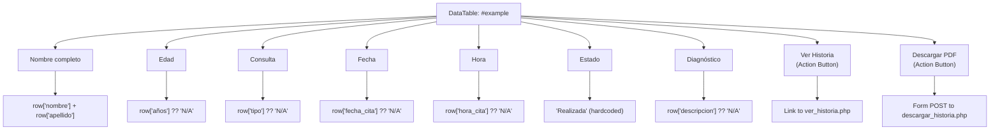
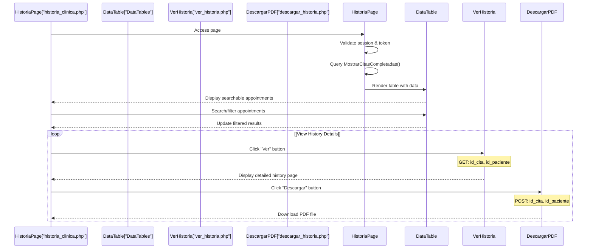
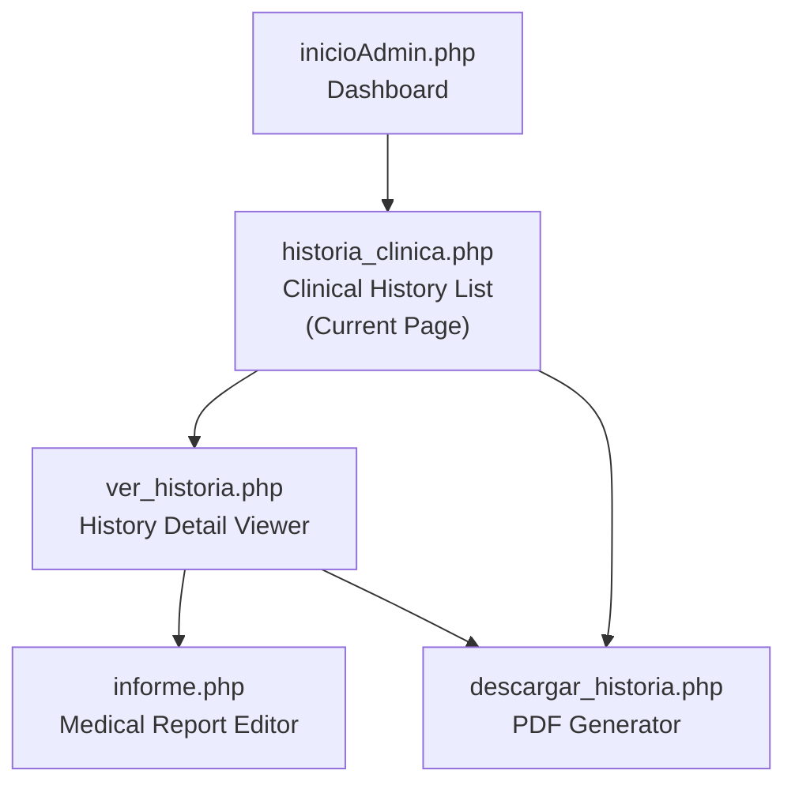

# Clinical History List View

> **Relevant source files**
> * [Admin/historia_clinica.php](https://github.com/axchisan/Consultorio_Emily_Bernal/blob/589034b9/Admin/historia_clinica.php)

## Purpose and Scope

This document describes the Clinical History List View page (`historia_clinica.php`), which serves as the primary interface for doctors to browse and access completed patient appointments. The page displays a searchable, sortable table of all appointments that have been marked as completed ("Realizada") and provides actions to view detailed clinical history or download PDF reports.

For information about viewing individual patient histories in detail, see [Clinical History Detail Viewer](/axchisan/Consultorio_Emily_Bernal/2.3.2-clinical-history-detail-viewer). For information about editing medical reports, see [Medical Report Editor](/axchisan/Consultorio_Emily_Bernal/2.3.3-medical-report-editor). For information about PDF generation, see [Clinical History PDF Generator](/axchisan/Consultorio_Emily_Bernal/3.1-clinical-history-pdf-generator).

**Sources:** [Admin/historia_clinica.php L1-L141](https://github.com/axchisan/Consultorio_Emily_Bernal/blob/589034b9/Admin/historia_clinica.php#L1-L141)

## Page Overview

The Clinical History List View is the entry point to the clinical history management workflow (section 2.3). It presents doctors with a comprehensive table of completed appointments, enabling them to:

* Search and filter patient appointments using DataTables functionality
* View patient demographics, consultation types, and diagnoses
* Navigate to detailed history views
* Download complete clinical history PDFs

The page enforces security through session validation and token verification, ensuring only authenticated doctors can access patient records associated with their appointments.

**Sources:** [Admin/historia_clinica.php L1-L141](https://github.com/axchisan/Consultorio_Emily_Bernal/blob/589034b9/Admin/historia_clinica.php#L1-L141)

## Security and Authentication Flow

The page implements a two-tier authentication mechanism before displaying any patient data:

```

```

### Session Validation

The first security layer checks for the presence of session variables at [Admin/historia_clinica.php L7-L12](https://github.com/axchisan/Consultorio_Emily_Bernal/blob/589034b9/Admin/historia_clinica.php#L7-L12)

 If either `$_SESSION['id_doctor']` or `$_SESSION['session_token']` is missing, the user is immediately redirected to the login page with an error message.

### Token Validation

The second security layer at [Admin/historia_clinica.php L17-L24](https://github.com/axchisan/Consultorio_Emily_Bernal/blob/589034b9/Admin/historia_clinica.php#L17-L24)

 calls `validarToken()` to verify that the session token matches the one stored in the database. This prevents concurrent logins from different devices. If the token is invalid, the current session is destroyed and the user is redirected with a notification about session closure.

**Sources:** [Admin/historia_clinica.php L2-L24](https://github.com/axchisan/Consultorio_Emily_Bernal/blob/589034b9/Admin/historia_clinica.php#L2-L24)

## Data Retrieval

After authentication, the page retrieves two datasets:

### Doctor Information Query

```

```

The `consultarDoctor()` function retrieves the logged-in doctor's information (name, gender, specialty) for display in the sidebar profile section at [Admin/historia_clinica.php L26](https://github.com/axchisan/Consultorio_Emily_Bernal/blob/589034b9/Admin/historia_clinica.php#L26-L26)

### Completed Appointments Query

```

```

The `MostrarCitasCompletadas()` function at [Admin/historia_clinica.php L27](https://github.com/axchisan/Consultorio_Emily_Bernal/blob/589034b9/Admin/historia_clinica.php#L27-L27)

 retrieves all completed appointments associated with the doctor. This function is defined in `php/consultas.php` (see [Query Functions & Database Abstraction](/axchisan/Consultorio_Emily_Bernal/4.4-query-functions-and-database-abstraction)) and returns a result set containing:

* Patient name and demographics
* Age (calculated from birth date)
* Consultation type
* Appointment date and time
* Diagnosis/description
* Appointment and patient IDs

**Sources:** [Admin/historia_clinica.php L26-L27](https://github.com/axchisan/Consultorio_Emily_Bernal/blob/589034b9/Admin/historia_clinica.php#L26-L27)

## User Interface Components

### Page Layout Structure

The page follows the standard administrative interface pattern with a sidebar and main content area:

| Component | Location | Purpose |
| --- | --- | --- |
| **Sidebar** | [Admin/historia_clinica.php L45-L71](https://github.com/axchisan/Consultorio_Emily_Bernal/blob/589034b9/Admin/historia_clinica.php#L45-L71) | Navigation menu and doctor profile |
| **Breadcrumbs** | [Admin/historia_clinica.php L79-L82](https://github.com/axchisan/Consultorio_Emily_Bernal/blob/589034b9/Admin/historia_clinica.php#L79-L82) | Navigation path: Inicio > Historia Clínica |
| **Content Header** | [Admin/historia_clinica.php L86](https://github.com/axchisan/Consultorio_Emily_Bernal/blob/589034b9/Admin/historia_clinica.php#L86-L86) | Page title: "Historias Clínicas" |
| **DataTable** | [Admin/historia_clinica.php L87-L122](https://github.com/axchisan/Consultorio_Emily_Bernal/blob/589034b9/Admin/historia_clinica.php#L87-L122) | Searchable appointment listing |

### Sidebar Navigation

The sidebar at [Admin/historia_clinica.php L45-L71](https://github.com/axchisan/Consultorio_Emily_Bernal/blob/589034b9/Admin/historia_clinica.php#L45-L71)

 displays:

1. **Doctor Profile Section**: Shows gender-specific avatar image (lines 53-57) and doctor's full name (line 58)
2. **Navigation Menu**: Links to other administrative pages with the current page marked as active (line 66)

The navigation includes:

* `inicioAdmin.php` - Appointments dashboard
* `doctores.php` - Doctor management
* `calendar.php` - Calendar and scheduling
* `historia_clinica.php` - Clinical history (active)
* `cerrar.php` - Logout

**Sources:** [Admin/historia_clinica.php L45-L71](https://github.com/axchisan/Consultorio_Emily_Bernal/blob/589034b9/Admin/historia_clinica.php#L45-L71)

## DataTable Implementation

### Table Structure

The DataTable displays completed appointments with nine columns defined at [Admin/historia_clinica.php L88-L99](https://github.com/axchisan/Consultorio_Emily_Bernal/blob/589034b9/Admin/historia_clinica.php#L88-L99)

:



### Column Details

| Column | Data Source | Display Logic |
| --- | --- | --- |
| **Nombre completo** | `row['nombre']` + `row['apellido']` | Concatenated patient name |
| **Edad** | `row['años']` | Age calculated in query, defaults to 'N/A' |
| **Consulta** | `row['tipo']` | Consultation type from `consultas` table |
| **Fecha** | `row['fecha_cita']` | Appointment date |
| **Hora** | `row['hora_cita']` | Appointment time |
| **Estado** | Hardcoded | Always displays "Realizada" (Completed) |
| **Diagnóstico** | `row['descripcion']` | Diagnosis description |
| **Ver Historia** | Action button | Links to detail view |
| **Descargar PDF** | Action button | Submits form to PDF generator |

The table body is populated by iterating through the `$resultadoCitas` result set at [Admin/historia_clinica.php L102-L120](https://github.com/axchisan/Consultorio_Emily_Bernal/blob/589034b9/Admin/historia_clinica.php#L102-L120)

**Sources:** [Admin/historia_clinica.php L87-L122](https://github.com/axchisan/Consultorio_Emily_Bernal/blob/589034b9/Admin/historia_clinica.php#L87-L122)

### DataTables JavaScript Integration

The page includes DataTables library resources:

* CSS: [Admin/historia_clinica.php L40-L41](https://github.com/axchisan/Consultorio_Emily_Bernal/blob/589034b9/Admin/historia_clinica.php#L40-L41) * `jquery.dataTables.min.css` - Core DataTables styling * `responsive.dataTables.min.css` - Responsive extension styling
* JavaScript: [Admin/historia_clinica.php L136-L139](https://github.com/axchisan/Consultorio_Emily_Bernal/blob/589034b9/Admin/historia_clinica.php#L136-L139) * `jquery-3.5.1.js` - jQuery dependency * `jquery.dataTables.min.js` - Core DataTables functionality * `dataTables.responsive.min.js` - Responsive extension * `datatable.js` - Custom initialization script

The custom initialization script at `src/js/lib/datatable/datatable.js` configures the table with ID `#example` to enable:

* Search functionality across all columns
* Sorting by clicking column headers
* Pagination controls
* Responsive behavior for mobile devices

**Sources:** [Admin/historia_clinica.php L40-L41](https://github.com/axchisan/Consultorio_Emily_Bernal/blob/589034b9/Admin/historia_clinica.php#L40-L41)

 [Admin/historia_clinica.php L136-L139](https://github.com/axchisan/Consultorio_Emily_Bernal/blob/589034b9/Admin/historia_clinica.php#L136-L139)

## User Actions and Workflow

### View History Action

Each table row includes a "Ver" (View) button at [Admin/historia_clinica.php L111](https://github.com/axchisan/Consultorio_Emily_Bernal/blob/589034b9/Admin/historia_clinica.php#L111-L111)

:

```

```

This button navigates to `ver_historia.php` with two GET parameters:

* `id_cita` - The appointment ID
* `id_paciente` - The patient ID

The destination page displays comprehensive patient information including demographics, anamnesis, and medical reports (see [Clinical History Detail Viewer](/axchisan/Consultorio_Emily_Bernal/2.3.2-clinical-history-detail-viewer)).

### Download PDF Action

Each table row includes a "Descargar" (Download) button within a form at [Admin/historia_clinica.php L112-L118](https://github.com/axchisan/Consultorio_Emily_Bernal/blob/589034b9/Admin/historia_clinica.php#L112-L118)

:

```

```

The form uses POST method to submit `id_cita` and `id_paciente` to `descargar_historia.php`, which generates and downloads a PDF containing the complete clinical history (see [Clinical History PDF Generator](/axchisan/Consultorio_Emily_Bernal/3.1-clinical-history-pdf-generator)).

**Workflow Diagram:**



**Sources:** [Admin/historia_clinica.php L111-L118](https://github.com/axchisan/Consultorio_Emily_Bernal/blob/589034b9/Admin/historia_clinica.php#L111-L118)

## Integration Points

### Database Dependencies

The page relies on two query functions from `php/consultas.php`:

1. **consultarDoctor()** - Retrieves doctor profile information * Input: Database connection, doctor ID * Output: Associative array with doctor details * Used at: [Admin/historia_clinica.php L26](https://github.com/axchisan/Consultorio_Emily_Bernal/blob/589034b9/Admin/historia_clinica.php#L26-L26)
2. **MostrarCitasCompletadas()** - Retrieves completed appointments * Input: Database connection, doctor ID * Output: MySQLi result set with appointment and patient data * Used at: [Admin/historia_clinica.php L27](https://github.com/axchisan/Consultorio_Emily_Bernal/blob/589034b9/Admin/historia_clinica.php#L27-L27) * Query filters: Appointments with `estado = 'Completada'` AND `id_doctor = $vUsuario`

For detailed information about these functions, see [Query Functions & Database Abstraction](/axchisan/Consultorio_Emily_Bernal/4.4-query-functions-and-database-abstraction).

### Navigation Flow



The Clinical History List View serves as the gateway to the clinical history subsystem, connecting to:

* **ver_historia.php** - Detailed view of a single patient's history
* **descargar_historia.php** - PDF generation for clinical history
* **inicioAdmin.php** - Return to dashboard via breadcrumbs

**Sources:** [Admin/historia_clinica.php L80-L82](https://github.com/axchisan/Consultorio_Emily_Bernal/blob/589034b9/Admin/historia_clinica.php#L80-L82)

 [Admin/historia_clinica.php L111-L118](https://github.com/axchisan/Consultorio_Emily_Bernal/blob/589034b9/Admin/historia_clinica.php#L111-L118)

## Asset Dependencies

### CSS Resources

The page includes five stylesheets at [Admin/historia_clinica.php L36-L41](https://github.com/axchisan/Consultorio_Emily_Bernal/blob/589034b9/Admin/historia_clinica.php#L36-L41)

:

| Resource | Purpose |
| --- | --- |
| `bootstrap.min.css` | Bootstrap 4.x framework styling |
| `admin.css` | Administrative interface custom styles |
| `custom_styles.css` | Additional custom styling |
| `fontawesome/css/all.css` | Font Awesome icon library |
| `jquery.dataTables.min.css` | DataTables core styling |
| `responsive.dataTables.min.css` | DataTables responsive extension |

### JavaScript Resources

The page includes six JavaScript files at [Admin/historia_clinica.php L133-L139](https://github.com/axchisan/Consultorio_Emily_Bernal/blob/589034b9/Admin/historia_clinica.php#L133-L139)

:

| Resource | Purpose | Load Order |
| --- | --- | --- |
| `jquery.js` | jQuery library (base dependency) | 1 |
| `bootstrap.min.js` | Bootstrap JavaScript components | 2 |
| `admin.js` | Administrative interface interactions | 3 |
| `jquery-3.5.1.js` | jQuery 3.5.1 for DataTables | 4 |
| `jquery.dataTables.min.js` | DataTables core functionality | 5 |
| `dataTables.responsive.min.js` | DataTables responsive extension | 6 |
| `datatable.js` | Custom DataTables initialization | 7 |

**Note:** The page loads jQuery twice (generic `jquery.js` and specific `jquery-3.5.1.js`). This may be intentional to ensure compatibility with both Bootstrap and DataTables.

**Sources:** [Admin/historia_clinica.php L36-L41](https://github.com/axchisan/Consultorio_Emily_Bernal/blob/589034b9/Admin/historia_clinica.php#L36-L41)

 [Admin/historia_clinica.php L133-L139](https://github.com/axchisan/Consultorio_Emily_Bernal/blob/589034b9/Admin/historia_clinica.php#L133-L139)

## Code Entity Reference

### Key PHP Variables

| Variable | Type | Source | Purpose |
| --- | --- | --- | --- |
| `$vUsuario` | int | `$_SESSION['id_doctor']` | Current logged-in doctor ID |
| `$row` | array | `consultarDoctor()` | Doctor profile data |
| `$resultadoCitas` | mysqli_result | `MostrarCitasCompletadas()` | Completed appointments result set |

### Key HTML/JavaScript Identifiers

| Identifier | Type | Purpose |
| --- | --- | --- |
| `#example` | table id | DataTables initialization target |
| `.sidebar` | class | Left navigation panel container |
| `.breadcrumb` | class | Navigation path container |
| `.btn-info` | class | "Ver" button styling |
| `.btn-success` | class | "Descargar" button styling |

### External Dependencies

| Dependency | Version/Type | Usage |
| --- | --- | --- |
| Bootstrap | 4.x | UI framework for layout and components |
| DataTables | jQuery plugin | Table search, sort, and pagination |
| Font Awesome | Icon library | Navigation and UI icons |

**Sources:** [Admin/historia_clinica.php L1-L141](https://github.com/axchisan/Consultorio_Emily_Bernal/blob/589034b9/Admin/historia_clinica.php#L1-L141)