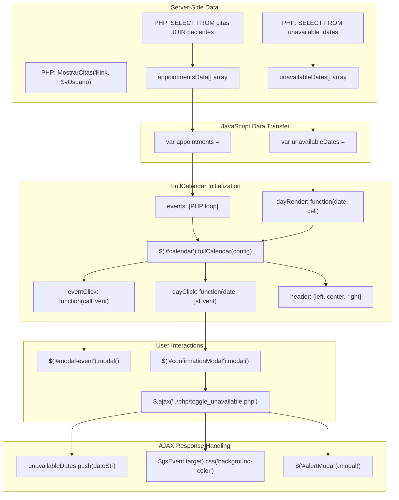
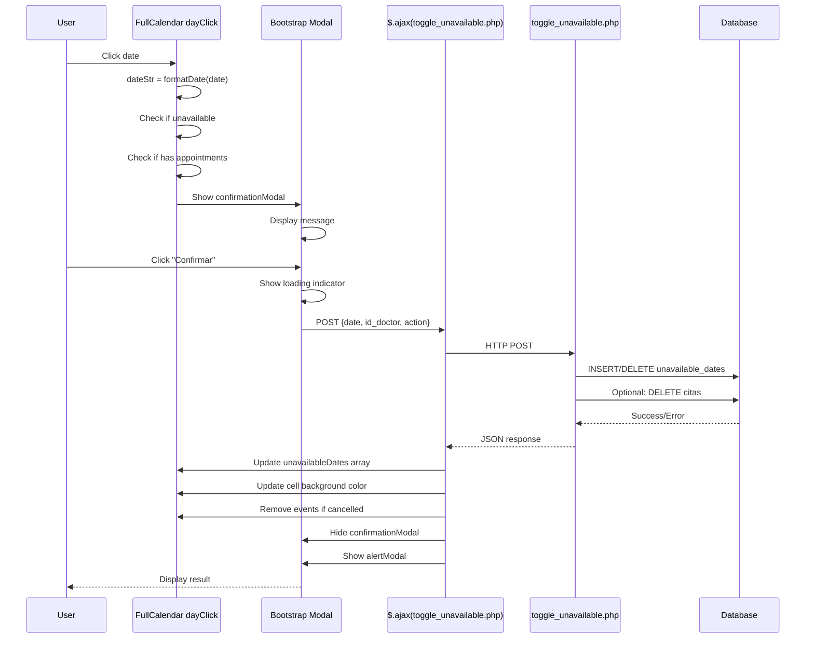
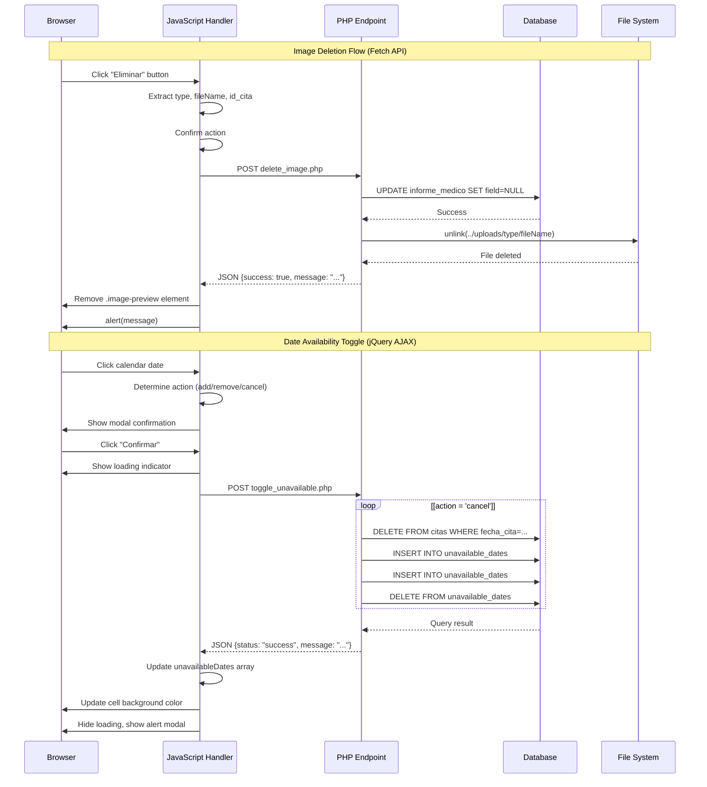
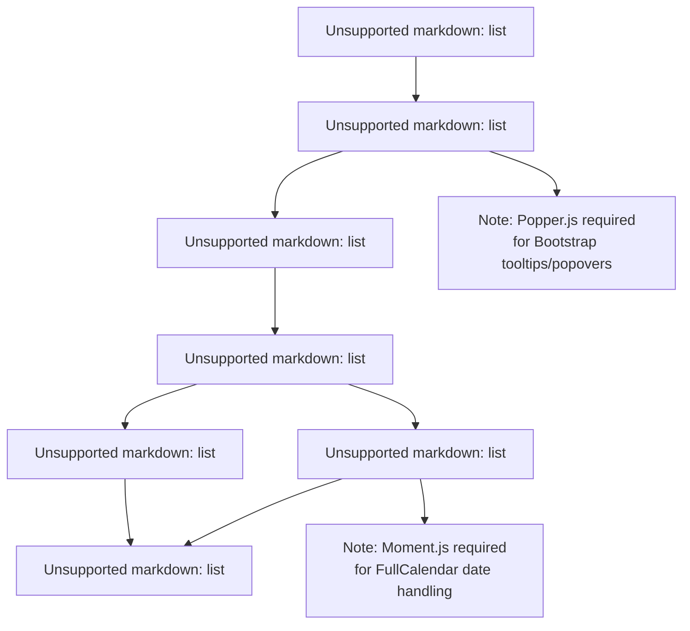

# Componentes de interfaz de usuario y frontend

> **Archivos fuente relevantes**
> * [Admin/calendario.php](https://github.com/axchisan/Consultorio_Emily_Bernal/blob/589034b9/Admin/calendar.php)
> * [Admin/historia_clinica.php](https://github.com/axchisan/Consultorio_Emily_Bernal/blob/589034b9/Admin/historia_clinica.php)
> * [Admin/informe.php](https://github.com/axchisan/Consultorio_Emily_Bernal/blob/589034b9/Admin/informe.php)
> * [Admin/inicioAdmin.php](https://github.com/axchisan/Consultorio_Emily_Bernal/blob/589034b9/Admin/inicioAdmin.php)

## Propósito y alcance

Este documento describe la arquitectura frontend del sistema del Consultorio Emily Bernal, detallando los componentes de la interfaz de usuario, las bibliotecas JavaScript, los frameworks de estilo y los patrones de interacción del lado del cliente. Abarca diseños basados ​​en Bootstrap, la integración con DataTables, la implementación de FullCalendar, los patrones de comunicación AJAX y la mensajería basada en sesiones.

Para el procesamiento backend y las consultas a la base de datos, consulte [Arquitectura de la base de datos](/axchisan/Consultorio_Emily_Bernal/4-database-architecture) . Para la generación de PDF, consulte [Sistema de generación de PDF](/axchisan/Consultorio_Emily_Bernal/3-pdf-generation-system) . Para mecanismos de seguridad, incluida la validación de tokens, consulte [Seguridad y autenticación](/axchisan/Consultorio_Emily_Bernal/5-security-and-authentication) .

## Descripción general de la arquitectura frontend

El sistema implementa una arquitectura frontend consistente en todas las interfaces administrativas, utilizando una estructura de tres capas del lado del cliente: presentación (HTML/Bootstrap), comportamiento (JavaScript/jQuery) y estilo (CSS). Todas las páginas comparten un diseño de barra lateral común con diseño adaptable.

### Pila de componentes

| Capa | Tecnologías | Objetivo |
| --- | --- | --- |
| **Estructura** | Bootstrap 4.0.0 | Diseño adaptable, sistema de cuadrícula, componentes de interfaz de usuario |
| **Núcleo de JavaScript** | jQuery 3.2.1+ | Manipulación del DOM, AJAX, manejo de eventos |
| **Tablas de datos** | Tablas de datos 1.x | Tablas interactivas con búsqueda, ordenación y paginación. |
| **Calendario** | Calendario completo 3.x | Visualización y programación de citas |
| **Iconos** | Fuente Awesome 5.x | Biblioteca de iconos para elementos de la interfaz de usuario |
| **Generación de PDF** | TCPDF (lado del servidor) | Generación de documentos (consulte [Referencia de la biblioteca TCPDF](/axchisan/Consultorio_Emily_Bernal/9-tcpdf-library-reference) ) |

### Patrón de estructura de página

Todas las páginas administrativas siguen un diseño consistente de dos columnas con barra lateral de navegación y área de contenido principal. La estructura se define en[Admin/inicioAdmin.php L51-L143](https://github.com/axchisan/Consultorio_Emily_Bernal/blob/589034b9/Admin/inicioAdmin.php#L51-L143)

 [calendar.php L139-L227](https://github.com/axchisan/Consultorio_Emily_Bernal/blob/589034b9/Admin/calendar.php#L139-L227)

y otras páginas de administración.

```mermaid
flowchart TD

Head[""]
Body[""]
MetaCharset[""]
BootstrapCSS["bootstrap.min.css"]
CustomCSS["admin.css, custom_styles.css"]
FontAwesome["fontawesome/css/all.css"]
LibraryCSS["DataTables/FullCalendar CSS"]
Aside[""]
Main[""]
Scripts["JavaScript Libraries"]
Toggle[".toggle (hamburger menu)"]
Profile[".profile (doctor info)"]
NavMenu[".nav-menu (navigation links)"]
SiteSection[".site-section"]
Container[".container"]
ContentBox[".content-box-large"]
Breadcrumb[".breadcrumb"]
PanelBody[".panel-body"]
jQuery["jquery.js"]
Popper["popper.min.js"]
BootstrapJS["bootstrap.min.js"]
AdminJS["admin.js"]
Libraries["DataTables/FullCalendar"]
CustomJS["Inline"]

Head --> MetaCharset
Head --> BootstrapCSS
Head --> CustomCSS
Head --> FontAwesome
Head --> LibraryCSS
Body --> Aside
Body --> Main
Body --> Scripts
Aside --> Toggle
Aside --> Profile
Aside --> NavMenu
Main --> SiteSection
Scripts --> jQuery
Scripts --> Popper
Scripts --> BootstrapJS
Scripts --> AdminJS
Scripts --> Libraries
Scripts --> CustomJS

subgraph subGraph5 ["Script Loading Order"]
    jQuery
    Popper
    BootstrapJS
    AdminJS
    Libraries
    CustomJS
end

subgraph subGraph4 ["Main Content Components"]
    SiteSection
    Container
    ContentBox
    Breadcrumb
    PanelBody
    SiteSection --> Container
    Container --> ContentBox
    ContentBox --> Breadcrumb
    ContentBox --> PanelBody
end

subgraph subGraph3 ["Sidebar Components"]
    Toggle
    Profile
    NavMenu
end

subgraph subGraph2 ["Body Structure"]
    Aside
    Main
    Scripts
end

subgraph subGraph1 ["Head Section"]
    MetaCharset
    BootstrapCSS
    CustomCSS
    FontAwesome
    LibraryCSS
end

subgraph subGraph0 ["HTML Document Structure"]
    Head
    Body
end
```

**Fuentes:** [Admin/inicioAdmin.php L30-L165](https://github.com/axchisan/Consultorio_Emily_Bernal/blob/589034b9/Admin/inicioAdmin.php#L30-L165)

 [calendar.php L64-L380](https://github.com/axchisan/Consultorio_Emily_Bernal/blob/589034b9/Admin/calendar.php#L64-L380)

 [Admin/historia_clinica.php L30-L141](https://github.com/axchisan/Consultorio_Emily_Bernal/blob/589034b9/Admin/historia_clinica.php#L30-L141)

## Integración y diseño de Bootstrap

### Sistema de cuadrícula y diseño adaptable

El sistema utiliza el sistema de cuadrícula de 12 columnas de Bootstrap 4 con puntos de interrupción adaptables. Las clases contenedoras principales incluyen `.container`, `.row`, y clases de columna como `.col-md-12`, `.col-md-6`.

**Puntos de interrupción responsivos utilizados:**

* `col-md-*`: Dispositivos medianos (≥768px)
* `col-lg-*`: Dispositivos grandes (≥992 px)

Ejemplo de implementación en[Admin/inicioAdmin.php L79-L142](https://github.com/axchisan/Consultorio_Emily_Bernal/blob/589034b9/Admin/inicioAdmin.php#L79-L142)

:

```html
<main class="bg bg-white">
    <div class="site-section">
        <div class="container">
            <div class="row justify-content-center">
                <div class="col-md-12">
                    <div class="content-box-large">
```

### Componente de navegación de la barra lateral

La barra lateral se implementa como un `<aside>`elemento de la clase `.sidebar`, que contiene información del perfil del médico y un menú de navegación. Utiliza la función de contracción de Bootstrap para optimizar la respuesta móvil.

```mermaid
flowchart TD

AsideSidebar[""]
DivToggle[""]
BurgerLink[""]
SideInner[""]
DivProfile[""]
ImgAvatar[""]
H3Name[""]
SpanCountry[""]
DivNavMenu[""]
UlList[""]
LiCitas[""]
LiDoctores[""]
LiCalendar[""]
LiHistoria[""]
LiCerrar[""]

SideInner --> DivProfile
SideInner --> DivNavMenu

subgraph subGraph2 ["Navigation Menu"]
    DivNavMenu
    UlList
    LiCitas
    LiDoctores
    LiCalendar
    LiHistoria
    LiCerrar
    DivNavMenu --> UlList
    UlList --> LiCitas
    UlList --> LiDoctores
    UlList --> LiCalendar
    UlList --> LiHistoria
    UlList --> LiCerrar
end

subgraph subGraph1 ["Profile Section"]
    DivProfile
    ImgAvatar
    H3Name
    SpanCountry
    DivProfile --> ImgAvatar
    DivProfile --> H3Name
    DivProfile --> H3Name
    DivProfile --> SpanCountry
end

subgraph subGraph0 ["Sidebar Structure"]
    AsideSidebar
    DivToggle
    BurgerLink
    SideInner
    AsideSidebar --> DivToggle
    AsideSidebar --> SideInner
    DivToggle --> BurgerLink
end
```

Representación condicional del avatar según el género del médico en[Admin/inicioAdmin.php L59-L63](https://github.com/axchisan/Consultorio_Emily_Bernal/blob/589034b9/Admin/inicioAdmin.php#L59-L63)

:

```php
<?php if ($row['sexo'] == 'Masculino') { ?>
    
<?php } elseif ($row['sexo'] == 'Femenino') { ?>
    
```

**Fuentes:** [Admin/inicioAdmin.php L51-L77](https://github.com/axchisan/Consultorio_Emily_Bernal/blob/589034b9/Admin/inicioAdmin.php#L51-L77)

 [calendar.php L139-L171](https://github.com/axchisan/Consultorio_Emily_Bernal/blob/589034b9/Admin/calendar.php#L139-L171)

 [Admin/historia_clinica.php L45-L71](https://github.com/axchisan/Consultorio_Emily_Bernal/blob/589034b9/Admin/historia_clinica.php#L45-L71)

 [Admin/informe.php L451-L484](https://github.com/axchisan/Consultorio_Emily_Bernal/blob/589034b9/Admin/informe.php#L451-L484)

### Componentes de la tarjeta

Los componentes de tarjeta de Bootstrap se utilizan ampliamente para la organización de contenido, especialmente en el editor de informes médicos. Cada sección utiliza las clases `.card`, `.card-header`y `.card-body`.

**Estructura de la tarjeta en el formulario de informe médico:** [Admin/informe.php L510-L585](https://github.com/axchisan/Consultorio_Emily_Bernal/blob/589034b9/Admin/informe.php#L510-L585)

 [Admin/informe.php L588-L661](https://github.com/axchisan/Consultorio_Emily_Bernal/blob/589034b9/Admin/informe.php#L588-L661)

 [Admin/informe.php L671-L682](https://github.com/axchisan/Consultorio_Emily_Bernal/blob/589034b9/Admin/informe.php#L671-L682)

 [Admin/informe.php L685-L780](https://github.com/axchisan/Consultorio_Emily_Bernal/blob/589034b9/Admin/informe.php#L685-L780)

```html
<div class="card mb-4">
    <div class="card-header">
        <i class="fas fa-user"></i> Información General
    </div>
    <div class="card-body patient-info">
        <!-- Form fields -->
    </div>
</div>
```

### Estilo de formulario

Las clases de formulario de Bootstrap se utilizan en todo momento: `.form-control`, `.form-group`, `.custom-file-input`. Los estilos personalizados amplían los estilos de formulario base de Bootstrap en[Admin/informe.php L727-L754](https://github.com/axchisan/Consultorio_Emily_Bernal/blob/589034b9/Admin/informe.php#L727-L754)

**Fuentes:** [Admin/informe.php L508-L668](https://github.com/axchisan/Consultorio_Emily_Bernal/blob/589034b9/Admin/informe.php#L508-L668)

 [Admin/informe.php L690-L772](https://github.com/axchisan/Consultorio_Emily_Bernal/blob/589034b9/Admin/informe.php#L690-L772)

### Estilos de botones

El sistema utiliza clases de botones Bootstrap con extensiones personalizadas:

* `.btn.btn-primary`- Acciones primarias
* `.btn.btn-success`- Acciones de éxito/descarga
* `.btn.btn-danger`- Eliminar acciones
* `.btn.btn-info`- Información/ver acciones
* `.btn.btn-secondary`- Cancelar acciones

Clases de botones personalizados: `.btn-update`, `.btn-save`, `.btn-pdf`definidos en CSS personalizado.

**Fuentes:** [Admin/inicioAdmin.php L128-L130](https://github.com/axchisan/Consultorio_Emily_Bernal/blob/589034b9/Admin/inicioAdmin.php#L128-L130)

 [Admin/historia_clinica.php L111-L117](https://github.com/axchisan/Consultorio_Emily_Bernal/blob/589034b9/Admin/historia_clinica.php#L111-L117)

 [Admin/informe.php L664-L666](https://github.com/axchisan/Consultorio_Emily_Bernal/blob/589034b9/Admin/informe.php#L664-L666)

 [Admin/informe.php L768-L777](https://github.com/axchisan/Consultorio_Emily_Bernal/blob/589034b9/Admin/informe.php#L768-L777)

### Diálogos modales

Los modales de Bootstrap se utilizan para confirmaciones y alertas. Se implementan dos patrones modales:

**Modal de confirmación** en[calendar.php L88-L117](https://github.com/axchisan/Consultorio_Emily_Bernal/blob/589034b9/Admin/calendar.php#L88-L117)

:

```html
<div class="modal fade" id="confirmationModal">
    <div class="modal-dialog">
        <div class="modal-content">
            <div class="modal-header" style="background-color: #6f42c1; color: white;">
            <div class="modal-body" id="confirmationMessage">
            <div class="modal-footer">
```

**Modal de alerta** en[calendar.php L120-L137](https://github.com/axchisan/Consultorio_Emily_Bernal/blob/589034b9/Admin/calendar.php#L120-L137)

:

```html
<div class="modal fade" id="alertModal">
```

**Fuentes:** [calendar.php L87-L137](https://github.com/axchisan/Consultorio_Emily_Bernal/blob/589034b9/Admin/calendar.php#L87-L137)

## Implementación de tablas de datos

DataTables proporciona una funcionalidad de tabla interactiva con búsqueda, clasificación, paginación y diseño adaptable para listas de citas y vistas de historial clínico.

### Flujo de integración de DataTables

```mermaid
sequenceDiagram
  participant HTML <table id='example'>
  participant jQuery Ready Handler
  participant DataTables Library
  participant datatable.js
  participant DataTables API

  HTML <table id='example'>->>jQuery Ready Handler: Document ready
  jQuery Ready Handler->>datatable.js: Load datatable.js
  datatable.js->>DataTables Library: $('
  DataTables Library->>DataTables API: Initialize instance
  DataTables API->>HTML <table id='example'>: Transform table
  HTML <table id='example'>->>HTML <table id='example'>: Add search box
  HTML <table id='example'>->>HTML <table id='example'>: Add pagination
  HTML <table id='example'>->>HTML <table id='example'>: Add sorting headers
  note over HTML <table id='example'>,DataTables API: User interactions handled by DataTables API
```

**Fuentes:** [Admin/inicioAdmin.php L160-L163](https://github.com/axchisan/Consultorio_Emily_Bernal/blob/589034b9/Admin/inicioAdmin.php#L160-L163)

 [Admin/historia_clinica.php L133-L139](https://github.com/axchisan/Consultorio_Emily_Bernal/blob/589034b9/Admin/historia_clinica.php#L133-L139)

### Inicialización de la tabla

Las tablas de datos se inicializan en tablas con `id="example"`. La inicialización ocurre en[src/js/lib/datatable/datatable.js](https://github.com/axchisan/Consultorio_Emily_Bernal/blob/589034b9/src/js/lib/datatable/datatable.js)

(referenciado en HTML).

**Estructura de tabla HTML** en[Admin/inicioAdmin.php L103-L134](https://github.com/axchisan/Consultorio_Emily_Bernal/blob/589034b9/Admin/inicioAdmin.php#L103-L134)

:

```php
<table id="example" class="table table-striped nowrap responsive">
    <thead>
        <tr>
            <th>Nombre completo</th>
            <th>Edad</th>
            <th>Consulta</th>
            <!-- ... -->
        </tr>
    </thead>
    <tbody>
        <?php while ($row = mysqli_fetch_array($resultadoCitas, MYSQLI_ASSOC)) { ?>
            <tr>
                <td><?php echo $row['nombre'] . ' ' . $row['apellido']; ?></td>
                <!-- ... -->
            </tr>
        <?php } ?>
    </tbody>
</table>
```

### Configuración de columnas

Las tablas incluyen columnas de acción con botones/enlaces para operaciones CRUD:

**Columnas de la tabla de citas** [Admin/inicioAdmin.php L105-L116](https://github.com/axchisan/Consultorio_Emily_Bernal/blob/589034b9/Admin/inicioAdmin.php#L105-L116)

:

1. Nombre completo
2. Edad
3. Consulta (Tipo de consulta)
4. Fecha
5. Hora (Tiempo)
6. Estado
7. Diagnóstico (Diagnosis)
8. Botón Editar (→ `realizar_consulta.php`)
9. Botón Ver informe (→ `informe.php`)
10. Botón Eliminar (→ `realizar_consultasUPDATE.php`)

**Columnas de la tabla de historia clínica** [Admin/historia_clinica.php L87-L99](https://github.com/axchisan/Consultorio_Emily_Bernal/blob/589034b9/Admin/historia_clinica.php#L87-L99)

:

1. Nombre completo
2. Edad
3. Consulta
4. Fecha
5. Hora
6. Estado
7. Diagnóstico
8. Botón Ver historial (→ `ver_historia.php`)
9. Botón Descargar PDF (→ `descargar_historia.php`)

### Clases CSS

DataTables-specific classes used:

* `.table.table-striped` - Zebra striping
* `.nowrap` - Prevent text wrapping
* `.responsive` - Responsive table behavior

Required CSS files referenced in [Admin/inicioAdmin.php L40-L41](https://github.com/axchisan/Consultorio_Emily_Bernal/blob/589034b9/Admin/inicioAdmin.php#L40-L41)

 and [Admin/historia_clinica.php L40-L41](https://github.com/axchisan/Consultorio_Emily_Bernal/blob/589034b9/Admin/historia_clinica.php#L40-L41)

:

```
<link rel="stylesheet" href="../src/js/lib/datatable/css/jquery.dataTables.min.css">
<link rel="stylesheet" href="../src/js/lib/datatable/css/responsive.dataTables.min.css">
```

### JavaScript Library Loading

DataTables libraries are loaded in specific order [Admin/inicioAdmin.php L157-L163](https://github.com/axchisan/Consultorio_Emily_Bernal/blob/589034b9/Admin/inicioAdmin.php#L157-L163)

:

```xml
<script src="../src/js/jquery.js"></script>
<script src="../src/css/lib/bootstrap/js/bootstrap.min.js"></script>
<script src="../src/js/admin.js"></script>
<script src="../src/js/lib/datatable/js/jquery-3.5.1.js"></script>
<script src="../src/js/lib/datatable/js/jquery.dataTables.min.js"></script>
<script src="../src/js/lib/datatable/js/dataTables.responsive.min.js"></script>
<script src="../src/js/lib/datatable/datatable.js"></script>
```

**Sources:** [Admin/inicioAdmin.php L103-L163](https://github.com/axchisan/Consultorio_Emily_Bernal/blob/589034b9/Admin/inicioAdmin.php#L103-L163)

 [Admin/historia_clinica.php L87-L139](https://github.com/axchisan/Consultorio_Emily_Bernal/blob/589034b9/Admin/historia_clinica.php#L87-L139)

## FullCalendar Integration

FullCalendar provides visual calendar interface for appointment management and date availability control in [Admin/calendar.php](https://github.com/axchisan/Consultorio_Emily_Bernal/blob/589034b9/Admin/calendar.php)

### FullCalendar Component Architecture



**Sources:** [Admin/calendar.php L23-L62](https://github.com/axchisan/Consultorio_Emily_Bernal/blob/589034b9/Admin/calendar.php#L23-L62)

 [Admin/calendar.php L230-L373](https://github.com/axchisan/Consultorio_Emily_Bernal/blob/589034b9/Admin/calendar.php#L230-L373)

### Calendar Configuration

FullCalendar is initialized with configuration in [Admin/calendar.php L251-L276](https://github.com/axchisan/Consultorio_Emily_Bernal/blob/589034b9/Admin/calendar.php#L251-L276)

:

```css
$('#calendar').fullCalendar({
    header: {
        left: 'prev,next',
        center: 'title',
        right: 'month,agendaWeek,agendaDay'
    },
    defaultDate: yyyy + '-' + mm + '-' + dd,
    buttonIcons: true,
    weekNumbers: false,
    editable: true,
    eventLimit: true,
    events: [/* PHP-generated events */]
});
```

### Event Data Structure

Appointment events are rendered via PHP loop in [Admin/calendar.php L263-L275](https://github.com/axchisan/Consultorio_Emily_Bernal/blob/589034b9/Admin/calendar.php#L263-L275)

:

```php
<?php while ($row1 = mysqli_fetch_array($resultadoDentistas)) { ?>
{
    id: '<?php echo $row1['id_cita']; ?>',
    title: '<?php echo htmlspecialchars($row1['tipo'], ENT_QUOTES, 'UTF-8'); ?>',
    description: '<?php echo 'El paciente ' . htmlspecialchars($row1['nombre']) . '...' ?>',
    start: '<?php echo $row1['fecha_cita']; ?>',
    textColor: 'White',
    display: 'background'
},
<?php } ?>
```

### Unavailable Dates Rendering

Unavailable dates are fetched in [Admin/calendar.php L23-L32](https://github.com/axchisan/Consultorio_Emily_Bernal/blob/589034b9/Admin/calendar.php#L23-L32)

 and applied via `dayRender` callback in [Admin/calendar.php L282-L287](https://github.com/axchisan/Consultorio_Emily_Bernal/blob/589034b9/Admin/calendar.php#L282-L287)

:

```javascript
dayRender: function(date, cell) {
    var dateStr = $.fullCalendar.formatDate(date, 'YYYY-MM-DD');
    if (unavailableDates.indexOf(dateStr) !== -1) {
        cell.css('background-color', '#ffcccc');
    }
}
```

### Date Click Interaction Flow



**Sources:** [Admin/calendar.php L288-L370](https://github.com/axchisan/Consultorio_Emily_Bernal/blob/589034b9/Admin/calendar.php#L288-L370)

### AJAX Toggle Unavailable Implementation

The date availability toggle uses jQuery AJAX in [Admin/calendar.php L304-L369](https://github.com/axchisan/Consultorio_Emily_Bernal/blob/589034b9/Admin/calendar.php#L304-L369)

:

```javascript
$('#confirmAction').off('click').on('click', function() {
    var action = isUnavailable ? 'remove' : (hasAppointments ? 'cancel' : 'add');
    $('#loadingIndicator').css('display', 'block').addClass('show');
    
    $.ajax({
        url: '../php/toggle_unavailable.php',
        type: 'POST',
        data: {
            date: dateStr,
            id_doctor: <?php echo $vUsuario; ?>,
            action: action
        },
        success: function(response) {
            // Update UI based on action
        },
        error: function(xhr, status, error) {
            $('#alertMessage').text('Error en la conexión: ' + error);
        }
    });
});
```

### Event Click Handler

Appointment event clicks display details in a modal [Admin/calendar.php L277-L281](https://github.com/axchisan/Consultorio_Emily_Bernal/blob/589034b9/Admin/calendar.php#L277-L281)

:

```css
eventClick: function(calEvent, jsEvent, view) {
    $('#event-title').text(calEvent.title);
    $('#event-description').html(calEvent.description);
    $('#modal-event').modal();
}
```

Event detail modal defined in [Admin/calendar.php L197-L214](https://github.com/axchisan/Consultorio_Emily_Bernal/blob/589034b9/Admin/calendar.php#L197-L214)

**Sources:** [Admin/calendar.php L197-L373](https://github.com/axchisan/Consultorio_Emily_Bernal/blob/589034b9/Admin/calendar.php#L197-L373)

### Library Dependencies

FullCalendar requires specific libraries loaded in order [Admin/calendar.php L76-L81](https://github.com/axchisan/Consultorio_Emily_Bernal/blob/589034b9/Admin/calendar.php#L76-L81)

:

```xml
<script src="https://code.jquery.com/jquery-3.2.1.js"></script>
<script type='text/javascript' src='../src/js/lib/FullCalendar/moment.min.js'></script>
<script type='text/javascript' src='../src/js/lib/FullCalendar/fullcalendar.min.js'></script>
<script type='text/javascript' src='../src/js/lib/FullCalendar/locale/es.js'></script>
```

CSS loaded at [Admin/calendar.php L73](https://github.com/axchisan/Consultorio_Emily_Bernal/blob/589034b9/Admin/calendar.php#L73-L73)

:

```
<link rel='stylesheet' type='text/css' href='../src/css/fullcalendar.css' />
```

**Sources:** [Admin/calendar.php L73-L81](https://github.com/axchisan/Consultorio_Emily_Bernal/blob/589034b9/Admin/calendar.php#L73-L81)

 [Admin/calendar.php L230-L373](https://github.com/axchisan/Consultorio_Emily_Bernal/blob/589034b9/Admin/calendar.php#L230-L373)

## AJAX & Dynamic Interactions

The system uses two AJAX patterns: jQuery `$.ajax()` and modern Fetch API for asynchronous server communication.

### AJAX Patterns Comparison

| Pattern | Location | Method | Purpose |
| --- | --- | --- | --- |
| **jQuery $.ajax()** | [Admin/calendar.php L312-L368](https://github.com/axchisan/Consultorio_Emily_Bernal/blob/589034b9/Admin/calendar.php#L312-L368) | `$.ajax({url, type, data, success, error})` | Toggle unavailable dates |
| **Fetch API** | [Admin/informe.php L838-L857](https://github.com/axchisan/Consultorio_Emily_Bernal/blob/589034b9/Admin/informe.php#L838-L857) | `fetch(url, {method, headers, body})` | Delete images |

### jQuery AJAX Pattern

Used in calendar date availability management [Admin/calendar.php L312-L368](https://github.com/axchisan/Consultorio_Emily_Bernal/blob/589034b9/Admin/calendar.php#L312-L368)

:

```javascript
$.ajax({
    url: '../php/toggle_unavailable.php',
    type: 'POST',
    data: {
        date: dateStr,
        id_doctor: <?php echo $vUsuario; ?>,
        action: action
    },
    success: function(response) {
        var res = typeof response === 'string' ? JSON.parse(response) : response;
        if (res.status === 'success') {
            // Update UI
        }
    },
    error: function(xhr, status, error) {
        $('#alertMessage').text('Error en la conexión: ' + error);
    },
    complete: function() {
        // Hide loading indicator
    }
});
```

### Fetch API Pattern

Used in medical report image deletion [Admin/informe.php L838-L857](https://github.com/axchisan/Consultorio_Emily_Bernal/blob/589034b9/Admin/informe.php#L838-L857)

:

```javascript
fetch('delete_image.php', {
    method: 'POST',
    headers: {
        'Content-Type': 'application/x-www-form-urlencoded'
    },
    body: `type=${type}&file_name=${encodeURIComponent(fileName)}&id_cita=${idCita}`
})
.then(response => response.json())
.then(data => {
    if (data.success) {
        imagePreview.remove();
        alert(data.message);
    } else {
        alert(data.message);
    }
})
.catch(error => {
    console.error('Error:', error);
    alert('Ocurrió un error al eliminar la imagen');
});
```

### AJAX Request/Response Flow Diagram



**Sources:** [Admin/calendar.php L304-L369](https://github.com/axchisan/Consultorio_Emily_Bernal/blob/589034b9/Admin/calendar.php#L304-L369)

 [Admin/informe.php L829-L860](https://github.com/axchisan/Consultorio_Emily_Bernal/blob/589034b9/Admin/informe.php#L829-L860)

### Form Submission Patterns

Standard form submissions use POST with redirect pattern (Post-Redirect-Get):

**Medical Report Form** [Admin/informe.php L690-L772](https://github.com/axchisan/Consultorio_Emily_Bernal/blob/589034b9/Admin/informe.php#L690-L772)

:

```html
<form method="POST" action="" enctype="multipart/form-data">
    <div class="form-group">
        <textarea name="examen_intraoral">...</textarea>
    </div>
    <button type="submit" name="update_medical">Guardar</button>
</form>
```

Processing in [Admin/informe.php L174-L424](https://github.com/axchisan/Consultorio_Emily_Bernal/blob/589034b9/Admin/informe.php#L174-L424)

 follows pattern:

1. Check `$_SERVER['REQUEST_METHOD'] === 'POST'`
2. Validate and sanitize inputs
3. Execute database operations
4. Set session message variables
5. Redirect: `header("Location: informe.php?id=$patient_id")`

**Sources:** [Admin/informe.php L174-L425](https://github.com/axchisan/Consultorio_Emily_Bernal/blob/589034b9/Admin/informe.php#L174-L425)

 [Admin/informe.php L690-L778](https://github.com/axchisan/Consultorio_Emily_Bernal/blob/589034b9/Admin/informe.php#L690-L778)

### Loading Indicators

The calendar implements a custom loading indicator shown during AJAX operations [Admin/calendar.php L101-L110](https://github.com/axchisan/Consultorio_Emily_Bernal/blob/589034b9/Admin/calendar.php#L101-L110)

:

```html
<div class="modal-body" id="loadingIndicator" style="display: none;">
    <div class="loading-container">
        <div class="spinner">
            <div class="circle circle-1"></div>
            <div class="circle circle-2"></div>
            <div class="circle circle-3"></div>
        </div>
        <p class="loading-text">Procesando, por favor espera...</p>
    </div>
</div>
```

Timing logic ensures minimum 1-second visibility [Admin/calendar.php L359-L367](https://github.com/axchisan/Consultorio_Emily_Bernal/blob/589034b9/Admin/calendar.php#L359-L367)

:

```javascript
complete: function() {
    let elapsedTime = Date.now() - startTime;
    let delay = elapsedTime < 1000 ? 1000 - elapsedTime : 0;
    setTimeout(function() {
        $('#loadingIndicator').removeClass('show').css('display', 'none');
    }, delay);
}
```

**Sources:** [Admin/calendar.php L101-L110](https://github.com/axchisan/Consultorio_Emily_Bernal/blob/589034b9/Admin/calendar.php#L101-L110)

 [Admin/calendar.php L306-L367](https://github.com/axchisan/Consultorio_Emily_Bernal/blob/589034b9/Admin/calendar.php#L306-L367)

## Session-Based Flash Messaging

The system implements a flash messaging pattern using PHP session variables with Bootstrap alert components for user feedback.

### Message Flow Diagram

```

```

**Sources:** [Admin/inicioAdmin.php L93-L101](https://github.com/axchisan/Consultorio_Emily_Bernal/blob/589034b9/Admin/inicioAdmin.php#L93-L101)

 [Admin/informe.php L497-L506](https://github.com/axchisan/Consultorio_Emily_Bernal/blob/589034b9/Admin/informe.php#L497-L506)

### Session Variables

Two session variables control flash messaging:

| Variable | Purpose | Values |
| --- | --- | --- |
| `$_SESSION['MensajeTexto']` | Message content | String (any text) |
| `$_SESSION['MensajeTipo']` | Bootstrap alert class | `"p-3 mb-2 bg-success text-white"` or `"p-3 mb-2 bg-danger text-white"` |

### Setting Messages (Server-Side)

Messages are set before redirect in [Admin/informe.php L162-L163](https://github.com/axchisan/Consultorio_Emily_Bernal/blob/589034b9/Admin/informe.php#L162-L163)

:

```
if (mysqli_stmt_execute($stmt)) {
    $_SESSION['MensajeTexto'] = "Datos del paciente actualizados correctamente.";
    $_SESSION['MensajeTipo'] = "p-3 mb-2 bg-success text-white";
} else {
    $_SESSION['MensajeTexto'] = "Error al actualizar los datos del paciente: " . mysqli_error($link);
    $_SESSION['MensajeTipo'] = "p-3 mb-2 bg-danger text-white";
}
header("Location: informe.php?id=$patient_id");
exit();
```

### Displaying Messages (Client-Side)

Messages are displayed and cleared in [Admin/inicioAdmin.php L93-L101](https://github.com/axchisan/Consultorio_Emily_Bernal/blob/589034b9/Admin/inicioAdmin.php#L93-L101)

:

```php
<?php if (isset($_SESSION['MensajeTexto'])) { ?>
    <div class="alert <?php echo $_SESSION['MensajeTipo']; ?>" role="alert">
        <?php echo $_SESSION['MensajeTexto']; ?>
        <button class="delete"><i class="fa fa-times"></i></button>
    </div>
<?php
    $_SESSION['MensajeTexto'] = null;
    $_SESSION['MensajeTipo'] = null;
} ?>
```

Alternative rendering pattern in [Admin/informe.php L497-L506](https://github.com/axchisan/Consultorio_Emily_Bernal/blob/589034b9/Admin/informe.php#L497-L506)

:

```php
<?php if (isset($_SESSION['MensajeTexto'])) { ?>
    <div class="alert <?php echo htmlspecialchars($_SESSION['MensajeTipo']); ?>" role="alert">
        <?php echo htmlspecialchars($_SESSION['MensajeTexto']); ?>
        <button class="delete"><i class="fa fa-times"></i></button>
    </div>
    <?php
    $_SESSION['MensajeTexto'] = null;
    $_SESSION['MensajeTipo'] = null;
    ?>
<?php } ?>
```

### JavaScript Close Handler

Alert dismissal is handled via JavaScript in [Admin/inicioAdmin.php L146-L154](https://github.com/axchisan/Consultorio_Emily_Bernal/blob/589034b9/Admin/inicioAdmin.php#L146-L154)

 and [Admin/informe.php L813-L819](https://github.com/axchisan/Consultorio_Emily_Bernal/blob/589034b9/Admin/informe.php#L813-L819)

:

```javascript
document.addEventListener('DOMContentLoaded', () => {
    (document.querySelectorAll('.alert .delete') || []).forEach(($delete) => {
        const $notification = $delete.parentNode;
        $delete.addEventListener('click', () => {
            $notification.parentNode.removeChild($notification);
        });
    });
});
```

**Sources:** [Admin/inicioAdmin.php L93-L101](https://github.com/axchisan/Consultorio_Emily_Bernal/blob/589034b9/Admin/inicioAdmin.php#L93-L101)

 [Admin/inicioAdmin.php L146-L154](https://github.com/axchisan/Consultorio_Emily_Bernal/blob/589034b9/Admin/inicioAdmin.php#L146-L154)

 [Admin/informe.php L161-L170](https://github.com/axchisan/Consultorio_Emily_Bernal/blob/589034b9/Admin/informe.php#L161-L170)

 [Admin/informe.php L497-L506](https://github.com/axchisan/Consultorio_Emily_Bernal/blob/589034b9/Admin/informe.php#L497-L506)

 [Admin/informe.php L813-L819](https://github.com/axchisan/Consultorio_Emily_Bernal/blob/589034b9/Admin/informe.php#L813-L819)

### Usage Across Pages

All administrative pages implement this pattern:

| Page | Setting Location | Display Location |
| --- | --- | --- |
| `inicioAdmin.php` | N/A (receives only) | [Admin/inicioAdmin.php L93-L101](https://github.com/axchisan/Consultorio_Emily_Bernal/blob/589034b9/Admin/inicioAdmin.php#L93-L101) |
| `informe.php` | [Admin/informe.php L161-L170](https://github.com/axchisan/Consultorio_Emily_Bernal/blob/589034b9/Admin/informe.php#L161-L170) <br>  [Admin/informe.php L380-L384](https://github.com/axchisan/Consultorio_Emily_Bernal/blob/589034b9/Admin/informe.php#L380-L384) | [Admin/informe.php L497-L506](https://github.com/axchisan/Consultorio_Emily_Bernal/blob/589034b9/Admin/informe.php#L497-L506) |
| `calendar.php` | (Uses modal alerts instead) | N/A |
| `historia_clinica.php` | N/A (receives from redirects) | Similar pattern |
| `realizar_consulta.php` | Sets before redirect | Similar pattern |

**Sources:** [Admin/inicioAdmin.php L93-L101](https://github.com/axchisan/Consultorio_Emily_Bernal/blob/589034b9/Admin/inicioAdmin.php#L93-L101)

 [Admin/informe.php L161-L170](https://github.com/axchisan/Consultorio_Emily_Bernal/blob/589034b9/Admin/informe.php#L161-L170)

 [Admin/informe.php L380-L384](https://github.com/axchisan/Consultorio_Emily_Bernal/blob/589034b9/Admin/informe.php#L380-L384)

 [Admin/informe.php L497-L506](https://github.com/axchisan/Consultorio_Emily_Bernal/blob/589034b9/Admin/informe.php#L497-L506)

## Custom JavaScript Components

### File Upload Display Handler

Custom file input styling with filename display in [Admin/informe.php L821-L827](https://github.com/axchisan/Consultorio_Emily_Bernal/blob/589034b9/Admin/informe.php#L821-L827)

:

```javascript
document.querySelectorAll('.custom-file-input').forEach(input => {
    input.addEventListener('change', function() {
        const fileName = this.files[0]?.name || 'Selecciona un archivo...';
        this.parentElement.querySelector('.file-upload-text').textContent = fileName;
    });
});
```

HTML structure in [Admin/informe.php L727-L733](https://github.com/axchisan/Consultorio_Emily_Bernal/blob/589034b9/Admin/informe.php#L727-L733)

:

```html
<div class="file-upload-wrapper">
    <input type="file" class="custom-file-input" id="radiografia" name="radiografia" accept="image/*">
    <span class="file-upload-text">Selecciona una radiografía...</span>
    <button type="button" class="file-upload-btn"><i class="fas fa-upload"></i> Subir</button>
</div>
```

**Sources:** [Admin/informe.php L727-L753](https://github.com/axchisan/Consultorio_Emily_Bernal/blob/589034b9/Admin/informe.php#L727-L753)

 [Admin/informe.php L821-L827](https://github.com/axchisan/Consultorio_Emily_Bernal/blob/589034b9/Admin/informe.php#L821-L827)

### Contador de caracteres

Contador de caracteres de área de texto para campos de entrada limitados en[Admin/informe.php L792-L810](https://github.com/axchisan/Consultorio_Emily_Bernal/blob/589034b9/Admin/informe.php#L792-L810)

:

```javascript
const historiaOtros = document.getElementById('historia_otros');
const charCount = document.getElementById('char_count');
const maxLength = parseInt(historiaOtros.getAttribute('maxlength')); // 17

const updateCharCount = () => {
    const remaining = maxLength - historiaOtros.value.length;
    charCount.textContent = remaining;
    charCount.classList.toggle('low', remaining < 5);
};

updateCharCount(); // Initial
historiaOtros.addEventListener('input', updateCharCount);
```

Implementación de HTML en[Admin/informe.php L648-L652](https://github.com/axchisan/Consultorio_Emily_Bernal/blob/589034b9/Admin/informe.php#L648-L652)

:

```xml
<td colspan="2" class="position-relative">
    <textarea class="form-control compact-textarea" name="historia_otros" id="historia_otros" maxlength="17"></textarea>
    <span id="char_count" class="char-counter"></span>
</td>
```

**Fuentes:** [Admin/informe.php L648-L652](https://github.com/axchisan/Consultorio_Emily_Bernal/blob/589034b9/Admin/informe.php#L648-L652)

 [Admin/informe.php L792-L810](https://github.com/axchisan/Consultorio_Emily_Bernal/blob/589034b9/Admin/informe.php#L792-L810)

### Confirmación de eliminación

Diálogo de confirmación simple para la eliminación de citas en[Admin/inicioAdmin.php L44-L47](https://github.com/axchisan/Consultorio_Emily_Bernal/blob/589034b9/Admin/inicioAdmin.php#L44-L47)

:

```javascript
function confirmation() {
    return confirm("¿Realmente desea eliminar esta cita?");
}
```

Llamado en línea en el enlace[Admin/inicioAdmin.php L130](https://github.com/axchisan/Consultorio_Emily_Bernal/blob/589034b9/Admin/inicioAdmin.php#L130-L130)

:

```
<a onclick="return confirmation()">
```

**Fuentes:** [Admin/inicioAdmin.php L44-L47](https://github.com/axchisan/Consultorio_Emily_Bernal/blob/589034b9/Admin/inicioAdmin.php#L44-L47)

 [Admin/inicioAdmin.php L130](https://github.com/axchisan/Consultorio_Emily_Bernal/blob/589034b9/Admin/inicioAdmin.php#L130-L130)

### Controlador de eliminación de imágenes

Eliminación de imágenes basada en AJAX en[Admin/informe.php L829-L860](https://github.com/axchisan/Consultorio_Emily_Bernal/blob/589034b9/Admin/informe.php#L829-L860)

:

```typescript
document.querySelectorAll('.remove-image').forEach(button => {
    button.addEventListener('click', function() {
        const imagePreview = this.parentElement;
        const type = this.getAttribute('data-type'); // 'radiografia' or 'foto_boca'
        const fileName = imagePreview.querySelector('img').src.split('/').pop();
        const idCita = <?php echo json_encode($appointment['id_cita']); ?>;
        
        if (confirm('¿Estás seguro de que deseas eliminar esta imagen?')) {
            fetch('delete_image.php', {
                method: 'POST',
                headers: {'Content-Type': 'application/x-www-form-urlencoded'},
                body: `type=${type}&file_name=${encodeURIComponent(fileName)}&id_cita=${idCita}`
            })
            .then(response => response.json())
            .then(data => {
                if (data.success) {
                    imagePreview.remove();
                    alert(data.message);
                }
            });
        }
    });
});
```

Botón HTML en[Admin/informe.php L737](https://github.com/axchisan/Consultorio_Emily_Bernal/blob/589034b9/Admin/informe.php#L737-L737)

:

```xml
<button type="button" class="remove-image" data-type="radiografia">
    <i class="fas fa-trash-alt"></i> Eliminar
</button>
```

**Fuentes:** [Admin/informe.php L734-L738](https://github.com/axchisan/Consultorio_Emily_Bernal/blob/589034b9/Admin/informe.php#L734-L738)

 [Admin/informe.php L748-L752](https://github.com/axchisan/Consultorio_Emily_Bernal/blob/589034b9/Admin/informe.php#L748-L752)

 [Admin/informe.php L829-L860](https://github.com/axchisan/Consultorio_Emily_Bernal/blob/589034b9/Admin/informe.php#L829-L860)

### Utilidad de formato de fecha

Función auxiliar para rellenar fechas de calendario en[calendar.php L231-L236](https://github.com/axchisan/Consultorio_Emily_Bernal/blob/589034b9/Admin/calendar.php#L231-L236)

:

```javascript
function addZero(i) {
    if (i < 10) {
        i = '0' + i;
    }
    return i;
}

var hoy = new Date();
var dd = addZero(hoy.getDate());
var mm = addZero(hoy.getMonth() + 1);
var yyyy = hoy.getFullYear();
```

Se utiliza para construir `defaultDate`la inicialización de FullCalendar[calendar.php L257](https://github.com/axchisan/Consultorio_Emily_Bernal/blob/589034b9/Admin/calendar.php#L257-L257)

:

```yaml
defaultDate: yyyy + '-' + mm + '-' + dd
```

**Fuentes:** [calendar.php L231-L244](https://github.com/axchisan/Consultorio_Emily_Bernal/blob/589034b9/Admin/calendar.php#L231-L244)

 [calendar.php L257](https://github.com/axchisan/Consultorio_Emily_Bernal/blob/589034b9/Admin/calendar.php#L257-L257)

## Dependencias de la biblioteca de JavaScript

### Orden de carga de dependencia

El orden correcto de carga de la biblioteca es fundamental para un funcionamiento correcto. El sistema sigue este patrón:



**Fuentes:** [Admin/inicioAdmin.php L157-L163](https://github.com/axchisan/Consultorio_Emily_Bernal/blob/589034b9/Admin/inicioAdmin.php#L157-L163)

 [calendar.php L76-L81](https://github.com/axchisan/Consultorio_Emily_Bernal/blob/589034b9/Admin/calendar.php#L76-L81)

 [Admin/historia_clinica.php L133-L139](https://github.com/axchisan/Consultorio_Emily_Bernal/blob/589034b9/Admin/historia_clinica.php#L133-L139)

### Versiones de la biblioteca

| Biblioteca | Versión | CDN/Local | Objetivo |
| --- | --- | --- | --- |
| **jQuery** | 3.2.1+ | CDN y local | Manipulación del DOM, AJAX |
| **Oreja** | 4.0.0 | Local | Marco de interfaz de usuario |
| **Popper.js** | 1.12.9 | CDN | Posicionamiento bootstrap |
| **Tablas de datos** | 1.x | Local | Mejoras en la tabla |
| **Calendario completo** | 3.x | Local | Widget de calendario |
| **Momento.js** | El último | Local | Manipulación de fechas |
| **Fuente increíble** | 5.x | Local | Fuentes de iconos |

### Patrón de carga estándar

**Páginas con tablas de datos** [Admin/inicioAdmin.php L157-L163](https://github.com/axchisan/Consultorio_Emily_Bernal/blob/589034b9/Admin/inicioAdmin.php#L157-L163)

:

```xml
<script src="../src/js/jquery.js"></script>
<script src="../src/css/lib/bootstrap/js/bootstrap.min.js"></script>
<script src="../src/js/admin.js"></script>
<script src="../src/js/lib/datatable/js/jquery-3.5.1.js"></script>
<script src="../src/js/lib/datatable/js/jquery.dataTables.min.js"></script>
<script src="../src/js/lib/datatable/js/dataTables.responsive.min.js"></script>
<script src="../src/js/lib/datatable/datatable.js"></script>
```

**Páginas con calendario completo** [calendar.php L76-L81](https://github.com/axchisan/Consultorio_Emily_Bernal/blob/589034b9/Admin/calendar.php#L76-L81)

:

```xml
<script src="https://code.jquery.com/jquery-3.2.1.js"></script>
<script src="https://cdnjs.cloudflare.com/ajax/libs/popper.js/1.12.9/umd/popper.min.js"></script>
<script src="https://maxcdn.bootstrapcdn.com/bootstrap/4.0.0/js/bootstrap.min.js"></script>
<script type='text/javascript' src='../src/js/lib/FullCalendar/moment.min.js'></script>
<script type='text/javascript' src='../src/js/lib/FullCalendar/fullcalendar.min.js'></script>
<script type='text/javascript' src='../src/js/lib/FullCalendar/locale/es.js'></script>
```

**Páginas básicas (sin tablas ni calendario)** [Admin/informe.php L788-L790](https://github.com/axchisan/Consultorio_Emily_Bernal/blob/589034b9/Admin/informe.php#L788-L790)

:

```xml
<script src="../src/js/jquery.js"></script>
<script src="../src/css/lib/bootstrap/js/bootstrap.min.js"></script>
<script src="../src/js/admin.js"></script>
```

**Fuentes:** [Admin/inicioAdmin.php L157-L163](https://github.com/axchisan/Consultorio_Emily_Bernal/blob/589034b9/Admin/inicioAdmin.php#L157-L163)

 [calendar.php L76-L81](https://github.com/axchisan/Consultorio_Emily_Bernal/blob/589034b9/Admin/calendar.php#L76-L81)

 [Admin/informe.php L788-L790](https://github.com/axchisan/Consultorio_Emily_Bernal/blob/589034b9/Admin/informe.php#L788-L790)