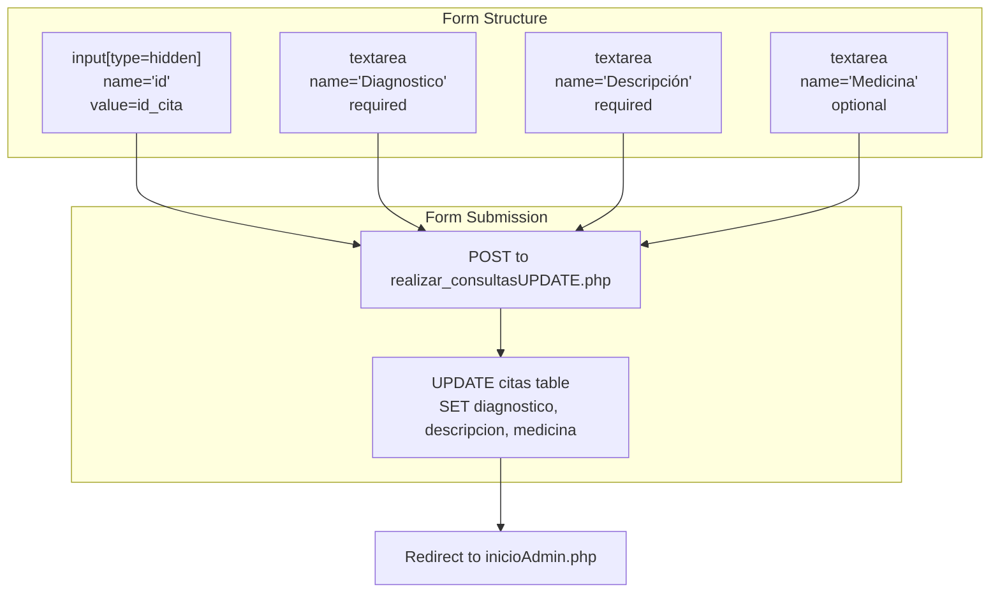
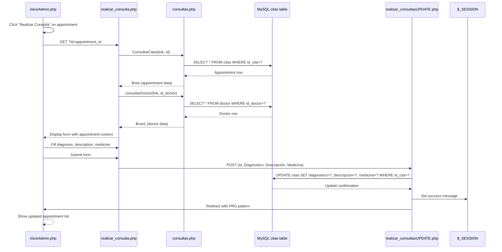
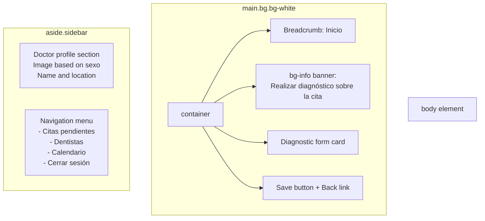

# Consultation & Diagnosis Interface

> **Relevant source files**
> * [Admin/realizar_consulta.php](https://github.com/axchisan/Consultorio_Emily_Bernal/blob/589034b9/Admin/realizar_consulta.php)

## Purpose and Scope

The Consultation & Diagnosis Interface provides doctors with a form-based interface to record diagnostic findings, clinical descriptions, and prescribed medications for scheduled appointments. This page is implemented in [Admin/realizar_consulta.php L1-L120](https://github.com/axchisan/Consultorio_Emily_Bernal/blob/589034b9/Admin/realizar_consulta.php#L1-L120)

 and serves as the primary data entry point for converting pending appointments into diagnosed consultations.

This document covers the interface structure, data retrieval mechanisms, form fields, and submission workflow. For appointment listing and management, see [Dashboard - Appointment Management](/axchisan/Consultorio_Emily_Bernal/2.1-dashboard-appointment-management). For detailed medical report editing that follows diagnosis, see [Medical Report Editor](/axchisan/Consultorio_Emily_Bernal/2.3.3-medical-report-editor).

---

## Page Access and Context Loading

### Entry Point

The page is accessed via a `GET` request with an `id` parameter representing the appointment ID (`id_cita`). Typically, users navigate here from the dashboard by clicking a "Realizar Consulta" action on a pending appointment.

**URL Pattern**: `realizar_consulta.php?id={appointment_id}`

### Data Initialization

The page initialization logic [Admin/realizar_consulta.php L2-L14](https://github.com/axchisan/Consultorio_Emily_Bernal/blob/589034b9/Admin/realizar_consulta.php#L2-L14)

 performs three key operations:

```

```

**Sources**: [Admin/realizar_consulta.php L2-L14](https://github.com/axchisan/Consultorio_Emily_Bernal/blob/589034b9/Admin/realizar_consulta.php#L2-L14)

| Operation | Function Call | Purpose |
| --- | --- | --- |
| Database Connection | `include '../php/conexionDB.php'` | Establishes mysqli connection |
| Query Functions | `include '../php/consultas.php'` | Loads reusable query functions |
| Appointment Data | `ConsultarCitas($link, $id)` | Retrieves appointment details from `citas` table |
| Doctor Data | `consultarDoctor($link, $_SESSION['id_doctor'])` | Retrieves logged-in doctor's profile |

**Sources**: [Admin/realizar_consulta.php L6-L11](https://github.com/axchisan/Consultorio_Emily_Bernal/blob/589034b9/Admin/realizar_consulta.php#L6-L11)

---

## Form Structure and Fields

### Diagnostic Form

The consultation form [Admin/realizar_consulta.php L73-L106](https://github.com/axchisan/Consultorio_Emily_Bernal/blob/589034b9/Admin/realizar_consulta.php#L73-L106)

 submits to `realizar_consultasUPDATE.php` using the POST method with action parameter `accion=UDT` (update).



**Sources**: [Admin/realizar_consulta.php L73-L106](https://github.com/axchisan/Consultorio_Emily_Bernal/blob/589034b9/Admin/realizar_consulta.php#L73-L106)

### Field Specifications

| Field Name | Input Type | Attributes | Database Column | Validation |
| --- | --- | --- | --- | --- |
| `id` | `hidden` | `value=$row['id_cita']` | Primary key reference | N/A |
| `Diagnostico` | `textarea` | `rows=5`, `required` | `citas.diagnostico` | Required, no max length |
| `Descripción` | `textarea` | `rows=5`, `required` | `citas.descripcion` | Required, no max length |
| `Medicina` | `textarea` | `rows=5` | `citas.medicina` | Optional |

**Sources**: [Admin/realizar_consulta.php L74-L92](https://github.com/axchisan/Consultorio_Emily_Bernal/blob/589034b9/Admin/realizar_consulta.php#L74-L92)

#### Field Descriptions

**Diagnostico** [Admin/realizar_consulta.php L78-L79](https://github.com/axchisan/Consultorio_Emily_Bernal/blob/589034b9/Admin/realizar_consulta.php#L78-L79)

: Primary diagnosis field displayed prominently in a card component with title "Diagnóstico". This field captures the doctor's clinical diagnosis for the appointment.

**Descripción** [Admin/realizar_consulta.php L86-L87](https://github.com/axchisan/Consultorio_Emily_Bernal/blob/589034b9/Admin/realizar_consulta.php#L86-L87)

: Detailed description field for elaborating on symptoms, clinical observations, or treatment rationale. Placed in a two-column layout alongside the medication field.

**Medicina** [Admin/realizar_consulta.php L90-L91](https://github.com/axchisan/Consultorio_Emily_Bernal/blob/589034b9/Admin/realizar_consulta.php#L90-L91)

: Optional field for prescribing medications. Placeholder text explicitly indicates this field is optional: "Escribe la medicina opcional aquí...".

---

## Data Flow and Persistence

### Complete Diagnostic Workflow



**Sources**: [Admin/realizar_consulta.php L1-L120](https://github.com/axchisan/Consultorio_Emily_Bernal/blob/589034b9/Admin/realizar_consulta.php#L1-L120)

### Database Update Target

The form updates the following columns in the `citas` table:

* `diagnostico` (TEXT): Stores primary diagnosis
* `descripcion` (TEXT): Stores detailed clinical description
* `medicina` (TEXT): Stores prescribed medications (nullable)

The update operation in `realizar_consultasUPDATE.php` uses the hidden `id` field to target the specific appointment record via `WHERE id_cita = ?`.

**Sources**: [Admin/realizar_consulta.php L74](https://github.com/axchisan/Consultorio_Emily_Bernal/blob/589034b9/Admin/realizar_consulta.php#L74-L74)

---

## User Interface Components

### Page Layout Structure



**Sources**: [Admin/realizar_consulta.php L33-L115](https://github.com/axchisan/Consultorio_Emily_Bernal/blob/589034b9/Admin/realizar_consulta.php#L33-L115)

### Sidebar Navigation

The sidebar [Admin/realizar_consulta.php L33-L58](https://github.com/axchisan/Consultorio_Emily_Bernal/blob/589034b9/Admin/realizar_consulta.php#L33-L58)

 displays:

1. **Doctor Profile Section** [Admin/realizar_consulta.php L40-L48](https://github.com/axchisan/Consultorio_Emily_Bernal/blob/589034b9/Admin/realizar_consulta.php#L40-L48) : * Gender-based avatar image (`odontologo.png` for male, `odontologa.png` for female) * Doctor name constructed from `$row['nombreD']` and `$row['apellido']` * Static location text: "Barbosa Santander"
2. **Navigation Menu** [Admin/realizar_consulta.php L49-L56](https://github.com/axchisan/Consultorio_Emily_Bernal/blob/589034b9/Admin/realizar_consulta.php#L49-L56) : * Link to `inicioAdmin.php` (Pending appointments) * Link to `doctores.php` (Dentists management) * Link to `calendar.php` (Calendar view) * Logout link to `../php/cerrar.php`

**Sources**: [Admin/realizar_consulta.php L33-L58](https://github.com/axchisan/Consultorio_Emily_Bernal/blob/589034b9/Admin/realizar_consulta.php#L33-L58)

### Visual Styling

The page imports the following stylesheets [Admin/realizar_consulta.php L23-L29](https://github.com/axchisan/Consultorio_Emily_Bernal/blob/589034b9/Admin/realizar_consulta.php#L23-L29)

:

* Bootstrap 4.x CSS for layout and components
* `admin.css` for administrative interface styling
* `realizar_consulta.css` for page-specific styles
* FontAwesome icons for UI elements
* DataTables CSS (imported but not actively used on this page)

**Sources**: [Admin/realizar_consulta.php L23-L29](https://github.com/axchisan/Consultorio_Emily_Bernal/blob/589034b9/Admin/realizar_consulta.php#L23-L29)

---

## Integration Points

### Inbound Navigation

The consultation interface is primarily accessed from:

1. **Dashboard** [inicioAdmin.php](/axchisan/Consultorio_Emily_Bernal/2.1-dashboard-appointment-management): Via action buttons in the pending appointments table
2. **Direct URL**: Using appointment ID from any source that provides `id_cita` values

### Outbound Navigation

After form submission, the workflow continues to:

1. **Update Script**: `../crud/realizar_consultasUPDATE.php?accion=UDT` processes the form data
2. **Return to Dashboard**: Automatic redirect to `inicioAdmin.php` after successful update
3. **Manual Back**: Link [Admin/realizar_consulta.php L102](https://github.com/axchisan/Consultorio_Emily_Bernal/blob/589034b9/Admin/realizar_consulta.php#L102-L102)  allows users to return to dashboard without saving

**Sources**: [Admin/realizar_consulta.php L73-L102](https://github.com/axchisan/Consultorio_Emily_Bernal/blob/589034b9/Admin/realizar_consulta.php#L73-L102)

### Relationship to Clinical History Workflow

Once a diagnosis is entered through this interface, the appointment becomes eligible for:

1. Viewing in the clinical history list [historia_clinica.php](/axchisan/Consultorio_Emily_Bernal/2.3.1-clinical-history-list-view)
2. Creating detailed medical reports [informe.php](/axchisan/Consultorio_Emily_Bernal/2.3.3-medical-report-editor)
3. Generating PDF documentation [descargar_historia.php](/axchisan/Consultorio_Emily_Bernal/3.1-clinical-history-pdf-generator)

The `diagnostico` field populated here appears in clinical history displays and PDF reports, establishing this interface as the initial step in comprehensive patient documentation.

---

## Security Considerations

### Session Validation

The page begins with `session_start()` [Admin/realizar_consulta.php L2](https://github.com/axchisan/Consultorio_Emily_Bernal/blob/589034b9/Admin/realizar_consulta.php#L2-L2)

 to maintain user authentication state. However, unlike other administrative pages (e.g., `inicioAdmin.php`, `calendar.php`), this file does not implement explicit session token validation via the `validarToken()` function.

**Note**: For comprehensive session and token validation patterns used in other admin pages, see [Session Management](/axchisan/Consultorio_Emily_Bernal/5.1-session-management) and [Token Validation System](/axchisan/Consultorio_Emily_Bernal/5.2-token-validation-system).

### Access Control

The page retrieves the doctor ID from session storage [Admin/realizar_consulta.php L10](https://github.com/axchisan/Consultorio_Emily_Bernal/blob/589034b9/Admin/realizar_consulta.php#L10-L10)

:

```

```

This ensures the doctor's profile information is correctly associated with the current user. However, there is no verification that the appointment being diagnosed belongs to the logged-in doctor, which could present an authorization gap if appointment IDs are guessable.

**Sources**: [Admin/realizar_consulta.php L10](https://github.com/axchisan/Consultorio_Emily_Bernal/blob/589034b9/Admin/realizar_consulta.php#L10-L10)

### Input Validation

The form implements HTML5 client-side validation [Admin/realizar_consulta.php L79-L87](https://github.com/axchisan/Consultorio_Emily_Bernal/blob/589034b9/Admin/realizar_consulta.php#L79-L87)

:

* `required` attribute on `Diagnostico` and `Descripción` fields
* No `required` attribute on `Medicina` field (intentionally optional)

Server-side validation occurs in the update script `realizar_consultasUPDATE.php`, which is outside the scope of this page but should be consulted for SQL injection prevention and data sanitization details. See [SQL Injection Prevention](/axchisan/Consultorio_Emily_Bernal/5.3-sql-injection-prevention) for general patterns.

**Sources**: [Admin/realizar_consulta.php L79-L91](https://github.com/axchisan/Consultorio_Emily_Bernal/blob/589034b9/Admin/realizar_consulta.php#L79-L91)

---

## Code Entity Reference

### Key Files

| File Path | Role | Description |
| --- | --- | --- |
| `Admin/realizar_consulta.php` | View | Main consultation form interface |
| `php/conexionDB.php` | Data Layer | Database connection establishment |
| `php/consultas.php` | Data Layer | Query function library |
| `crud/realizar_consultasUPDATE.php` | Business Logic | Form submission handler |

### Key Functions

| Function | Defined In | Purpose |
| --- | --- | --- |
| `ConsultarCitas($link, $id)` | `php/consultas.php` | Retrieves appointment record by ID |
| `consultarDoctor($link, $id)` | `php/consultas.php` | Retrieves doctor profile by ID |

**Sources**: [Admin/realizar_consulta.php L9-L11](https://github.com/axchisan/Consultorio_Emily_Bernal/blob/589034b9/Admin/realizar_consulta.php#L9-L11)

### Session Variables

| Variable | Type | Purpose |
| --- | --- | --- |
| `$_SESSION['id_doctor']` | Integer | Logged-in doctor's primary key |

### Form Parameter Mapping

| HTML Form Name | POST Parameter | Database Column | Table |
| --- | --- | --- | --- |
| `id` | `$_POST['id']` | `id_cita` | `citas` (WHERE clause) |
| `Diagnostico` | `$_POST['Diagnostico']` | `diagnostico` | `citas` |
| `Descripción` | `$_POST['Descripción']` | `descripcion` | `citas` |
| `Medicina` | `$_POST['Medicina']` | `medicina` | `citas` |

**Sources**: [Admin/realizar_consulta.php L74-L92](https://github.com/axchisan/Consultorio_Emily_Bernal/blob/589034b9/Admin/realizar_consulta.php#L74-L92)

---

## Limitations and Observations

### Error Handling

The page contains a commented note at line 13: "No se maneja el caso de ID vacío" (The empty ID case is not handled). When `$_GET['id']` is not provided, the page renders with undefined variables, potentially causing PHP notices or errors.

**Sources**: [Admin/realizar_consulta.php L13](https://github.com/axchisan/Consultorio_Emily_Bernal/blob/589034b9/Admin/realizar_consulta.php#L13-L13)

### Missing Token Validation

Unlike other administrative interfaces (dashboard, calendar, history viewer), this page does not call `validarToken()` to verify the session token against the database. This could allow stale sessions to access the form.

### No Appointment State Check

The page does not verify the appointment's current state before displaying the form. It's possible for users to access already-diagnosed appointments, potentially overwriting existing diagnostic data.

### Character Encoding

The page uses `utf8_decode()` on the doctor's name [Admin/realizar_consulta.php L46](https://github.com/axchisan/Consultorio_Emily_Bernal/blob/589034b9/Admin/realizar_consulta.php#L46-L46)

 for display purposes, indicating the database may store data in UTF-8 while the page renders in a different encoding (likely ISO-8859-1/Latin-1).

**Sources**: [Admin/realizar_consulta.php L46](https://github.com/axchisan/Consultorio_Emily_Bernal/blob/589034b9/Admin/realizar_consulta.php#L46-L46)