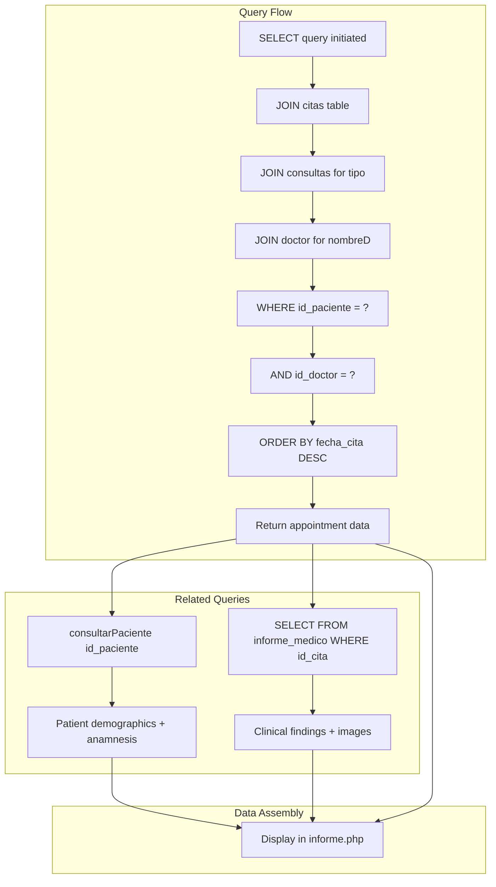
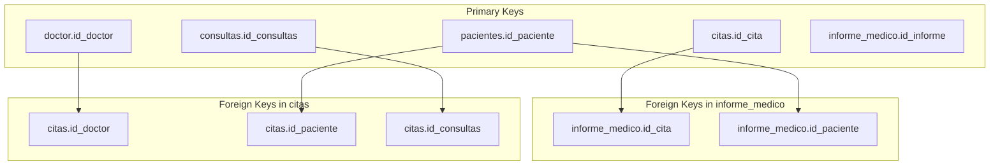
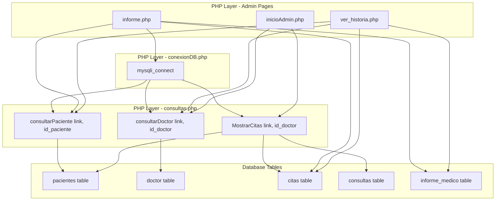

# Core Data Model

> **Relevant source files**
> * [Admin/informe.php](https://github.com/axchisan/Consultorio_Emily_Bernal/blob/589034b9/Admin/informe.php)
> * [Admin/inicioAdmin.php](https://github.com/axchisan/Consultorio_Emily_Bernal/blob/589034b9/Admin/inicioAdmin.php)
> * [Admin/ver_historia.php](https://github.com/axchisan/Consultorio_Emily_Bernal/blob/589034b9/Admin/ver_historia.php)

## Purpose and Scope

This page documents the five core database tables that form the foundation of the Consultorio Emily Bernal system: `doctor`, `pacientes`, `citas`, `consultas`, and `informe_medico`. The focus is on understanding their relationships, field structures, and the appointment-centric design pattern that connects patients, doctors, and medical records.

For detailed information about patient medical history fields, see [Patient Medical History Schema](/axchisan/Consultorio_Emily_Bernal/4.2-patient-medical-history-schema). For medical report data structures, see [Medical Report Data Structure](/axchisan/Consultorio_Emily_Bernal/4.3-medical-report-data-structure). For the database abstraction layer and query functions, see [Query Functions & Database Abstraction](/axchisan/Consultorio_Emily_Bernal/4.4-query-functions-and-database-abstraction).

---

## Appointment-Centric Architecture

The database schema is designed around the `citas` (appointments) table, which serves as the central junction connecting patients, doctors, consultation types, and medical reports. This design pattern ensures that all medical documentation is traceable to a specific appointment event.

### Entity Relationship Diagram

```css
#mermaid-gdhbyj0kxp{font-family:ui-sans-serif,-apple-system,system-ui,Segoe UI,Helvetica;font-size:16px;fill:#333;}@keyframes edge-animation-frame{from{stroke-dashoffset:0;}}@keyframes dash{to{stroke-dashoffset:0;}}#mermaid-gdhbyj0kxp .edge-animation-slow{stroke-dasharray:9,5!important;stroke-dashoffset:900;animation:dash 50s linear infinite;stroke-linecap:round;}#mermaid-gdhbyj0kxp .edge-animation-fast{stroke-dasharray:9,5!important;stroke-dashoffset:900;animation:dash 20s linear infinite;stroke-linecap:round;}#mermaid-gdhbyj0kxp .error-icon{fill:#dddddd;}#mermaid-gdhbyj0kxp .error-text{fill:#222222;stroke:#222222;}#mermaid-gdhbyj0kxp .edge-thickness-normal{stroke-width:1px;}#mermaid-gdhbyj0kxp .edge-thickness-thick{stroke-width:3.5px;}#mermaid-gdhbyj0kxp .edge-pattern-solid{stroke-dasharray:0;}#mermaid-gdhbyj0kxp .edge-thickness-invisible{stroke-width:0;fill:none;}#mermaid-gdhbyj0kxp .edge-pattern-dashed{stroke-dasharray:3;}#mermaid-gdhbyj0kxp .edge-pattern-dotted{stroke-dasharray:2;}#mermaid-gdhbyj0kxp .marker{fill:#999;stroke:#999;}#mermaid-gdhbyj0kxp .marker.cross{stroke:#999;}#mermaid-gdhbyj0kxp svg{font-family:ui-sans-serif,-apple-system,system-ui,Segoe UI,Helvetica;font-size:16px;}#mermaid-gdhbyj0kxp p{margin:0;}#mermaid-gdhbyj0kxp .entityBox{fill:#ffffff;stroke:#dddddd;}#mermaid-gdhbyj0kxp .relationshipLabelBox{fill:#dddddd;opacity:0.7;background-color:#dddddd;}#mermaid-gdhbyj0kxp .relationshipLabelBox rect{opacity:0.5;}#mermaid-gdhbyj0kxp .labelBkg{background-color:rgba(221, 221, 221, 0.5);}#mermaid-gdhbyj0kxp .edgeLabel .label{fill:#dddddd;font-size:14px;}#mermaid-gdhbyj0kxp .label{font-family:ui-sans-serif,-apple-system,system-ui,Segoe UI,Helvetica;color:#333;}#mermaid-gdhbyj0kxp .edge-pattern-dashed{stroke-dasharray:8,8;}#mermaid-gdhbyj0kxp .node rect,#mermaid-gdhbyj0kxp .node circle,#mermaid-gdhbyj0kxp .node ellipse,#mermaid-gdhbyj0kxp .node polygon{fill:#ffffff;stroke:#dddddd;stroke-width:1px;}#mermaid-gdhbyj0kxp .relationshipLine{stroke:#999;stroke-width:1;fill:none;}#mermaid-gdhbyj0kxp .marker{fill:none!important;stroke:#999!important;stroke-width:1;}#mermaid-gdhbyj0kxp :root{--mermaid-font-family:"trebuchet ms",verdana,arial,sans-serif;}performsschedulesdefines_typegeneratesdoctorintid_doctorPKvarcharnombreDvarcharapellidoenumsexodatefecha_nacimientovarcharcorreo_electronicovarcharpasswordvarchartelefonointid_especialidadFKvarcharsession_tokencitasintid_citaPKintid_pacienteFKintid_doctorFKintid_consultasFKdatefecha_citatimehora_citacharestadotextdiagnosticotextdescripciontextmedicinapacientesintid_pacientePKvarcharnombrevarcharapellidodatefecha_nacimientovarcharcorreo_electronicovarchartelefonovarcharcedulaenumsexovarcharepsvarcharocupacionvarcharestado_civilvarchartipo_sangretextalertas_medicasvarcharlugar_direccion_residenciaenumhistoria_cardiovascularesenumhistoria_hemorragicasenumhistoria_dermatologicasenumhistoria_mentalesenumhistoria_diabetesenumhistoria_cancerenumhistoria_artritisenumhistoria_alergiasenumhistoria_cirugiastexthistoria_otrosvarcharemergencia_nombrevarcharemergencia_telefonovarcharmenor_acompanantevarcharmenor_parentescovarcharmenor_telefonoconsultasintid_consultasPKvarchartipoinforme_medicointid_informePKintid_citaFKintid_pacienteFKtextexamen_intraoraltextexamen_extraoraltextexamen_atmtextobservacion_intraoraltextobservacion_extraoral_atmtextdescripcion_radiograficatextdiagnostico_periodontaltextplan_tratamientotextpronosticotextevoluciontextdiagnosticodecimalcostovarcharradiografiavarcharfoto_boca
```

**Sources:** [Admin/informe.php L47-L65](https://github.com/axchisan/Consultorio_Emily_Bernal/blob/589034b9/Admin/informe.php#L47-L65)

 [Admin/ver_historia.php L51-L66](https://github.com/axchisan/Consultorio_Emily_Bernal/blob/589034b9/Admin/ver_historia.php#L51-L66)

 High-Level System Architecture diagrams

---

## Core Tables Overview

### Table: doctor

The `doctor` table stores dentist credentials and session management data. Each doctor can perform multiple appointments.

| Field | Type | Constraints | Purpose |
| --- | --- | --- | --- |
| `id_doctor` | INT | PRIMARY KEY, AUTO_INCREMENT | Unique doctor identifier |
| `nombreD` | VARCHAR | NOT NULL | Doctor's first name |
| `apellido` | VARCHAR | NOT NULL | Doctor's last name |
| `sexo` | ENUM('Masculino', 'Femenino') | NOT NULL | Gender for profile image selection |
| `fecha_nacimiento` | DATE |  | Birth date |
| `correo_electronico` | VARCHAR | UNIQUE, NOT NULL | Login email |
| `password` | VARCHAR | NOT NULL | Hashed password |
| `telefono` | VARCHAR |  | Contact phone |
| `id_especialidad` | INT | FOREIGN KEY | References specialty table |
| `session_token` | VARCHAR |  | Current session token for concurrent login prevention |

**Usage in Code:**

The `doctor` table is queried throughout the application for authentication and profile display:

```
// Authentication and profile retrieval
$row = consultarDoctor($link, $vUsuario);
```

**Sources:** [Admin/inicioAdmin.php L26](https://github.com/axchisan/Consultorio_Emily_Bernal/blob/589034b9/Admin/inicioAdmin.php#L26-L26)

 [Admin/informe.php L460-L472](https://github.com/axchisan/Consultorio_Emily_Bernal/blob/589034b9/Admin/informe.php#L460-L472)

 [Admin/ver_historia.php L78](https://github.com/axchisan/Consultorio_Emily_Bernal/blob/589034b9/Admin/ver_historia.php#L78-L78)

---

### Table: pacientes

The `pacientes` table contains comprehensive patient information including demographics, emergency contacts, and medical history flags. This is the largest table in the schema with extensive anamnesis fields.

| Field | Type | Constraints | Purpose |
| --- | --- | --- | --- |
| `id_paciente` | INT | PRIMARY KEY, AUTO_INCREMENT | Unique patient identifier |
| `nombre` | VARCHAR | NOT NULL | Patient's first name |
| `apellido` | VARCHAR | NOT NULL | Patient's last name |
| `fecha_nacimiento` | DATE | NOT NULL | Birth date for age calculation |
| `correo_electronico` | VARCHAR | UNIQUE, NOT NULL | Contact email |
| `telefono` | VARCHAR |  | Contact phone |
| `cedula` | VARCHAR | UNIQUE | National ID document number |
| `sexo` | ENUM('Masculino', 'Femenino') |  | Gender |
| `eps` | VARCHAR |  | Health insurance provider |
| `ocupacion` | VARCHAR |  | Occupation |
| `estado_civil` | VARCHAR |  | Marital status |
| `tipo_sangre` | VARCHAR |  | Blood type |
| `alertas_medicas` | TEXT |  | Critical medical alerts |
| `lugar_direccion_residencia` | VARCHAR |  | Address |

**Medical History Fields (ENUM 'Sí', 'No'):**

* `historia_cardiovasculares` - Cardiovascular disease history
* `historia_hemorragicas` - Bleeding disorder history
* `historia_dermatologicas` - Dermatological condition history
* `historia_mentales` - Mental health history
* `historia_diabetes` - Diabetes history
* `historia_cancer` - Cancer history
* `historia_artritis` - Arthritis history
* `historia_alergias` - Allergy history
* `historia_cirugias` - Surgery history
* `historia_otros` - Other conditions (TEXT)

**Emergency Contact Fields:**

* `emergencia_nombre` - Emergency contact name
* `emergencia_telefono` - Emergency contact phone

**Minor Patient Fields (for patients under 18):**

* `menor_acompanante` - Guardian name
* `menor_parentesco` - Guardian relationship
* `menor_telefono` - Guardian phone

**Usage in Code:**

Patient data is retrieved using the `consultarPaciente()` function and updated through prepared statements:

```sql
// Retrieve patient data
$patient = consultarPaciente($link, $patient_id);

// Update patient information
$update_query = "UPDATE pacientes SET 
                 telefono = ?, eps = ?, ocupacion = ?, estado_civil = ?, 
                 cedula = ?, sexo = ?, emergencia_nombre = ?, 
                 emergencia_telefono = ?, ... WHERE id_paciente = ?";
```

**Sources:** [Admin/informe.php L30-L36](https://github.com/axchisan/Consultorio_Emily_Bernal/blob/589034b9/Admin/informe.php#L30-L36)

 [Admin/informe.php L96-L158](https://github.com/axchisan/Consultorio_Emily_Bernal/blob/589034b9/Admin/informe.php#L96-L158)

 [Admin/ver_historia.php L37-L43](https://github.com/axchisan/Consultorio_Emily_Bernal/blob/589034b9/Admin/ver_historia.php#L37-L43)

---

### Table: citas (Appointments)

The `citas` table is the central hub of the data model, linking patients to doctors and consultation types. Each appointment can have an associated medical report.

| Field | Type | Constraints | Purpose |
| --- | --- | --- | --- |
| `id_cita` | INT | PRIMARY KEY, AUTO_INCREMENT | Unique appointment identifier |
| `id_paciente` | INT | FOREIGN KEY → `pacientes(id_paciente)` | Patient reference |
| `id_doctor` | INT | FOREIGN KEY → `doctor(id_doctor)` | Doctor reference |
| `id_consultas` | INT | FOREIGN KEY → `consultas(id_consultas)` | Consultation type reference |
| `fecha_cita` | DATE | NOT NULL | Appointment date |
| `hora_cita` | TIME | NOT NULL | Appointment time |
| `estado` | CHAR(1) | DEFAULT 'P' | Status: 'A' = Completed, 'P' = Pending |
| `diagnostico` | TEXT |  | Initial diagnosis |
| `descripcion` | TEXT |  | Appointment description |
| `medicina` | TEXT |  | Prescribed medications |

**Status Values:**

* `'A'` - Appointment completed (Realizada)
* `'P'` - Appointment pending (Pendiente)

**Usage in Code:**

The `citas` table is queried with JOIN operations to retrieve comprehensive appointment data:

```sql
// Retrieve appointment with related data
$query = "SELECT c.*, con.tipo, d.nombreD 
          FROM citas c 
          LEFT JOIN consultas con ON con.id_consultas = c.id_consultas 
          LEFT JOIN doctor d ON d.id_doctor = c.id_doctor 
          WHERE c.id_paciente = ? AND c.id_doctor = ? 
          ORDER BY c.fecha_cita DESC LIMIT 1";
```

**Sources:** [Admin/informe.php L47-L65](https://github.com/axchisan/Consultorio_Emily_Bernal/blob/589034b9/Admin/informe.php#L47-L65)

 [Admin/ver_historia.php L51-L66](https://github.com/axchisan/Consultorio_Emily_Bernal/blob/589034b9/Admin/ver_historia.php#L51-L66)

 [Admin/inicioAdmin.php L27](https://github.com/axchisan/Consultorio_Emily_Bernal/blob/589034b9/Admin/inicioAdmin.php#L27-L27)

---

### Table: consultas (Consultation Types)

The `consultas` table is a simple lookup table that defines the types of dental consultations available.

| Field | Type | Constraints | Purpose |
| --- | --- | --- | --- |
| `id_consultas` | INT | PRIMARY KEY, AUTO_INCREMENT | Unique consultation type identifier |
| `tipo` | VARCHAR | NOT NULL | Consultation type name |

**Examples of consultation types:**

* General checkup
* Cleaning
* Extraction
* Root canal
* Orthodontics
* Emergency

**Usage in Code:**

The `consultas` table is joined with `citas` to display consultation type information:

```
LEFT JOIN consultas con ON con.id_consultas = c.id_consultas
```

**Sources:** [Admin/informe.php L47-L56](https://github.com/axchisan/Consultorio_Emily_Bernal/blob/589034b9/Admin/informe.php#L47-L56)

 [Admin/ver_historia.php L51-L59](https://github.com/axchisan/Consultorio_Emily_Bernal/blob/589034b9/Admin/ver_historia.php#L51-L59)

---

### Table: informe_medico (Medical Report)

The `informe_medico` table stores detailed clinical findings for each appointment. It has a one-to-one relationship with `citas`, though not all appointments have medical reports.

| Field | Type | Constraints | Purpose |
| --- | --- | --- | --- |
| `id_informe` | INT | PRIMARY KEY, AUTO_INCREMENT | Unique report identifier |
| `id_cita` | INT | FOREIGN KEY → `citas(id_cita)`, UNIQUE | Appointment reference (one report per appointment) |
| `id_paciente` | INT | FOREIGN KEY → `pacientes(id_paciente)` | Patient reference (denormalized for query optimization) |
| `examen_intraoral` | TEXT |  | Intraoral clinical examination findings |
| `examen_extraoral` | TEXT |  | Extraoral clinical examination findings |
| `examen_atm` | TEXT |  | Temporomandibular joint (ATM) examination |
| `observacion_intraoral` | TEXT |  | Intraoral palpation observations |
| `observacion_extraoral_atm` | TEXT |  | Extraoral and TMJ palpation observations |
| `descripcion_radiografica` | TEXT |  | Radiographic description |
| `diagnostico_periodontal` | TEXT |  | Periodontal diagnosis |
| `plan_tratamiento` | TEXT |  | Treatment plan |
| `pronostico` | TEXT |  | Prognosis |
| `evolucion` | TEXT |  | Evolution/progress notes |
| `diagnostico` | TEXT |  | Final diagnosis |
| `costo` | DECIMAL(10,2) | DEFAULT 0 | Treatment cost |
| `radiografia` | VARCHAR |  | Filename of uploaded radiograph image |
| `foto_boca` | VARCHAR |  | Filename of uploaded oral photo |

**Image Field Storage Pattern:**

The `radiografia` and `foto_boca` fields store only filenames, not binary data. Actual images are stored in the filesystem at:

* `../uploads/radiografias/` for X-ray images
* `../uploads/fotos_boca/` for oral photographs

**Usage in Code:**

Medical reports are created or updated based on whether one exists for the appointment:

```sql
// Check if medical report exists
$check_query = "SELECT * FROM informe_medico WHERE id_cita = ?";
$stmt = mysqli_prepare($link, $check_query);
mysqli_stmt_bind_param($stmt, "i", $appointment['id_cita']);
mysqli_stmt_execute($stmt);
$check_result = mysqli_stmt_get_result($stmt);

if (mysqli_num_rows($check_result) > 0) {
    // UPDATE existing report
} else {
    // INSERT new report
    $insert_medical_query = "INSERT INTO informe_medico 
        (id_cita, id_paciente, examen_intraoral, ...) 
        VALUES (?, ?, ?, ...)";
}
```

**Sources:** [Admin/informe.php L225-L421](https://github.com/axchisan/Consultorio_Emily_Bernal/blob/589034b9/Admin/informe.php#L225-L421)

 [Admin/ver_historia.php L69-L75](https://github.com/axchisan/Consultorio_Emily_Bernal/blob/589034b9/Admin/ver_historia.php#L69-L75)

 [Admin/informe.php L428-L434](https://github.com/axchisan/Consultorio_Emily_Bernal/blob/589034b9/Admin/informe.php#L428-L434)

---

## Data Flow and Relationships

### Query Pattern: Retrieving Complete Patient Information

The typical pattern for retrieving complete patient information involves joining multiple tables:



**Sources:** [Admin/informe.php L47-L65](https://github.com/axchisan/Consultorio_Emily_Bernal/blob/589034b9/Admin/informe.php#L47-L65)

 [Admin/ver_historia.php L51-L75](https://github.com/axchisan/Consultorio_Emily_Bernal/blob/589034b9/Admin/ver_historia.php#L51-L75)

---

### Foreign Key Relationships and Referential Integrity



**Referential Integrity Notes:**

1. **`citas.id_doctor`** → **`doctor.id_doctor`**: Ensures appointments are assigned to valid doctors
2. **`citas.id_paciente`** → **`pacientes.id_paciente`**: Ensures appointments are for valid patients
3. **`citas.id_consultas`** → **`consultas.id_consultas`**: Ensures valid consultation types
4. **`informe_medico.id_cita`** → **`citas.id_cita`** (UNIQUE): One-to-one relationship - each appointment can have at most one medical report
5. **`informe_medico.id_paciente`** → **`pacientes.id_paciente`**: Denormalized for query optimization (can be derived from `id_cita`)

**Sources:** High-Level System Architecture ERD, [Admin/informe.php L47-L65](https://github.com/axchisan/Consultorio_Emily_Bernal/blob/589034b9/Admin/informe.php#L47-L65)

---

## Code-to-Database Mapping

### How PHP Code Interacts with Core Tables



**Sources:** [Admin/informe.php L7-L8](https://github.com/axchisan/Consultorio_Emily_Bernal/blob/589034b9/Admin/informe.php#L7-L8)

 [Admin/inicioAdmin.php L3-L4](https://github.com/axchisan/Consultorio_Emily_Bernal/blob/589034b9/Admin/inicioAdmin.php#L3-L4)

 [Admin/ver_historia.php L3-L4](https://github.com/axchisan/Consultorio_Emily_Bernal/blob/589034b9/Admin/ver_historia.php#L3-L4)

---

## Key Design Patterns

### 1. Appointment-Centric Design

All medical data flows through appointments (`citas` table). This ensures:

* **Temporal tracking**: Every diagnosis, report, and treatment is tied to a specific date/time
* **Doctor accountability**: Each appointment records which doctor performed it
* **Audit trail**: Complete history of patient-doctor interactions

```sql
// Example: Getting the most recent appointment
$query = "SELECT c.*, con.tipo, d.nombreD 
          FROM citas c 
          LEFT JOIN consultas con ON con.id_consultas = c.id_consultas 
          LEFT JOIN doctor d ON d.id_doctor = c.id_doctor 
          WHERE c.id_paciente = ? AND c.id_doctor = ? 
          ORDER BY c.fecha_cita DESC LIMIT 1";
```

**Sources:** [Admin/informe.php L47-L56](https://github.com/axchisan/Consultorio_Emily_Bernal/blob/589034b9/Admin/informe.php#L47-L56)

### 2. Denormalized Patient Reference in Medical Reports

The `informe_medico` table includes both `id_cita` and `id_paciente`, even though `id_paciente` can be derived through `id_cita`. This denormalization:

* **Optimizes queries**: Direct patient lookup without joining through `citas`
* **Simplifies reporting**: Patient-centric reports don't need appointment context
* **Maintains redundancy**: Provides data integrity check

```sql
// Insert includes both foreign keys
$insert_medical_query = "INSERT INTO informe_medico 
    (id_cita, id_paciente, examen_intraoral, ...) 
    VALUES (?, ?, ?, ...)";
mysqli_stmt_bind_param($stmt, "iissss...", 
    $appointment['id_cita'], $patient_id, ...);
```

**Sources:** [Admin/informe.php L389-L411](https://github.com/axchisan/Consultorio_Emily_Bernal/blob/589034b9/Admin/informe.php#L389-L411)

### 3. ENUM Fields for Medical History

Medical history fields use ENUM('Sí', 'No') instead of BOOLEAN:

* **Database compatibility**: ENUM is more portable across MySQL versions
* **Explicit values**: 'Sí'/'No' are clearer in Spanish-language context
* **Three-state logic**: NULL represents "not answered" vs explicit Yes/No

```
// Validation ensures only valid ENUM values
$historia_cardiovasculares = isset($_POST['historia_cardiovasculares']) 
    && in_array($_POST['historia_cardiovasculares'], ['Sí', 'No']) 
    ? $_POST['historia_cardiovasculares'] : 'No';
```

**Sources:** [Admin/informe.php L84-L94](https://github.com/axchisan/Consultorio_Emily_Bernal/blob/589034b9/Admin/informe.php#L84-L94)

### 4. Filename-Based Image Storage

Medical images are stored as filenames in VARCHAR fields, with actual files on the filesystem:

* **Database efficiency**: Avoids BLOB storage overhead
* **Flexibility**: Easy to serve images through web server
* **Backup simplicity**: Separate file system and database backups

```
// Filename generation pattern: patientID_type_timestamp.extension
$radiografia_name = $patient_id . "_radiografia_" . time() . "." . 
    pathinfo($_FILES['radiografia']['name'], PATHINFO_EXTENSION);
```

**Sources:** [Admin/informe.php L198-L204](https://github.com/axchisan/Consultorio_Emily_Bernal/blob/589034b9/Admin/informe.php#L198-L204)

---

## Table Statistics and Constraints

| Table | Estimated Row Count | Key Constraints | Indexes |
| --- | --- | --- | --- |
| `doctor` | 10-20 | PK: `id_doctor`UNIQUE: `correo_electronico` | PK, email |
| `pacientes` | 1000+ | PK: `id_paciente`UNIQUE: `correo_electronico`, `cedula` | PK, email, cedula |
| `citas` | 5000+ | PK: `id_cita`FK: `id_paciente`, `id_doctor`, `id_consultas` | PK, all FKs, fecha_cita |
| `consultas` | 10-15 | PK: `id_consultas` | PK |
| `informe_medico` | 2000+ | PK: `id_informe`UNIQUE: `id_cita`FK: `id_cita`, `id_paciente` | PK, id_cita (unique) |

**Sources:** Inferred from system architecture and usage patterns

---

## Summary

The core data model implements a normalized relational structure centered on the `citas` (appointments) table. The five tables work together to provide:

1. **Patient Management**: Comprehensive demographic and medical history storage in `pacientes`
2. **Provider Management**: Doctor credentials and session data in `doctor`
3. **Scheduling**: Appointment coordination linking patients, doctors, and consultation types in `citas`
4. **Clinical Documentation**: Detailed medical findings and treatment plans in `informe_medico`
5. **Classification**: Consultation type definitions in `consultas`

The appointment-centric design ensures all clinical data is temporally anchored and traceable, while the denormalized `id_paciente` in `informe_medico` optimizes common query patterns. ENUM fields for medical history provide explicit three-state logic (Yes/No/NULL), and filename-based image storage balances database performance with filesystem flexibility.