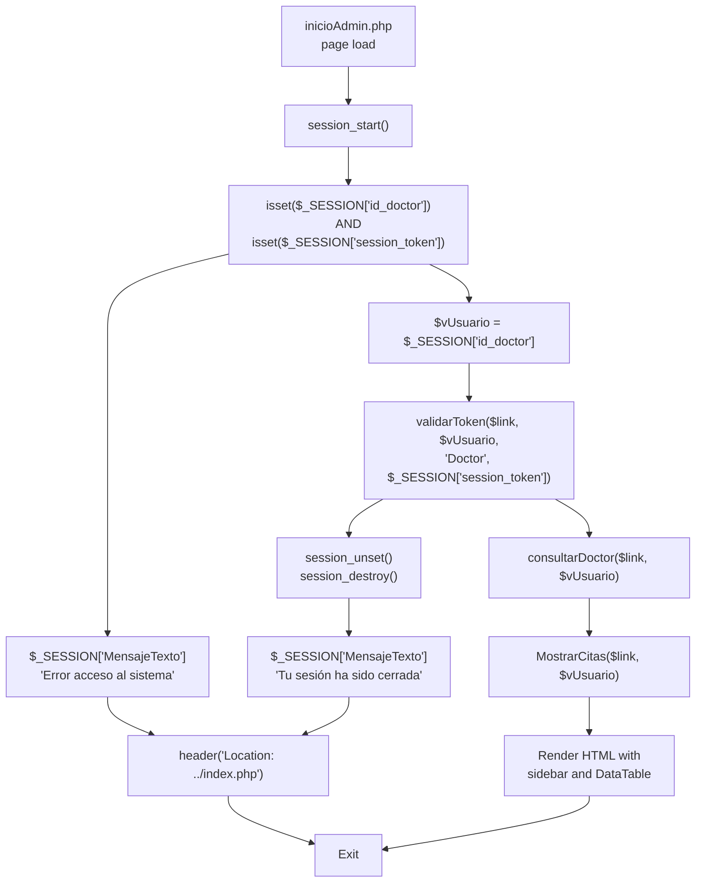
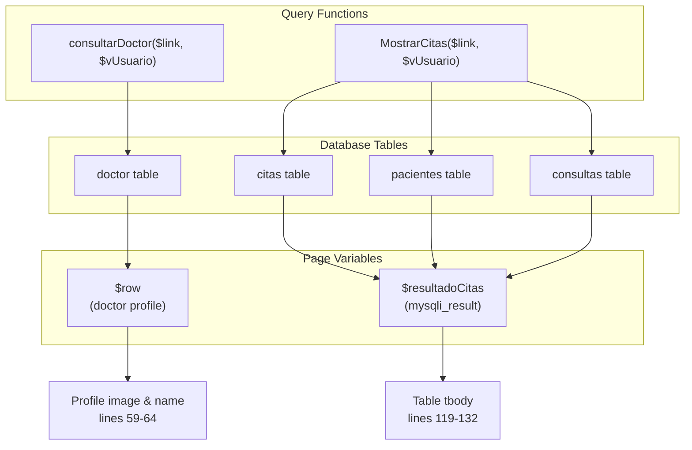
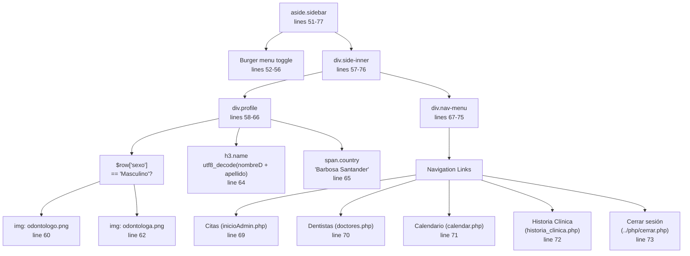
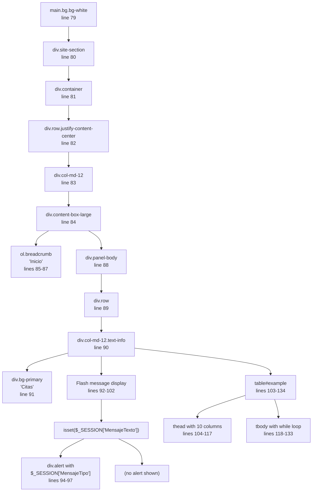
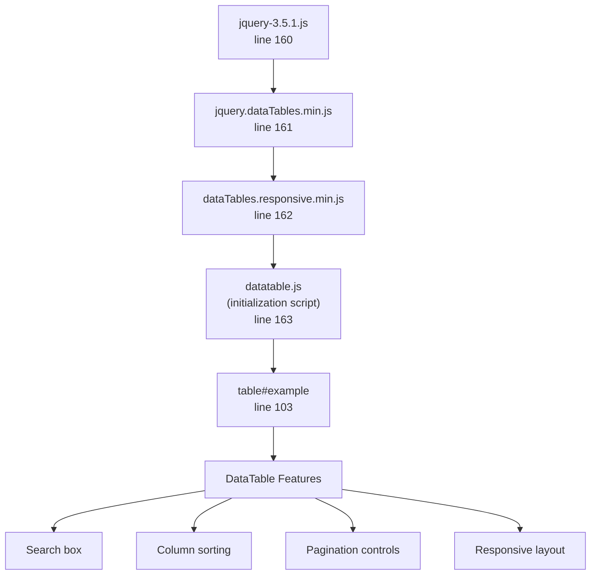
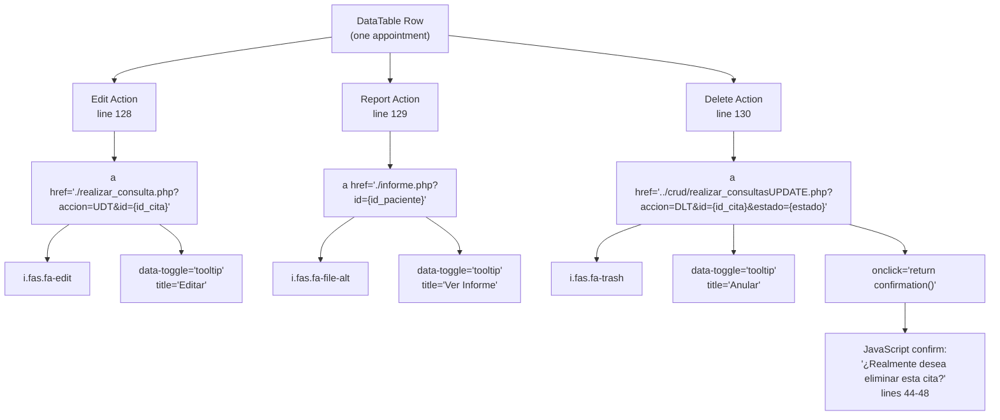
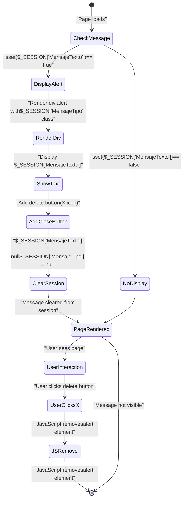
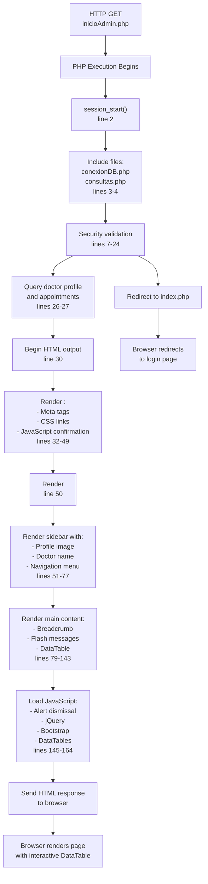

# Dashboard - Appointment Management

> **Relevant source files**
> * [Admin/inicioAdmin.php](https://github.com/axchisan/Consultorio_Emily_Bernal/blob/589034b9/Admin/inicioAdmin.php)

## Purpose and Scope

The Dashboard (implemented in `inicioAdmin.php`) serves as the primary landing page for authenticated doctors in the Consultorio Emily Bernal system. This page displays all appointments (citas) associated with the logged-in doctor, providing a centralized interface for viewing appointment details and performing CRUD operations. The dashboard uses DataTables for interactive data presentation and implements the session-based flash messaging pattern for user feedback.

For information about the session validation and token checking mechanisms used by this page, see [5.1](/axchisan/Consultorio_Emily_Bernal/5.1-session-management) and [5.2](/axchisan/Consultorio_Emily_Bernal/5.2-token-validation-system). For details about the clinical history workflow that this dashboard links to, see [2.3](/axchisan/Consultorio_Emily_Bernal/2.3-clinical-history-management). For consultation editing functionality, see [2.4](/axchisan/Consultorio_Emily_Bernal/2.4-consultation-and-diagnosis-interface).

## Page Initialization and Security

The dashboard implements a multi-layered security check before rendering any content. The initialization sequence validates both session existence and token authenticity to prevent unauthorized access and concurrent logins.



**Security Check Implementation:**

| Check Type | Code Location | Purpose |
| --- | --- | --- |
| Session existence | [Admin/inicioAdmin.php L7-L12](https://github.com/axchisan/Consultorio_Emily_Bernal/blob/589034b9/Admin/inicioAdmin.php#L7-L12) | Ensures user has authenticated |
| Token validation | [Admin/inicioAdmin.php L17-L24](https://github.com/axchisan/Consultorio_Emily_Bernal/blob/589034b9/Admin/inicioAdmin.php#L17-L24) | Prevents concurrent logins from multiple devices |
| Database connection | [Admin/inicioAdmin.php L3](https://github.com/axchisan/Consultorio_Emily_Bernal/blob/589034b9/Admin/inicioAdmin.php#L3-L3) | Establishes connection via `conexionDB.php` |
| User data retrieval | [Admin/inicioAdmin.php L26](https://github.com/axchisan/Consultorio_Emily_Bernal/blob/589034b9/Admin/inicioAdmin.php#L26-L26) | Fetches doctor profile for sidebar display |
| Appointment query | [Admin/inicioAdmin.php L27](https://github.com/axchisan/Consultorio_Emily_Bernal/blob/589034b9/Admin/inicioAdmin.php#L27-L27) | Retrieves appointments specific to this doctor |

The `validarToken()` function call at [Admin/inicioAdmin.php L17](https://github.com/axchisan/Consultorio_Emily_Bernal/blob/589034b9/Admin/inicioAdmin.php#L17-L17)

 compares the session token against the database-stored token. If tokens mismatch (indicating a new login occurred elsewhere), the current session is destroyed and the user is redirected to the login page with an explanatory message.

**Sources:** [Admin/inicioAdmin.php L1-L28](https://github.com/axchisan/Consultorio_Emily_Bernal/blob/589034b9/Admin/inicioAdmin.php#L1-L28)

## Data Retrieval and Query Functions

The dashboard retrieves data using two primary query functions from the `consultas.php` abstraction layer. These functions encapsulate the SQL logic and return result sets for rendering.



**Query Function Details:**

| Function | Return Value | Usage | Line Reference |
| --- | --- | --- | --- |
| `consultarDoctor()` | Associative array | Populates sidebar with doctor name, gender, and profile image | [Admin/inicioAdmin.php L26](https://github.com/axchisan/Consultorio_Emily_Bernal/blob/589034b9/Admin/inicioAdmin.php#L26-L26) |
| `MostrarCitas()` | `mysqli_result` object | Provides appointment data for DataTable rendering | [Admin/inicioAdmin.php L27](https://github.com/axchisan/Consultorio_Emily_Bernal/blob/589034b9/Admin/inicioAdmin.php#L27-L27) |

The `MostrarCitas()` function performs a JOIN query across multiple tables to retrieve:

* Patient name and age (`pacientes.nombre`, `pacientes.apellido`, calculated age)
* Consultation type (`consultas.tipo`)
* Appointment date and time (`citas.fecha_cita`, `citas.hora_cita`)
* Appointment status (`citas.estado`: 'A' = Realizada, 'P' = Pendiente)
* Diagnosis description (`citas.descripcion`)
* Patient and appointment IDs for action links

The query filters results by `id_doctor` to ensure doctors only see their own appointments, implementing data-level access control.

**Sources:** [Admin/inicioAdmin.php L26-L27](https://github.com/axchisan/Consultorio_Emily_Bernal/blob/589034b9/Admin/inicioAdmin.php#L26-L27)

 [php/consultas.php](https://github.com/axchisan/Consultorio_Emily_Bernal/blob/589034b9/php/consultas.php)

## User Interface Structure

The dashboard implements a two-column layout using Bootstrap's grid system with a fixed sidebar and scrollable main content area.

### Sidebar Navigation

The sidebar component displays the doctor's profile and navigation menu. It uses conditional rendering to display gender-appropriate profile images.



**Navigation Menu Structure:**

| Link Text | Destination | Icon | Purpose |
| --- | --- | --- | --- |
| Citas | `inicioAdmin.php` | `far fa-calendar-check` | View appointments (current page) |
| Dentistas | `doctores.php` | `fas fa-user-md` | Manage doctor records |
| Calendario | `calendar.php` | `far fa-calendar-alt` | View/manage schedule |
| Historia Clínica | `historia_clinica.php` | `far fa-calendar-alt` | Access clinical histories |
| Cerrar sesión | `../php/cerrar.php` | `fas fa-sign-out-alt` | Logout |

The profile image selection logic at [Admin/inicioAdmin.php L59-L63](https://github.com/axchisan/Consultorio_Emily_Bernal/blob/589034b9/Admin/inicioAdmin.php#L59-L63)

 uses a PHP conditional to display `odontologo.png` for male doctors and `odontologa.png` for female doctors based on the `sexo` field from the database.

**Sources:** [Admin/inicioAdmin.php L51-L77](https://github.com/axchisan/Consultorio_Emily_Bernal/blob/589034b9/Admin/inicioAdmin.php#L51-L77)

### Main Content Area

The main content area displays appointments in a DataTable with action buttons for each row.



**Sources:** [Admin/inicioAdmin.php L79-L143](https://github.com/axchisan/Consultorio_Emily_Bernal/blob/589034b9/Admin/inicioAdmin.php#L79-L143)

## DataTable Implementation

The appointments table uses the DataTables jQuery plugin for enhanced interactivity, providing search, sort, and pagination capabilities.

### Table Column Structure

The DataTable at [Admin/inicioAdmin.php L103-L134](https://github.com/axchisan/Consultorio_Emily_Bernal/blob/589034b9/Admin/inicioAdmin.php#L103-L134)

 defines 10 columns:

| Column Header | Data Source | Code Location | Notes |
| --- | --- | --- | --- |
| Nombre completo | `$row['nombre'] . ' ' . $row['apellido']` | Line 121 | Concatenated patient name |
| Edad | `$row['años']` | Line 122 | Calculated patient age |
| Consulta | `$row['tipo']` | Line 123 | Consultation type from `consultas` table |
| Fecha | `$row['fecha_cita']` | Line 124 | Appointment date |
| Hora | `$row['hora_cita']` | Line 125 | Appointment time |
| Estado | Conditional: 'Realizada' or 'Pendiente' | Line 126 | Based on `estado` field: 'A' or 'P' |
| Diagnóstico | `$row['descripcion']` | Line 127 | Description/diagnosis text |
| (Action 1) | Edit link icon | Line 128 | Links to `realizar_consulta.php` |
| (Action 2) | Report icon | Line 129 | Links to `informe.php` |
| (Action 3) | Delete icon | Line 130 | Links to `realizar_consultasUPDATE.php` |

### DataTables Initialization

The DataTables plugin is initialized through external JavaScript files loaded at the bottom of the page:



The table element uses the ID `example` at [Admin/inicioAdmin.php L103](https://github.com/axchisan/Consultorio_Emily_Bernal/blob/589034b9/Admin/inicioAdmin.php#L103-L103)

 which is targeted by the initialization script in `datatable.js`. The table includes Bootstrap classes `table table-striped nowrap responsive` for styling and responsiveness.

**Sources:** [Admin/inicioAdmin.php L103-L134](https://github.com/axchisan/Consultorio_Emily_Bernal/blob/589034b9/Admin/inicioAdmin.php#L103-L134)

 [Admin/inicioAdmin.php L160-L163](https://github.com/axchisan/Consultorio_Emily_Bernal/blob/589034b9/Admin/inicioAdmin.php#L160-L163)

## CRUD Operations and Action Links

Each row in the DataTable provides three action buttons that enable different operations on appointments.



### Action Link Details

**Edit Appointment (Realizar Consulta):**

* Location: [Admin/inicioAdmin.php L128](https://github.com/axchisan/Consultorio_Emily_Bernal/blob/589034b9/Admin/inicioAdmin.php#L128-L128)
* Target: `realizar_consulta.php` with parameters `accion=UDT` and `id={id_cita}`
* Icon: `fas fa-edit` (pencil icon)
* Purpose: Opens consultation form to edit diagnosis, description, and medications
* See [2.4](/axchisan/Consultorio_Emily_Bernal/2.4-consultation-and-diagnosis-interface) for details on the consultation interface

**View Medical Report:**

* Location: [Admin/inicioAdmin.php L129](https://github.com/axchisan/Consultorio_Emily_Bernal/blob/589034b9/Admin/inicioAdmin.php#L129-L129)
* Target: `informe.php` with parameter `id={id_paciente}`
* Icon: `fas fa-file-alt` (document icon)
* CSS Class: `btn btn-success` (green button)
* Purpose: Opens medical report editor for the patient
* See [2.3.3](/axchisan/Consultorio_Emily_Bernal/2.3.3-medical-report-editor) for details on the report editor

**Delete Appointment (Anular):**

* Location: [Admin/inicioAdmin.php L130](https://github.com/axchisan/Consultorio_Emily_Bernal/blob/589034b9/Admin/inicioAdmin.php#L130-L130)
* Target: `../crud/realizar_consultasUPDATE.php` with parameters `accion=DLT`, `id={id_cita}`, and `estado={estado}`
* Icon: `fas fa-trash` (trash can icon)
* CSS Class: `text-danger` (red text)
* JavaScript Confirmation: Calls `confirmation()` function defined at [Admin/inicioAdmin.php L44-L48](https://github.com/axchisan/Consultorio_Emily_Bernal/blob/589034b9/Admin/inicioAdmin.php#L44-L48)
* Purpose: Marks appointment as deleted/cancelled (likely soft delete)

The delete action implements a client-side confirmation dialog using vanilla JavaScript. The `confirmation()` function returns the result of `window.confirm()`, which prevents the link navigation if the user clicks "Cancel".

**Sources:** [Admin/inicioAdmin.php L128-L130](https://github.com/axchisan/Consultorio_Emily_Bernal/blob/589034b9/Admin/inicioAdmin.php#L128-L130)

 [Admin/inicioAdmin.php L44-L48](https://github.com/axchisan/Consultorio_Emily_Bernal/blob/589034b9/Admin/inicioAdmin.php#L44-L48)

## Flash Messaging System

The dashboard implements the Post-Redirect-Get (PRG) pattern for displaying success and error messages using session variables.

### Message Display Logic



**Message Types:**

| Type Class | Visual Appearance | Used For |
| --- | --- | --- |
| `p-3 mb-2 bg-success text-white` | Green alert | Successful operations |
| `p-3 mb-2 bg-danger text-white` | Red alert | Errors, access denied |
| `p-3 mb-2 bg-warning text-black` | Yellow alert | Warnings |

The message display logic at [Admin/inicioAdmin.php L93-L101](https://github.com/axchisan/Consultorio_Emily_Bernal/blob/589034b9/Admin/inicioAdmin.php#L93-L101)

 follows this sequence:

1. Check if `$_SESSION['MensajeTexto']` is set
2. If set, render a `<div>` with the alert class from `$_SESSION['MensajeTipo']`
3. Display the message text
4. Add a close button with Font Awesome `fa-times` icon
5. Immediately null out both session variables (ensuring one-time display)

### Client-Side Message Dismissal

The page includes JavaScript at [Admin/inicioAdmin.php L146-L155](https://github.com/axchisan/Consultorio_Emily_Bernal/blob/589034b9/Admin/inicioAdmin.php#L146-L155)

 that enables manual message dismissal:

```javascript
document.querySelectorAll('.alert .delete').forEach(($delete) => {
    const $notification = $delete.parentNode;
    $delete.addEventListener('click', () => {
        $notification.parentNode.removeChild($notification);
    });
});
```

This script finds all delete buttons within alert elements and attaches click listeners that remove the entire alert from the DOM when clicked.

**Sources:** [Admin/inicioAdmin.php L93-L101](https://github.com/axchisan/Consultorio_Emily_Bernal/blob/589034b9/Admin/inicioAdmin.php#L93-L101)

 [Admin/inicioAdmin.php L146-L155](https://github.com/axchisan/Consultorio_Emily_Bernal/blob/589034b9/Admin/inicioAdmin.php#L146-L155)

## CSS and JavaScript Dependencies

The dashboard loads multiple CSS and JavaScript libraries to provide its functionality.

### CSS Dependencies

| Library | File Path | Purpose | Line Reference |
| --- | --- | --- | --- |
| Bootstrap 4 | `../src/css/lib/bootstrap/css/bootstrap.min.css` | Grid system, form styling, buttons | Line 36 |
| Custom Admin CSS | `../src/css/admin.css` | Sidebar and layout styles | Line 37 |
| Custom Styles | `../src/css/custom_styles.css` | Additional custom styling | Line 38 |
| Font Awesome | `../src/css/lib/fontawesome/css/all.css` | Icon fonts for UI elements | Line 39 |
| DataTables CSS | `../src/js/lib/datatable/css/jquery.dataTables.min.css` | DataTables styling | Line 40 |
| DataTables Responsive | `../src/js/lib/datatable/css/responsive.dataTables.min.css` | Responsive table behavior | Line 41 |

### JavaScript Dependencies

| Library | File Path | Purpose | Line Reference |
| --- | --- | --- | --- |
| jQuery | `../src/js/jquery.js` | DOM manipulation and AJAX | Line 157 |
| Bootstrap JS | `../src/css/lib/bootstrap/js/bootstrap.min.js` | Bootstrap components | Line 158 |
| Admin JS | `../src/js/admin.js` | Custom admin functionality | Line 159 |
| jQuery 3.5.1 | `../src/js/lib/datatable/js/jquery-3.5.1.js` | DataTables dependency | Line 160 |
| DataTables Core | `../src/js/lib/datatable/js/jquery.dataTables.min.js` | DataTables plugin | Line 161 |
| DataTables Responsive | `../src/js/lib/datatable/js/dataTables.responsive.min.js` | Responsive tables | Line 162 |
| DataTables Init | `../src/js/lib/datatable/datatable.js` | Table initialization | Line 163 |

The load order is significant: jQuery must load before Bootstrap and DataTables. The DataTables initialization script (`datatable.js`) loads last to ensure all dependencies are available.

**Sources:** [Admin/inicioAdmin.php L36-L41](https://github.com/axchisan/Consultorio_Emily_Bernal/blob/589034b9/Admin/inicioAdmin.php#L36-L41)

 [Admin/inicioAdmin.php L157-L163](https://github.com/axchisan/Consultorio_Emily_Bernal/blob/589034b9/Admin/inicioAdmin.php#L157-L163)

## Page Flow Summary

The complete flow from page request to rendered dashboard follows this sequence:



**Sources:** [Admin/inicioAdmin.php L1-L165](https://github.com/axchisan/Consultorio_Emily_Bernal/blob/589034b9/Admin/inicioAdmin.php#L1-L165)