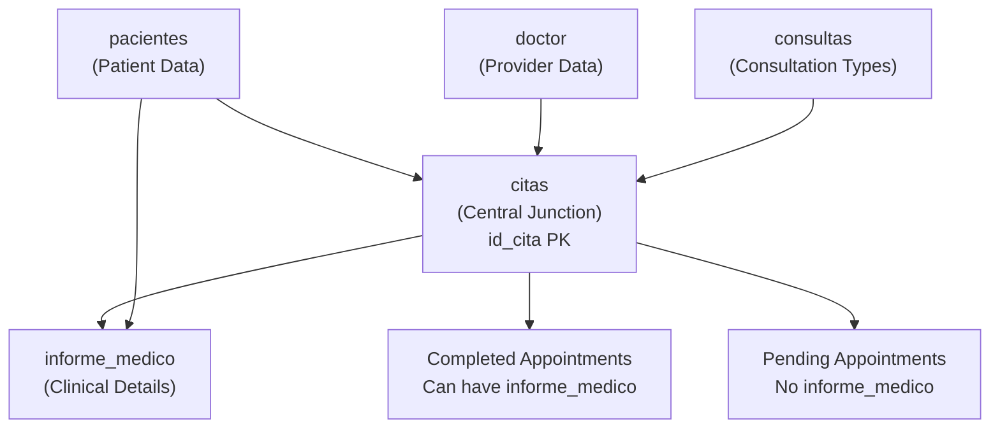
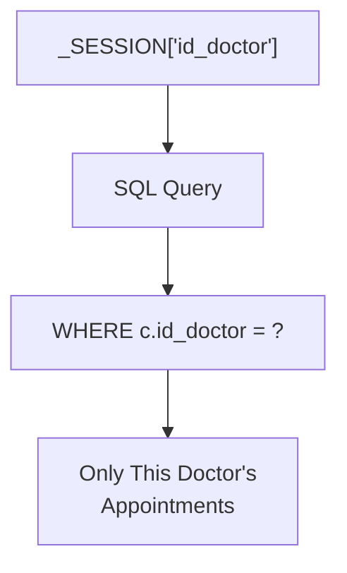
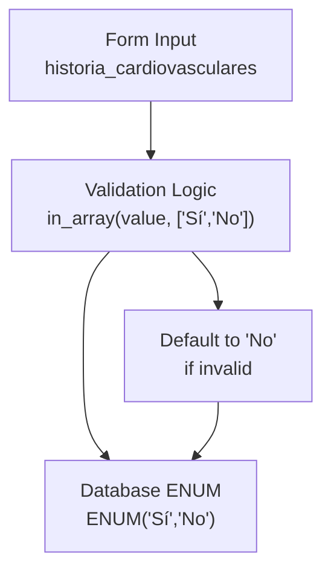
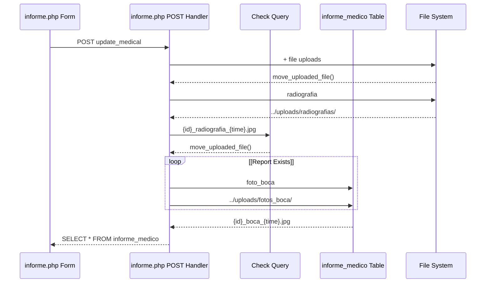

# Database Architecture

> **Relevant source files**
> * [Admin/descargar_historia.php](https://github.com/axchisan/Consultorio_Emily_Bernal/blob/589034b9/Admin/descargar_historia.php)
> * [Admin/informe.php](https://github.com/axchisan/Consultorio_Emily_Bernal/blob/589034b9/Admin/informe.php)
> * [Admin/inicioAdmin.php](https://github.com/axchisan/Consultorio_Emily_Bernal/blob/589034b9/Admin/inicioAdmin.php)
> * [Admin/ver_historia.php](https://github.com/axchisan/Consultorio_Emily_Bernal/blob/589034b9/Admin/ver_historia.php)

## Purpose and Scope

This document provides a comprehensive overview of the MySQL database schema used by the Consultorio Emily Bernal system. It covers all database tables, their fields, data types, relationships, and the normalized structure that supports patient management, appointment scheduling, and clinical documentation.

For information about how these tables are accessed through abstraction layers, see [Query Functions & Database Abstraction](/axchisan/Consultorio_Emily_Bernal/4.4-query-functions-and-database-abstraction). For details about specific table schemas, see [Core Data Model](/axchisan/Consultorio_Emily_Bernal/4.1-core-data-model), [Patient Medical History Schema](/axchisan/Consultorio_Emily_Bernal/4.2-patient-medical-history-schema), and [Medical Report Data Structure](/axchisan/Consultorio_Emily_Bernal/4.3-medical-report-data-structure).

---

## Database Overview

The database follows a normalized relational design centered around the `citas` (appointments) table, which serves as the junction point connecting patients, doctors, consultation types, and medical reports. The schema consists of six core tables and one supporting table for calendar management.

**Core Tables:**

* `pacientes` - Patient demographic and medical history information
* `doctor` - Healthcare provider credentials and authentication data
* `citas` - Appointment records linking patients with doctors
* `consultas` - Consultation type definitions
* `informe_medico` - Detailed clinical findings and treatment plans
* `unavailable_dates` - Doctor schedule blocking

**Database Engine:** MySQL
**Character Encoding:** UTF-8
**Access Pattern:** Direct MySQLi connections with prepared statements

Sources: [Admin/descargar_historia.php L1-L293](https://github.com/axchisan/Consultorio_Emily_Bernal/blob/589034b9/Admin/descargar_historia.php#L1-L293)

 [Admin/informe.php L1-L865](https://github.com/axchisan/Consultorio_Emily_Bernal/blob/589034b9/Admin/informe.php#L1-L865)

 [Admin/ver_historia.php L1-L302](https://github.com/axchisan/Consultorio_Emily_Bernal/blob/589034b9/Admin/ver_historia.php#L1-L302)

---

## Complete Entity Relationship Diagram

```

```

Sources: [Admin/descargar_historia.php L39-L82](https://github.com/axchisan/Consultorio_Emily_Bernal/blob/589034b9/Admin/descargar_historia.php#L39-L82)

 [Admin/informe.php L47-L65](https://github.com/axchisan/Consultorio_Emily_Bernal/blob/589034b9/Admin/informe.php#L47-L65)

 [Admin/informe.php L96-L158](https://github.com/axchisan/Consultorio_Emily_Bernal/blob/589034b9/Admin/informe.php#L96-L158)

 [Admin/informe.php L389-L410](https://github.com/axchisan/Consultorio_Emily_Bernal/blob/589034b9/Admin/informe.php#L389-L410)

 [Admin/ver_historia.php L51-L66](https://github.com/axchisan/Consultorio_Emily_Bernal/blob/589034b9/Admin/ver_historia.php#L51-L66)

---

## Table Structures

### doctor Table

The `doctor` table stores healthcare provider information and authentication credentials.

| Field | Type | Constraints | Description |
| --- | --- | --- | --- |
| `id_doctor` | INT | PRIMARY KEY, AUTO_INCREMENT | Unique doctor identifier |
| `nombreD` | VARCHAR | NOT NULL | Doctor's first name |
| `apellido` | VARCHAR | NOT NULL | Doctor's last name |
| `sexo` | ENUM('Masculino','Femenino') |  | Gender for profile display |
| `fecha_nacimiento` | DATE |  | Birth date |
| `correo_electronico` | VARCHAR | UNIQUE | Email for login |
| `password` | VARCHAR |  | Hashed password |
| `telefono` | VARCHAR |  | Contact phone number |
| `id_especialidad` | INT | FOREIGN KEY | Reference to specialty |
| `session_token` | VARCHAR |  | Current active session token |

**Usage in Code:**

* Queried via `consultarDoctor($link, $id_doctor)` function
* Session token validated in [Admin/inicioAdmin.php L17-L24](https://github.com/axchisan/Consultorio_Emily_Bernal/blob/589034b9/Admin/inicioAdmin.php#L17-L24)
* Gender determines profile image display [Admin/inicioAdmin.php L59-L63](https://github.com/axchisan/Consultorio_Emily_Bernal/blob/589034b9/Admin/inicioAdmin.php#L59-L63)

Sources: [Admin/inicioAdmin.php L26](https://github.com/axchisan/Consultorio_Emily_Bernal/blob/589034b9/Admin/inicioAdmin.php#L26-L26)

 [Admin/ver_historia.php L78](https://github.com/axchisan/Consultorio_Emily_Bernal/blob/589034b9/Admin/ver_historia.php#L78-L78)

 [Admin/informe.php L460](https://github.com/axchisan/Consultorio_Emily_Bernal/blob/589034b9/Admin/informe.php#L460-L460)

---

### pacientes Table

The `pacientes` table contains comprehensive patient demographic and medical history data.

| Field | Type | Constraints | Description |
| --- | --- | --- | --- |
| `id_paciente` | INT | PRIMARY KEY, AUTO_INCREMENT | Unique patient identifier |
| `nombre` | VARCHAR | NOT NULL | Patient's first name |
| `apellido` | VARCHAR | NOT NULL | Patient's last name |
| `fecha_nacimiento` | DATE | NOT NULL | Birth date for age calculation |
| `correo_electronico` | VARCHAR | UNIQUE | Email address |
| `telefono` | VARCHAR |  | Contact phone number |
| `cedula` | VARCHAR |  | National ID or document number |
| `sexo` | ENUM('Masculino','Femenino') |  | Gender |
| `eps` | VARCHAR |  | Health insurance provider |
| `ocupacion` | VARCHAR |  | Occupation |
| `estado_civil` | VARCHAR |  | Marital status |
| `tipo_sangre` | VARCHAR |  | Blood type (A+, O-, etc.) |
| `alertas_medicas` | TEXT |  | Critical medical alerts |
| `lugar_direccion_residencia` | VARCHAR |  | Address |
| `historia_cardiovasculares` | ENUM('Sí','No') | DEFAULT 'No' | Cardiovascular disease history |
| `historia_hemorragicas` | ENUM('Sí','No') | DEFAULT 'No' | Hemorrhagic disease history |
| `historia_dermatologicas` | ENUM('Sí','No') | DEFAULT 'No' | Dermatological disease history |
| `historia_mentales` | ENUM('Sí','No') | DEFAULT 'No' | Mental illness history |
| `historia_diabetes` | ENUM('Sí','No') | DEFAULT 'No' | Diabetes history |
| `historia_cancer` | ENUM('Sí','No') | DEFAULT 'No' | Cancer history |
| `historia_artritis` | ENUM('Sí','No') | DEFAULT 'No' | Arthritis history |
| `historia_alergias` | ENUM('Sí','No') | DEFAULT 'No' | Allergy history |
| `historia_cirugias` | ENUM('Sí','No') | DEFAULT 'No' | Surgery history |
| `historia_otros` | TEXT |  | Other medical history notes |
| `emergencia_nombre` | VARCHAR |  | Emergency contact name |
| `emergencia_telefono` | VARCHAR |  | Emergency contact phone |
| `menor_acompanante` | VARCHAR |  | Guardian name (if minor) |
| `menor_parentesco` | VARCHAR |  | Guardian relationship |
| `menor_telefono` | VARCHAR |  | Guardian phone number |

**Medical History ENUM Fields:**

All nine `historia_*` fields use ENUM('Sí','No') to record family or personal medical history. These are validated during updates at [Admin/informe.php L85-L93](https://github.com/axchisan/Consultorio_Emily_Bernal/blob/589034b9/Admin/informe.php#L85-L93)

 to ensure only 'Sí' or 'No' values are accepted, defaulting to 'No' if invalid.

**Usage in Code:**

* Retrieved via `consultarPaciente($link, $patient_id)` function
* Updated with prepared statement at [Admin/informe.php L96-L158](https://github.com/axchisan/Consultorio_Emily_Bernal/blob/589034b9/Admin/informe.php#L96-L158)
* Age calculated from `fecha_nacimiento` at [Admin/informe.php L39-L44](https://github.com/axchisan/Consultorio_Emily_Bernal/blob/589034b9/Admin/informe.php#L39-L44)

Sources: [Admin/informe.php L68-L170](https://github.com/axchisan/Consultorio_Emily_Bernal/blob/589034b9/Admin/informe.php#L68-L170)

 [Admin/descargar_historia.php L40-L46](https://github.com/axchisan/Consultorio_Emily_Bernal/blob/589034b9/Admin/descargar_historia.php#L40-L46)

 [Admin/ver_historia.php L37-L48](https://github.com/axchisan/Consultorio_Emily_Bernal/blob/589034b9/Admin/ver_historia.php#L37-L48)

---

### citas Table

The `citas` table serves as the central junction table linking patients, doctors, and consultation types.

| Field | Type | Constraints | Description |
| --- | --- | --- | --- |
| `id_cita` | INT | PRIMARY KEY, AUTO_INCREMENT | Unique appointment identifier |
| `id_paciente` | INT | FOREIGN KEY → pacientes | Patient reference |
| `id_doctor` | INT | FOREIGN KEY → doctor | Doctor reference |
| `id_consultas` | INT | FOREIGN KEY → consultas | Consultation type reference |
| `fecha_cita` | DATE | NOT NULL | Appointment date |
| `hora_cita` | TIME | NOT NULL | Appointment time |
| `estado` | ENUM('A','P') | DEFAULT 'P' | Status: 'A'=Realizada, 'P'=Pendiente |
| `diagnostico` | TEXT |  | Initial diagnosis |
| `descripcion` | TEXT |  | Consultation description |
| `medicina` | TEXT |  | Prescribed medications |

**Query Pattern:**

The typical query joins four tables to retrieve complete appointment information:

```

```

This pattern appears at [Admin/descargar_historia.php L57-L72](https://github.com/axchisan/Consultorio_Emily_Bernal/blob/589034b9/Admin/descargar_historia.php#L57-L72)

 and [Admin/ver_historia.php L51-L66](https://github.com/axchisan/Consultorio_Emily_Bernal/blob/589034b9/Admin/ver_historia.php#L51-L66)

**Usage in Code:**

* Retrieved via `MostrarCitas($link, $doctor_id)` at [Admin/inicioAdmin.php L27](https://github.com/axchisan/Consultorio_Emily_Bernal/blob/589034b9/Admin/inicioAdmin.php#L27-L27)
* Estado displayed as "Realizada" or "Pendiente" at [Admin/inicioAdmin.php L126](https://github.com/axchisan/Consultorio_Emily_Bernal/blob/589034b9/Admin/inicioAdmin.php#L126-L126)
* Used to fetch most recent appointment at [Admin/informe.php L47-L65](https://github.com/axchisan/Consultorio_Emily_Bernal/blob/589034b9/Admin/informe.php#L47-L65)

Sources: [Admin/descargar_historia.php L57-L72](https://github.com/axchisan/Consultorio_Emily_Bernal/blob/589034b9/Admin/descargar_historia.php#L57-L72)

 [Admin/informe.php L47-L65](https://github.com/axchisan/Consultorio_Emily_Bernal/blob/589034b9/Admin/informe.php#L47-L65)

 [Admin/ver_historia.php L51-L66](https://github.com/axchisan/Consultorio_Emily_Bernal/blob/589034b9/Admin/ver_historia.php#L51-L66)

 [Admin/inicioAdmin.php L119-L132](https://github.com/axchisan/Consultorio_Emily_Bernal/blob/589034b9/Admin/inicioAdmin.php#L119-L132)

---

### consultas Table

The `consultas` table defines consultation types (e.g., "Limpieza", "Extracción", "Revisión").

| Field | Type | Constraints | Description |
| --- | --- | --- | --- |
| `id_consultas` | INT | PRIMARY KEY, AUTO_INCREMENT | Unique consultation type ID |
| `tipo` | VARCHAR | NOT NULL | Consultation type name |

**Usage in Code:**

* Joined in appointment queries as `con.tipo`
* Displayed in appointment list at [Admin/inicioAdmin.php L123](https://github.com/axchisan/Consultorio_Emily_Bernal/blob/589034b9/Admin/inicioAdmin.php#L123-L123)
* Referenced in PDF generation at [Admin/descargar_historia.php L195](https://github.com/axchisan/Consultorio_Emily_Bernal/blob/589034b9/Admin/descargar_historia.php#L195-L195)

Sources: [Admin/descargar_historia.php L57-L59](https://github.com/axchisan/Consultorio_Emily_Bernal/blob/589034b9/Admin/descargar_historia.php#L57-L59)

 [Admin/inicioAdmin.php L123](https://github.com/axchisan/Consultorio_Emily_Bernal/blob/589034b9/Admin/inicioAdmin.php#L123-L123)

---

### informe_medico Table

The `informe_medico` table stores detailed clinical findings, treatment plans, and references to medical images.

| Field | Type | Constraints | Description |
| --- | --- | --- | --- |
| `id_informe` | INT | PRIMARY KEY, AUTO_INCREMENT | Unique report identifier |
| `id_cita` | INT | FOREIGN KEY → citas | Appointment reference |
| `id_paciente` | INT | FOREIGN KEY → pacientes | Patient reference |
| `examen_intraoral` | TEXT |  | Intraoral clinical examination |
| `examen_extraoral` | TEXT |  | Extraoral clinical examination |
| `examen_atm` | TEXT |  | TMJ examination findings |
| `observacion_intraoral` | TEXT |  | Intraoral palpation observations |
| `observacion_extraoral_atm` | TEXT |  | Extraoral/TMJ palpation observations |
| `descripcion_radiografica` | TEXT |  | Radiographic description |
| `diagnostico_periodontal` | TEXT |  | Periodontal diagnosis |
| `plan_tratamiento` | TEXT |  | Treatment plan |
| `pronostico` | TEXT |  | Prognosis |
| `evolucion` | TEXT |  | Evolution/progress notes |
| `diagnostico` | TEXT |  | Final diagnosis |
| `costo` | DECIMAL(10,2) | DEFAULT 0 | Treatment cost |
| `radiografia` | VARCHAR |  | Radiograph filename |
| `foto_boca` | VARCHAR |  | Oral photo filename |

**Image Storage Pattern:**

Only filenames are stored in the database. Physical files are stored in:

* `../uploads/radiografias/{filename}` for radiographs
* `../uploads/fotos_boca/{filename}` for oral photos

Filename format: `{patient_id}_{type}_{timestamp}.{extension}`  

Generated at [Admin/informe.php L198](https://github.com/axchisan/Consultorio_Emily_Bernal/blob/589034b9/Admin/informe.php#L198-L198)

 and [Admin/informe.php L215](https://github.com/axchisan/Consultorio_Emily_Bernal/blob/589034b9/Admin/informe.php#L215-L215)

**Insert vs Update Logic:**

The code checks for existing reports at [Admin/informe.php L225-L234](https://github.com/axchisan/Consultorio_Emily_Bernal/blob/589034b9/Admin/informe.php#L225-L234)

:

* If exists: UPDATE with conditional SET clauses based on uploaded files [Admin/informe.php L236-L377](https://github.com/axchisan/Consultorio_Emily_Bernal/blob/589034b9/Admin/informe.php#L236-L377)
* If not exists: INSERT new record [Admin/informe.php L389-L420](https://github.com/axchisan/Consultorio_Emily_Bernal/blob/589034b9/Admin/informe.php#L389-L420)

**Usage in Code:**

* Queried at [Admin/descargar_historia.php L76-L82](https://github.com/axchisan/Consultorio_Emily_Bernal/blob/589034b9/Admin/descargar_historia.php#L76-L82)
* Updated/inserted at [Admin/informe.php L174-L424](https://github.com/axchisan/Consultorio_Emily_Bernal/blob/589034b9/Admin/informe.php#L174-L424)
* Displayed in viewer at [Admin/ver_historia.php L69-L75](https://github.com/axchisan/Consultorio_Emily_Bernal/blob/589034b9/Admin/ver_historia.php#L69-L75)

Sources: [Admin/informe.php L174-L424](https://github.com/axchisan/Consultorio_Emily_Bernal/blob/589034b9/Admin/informe.php#L174-L424)

 [Admin/descargar_historia.php L76-L82](https://github.com/axchisan/Consultorio_Emily_Bernal/blob/589034b9/Admin/descargar_historia.php#L76-L82)

 [Admin/ver_historia.php L254-L279](https://github.com/axchisan/Consultorio_Emily_Bernal/blob/589034b9/Admin/ver_historia.php#L254-L279)

---

### unavailable_dates Table

The `unavailable_dates` table supports calendar date blocking functionality.

| Field | Type | Constraints | Description |
| --- | --- | --- | --- |
| `id` | INT | PRIMARY KEY, AUTO_INCREMENT | Unique record identifier |
| `id_doctor` | INT | FOREIGN KEY → doctor | Doctor reference |
| `unavailable_date` | DATE | NOT NULL | Blocked date |

**Usage in Code:**

* Inserted/deleted via AJAX in calendar interface
* Referenced in calendar system for date availability checks

Sources: High-level system diagrams, calendar workflow documentation

---

## Database Relationships and Patterns

### Appointment-Centric Design



The `citas` table acts as the central hub. Every clinical interaction begins with an appointment record that connects:

1. A patient (`id_paciente`)
2. A doctor (`id_doctor`)
3. A consultation type (`id_consultas`)

Once an appointment is completed (`estado='A'`), a medical report (`informe_medico`) can be created with the `id_cita` as a foreign key.

Sources: [Admin/descargar_historia.php L57-L82](https://github.com/axchisan/Consultorio_Emily_Bernal/blob/589034b9/Admin/descargar_historia.php#L57-L82)

 [Admin/informe.php L225-L234](https://github.com/axchisan/Consultorio_Emily_Bernal/blob/589034b9/Admin/informe.php#L225-L234)

---

### Access Control Pattern



All appointment and patient queries include `WHERE c.id_doctor = ?` constraints to ensure doctors only access their own patients' data. This pattern appears in:

* [Admin/descargar_historia.php L61-L63](https://github.com/axchisan/Consultorio_Emily_Bernal/blob/589034b9/Admin/descargar_historia.php#L61-L63)  - Doctor ID required in cita query
* [Admin/informe.php L51-L52](https://github.com/axchisan/Consultorio_Emily_Bernal/blob/589034b9/Admin/informe.php#L51-L52)  - Filters appointments by doctor
* [Admin/inicioAdmin.php L27](https://github.com/axchisan/Consultorio_Emily_Bernal/blob/589034b9/Admin/inicioAdmin.php#L27-L27)  - `MostrarCitas()` filters by doctor ID

Sources: [Admin/descargar_historia.php L57-L72](https://github.com/axchisan/Consultorio_Emily_Bernal/blob/589034b9/Admin/descargar_historia.php#L57-L72)

 [Admin/informe.php L47-L65](https://github.com/axchisan/Consultorio_Emily_Bernal/blob/589034b9/Admin/informe.php#L47-L65)

 [Admin/inicioAdmin.php L6-L27](https://github.com/axchisan/Consultorio_Emily_Bernal/blob/589034b9/Admin/inicioAdmin.php#L6-L27)

---

### Medical History ENUM Storage

The patient table uses nine ENUM fields for medical history tracking:



This pattern at [Admin/informe.php L85-L93](https://github.com/axchisan/Consultorio_Emily_Bernal/blob/589034b9/Admin/informe.php#L85-L93)

 ensures data integrity:

```

```

Sources: [Admin/informe.php L85-L93](https://github.com/axchisan/Consultorio_Emily_Bernal/blob/589034b9/Admin/informe.php#L85-L93)

 [Admin/descargar_historia.php L233-L268](https://github.com/axchisan/Consultorio_Emily_Bernal/blob/589034b9/Admin/descargar_historia.php#L233-L268)

---

## Data Flow: Creating a Medical Report



This workflow at [Admin/informe.php L174-L424](https://github.com/axchisan/Consultorio_Emily_Bernal/blob/589034b9/Admin/informe.php#L174-L424)

 demonstrates:

1. File uploads processed before database operations
2. Check-then-update pattern for idempotent saves
3. Conditional SQL based on file upload presence

Sources: [Admin/informe.php L174-L424](https://github.com/axchisan/Consultorio_Emily_Bernal/blob/589034b9/Admin/informe.php#L174-L424)

---

## Prepared Statement Usage

All database queries use prepared statements with parameter binding to prevent SQL injection:

**Example 1: Appointment Query**

```

```

**Example 2: Patient Update**

```

```

**Example 3: Medical Report Check**

```

```

This pattern is consistent across all files accessing the database.

Sources: [Admin/descargar_historia.php L62-L72](https://github.com/axchisan/Consultorio_Emily_Bernal/blob/589034b9/Admin/descargar_historia.php#L62-L72)

 [Admin/informe.php L122-L158](https://github.com/axchisan/Consultorio_Emily_Bernal/blob/589034b9/Admin/informe.php#L122-L158)

 [Admin/informe.php L226-L229](https://github.com/axchisan/Consultorio_Emily_Bernal/blob/589034b9/Admin/informe.php#L226-L229)

 [Admin/ver_historia.php L56-L60](https://github.com/axchisan/Consultorio_Emily_Bernal/blob/589034b9/Admin/ver_historia.php#L56-L60)

---

## Database Connection Management

**Connection Initialization:**
All pages include `conexionDB.php` which establishes the MySQLi connection stored in `$link`:

```

```

The `$link` variable is then passed to query functions defined in `consultas.php`.

**Connection Pattern:**

* Single connection per request
* No explicit connection closing (PHP handles cleanup)
* UTF-8 character encoding enforced

Sources: [Admin/descargar_historia.php L5-L6](https://github.com/axchisan/Consultorio_Emily_Bernal/blob/589034b9/Admin/descargar_historia.php#L5-L6)

 [Admin/informe.php L7-L8](https://github.com/axchisan/Consultorio_Emily_Bernal/blob/589034b9/Admin/informe.php#L7-L8)

 [Admin/inicioAdmin.php L3-L4](https://github.com/axchisan/Consultorio_Emily_Bernal/blob/589034b9/Admin/inicioAdmin.php#L3-L4)