# Editor de informes médicos

> **Archivos fuente relevantes**
> * [Admin/eliminar_imagen.php](https://github.com/axchisan/Consultorio_Emily_Bernal/blob/589034b9/Admin/delete_image.php)
> * [Admin/informe.php](https://github.com/axchisan/Consultorio_Emily_Bernal/blob/589034b9/Admin/informe.php)

## Propósito y alcance

El Editor de Informes Médicos ( `informe.php`) es la interfaz administrativa más compleja del sistema y funciona como una herramienta integral para la gestión de datos de pacientes e informes médicos. Esta página permite a los médicos:

* Editar la información demográfica del paciente y la información de contacto de emergencia
* Actualizar el historial médico (anamnesis) incluyendo antecedentes familiares y personales de enfermedades
* Crear y editar informes médicos detallados (informe_medico) con exámenes clínicos
* Cargar y administrar imágenes médicas (radiografías y fotografías orales)
* Generar informes en PDF a partir de los datos recopilados

Para ver las historias clínicas completas en formato de solo lectura, consulte [el Visor de detalles de la historia clínica](/axchisan/Consultorio_Emily_Bernal/2.3.2-clinical-history-detail-viewer) . Para obtener información sobre el proceso de generación de PDF, consulte [el Generador de informes médicos en PDF](/axchisan/Consultorio_Emily_Bernal/3.2-medical-report-pdf-generator) .

Fuentes:[Admin/informe.php L1-L435](https://github.com/axchisan/Consultorio_Emily_Bernal/blob/589034b9/Admin/informe.php#L1-L435)

## Acceso a la página y carga de datos

### Punto de entrada y autenticación

La página requiere una sesión médica válida y un parámetro de identificación del paciente. El control de acceso sigue un proceso de validación de tres niveles:

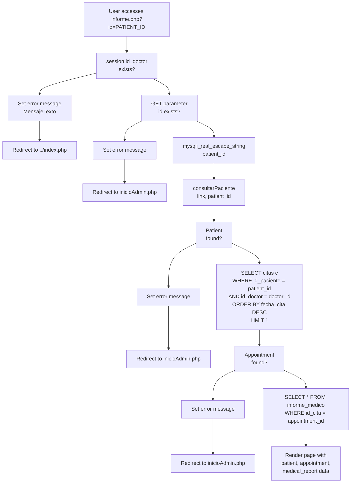

**Entidades de código clave:**

* Variables de sesión:`$_SESSION['id_doctor']` [Admin/informe.php L11-L16](https://github.com/axchisan/Consultorio_Emily_Bernal/blob/589034b9/Admin/informe.php#L11-L16)
* Parámetro GET:`$_GET['id']` [Admin/informe.php L19-L24](https://github.com/axchisan/Consultorio_Emily_Bernal/blob/589034b9/Admin/informe.php#L19-L24)
* Funciones de consulta:`consultarPaciente()` [Admin/informe.php L30](https://github.com/axchisan/Consultorio_Emily_Bernal/blob/589034b9/Admin/informe.php#L30-L30)
* Consulta de cita más reciente:[Admin/informe.php L47-L56](https://github.com/axchisan/Consultorio_Emily_Bernal/blob/589034b9/Admin/informe.php#L47-L56)
* Recuperación de informes médicos:[Admin/informe.php L428-L434](https://github.com/axchisan/Consultorio_Emily_Bernal/blob/589034b9/Admin/informe.php#L428-L434)

Fuentes:[Admin/informe.php L1-L64](https://github.com/axchisan/Consultorio_Emily_Bernal/blob/589034b9/Admin/informe.php#L1-L64)

 [Admin/informe.php L428-L435](https://github.com/axchisan/Consultorio_Emily_Bernal/blob/589034b9/Admin/informe.php#L428-L435)

## Arquitectura de dos formas

La página implementa un patrón de diseño de formato dual, con controladores POST separados para actualizaciones de datos de pacientes versus actualizaciones de informes médicos:

| Forma | Nombre del botón Enviar | Tabla de base de datos | Objetivo |
| --- | --- | --- | --- |
| Información y anamnesis del paciente | `update_patient` | `pacientes` | Demografía, contactos de emergencia, historial médico |
| Informe médico | `update_medical` | `informe_medico` | Clinical examinations, treatment plans, images |

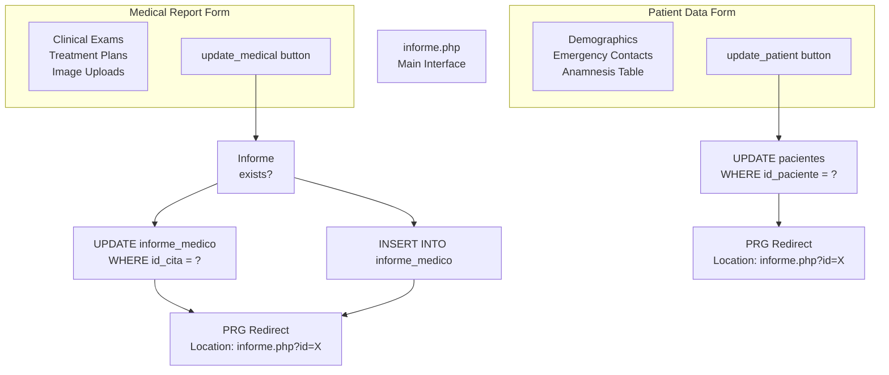

Sources: [Admin/informe.php L68-L171](https://github.com/axchisan/Consultorio_Emily_Bernal/blob/589034b9/Admin/informe.php#L68-L171)

 [Admin/informe.php L174-L425](https://github.com/axchisan/Consultorio_Emily_Bernal/blob/589034b9/Admin/informe.php#L174-L425)

 [Admin/informe.php L508-L668](https://github.com/axchisan/Consultorio_Emily_Bernal/blob/589034b9/Admin/informe.php#L508-L668)

 [Admin/informe.php L690-L772](https://github.com/axchisan/Consultorio_Emily_Bernal/blob/589034b9/Admin/informe.php#L690-L772)

## Patient Information Management

### Form Structure

The patient information form spans lines 508-668 and consists of three main sections:

1. **General Information (Read-only Display)**: Name, age, date of birth, email [Admin/informe.php L516-L522](https://github.com/axchisan/Consultorio_Emily_Bernal/blob/589034b9/Admin/informe.php#L516-L522)
2. **Editable Medical Data**: Phone, ID number, address, EPS, gender, occupation, civil status [Admin/informe.php L525-L583](https://github.com/axchisan/Consultorio_Emily_Bernal/blob/589034b9/Admin/informe.php#L525-L583)
3. **Anamnesis Table**: Nine medical history conditions (ENUM 'Sí'/'No') plus free-text "Otros" field [Admin/informe.php L593-L660](https://github.com/axchisan/Consultorio_Emily_Bernal/blob/589034b9/Admin/informe.php#L593-L660)

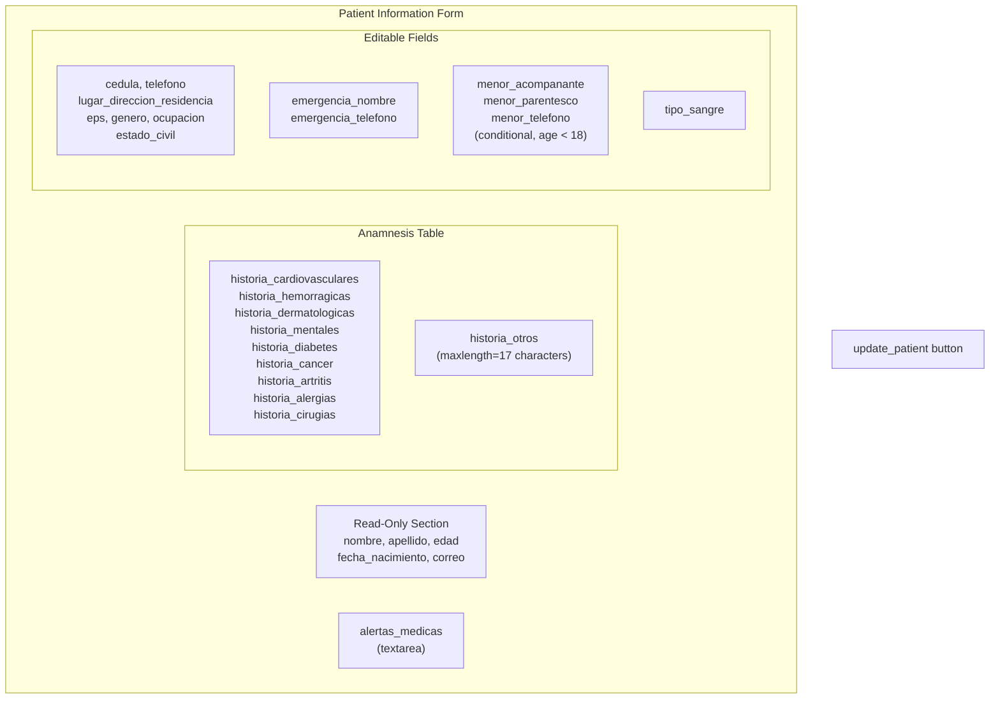

Sources: [Admin/informe.php L508-L668](https://github.com/axchisan/Consultorio_Emily_Bernal/blob/589034b9/Admin/informe.php#L508-L668)

### Patient Update Handler

The patient update POST handler validates ENUM fields and uses a prepared statement with 25 bound parameters:

**ENUM Field Validation Pattern:**

```
$historia_cardiovasculares = isset($_POST['historia_cardiovasculares']) 
    && in_array($_POST['historia_cardiovasculares'], ['Sí', 'No']) 
    ? $_POST['historia_cardiovasculares'] : 'No';
```

This pattern ensures that only valid ENUM values ('Sí' or 'No') are stored in the database, defaulting to 'No' if invalid input is received. The validation is applied to all nine medical history fields [Admin/informe.php L85-L94](https://github.com/axchisan/Consultorio_Emily_Bernal/blob/589034b9/Admin/informe.php#L85-L94)

**UPDATE Query Structure:**

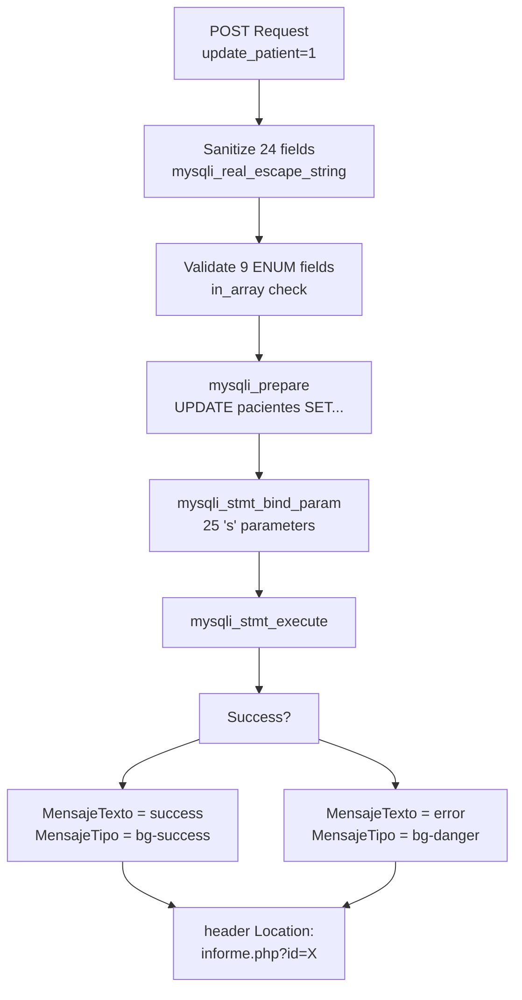

Sources: [Admin/informe.php L68-L171](https://github.com/axchisan/Consultorio_Emily_Bernal/blob/589034b9/Admin/informe.php#L68-L171)

## Medical Report Management

### Clinical Examination Fields

The medical report form captures 12 textual clinical examination fields stored in the `informe_medico` table:

| Field Name | Purpose | HTML Element |
| --- | --- | --- |
| `examen_intraoral` | Intraoral clinical examination | textarea |
| `examen_extraoral` | Extraoral clinical examination | textarea |
| `examen_atm` | ATM (temporomandibular joint) examination | textarea |
| `observacion_intraoral` | Intraoral observation and palpation | textarea |
| `observacion_extraoral_atm` | Extraoral observation (ATM and masticatory muscles) | textarea |
| `descripcion_radiografica` | Radiographic description | textarea |
| `diagnostico_periodontal` | Periodontal diagnosis | textarea |
| `plan_tratamiento` | Treatment plan | textarea |
| `pronostico` | Prognosis | textarea |
| `evolucion` | Evolution/Progress | textarea |
| `diagnostico` | Diagnosis | textarea |
| `costo` | Cost | number input (step=0.01) |

Sources: [Admin/informe.php L691-L766](https://github.com/axchisan/Consultorio_Emily_Bernal/blob/589034b9/Admin/informe.php#L691-L766)

### Medical Report Submission Logic

The medical report submission handler implements conditional INSERT vs UPDATE logic based on whether a report already exists for the appointment:

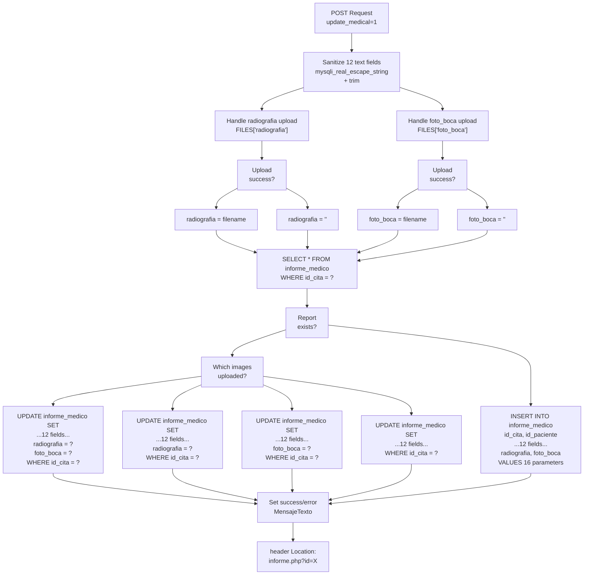

**Conditional UPDATE Logic:**

The system generates four different UPDATE queries based on which images were uploaded. This conditional approach prevents overwriting existing images when no new upload is provided:

* **Both images uploaded**: 14 parameters (12 text + 2 images) [Admin/informe.php L238-L273](https://github.com/axchisan/Consultorio_Emily_Bernal/blob/589034b9/Admin/informe.php#L238-L273)
* **Radiograph only**: 13 parameters (12 text + 1 image) [Admin/informe.php L275-L308](https://github.com/axchisan/Consultorio_Emily_Bernal/blob/589034b9/Admin/informe.php#L275-L308)
* **Oral photo only**: 13 parameters (12 text + 1 image) [Admin/informe.php L310-L343](https://github.com/axchisan/Consultorio_Emily_Bernal/blob/589034b9/Admin/informe.php#L310-L343)
* **No images uploaded**: 12 parameters (text fields only) [Admin/informe.php L345-L377](https://github.com/axchisan/Consultorio_Emily_Bernal/blob/589034b9/Admin/informe.php#L345-L377)

Sources: [Admin/informe.php L174-L425](https://github.com/axchisan/Consultorio_Emily_Bernal/blob/589034b9/Admin/informe.php#L174-L425)

## Image Upload System

### Upload Flow and Filename Generation

The image upload system implements a standardized workflow for both radiographs and oral photos:

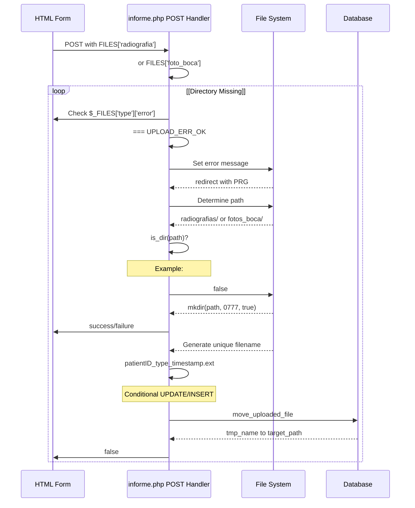

**Filename Pattern:**

```
{patient_id}_{type}_{timestamp}.{extension}
```

* `{patient_id}`: Patient ID from `$patient_id` variable
* `{type}`: Either "radiografia" or "boca"
* `{timestamp}`: Unix timestamp from `time()`
* `{extension}`: Original file extension from `pathinfo()`

Examples:

* `45_radiografia_1701123456.jpg`
* `45_boca_1701123500.png`

**Code Implementation:**

* Radiograph upload: [Admin/informe.php L192-L206](https://github.com/axchisan/Consultorio_Emily_Bernal/blob/589034b9/Admin/informe.php#L192-L206)
* Oral photo upload: [Admin/informe.php L209-L223](https://github.com/axchisan/Consultorio_Emily_Bernal/blob/589034b9/Admin/informe.php#L209-L223)
* Directory paths: `../uploads/radiografias/` and `../uploads/fotos_boca/`

Sources: [Admin/informe.php L188-L223](https://github.com/axchisan/Consultorio_Emily_Bernal/blob/589034b9/Admin/informe.php#L188-L223)

### Image Preview and Deletion UI

The page displays uploaded images with inline preview and AJAX-powered deletion:

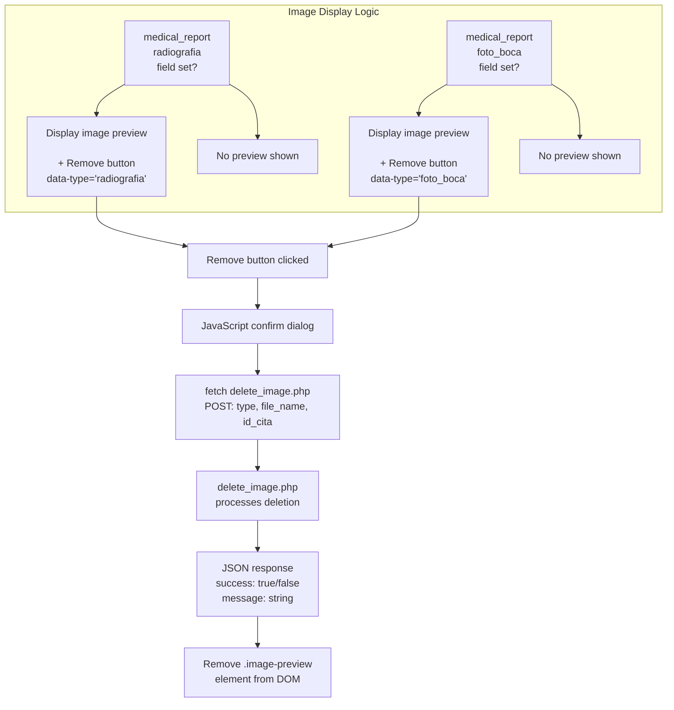

Sources: [Admin/informe.php L734-L753](https://github.com/axchisan/Consultorio_Emily_Bernal/blob/589034b9/Admin/informe.php#L734-L753)

 [Admin/informe.php L829-L861](https://github.com/axchisan/Consultorio_Emily_Bernal/blob/589034b9/Admin/informe.php#L829-L861)

## Image Deletion System

### AJAX Endpoint (delete_image.php)

The `delete_image.php` file provides a dedicated AJAX endpoint for image deletion with comprehensive validation:

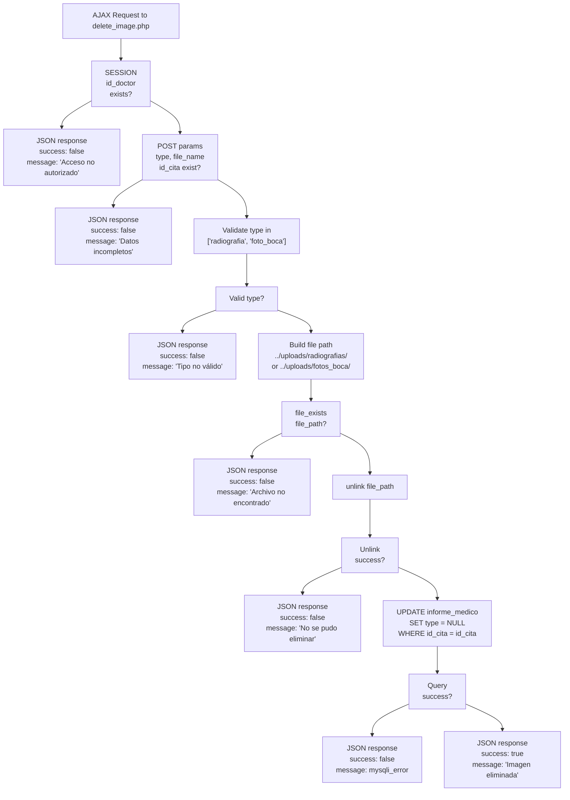

**Proceso de eliminación en dos pasos:**

1. **Eliminación de archivos físicos** :`unlink($file_path)` [delete_image.php L37-L40](https://github.com/axchisan/Consultorio_Emily_Bernal/blob/589034b9/Admin/delete_image.php#L37-L40)
2. **Actualización de base de datos NULL** :`UPDATE informe_medico SET $type = NULL` [delete_image.php L43-L44](https://github.com/axchisan/Consultorio_Emily_Bernal/blob/589034b9/Admin/delete_image.php#L43-L44)

Esta orden garantiza que, si falla la actualización de la base de datos, el archivo ya se haya eliminado, lo que evita que queden archivos huérfanos. Sin embargo, si falla la desvinculación, la base de datos no se modifica, lo que evita las referencias huérfanas.

**Validaciones de seguridad:**

* Comprobación de autenticación de sesión[delete_image.php L6-L9](https://github.com/axchisan/Consultorio_Emily_Bernal/blob/589034b9/Admin/delete_image.php#L6-L9)
* Validación de parámetros requeridos[delete_image.php L12-L15](https://github.com/axchisan/Consultorio_Emily_Bernal/blob/589034b9/Admin/delete_image.php#L12-L15)
* Validación de lista blanca de tipos[delete_image.php L22-L26](https://github.com/axchisan/Consultorio_Emily_Bernal/blob/589034b9/Admin/delete_image.php#L22-L26)
* Comprobación de existencia de archivo[delete_image.php L33-L36](https://github.com/axchisan/Consultorio_Emily_Bernal/blob/589034b9/Admin/delete_image.php#L33-L36)

Fuentes:[delete_image.php L1-L50](https://github.com/axchisan/Consultorio_Emily_Bernal/blob/589034b9/Admin/delete_image.php#L1-L50)

### Controlador de eliminación de frontend

El controlador de eliminación de JavaScript utiliza la API Fetch para comunicarse con el punto final de eliminación:

```javascript
fetch('delete_image.php', {
    method: 'POST',
    headers: {
        'Content-Type': 'application/x-www-form-urlencoded'
    },
    body: `type=${type}&file_name=${encodeURIComponent(fileName)}&id_cita=${idCita}`
})
.then(response => response.json())
.then(data => {
    if (data.success) {
        imagePreview.remove();
        alert(data.message);
    } else {
        alert(data.message);
    }
})
```

**Extracción de parámetros:**

* `type`: Desde `data-type`el atributo en el botón eliminar[Admin/informe.php L833](https://github.com/axchisan/Consultorio_Emily_Bernal/blob/589034b9/Admin/informe.php#L833-L833)
* `file_name`:Extraído de `src`la URL del atributo de imagen[Admin/informe.php L834](https://github.com/axchisan/Consultorio_Emily_Bernal/blob/589034b9/Admin/informe.php#L834-L834)
* `id_cita`:Variable PHP incrustada en JavaScript[Admin/informe.php L835](https://github.com/axchisan/Consultorio_Emily_Bernal/blob/589034b9/Admin/informe.php#L835-L835)

Fuentes:[Admin/informe.php L838-L858](https://github.com/axchisan/Consultorio_Emily_Bernal/blob/589034b9/Admin/informe.php#L838-L858)

## Componentes de interfaz

### Contador de caracteres para el campo "Otros"

El campo "Otros" en la tabla de anamnesis tiene un límite de 17 caracteres con un contador de caracteres activo:

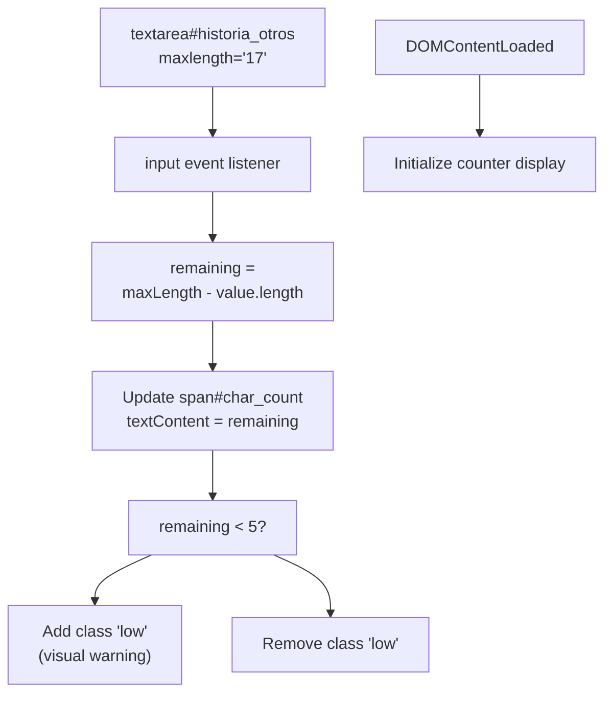

El contador muestra los caracteres restantes y agrega una advertencia visual (clase `low`) cuando quedan menos de 5 caracteres.

Fuentes:[Admin/informe.php L792-L810](https://github.com/axchisan/Consultorio_Emily_Bernal/blob/589034b9/Admin/informe.php#L792-L810)

### Estilo de entrada de archivo personalizado

Los elementos de entrada de archivo utilizan un estilo personalizado con JavaScript para mostrar los nombres de archivos seleccionados:

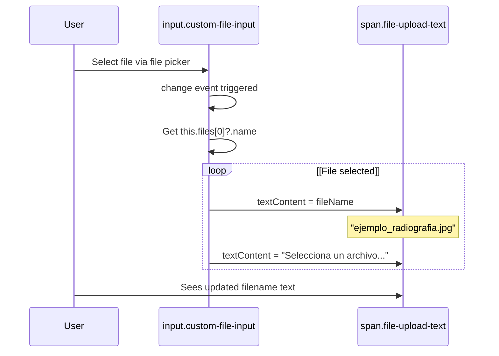

Esto proporciona retroalimentación al usuario sin depender de la apariencia de entrada de archivo predeterminada del navegador.

Fuentes:[Admin/informe.php L821-L827](https://github.com/axchisan/Consultorio_Emily_Bernal/blob/589034b9/Admin/informe.php#L821-L827)

### Visualización de mensajes flash

La página utiliza mensajes flash basados ​​en sesión siguiendo el patrón Post-Redirect-Get:

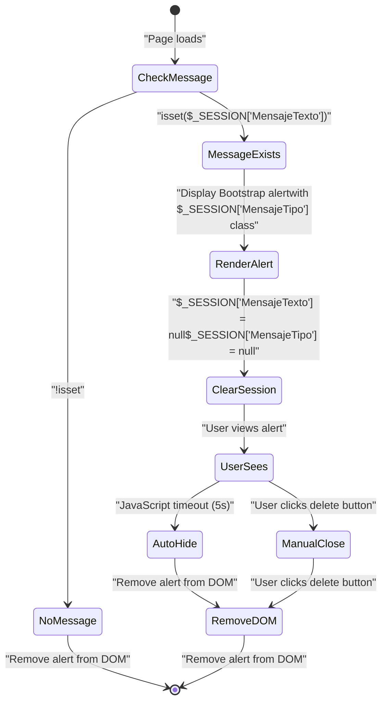

**Tipos de mensajes:**

* Éxito:`"p-3 mb-2 bg-success text-white"`
* Error:`"p-3 mb-2 bg-danger text-white"`

Fuentes:[Admin/informe.php L497-L506](https://github.com/axchisan/Consultorio_Emily_Bernal/blob/589034b9/Admin/informe.php#L497-L506)

 [Admin/informe.php L813-L819](https://github.com/axchisan/Consultorio_Emily_Bernal/blob/589034b9/Admin/informe.php#L813-L819)

## Resumen de operaciones de base de datos

### Uso de la declaración preparada

Todas las operaciones de base de datos utilizan sentencias preparadas con enlace de parámetros para evitar la inyección de SQL:

| Operación | Mesa | Tipo de declaración | Parámetros | Ubicación |
| --- | --- | --- | --- | --- |
| Cargar paciente | `pacientes` | SELECCIONAR | 1 ( `id_paciente`) | A través de`consultarPaciente()` |
| Cargar cita | `citas` | SELECCIONAR | 2 ( `id_paciente`, `id_doctor`) | [Admin/informe.php L47-L56](https://github.com/axchisan/Consultorio_Emily_Bernal/blob/589034b9/Admin/informe.php#L47-L56) |
| Cargar informe médico | `informe_medico` | SELECCIONAR | 1 ( `id_cita`) | [Admin/informe.php L428-L434](https://github.com/axchisan/Consultorio_Emily_Bernal/blob/589034b9/Admin/informe.php#L428-L434) |
| Actualizar paciente | `pacientes` | ACTUALIZAR | 25 (24 campos + `id_paciente`) | [Admin/informe.php L96-L158](https://github.com/axchisan/Consultorio_Emily_Bernal/blob/589034b9/Admin/informe.php#L96-L158) |
| Comprobar que existe informe | `informe_medico` | SELECCIONAR | 1 ( `id_cita`) | [Admin/informe.php L225-L229](https://github.com/axchisan/Consultorio_Emily_Bernal/blob/589034b9/Admin/informe.php#L225-L229) |
| Actualizar informe médico (sin imágenes) | `informe_medico` | ACTUALIZAR | 13 (12 campos + `id_cita`) | [Admin/informe.php L345-L377](https://github.com/axchisan/Consultorio_Emily_Bernal/blob/589034b9/Admin/informe.php#L345-L377) |
| Actualizar informe médico (1 imagen) | `informe_medico` | ACTUALIZAR | 14 (12 campos + 1 imagen + `id_cita`) | [Admin/informe.php L275-L343](https://github.com/axchisan/Consultorio_Emily_Bernal/blob/589034b9/Admin/informe.php#L275-L343) |
| Actualización del informe médico (2 imágenes) | `informe_medico` | ACTUALIZAR | 15 (12 campos + 2 imágenes + `id_cita`) | [Admin/informe.php L238-L273](https://github.com/axchisan/Consultorio_Emily_Bernal/blob/589034b9/Admin/informe.php#L238-L273) |
| Insertar informe médico | `informe_medico` | INSERTAR | 16 (2 ID + 12 campos + 2 imágenes) | [Admin/informe.php L389-L411](https://github.com/axchisan/Consultorio_Emily_Bernal/blob/589034b9/Admin/informe.php#L389-L411) |
| Eliminar referencia de imagen | `informe_medico` | ACTUALIZAR | 1 ( `id_cita`) | [delete_image.php L43](https://github.com/axchisan/Consultorio_Emily_Bernal/blob/589034b9/Admin/delete_image.php#L43-L43) |

Fuentes:[Admin/informe.php L47-L434](https://github.com/axchisan/Consultorio_Emily_Bernal/blob/589034b9/Admin/informe.php#L47-L434)

 [delete_image.php L43](https://github.com/axchisan/Consultorio_Emily_Bernal/blob/589034b9/Admin/delete_image.php#L43-L43)

## Integración con la generación de PDF

La página proporciona un botón para generar un informe médico en PDF, que se publica en `generate_informe_pdf.php`:

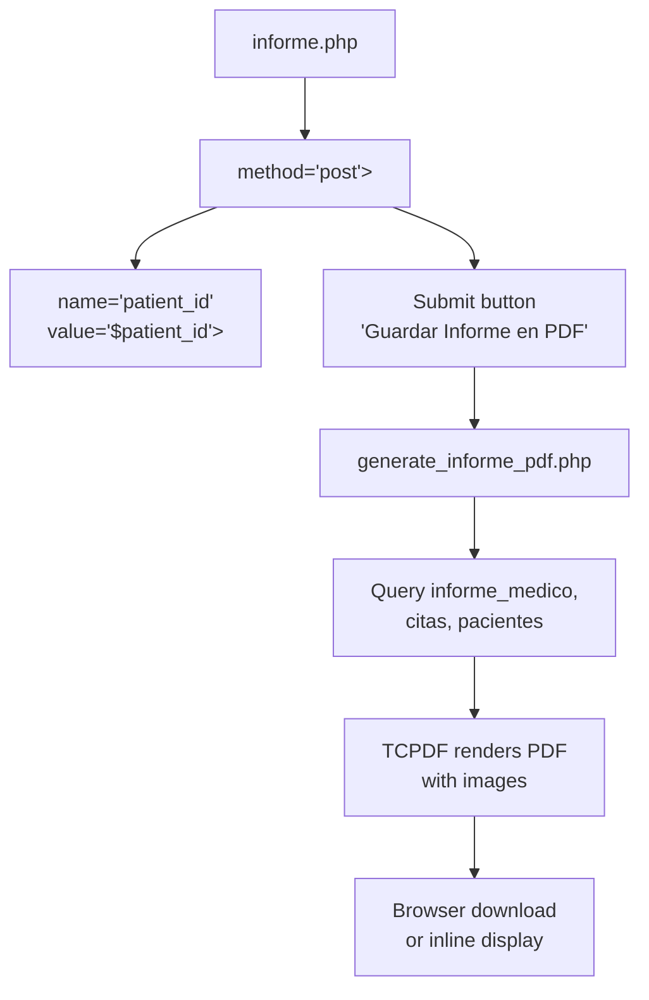

Para obtener información detallada sobre el proceso de generación de PDF, consulte [Generador de PDF de informes médicos](/axchisan/Consultorio_Emily_Bernal/3.2-medical-report-pdf-generator) .

Fuentes:[Admin/informe.php L773-L778](https://github.com/axchisan/Consultorio_Emily_Bernal/blob/589034b9/Admin/informe.php#L773-L778)

## Navegación de página y flujo de trabajo

Se accede al Editor de Informes Médicos desde la Vista de Lista de Historial Clínico a través del botón "Editar" e incluye navegación con ruta de navegación:

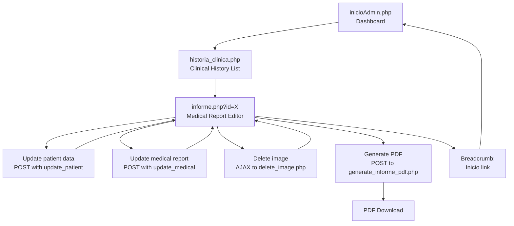

Fuentes:[Admin/informe.php L492-L495](https://github.com/axchisan/Consultorio_Emily_Bernal/blob/589034b9/Admin/informe.php#L492-L495)

 [Admin/informe.php L476-L480](https://github.com/axchisan/Consultorio_Emily_Bernal/blob/589034b9/Admin/informe.php#L476-L480)