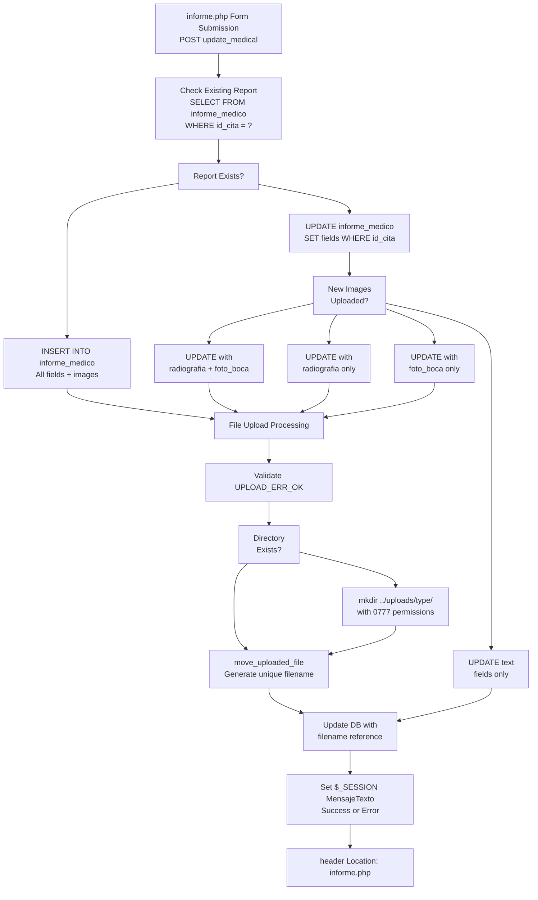
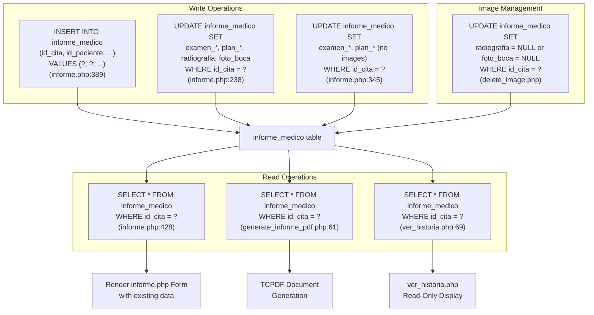
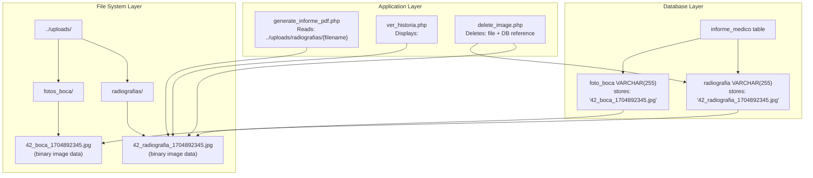
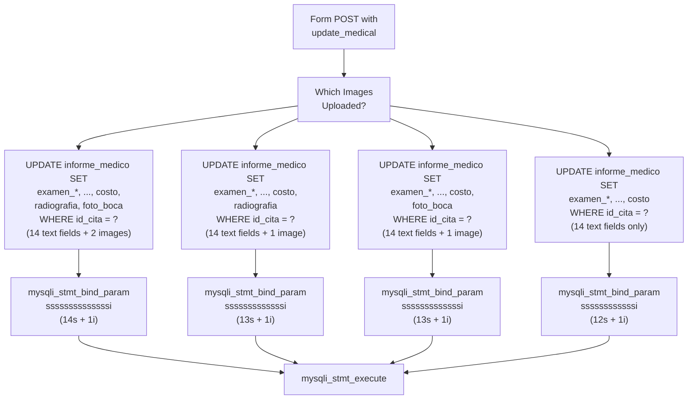
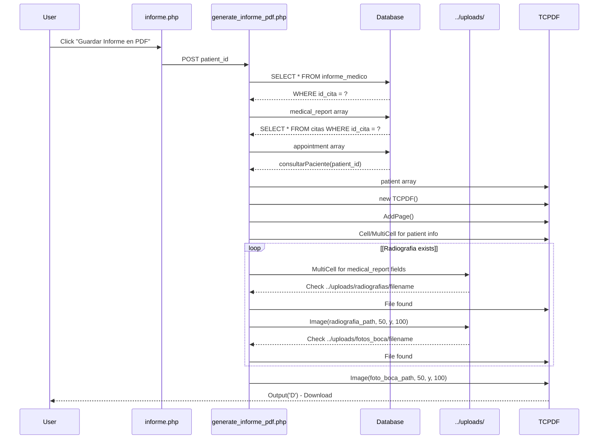

# Estructura de datos del informe médico

> **Archivos fuente relevantes**
> * [Admin/generar_informe_pdf.php](https://github.com/axchisan/Consultorio_Emily_Bernal/blob/589034b9/Admin/generate_informe_pdf.php)
> * [Admin/informe.php](https://github.com/axchisan/Consultorio_Emily_Bernal/blob/589034b9/Admin/informe.php)
> * [Admin/ver_historia.php](https://github.com/axchisan/Consultorio_Emily_Bernal/blob/589034b9/Admin/ver_historia.php)

## Propósito y alcance

Este documento describe la `informe_medico`tabla que almacena datos completos de exámenes clínicos, planes de tratamiento, diagnósticos y referencias a imágenes médicas para cada cita. Esta tabla representa los hallazgos médicos detallados que los médicos registran durante y después de las citas.

Para obtener información sobre las relaciones principales entre citas, pacientes y médicos, consulte [el Modelo de Datos Principales](/axchisan/Consultorio_Emily_Bernal/4.1-core-data-model) . Para los campos demográficos y de anamnesis de los pacientes, consulte [el Esquema del Historial Médico del Paciente](/axchisan/Consultorio_Emily_Bernal/4.2-patient-medical-history-schema) .

---

## Descripción general

La `informe_medico`tabla mantiene una relación directa con la `citas`tabla, almacenando los hallazgos clínicos detallados de las citas completadas. Cada informe médico contiene datos estructurados de exámenes clínicos, documentación del tratamiento, información financiera y referencias a las imágenes médicas cargadas.

**Interfaz principal** :[Admin/informe.php L1-L865](https://github.com/axchisan/Consultorio_Emily_Bernal/blob/589034b9/Admin/informe.php#L1-L865)

**Generación de PDF** :[generate_informe_pdf.php L1-L331](https://github.com/axchisan/Consultorio_Emily_Bernal/blob/589034b9/Admin/generate_informe_pdf.php#L1-L331)

**Vista de solo lectura** :[Admin/ver_historia.php L1-L302](https://github.com/axchisan/Consultorio_Emily_Bernal/blob/589034b9/Admin/ver_historia.php#L1-L302)

---

## Esquema de tabla

### Diagrama de relación entre entidades

```css
#mermaid-yph3m91vmqh{font-family:ui-sans-serif,-apple-system,system-ui,Segoe UI,Helvetica;font-size:16px;fill:#333;}@keyframes edge-animation-frame{from{stroke-dashoffset:0;}}@keyframes dash{to{stroke-dashoffset:0;}}#mermaid-yph3m91vmqh .edge-animation-slow{stroke-dasharray:9,5!important;stroke-dashoffset:900;animation:dash 50s linear infinite;stroke-linecap:round;}#mermaid-yph3m91vmqh .edge-animation-fast{stroke-dasharray:9,5!important;stroke-dashoffset:900;animation:dash 20s linear infinite;stroke-linecap:round;}#mermaid-yph3m91vmqh .error-icon{fill:#dddddd;}#mermaid-yph3m91vmqh .error-text{fill:#222222;stroke:#222222;}#mermaid-yph3m91vmqh .edge-thickness-normal{stroke-width:1px;}#mermaid-yph3m91vmqh .edge-thickness-thick{stroke-width:3.5px;}#mermaid-yph3m91vmqh .edge-pattern-solid{stroke-dasharray:0;}#mermaid-yph3m91vmqh .edge-thickness-invisible{stroke-width:0;fill:none;}#mermaid-yph3m91vmqh .edge-pattern-dashed{stroke-dasharray:3;}#mermaid-yph3m91vmqh .edge-pattern-dotted{stroke-dasharray:2;}#mermaid-yph3m91vmqh .marker{fill:#999;stroke:#999;}#mermaid-yph3m91vmqh .marker.cross{stroke:#999;}#mermaid-yph3m91vmqh svg{font-family:ui-sans-serif,-apple-system,system-ui,Segoe UI,Helvetica;font-size:16px;}#mermaid-yph3m91vmqh p{margin:0;}#mermaid-yph3m91vmqh .entityBox{fill:#ffffff;stroke:#dddddd;}#mermaid-yph3m91vmqh .relationshipLabelBox{fill:#dddddd;opacity:0.7;background-color:#dddddd;}#mermaid-yph3m91vmqh .relationshipLabelBox rect{opacity:0.5;}#mermaid-yph3m91vmqh .labelBkg{background-color:rgba(221, 221, 221, 0.5);}#mermaid-yph3m91vmqh .edgeLabel .label{fill:#dddddd;font-size:14px;}#mermaid-yph3m91vmqh .label{font-family:ui-sans-serif,-apple-system,system-ui,Segoe UI,Helvetica;color:#333;}#mermaid-yph3m91vmqh .edge-pattern-dashed{stroke-dasharray:8,8;}#mermaid-yph3m91vmqh .node rect,#mermaid-yph3m91vmqh .node circle,#mermaid-yph3m91vmqh .node ellipse,#mermaid-yph3m91vmqh .node polygon{fill:#ffffff;stroke:#dddddd;stroke-width:1px;}#mermaid-yph3m91vmqh .relationshipLine{stroke:#999;stroke-width:1;fill:none;}#mermaid-yph3m91vmqh .marker{fill:none!important;stroke:#999!important;stroke-width:1;}#mermaid-yph3m91vmqh :root{--mermaid-font-family:"trebuchet ms",verdana,arial,sans-serif;}documentsbelongs toreferencesreferencesinforme_medicointid_informePKintid_citaFKintid_pacienteFKtextexamen_intraoraltextexamen_extraoraltextexamen_atmtextobservacion_intraoraltextobservacion_extraoral_atmtextdescripcion_radiograficatextdiagnostico_periodontaltextplan_tratamientotextpronosticotextevoluciontextdiagnosticodecimalcostovarcharradiografiavarcharfoto_bocacitasintid_citaPKintid_pacienteFKintid_doctorFKdatefecha_citatimehora_citastringestadopacientesintid_pacientePKstringnombrestringapellidoradiografias_filestringfilenamebinarydatafotos_boca_filestringfilenamebinarydata
```

**Fuentes** :[Admin/informe.php L389-L410](https://github.com/axchisan/Consultorio_Emily_Bernal/blob/589034b9/Admin/informe.php#L389-L410)

 [generate_informe_pdf.php L61-L67](https://github.com/axchisan/Consultorio_Emily_Bernal/blob/589034b9/Admin/generate_informe_pdf.php#L61-L67)

---

## Definiciones de campo

### Campos de identificación

| Campo | Tipo | Restricciones | Descripción |
| --- | --- | --- | --- |
| `id_informe` | INT | CLAVE PRINCIPAL, AUTO_INCREMENTO | Identificador único para cada informe médico |
| `id_cita` | INT | CLAVE EXTRANJERA, ÚNICA | Enlaces a `citas.id_cita`: garantiza un informe por cita |
| `id_paciente` | INT | CLAVE EXTRANJERA | Enlaces a `pacientes.id_paciente`- desnormalizados para la optimización de consultas |

The dual foreign keys (`id_cita` and `id_paciente`) provide both direct patient access and maintain the appointment relationship. This denormalization improves query performance when retrieving all reports for a patient.

**Sources**: [Admin/informe.php L389-L396](https://github.com/axchisan/Consultorio_Emily_Bernal/blob/589034b9/Admin/informe.php#L389-L396)

 [Admin/generate_informe_pdf.php L44-L58](https://github.com/axchisan/Consultorio_Emily_Bernal/blob/589034b9/Admin/generate_informe_pdf.php#L44-L58)

---

### Clinical Examination Fields

The medical report contains seven TEXT fields for clinical examinations and observations:

| Field | Type | UI Label | Clinical Purpose |
| --- | --- | --- | --- |
| `examen_intraoral` | TEXT | "Examen Clínico Intraoral" | Internal oral cavity examination findings |
| `examen_extraoral` | TEXT | "Examen Clínico Extraoral" | External facial and jaw examination |
| `examen_atm` | TEXT | "Examen ATM" | Temporomandibular joint assessment |
| `observacion_intraoral` | TEXT | "Observación, Palpación Intraoral" | Tactile examination notes for internal structures |
| `observacion_extraoral_atm` | TEXT | "Observación, Palpación Extraoral (ATM y Músculos Masticación)" | Tactile examination of TMJ and masticatory muscles |
| `descripcion_radiografica` | TEXT | "Descripción Radiográfica" | Radiographic image interpretation |
| `diagnostico_periodontal` | TEXT | "Diagnóstico Periodontal" | Gum and periodontal tissue assessment |

These fields are rendered as `<textarea>` elements in the interface and support multiline text entry. All fields accept NULL values and default to empty strings when no data is entered.

**Sources**: [Admin/informe.php L175-L181](https://github.com/axchisan/Consultorio_Emily_Bernal/blob/589034b9/Admin/informe.php#L175-L181)

 [Admin/informe.php L692-L717](https://github.com/axchisan/Consultorio_Emily_Bernal/blob/589034b9/Admin/informe.php#L692-L717)

 [Admin/generate_informe_pdf.php L255-L281](https://github.com/axchisan/Consultorio_Emily_Bernal/blob/589034b9/Admin/generate_informe_pdf.php#L255-L281)

---

### Treatment and Diagnosis Fields

| Field | Type | UI Label | Purpose |
| --- | --- | --- | --- |
| `plan_tratamiento` | TEXT | "Plan de Tratamiento" | Proposed treatment procedures and timeline |
| `pronostico` | TEXT | "Pronóstico" | Expected treatment outcome and patient prognosis |
| `evolucion` | TEXT | "Evolución" | Patient progress notes and follow-up observations |
| `diagnostico` | TEXT | "Diagnóstico" | Final diagnosis based on all examinations |

**Sources**: [Admin/informe.php L182-L185](https://github.com/axchisan/Consultorio_Emily_Bernal/blob/589034b9/Admin/informe.php#L182-L185)

 [Admin/informe.php L719-L761](https://github.com/axchisan/Consultorio_Emily_Bernal/blob/589034b9/Admin/informe.php#L719-L761)

---

### Financial and Image Reference Fields

| Field | Type | Constraints | Description |
| --- | --- | --- | --- |
| `costo` | DECIMAL(10,2) | NOT NULL, DEFAULT 0 | Treatment cost in local currency |
| `radiografia` | VARCHAR(255) | NULL | Filename reference to radiograph image in `../uploads/radiografias/` |
| `foto_boca` | VARCHAR(255) | NULL | Filename reference to oral photograph in `../uploads/fotos_boca/` |

The image fields store **filenames only**, not binary data. The actual image files reside in the file system under `../uploads/` with separate subdirectories for each image type. This reference-based storage pattern separates structured data from binary blobs.

**Filename Convention**: `{patient_id}_{type}_{timestamp}.{extension}`

Example: `42_radiografia_1704892345.jpg`

**Sources**: [Admin/informe.php L186-L223](https://github.com/axchisan/Consultorio_Emily_Bernal/blob/589034b9/Admin/informe.php#L186-L223)

 [Admin/generate_informe_pdf.php L292-L312](https://github.com/axchisan/Consultorio_Emily_Bernal/blob/589034b9/Admin/generate_informe_pdf.php#L292-L312)

---

## Data Flow Architecture

### Medical Report Creation/Update Flow



**Sources**: [Admin/informe.php L174-L425](https://github.com/axchisan/Consultorio_Emily_Bernal/blob/589034b9/Admin/informe.php#L174-L425)

 [Admin/informe.php L225-L377](https://github.com/axchisan/Consultorio_Emily_Bernal/blob/589034b9/Admin/informe.php#L225-L377)

---

### Query Operations on informe_medico



**Sources**: [Admin/informe.php L428-L434](https://github.com/axchisan/Consultorio_Emily_Bernal/blob/589034b9/Admin/informe.php#L428-L434)

 [Admin/generate_informe_pdf.php L61-L67](https://github.com/axchisan/Consultorio_Emily_Bernal/blob/589034b9/Admin/generate_informe_pdf.php#L61-L67)

 [Admin/ver_historia.php L69-L75](https://github.com/axchisan/Consultorio_Emily_Bernal/blob/589034b9/Admin/ver_historia.php#L69-L75)

---

## Clinical Data Categorization

The 14 text/decimal fields in `informe_medico` logically group into four clinical categories:

### 1. Physical Examinations (7 fields)

Fields that document direct clinical observations:

* `examen_intraoral`
* `examen_extraoral`
* `examen_atm`
* `observacion_intraoral`
* `observacion_extraoral_atm`
* `descripcion_radiografica`
* `diagnostico_periodontal`

These fields populate the "Informe Médico" section in PDF reports at [Admin/generate_informe_pdf.php L255-L281](https://github.com/axchisan/Consultorio_Emily_Bernal/blob/589034b9/Admin/generate_informe_pdf.php#L255-L281)

### 2. Treatment Planning (2 fields)

Forward-looking treatment documentation:

* `plan_tratamiento` - Procedures to be performed
* `pronostico` - Expected outcomes

### 3. Patient Progress (1 field)

Historical tracking:

* `evolucion` - Longitudinal notes across multiple appointments

### 4. Diagnosis & Financials (2 fields)

Summary information:

* `diagnostico` - Final clinical diagnosis
* `costo` - Treatment cost (DECIMAL for precision)

**Sources**: [Admin/informe.php L692-L766](https://github.com/axchisan/Consultorio_Emily_Bernal/blob/589034b9/Admin/informe.php#L692-L766)

 [Admin/generate_informe_pdf.php L244-L322](https://github.com/axchisan/Consultorio_Emily_Bernal/blob/589034b9/Admin/generate_informe_pdf.php#L244-L322)

---

## File Reference Management

### Storage Architecture

The `radiografia` and `foto_boca` fields implement a **reference-based file storage pattern**:



**Sources**: [Admin/informe.php L188-L223](https://github.com/axchisan/Consultorio_Emily_Bernal/blob/589034b9/Admin/informe.php#L188-L223)

 [Admin/generate_informe_pdf.php L292-L312](https://github.com/axchisan/Consultorio_Emily_Bernal/blob/589034b9/Admin/generate_informe_pdf.php#L292-L312)

---

### Filename Generation

Unique filenames prevent collisions and enable patient identification:

```
{patient_id}_{type}_{timestamp}.{extension}
```

Implementation at [Admin/informe.php L198-L220](https://github.com/axchisan/Consultorio_Emily_Bernal/blob/589034b9/Admin/informe.php#L198-L220)

:

```
// Radiografia filename
$radiografia_name = $patient_id . "_radiografia_" . time() . "." . 
                    pathinfo($_FILES['radiografia']['name'], PATHINFO_EXTENSION);

// Foto boca filename  
$foto_boca_name = $patient_id . "_boca_" . time() . "." . 
                  pathinfo($_FILES['foto_boca']['name'], PATHINFO_EXTENSION);
```

The `time()` function provides a Unix timestamp, ensuring uniqueness even if the same patient uploads multiple images in succession.

---

### Image Deletion Workflow

Deletion requires coordination between database and filesystem:

1. **Update Database**: Set field to NULL via [Admin/delete_image.php](https://github.com/axchisan/Consultorio_Emily_Bernal/blob/589034b9/Admin/delete_image.php)
2. **Delete File**: Remove physical file from `../uploads/` directory
3. **Return JSON**: Confirm success to AJAX caller

This two-step process prevents orphaned database references (database points to non-existent file) and orphaned files (file exists but no database reference).

**Sources**: [Admin/informe.php L829-L860](https://github.com/axchisan/Consultorio_Emily_Bernal/blob/589034b9/Admin/informe.php#L829-L860)

 [Admin/ver_historia.php L262-L273](https://github.com/axchisan/Consultorio_Emily_Bernal/blob/589034b9/Admin/ver_historia.php#L262-L273)

---

## Conditional Update Logic

The medical report update mechanism uses conditional SQL generation based on which images are uploaded:



This conditional logic at [Admin/informe.php L237-L377](https://github.com/axchisan/Consultorio_Emily_Bernal/blob/589034b9/Admin/informe.php#L237-L377)

 prevents overwriting existing image references when no new image is uploaded. If a doctor updates only text fields, the existing `radiografia` and `foto_boca` values remain unchanged in the database.

**Sources**: [Admin/informe.php L237-L377](https://github.com/axchisan/Consultorio_Emily_Bernal/blob/589034b9/Admin/informe.php#L237-L377)

---

## INSERT vs UPDATE Decision

The system determines whether to INSERT or UPDATE based on the existence of a record:

```sql
// Check if medical report exists
$check_query = "SELECT * FROM informe_medico WHERE id_cita = ?";
$stmt = mysqli_prepare($link, $check_query);
mysqli_stmt_bind_param($stmt, "i", $appointment['id_cita']);
mysqli_stmt_execute($stmt);
$check_result = mysqli_stmt_get_result($stmt);

if (mysqli_num_rows($check_result) > 0) {
    // UPDATE existing report (lines 238-377)
} else {
    // INSERT new report (lines 389-410)
}
```

This pattern at [Admin/informe.php L225-L421](https://github.com/axchisan/Consultorio_Emily_Bernal/blob/589034b9/Admin/informe.php#L225-L421)

 implements an "upsert" operation (update if exists, insert if not) without relying on MySQL's `ON DUPLICATE KEY UPDATE` syntax.

**Sources**: [Admin/informe.php L225-L421](https://github.com/axchisan/Consultorio_Emily_Bernal/blob/589034b9/Admin/informe.php#L225-L421)

---

## PDF Integration

Both PDF generators query `informe_medico` to populate medical report sections:

### generate_informe_pdf.php Flow



The PDF includes all 14 clinical fields plus embedded images if present. Each field renders as a labeled section with [Admin/generate_informe_pdf.php L255-L322](https://github.com/axchisan/Consultorio_Emily_Bernal/blob/589034b9/Admin/generate_informe_pdf.php#L255-L322)

 controlling the layout.

**Sources**: [Admin/generate_informe_pdf.php L1-L331](https://github.com/axchisan/Consultorio_Emily_Bernal/blob/589034b9/Admin/generate_informe_pdf.php#L1-L331)

 [Admin/informe.php L773-L778](https://github.com/axchisan/Consultorio_Emily_Bernal/blob/589034b9/Admin/informe.php#L773-L778)

---

## Data Integrity Constraints

### Foreign Key Enforcement

The `id_cita` foreign key ensures referential integrity:

* A medical report cannot exist without a corresponding appointment
* Deleting a `citas` record would cascade delete the associated `informe_medico` (if CASCADE is configured)
* The UNIQUE constraint on `id_cita` enforces one-to-one relationship

### NULL Handling

All TEXT fields accept NULL values. The application code uses the null coalescing operator to provide defaults:

```
$medical_report['examen_intraoral'] ?? 'N/A'
```

This pattern appears throughout [Admin/generate_informe_pdf.php L255-L322](https://github.com/axchisan/Consultorio_Emily_Bernal/blob/589034b9/Admin/generate_informe_pdf.php#L255-L322)

 and [Admin/ver_historia.php L259-L278](https://github.com/axchisan/Consultorio_Emily_Bernal/blob/589034b9/Admin/ver_historia.php#L259-L278)

 ensuring the UI always displays meaningful text even when fields are empty.

---

## Security Considerations

### SQL Injection Prevention

All queries use prepared statements with parameter binding:

```
$stmt = mysqli_prepare($link, $medical_report_query);
mysqli_stmt_bind_param($stmt, "i", $appointment['id_cita']);
mysqli_stmt_execute($stmt);
```

This pattern at [Admin/informe.php L428-L434](https://github.com/axchisan/Consultorio_Emily_Bernal/blob/589034b9/Admin/informe.php#L428-L434)

 prevents SQL injection attacks by separating query structure from user-supplied data.

### File Upload Validation

Image uploads undergo validation:

1. Check `$_FILES['radiografia']['error'] === UPLOAD_ERR_OK` at [Admin/informe.php L192](https://github.com/axchisan/Consultorio_Emily_Bernal/blob/589034b9/Admin/informe.php#L192-L192)
2. Verify directory exists or create with proper permissions at [Admin/informe.php L194](https://github.com/axchisan/Consultorio_Emily_Bernal/blob/589034b9/Admin/informe.php#L194-L194)
3. Generate unique filename to prevent overwrites at [Admin/informe.php L198](https://github.com/axchisan/Consultorio_Emily_Bernal/blob/589034b9/Admin/informe.php#L198-L198)
4. Store only filename in database, not user-supplied path

**Sources**: [Admin/informe.php L192-L223](https://github.com/axchisan/Consultorio_Emily_Bernal/blob/589034b9/Admin/informe.php#L192-L223)

---

## Ejemplo de uso

### Creación de un nuevo informe médico

```sql
// After form submission (informe.php line 174)
$examen_intraoral = mysqli_real_escape_string($link, trim($_POST['examen_intraoral']));
// ... (collect all fields)

// Check if report exists
$check_query = "SELECT * FROM informe_medico WHERE id_cita = ?";
$stmt = mysqli_prepare($link, $check_query);
mysqli_stmt_bind_param($stmt, "i", $appointment['id_cita']);
mysqli_stmt_execute($stmt);

if (mysqli_num_rows($check_result) == 0) {
    // INSERT new report
    $insert_query = "INSERT INTO informe_medico 
        (id_cita, id_paciente, examen_intraoral, ..., radiografia, foto_boca) 
        VALUES (?, ?, ?, ..., ?, ?)";
    mysqli_stmt_bind_param($stmt, "iissss...ss", 
        $appointment['id_cita'], $patient_id, $examen_intraoral, ..., $radiografia, $foto_boca);
    mysqli_stmt_execute($stmt);
}
```

**Fuentes** :[Admin/informe.php L388-L421](https://github.com/axchisan/Consultorio_Emily_Bernal/blob/589034b9/Admin/informe.php#L388-L421)

---

## Tabla de resumen: todos los campos

| Campo | Tipo | NULO | Por defecto | Objetivo | Elemento de formulario | Sección PDF |
| --- | --- | --- | --- | --- | --- | --- |
| `id_informe` | INT | NO | INCREMENTO AUTOMÁTICO | Clave principal | - | - |
| `id_cita` | INT | NO | - | Cita FK | Entrada oculta | Información de la Cita |
| `id_paciente` | INT | NO | - | Paciente FK | Entrada oculta | Información del Paciente |
| `examen_intraoral` | TEXTO | SÍ | NULO | Examen intraoral | Área de texto | Examen intraoral |
| `examen_extraoral` | TEXTO | SÍ | NULO | Examen extraoral | Área de texto | Examen extraoral |
| `examen_atm` | TEXTO | SÍ | NULO | Evaluación de la ATM | Área de texto | Examen ATM |
| `observacion_intraoral` | TEXTO | SÍ | NULO | Palpación intraoral | Área de texto | Observación intraoral |
| `observacion_extraoral_atm` | TEXTO | SÍ | NULO | Palpación extraoral | Área de texto | Observación extraoral |
| `descripcion_radiografica` | TEXTO | SÍ | NULO | Hallazgos radiográficos | Área de texto | Descripción radiográfica |
| `diagnostico_periodontal` | TEXTO | SÍ | NULO | Diagnóstico de las encías | Área de texto | Diagnóstico Periodontal |
| `plan_tratamiento` | TEXTO | SÍ | NULO | Plan de tratamiento | Área de texto | Plan de Tratamiento |
| `pronostico` | TEXTO | SÍ | NULO | Pronóstico | Área de texto | Pronóstico |
| `evolucion` | TEXTO | SÍ | NULO | Notas de progreso | Área de texto | Evolución |
| `diagnostico` | TEXTO | SÍ | NULO | Diagnóstico final | Área de texto | Diagnóstico |
| `costo` | DECIMAL(10,2) | NO | 0.00 | Costo del tratamiento | Entrada de números | Costo |
| `radiografia` | VARCHAR(255) | SÍ | NULO | Nombre del archivo de rayos X | Entrada de archivo | Imagen (incrustada) |
| `foto_boca` | VARCHAR(255) | SÍ | NULO | Nombre del archivo de la foto | Entrada de archivo | Imagen (incrustada) |

**Fuentes** :[Admin/informe.php L175-L186](https://github.com/axchisan/Consultorio_Emily_Bernal/blob/589034b9/Admin/informe.php#L175-L186)

 [Admin/informe.php L692-L766](https://github.com/axchisan/Consultorio_Emily_Bernal/blob/589034b9/Admin/informe.php#L692-L766)

 [generate_informe_pdf.php L255-L322](https://github.com/axchisan/Consultorio_Emily_Bernal/blob/589034b9/Admin/generate_informe_pdf.php#L255-L322)