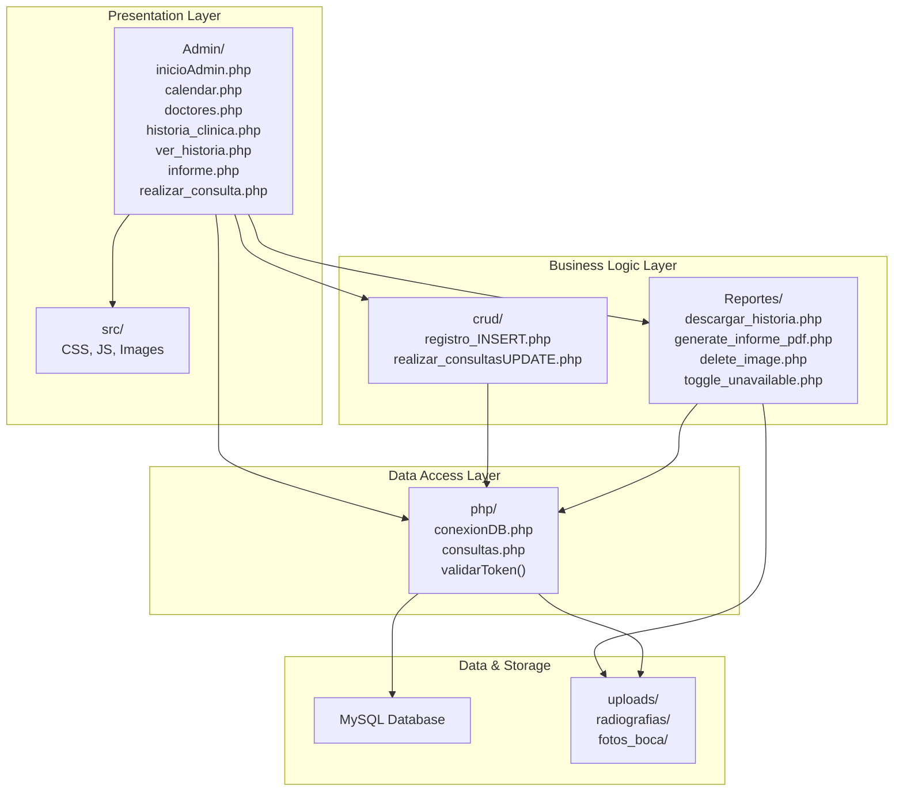
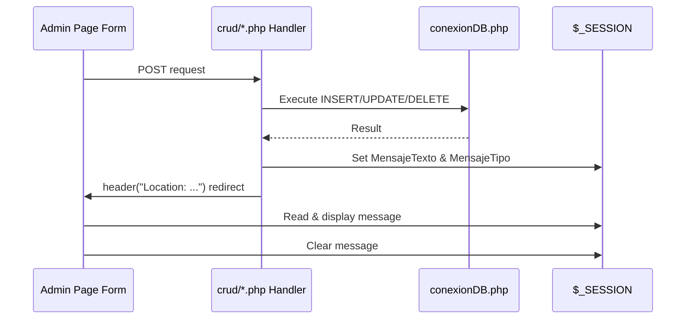
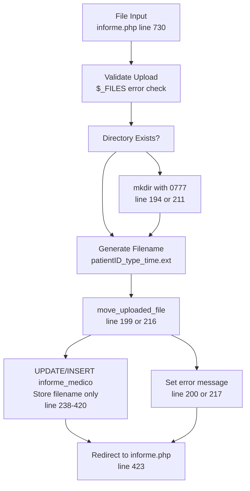
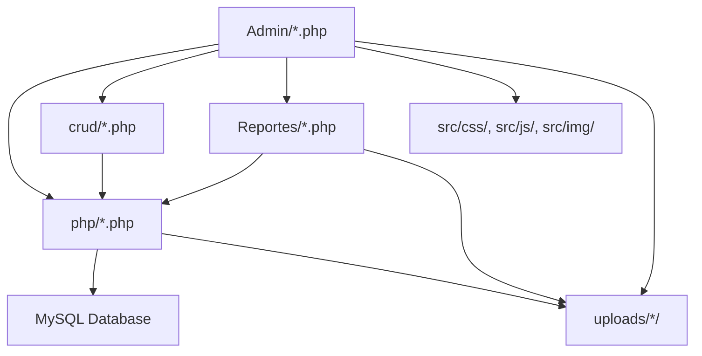

# Estructura del proyecto

> **Archivos fuente relevantes**
> * [.gitignore](https://github.com/axchisan/Consultorio_Emily_Bernal/blob/589034b9/.gitignore)
> * [Admin/informe.php](https://github.com/axchisan/Consultorio_Emily_Bernal/blob/589034b9/Admin/informe.php)
> * [Admin/inicioAdmin.php](https://github.com/axchisan/Consultorio_Emily_Bernal/blob/589034b9/Admin/inicioAdmin.php)

## Propósito y alcance

Este documento describe la organización de directorios y la estructura de archivos del sistema de gestión de la clínica dental Consultorio Emily Bernal. Explica la finalidad de cada directorio, los tipos de archivos que contiene y cómo la estructura física se relaciona con las capas de la arquitectura lógica. Para obtener información sobre dependencias externas y bibliotecas, consulte [Dependencias y bibliotecas](/axchisan/Consultorio_Emily_Bernal/8.2-dependencies-and-libraries) . Para conocer las exclusiones del control de versiones, consulte [Configuración del control de versiones](/axchisan/Consultorio_Emily_Bernal/8.3-version-control-configuration) .

## Estructura del directorio raíz

El proyecto sigue un patrón de separación funcional, organizando los archivos por su rol en la arquitectura del sistema en lugar de por pila de tecnología:

| Directorio | Objetivo | Capa |
| --- | --- | --- |
| `Admin/` | Páginas de interfaz administrativa para médicos | Presentación |
| `php/` | Conexión a bases de datos y funciones de utilidad | Acceso a datos / Lógica empresarial |
| `crud/` | Controladores de operaciones CRUD para formularios | Lógica de negocios |
| `Reportes/` | Scripts de generación de PDF | Lógica de negocios |
| `uploads/` | Almacenamiento de archivos de imágenes médicas | Almacenamiento de archivos |
| `src/` | Recursos de frontend (CSS, JS, imágenes) | Presentación |
| `_recursos_/` | Bibliotecas de terceros (excluidas de VCS) | Dependencias |

**Fuentes:** [.gitignore L1-L7](https://github.com/axchisan/Consultorio_Emily_Bernal/blob/589034b9/.gitignore#L1-L7)

 [Admin/informe.php L7-L8](https://github.com/axchisan/Consultorio_Emily_Bernal/blob/589034b9/Admin/informe.php#L7-L8)

 [Admin/inicioAdmin.php L3-L4](https://github.com/axchisan/Consultorio_Emily_Bernal/blob/589034b9/Admin/inicioAdmin.php#L3-L4)

## Descripción general del diseño del directorio

```mermaid
flowchart TD

Root["/ (Root Directory)"]
Admin["Admin/<br>7 presentation pages"]
PHP["php/<br>utilities & DAL"]
CRUD["crud/<br>form handlers"]
Reportes["Reportes/<br>PDF generators"]
Uploads["uploads/<br>medical images"]
Src["src/<br>frontend assets"]
Recursos["recursos/<br>third-party libs"]
InicioAdmin["inicioAdmin.php"]
Calendar["calendar.php"]
Doctores["doctores.php"]
Historia["historia_clinica.php"]
VerHistoria["ver_historia.php"]
Informe["informe.php"]
RealizarConsulta["realizar_consulta.php"]
ConexionDB["conexionDB.php"]
Consultas["consultas.php"]
Cerrar["cerrar.php"]
ValidarToken["validarToken function"]
RegistroINSERT["registro_INSERT.php"]
RealizarConsultasUPDATE["realizar_consultasUPDATE.php"]
DescargarHistoria["descargar_historia.php"]
GenerateInformePDF["generate_informe_pdf.php"]
DeleteImage["delete_image.php"]
ToggleUnavailable["toggle_unavailable.php"]
Radiografias["radiografias/"]
FotosBoca["fotos_boca/"]
CSS["css/"]
JS["js/"]
IMG["img/"]
AnyChart["AnyChart/"]
DataTables["DataTables/"]
JQueryConfirm["jquery-confirm-v3.3.4/"]

Root --> Admin
Root --> PHP
Root --> CRUD
Root --> Reportes
Root --> Uploads
Root --> Src
Root --> Recursos
Admin --> InicioAdmin
Admin --> Calendar
Admin --> Doctores
Admin --> Historia
Admin --> VerHistoria
Admin --> Informe
Admin --> RealizarConsulta
PHP --> ConexionDB
PHP --> Consultas
PHP --> Cerrar
PHP --> ValidarToken
CRUD --> RegistroINSERT
CRUD --> RealizarConsultasUPDATE
Reportes --> DescargarHistoria
Reportes --> GenerateInformePDF
Reportes --> DeleteImage
Reportes --> ToggleUnavailable
Uploads --> Radiografias
Uploads --> FotosBoca
Src --> CSS
Src --> JS
Src --> IMG
Recursos --> AnyChart
Recursos --> DataTables
Recursos --> JQueryConfirm
```



**Fuentes:** [.gitignore L1-L7](https://github.com/axchisan/Consultorio_Emily_Bernal/blob/589034b9/.gitignore#L1-L7)

 [Admin/informe.php L1-L863](https://github.com/axchisan/Consultorio_Emily_Bernal/blob/589034b9/Admin/informe.php#L1-L863)

 [Admin/inicioAdmin.php L1-L165](https://github.com/axchisan/Consultorio_Emily_Bernal/blob/589034b9/Admin/inicioAdmin.php#L1-L165)

## Mapeo de capas arquitectónicas



**Fuentes:** [Admin/informe.php L7-L8](https://github.com/axchisan/Consultorio_Emily_Bernal/blob/589034b9/Admin/informe.php#L7-L8)

 [Admin/inicioAdmin.php L3-L4](https://github.com/axchisan/Consultorio_Emily_Bernal/blob/589034b9/Admin/inicioAdmin.php#L3-L4)

## Admin/Directorio - Capa de presentación

El `Admin/`directorio contiene las siete interfaces administrativas principales. Cada archivo representa una página completa con validación de sesión, consultas a la base de datos y renderizado HTML.

### Inventario de archivos

| Archivo | Objetivo | Entidades primarias |
| --- | --- | --- |
| `inicioAdmin.php` | Panel de control que muestra todas las citas | `citas`, `pacientes`,`doctor` |
| `calendar.php` | Interfaz de programación basada en FullCalendar | `citas`,`unavailable_dates` |
| `doctores.php` | Interfaz CRUD de gestión de médicos | `doctor`,`especialidad` |
| `historia_clinica.php` | Listado de historial clínico (citas completadas) | `citas`, `pacientes`,`informe_medico` |
| `ver_historia.php` | Detailed clinical history viewer | `pacientes`, `citas`, `informe_medico` |
| `informe.php` | Medical report editor with image uploads | `pacientes`, `informe_medico`, file uploads |
| `realizar_consulta.php` | Diagnosis entry form | `citas` (diagnostico, descripcion, medicina) |

**Pattern:** All Admin pages follow this structure:

1. Session validation: [Admin/inicioAdmin.php L2-L24](https://github.com/axchisan/Consultorio_Emily_Bernal/blob/589034b9/Admin/inicioAdmin.php#L2-L24)
2. Database includes: [Admin/inicioAdmin.php L3-L4](https://github.com/axchisan/Consultorio_Emily_Bernal/blob/589034b9/Admin/inicioAdmin.php#L3-L4)
3. Query execution: [Admin/inicioAdmin.php L26-L27](https://github.com/axchisan/Consultorio_Emily_Bernal/blob/589034b9/Admin/inicioAdmin.php#L26-L27)
4. HTML rendering with sidebar navigation: [Admin/inicioAdmin.php L51-L77](https://github.com/axchisan/Consultorio_Emily_Bernal/blob/589034b9/Admin/inicioAdmin.php#L51-L77)

**Sources:** [Admin/inicioAdmin.php L1-L165](https://github.com/axchisan/Consultorio_Emily_Bernal/blob/589034b9/Admin/inicioAdmin.php#L1-L165)

 [Admin/informe.php L1-L863](https://github.com/axchisan/Consultorio_Emily_Bernal/blob/589034b9/Admin/informe.php#L1-L863)

## php/ Directory - Data Access & Utilities

The `php/` directory provides core database functionality and session management utilities used across all other directories.

### Core Files

| File | Purpose | Key Functions/Symbols |
| --- | --- | --- |
| `conexionDB.php` | MySQL connection establishment | `$link` (mysqli connection object) |
| `consultas.php` | Reusable query functions | `consultarPaciente()`, `consultarDoctor()`, `MostrarCitas()`, `validarToken()` |
| `cerrar.php` | Session termination handler | `session_unset()`, `session_destroy()` |

**Connection Pattern:**

```
include_once('../php/conexionDB.php');  // Establishes $link
include_once('../php/consultas.php');   // Query functions
```

This pattern appears in: [Admin/inicioAdmin.php L3-L4](https://github.com/axchisan/Consultorio_Emily_Bernal/blob/589034b9/Admin/inicioAdmin.php#L3-L4)

 [Admin/informe.php L7-L8](https://github.com/axchisan/Consultorio_Emily_Bernal/blob/589034b9/Admin/informe.php#L7-L8)

**Token Validation:**
The `validarToken()` function prevents concurrent logins by verifying the session token stored in `$_SESSION['session_token']` against the `doctor` table's `session_token` field: [Admin/inicioAdmin.php L17-L24](https://github.com/axchisan/Consultorio_Emily_Bernal/blob/589034b9/Admin/inicioAdmin.php#L17-L24)

**Sources:** [Admin/inicioAdmin.php L3-L4](https://github.com/axchisan/Consultorio_Emily_Bernal/blob/589034b9/Admin/inicioAdmin.php#L3-L4)

 [Admin/inicioAdmin.php L17-L24](https://github.com/axchisan/Consultorio_Emily_Bernal/blob/589034b9/Admin/inicioAdmin.php#L17-L24)

 [Admin/informe.php L7-L8](https://github.com/axchisan/Consultorio_Emily_Bernal/blob/589034b9/Admin/informe.php#L7-L8)

## crud/ Directory - Business Logic Handlers

The `crud/` directory contains POST request handlers that process form submissions and execute database modifications. These files do not render HTML; they perform operations and redirect.

### Handler Pattern



### Known CRUD Files

| File | HTTP Method | Operation | Target Table |
| --- | --- | --- | --- |
| `registro_INSERT.php` | POST | INSERT | `doctor` or `pacientes` |
| `realizar_consultasUPDATE.php` | GET/POST | UPDATE/DELETE | `citas` |

**Post-Redirect-Get Pattern:**
All CRUD handlers follow PRG to prevent duplicate submissions:

1. Process POST data
2. Set `$_SESSION['MensajeTexto']` and `$_SESSION['MensajeTipo']`
3. Execute `header("Location: ...")` redirect
4. Destination page displays message: [Admin/inicioAdmin.php L93-L101](https://github.com/axchisan/Consultorio_Emily_Bernal/blob/589034b9/Admin/inicioAdmin.php#L93-L101)

**Sources:** [Admin/inicioAdmin.php L130](https://github.com/axchisan/Consultorio_Emily_Bernal/blob/589034b9/Admin/inicioAdmin.php#L130-L130)

 [Admin/informe.php L169-L170](https://github.com/axchisan/Consultorio_Emily_Bernal/blob/589034b9/Admin/informe.php#L169-L170)

## Reportes/ Directory - PDF Generation & AJAX APIs

This directory contains specialized business logic for PDF generation and AJAX endpoints. Files here are invoked directly via form actions or fetch requests.

### File Purposes

| File | Invocation Method | Purpose |
| --- | --- | --- |
| `descargar_historia.php` | Form POST | Generates complete clinical history PDF via TCPDF |
| `generate_informe_pdf.php` | Form POST | Generates focused medical report PDF for specific appointment |
| `delete_image.php` | AJAX fetch | Deletes medical images (radiografía or foto_boca) |
| `toggle_unavailable.php` | AJAX POST | Toggles date availability in calendar system |

**AJAX Deletion Pattern:**
The `delete_image.php` endpoint follows a two-step process:

1. UPDATE `informe_medico` SET field = NULL
2. `unlink()` physical file

Invoked via: [Admin/informe.php L838-L860](https://github.com/axchisan/Consultorio_Emily_Bernal/blob/589034b9/Admin/informe.php#L838-L860)

**PDF Invocation:**
PDF generators are invoked via form POST with hidden patient_id:

```php
<form action="generate_informe_pdf.php" method="post">
    <input type="hidden" name="patient_id" value="<?php echo $patient_id; ?>">
    <button type="submit">Generate PDF</button>
</form>
```

Example: [Admin/informe.php L773-L778](https://github.com/axchisan/Consultorio_Emily_Bernal/blob/589034b9/Admin/informe.php#L773-L778)

**Sources:** [Admin/informe.php L773-L778](https://github.com/axchisan/Consultorio_Emily_Bernal/blob/589034b9/Admin/informe.php#L773-L778)

 [Admin/informe.php L838-L860](https://github.com/axchisan/Consultorio_Emily_Bernal/blob/589034b9/Admin/informe.php#L838-L860)

## uploads/ Directory - File Storage

The `uploads/` directory stores medical images using a reference-based storage pattern: filenames are stored in the database while binary data resides on disk.

### Directory Structure

```markdown
uploads/
├── radiografias/         # X-ray images
│   └── {id_paciente}_radiografia_{timestamp}.{ext}
└── fotos_boca/          # Oral cavity photographs
    └── {id_paciente}_boca_{timestamp}.{ext}
```

### Filename Convention

Format: `{id_paciente}_{type}_{timestamp}.{extension}`

Example generation: [Admin/informe.php L198-L199](https://github.com/axchisan/Consultorio_Emily_Bernal/blob/589034b9/Admin/informe.php#L198-L199)

```
$radiografia_name = $patient_id . "_radiografia_" . time() . "." . 
                    pathinfo($_FILES['radiografia']['name'], PATHINFO_EXTENSION);
```

### Upload Flow



**Database Reference:**
Only filenames are stored in `informe_medico` table fields:

* `radiografia` VARCHAR field stores `{patient_id}_radiografia_{timestamp}.{ext}`
* `foto_boca` VARCHAR field stores `{patient_id}_boca_{timestamp}.{ext}`

**Directory Creation:**
Directories are created lazily if missing: [Admin/informe.php L194](https://github.com/axchisan/Consultorio_Emily_Bernal/blob/589034b9/Admin/informe.php#L194-L194)

 [Admin/informe.php L211](https://github.com/axchisan/Consultorio_Emily_Bernal/blob/589034b9/Admin/informe.php#L211-L211)

**Sources:** [Admin/informe.php L192-L223](https://github.com/axchisan/Consultorio_Emily_Bernal/blob/589034b9/Admin/informe.php#L192-L223)

 [Admin/informe.php L198-L199](https://github.com/axchisan/Consultorio_Emily_Bernal/blob/589034b9/Admin/informe.php#L198-L199)

 [Admin/informe.php L215-L216](https://github.com/axchisan/Consultorio_Emily_Bernal/blob/589034b9/Admin/informe.php#L215-L216)

## src/ Directory - Frontend Assets

El `src/`directorio contiene recursos estáticos organizados por tipo:

### Estructura de subdirectorios

| Subdirectorio | Contenido | Referenciado por |
| --- | --- | --- |
| `css/` | Hojas de estilo y Bootstrap | Todas las páginas de administración |
| `css/lib/bootstrap/` | Archivos del marco Bootstrap | [Admin/informe.php L444](https://github.com/axchisan/Consultorio_Emily_Bernal/blob/589034b9/Admin/informe.php#L444-L444) |
| `css/lib/fontawesome/` | Iconos de Font Awesome | [Admin/informe.php L445](https://github.com/axchisan/Consultorio_Emily_Bernal/blob/589034b9/Admin/informe.php#L445-L445) |
| `js/` | Archivos y bibliotecas de JavaScript | Todas las páginas de administración |
| `js/lib/datatable/` | Archivos del complemento DataTables | [Admin/inicioAdmin.php L40-L41](https://github.com/axchisan/Consultorio_Emily_Bernal/blob/589034b9/Admin/inicioAdmin.php#L40-L41) |
| `img/` | Imágenes de la aplicación | Imágenes de perfil de la barra lateral[Admin/inicioAdmin.php L60-L62](https://github.com/axchisan/Consultorio_Emily_Bernal/blob/589034b9/Admin/inicioAdmin.php#L60-L62) |

### Patrón de carga de activos

Todas las páginas de administración siguen esta secuencia de carga:

1. CSS de Bootstrap:[Admin/informe.php L444](https://github.com/axchisan/Consultorio_Emily_Bernal/blob/589034b9/Admin/informe.php#L444-L444)
2. CSS de FontAwesome:[Admin/informe.php L445](https://github.com/axchisan/Consultorio_Emily_Bernal/blob/589034b9/Admin/informe.php#L445-L445)
3. CSS de administración personalizado:[Admin/informe.php L446](https://github.com/axchisan/Consultorio_Emily_Bernal/blob/589034b9/Admin/informe.php#L446-L446)
4. CSS específico de la página:[Admin/informe.php L447](https://github.com/axchisan/Consultorio_Emily_Bernal/blob/589034b9/Admin/informe.php#L447-L447)
5. jQuery:[Admin/informe.php L788](https://github.com/axchisan/Consultorio_Emily_Bernal/blob/589034b9/Admin/informe.php#L788-L788)
6. Bootstrap JS:[Admin/informe.php L789](https://github.com/axchisan/Consultorio_Emily_Bernal/blob/589034b9/Admin/informe.php#L789-L789)
7. JS de administración personalizado:[Admin/informe.php L790](https://github.com/axchisan/Consultorio_Emily_Bernal/blob/589034b9/Admin/informe.php#L790-L790)
8. JS específico de la página:[Admin/informe.php L791-L862](https://github.com/axchisan/Consultorio_Emily_Bernal/blob/589034b9/Admin/informe.php#L791-L862)

**Fuentes:** [Admin/informe.php L444-L447](https://github.com/axchisan/Consultorio_Emily_Bernal/blob/589034b9/Admin/informe.php#L444-L447)

 [Admin/informe.php L788-L790](https://github.com/axchisan/Consultorio_Emily_Bernal/blob/589034b9/Admin/informe.php#L788-L790)

 [Admin/inicioAdmin.php L36-L41](https://github.com/axchisan/Consultorio_Emily_Bernal/blob/589034b9/Admin/inicioAdmin.php#L36-L41)

## recursos/ Directorio - Bibliotecas de terceros

El `_recursos_/`directorio contiene dependencias de terceros excluidas del control de versiones mediante `.gitignore`.

### Bibliotecas excluidas

| Biblioteca | Objetivo | Motivo de exclusión |
| --- | --- | --- |
| `AnyChart` | Gráficos/visualización | Archivos binarios grandes, instalables a través del administrador de paquetes |
| `DataTables` | Mejora de la tabla | Control de versiones a través de CDN o src/js/lib/datatable/ local |
| `jquery-confirm-v3.3.4` | Diálogos de confirmación | Distribución específica de la versión de terceros |

**Entradas de Gitignore:** [.gitignore L3-L5](https://github.com/axchisan/Consultorio_Emily_Bernal/blob/589034b9/.gitignore#L3-L5)

**Nota:** Algunas bibliotecas como DataTables están duplicadas tanto en `_recursos_/`(excluidas) como en `src/js/lib/datatable/`(incluidas), lo que sugiere que hay una migración o consolidación en progreso.

**Fuentes:** [.gitignore L1-L7](https://github.com/axchisan/Consultorio_Emily_Bernal/blob/589034b9/.gitignore#L1-L7)

## Patrones de organización de archivos

### Navegación por ruta relativa

Todos los archivos utilizan rutas relativas según su ubicación de directorio:

**De Admin/ a php/:**

```
include_once('../php/conexionDB.php');
include_once('../php/consultas.php');
```

[Admin/inicioAdmin.php L3-L4](https://github.com/axchisan/Consultorio_Emily_Bernal/blob/589034b9/Admin/inicioAdmin.php#L3-L4)

**De Admin/ a subidas/:**

```
$radiografia_path = "../uploads/radiografias/";
$foto_boca_path = "../uploads/fotos_boca/";
```

[Admin/informe.php L193](https://github.com/axchisan/Consultorio_Emily_Bernal/blob/589034b9/Admin/informe.php#L193-L193)

 [Admin/informe.php L210](https://github.com/axchisan/Consultorio_Emily_Bernal/blob/589034b9/Admin/informe.php#L210-L210)

**De Admin/ a src/:**

```xml
<link rel="stylesheet" href="../src/css/lib/bootstrap/css/bootstrap.min.css">
<script src="../src/js/jquery.js"></script>
```

[Admin/informe.php L444](https://github.com/axchisan/Consultorio_Emily_Bernal/blob/589034b9/Admin/informe.php#L444-L444)

 [Admin/informe.php L788](https://github.com/axchisan/Consultorio_Emily_Bernal/blob/589034b9/Admin/informe.php#L788-L788)

### Convenciones de nomenclatura

| Tipo de archivo | Convención | Ejemplo |
| --- | --- | --- |
| Páginas de administración | camelCase o snake_case | `inicioAdmin.php`,`historia_clinica.php` |
| Manipuladores CRUD | {entidad}_{OPERACIÓN}.php | `registro_INSERT.php`,`realizar_consultasUPDATE.php` |
| Generadores de PDF | función_descriptiva.php | `descargar_historia.php`,`generate_informe_pdf.php` |
| Scripts de utilidad | descripción_de_acción.php | `delete_image.php`,`toggle_unavailable.php` |
| Imágenes subidas | {identificación}*{tipo}*{marca de tiempo}.{ext} | `42_radiografia_1640995200.jpg` |

**Fuentes:** [Admin/informe.php L7-L8](https://github.com/axchisan/Consultorio_Emily_Bernal/blob/589034b9/Admin/informe.php#L7-L8)

 [Admin/informe.php L193-L216](https://github.com/axchisan/Consultorio_Emily_Bernal/blob/589034b9/Admin/informe.php#L193-L216)

## Gráfico de dependencia de directorios



**Fuentes:** [Admin/informe.php L1-L863](https://github.com/axchisan/Consultorio_Emily_Bernal/blob/589034b9/Admin/informe.php#L1-L863)

 [Admin/inicioAdmin.php L1-L165](https://github.com/axchisan/Consultorio_Emily_Bernal/blob/589034b9/Admin/inicioAdmin.php#L1-L165)