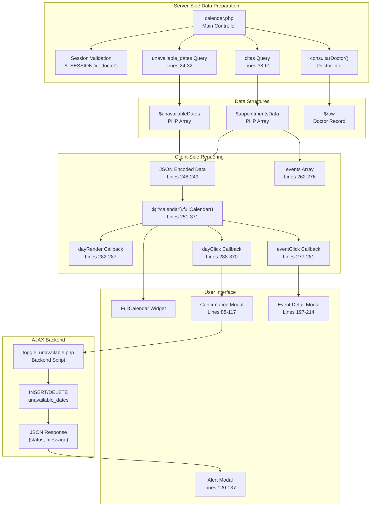
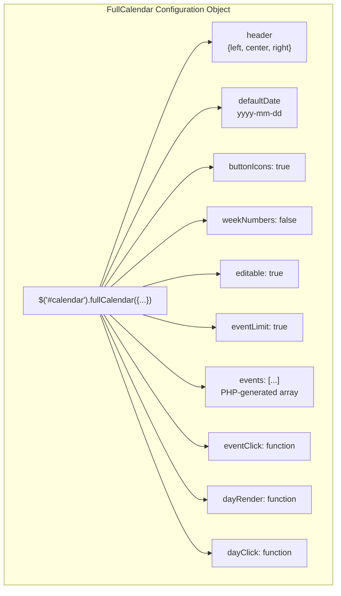
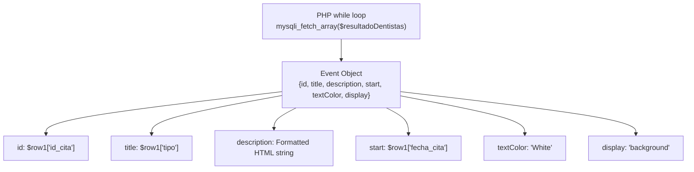
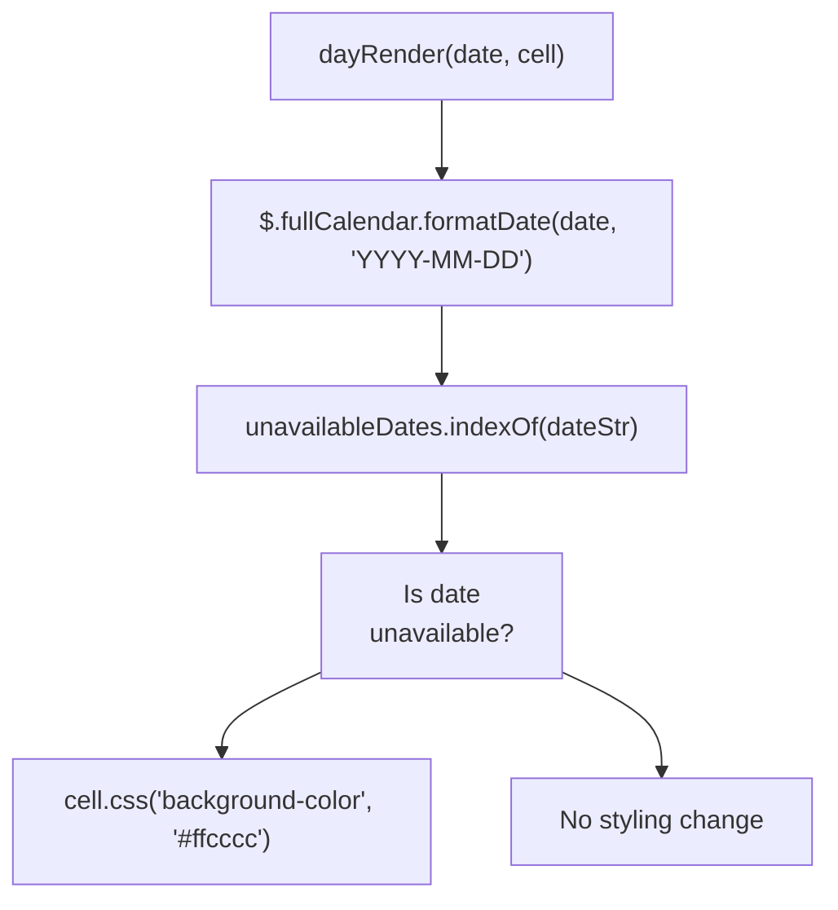
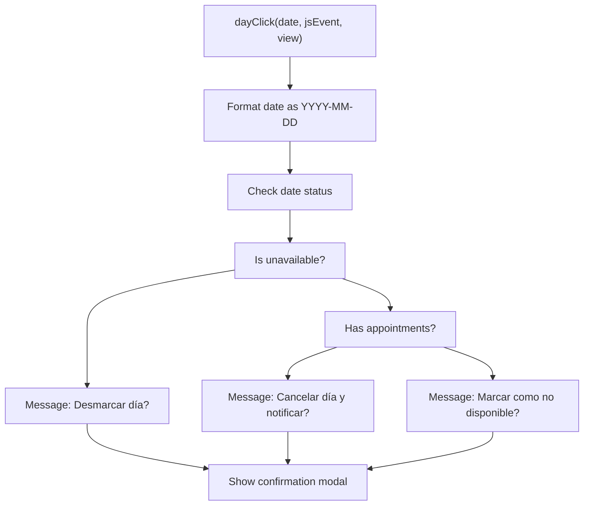
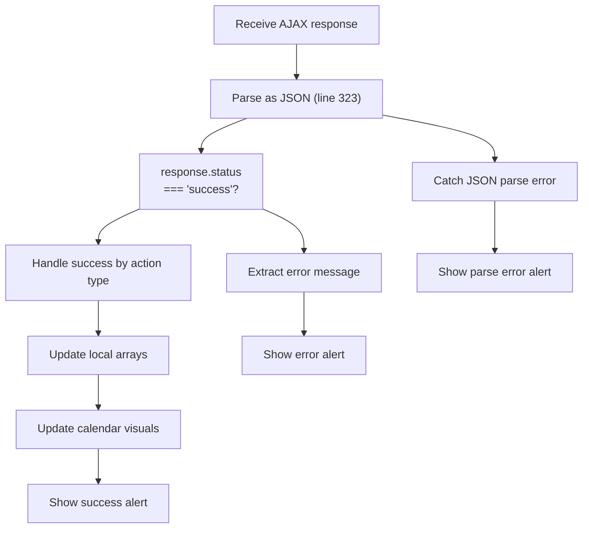
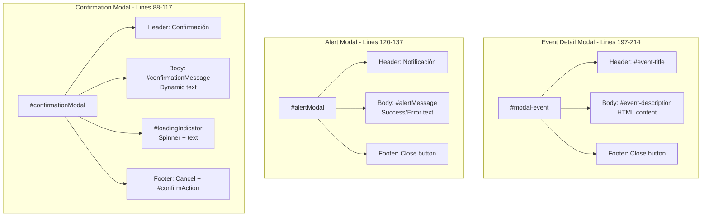
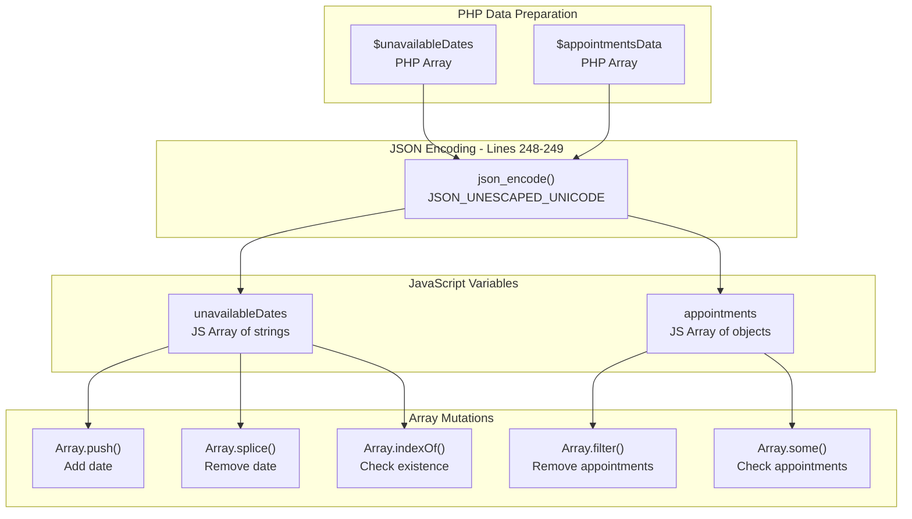

# FullCalendar Integration

> **Relevant source files**
> * [Admin/calendar.php](https://github.com/axchisan/Consultorio_Emily_Bernal/blob/589034b9/Admin/calendar.php)

## Purpose and Scope

This document describes the FullCalendar library integration in `calendar.php`, which provides doctors with an interactive visual calendar interface for viewing scheduled appointments and managing date availability. The implementation combines server-side PHP data preparation with client-side JavaScript event handling to create a comprehensive scheduling management system.

For information about the appointment CRUD operations shown in the calendar, see [Dashboard - Appointment Management](/axchisan/Consultorio_Emily_Bernal/2.1-dashboard-appointment-management). For details about the database schema supporting appointments and unavailable dates, see [Core Data Model](/axchisan/Consultorio_Emily_Bernal/4.1-core-data-model).

Sources: [Admin/calendar.php L1-L380](https://github.com/axchisan/Consultorio_Emily_Bernal/blob/589034b9/Admin/calendar.php#L1-L380)

---

## System Architecture

### Calendar Page Component Overview

The calendar system operates through a layered architecture where server-side PHP prepares data, FullCalendar renders the interface, and AJAX handles dynamic updates.



**Description**: This diagram shows the complete data flow from server-side preparation through client-side rendering to AJAX-based updates. PHP queries prepare two key data structures (`$unavailableDates` and `$appointmentsData`) which are JSON-encoded and consumed by the FullCalendar initialization. User interactions trigger callbacks that communicate with `toggle_unavailable.php` via AJAX.

Sources: [Admin/calendar.php L1-L380](https://github.com/axchisan/Consultorio_Emily_Bernal/blob/589034b9/Admin/calendar.php#L1-L380)

---

## FullCalendar Initialization

### Configuration Object

The FullCalendar instance is initialized on line 251 with a comprehensive configuration object:



**Description**: The FullCalendar configuration combines static settings (header, buttons, dates) with dynamic data (events) and interactive callbacks (eventClick, dayRender, dayClick).

Sources: [Admin/calendar.php L251-L371](https://github.com/axchisan/Consultorio_Emily_Bernal/blob/589034b9/Admin/calendar.php#L251-L371)

### Configuration Parameters

| Parameter | Value | Purpose | Line Reference |
| --- | --- | --- | --- |
| `header.left` | `'prev,next'` | Navigation buttons for month/week/day switching | [Admin/calendar.php L253](https://github.com/axchisan/Consultorio_Emily_Bernal/blob/589034b9/Admin/calendar.php#L253-L253) |
| `header.center` | `'title'` | Display current date range title | [Admin/calendar.php L254](https://github.com/axchisan/Consultorio_Emily_Bernal/blob/589034b9/Admin/calendar.php#L254-L254) |
| `header.right` | `'month,agendaWeek,agendaDay'` | View mode switcher buttons | [Admin/calendar.php L255](https://github.com/axchisan/Consultorio_Emily_Bernal/blob/589034b9/Admin/calendar.php#L255-L255) |
| `defaultDate` | `yyyy + '-' + mm + '-' + dd` | Set initial calendar date to today | [Admin/calendar.php L257](https://github.com/axchisan/Consultorio_Emily_Bernal/blob/589034b9/Admin/calendar.php#L257-L257) |
| `buttonIcons` | `true` | Enable icon display on buttons | [Admin/calendar.php L258](https://github.com/axchisan/Consultorio_Emily_Bernal/blob/589034b9/Admin/calendar.php#L258-L258) |
| `weekNumbers` | `false` | Hide week numbers in calendar | [Admin/calendar.php L259](https://github.com/axchisan/Consultorio_Emily_Bernal/blob/589034b9/Admin/calendar.php#L259-L259) |
| `editable` | `true` | Allow event drag-and-drop (not implemented) | [Admin/calendar.php L260](https://github.com/axchisan/Consultorio_Emily_Bernal/blob/589034b9/Admin/calendar.php#L260-L260) |
| `eventLimit` | `true` | Show "more" link when too many events | [Admin/calendar.php L261](https://github.com/axchisan/Consultorio_Emily_Bernal/blob/589034b9/Admin/calendar.php#L261-L261) |

Sources: [Admin/calendar.php L251-L261](https://github.com/axchisan/Consultorio_Emily_Bernal/blob/589034b9/Admin/calendar.php#L251-L261)

---

## Data Sources and Event Rendering

### Server-Side Data Queries

Two separate database queries populate the calendar with different types of information:

**Unavailable Dates Query**

[Admin/calendar.php L24-L32](https://github.com/axchisan/Consultorio_Emily_Bernal/blob/589034b9/Admin/calendar.php#L24-L32)

 retrieves dates marked as unavailable for the logged-in doctor:

```

```

The results are stored in `$unavailableDates` PHP array and later JSON-encoded on line 248.

**Appointments Query**

[Admin/calendar.php L38-L61](https://github.com/axchisan/Consultorio_Emily_Bernal/blob/589034b9/Admin/calendar.php#L38-L61)

 retrieves all appointments for the doctor with patient and consultation type information:

```

```

The results are formatted into `$appointmentsData` array with specific keys for JavaScript consumption.

Sources: [Admin/calendar.php L24-L61](https://github.com/axchisan/Consultorio_Emily_Bernal/blob/589034b9/Admin/calendar.php#L24-L61)

### Events Array Construction

The `events` array in the FullCalendar configuration [Admin/calendar.php L262-L276](https://github.com/axchisan/Consultorio_Emily_Bernal/blob/589034b9/Admin/calendar.php#L262-L276)

 is populated using PHP loop that iterates through `$resultadoDentistas`:



**Description**: Each appointment is converted to a FullCalendar event object. The `description` field [Admin/calendar.php L268](https://github.com/axchisan/Consultorio_Emily_Bernal/blob/589034b9/Admin/calendar.php#L268-L268)

 contains a formatted HTML string with patient name, consultation type, doctor name, date, and time. The `display: 'background'` property renders events as background highlights rather than discrete blocks.

Sources: [Admin/calendar.php L262-L276](https://github.com/axchisan/Consultorio_Emily_Bernal/blob/589034b9/Admin/calendar.php#L262-L276)

---

## Interactive Features

### Event Click Handling

When a user clicks on an appointment event, the `eventClick` callback [Admin/calendar.php L277-L281](https://github.com/axchisan/Consultorio_Emily_Bernal/blob/589034b9/Admin/calendar.php#L277-L281)

 triggers:

```

```

**Description**: The callback extracts the `title` and `description` properties from the `calEvent` object and populates the modal elements before displaying it. The HTML description includes formatted patient, doctor, and appointment information.

Sources: [Admin/calendar.php L277-L281](https://github.com/axchisan/Consultorio_Emily_Bernal/blob/589034b9/Admin/calendar.php#L277-L281)

### Day Rendering Customization

The `dayRender` callback [Admin/calendar.php L282-L287](https://github.com/axchisan/Consultorio_Emily_Bernal/blob/589034b9/Admin/calendar.php#L282-L287)

 applies custom styling to unavailable dates:



**Description**: For each day cell rendered in the calendar, this callback checks if the date exists in the `unavailableDates` array. If found, it applies a light red background color (`#ffcccc`) to visually distinguish unavailable dates.

Sources: [Admin/calendar.php L282-L287](https://github.com/axchisan/Consultorio_Emily_Bernal/blob/589034b9/Admin/calendar.php#L282-L287)

### Day Click Workflow

The `dayClick` callback [Admin/calendar.php L288-L370](https://github.com/axchisan/Consultorio_Emily_Bernal/blob/589034b9/Admin/calendar.php#L288-L370)

 implements complex logic for managing date availability:



**Description**: When a user clicks on a calendar day, the system determines the appropriate action based on the current state: (1) If already unavailable, offer to unmark it, (2) If appointments exist, offer to cancel them, (3) Otherwise, offer to mark as unavailable. The appropriate message is set in `#confirmationMessage` element [Admin/calendar.php L295-L301](https://github.com/axchisan/Consultorio_Emily_Bernal/blob/589034b9/Admin/calendar.php#L295-L301)

Sources: [Admin/calendar.php L288-L370](https://github.com/axchisan/Consultorio_Emily_Bernal/blob/589034b9/Admin/calendar.php#L288-L370)

---

## AJAX-Based Availability Management

### Action Determination Logic

The confirmation button click handler [Admin/calendar.php L304-L369](https://github.com/axchisan/Consultorio_Emily_Bernal/blob/589034b9/Admin/calendar.php#L304-L369)

 determines which action to send to the backend:

| Condition | Action Value | Backend Behavior | Line Reference |
| --- | --- | --- | --- |
| Date is unavailable | `'remove'` | DELETE from `unavailable_dates` | [Admin/calendar.php L305](https://github.com/axchisan/Consultorio_Emily_Bernal/blob/589034b9/Admin/calendar.php#L305-L305) |
| Date has appointments | `'cancel'` | DELETE appointments + INSERT unavailable + notify | [Admin/calendar.php L305](https://github.com/axchisan/Consultorio_Emily_Bernal/blob/589034b9/Admin/calendar.php#L305-L305) |
| Date is available | `'add'` | INSERT into `unavailable_dates` | [Admin/calendar.php L305](https://github.com/axchisan/Consultorio_Emily_Bernal/blob/589034b9/Admin/calendar.php#L305-L305) |

Sources: [Admin/calendar.php L304-L369](https://github.com/axchisan/Consultorio_Emily_Bernal/blob/589034b9/Admin/calendar.php#L304-L369)

### AJAX Request Flow

```

```

**Description**: This sequence shows the complete AJAX workflow with loading indicator management. The system ensures the loading indicator displays for at least 1 second using `startTime` tracking and calculated delay [Admin/calendar.php L311-L366](https://github.com/axchisan/Consultorio_Emily_Bernal/blob/589034b9/Admin/calendar.php#L311-L366)

 The success callback updates the client-side data structures and visual styling based on the action performed.

Sources: [Admin/calendar.php L304-L369](https://github.com/axchisan/Consultorio_Emily_Bernal/blob/589034b9/Admin/calendar.php#L304-L369)

### AJAX Request Parameters

The AJAX request [Admin/calendar.php L312-L368](https://github.com/axchisan/Consultorio_Emily_Bernal/blob/589034b9/Admin/calendar.php#L312-L368)

 sends the following POST data:

```

```

Sources: [Admin/calendar.php L315-L319](https://github.com/axchisan/Consultorio_Emily_Bernal/blob/589034b9/Admin/calendar.php#L315-L319)

### Response Handling

The success callback [Admin/calendar.php L320-L353](https://github.com/axchisan/Consultorio_Emily_Bernal/blob/589034b9/Admin/calendar.php#L320-L353)

 implements defensive JSON parsing:



**Description**: The response handler wraps JSON parsing in a try-catch block [Admin/calendar.php L322-L352](https://github.com/axchisan/Consultorio_Emily_Bernal/blob/589034b9/Admin/calendar.php#L322-L352)

 and checks for both string and object responses using `typeof response === 'string'`. This defensive approach handles various response formats from the backend.

Sources: [Admin/calendar.php L320-L353](https://github.com/axchisan/Consultorio_Emily_Bernal/blob/589034b9/Admin/calendar.php#L320-L353)

---

## Modal System

### Modal Component Structure

The calendar page implements three distinct modal dialogs for user interaction:



**Description**: Each modal serves a distinct purpose: confirmation modal for user decisions with loading feedback, alert modal for operation results, and event modal for displaying appointment details.

Sources: [Admin/calendar.php L88-L214](https://github.com/axchisan/Consultorio_Emily_Bernal/blob/589034b9/Admin/calendar.php#L88-L214)

### Loading Indicator Implementation

The confirmation modal includes a loading indicator [Admin/calendar.php L101-L110](https://github.com/axchisan/Consultorio_Emily_Bernal/blob/589034b9/Admin/calendar.php#L101-L110)

 with custom styling:

```

```

The indicator is controlled via JavaScript [Admin/calendar.php L307-L366](https://github.com/axchisan/Consultorio_Emily_Bernal/blob/589034b9/Admin/calendar.php#L307-L366)

:

* **Show**: `$('#loadingIndicator').css('display', 'block').addClass('show')`
* **Hide**: Delayed to ensure minimum 1 second display time

Sources: [Admin/calendar.php L101-L366](https://github.com/axchisan/Consultorio_Emily_Bernal/blob/589034b9/Admin/calendar.php#L101-L366)

---

## Client-Side State Management

### JavaScript Data Structures

Two primary arrays maintain client-side state, initialized from PHP-generated JSON:



**Description**: The `unavailableDates` array [Admin/calendar.php L248](https://github.com/axchisan/Consultorio_Emily_Bernal/blob/589034b9/Admin/calendar.php#L248-L248)

 stores date strings in `YYYY-MM-DD` format and is mutated when dates are marked/unmarked. The `appointments` array [Admin/calendar.php L249](https://github.com/axchisan/Consultorio_Emily_Bernal/blob/589034b9/Admin/calendar.php#L249-L249)

 contains appointment objects with properties `{id_cita, fecha_cita, nombre, tipo, hora_cita, nombreD, id_doctor}` and is filtered when appointments are cancelled.

Sources: [Admin/calendar.php L248-L342](https://github.com/axchisan/Consultorio_Emily_Bernal/blob/589034b9/Admin/calendar.php#L248-L342)

### State Synchronization

After successful AJAX operations, the client-side arrays are updated to maintain consistency:

| Operation | Array Mutation | Visual Update | Line Reference |
| --- | --- | --- | --- |
| **Remove unavailable** | `unavailableDates.splice(index, 1)` | Clear cell background | [Admin/calendar.php L326-L327](https://github.com/axchisan/Consultorio_Emily_Bernal/blob/589034b9/Admin/calendar.php#L326-L327) |
| **Cancel day** | `appointments.filter()` + `unavailableDates.push()` | Set red background + remove events | [Admin/calendar.php L330-L337](https://github.com/axchisan/Consultorio_Emily_Bernal/blob/589034b9/Admin/calendar.php#L330-L337) |
| **Add unavailable** | `unavailableDates.push(dateStr)` | Set red background | [Admin/calendar.php L340-L341](https://github.com/axchisan/Consultorio_Emily_Bernal/blob/589034b9/Admin/calendar.php#L340-L341) |

Sources: [Admin/calendar.php L326-L342](https://github.com/axchisan/Consultorio_Emily_Bernal/blob/589034b9/Admin/calendar.php#L326-L342)

---

## Visual Styling and Feedback

### Date Coloring System

The calendar implements a two-layer coloring system:

1. **Initial Rendering** via `dayRender` callback [Admin/calendar.php L282-L287](https://github.com/axchisan/Consultorio_Emily_Bernal/blob/589034b9/Admin/calendar.php#L282-L287) * Unavailable dates: `#ffcccc` (light red) * Available dates: Default background
2. **Dynamic Updates** via AJAX response handlers [Admin/calendar.php L327-L341](https://github.com/axchisan/Consultorio_Emily_Bernal/blob/589034b9/Admin/calendar.php#L327-L341) * After removal: `cell.css('background-color', '')` (clear to default) * After marking: `cell.css('background-color', '#ffcccc')` (set to red)

Sources: [Admin/calendar.php L282-L341](https://github.com/axchisan/Consultorio_Emily_Bernal/blob/589034b9/Admin/calendar.php#L282-L341)

### Event Display Configuration

Appointment events are rendered with specific visual properties [Admin/calendar.php L265-L272](https://github.com/axchisan/Consultorio_Emily_Bernal/blob/589034b9/Admin/calendar.php#L265-L272)

:

| Property | Value | Effect |
| --- | --- | --- |
| `textColor` | `'White'` | White text color |
| `display` | `'background'` | Render as background highlight, not block |
| `title` | Consultation type | Displayed on hover/click |

Sources: [Admin/calendar.php L265-L272](https://github.com/axchisan/Consultorio_Emily_Bernal/blob/589034b9/Admin/calendar.php#L265-L272)

### Header Styling

Modal headers use custom Bootstrap color scheme [Admin/calendar.php L91-L123](https://github.com/axchisan/Consultorio_Emily_Bernal/blob/589034b9/Admin/calendar.php#L91-L123)

:

```

```

This purple header provides brand consistency across all three modal dialogs.

Sources: [Admin/calendar.php L91-L123](https://github.com/axchisan/Consultorio_Emily_Bernal/blob/589034b9/Admin/calendar.php#L91-L123)

---

## Dependencies and External Resources

### JavaScript Libraries

The calendar page loads the following external libraries in specific order [Admin/calendar.php L76-L81](https://github.com/axchisan/Consultorio_Emily_Bernal/blob/589034b9/Admin/calendar.php#L76-L81)

:

| Library | Version | Purpose | Load Order |
| --- | --- | --- | --- |
| jQuery | 3.2.1 | DOM manipulation and AJAX | 1 |
| Popper.js | 1.12.9 | Bootstrap tooltip positioning | 2 |
| Bootstrap | 4.0.0 | UI components and modals | 3 |
| Moment.js | (bundled) | Date parsing and formatting | 4 |
| FullCalendar Core | (bundled) | Calendar widget functionality | 5 |
| FullCalendar Spanish | (bundled) | Localization | 6 |

**Load Order Rationale**: jQuery must load first as Bootstrap depends on it. Moment.js must precede FullCalendar as FullCalendar uses it for date operations. The Spanish locale loads last to override default strings.

Sources: [Admin/calendar.php L76-L81](https://github.com/axchisan/Consultorio_Emily_Bernal/blob/589034b9/Admin/calendar.php#L76-L81)

### CSS Stylesheets

The page includes multiple CSS files [Admin/calendar.php L70-L74](https://github.com/axchisan/Consultorio_Emily_Bernal/blob/589034b9/Admin/calendar.php#L70-L74)

:

* `bootstrap.min.css`: Bootstrap framework styles
* `admin.css`: Custom admin panel layout
* `fontawesome/css/all.css`: Icon fonts
* `fullcalendar.css`: FullCalendar widget styles
* `custom_styles.css`: Additional custom styles

Sources: [Admin/calendar.php L70-L74](https://github.com/axchisan/Consultorio_Emily_Bernal/blob/589034b9/Admin/calendar.php#L70-L74)

---

## Date Formatting Utilities

### Helper Function: addZero

A utility function [Admin/calendar.php L231-L236](https://github.com/axchisan/Consultorio_Emily_Bernal/blob/589034b9/Admin/calendar.php#L231-L236)

 ensures two-digit date formatting:

```

```

This function is used to format the current date for `defaultDate` initialization [Admin/calendar.php L238-L244](https://github.com/axchisan/Consultorio_Emily_Bernal/blob/589034b9/Admin/calendar.php#L238-L244)

### FullCalendar Date Formatting

FullCalendar provides `$.fullCalendar.formatDate()` method used throughout the code:

```

```

This method appears in:

* `dayRender` callback [Admin/calendar.php L283](https://github.com/axchisan/Consultorio_Emily_Bernal/blob/589034b9/Admin/calendar.php#L283-L283)
* `dayClick` callback [Admin/calendar.php L289](https://github.com/axchisan/Consultorio_Emily_Bernal/blob/589034b9/Admin/calendar.php#L289-L289)
* Event removal logic [Admin/calendar.php L336](https://github.com/axchisan/Consultorio_Emily_Bernal/blob/589034b9/Admin/calendar.php#L336-L336)

Sources: [Admin/calendar.php L231-L336](https://github.com/axchisan/Consultorio_Emily_Bernal/blob/589034b9/Admin/calendar.php#L231-L336)

---

## Error Handling

### AJAX Error Callback

The AJAX request includes an error handler [Admin/calendar.php L354-L357](https://github.com/axchisan/Consultorio_Emily_Bernal/blob/589034b9/Admin/calendar.php#L354-L357)

:

```

```

This catches network errors, server timeouts, and non-200 HTTP responses.

Sources: [Admin/calendar.php L354-L357](https://github.com/axchisan/Consultorio_Emily_Bernal/blob/589034b9/Admin/calendar.php#L354-L357)

### JSON Parse Exception Handling

The success callback wraps JSON parsing in try-catch [Admin/calendar.php L322-L352](https://github.com/axchisan/Consultorio_Emily_Bernal/blob/589034b9/Admin/calendar.php#L322-L352)

:

```

```

This handles malformed JSON responses and JavaScript runtime errors during response processing.

Sources: [Admin/calendar.php L322-L352](https://github.com/axchisan/Consultorio_Emily_Bernal/blob/589034b9/Admin/calendar.php#L322-L352)

---

## Integration Points

### Backend Integration

The calendar communicates with the following backend endpoints:

| Endpoint | Purpose | Request Type | Data Sent | Line Reference |
| --- | --- | --- | --- | --- |
| `../php/toggle_unavailable.php` | Add/remove/cancel dates | POST | `{date, id_doctor, action}` | [Admin/calendar.php L313](https://github.com/axchisan/Consultorio_Emily_Bernal/blob/589034b9/Admin/calendar.php#L313-L313) |
| (Implicit) Initial page load | Fetch appointments and unavailable dates | GET | Query params in URL | [Admin/calendar.php L24-L61](https://github.com/axchisan/Consultorio_Emily_Bernal/blob/589034b9/Admin/calendar.php#L24-L61) |

Sources: [Admin/calendar.php L24-L313](https://github.com/axchisan/Consultorio_Emily_Bernal/blob/589034b9/Admin/calendar.php#L24-L313)

### Database Tables Accessed

The calendar functionality touches three database tables:

1. **`unavailable_dates`** [Admin/calendar.php L24-L32](https://github.com/axchisan/Consultorio_Emily_Bernal/blob/589034b9/Admin/calendar.php#L24-L32) * Fields: `id_doctor`, `unavailable_date` * Operations: SELECT, INSERT, DELETE
2. **`citas`** [Admin/calendar.php L38-L48](https://github.com/axchisan/Consultorio_Emily_Bernal/blob/589034b9/Admin/calendar.php#L38-L48) * Fields: `id_cita`, `id_paciente`, `id_doctor`, `id_consultas`, `fecha_cita`, `hora_cita` * Operations: SELECT, DELETE (via toggle_unavailable.php)
3. **`doctor`** (via `consultarDoctor()`) [Admin/calendar.php L18](https://github.com/axchisan/Consultorio_Emily_Bernal/blob/589034b9/Admin/calendar.php#L18-L18) * Fields: `nombreD`, `apellido`, `sexo` * Operations: SELECT

Sources: [Admin/calendar.php L18-L48](https://github.com/axchisan/Consultorio_Emily_Bernal/blob/589034b9/Admin/calendar.php#L18-L48)

---

## Summary

The FullCalendar integration in `calendar.php` provides a comprehensive scheduling interface combining:

* **Server-side data preparation** using prepared statements to query appointments and unavailable dates
* **FullCalendar widget** configured with custom callbacks for rendering and interaction
* **AJAX-based updates** that modify date availability without page reload
* **Modal dialogs** for user confirmation and feedback
* **Client-side state management** maintaining synchronized arrays of dates and appointments
* **Visual feedback** through background coloring and loading indicators

The implementation demonstrates sophisticated JavaScript patterns including defensive JSON parsing, minimum display times for loading indicators, and state synchronization between client arrays and server database.

Sources: [Admin/calendar.php L1-L380](https://github.com/axchisan/Consultorio_Emily_Bernal/blob/589034b9/Admin/calendar.php#L1-L380)