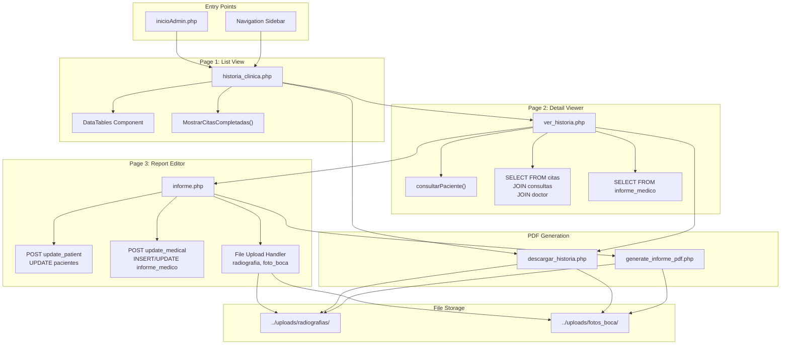
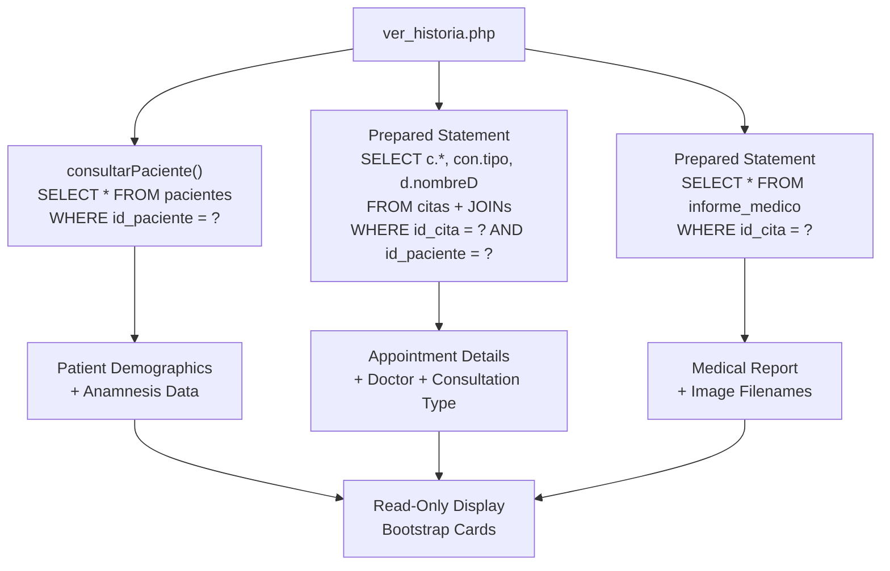
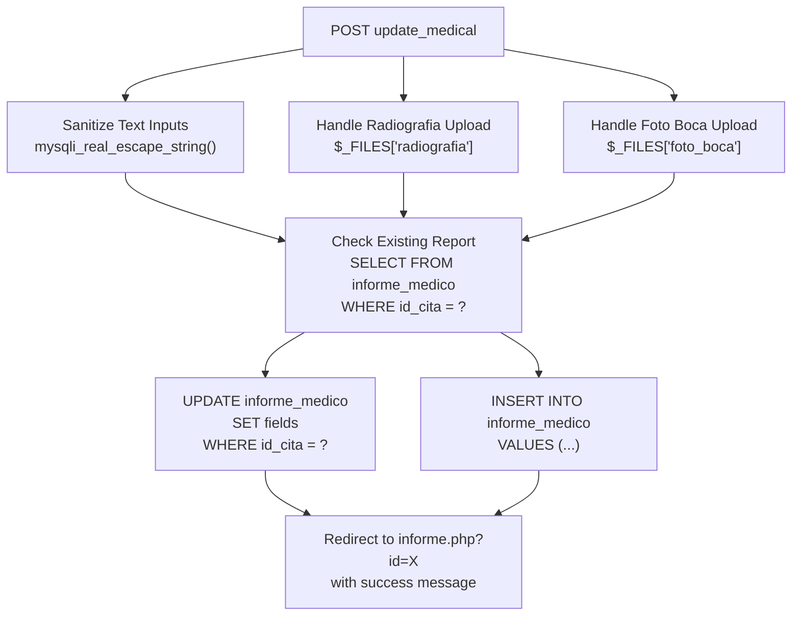
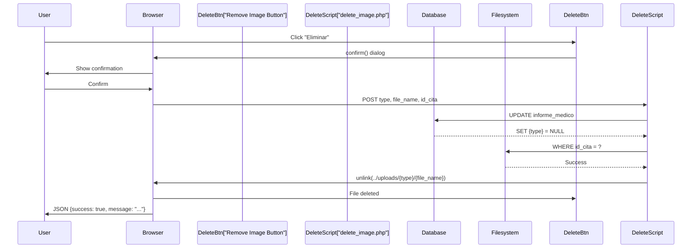
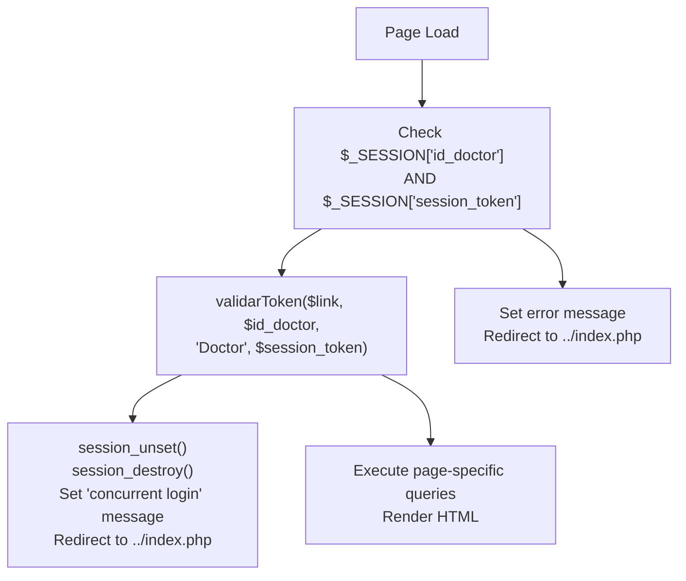

# Gestión de la Historia Clínica

> **Archivos fuente relevantes**
> * [Admin/historia_clinica.php](https://github.com/axchisan/Consultorio_Emily_Bernal/blob/589034b9/Admin/historia_clinica.php)
> * [Admin/informe.php](https://github.com/axchisan/Consultorio_Emily_Bernal/blob/589034b9/Admin/informe.php)
> * [Admin/ver_historia.php](https://github.com/axchisan/Consultorio_Emily_Bernal/blob/589034b9/Admin/ver_historia.php)

## Propósito y alcance

Este documento ofrece una descripción general del subsistema de Gestión de Historias Clínicas, que permite a los médicos consultar, editar y gestionar historiales médicos completos de pacientes en el sistema del Consultorio Emily Bernal. El subsistema implementa un flujo de trabajo de tres páginas que abarca desde el registro de citas completadas hasta la visualización detallada de historiales de pacientes y la edición de informes médicos con la carga de imágenes.

Para obtener información sobre la generación de documentos PDF a partir de historiales clínicos, consulte [el Sistema de Generación de PDF](/axchisan/Consultorio_Emily_Bernal/3-pdf-generation-system) . Para la gestión de citas y la introducción del diagnóstico inicial, consulte [el Panel de Control - Gestión de Citas](/axchisan/Consultorio_Emily_Bernal/2.1-dashboard-appointment-management) e [Interfaz de Consulta y Diagnóstico](/axchisan/Consultorio_Emily_Bernal/2.4-consultation-and-diagnosis-interface) .

**Fuentes:** [Admin/historia_clinica.php L1-L141](https://github.com/axchisan/Consultorio_Emily_Bernal/blob/589034b9/Admin/historia_clinica.php#L1-L141)

 [Admin/ver_historia.php L1-L302](https://github.com/axchisan/Consultorio_Emily_Bernal/blob/589034b9/Admin/ver_historia.php#L1-L302)

 [Admin/informe.php L1-L865](https://github.com/axchisan/Consultorio_Emily_Bernal/blob/589034b9/Admin/informe.php#L1-L865)

## Descripción general del sistema

El subsistema de Gestión de Historial Clínico consta de tres páginas PHP interconectadas que forman un flujo de trabajo progresivo:

| Página | Archivo | Función primaria | Acciones del usuario |
| --- | --- | --- | --- |
| Lista de Historia Clínica | `historia_clinica.php` | Mostrar citas completadas en una tabla de búsqueda | Buscar, filtrar, navegar a los detalles |
| Visor de historial clínico | `ver_historia.php` | Visualización de solo lectura de datos de pacientes e informes médicos | Ver datos completos, descargar PDF |
| Editor de informes médicos | `informe.php` | Editar datos demográficos, anamnesis e informes médicos del paciente. | Actualizar formularios, cargar imágenes, generar archivos PDF |

El flujo de trabajo requiere que las citas tengan `estado = 'A'`el estado "completado", que se configura mediante la interfaz de consulta. Las tres páginas implementan la validación de sesión y la autenticación basada en tokens para evitar inicios de sesión simultáneos.

**Fuentes:** [Admin/historia_clinica.php L27](https://github.com/axchisan/Consultorio_Emily_Bernal/blob/589034b9/Admin/historia_clinica.php#L27-L27)

 [Admin/ver_historia.php L25-L31](https://github.com/axchisan/Consultorio_Emily_Bernal/blob/589034b9/Admin/ver_historia.php#L25-L31)

 [Admin/informe.php L18-L24](https://github.com/axchisan/Consultorio_Emily_Bernal/blob/589034b9/Admin/informe.php#L18-L24)

## Arquitectura de flujo de trabajo de tres páginas

El siguiente diagrama ilustra cómo interactúan las tres páginas y qué datos fluyen entre ellas:



**Flujo de navegación:**

1. El médico selecciona "Historia Clínica" desde la barra lateral o el tablero
2. `historia_clinica.php`Muestra DataTable de citas completadas
3. Al hacer clic en el botón "Ver" se navega `ver_historia.php`a`?id_cita=X&id_paciente=Y`
4. Desde el visor, el médico puede descargar el PDF o navegar al editor.
5. `informe.php`Se accede con `?id=X`(solo identificación del paciente)

**Fuentes:** [Admin/historia_clinica.php L62-L66](https://github.com/axchisan/Consultorio_Emily_Bernal/blob/589034b9/Admin/historia_clinica.php#L62-L66)

 [Admin/historia_clinica.php L111-L112](https://github.com/axchisan/Consultorio_Emily_Bernal/blob/589034b9/Admin/historia_clinica.php#L111-L112)

 [Admin/ver_historia.php L26-L31](https://github.com/axchisan/Consultorio_Emily_Bernal/blob/589034b9/Admin/ver_historia.php#L26-L31)

 [Admin/informe.php L18-L24](https://github.com/axchisan/Consultorio_Emily_Bernal/blob/589034b9/Admin/informe.php#L18-L24)

## Esquema de base de datos y flujo de datos

El sistema de historia clínica interactúa con cinco tablas de bases de datos principales:

```css
#mermaid-5k50sfoy1zo{font-family:ui-sans-serif,-apple-system,system-ui,Segoe UI,Helvetica;font-size:16px;fill:#333;}@keyframes edge-animation-frame{from{stroke-dashoffset:0;}}@keyframes dash{to{stroke-dashoffset:0;}}#mermaid-5k50sfoy1zo .edge-animation-slow{stroke-dasharray:9,5!important;stroke-dashoffset:900;animation:dash 50s linear infinite;stroke-linecap:round;}#mermaid-5k50sfoy1zo .edge-animation-fast{stroke-dasharray:9,5!important;stroke-dashoffset:900;animation:dash 20s linear infinite;stroke-linecap:round;}#mermaid-5k50sfoy1zo .error-icon{fill:#dddddd;}#mermaid-5k50sfoy1zo .error-text{fill:#222222;stroke:#222222;}#mermaid-5k50sfoy1zo .edge-thickness-normal{stroke-width:1px;}#mermaid-5k50sfoy1zo .edge-thickness-thick{stroke-width:3.5px;}#mermaid-5k50sfoy1zo .edge-pattern-solid{stroke-dasharray:0;}#mermaid-5k50sfoy1zo .edge-thickness-invisible{stroke-width:0;fill:none;}#mermaid-5k50sfoy1zo .edge-pattern-dashed{stroke-dasharray:3;}#mermaid-5k50sfoy1zo .edge-pattern-dotted{stroke-dasharray:2;}#mermaid-5k50sfoy1zo .marker{fill:#999;stroke:#999;}#mermaid-5k50sfoy1zo .marker.cross{stroke:#999;}#mermaid-5k50sfoy1zo svg{font-family:ui-sans-serif,-apple-system,system-ui,Segoe UI,Helvetica;font-size:16px;}#mermaid-5k50sfoy1zo p{margin:0;}#mermaid-5k50sfoy1zo .entityBox{fill:#ffffff;stroke:#dddddd;}#mermaid-5k50sfoy1zo .relationshipLabelBox{fill:#dddddd;opacity:0.7;background-color:#dddddd;}#mermaid-5k50sfoy1zo .relationshipLabelBox rect{opacity:0.5;}#mermaid-5k50sfoy1zo .labelBkg{background-color:rgba(221, 221, 221, 0.5);}#mermaid-5k50sfoy1zo .edgeLabel .label{fill:#dddddd;font-size:14px;}#mermaid-5k50sfoy1zo .label{font-family:ui-sans-serif,-apple-system,system-ui,Segoe UI,Helvetica;color:#333;}#mermaid-5k50sfoy1zo .edge-pattern-dashed{stroke-dasharray:8,8;}#mermaid-5k50sfoy1zo .node rect,#mermaid-5k50sfoy1zo .node circle,#mermaid-5k50sfoy1zo .node ellipse,#mermaid-5k50sfoy1zo .node polygon{fill:#ffffff;stroke:#dddddd;stroke-width:1px;}#mermaid-5k50sfoy1zo .relationshipLine{stroke:#999;stroke-width:1;fill:none;}#mermaid-5k50sfoy1zo .marker{fill:none!important;stroke:#999!important;stroke-width:1;}#mermaid-5k50sfoy1zo :root{--mermaid-font-family:"trebuchet ms",verdana,arial,sans-serif;}id_pacienteid_doctorid_consultasid_citapacientesintid_pacientePKstringnombrestringapellidodatefecha_nacimientostringcorreo_electronicostringtelefonostringcedulastringsexostringepsstringocupacionstringestado_civilstringtipo_sangretextalertas_medicasenumhistoria_cardiovascularesenumhistoria_hemorragicasenumhistoria_dermatologicasenumhistoria_mentalesenumhistoria_diabetesenumhistoria_cancerenumhistoria_artritisenumhistoria_alergiasenumhistoria_cirugiastexthistoria_otrosstringemergencia_nombrestringemergencia_telefonostringmenor_acompanantestringmenor_parentescostringmenor_telefonostringlugar_direccion_residenciacitasintid_citaPKintid_pacienteFKintid_doctorFKintid_consultasFKdatefecha_citatimehora_citastringestadotextdiagnosticotextdescripciontextmedicinadoctorconsultasinforme_medicointid_informePKintid_citaFKintid_pacienteFKtextexamen_intraoraltextexamen_extraoraltextexamen_atmtextobservacion_intraoraltextobservacion_extraoral_atmtextdescripcion_radiograficatextdiagnostico_periodontaltextplan_tratamientotextpronosticotextevoluciontextdiagnosticodecimalcostostringradiografiastringfoto_boca
```

**Relaciones clave:**

* `citas`sirve como mesa de unión central
* `informe_medico`tiene una relación uno a uno con `citas`vía`id_cita`
* `pacientes`La tabla almacena tanto datos demográficos como historial médico (anamnesis)
* Los nombres de archivos de imágenes (no datos binarios) se almacenan en `informe_medico.radiografia`y`informe_medico.foto_boca`

**Fuentes:** [Admin/historia_clinica.php L27](https://github.com/axchisan/Consultorio_Emily_Bernal/blob/589034b9/Admin/historia_clinica.php#L27-L27)

 [Admin/ver_historia.php L36-L43](https://github.com/axchisan/Consultorio_Emily_Bernal/blob/589034b9/Admin/ver_historia.php#L36-L43)

 [Admin/informe.php L46-L66](https://github.com/axchisan/Consultorio_Emily_Bernal/blob/589034b9/Admin/informe.php#L46-L66)

 [Admin/informe.php L428-L434](https://github.com/axchisan/Consultorio_Emily_Bernal/blob/589034b9/Admin/informe.php#L428-L434)

## Operaciones de datos específicas de la página

### historia_clinica.php Operaciones de consulta

La vista de lista recupera las citas completadas utilizando la `MostrarCitasCompletadas()`función de `consultas.php`:

| Operación | Función/Consulta | Parámetros | Devoluciones |
| --- | --- | --- | --- |
| Obtener citas completadas | `MostrarCitasCompletadas($link, $vUsuario)` | `$link`, `$vUsuario`(identificación del médico) | Conjunto de resultados con nombre del paciente, edad y detalles de la cita. |
| Mostrar resultados | Inicialización de DataTables | Elemento de tabla`#example` | Tabla interactiva de búsqueda |

La consulta filtra por:

* `citas.id_doctor = $vUsuario`(pacientes del propio médico)
* `citas.estado = 'A'`(solo citas completadas)

**Fuentes:** [Admin/historia_clinica.php L27](https://github.com/axchisan/Consultorio_Emily_Bernal/blob/589034b9/Admin/historia_clinica.php#L27-L27)

 [Admin/historia_clinica.php L87-L122](https://github.com/axchisan/Consultorio_Emily_Bernal/blob/589034b9/Admin/historia_clinica.php#L87-L122)

### Operaciones de consulta ver_historia.php

El visor de detalles ejecuta tres consultas independientes:



Todos los datos se muestran en modo de solo lectura, sin necesidad de introducir datos en el formulario. Las imágenes se renderizan mediante ``etiquetas que apuntan al directorio de subidas.

**Fuentes:** [Admin/ver_historia.php L36-L43](https://github.com/axchisan/Consultorio_Emily_Bernal/blob/589034b9/Admin/ver_historia.php#L36-L43)

 [Admin/ver_historia.php L51-L66](https://github.com/axchisan/Consultorio_Emily_Bernal/blob/589034b9/Admin/ver_historia.php#L51-L66)

 [Admin/ver_historia.php L69-L75](https://github.com/axchisan/Consultorio_Emily_Bernal/blob/589034b9/Admin/ver_historia.php#L69-L75)

### Operaciones de actualización de informe.php

El editor de informes médicos maneja dos operaciones POST distintas:

**1. Actualización de datos del paciente ( `update_patient`)**

Se activa cuando el médico envía el formulario de información del paciente:

| Categoría de campo | Campos actualizados | Validación |
| --- | --- | --- |
| Demografía | `telefono`, `eps`, `ocupacion`, `estado_civil`, `cedula`,`sexo` | `mysqli_real_escape_string()` |
| Contacto de emergencia | `emergencia_nombre`,`emergencia_telefono` | Desinfección de cuerdas |
| Información del menor (si la edad es < 18) | `menor_acompanante`, `menor_parentesco`,`menor_telefono` | Visualización condicional |
| Médico | `tipo_sangre`, `alertas_medicas`,`lugar_direccion_residencia` | Sanitización de texto |
| Anamnesis (ENUM) | `historia_cardiovasculares`, `historia_hemorragicas`, etc. | Validado contra`['Sí', 'No']` |
| Anamnesis (Texto) | `historia_otros` | Cadena, máximo 17 caracteres |

La actualización utiliza una declaración preparada con 25 parámetros vinculados a `UPDATE pacientes WHERE id_paciente = ?`.

**Fuentes:** [Admin/informe.php L68-L171](https://github.com/axchisan/Consultorio_Emily_Bernal/blob/589034b9/Admin/informe.php#L68-L171)

 [Admin/informe.php L84-L94](https://github.com/axchisan/Consultorio_Emily_Bernal/blob/589034b9/Admin/informe.php#L84-L94)

 [Admin/informe.php L96-L158](https://github.com/axchisan/Consultorio_Emily_Bernal/blob/589034b9/Admin/informe.php#L96-L158)

**2. Actualización del informe médico ( `update_medical`)**

Se activa cuando el médico envía el formulario de informe médico:



El sistema crea consultas UPDATE de forma condicional según las imágenes que se cargaron:

* Ambas imágenes: Actualiza 14 campos incluyendo `radiografia`y`foto_boca`
* Sólo radiografía: Actualiza 13 campos incluidos`radiografia`
* Sólo foto_boca: Actualiza 13 campos incluidos`foto_boca`
* Sin imágenes: Actualiza 12 campos (solo texto)

**Fuentes:** [Admin/informe.php L174-L425](https://github.com/axchisan/Consultorio_Emily_Bernal/blob/589034b9/Admin/informe.php#L174-L425)

 [Admin/informe.php L225-L234](https://github.com/axchisan/Consultorio_Emily_Bernal/blob/589034b9/Admin/informe.php#L225-L234)

 [Admin/informe.php L237-L377](https://github.com/axchisan/Consultorio_Emily_Bernal/blob/589034b9/Admin/informe.php#L237-L377)

 [Admin/informe.php L388-L421](https://github.com/axchisan/Consultorio_Emily_Bernal/blob/589034b9/Admin/informe.php#L388-L421)

## Gestión de carga de archivos

Image uploads follow a structured pattern ensuring unique filenames and directory management:

### Upload Process Flow

| Step | Code Location | Operation |
| --- | --- | --- |
| 1. Check upload | [Admin/informe.php L192-L206](https://github.com/axchisan/Consultorio_Emily_Bernal/blob/589034b9/Admin/informe.php#L192-L206) | Verify `$_FILES['radiografia']['error'] === UPLOAD_ERR_OK` |
| 2. Validate directory | [Admin/informe.php L193-L197](https://github.com/axchisan/Consultorio_Emily_Bernal/blob/589034b9/Admin/informe.php#L193-L197) | Check `is_dir()`, create with `mkdir($path, 0777, true)` if needed |
| 3. Generate filename | [Admin/informe.php L198](https://github.com/axchisan/Consultorio_Emily_Bernal/blob/589034b9/Admin/informe.php#L198-L198) | Pattern: `{patient_id}_{type}_{timestamp}.{ext}` |
| 4. Move file | [Admin/informe.php L199](https://github.com/axchisan/Consultorio_Emily_Bernal/blob/589034b9/Admin/informe.php#L199-L199) | `move_uploaded_file($tmp_name, $destination)` |
| 5. Store reference | [Admin/informe.php L203](https://github.com/axchisan/Consultorio_Emily_Bernal/blob/589034b9/Admin/informe.php#L203-L203) | Assign filename to `$radiografia` or `$foto_boca` variable |
| 6. Update database | [Admin/informe.php L238-L377](https://github.com/axchisan/Consultorio_Emily_Bernal/blob/589034b9/Admin/informe.php#L238-L377) | INSERT or UPDATE with filename in appropriate field |

**Directory Structure:**

```
../uploads/
├── radiografias/
│   └── {patient_id}_radiografia_{timestamp}.{ext}
└── fotos_boca/
    └── {patient_id}_boca_{timestamp}.{ext}
```

### Image Deletion via AJAX

The editor page includes JavaScript to delete images asynchronously:



The deletion handler at `delete_image.php` (referenced but not provided in files) receives three parameters:

* `type`: Either "radiografia" or "foto_boca"
* `file_name`: The filename to delete
* `id_cita`: The appointment ID for database update

**Sources:** [Admin/informe.php L829-L860](https://github.com/axchisan/Consultorio_Emily_Bernal/blob/589034b9/Admin/informe.php#L829-L860)

 [Admin/informe.php L734-L739](https://github.com/axchisan/Consultorio_Emily_Bernal/blob/589034b9/Admin/informe.php#L734-L739)

 [Admin/informe.php L748-L753](https://github.com/axchisan/Consultorio_Emily_Bernal/blob/589034b9/Admin/informe.php#L748-L753)

## Security and Session Management

All three pages implement identical security patterns:

### Session Validation Pattern



**Key Security Features:**

* Session start at top of each file: [Admin/historia_clinica.php L2](https://github.com/axchisan/Consultorio_Emily_Bernal/blob/589034b9/Admin/historia_clinica.php#L2-L2)  [Admin/ver_historia.php L2](https://github.com/axchisan/Consultorio_Emily_Bernal/blob/589034b9/Admin/ver_historia.php#L2-L2)  [Admin/informe.php L3-L5](https://github.com/axchisan/Consultorio_Emily_Bernal/blob/589034b9/Admin/informe.php#L3-L5)
* Session validation: [Admin/historia_clinica.php L7-L24](https://github.com/axchisan/Consultorio_Emily_Bernal/blob/589034b9/Admin/historia_clinica.php#L7-L24)  [Admin/ver_historia.php L7-L23](https://github.com/axchisan/Consultorio_Emily_Bernal/blob/589034b9/Admin/ver_historia.php#L7-L23)
* Token validation via `validarToken()`: [Admin/historia_clinica.php L17](https://github.com/axchisan/Consultorio_Emily_Bernal/blob/589034b9/Admin/historia_clinica.php#L17-L17)  [Admin/ver_historia.php L16](https://github.com/axchisan/Consultorio_Emily_Bernal/blob/589034b9/Admin/ver_historia.php#L16-L16)
* SQL injection prevention via prepared statements: [Admin/ver_historia.php L56-L58](https://github.com/axchisan/Consultorio_Emily_Bernal/blob/589034b9/Admin/ver_historia.php#L56-L58)  [Admin/informe.php L53-L56](https://github.com/axchisan/Consultorio_Emily_Bernal/blob/589034b9/Admin/informe.php#L53-L56)
* Input sanitization: [Admin/informe.php L69-L82](https://github.com/axchisan/Consultorio_Emily_Bernal/blob/589034b9/Admin/informe.php#L69-L82)  [Admin/informe.php L175-L186](https://github.com/axchisan/Consultorio_Emily_Bernal/blob/589034b9/Admin/informe.php#L175-L186)

The `validarToken()` function (from `consultas.php`) prevents concurrent logins by verifying the session token in `$_SESSION` matches the token stored in the `doctor` table. If tokens mismatch, the session is destroyed and the user is redirected to login.

**Sources:** [Admin/historia_clinica.php L6-L24](https://github.com/axchisan/Consultorio_Emily_Bernal/blob/589034b9/Admin/historia_clinica.php#L6-L24)

 [Admin/ver_historia.php L6-L23](https://github.com/axchisan/Consultorio_Emily_Bernal/blob/589034b9/Admin/ver_historia.php#L6-L23)

 [Admin/informe.php L10-L16](https://github.com/axchisan/Consultorio_Emily_Bernal/blob/589034b9/Admin/informe.php#L10-L16)

## Integration with Other Subsystems

### PDF Generation Integration

Both the list view and detail viewer provide PDF download functionality:

| Source Page | PDF Generator | POST Parameters | Output |
| --- | --- | --- | --- |
| `historia_clinica.php` | `descargar_historia.php` | `id_cita`, `id_paciente` | Comprehensive clinical history PDF |
| `ver_historia.php` | `descargar_historia.php` | `id_cita`, `id_paciente` | Same comprehensive PDF |
| `informe.php` | `generate_informe_pdf.php` | `patient_id` | Focused medical report PDF |

The PDF buttons use form POST submissions rather than GET links to avoid exposing patient IDs in URLs.

**Sources:** [Admin/historia_clinica.php L113-L117](https://github.com/axchisan/Consultorio_Emily_Bernal/blob/589034b9/Admin/historia_clinica.php#L113-L117)

 [Admin/ver_historia.php L283-L289](https://github.com/axchisan/Consultorio_Emily_Bernal/blob/589034b9/Admin/ver_historia.php#L283-L289)

 [Admin/informe.php L773-L778](https://github.com/axchisan/Consultorio_Emily_Bernal/blob/589034b9/Admin/informe.php#L773-L778)

### DataTables Integration

The list view uses DataTables library for enhanced table functionality:

**JavaScript Dependencies:**

* [Admin/historia_clinica.php L136](https://github.com/axchisan/Consultorio_Emily_Bernal/blob/589034b9/Admin/historia_clinica.php#L136-L136) : `jquery-3.5.1.js`
* [Admin/historia_clinica.php L137](https://github.com/axchisan/Consultorio_Emily_Bernal/blob/589034b9/Admin/historia_clinica.php#L137-L137) : `jquery.dataTables.min.js`
* [Admin/historia_clinica.php L138](https://github.com/axchisan/Consultorio_Emily_Bernal/blob/589034b9/Admin/historia_clinica.php#L138-L138) : `dataTables.responsive.min.js`
* [Admin/historia_clinica.php L139](https://github.com/axchisan/Consultorio_Emily_Bernal/blob/589034b9/Admin/historia_clinica.php#L139-L139) : `datatable.js` (custom initialization)

**Table Configuration:**

* Table ID: `#example`
* Columns: Patient name, age, consultation type, date, time, status, diagnosis, actions
* Features: Search, sort, pagination, responsive layout

**Sources:** [Admin/historia_clinica.php L87-L122](https://github.com/axchisan/Consultorio_Emily_Bernal/blob/589034b9/Admin/historia_clinica.php#L87-L122)

 [Admin/historia_clinica.php L136-L139](https://github.com/axchisan/Consultorio_Emily_Bernal/blob/589034b9/Admin/historia_clinica.php#L136-L139)

## User Interface Components

### Sidebar Navigation

All three pages render identical sidebar menus with active state indication:

```xml
<li><a href="inicioAdmin.php">Citas</a></li>
<li><a href="doctores.php">Dentistas</a></li>
<li><a href="calendar.php">Calendario</a></li>
<li class="active"><a href="historia_clinica.php">Historia Clínica</a></li>
<li><a href="../php/cerrar.php">Cerrar sesión</a></li>
```

The `active` class is dynamically assigned to the current page for visual indication.

**Sources:** [Admin/historia_clinica.php L62-L68](https://github.com/axchisan/Consultorio_Emily_Bernal/blob/589034b9/Admin/historia_clinica.php#L62-L68)

 [Admin/ver_historia.php L110-L117](https://github.com/axchisan/Consultorio_Emily_Bernal/blob/589034b9/Admin/ver_historia.php#L110-L117)

 [Admin/informe.php L475-L481](https://github.com/axchisan/Consultorio_Emily_Bernal/blob/589034b9/Admin/informe.php#L475-L481)

### Bootstrap Card Layout

Patient information is organized into collapsible card components:

| Card | Header Icon | Content | Page(s) |
| --- | --- | --- | --- |
| Información General | `fa-user` | Demographics, contact info | All three |
| Anamnesis | `fa-heartbeat` | Medical history table (Sí/No) | `ver_historia.php`, `informe.php` |
| Información de la Cita | `fa-calendar-check` | Appointment details | `ver_historia.php`, `informe.php` |
| Informe Médico | `fa-notes-medical` | Clinical findings, images | All three |

The editor page uses form inputs while the viewer page displays static content.

**Sources:** [Admin/ver_historia.php L134-L279](https://github.com/axchisan/Consultorio_Emily_Bernal/blob/589034b9/Admin/ver_historia.php#L134-L279)

 [Admin/informe.php L510-L780](https://github.com/axchisan/Consultorio_Emily_Bernal/blob/589034b9/Admin/informe.php#L510-L780)

### Flash Message System

All pages implement the session-based messaging pattern:

```php
<?php if (isset($_SESSION['MensajeTexto'])) { ?>
    <div class="alert <?php echo htmlspecialchars($_SESSION['MensajeTipo']); ?>" role="alert">
        <?php echo htmlspecialchars($_SESSION['MensajeTexto']); ?>
        <button class="delete"><i class="fa fa-times"></i></button>
    </div>
    <?php
    $_SESSION['MensajeTexto'] = null;
    $_SESSION['MensajeTipo'] = null;
    ?>
<?php } ?>
```

Los mensajes se configuran en las operaciones POST (actualizar paciente, actualizar informe médico) y se muestran tras la redirección, implementando el patrón Post-Redirect-Get. `MensajeTipo`Utiliza clases de alerta de Bootstrap como `bg-success`o `bg-danger`.

**Fuentes:** [Admin/informe.php L497-L506](https://github.com/axchisan/Consultorio_Emily_Bernal/blob/589034b9/Admin/informe.php#L497-L506)

 [Admin/informe.php L161-L162](https://github.com/axchisan/Consultorio_Emily_Bernal/blob/589034b9/Admin/informe.php#L161-L162)

 [Admin/informe.php L380-L381](https://github.com/axchisan/Consultorio_Emily_Bernal/blob/589034b9/Admin/informe.php#L380-L381)