# Gestión de médicos

> **Archivos fuente relevantes**
> * [Admin/doctores.php](https://github.com/axchisan/Consultorio_Emily_Bernal/blob/589034b9/Admin/doctores.php)

## Propósito y alcance

El sistema de Gestión de Médicos proporciona la interfaz administrativa para agregar nuevos dentistas al sistema de la clínica. Esta página, implementada en[Admin/doctores.php](https://github.com/axchisan/Consultorio_Emily_Bernal/blob/589034b9/Admin/doctores.php)

Permite a los usuarios autorizados registrar nuevos odontólogos con su información personal, credenciales y especialidades asignadas. La página aplica autenticación basada en sesión y se integra con la capa de operaciones CRUD más amplia para la persistencia de datos.

Este documento cubre únicamente la interfaz de registro de médicos. Para obtener información sobre el flujo de trabajo de consulta y diagnóstico donde los médicos interactúan con los pacientes, consulte [Interfaz de consulta y diagnóstico](/axchisan/Consultorio_Emily_Bernal/2.4-consultation-and-diagnosis-interface) . Para conocer los mecanismos de autenticación, incluida la validación de tokens de sesión, consulte [Sistema](/axchisan/Consultorio_Emily_Bernal/5.2-token-validation-system)[de gestión de sesiones](/axchisan/Consultorio_Emily_Bernal/5.1-session-management) y validación de tokens .[/axchisan/Consultorio_Emily_Bernal/5.2-token-validation-system](/axchisan/Consultorio_Emily_Bernal/5.2-token-validation-system)

---

## Descripción general de la página

Esta `doctores.php`página sirve como interfaz dedicada al registro de médicos dentro del sistema administrativo. A diferencia de otras páginas administrativas que muestran tablas de datos, esta página se centra exclusivamente en un único formulario para agregar nuevos registros de dentistas.

**Características principales:**

* Formulario de registro de propósito único
* Acceso administrativo protegido por sesión
* Integración con catálogo de especialidades
* Validación de confirmación de contraseña
* Diseño de navegación de la barra lateral estándar
* Componentes de formulario con estilo Bootstrap

La página sigue el patrón arquitectónico estándar utilizado en toda la interfaz de administración: validación de sesión, inicialización de conexión a la base de datos, ejecución de consultas para datos de soporte y representación HTML con PHP integrado para contenido dinámico.

**Fuentes:** [Admin/doctores.php L1-L192](https://github.com/axchisan/Consultorio_Emily_Bernal/blob/589034b9/Admin/doctores.php#L1-L192)

---

## Validación de sesiones y control de acceso

La página implementa una verificación de autenticación de dos niveles durante la inicialización para garantizar que solo los administradores autenticados puedan acceder a la interfaz de administración de médicos.

### Flujo de autenticación

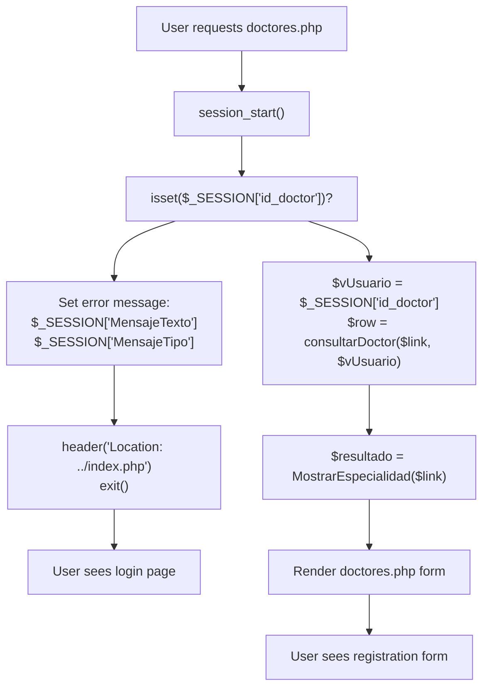

### Variables de sesión utilizadas

| Variable | Tipo | Objetivo |
| --- | --- | --- |
| `$_SESSION['id_doctor']` | Entero | ID del médico que ha iniciado sesión actualmente |
| `$_SESSION['MensajeTexto']` | Cadena | Contenido del mensaje Flash |
| `$_SESSION['MensajeTipo']` | Cadena | Clase CSS de Bootstrap para el estilo de los mensajes |

La comprobación de la sesión se produce en[Admin/doctores.php L7-L12](https://github.com/axchisan/Consultorio_Emily_Bernal/blob/589034b9/Admin/doctores.php#L7-L12)

La falta de datos de sesión activa una redirección inmediata a la página de inicio de sesión con un mensaje de error establecido en la sesión. Esto implementa el patrón Post-Redirect-Get para la transmisión segura de mensajes.

**Fuentes:** [Admin/doctores.php L2-L17](https://github.com/axchisan/Consultorio_Emily_Bernal/blob/589034b9/Admin/doctores.php#L2-L17)

---

## Inicialización de consultas de base de datos

Antes de representar el formulario, la página ejecuta dos consultas de base de datos para completar el contenido dinámico:

### Operaciones de consulta

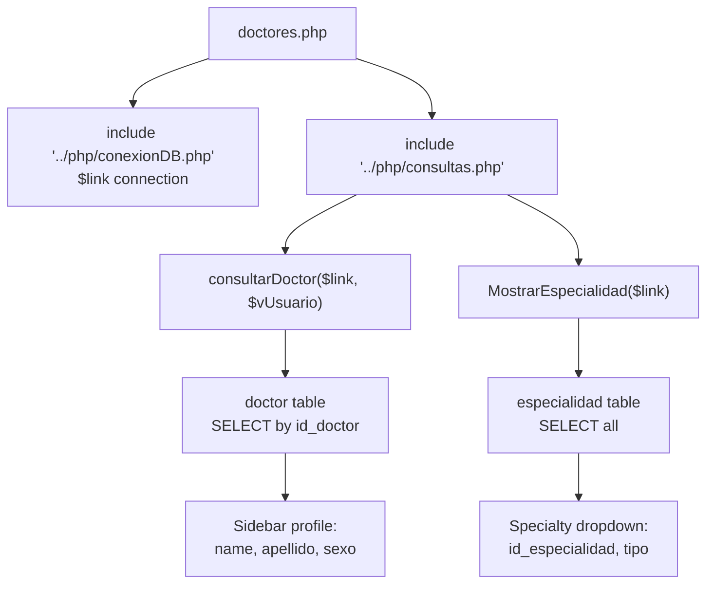

| Función | Objetivo | Valor de retorno |
| --- | --- | --- |
| `consultarDoctor($link, $vUsuario)` | Recuperar los datos del perfil del médico que ha iniciado sesión | Matriz asociativa con campos de doctor |
| `MostrarEspecialidad($link)` | Obtenga todas las especialidades disponibles | mysqli_result para la iteración |

El `consultarDoctor()`resultado se utiliza para completar la visualización del perfil de la barra lateral.[Admin/doctores.php L60-L66](https://github.com/axchisan/Consultorio_Emily_Bernal/blob/589034b9/Admin/doctores.php#L60-L66)

Muestra el nombre del médico y un avatar apropiado para su género. El `MostrarEspecialidad()`resultado completa el menú desplegable de especialidades.[Admin/doctores.php L151-L153](https://github.com/axchisan/Consultorio_Emily_Bernal/blob/589034b9/Admin/doctores.php#L151-L153)

**Fuentes:** [Admin/doctores.php L3-L16](https://github.com/axchisan/Consultorio_Emily_Bernal/blob/589034b9/Admin/doctores.php#L3-L16)

---

## Estructura del formulario y campos de entrada

El formulario de registro recoge nueve piezas de información distintas sobre el nuevo dentista, organizadas en tres secciones lógicas.

### Diagrama de componentes del formulario

```mermaid
flowchart TD

Form["<form action='../crud/registro_INSERT.php?opciones=INSDOCT'>"]
Section1["Personal Information"]
Section2["Credentials"]
Section3["Professional Details"]
F1["name<br>text, required"]
F2["apellido<br>text, required"]
F3["nacimiento<br>date, required"]
F4["correo<br>email, required"]
F5["clave<br>password, required"]
F6["clave2<br>password, required"]
F7["sexo<br>select: Masculino/Femenino"]
F8["especialidad<br>select: from DB"]
F9["cell<br>text, optional"]
Submit["<button type='submit' name='guardar'>"]

Form --> Section1
Form --> Section2
Form --> Section3
Section1 --> F1
Section1 --> F2
Section1 --> F3
Section2 --> F4
Section2 --> F5
Section2 --> F6
Section3 --> F7
Section3 --> F8
Section3 --> F9
Form --> Submit
```

### Especificaciones de campo

| Nombre del campo | Tipo de entrada HTML | Validación | Columna de base de datos | Notas |
| --- | --- | --- | --- | --- |
| `name` | texto | requerido | `nombreD` | Nombre del doctor |
| `apellido` | texto | requerido | `apellido` | Apellido del doctor |
| `nacimiento` | fecha | requerido | `fecha_nacimiento` | Fecha de nacimiento |
| `correo` | correo electrónico | requerido | `correo_electronico` | Identificador de inicio de sesión único |
| `clave` | contraseña | requerido | `password` | Se procesará antes del almacenamiento. |
| `clave2` | contraseña | requerido | N / A | Solo confirmación del lado del cliente |
| `sexo` | seleccionar | requerido | `sexo` | Masculino o Femenino |
| `especialidad` | seleccionar | requerido | `id_especialidad` | Clave externa a la tabla de especialidad |
| `cell` | texto | opcional | `telefono` | Número de teléfono de contacto |

El formulario se envía `../crud/registro_INSERT.php`con el parámetro de consulta `opciones=INSDOCT`, que indica al controlador CRUD que ejecute la lógica de inserción del doctor. El formulario usa `method="POST"`e incluye`enctype="multipart/form-data"` [Admin/doctores.php L105](https://github.com/axchisan/Consultorio_Emily_Bernal/blob/589034b9/Admin/doctores.php#L105-L105)

Aunque en realidad no se implementan cargas de archivos en esta interfaz.

**Fuentes:** [Admin/doctores.php L105-L165](https://github.com/axchisan/Consultorio_Emily_Bernal/blob/589034b9/Admin/doctores.php#L105-L165)

---

## Flujo de envío de formularios

Cuando el usuario envía el formulario, los datos fluyen a través de la capa CRUD para su validación e inserción en la base de datos.

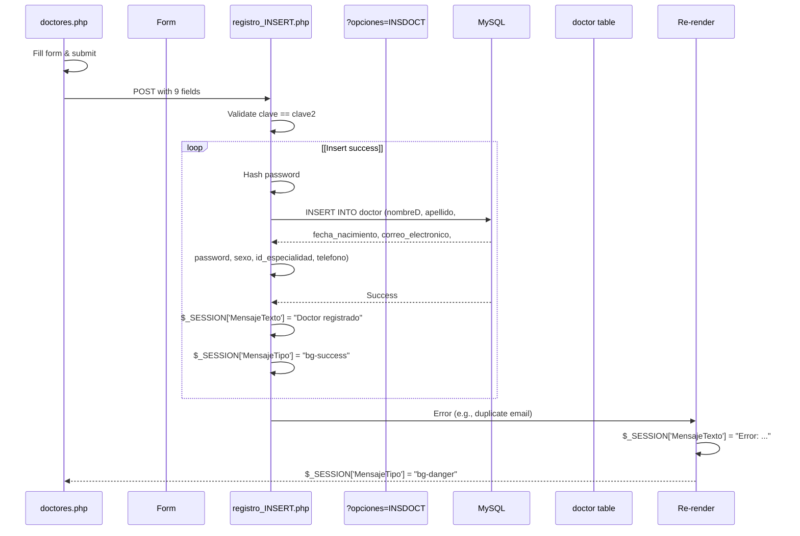

### Detalles del controlador CRUD

El `registro_INSERT.php`archivo procesa el formulario en función del `opciones`parámetro de consulta:

* **Valor del parámetro:** `INSDOCT` (INSERTAR DOCTOR)
* **Lógica de procesamiento:** Verificación de confirmación de contraseña → Hashing de contraseña → Inserción en base de datos
* **Método de respuesta:** Patrón Post-Redirect-Get con mensajes de sesión

La lógica de inserción de la base de datos se encapsula en la capa CRUD y no es visible directamente en `doctores.php`. La página simplemente recibe la redirección con mensajes de éxito o error almacenados en variables de sesión.

**Fuentes:** [Admin/doctores.php L105](https://github.com/axchisan/Consultorio_Emily_Bernal/blob/589034b9/Admin/doctores.php#L105-L105)

---

## Sistema de mensajería Flash

The page implements two separate flash message display mechanisms: one at the top of the page before the HTML structure, and another within the form area.

### Message Display Locations

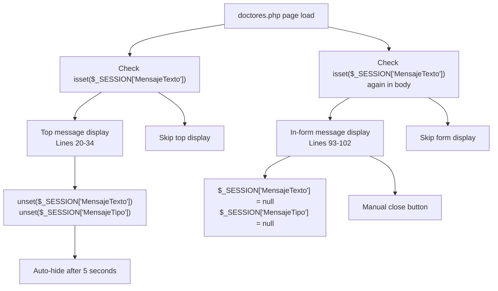

### Message Types and Styling

| Session Value | CSS Class | Bootstrap Styling | Use Case |
| --- | --- | --- | --- |
| `p-3 mb-2 bg-danger text-white` | Alert error | Red background, white text | Authentication failures, validation errors |
| `p-3 mb-2 bg-success text-white` | Alert success | Green background, white text | Successful doctor registration |
| `alert bg-danger` | Alert error (in-form) | Red alert box | Form submission errors |
| `alert bg-success` | Alert success (in-form) | Green alert box | Form submission success |

The top-level message [Admin/doctores.php L20-L34](https://github.com/axchisan/Consultorio_Emily_Bernal/blob/589034b9/Admin/doctores.php#L20-L34)

 uses a simple `<div>` with inline CSS classes and auto-hides after 5 seconds via JavaScript timeout. The in-form message [Admin/doctores.php L93-L102](https://github.com/axchisan/Consultorio_Emily_Bernal/blob/589034b9/Admin/doctores.php#L93-L102)

 uses Bootstrap alert styling with a manual close button, implementing the delete button handler via vanilla JavaScript [Admin/doctores.php L182-L189](https://github.com/axchisan/Consultorio_Emily_Bernal/blob/589034b9/Admin/doctores.php#L182-L189)

**Sources:** [Admin/doctores.php L20-L189](https://github.com/axchisan/Consultorio_Emily_Bernal/blob/589034b9/Admin/doctores.php#L20-L189)

---

## Sidebar Profile Display

The sidebar navigation follows the standard pattern used across all admin pages, with dynamic content population based on the logged-in doctor's profile.

### Profile Data Binding

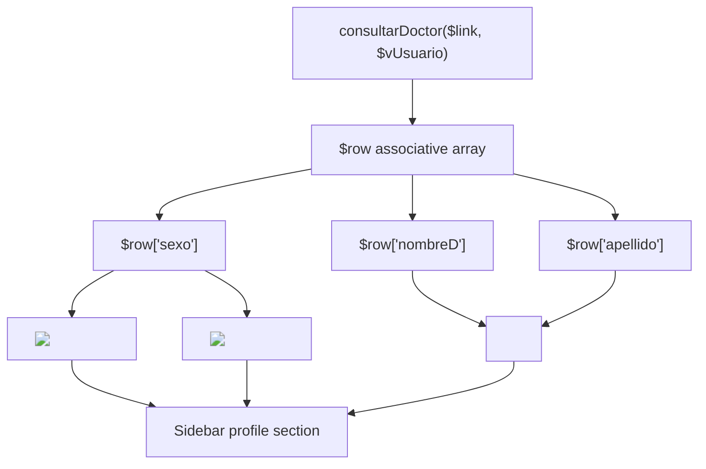

The gender-based avatar selection occurs at [Admin/doctores.php L60-L64](https://github.com/axchisan/Consultorio_Emily_Bernal/blob/589034b9/Admin/doctores.php#L60-L64)

 using conditional logic to display different images:

* **Masculine:** `../src/img/odontologo.png`
* **Feminine:** `../src/img/odontologa.png`

The doctor's full name is displayed using `utf8_decode()` [Admin/doctores.php L65](https://github.com/axchisan/Consultorio_Emily_Bernal/blob/589034b9/Admin/doctores.php#L65-L65)

 to handle special characters in Spanish names. This suggests the database stores data in UTF-8 encoding, but the page renders in a different encoding (likely ISO-8859-1).

**Navigation Menu Items:**

| Link | Icon | Active State |
| --- | --- | --- |
| `inicioAdmin.php` | `fa-calendar-check` | No |
| `doctores.php` | `fa-user-md` | **Yes** (class="active") |
| `calendar.php` | `fa-calendar-alt` | No |
| `historia_clinica.php` | `fa-calendar-alt` | No |
| `../php/cerrar.php` | `fa-sign-out-alt` | No |

The active state styling is applied at [Admin/doctores.php L71](https://github.com/axchisan/Consultorio_Emily_Bernal/blob/589034b9/Admin/doctores.php#L71-L71)

 with the `class="active"` attribute, providing visual feedback that the user is currently on the doctor management page.

**Sources:** [Admin/doctores.php L52-L78](https://github.com/axchisan/Consultorio_Emily_Bernal/blob/589034b9/Admin/doctores.php#L52-L78)

---

## Specialty Dropdown Population

The specialty selection dropdown is dynamically populated from the `especialidad` database table using the `MostrarEspecialidad()` query function.

### Dropdown Generation Logic

```mermaid
flowchart TD

Query["MostrarEspecialidad($link)"]
Result["$resultado mysqli_result"]
Loop["while loop<br>mysqli_fetch_array()"]
Row["$row['id_especialidad']"]
Row2["$row['tipo']"]
OptionValue["<option value='...'>"]
OptionText["Option display text"]
Option["Complete <option> element"]
Dropdown["<select name='especialidad'>"]

Query --> Result
Result --> Loop
Loop --> Row
Loop --> Row2
Row --> OptionValue
Row2 --> OptionText
OptionValue --> Option
OptionText --> Option
Option --> Dropdown
```

**Code Implementation:**

```php
<select class="form-control" name="especialidad" id="especialidad" required>
    <?php while ($row = mysqli_fetch_array($resultado, MYSQLI_ASSOC)) { ?>
        <option value="<?php echo $row['id_especialidad']; ?>">
            <?php echo $row['tipo']; ?>
        </option>
    <?php } ?>
</select>
```

The loop at [Admin/doctores.php L151-L153](https://github.com/axchisan/Consultorio_Emily_Bernal/blob/589034b9/Admin/doctores.php#L151-L153)

 iterates over all rows in the `especialidad` table, creating one `<option>` element per specialty. The `value` attribute contains the foreign key `id_especialidad`, while the displayed text shows the `tipo` field (e.g., "Ortodoncia", "Endodoncia", "Periodoncia").

**Database Relationship:**

* **Source Table:** `especialidad` (id_especialidad PK, tipo)
* **Target Table:** `doctor` (id_especialidad FK)
* **Query Function:** `MostrarEspecialidad($link)` in `consultas.php`

**Sources:** [Admin/doctores.php L16-L154](https://github.com/axchisan/Consultorio_Emily_Bernal/blob/589034b9/Admin/doctores.php#L16-L154)

---

## Form Validation Strategy

The page implements a hybrid validation approach using both HTML5 client-side validation and server-side validation in the CRUD layer.

### Validation Layers

| Validation Type | Implementation Location | Fields Validated | Method |
| --- | --- | --- | --- |
| **Client-side (HTML5)** | Form input attributes | All required fields | `required` attribute [Admin/doctores.php L111-L150](https://github.com/axchisan/Consultorio_Emily_Bernal/blob/589034b9/Admin/doctores.php#L111-L150) |
| **Client-side (HTML5)** | Email field | `correo` | `type="email"` [Admin/doctores.php L127](https://github.com/axchisan/Consultorio_Emily_Bernal/blob/589034b9/Admin/doctores.php#L127-L127) |
| **Server-side** | `registro_INSERT.php` | Password confirmation | PHP comparison logic |
| **Server-side** | Database constraints | Email uniqueness | UNIQUE constraint on `correo_electronico` |
| **Server-side** | Database constraints | Foreign key validity | FK constraint on `id_especialidad` |

### Password Confirmation

The form includes two password fields (`clave` and `clave2`) at [Admin/doctores.php L131-L135](https://github.com/axchisan/Consultorio_Emily_Bernal/blob/589034b9/Admin/doctores.php#L131-L135)

 but the confirmation logic is not visible in `doctores.php`. The validation occurs in `registro_INSERT.php`, which compares the two values and sets an error message if they don't match.

**Security Note:** Passwords are transmitted in plain text over POST but should be hashed before database storage. The hashing logic is handled by `registro_INSERT.php` and is not visible in the form page.

**Sources:** [Admin/doctores.php L111-L158](https://github.com/axchisan/Consultorio_Emily_Bernal/blob/589034b9/Admin/doctores.php#L111-L158)

---

## UI Components and Styling

The page leverages Bootstrap 4 components and custom CSS for consistent styling with the rest of the administrative interface.

### CSS Dependencies

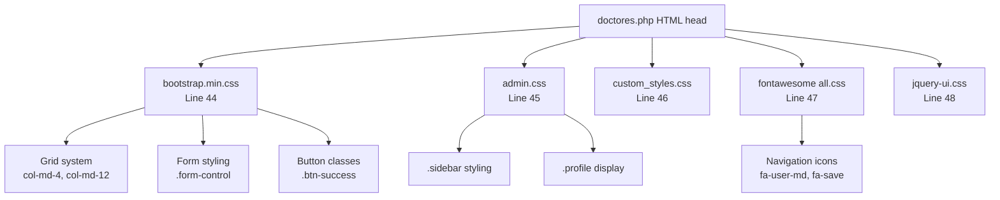

### Layout Structure

The page uses a two-column layout with a fixed sidebar and scrollable main content area:

| Component | CSS Classes | Purpose |
| --- | --- | --- |
| Sidebar | `.sidebar`, `.side-inner` | Left navigation panel |
| Main Content | `.bg.bg-white` | Right content area |
| Form Container | `.container`, `.row`, `.col-md-12` | Content wrapper |
| Breadcrumb | `.breadcrumb.bg-white` | Navigation path |
| Panel | `.content-box-large`, `.panel-body` | Form container |

The form itself uses Bootstrap's grid system with three-column rows [Admin/doctores.php L109-L160](https://github.com/axchisan/Consultorio_Emily_Bernal/blob/589034b9/Admin/doctores.php#L109-L160)

 organizing inputs into logical groups:

* **Row 1:** Nombres, Apellidos, Fecha de nacimiento (`.col-md-4` each)
* **Row 2:** Correo, Contraseña, Confirmar Contraseña (`.col-md-4` each)
* **Row 3:** Sexo, Especialidad, Teléfono (`.col-md-4` each)

**Sources:** [Admin/doctores.php L44-L173](https://github.com/axchisan/Consultorio_Emily_Bernal/blob/589034b9/Admin/doctores.php#L44-L173)

---

## JavaScript Dependencies

The page includes multiple JavaScript libraries for enhanced functionality, though most features remain unused in this specific interface.

### Script Loading Order

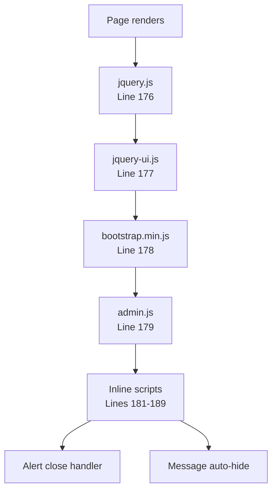

### Active JavaScript Features

| Feature | Implementation | Purpose |
| --- | --- | --- |
| **Message Auto-hide** | `setTimeout()` [Admin/doctores.php L30-L32](https://github.com/axchisan/Consultorio_Emily_Bernal/blob/589034b9/Admin/doctores.php#L30-L32) | Hide top message after 5 seconds |
| **Alert Dismissal** | Event listener [Admin/doctores.php L182-L189](https://github.com/axchisan/Consultorio_Emily_Bernal/blob/589034b9/Admin/doctores.php#L182-L189) | Close alert on button click |

The jQuery UI library is loaded [Admin/doctores.php L177](https://github.com/axchisan/Consultorio_Emily_Bernal/blob/589034b9/Admin/doctores.php#L177-L177)

 but not actively used in this page. It's likely included for consistency with other admin pages that use UI components like date pickers or autocomplete.

**Sources:** [Admin/doctores.php L176-L190](https://github.com/axchisan/Consultorio_Emily_Bernal/blob/589034b9/Admin/doctores.php#L176-L190)

---

## Database Entity Relationships

The doctor registration process interacts with two primary database tables and establishes foreign key relationships.

```css
#mermaid-8vizlddsu67{font-family:ui-sans-serif,-apple-system,system-ui,Segoe UI,Helvetica;font-size:16px;fill:#333;}@keyframes edge-animation-frame{from{stroke-dashoffset:0;}}@keyframes dash{to{stroke-dashoffset:0;}}#mermaid-8vizlddsu67 .edge-animation-slow{stroke-dasharray:9,5!important;stroke-dashoffset:900;animation:dash 50s linear infinite;stroke-linecap:round;}#mermaid-8vizlddsu67 .edge-animation-fast{stroke-dasharray:9,5!important;stroke-dashoffset:900;animation:dash 20s linear infinite;stroke-linecap:round;}#mermaid-8vizlddsu67 .error-icon{fill:#dddddd;}#mermaid-8vizlddsu67 .error-text{fill:#222222;stroke:#222222;}#mermaid-8vizlddsu67 .edge-thickness-normal{stroke-width:1px;}#mermaid-8vizlddsu67 .edge-thickness-thick{stroke-width:3.5px;}#mermaid-8vizlddsu67 .edge-pattern-solid{stroke-dasharray:0;}#mermaid-8vizlddsu67 .edge-thickness-invisible{stroke-width:0;fill:none;}#mermaid-8vizlddsu67 .edge-pattern-dashed{stroke-dasharray:3;}#mermaid-8vizlddsu67 .edge-pattern-dotted{stroke-dasharray:2;}#mermaid-8vizlddsu67 .marker{fill:#999;stroke:#999;}#mermaid-8vizlddsu67 .marker.cross{stroke:#999;}#mermaid-8vizlddsu67 svg{font-family:ui-sans-serif,-apple-system,system-ui,Segoe UI,Helvetica;font-size:16px;}#mermaid-8vizlddsu67 p{margin:0;}#mermaid-8vizlddsu67 .entityBox{fill:#ffffff;stroke:#dddddd;}#mermaid-8vizlddsu67 .relationshipLabelBox{fill:#dddddd;opacity:0.7;background-color:#dddddd;}#mermaid-8vizlddsu67 .relationshipLabelBox rect{opacity:0.5;}#mermaid-8vizlddsu67 .labelBkg{background-color:rgba(221, 221, 221, 0.5);}#mermaid-8vizlddsu67 .edgeLabel .label{fill:#dddddd;font-size:14px;}#mermaid-8vizlddsu67 .label{font-family:ui-sans-serif,-apple-system,system-ui,Segoe UI,Helvetica;color:#333;}#mermaid-8vizlddsu67 .edge-pattern-dashed{stroke-dasharray:8,8;}#mermaid-8vizlddsu67 .node rect,#mermaid-8vizlddsu67 .node circle,#mermaid-8vizlddsu67 .node ellipse,#mermaid-8vizlddsu67 .node polygon{fill:#ffffff;stroke:#dddddd;stroke-width:1px;}#mermaid-8vizlddsu67 .relationshipLine{stroke:#999;stroke-width:1;fill:none;}#mermaid-8vizlddsu67 .marker{fill:none!important;stroke:#999!important;stroke-width:1;}#mermaid-8vizlddsu67 :root{--mermaid-font-family:"trebuchet ms",verdana,arial,sans-serif;}performshascategorizesdoctorintid_doctorPKstringnombreDstringapellidostringsexodatefecha_nacimientostringcorreo_electronicostringpasswordstringtelefonointid_especialidadFKstringsession_tokencitasintid_citaPKintid_doctorFKintid_pacienteFKdatefecha_citaunavailable_datesintidPKintid_doctorFKdateunavailable_dateespecialidadintid_especialidadPKstringtipo
```

### Field Mapping: Form to Database

| Form Field | POST Variable | Database Column | Data Type | Constraints |
| --- | --- | --- | --- | --- |
| Nombres | `name` | `nombreD` | VARCHAR | NOT NULL |
| Apellidos | `apellido` | `apellido` | VARCHAR | NOT NULL |
| Fecha de nacimiento | `nacimiento` | `fecha_nacimiento` | DATE | NOT NULL |
| Correo electrónico | `correo` | `correo_electronico` | VARCHAR | UNIQUE, NOT NULL |
| Contraseña | `clave` | `password` | VARCHAR (hashed) | NOT NULL |
| Sexo | `sexo` | `sexo` | ENUM | 'Masculino', 'Femenino' |
| Especialidad | `especialidad` | `id_especialidad` | INT | FK to especialidad.id_especialidad |
| Teléfono | `cell` | `telefono` | VARCHAR | NULL allowed |

**Initial Values for New Doctors:**

* `session_token`: NULL (populated on first login)
* `id_doctor`: AUTO_INCREMENT primary key

**Sources:** [Admin/doctores.php L105-L165](https://github.com/axchisan/Consultorio_Emily_Bernal/blob/589034b9/Admin/doctores.php#L105-L165)

---

## Security Considerations

The doctor management interface implements several security measures to protect sensitive credential data and prevent unauthorized access.

### Security Mechanisms

| Security Layer | Implementation | Protection Against |
| --- | --- | --- |
| **Session-based access control** | `isset($_SESSION['id_doctor'])` check [Admin/doctores.php L7-L12](https://github.com/axchisan/Consultorio_Emily_Bernal/blob/589034b9/Admin/doctores.php#L7-L12) | Unauthenticated access |
| **Password confirmation** | Dual password fields, server-side validation | Typo-based password errors |
| **Password hashing** | Server-side hashing in CRUD layer | Plaintext password storage |
| **Email uniqueness** | Database UNIQUE constraint | Duplicate doctor accounts |
| **SQL injection prevention** | Prepared statements in query functions | SQL injection attacks |
| **Session variable clearing** | `unset()`y `= null`operaciones | Fuga de datos de sesión |

### Áreas de mejora

**Brechas de seguridad identificadas:**

1. **Validación de token no implementada:** a diferencia de otras páginas de administración, esta página no llama `validarToken()`para evitar sesiones simultáneas
2. **HTTPS no aplicado:** la transmisión de contraseña se realiza mediante POST sin requisito explícito de HTTPS
3. **Sin protección CSRF:** el formulario carece de token CSRF para evitar la falsificación de solicitudes entre sitios
4. **No se exige complejidad de contraseña:** no hay requisitos de fortaleza de contraseña visibles del lado del cliente ni del lado del servidor
5. **Sin límite de velocidad:** no se evitan múltiples envíos fallidos

Estas lagunas sugieren que la página prioriza la funcionalidad básica por sobre las funciones de seguridad avanzadas, probablemente adecuadas para redes clínicas internas pero que requieren mejoras para implementaciones orientadas a Internet.

**Fuentes:** [Admin/doctores.php L7-L12](https://github.com/axchisan/Consultorio_Emily_Bernal/blob/589034b9/Admin/doctores.php#L7-L12)

---

## Manejo de errores

La página delega la mayor parte del manejo de errores a la capa CRUD y confía en el sistema de mensajería flash para comunicar los problemas al usuario.

### Escenarios de error y respuestas

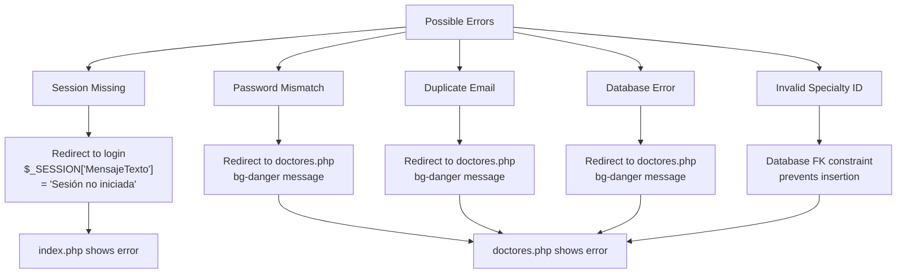

### Ciclo de vida del mensaje de error

1. **Se produce un error:** Durante `registro_INSERT.php`el procesamiento
2. **Sesión establecida:** `$_SESSION['MensajeTexto']` y `$_SESSION['MensajeTipo']`asignada
3. **Redirigir:** `header("Location: doctores.php")`
4. **Pantalla:** Mensaje mostrado en el div de alerta[Admin/doctores.php L93-L102](https://github.com/axchisan/Consultorio_Emily_Bernal/blob/589034b9/Admin/doctores.php#L93-L102)
5. **Limpieza:** Variables de sesión establecidas en`null` [Admin/doctores.php L99-L100](https://github.com/axchisan/Consultorio_Emily_Bernal/blob/589034b9/Admin/doctores.php#L99-L100)

La página en sí realiza una comprobación de errores mínima: solo la validación de la sesión.[Admin/doctores.php L7-L12](https://github.com/axchisan/Consultorio_Emily_Bernal/blob/589034b9/Admin/doctores.php#L7-L12)

Todas las comprobaciones de validación de formularios e integridad de datos se realizan en la capa CRUD, siguiendo el principio de separación de preocupaciones.

**Fuentes:** [Admin/doctores.php L7-L102](https://github.com/axchisan/Consultorio_Emily_Bernal/blob/589034b9/Admin/doctores.php#L7-L102)

---

## Integración con la capa CRUD

La página de gestión del médico funciona como una fina capa de presentación, delegando la lógica empresarial a archivos PHP especializados.

### Mapa de interacción de componentes

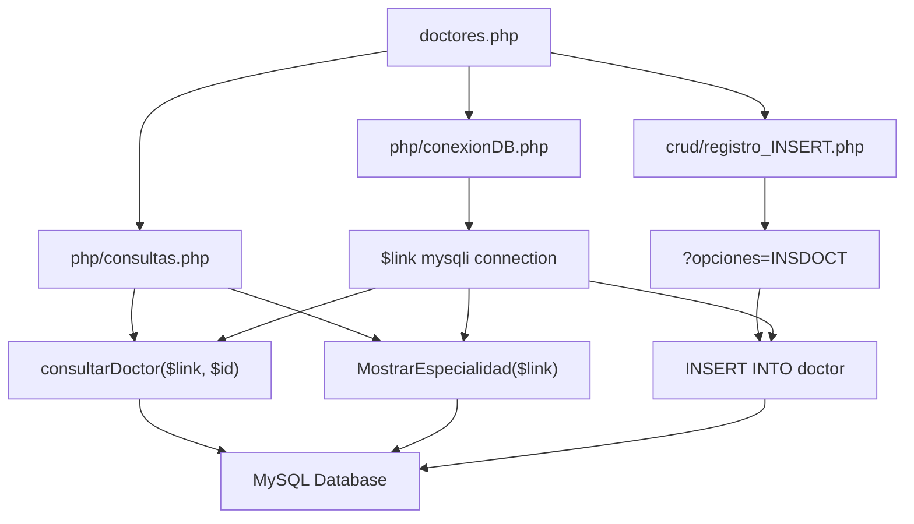

### Responsabilidades del archivo

| Archivo | Role | Métodos/Funciones utilizadas |
| --- | --- | --- |
| `doctores.php` | Capa de presentación | Representación HTML, definición de formulario |
| `php/conexionDB.php` | Conexión a base de datos | Establece `$link`el objeto mysqli |
| `php/consultas.php` | Abstracción de consultas | `consultarDoctor()`,`MostrarEspecialidad()` |
| `crud/registro_INSERT.php` | Lógica de negocios | Inserción de doctor, validación, hash de contraseña |

Esta arquitectura garantiza que `doctores.php`el enfoque se mantenga en las preocupaciones de la interfaz de usuario mientras que la lógica de manipulación de datos reside en archivos CRUD dedicados, lo que facilita el mantenimiento y las pruebas.

**Fuentes:** [Admin/doctores.php L3-L105](https://github.com/axchisan/Consultorio_Emily_Bernal/blob/589034b9/Admin/doctores.php#L3-L105)