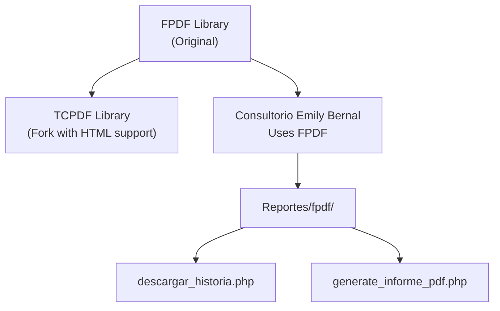
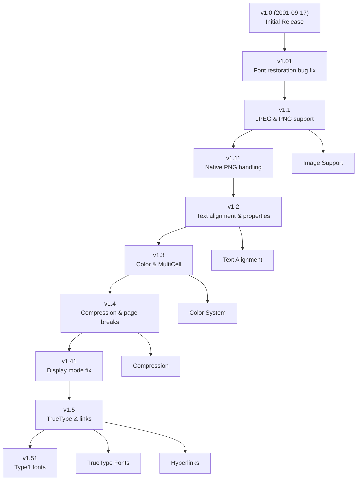
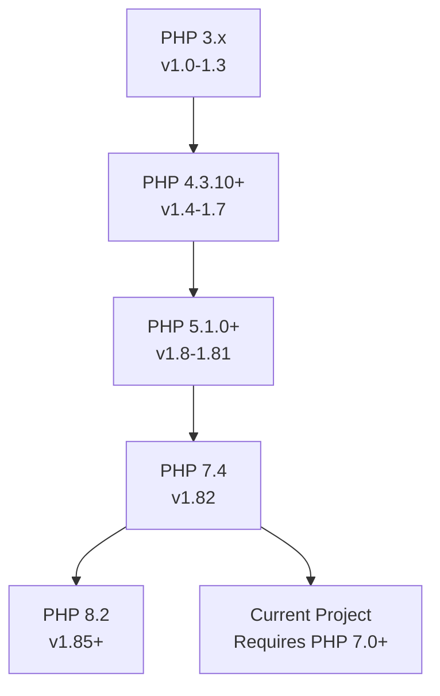
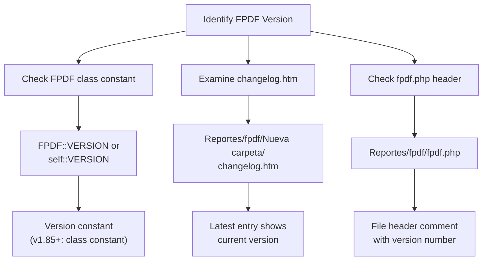
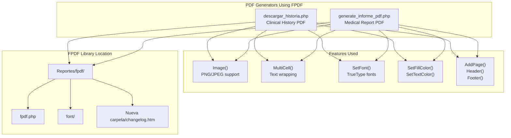
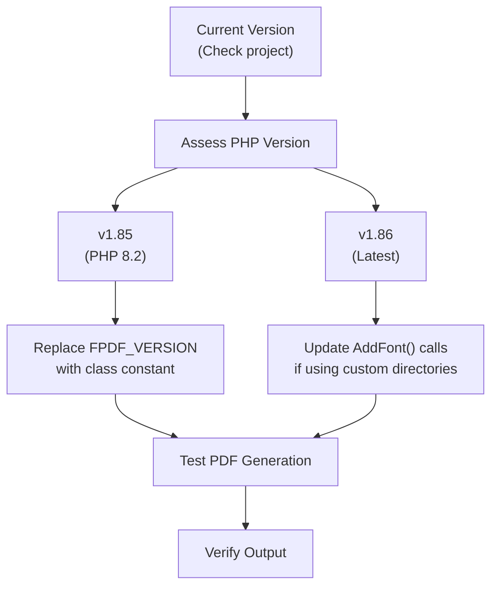

# Historial de versiones de TCPDF

> **Archivos fuente relevantes**
> * [Reportes/fpdf/Nueva carpeta/changelog.htm](https://github.com/axchisan/Consultorio_Emily_Bernal/blob/589034b9/Reportes/fpdf/Nueva carpeta/changelog.htm)

## Propósito y alcance

Este documento proporciona un historial de versiones completo de la biblioteca de generación de PDF utilizada en el sistema del Consultorio Emily Bernal. **Nota importante** : A pesar de las referencias a "TCPDF" en la documentación wiki, el código base utiliza **FPDF** , una biblioteca PHP ligera para la generación de PDF. Esta página documenta el historial de versiones de FPDF y su evolución desde la versión 1.0 (2001) hasta la versión 1.86 (2023), incluyendo todas las principales incorporaciones de funciones, correcciones de errores y actualizaciones de compatibilidad relevantes para comprender las capacidades de generación de PDF disponibles en este proyecto.

Para obtener información sobre la integración y el uso de la biblioteca, consulte [Integración de la biblioteca TCPDF](/axchisan/Consultorio_Emily_Bernal/3.3-tcpdf-library-integration) . Para conocer métodos específicos de la API, consulte [Métodos principales de TCPDF](/axchisan/Consultorio_Emily_Bernal/9.1-tcpdf-core-methods) .

## Aclaración de la biblioteca: FPDF vs TCPDF

El sistema utiliza **FPDF** (PDF gratuito), no TCPDF. FPDF es la biblioteca original de generación de PDF, más sencilla, creada por Olivier Plathey. TCPDF es una versión con más funciones y capacidades adicionales, como el análisis de HTML, pero el sistema del Consultorio Emily Bernal utiliza la biblioteca FPDF original para sus necesidades de generación de PDF.



**Fuentes** :[Reportes/fpdf/Nueva L1-L189](https://github.com/axchisan/Consultorio_Emily_Bernal/blob/589034b9/Reportes/fpdf/Nueva carpeta/changelog.htm#L1-L189)

## Línea de tiempo de evolución de la versión

El siguiente diagrama ilustra los principales hitos en la historia del desarrollo de FPDF:

```css
#mermaid-gbc5p4w97tg{font-family:ui-sans-serif,-apple-system,system-ui,Segoe UI,Helvetica;font-size:16px;fill:#333;}@keyframes edge-animation-frame{from{stroke-dashoffset:0;}}@keyframes dash{to{stroke-dashoffset:0;}}#mermaid-gbc5p4w97tg .edge-animation-slow{stroke-dasharray:9,5!important;stroke-dashoffset:900;animation:dash 50s linear infinite;stroke-linecap:round;}#mermaid-gbc5p4w97tg .edge-animation-fast{stroke-dasharray:9,5!important;stroke-dashoffset:900;animation:dash 20s linear infinite;stroke-linecap:round;}#mermaid-gbc5p4w97tg .error-icon{fill:#dddddd;}#mermaid-gbc5p4w97tg .error-text{fill:#222222;stroke:#222222;}#mermaid-gbc5p4w97tg .edge-thickness-normal{stroke-width:1px;}#mermaid-gbc5p4w97tg .edge-thickness-thick{stroke-width:3.5px;}#mermaid-gbc5p4w97tg .edge-pattern-solid{stroke-dasharray:0;}#mermaid-gbc5p4w97tg .edge-thickness-invisible{stroke-width:0;fill:none;}#mermaid-gbc5p4w97tg .edge-pattern-dashed{stroke-dasharray:3;}#mermaid-gbc5p4w97tg .edge-pattern-dotted{stroke-dasharray:2;}#mermaid-gbc5p4w97tg .marker{fill:#999;stroke:#999;}#mermaid-gbc5p4w97tg .marker.cross{stroke:#999;}#mermaid-gbc5p4w97tg svg{font-family:ui-sans-serif,-apple-system,system-ui,Segoe UI,Helvetica;font-size:16px;}#mermaid-gbc5p4w97tg p{margin:0;}#mermaid-gbc5p4w97tg .edge{stroke-width:3;}#mermaid-gbc5p4w97tg .section--1 rect,#mermaid-gbc5p4w97tg .section--1 path,#mermaid-gbc5p4w97tg .section--1 circle,#mermaid-gbc5p4w97tg .section--1 path{fill:hsl(0, 0%, 66.7647058824%);}#mermaid-gbc5p4w97tg .section--1 text{fill:#333;}#mermaid-gbc5p4w97tg .node-icon--1{font-size:40px;color:#333;}#mermaid-gbc5p4w97tg .section-edge--1{stroke:hsl(0, 0%, 66.7647058824%);}#mermaid-gbc5p4w97tg .edge-depth--1{stroke-width:17;}#mermaid-gbc5p4w97tg .section--1 line{stroke:rgb(84.7499999999, 84.7499999999, 84.7499999999);stroke-width:3;}#mermaid-gbc5p4w97tg .lineWrapper line{stroke:#333;}#mermaid-gbc5p4w97tg .disabled,#mermaid-gbc5p4w97tg .disabled circle,#mermaid-gbc5p4w97tg .disabled text{fill:lightgray;}#mermaid-gbc5p4w97tg .disabled text{fill:#efefef;}#mermaid-gbc5p4w97tg .section-0 rect,#mermaid-gbc5p4w97tg .section-0 path,#mermaid-gbc5p4w97tg .section-0 circle,#mermaid-gbc5p4w97tg .section-0 path{fill:hsl(-120, 0%, 66.7647058824%);}#mermaid-gbc5p4w97tg .section-0 text{fill:#333;}#mermaid-gbc5p4w97tg .node-icon-0{font-size:40px;color:#333;}#mermaid-gbc5p4w97tg .section-edge-0{stroke:hsl(-120, 0%, 66.7647058824%);}#mermaid-gbc5p4w97tg .edge-depth-0{stroke-width:14;}#mermaid-gbc5p4w97tg .section-0 line{stroke:rgb(84.7499999999, 84.7499999999, 84.7499999999);stroke-width:3;}#mermaid-gbc5p4w97tg .lineWrapper line{stroke:#333;}#mermaid-gbc5p4w97tg .disabled,#mermaid-gbc5p4w97tg .disabled circle,#mermaid-gbc5p4w97tg .disabled text{fill:lightgray;}#mermaid-gbc5p4w97tg .disabled text{fill:#efefef;}#mermaid-gbc5p4w97tg .section-1 rect,#mermaid-gbc5p4w97tg .section-1 path,#mermaid-gbc5p4w97tg .section-1 circle,#mermaid-gbc5p4w97tg .section-1 path{fill:hsl(0, 0%, 61.6666666667%);}#mermaid-gbc5p4w97tg .section-1 text{fill:#333;}#mermaid-gbc5p4w97tg .node-icon-1{font-size:40px;color:#333;}#mermaid-gbc5p4w97tg .section-edge-1{stroke:hsl(0, 0%, 61.6666666667%);}#mermaid-gbc5p4w97tg .edge-depth-1{stroke-width:11;}#mermaid-gbc5p4w97tg .section-1 line{stroke:rgb(97.7499999999, 97.7499999999, 97.7499999999);stroke-width:3;}#mermaid-gbc5p4w97tg .lineWrapper line{stroke:#333;}#mermaid-gbc5p4w97tg .disabled,#mermaid-gbc5p4w97tg .disabled circle,#mermaid-gbc5p4w97tg .disabled text{fill:lightgray;}#mermaid-gbc5p4w97tg .disabled text{fill:#efefef;}#mermaid-gbc5p4w97tg .section-2 rect,#mermaid-gbc5p4w97tg .section-2 path,#mermaid-gbc5p4w97tg .section-2 circle,#mermaid-gbc5p4w97tg .section-2 path{fill:hsl(30, 0%, 66.7647058824%);}#mermaid-gbc5p4w97tg .section-2 text{fill:#333;}#mermaid-gbc5p4w97tg .node-icon-2{font-size:40px;color:#333;}#mermaid-gbc5p4w97tg .section-edge-2{stroke:hsl(30, 0%, 66.7647058824%);}#mermaid-gbc5p4w97tg .edge-depth-2{stroke-width:8;}#mermaid-gbc5p4w97tg .section-2 line{stroke:rgb(84.7499999999, 84.7499999999, 84.7499999999);stroke-width:3;}#mermaid-gbc5p4w97tg .lineWrapper line{stroke:#333;}#mermaid-gbc5p4w97tg .disabled,#mermaid-gbc5p4w97tg .disabled circle,#mermaid-gbc5p4w97tg .disabled text{fill:lightgray;}#mermaid-gbc5p4w97tg .disabled text{fill:#efefef;}#mermaid-gbc5p4w97tg .section-3 rect,#mermaid-gbc5p4w97tg .section-3 path,#mermaid-gbc5p4w97tg .section-3 circle,#mermaid-gbc5p4w97tg .section-3 path{fill:hsl(60, 0%, 66.7647058824%);}#mermaid-gbc5p4w97tg .section-3 text{fill:#333;}#mermaid-gbc5p4w97tg .node-icon-3{font-size:40px;color:#333;}#mermaid-gbc5p4w97tg .section-edge-3{stroke:hsl(60, 0%, 66.7647058824%);}#mermaid-gbc5p4w97tg .edge-depth-3{stroke-width:5;}#mermaid-gbc5p4w97tg .section-3 line{stroke:rgb(84.7499999999, 84.7499999999, 84.7499999999);stroke-width:3;}#mermaid-gbc5p4w97tg .lineWrapper line{stroke:#333;}#mermaid-gbc5p4w97tg .disabled,#mermaid-gbc5p4w97tg .disabled circle,#mermaid-gbc5p4w97tg .disabled text{fill:lightgray;}#mermaid-gbc5p4w97tg .disabled text{fill:#efefef;}#mermaid-gbc5p4w97tg .section-4 rect,#mermaid-gbc5p4w97tg .section-4 path,#mermaid-gbc5p4w97tg .section-4 circle,#mermaid-gbc5p4w97tg .section-4 path{fill:hsl(90, 0%, 66.7647058824%);}#mermaid-gbc5p4w97tg .section-4 text{fill:#333;}#mermaid-gbc5p4w97tg .node-icon-4{font-size:40px;color:#333;}#mermaid-gbc5p4w97tg .section-edge-4{stroke:hsl(90, 0%, 66.7647058824%);}#mermaid-gbc5p4w97tg .edge-depth-4{stroke-width:2;}#mermaid-gbc5p4w97tg .section-4 line{stroke:rgb(84.7499999999, 84.7499999999, 84.7499999999);stroke-width:3;}#mermaid-gbc5p4w97tg .lineWrapper line{stroke:#333;}#mermaid-gbc5p4w97tg .disabled,#mermaid-gbc5p4w97tg .disabled circle,#mermaid-gbc5p4w97tg .disabled text{fill:lightgray;}#mermaid-gbc5p4w97tg .disabled text{fill:#efefef;}#mermaid-gbc5p4w97tg .section-5 rect,#mermaid-gbc5p4w97tg .section-5 path,#mermaid-gbc5p4w97tg .section-5 circle,#mermaid-gbc5p4w97tg .section-5 path{fill:hsl(120, 0%, 66.7647058824%);}#mermaid-gbc5p4w97tg .section-5 text{fill:#333;}#mermaid-gbc5p4w97tg .node-icon-5{font-size:40px;color:#333;}#mermaid-gbc5p4w97tg .section-edge-5{stroke:hsl(120, 0%, 66.7647058824%);}#mermaid-gbc5p4w97tg .edge-depth-5{stroke-width:-1;}#mermaid-gbc5p4w97tg .section-5 line{stroke:rgb(84.7499999999, 84.7499999999, 84.7499999999);stroke-width:3;}#mermaid-gbc5p4w97tg .lineWrapper line{stroke:#333;}#mermaid-gbc5p4w97tg .disabled,#mermaid-gbc5p4w97tg .disabled circle,#mermaid-gbc5p4w97tg .disabled text{fill:lightgray;}#mermaid-gbc5p4w97tg .disabled text{fill:#efefef;}#mermaid-gbc5p4w97tg .section-6 rect,#mermaid-gbc5p4w97tg .section-6 path,#mermaid-gbc5p4w97tg .section-6 circle,#mermaid-gbc5p4w97tg .section-6 path{fill:hsl(150, 0%, 66.7647058824%);}#mermaid-gbc5p4w97tg .section-6 text{fill:#333;}#mermaid-gbc5p4w97tg .node-icon-6{font-size:40px;color:#333;}#mermaid-gbc5p4w97tg .section-edge-6{stroke:hsl(150, 0%, 66.7647058824%);}#mermaid-gbc5p4w97tg .edge-depth-6{stroke-width:-4;}#mermaid-gbc5p4w97tg .section-6 line{stroke:rgb(84.7499999999, 84.7499999999, 84.7499999999);stroke-width:3;}#mermaid-gbc5p4w97tg .lineWrapper line{stroke:#333;}#mermaid-gbc5p4w97tg .disabled,#mermaid-gbc5p4w97tg .disabled circle,#mermaid-gbc5p4w97tg .disabled text{fill:lightgray;}#mermaid-gbc5p4w97tg .disabled text{fill:#efefef;}#mermaid-gbc5p4w97tg .section-7 rect,#mermaid-gbc5p4w97tg .section-7 path,#mermaid-gbc5p4w97tg .section-7 circle,#mermaid-gbc5p4w97tg .section-7 path{fill:hsl(210, 0%, 75%);}#mermaid-gbc5p4w97tg .section-7 text{fill:#333;}#mermaid-gbc5p4w97tg .node-icon-7{font-size:40px;color:#333;}#mermaid-gbc5p4w97tg .section-edge-7{stroke:hsl(210, 0%, 75%);}#mermaid-gbc5p4w97tg .edge-depth-7{stroke-width:-7;}#mermaid-gbc5p4w97tg .section-7 line{stroke:rgb(63.75, 63.75, 63.75);stroke-width:3;}#mermaid-gbc5p4w97tg .lineWrapper line{stroke:#333;}#mermaid-gbc5p4w97tg .disabled,#mermaid-gbc5p4w97tg .disabled circle,#mermaid-gbc5p4w97tg .disabled text{fill:lightgray;}#mermaid-gbc5p4w97tg .disabled text{fill:#efefef;}#mermaid-gbc5p4w97tg .section-8 rect,#mermaid-gbc5p4w97tg .section-8 path,#mermaid-gbc5p4w97tg .section-8 circle,#mermaid-gbc5p4w97tg .section-8 path{fill:hsl(270, 0%, 66.7647058824%);}#mermaid-gbc5p4w97tg .section-8 text{fill:#333;}#mermaid-gbc5p4w97tg .node-icon-8{font-size:40px;color:#333;}#mermaid-gbc5p4w97tg .section-edge-8{stroke:hsl(270, 0%, 66.7647058824%);}#mermaid-gbc5p4w97tg .edge-depth-8{stroke-width:-10;}#mermaid-gbc5p4w97tg .section-8 line{stroke:rgb(84.7499999999, 84.7499999999, 84.7499999999);stroke-width:3;}#mermaid-gbc5p4w97tg .lineWrapper line{stroke:#333;}#mermaid-gbc5p4w97tg .disabled,#mermaid-gbc5p4w97tg .disabled circle,#mermaid-gbc5p4w97tg .disabled text{fill:lightgray;}#mermaid-gbc5p4w97tg .disabled text{fill:#efefef;}#mermaid-gbc5p4w97tg .section-9 rect,#mermaid-gbc5p4w97tg .section-9 path,#mermaid-gbc5p4w97tg .section-9 circle,#mermaid-gbc5p4w97tg .section-9 path{fill:hsl(300, 0%, 66.7647058824%);}#mermaid-gbc5p4w97tg .section-9 text{fill:#333;}#mermaid-gbc5p4w97tg .node-icon-9{font-size:40px;color:#333;}#mermaid-gbc5p4w97tg .section-edge-9{stroke:hsl(300, 0%, 66.7647058824%);}#mermaid-gbc5p4w97tg .edge-depth-9{stroke-width:-13;}#mermaid-gbc5p4w97tg .section-9 line{stroke:rgb(84.7499999999, 84.7499999999, 84.7499999999);stroke-width:3;}#mermaid-gbc5p4w97tg .lineWrapper line{stroke:#333;}#mermaid-gbc5p4w97tg .disabled,#mermaid-gbc5p4w97tg .disabled circle,#mermaid-gbc5p4w97tg .disabled text{fill:lightgray;}#mermaid-gbc5p4w97tg .disabled text{fill:#efefef;}#mermaid-gbc5p4w97tg .section-10 rect,#mermaid-gbc5p4w97tg .section-10 path,#mermaid-gbc5p4w97tg .section-10 circle,#mermaid-gbc5p4w97tg .section-10 path{fill:hsl(330, 0%, 66.7647058824%);}#mermaid-gbc5p4w97tg .section-10 text{fill:#333;}#mermaid-gbc5p4w97tg .node-icon-10{font-size:40px;color:#333;}#mermaid-gbc5p4w97tg .section-edge-10{stroke:hsl(330, 0%, 66.7647058824%);}#mermaid-gbc5p4w97tg .edge-depth-10{stroke-width:-16;}#mermaid-gbc5p4w97tg .section-10 line{stroke:rgb(84.7499999999, 84.7499999999, 84.7499999999);stroke-width:3;}#mermaid-gbc5p4w97tg .lineWrapper line{stroke:#333;}#mermaid-gbc5p4w97tg .disabled,#mermaid-gbc5p4w97tg .disabled circle,#mermaid-gbc5p4w97tg .disabled text{fill:lightgray;}#mermaid-gbc5p4w97tg .disabled text{fill:#efefef;}#mermaid-gbc5p4w97tg .section-root rect,#mermaid-gbc5p4w97tg .section-root path,#mermaid-gbc5p4w97tg .section-root circle{fill:hsl(0, 0%, 66.7647058824%);}#mermaid-gbc5p4w97tg .section-root text{fill:#333;}#mermaid-gbc5p4w97tg .icon-container{height:100%;display:flex;justify-content:center;align-items:center;}#mermaid-gbc5p4w97tg .edge{fill:none;}#mermaid-gbc5p4w97tg .eventWrapper{filter:brightness(120%);}#mermaid-gbc5p4w97tg :root{--mermaid-font-family:"trebuchet ms",verdana,arial,sans-serif;}2001v1.0   Basic   PDFgenerationv1.1   Image   support(JPEG,   PNG)v1.2   Text   alignment&   properties2002v1.3   Color   support   &MultiCellv1.4   Pagecompressionv1.5   TrueType   fonts&   links2003-2004v1.52   Outputdestination   controlv1.53   Font   pathimprovements2008v1.6   GIF   support   &UTF-8   properties2011v1.7   MakeFontrewrite   &   PNG   alpha2015v1.8   PHP   5.1+requirement,   fontsubsettingv1.81   Pagedimension   methods2019v1.82   PHP   7.4compatibility2021v1.83-1.84Annotation   fixes2022v1.85   PHP   8.2compatibility2023v1.86   AddFontdirectory   parameterFPDF Library Evolution (2001-2023)
```

**Fuentes** :[Reportes/fpdf/Nueva L14-L186](https://github.com/axchisan/Consultorio_Emily_Bernal/blob/589034b9/Reportes/fpdf/Nueva carpeta/changelog.htm#L14-L186)

## Historial completo de versiones

### Últimas versiones (v1.85 - v1.86)

| Versión | Fecha | Cambios clave |
| --- | --- | --- |
| **versión 1.86** | 25 de junio de 2023 | Added directory parameter to `AddFont()` for loading font definition files from specific locations; Fixed PDF creation date bug |
| **v1.85** | 2022-11-10 | Removed PHP 8.2 deprecation notices; Fixed null value handling; Replaced `FPDF_VERSION` constant with class constant; Creation date now includes timezone; Content-type always `application/pdf` |
| **v1.84** | 2021-08-28 | Fixed annotation-related issue |
| **v1.83** | 2021-04-18 | Fixed annotation-related issue |
| **v1.82** | 2019-12-07 | Removed PHP 7.4 deprecation notice |

**Sources**: [Reportes/fpdf/Nueva L14-L38](https://github.com/axchisan/Consultorio_Emily_Bernal/blob/589034b9/Reportes/fpdf/Nueva carpeta/changelog.htm#L14-L38)

### Modern Era (v1.8 - v1.81)

#### v1.81 (2015-12-20)

* Added `GetPageWidth()` and `GetPageHeight()` methods for page dimension retrieval
* Fixed bug in `SetXY()` method

#### v1.8 (2015-11-29) - Major Release

This version introduced significant changes and stricter requirements:

**Requirements:**

* PHP 5.1.0 or higher now required (breaking change)

**Font Improvements:**

* MakeFont utility now performs font subsetting, greatly reducing font file sizes
* Added ToUnicode CMaps to improve text extraction from PDFs

**API Enhancements:**

* `AddPage()`: New parameter to rotate pages
* `SetY()`: New parameter to control whether x position resets
* `Output()`: New encoding parameter for filename; special characters properly encoded; parameter order reversed (old order still supported)

**Error Handling:**

* `Error()` method now throws exceptions instead of dying
* Adding content before first `AddPage()` or after `Close()` raises errors
* Outputting text without font selection raises errors

**Sources**: [Reportes/fpdf/Nueva L39-L55](https://github.com/axchisan/Consultorio_Emily_Bernal/blob/589034b9/Reportes/fpdf/Nueva carpeta/changelog.htm#L39-L55)

### Feature-Rich Era (v1.6 - v1.7)

#### v1.7 (2011-06-18) - MakeFont Overhaul

**Major Changes:**

* Complete MakeFont utility rewrite; no longer depends on ttf2pt1
* PNG alpha channel support added
* Image resolution specification capability
* Default image resolution increased from 72 to 96 dpi

**Bug Fixes:**

* GIF images no longer require temporary files on PHP 5.1+
* Output buffer clearing when containing only UTF-8 BOM/whitespace
* Symbol and ZapfDingbats fonts now support underline
* Custom page size validation (width < height)
* Type1 font embedding bug fixed
* Adobe Reader X plug-in display issue resolved
* Transparency issues with some Adobe Reader versions fixed
* Content-Length header removed due to HTTP compression conflicts

#### v1.6 (2008-08-03)

**Requirements:**

* PHP 4.3.10 or higher now required

**New Features:**

* GIF image support
* Images can trigger automatic page breaks
* Different page formats within single document
* UTF-8 support for document properties (author, creator, keywords, subject, title)

**Bug Fixes:**

* PNG URL insertion errors resolved
* Infinite loop in `Header()` automatic page breaks fixed
* Warning messages with recent PHP versions removed
* Added HTTP headers for IE compatibility

**Sources**: [Reportes/fpdf/Nueva L56-L84](https://github.com/axchisan/Consultorio_Emily_Bernal/blob/589034b9/Reportes/fpdf/Nueva carpeta/changelog.htm#L56-L84)

### Foundation Era (v1.5 - v1.53)

#### v1.53 (2004-12-31)

* Automatic font subdirectory detection (no need to define `FPDF_FONTPATH`)
* Removed `$HTTP_SERVER_VARS` dependency for PHP5 compatibility
* Fixed Type1 font embedding issues
* Fixed filename space character handling
* Fixed `Cell()` method printing of number 0

#### v1.52 (2003-12-30)

* `Image()` displays at 72 dpi when no dimension given
* `Output()` accepts string as second parameter for destination
* `Open()` automatically called by `AddPage()`
* Remote JPEG image support
* Forced decimal separator to dot in constructor
* Added multiple encodings: Turkish, Thai, Hebrew, Ukrainian, Vietnamese
* Fixed right-aligned `MultiCell()` last line alignment
* Fixed command-line PDF output headers
* Fixed underlining for special characters (, (, ))
* Replaced `$HTTP_ENV_VARS` with `$HTTP_SERVER_VARS`

**Sources**: [Reportes/fpdf/Nueva L85-L105](https://github.com/axchisan/Consultorio_Emily_Bernal/blob/589034b9/Reportes/fpdf/Nueva carpeta/changelog.htm#L85-L105)

### Early Development (v1.0 - v1.5)



#### v1.51 (2002-08-03)

**Major Features:**

* Type1 font support
* Baltic encoding added
* Internal coordinate system changed to points with origin at bottom (fixed Acrobat 5 bugs)

**Bug Fixes:**

* Decimal separator locale independence
* Cell clickable area alignment
* CMYK JPEG color inversion
* Transparent PNG grayscale/true color handling
* Font addition with magic_quotes_runtime enabled

#### v1.5 (2002-05-28) - Major Milestone

**New Capabilities:**

* TrueType font support via `AddFont()`
* Encoding support (Western/Eastern Europe, Cyrillic, Greek)
* `Write()` method added
* Underlined text style
* Internal and external links: `AddLink()`, `SetLink()`, `Link()`
* Right margin management: `SetRightMargin()`, `SetTopMargin()`
* Enhanced `SetDisplayMode()` for page layout
* `MultiCell()` border parameter like `Cell()`
* `Close()` calls `AddPage()` if no pages exist

#### v1.4 (2002-03-02)

* Dropped PHP3 support
* Page compression via `SetCompression()`
* Page format choice and orientation changes
* `AcceptPageBreak()` method
* Total page count printing via `AliasNbPages()`
* Cell border selection
* Cell position modes
* Height-only image specification (auto width)
* Fixed justified line page break footer bug

#### v1.41 (2002-03-13)

* Fixed `SetDisplayMode()` regression

#### v1.3 (2001-12-03)

**Major Features:**

* Line break and text justification via `MultiCell()`
* Color methods: `SetDrawColor()`, `SetFillColor()`, `SetTextColor()`
* Filled rectangles and cell backgrounds
* Null-width cells extend to right margin
* Line width persistence across pages (default 0.2mm)
* `SetXY()` method added
* Fixed deprecated PHP4 reference passing

#### v1.2 (2001-11-11)

* Font metric files and `GetStringWidth()` method
* Text alignment in cells (center, right)
* Display mode control via `SetDisplayMode()`
* Document properties: `SetAuthor()`, `SetCreator()`, `SetKeywords()`, `SetSubject()`, `SetTitle()`
* Force PDF download capability
* `SetX()` and `GetX()` methods
* Abscissa retention during page breaks

#### v1.11 (2001-10-20)

* PNG support without PHP4/zlib requirement (direct PDF embedding)
* Image insertion with magic_quotes_runtime enabled

#### v1.1 (2001-10-07)

* JPEG and PNG image support

#### v1.01 (2001-10-03)

* Fixed font restoration bug in `Header()` page breaks

#### v1.0 (2001-09-17)

* Initial release

**Sources**: [Reportes/fpdf/Nueva L106-L186](https://github.com/axchisan/Consultorio_Emily_Bernal/blob/589034b9/Reportes/fpdf/Nueva carpeta/changelog.htm#L106-L186)

## Feature Introduction Matrix

The following table shows when key features used in the Consultorio Emily Bernal system became available:

| Feature | Version | Year | Used In Project |
| --- | --- | --- | --- |
| Basic PDF generation | v1.0 | 2001 | ✓ |
| JPEG/PNG images | v1.1 | 2001 | ✓ |
| Text alignment & properties | v1.2 | 2001 | ✓ |
| Color support | v1.3 | 2001 | ✓ |
| `MultiCell()` for text wrapping | v1.3 | 2001 | ✓ |
| Page compression | v1.4 | 2002 | ✓ |
| `AliasNbPages()` page counting | v1.4 | 2002 | ✓ |
| TrueType font support | v1.5 | 2002 | ✓ |
| Character encoding | v1.5 | 2002 | ✓ |
| Hyperlinks | v1.5 | 2002 | - |
| Type1 fonts | v1.51 | 2002 | - |
| UTF-8 document properties | v1.6 | 2008 | ✓ |
| PNG alpha channel | v1.7 | 2011 | ✓ |
| Font subsetting | v1.8 | 2015 | ✓ |
| Exception-based errors | v1.8 | 2015 | ✓ |
| `GetPageWidth()`/`GetPageHeight()` | v1.81 | 2015 | - |
| PHP 8.2 compatibility | v1.85 | 2022 | ✓ |

**Sources**: [Reportes/fpdf/Nueva L1-L189](https://github.com/axchisan/Consultorio_Emily_Bernal/blob/589034b9/Reportes/fpdf/Nueva carpeta/changelog.htm#L1-L189)

## PHP Version Requirements Timeline



**Key PHP Compatibility Milestones:**

* **v1.4**: Dropped PHP3 support
* **v1.6**: Minimum PHP 4.3.10
* **v1.8**: Minimum PHP 5.1.0 (major breaking change)
* **v1.82**: PHP 7.4 deprecation notices removed
* **v1.85**: PHP 8.2 deprecation notices removed, null value handling improved

**Sources**: [Reportes/fpdf/Nueva L19-L76](https://github.com/axchisan/Consultorio_Emily_Bernal/blob/589034b9/Reportes/fpdf/Nueva carpeta/changelog.htm#L19-L76)

## Critical Bug Fixes History

### Security and Reliability Fixes

| Version | Issue | Resolution |
| --- | --- | --- |
| v1.86 | PDF creation date bug | Fixed incorrect date generation |
| v1.85 | Null value handling | Removed notices when passing null instead of strings |
| v1.8 | Pre-AddPage content | Now raises error instead of silent failure |
| v1.8 | No font selected | Now raises error when outputting text |
| v1.7 | Type1 font embedding | Fixed embedding bug affecting PDF processors |
| v1.7 | Adobe Reader X plug-in | Fixed display issue |
| v1.7 | Transparency rendering | Fixed issues with some Adobe Reader versions |
| v1.6 | PNG URL insertion | Fixed occasional errors |
| v1.6 | Header infinite loop | Fixed automatic page break recursion |
| v1.53 | Type1 processing | Fixed trouble with some PDF processors |
| v1.51 | CMYK JPEG | Fixed inverted colors |
| v1.51 | Transparent PNG | Fixed grayscale/true color handling |
| v1.01 | Font restoration | Fixed font loss in Header() page breaks |

**Sources**: [Reportes/fpdf/Nueva L14-L181](https://github.com/axchisan/Consultorio_Emily_Bernal/blob/589034b9/Reportes/fpdf/Nueva carpeta/changelog.htm#L14-L181)

## Version Identification in Project

To determine which FPDF version is being used in the Consultorio Emily Bernal project:



**Note**: From v1.85 onwards, the `FPDF_VERSION` constant was replaced with a class constant accessible via `FPDF::VERSION`.

**Sources**: [Reportes/fpdf/Nueva L23](https://github.com/axchisan/Consultorio_Emily_Bernal/blob/589034b9/Reportes/fpdf/Nueva carpeta/changelog.htm#L23-L23)

## Feature Deprecations and Breaking Changes

### Breaking Changes Introduced

| Version | Breaking Change | Impact |
| --- | --- | --- |
| v1.85 | `FPDF_VERSION` constant removed | Use class constant `FPDF::VERSION` instead |
| v1.8 | PHP 5.1.0 minimum requirement | Cannot run on PHP 4.x |
| v1.8 | `Error()` throws exceptions | Requires exception handling instead of error suppression |
| v1.8 | `Output()` parameter order reversed | Old order still supported for compatibility |
| v1.8 | Content before AddPage() errors | Previously silently ignored |
| v1.8 | Text without font errors | Previously produced invalid PDFs |
| v1.6 | PHP 4.3.10 minimum requirement | Older PHP 4.x versions unsupported |
| v1.4 | PHP3 support dropped | PHP3 no longer supported |

### Removed Dependencies

| Version | Removed Dependency | Reason |
| --- | --- | --- |
| v1.8 | ttf2pt1 for MakeFont | Utility completely rewritten |
| v1.7 | Temporary files for GIF | Direct processing in PHP 5.1+ |
| v1.7 | Content-Length header | HTTP compression compatibility |
| v1.53 | Manual FPDF_FONTPATH definition | Automatic detection added |
| v1.52 | `$HTTP_ENV_VARS` | Replaced with `$HTTP_SERVER_VARS` |

**Sources**: [Reportes/fpdf/Nueva L19-L135](https://github.com/axchisan/Consultorio_Emily_Bernal/blob/589034b9/Reportes/fpdf/Nueva carpeta/changelog.htm#L19-L135)

## Implementation in Consultorio Emily Bernal

The project uses FPDF in two main PDF generators:



**Key FPDF Features Utilized:**

* **Image Support** (v1.1+): Embedding patient photographs and radiographs
* **MultiCell** (v1.3+): Text wrapping for clinical descriptions
* **Color System** (v1.3+): Header/footer styling
* **TrueType Fonts** (v1.5+): Character encoding for Spanish language support
* **Page Management** (v1.0+): Custom headers and footers
* **Compression** (v1.4+): Reducing PDF file sizes

**Sources**: [Reportes/fpdf/Nueva L1-L189](https://github.com/axchisan/Consultorio_Emily_Bernal/blob/589034b9/Reportes/fpdf/Nueva carpeta/changelog.htm#L1-L189)

## Consideraciones sobre la migración

Si está considerando actualizar FPDF o migrar a TCPDF:

### Ruta de actualización de la versión FPDF



### Migración de FPDF a TCPDF

**Razones para considerar TCPDF:**

* Conversión de HTML a PDF
* Soporte de tabla más avanzado
* Mejor manejo de Unicode/UTF-8
* Salto de línea automático
* Generación de códigos de barras

**Desafíos de la migración:**

* Diferentes métodos de API
* Sobrecarga de rendimiento
* Mayor superficie de biblioteca
* Se requiere refactorización de código en ambos generadores

**Beneficios actuales del FPDF:**

* Ligero y rápido
* API simple
* Suficiente para las necesidades del proyecto
* Probado en producción

**Fuentes** :[Reportes/fpdf/Nueva L1-L189](https://github.com/axchisan/Consultorio_Emily_Bernal/blob/589034b9/Reportes/fpdf/Nueva carpeta/changelog.htm#L1-L189)