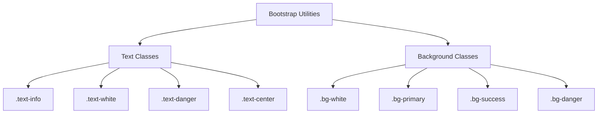
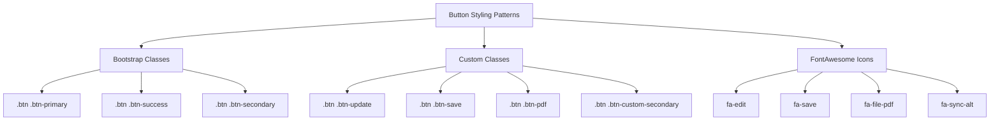

# Integración y diseño de Bootstrap

> **Archivos fuente relevantes**
> * [Admin/informe.php](https://github.com/axchisan/Consultorio_Emily_Bernal/blob/589034b9/Admin/informe.php)
> * [Admin/inicioAdmin.php](https://github.com/axchisan/Consultorio_Emily_Bernal/blob/589034b9/Admin/inicioAdmin.php)
> * [Admin/ver_historia.php](https://github.com/axchisan/Consultorio_Emily_Bernal/blob/589034b9/Admin/ver_historia.php)

Esta página documenta la integración del framework Bootstrap 4.x y los patrones de diseño utilizados en la interfaz administrativa. Abarca el diseño consistente de la barra lateral de dos columnas, la organización del contenido basada en tarjetas, las convenciones de estilo de formularios y la implementación del sistema de cuadrícula adaptable.

Para interacciones dinámicas de tablas con DataTables de estilo Bootstrap, consulte [Implementación de DataTables](/axchisan/Consultorio_Emily_Bernal/7.2-datatables-implementation) . Para patrones de mensajes de alerta con componentes Bootstrap, consulte [Mensajería Flash basada en sesión](/axchisan/Consultorio_Emily_Bernal/7.5-session-based-flash-messaging) .

## Versión de Bootstrap y dependencias

El sistema utiliza **Bootstrap 4.x** como framework CSS principal, cargado desde una estructura de directorios local. Todas las páginas administrativas incluyen el mismo conjunto de dependencias CSS en su `<head>`sección.

```
../src/css/lib/bootstrap/css/bootstrap.min.css
../src/css/lib/fontawesome/css/all.css
../src/css/admin.css
../src/css/informe_paciente.css (specific pages)
../src/css/custom_styles.css (specific pages)
```

Las dependencias de JavaScript se cargan al final de `<body>`:

```
../src/js/jquery.js
../src/css/lib/bootstrap/js/bootstrap.min.js
../src/js/admin.js
```

**Fuentes:** [Admin/informe.php L444-L448](https://github.com/axchisan/Consultorio_Emily_Bernal/blob/589034b9/Admin/informe.php#L444-L448)

 [Admin/inicioAdmin.php L36-L42](https://github.com/axchisan/Consultorio_Emily_Bernal/blob/589034b9/Admin/inicioAdmin.php#L36-L42)

 [Admin/ver_historia.php L87-L90](https://github.com/axchisan/Consultorio_Emily_Bernal/blob/589034b9/Admin/ver_historia.php#L87-L90)

## Arquitectura de diseño básico

La aplicación utiliza un **patrón de diseño consistente de dos columnas** en todas las páginas administrativas: una barra lateral fija a la izquierda y un área de contenido principal desplazable a la derecha.

### Diagrama de estructura de diseño

```mermaid
flowchart TD

body[""]
aside[""]
main[""]
toggle[""]
sideInner[""]
profile[""]
navMenu[""]
img["Doctor Avatar"]
h3["Doctor Name"]
span["Location"]
ul[""]
li1["Citas"]
li2["Dentistas"]
li3["Calendario"]
li4["Historia Clínica"]
li5["Cerrar sesión"]
siteSection[""]
container[""]
row[""]
col[""]
contentBox[""]
breadcrumb[""]
cards["Multiple"]

body --> aside
body --> main
aside --> toggle
aside --> sideInner
sideInner --> profile
sideInner --> navMenu
profile --> img
profile --> h3
profile --> span
navMenu --> ul
ul --> li1
ul --> li2
ul --> li3
ul --> li4
ul --> li5
main --> siteSection
siteSection --> container
container --> row
row --> col
col --> contentBox
contentBox --> breadcrumb
contentBox --> cards
```

**Fuentes:** [Admin/inicioAdmin.php L51-L143](https://github.com/axchisan/Consultorio_Emily_Bernal/blob/589034b9/Admin/inicioAdmin.php#L51-L143)

 [Admin/informe.php L451-L786](https://github.com/axchisan/Consultorio_Emily_Bernal/blob/589034b9/Admin/informe.php#L451-L786)

 [Admin/ver_historia.php L93-L296](https://github.com/axchisan/Consultorio_Emily_Bernal/blob/589034b9/Admin/ver_historia.php#L93-L296)

### Patrón de estructura HTML

Cada página administrativa sigue esta estructura:

```html
<body>
  <aside class="sidebar">
    <!-- Sidebar content -->
  </aside>
  
  <main class="bg bg-white">
    <div class="site-section">
      <div class="container">
        <div class="row justify-content-center">
          <div class="col-md-12">
            <div class="content-box-large">
              <!-- Page-specific content -->
            </div>
          </div>
        </div>
      </div>
    </div>
  </main>
</body>
```

**Fuentes:** [Admin/inicioAdmin.php L50-L143](https://github.com/axchisan/Consultorio_Emily_Bernal/blob/589034b9/Admin/inicioAdmin.php#L50-L143)

 [Admin/ver_historia.php L92-L302](https://github.com/axchisan/Consultorio_Emily_Bernal/blob/589034b9/Admin/ver_historia.php#L92-L302)

## Estructura del componente de la barra lateral

La barra lateral utiliza la `.sidebar`clase y contiene dos secciones principales: información de perfil y menú de navegación.

### Desglose de los componentes de la barra lateral

| Elemento | Clase | Objetivo |
| --- | --- | --- |
| `<aside>` | `.sidebar` | Container for entire sidebar |
| `<div>` | `.toggle` | Hamburger menu toggle for mobile |
| `<div>` | `.side-inner` | Inner wrapper for sidebar content |
| `<div>` | `.profile` | Doctor profile section with avatar and name |
| `` | `.rounded-circle` | Circular profile image (Bootstrap utility) |
| `<h3>` | `.name` | Doctor's name display |
| `<span>` | `.country` | Location text |
| `<div>` | `.nav-menu` | Navigation links container |
| `<ul>` | - | Unordered list of navigation items |
| `<li>` | - | Individual navigation items |
| `<a>` | - | Navigation links with FontAwesome icons |

The profile image conditionally displays based on the doctor's gender:

```php
<?php if ($row['sexo'] == 'Masculino') { ?>
    
<?php } elseif ($row['sexo'] == 'Femenino') { ?>
    
<?php } ?>
```

**Sources:** [Admin/inicioAdmin.php L51-L77](https://github.com/axchisan/Consultorio_Emily_Bernal/blob/589034b9/Admin/inicioAdmin.php#L51-L77)

 [Admin/informe.php L451-L484](https://github.com/axchisan/Consultorio_Emily_Bernal/blob/589034b9/Admin/informe.php#L451-L484)

 [Admin/ver_historia.php L93-L120](https://github.com/axchisan/Consultorio_Emily_Bernal/blob/589034b9/Admin/ver_historia.php#L93-L120)

### Navigation Menu Pattern

Navigation items use FontAwesome icons followed by text labels:

```xml
<li><a href="inicioAdmin.php">
  <span class="icon-location-arrow mr-3"></span>
  <i class="far fa-calendar-check"></i> Citas
</a></li>
```

The `.mr-3` class (margin-right: 1rem) provides spacing between icon and text.

**Sources:** [Admin/inicioAdmin.php L69-L74](https://github.com/axchisan/Consultorio_Emily_Bernal/blob/589034b9/Admin/inicioAdmin.php#L69-L74)

 [Admin/informe.php L476-L481](https://github.com/axchisan/Consultorio_Emily_Bernal/blob/589034b9/Admin/informe.php#L476-L481)

## Main Content Area

The main content area uses Bootstrap's container and grid system to create a centered, responsive layout.

### Container Hierarchy

```mermaid
flowchart TD

main[""]
siteSection[""]
container[""]
row[""]
col[""]
contentBox[""]
breadcrumb[""]
content["Page Content (Cards, Forms, Tables)"]

main --> siteSection
siteSection --> container
container --> row
row --> col
col --> contentBox
contentBox --> breadcrumb
contentBox --> content
```

**Key Classes:**

* `.bg.bg-white` - White background for main area
* `.site-section` - Custom wrapper for page sections
* `.container` - Bootstrap container (max-width: 1140px on large screens)
* `.row.justify-content-center` - Flexbox row with centered content
* `.col-md-12` - Full-width column on medium+ screens
* `.content-box-large` - Custom content wrapper

**Sources:** [Admin/inicioAdmin.php L79-L84](https://github.com/axchisan/Consultorio_Emily_Bernal/blob/589034b9/Admin/inicioAdmin.php#L79-L84)

 [Admin/informe.php L486-L491](https://github.com/axchisan/Consultorio_Emily_Bernal/blob/589034b9/Admin/informe.php#L486-L491)

 [Admin/ver_historia.php L122-L127](https://github.com/axchisan/Consultorio_Emily_Bernal/blob/589034b9/Admin/ver_historia.php#L122-L127)

### Breadcrumb Navigation

All pages include breadcrumb navigation using Bootstrap's `.breadcrumb` component:

```xml
<ol class="breadcrumb bg-white">
    <li class="breadcrumb-item"><a href="inicioAdmin.php">Inicio</a></li>
    <li class="breadcrumb-item active">Informe del Paciente</li>
</ol>
```

The `.bg-white` class removes default background styling.

**Sources:** [Admin/informe.php L492-L495](https://github.com/axchisan/Consultorio_Emily_Bernal/blob/589034b9/Admin/informe.php#L492-L495)

 [Admin/ver_historia.php L128-L131](https://github.com/axchisan/Consultorio_Emily_Bernal/blob/589034b9/Admin/ver_historia.php#L128-L131)

## Card Components

Bootstrap cards (`.card`) are the primary content container pattern, providing consistent styling and structure for different sections of information.

### Card Component Structure

```mermaid
flowchart TD

card[""]
header[""]
body[""]
icon["Icon"]
title["Section Title"]
content["Content (text, forms, tables, etc.)"]

card --> header
card --> body
header --> icon
header --> title
body --> content
```

### Card Pattern Usage

| Card Type | Header Icon | Purpose | File Reference |
| --- | --- | --- | --- |
| Información General | `fa-user` | Patient demographics | [Admin/informe.php L510-L585](https://github.com/axchisan/Consultorio_Emily_Bernal/blob/589034b9/Admin/informe.php#L510-L585) |
| Anamnesis | `fa-heartbeat` | Medical history | [Admin/informe.php L588-L661](https://github.com/axchisan/Consultorio_Emily_Bernal/blob/589034b9/Admin/informe.php#L588-L661) |
| Información de la Cita | `fa-calendar-check` | Appointment details | [Admin/informe.php L671-L682](https://github.com/axchisan/Consultorio_Emily_Bernal/blob/589034b9/Admin/informe.php#L671-L682) |
| Informe Médico | `fa-notes-medical` | Medical report | [Admin/informe.php L685-L780](https://github.com/axchisan/Consultorio_Emily_Bernal/blob/589034b9/Admin/informe.php#L685-L780) |

**Standard Card Structure:**

```html
<div class="card mb-4">
    <div class="card-header">
        <i class="fas fa-user"></i> Información General
    </div>
    <div class="card-body patient-info">
        <!-- Card content -->
    </div>
</div>
```

The `.mb-4` utility class provides bottom margin (1.5rem) for spacing between cards.

**Sources:** [Admin/informe.php L510-L661](https://github.com/axchisan/Consultorio_Emily_Bernal/blob/589034b9/Admin/informe.php#L510-L661)

 [Admin/ver_historia.php L134-L279](https://github.com/axchisan/Consultorio_Emily_Bernal/blob/589034b9/Admin/ver_historia.php#L134-L279)

## Form Styling

Bootstrap form components are used extensively throughout the application with consistent styling patterns.

### Form Group Pattern

The standard form field structure uses `.form-group` containers:

```php
<div class="form-group">
    <label for="telefono">Teléfono:</label>
    <input type="text" class="form-control" id="telefono" name="telefono" 
           value="<?php echo htmlspecialchars($patient['telefono'] ?? ''); ?>">
</div>
```

### Form Component Classes

| Component | Bootstrap Class | Usage |
| --- | --- | --- |
| Input wrapper | `.form-group` | Container for label + input |
| Text input | `.form-control` | All text, number, email inputs |
| Textarea | `.form-control` | Multi-line text areas |
| Select dropdown | `.form-control` | Dropdown selects |
| File input | `.custom-file-input` | File upload inputs |
| Radio/checkbox | (native) | Radio buttons for ENUM fields |

**Sources:** [Admin/informe.php L525-L582](https://github.com/axchisan/Consultorio_Emily_Bernal/blob/589034b9/Admin/informe.php#L525-L582)

 [Admin/informe.php L691-L766](https://github.com/axchisan/Consultorio_Emily_Bernal/blob/589034b9/Admin/informe.php#L691-L766)

### Form Layout with Grid System

Forms use Bootstrap's grid system to create multi-column layouts:

```php
<div class="row">
    <div class="col-md-6">
        <h5>Datos Principales</h5>
        <p><strong>Nombre:</strong> <?php echo $patient['nombre']; ?></p>
        <!-- More fields -->
    </div>
    <div class="col-md-6">
        <h5>Datos Médicos</h5>
        <div class="form-group">
            <label for="cedula">Nº de Documento:</label>
            <input type="text" class="form-control" id="cedula" name="cedula">
        </div>
        <!-- More fields -->
    </div>
</div>
```

This creates a two-column layout on medium+ screens (≥768px) that stacks on smaller screens.

**Sources:** [Admin/informe.php L515-L584](https://github.com/axchisan/Consultorio_Emily_Bernal/blob/589034b9/Admin/informe.php#L515-L584)

 [Admin/ver_historia.php L139-L167](https://github.com/axchisan/Consultorio_Emily_Bernal/blob/589034b9/Admin/ver_historia.php#L139-L167)

### Custom File Upload Styling

File uploads use custom styling on top of Bootstrap's base classes:

```html
<div class="form-group custom-file-upload">
    <label for="radiografia">Radiografía:</label>
    <div class="file-upload-wrapper">
        <input type="file" class="custom-file-input" id="radiografia" 
               name="radiografia" accept="image/*">
        <span class="file-upload-text">Selecciona una radiografía...</span>
        <button type="button" class="file-upload-btn">
            <i class="fas fa-upload"></i> Subir
        </button>
    </div>
    <!-- Image preview if exists -->
</div>
```

The `.custom-file-upload` and `.file-upload-wrapper` classes provide enhanced styling beyond Bootstrap defaults.

**Sources:** [Admin/informe.php L727-L740](https://github.com/axchisan/Consultorio_Emily_Bernal/blob/589034b9/Admin/informe.php#L727-L740)

### Table Forms (Anamnesis)

Medical history uses a table structure with radio buttons inside form groups:

```php
<table class="table table-bordered">
    <thead>
        <tr>
            <th>Historia Familiar o Personal</th>
            <th>Sí</th>
            <th>No</th>
        </tr>
    </thead>
    <tbody>
        <tr>
            <td>1. Enfermedades Cardiovasculares</td>
            <td><input type="radio" name="historia_cardiovasculares" value="Sí" 
                       <?php echo ($patient['historia_cardiovasculares'] == 'Sí') ? 'checked' : ''; ?> required></td>
            <td><input type="radio" name="historia_cardiovasculares" value="No" 
                       <?php echo ($patient['historia_cardiovasculares'] == 'No') ? 'checked' : ''; ?>></td>
        </tr>
        <!-- More rows -->
    </tbody>
</table>
```

**Sources:** [Admin/informe.php L593-L655](https://github.com/axchisan/Consultorio_Emily_Bernal/blob/589034b9/Admin/informe.php#L593-L655)

 [Admin/ver_historia.php L176-L236](https://github.com/axchisan/Consultorio_Emily_Bernal/blob/589034b9/Admin/ver_historia.php#L176-L236)

## Grid System Usage

Bootstrap's 12-column grid system is used throughout the application for responsive layouts.

### Common Grid Patterns

```mermaid
flowchart TD

container[""]
row1[""]
row2[""]
col1["Left Column"]
col2["Right Column"]
col3["Full Width"]
col4["Messages"]

container --> row1
container --> row2
row1 --> col1
row1 --> col2
row2 --> col3
row2 --> col4

subgraph subGraph2 ["Partial-Width Layout"]
    col4
end

subgraph subGraph1 ["Full-Width Layout"]
    col3
end

subgraph subGraph0 ["Two-Column Layout (50/50)"]
    col1
    col2
end
```

### Grid Class Reference

| Class | Breakpoint | Width | Usage in Codebase |
| --- | --- | --- | --- |
| `.col-md-12` | ≥768px | 100% | Main content wrapper |
| `.col-md-6` | ≥768px | 50% | Two-column forms |
| `.col-md-7` | ≥768px | 58.33% | Alert messages |
| `.row.justify-content-center` | All | - | Center content horizontally |

On screens smaller than 768px (mobile), all `.col-md-*` classes stack vertically (100% width).

**Sources:** [Admin/inicioAdmin.php L82-L85](https://github.com/axchisan/Consultorio_Emily_Bernal/blob/589034b9/Admin/inicioAdmin.php#L82-L85)

 [Admin/informe.php L489-L491](https://github.com/axchisan/Consultorio_Emily_Bernal/blob/589034b9/Admin/informe.php#L489-L491)

 [Admin/informe.php L515-L584](https://github.com/axchisan/Consultorio_Emily_Bernal/blob/589034b9/Admin/informe.php#L515-L584)

## Bootstrap Utility Classes

The application makes extensive use of Bootstrap's utility classes for spacing, text alignment, and backgrounds.

### Spacing Utilities

| Class | Property | Value | Common Usage |
| --- | --- | --- | --- |
| `.mb-2` | margin-bottom | 0.5rem | Small element spacing |
| `.mb-4` | margin-bottom | 1.5rem | Card spacing |
| `.mr-3` | margin-right | 1rem | Icon spacing |
| `.p-3` | padding | 1rem | Alert padding |

### Text and Background Utilities



**Common Combinations:**

```html
<!-- Primary header -->
<div class="p-3 mb-2 bg-primary text-white text-center">Citas</div>

<!-- Success alert -->
<div class="alert p-3 mb-2 bg-success text-white" role="alert">
    Datos actualizados correctamente.
</div>

<!-- Danger alert -->
<div class="alert p-3 mb-2 bg-danger text-white" role="alert">
    Error al procesar la solicitud.
</div>
```

**Sources:** [Admin/inicioAdmin.php L91-L101](https://github.com/axchisan/Consultorio_Emily_Bernal/blob/589034b9/Admin/inicioAdmin.php#L91-L101)

 [Admin/informe.php L497-L506](https://github.com/axchisan/Consultorio_Emily_Bernal/blob/589034b9/Admin/informe.php#L497-L506)

## Alert Components

Bootstrap alert components are used for displaying feedback messages to users through the session-based messaging system.

### Alert Structure

```php
<div class="alert <?php echo $_SESSION['MensajeTipo']; ?>" role="alert">
    <?php echo $_SESSION['MensajeTexto']; ?>
    <button class="delete"><i class="fa fa-times"></i></button>
</div>
```

### Alert Variants

| Session Variable Value | Visual Style | Purpose |
| --- | --- | --- |
| `p-3 mb-2 bg-success text-white` | Green | Success messages |
| `p-3 mb-2 bg-danger text-white` | Red | Error messages |
| `p-3 mb-2 bg-info text-white` | Blue | Informational messages |

The `.delete` button class (custom, not Bootstrap) provides a close button styled with FontAwesome icons. JavaScript handles the removal:

```javascript
document.querySelectorAll('.alert .delete').forEach(($delete) => {
    const $notification = $delete.parentNode;
    $delete.addEventListener('click', () => {
        $notification.parentNode.removeChild($notification);
    });
});
```

**Sources:** [Admin/inicioAdmin.php L93-L101](https://github.com/axchisan/Consultorio_Emily_Bernal/blob/589034b9/Admin/inicioAdmin.php#L93-L101)

 [Admin/informe.php L497-L506](https://github.com/axchisan/Consultorio_Emily_Bernal/blob/589034b9/Admin/informe.php#L497-L506)

 [Admin/informe.php L813-L819](https://github.com/axchisan/Consultorio_Emily_Bernal/blob/589034b9/Admin/informe.php#L813-L819)

## Button Styling

Buttons throughout the application use Bootstrap's button classes combined with FontAwesome icons.

### Button Class Patterns



### Button Examples

**Edit/Update Button:**

```php
<a class="button is-info" data-toggle="tooltip" data-placement="top" 
   title="Editar" href="./realizar_consulta.php?accion=UDT&id=<?php echo $row['id_cita']; ?>">
    <i class="fas fa-edit"></i>
</a>
```

**Success Button (View Report):**

```php
<a class="btn btn-success" data-toggle="tooltip" data-placement="top" 
   title="Ver Informe" href="./informe.php?id=<?php echo $row['id_paciente']; ?>">
    <i class="fas fa-file-alt"></i>
</a>
```

**Custom Update Button:**

```sql
<button type="submit" name="update_patient" class="btn btn-update">
    <i class="fas fa-sync-alt"></i> Actualizar Datos
</button>
```

**Custom Save Button:**

```xml
<button type="submit" name="update_medical" class="btn btn-save">
    <i class="fas fa-save"></i> Guardar Informe Médico
</button>
```

**PDF Generation Button:**

```xml
<button type="submit" class="btn btn-pdf">
    <i class="fas fa-file-pdf"></i> Guardar Informe en PDF
</button>
```

**Sources:** [Admin/inicioAdmin.php L128-L130](https://github.com/axchisan/Consultorio_Emily_Bernal/blob/589034b9/Admin/inicioAdmin.php#L128-L130)

 [Admin/informe.php L664-L666](https://github.com/axchisan/Consultorio_Emily_Bernal/blob/589034b9/Admin/informe.php#L664-L666)

 [Admin/informe.php L768-L770](https://github.com/axchisan/Consultorio_Emily_Bernal/blob/589034b9/Admin/informe.php#L768-L770)

 [Admin/informe.php L775-L777](https://github.com/axchisan/Consultorio_Emily_Bernal/blob/589034b9/Admin/informe.php#L775-L777)

 [Admin/ver_historia.php L286-L288](https://github.com/axchisan/Consultorio_Emily_Bernal/blob/589034b9/Admin/ver_historia.php#L286-L288)

### Tooltip Integration

Bootstrap tooltips are enabled via data attributes:

```xml
<a class="button" data-toggle="tooltip" data-placement="top" title="Editar">
    <i class="fas fa-edit"></i>
</a>
```

The `data-toggle="tooltip"` attribute triggers Bootstrap's tooltip JavaScript plugin.

**Sources:** [Admin/inicioAdmin.php L128-L130](https://github.com/axchisan/Consultorio_Emily_Bernal/blob/589034b9/Admin/inicioAdmin.php#L128-L130)

## Table Styling

Bootstrap table classes provide styling for tabular data display.

### Table Class Reference

| Class | Purpose | Visual Effect |
| --- | --- | --- |
| `.table` | Base table styling | Adds horizontal padding and borders |
| `.table-striped` | Zebra striping | Alternating row background colors |
| `.table-bordered` | Cell borders | Borders on all sides of cells |
| `.nowrap` | Prevent wrapping | Keep text on single line |
| `.responsive` | Responsive wrapper | Horizontal scroll on small screens |

### Table Examples

**Appointment List Table:**

```xml
<table id="example" class="table table-striped nowrap responsive">
    <thead>
        <tr>
            <th>Nombre completo</th>
            <th>Edad</th>
            <th>Consulta</th>
            <!-- More headers -->
        </tr>
    </thead>
    <tbody>
        <!-- Table rows -->
    </tbody>
</table>
```

**Medical History Table:**

```xml
<table class="table table-bordered">
    <thead>
        <tr>
            <th>Historia Familiar o Personal</th>
            <th>Sí</th>
            <th>No</th>
        </tr>
    </thead>
    <tbody>
        <tr>
            <td>1. Enfermedades Cardiovasculares</td>
            <td><input type="radio" name="historia_cardiovasculares" value="Sí"></td>
            <td><input type="radio" name="historia_cardiovasculares" value="No"></td>
        </tr>
        <!-- More rows -->
    </tbody>
</table>
```

**Sources:** [Admin/inicioAdmin.php L103-L134](https://github.com/axchisan/Consultorio_Emily_Bernal/blob/589034b9/Admin/inicioAdmin.php#L103-L134)

 [Admin/informe.php L593-L655](https://github.com/axchisan/Consultorio_Emily_Bernal/blob/589034b9/Admin/informe.php#L593-L655)

 [Admin/ver_historia.php L176-L235](https://github.com/axchisan/Consultorio_Emily_Bernal/blob/589034b9/Admin/ver_historia.php#L176-L235)

## Responsive Behavior

Bootstrap's mobile-first approach ensures the layout adapts across different screen sizes.

### Breakpoint Behavior

| Screen Size | Sidebar | Main Content | Grid Columns |
| --- | --- | --- | --- |
| <576px (Mobile) | Collapsible | Full width | Stack vertically |
| 576px-767px (Small) | Collapsible | Full width | Stack vertically |
| 768px-991px (Medium) | Fixed left | Right side | `.col-md-*` applies |
| 992px-1199px (Large) | Fixed left | Right side | Full grid active |
| ≥1200px (XL) | Fixed left | Right side | Max container width |

### Mobile Navigation

The hamburger menu toggle is provided for mobile devices:

```html
<div class="toggle">
    <a href="#" class="burger js-menu-toggle" data-toggle="collapse" 
       data-target="#main-navbar">
        <span></span>
    </a>
</div>
```

The `.js-menu-toggle` class triggers custom JavaScript in `admin.js` to show/hide the sidebar on mobile.

**Sources:** [Admin/inicioAdmin.php L52-L56](https://github.com/axchisan/Consultorio_Emily_Bernal/blob/589034b9/Admin/inicioAdmin.php#L52-L56)

 [Admin/informe.php L452-L456](https://github.com/axchisan/Consultorio_Emily_Bernal/blob/589034b9/Admin/informe.php#L452-L456)

## Bootstrap JavaScript Integration

Bootstrap's JavaScript components are initialized automatically through data attributes, but some custom JavaScript is added for enhanced functionality.

### JavaScript Loading Order

1. **jQuery** (`jquery.js`) - Required dependency
2. **Bootstrap JS** (`bootstrap.min.js`) - Bootstrap components
3. **JS personalizado** ( `admin.js`) - Funcionalidad personalizada

```xml
<script src="../src/js/jquery.js"></script>
<script src="../src/css/lib/bootstrap/js/bootstrap.min.js"></script>
<script src="../src/js/admin.js"></script>
```

### Inicialización de componentes

La mayoría de los componentes de Bootstrap funcionan automáticamente a través de atributos de datos:

* **Información sobre herramientas:** `data-toggle="tooltip"`
* **Colapso/Acordeón:** `data-toggle="collapse"`
* **Modales:** `data-toggle="modal"`
* **Menús desplegables:** `data-toggle="dropdown"`

Los oyentes de eventos personalizados mejoran las alertas de Bootstrap:

```javascript
document.addEventListener('DOMContentLoaded', () => {
    (document.querySelectorAll('.alert .delete') || []).forEach(($delete) => {
        const $notification = $delete.parentNode;
        $delete.addEventListener('click', () => {
            $notification.parentNode.removeChild($notification);
        });
    });
});
```

**Fuentes:** [Admin/inicioAdmin.php L157-L164](https://github.com/axchisan/Consultorio_Emily_Bernal/blob/589034b9/Admin/inicioAdmin.php#L157-L164)

 [Admin/informe.php L788-L790](https://github.com/axchisan/Consultorio_Emily_Bernal/blob/589034b9/Admin/informe.php#L788-L790)

 [Admin/informe.php L813-L819](https://github.com/axchisan/Consultorio_Emily_Bernal/blob/589034b9/Admin/informe.php#L813-L819)

---

Esta integración de Bootstrap proporciona una interfaz consistente y profesional en todas las páginas administrativas al tiempo que mantiene un comportamiento responsivo y estándares de accesibilidad.