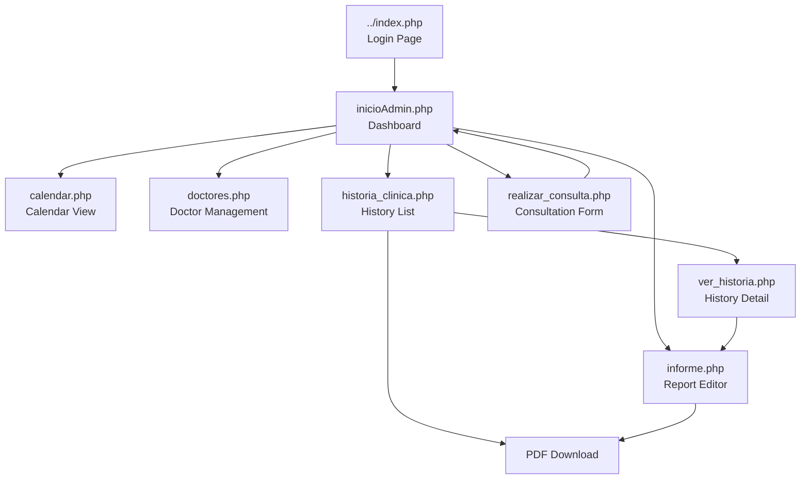
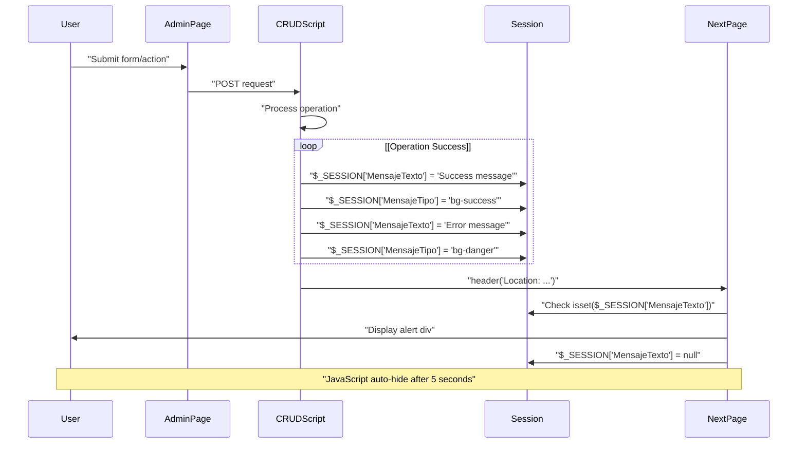
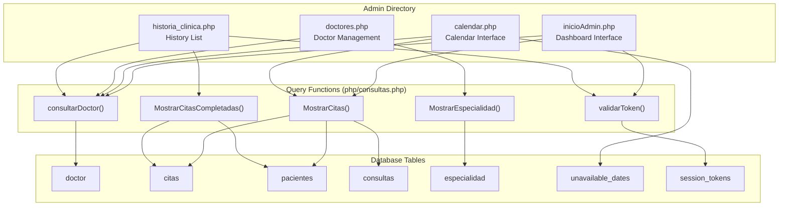
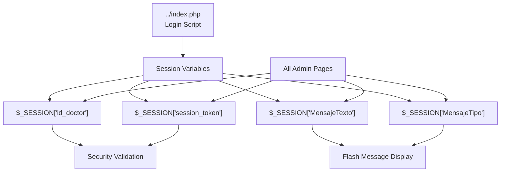

# Interfaces administrativas principales

> **Archivos fuente relevantes**
> * [Admin/calendario.php](https://github.com/axchisan/Consultorio_Emily_Bernal/blob/589034b9/Admin/calendar.php)
> * [Admin/doctores.php](https://github.com/axchisan/Consultorio_Emily_Bernal/blob/589034b9/Admin/doctores.php)
> * [Admin/historia_clinica.php](https://github.com/axchisan/Consultorio_Emily_Bernal/blob/589034b9/Admin/historia_clinica.php)
> * [Admin/inicioAdmin.php](https://github.com/axchisan/Consultorio_Emily_Bernal/blob/589034b9/Admin/inicioAdmin.php)

Este documento ofrece una descripción general de las siete interfaces administrativas principales que conforman la capa de presentación del sistema del Consultorio Emily Bernal. Estas páginas PHP permiten a los médicos autenticados gestionar citas, consultar los historiales de los pacientes, generar informes médicos y configurar los horarios de la clínica.

Para obtener información detallada sobre interfaces específicas, consulte:

* Panel de gestión de citas: [Panel de gestión de citas](/axchisan/Consultorio_Emily_Bernal/2.1-dashboard-appointment-management)
* Programación de calendario: [Calendario y sistema de programación](/axchisan/Consultorio_Emily_Bernal/2.2-calendar-and-scheduling-system)
* Flujos de trabajo de registros de pacientes: [Gestión del historial clínico](/axchisan/Consultorio_Emily_Bernal/2.3-clinical-history-management)
* Entrada de consulta: [Interfaz de consulta y diagnóstico](/axchisan/Consultorio_Emily_Bernal/2.4-consultation-and-diagnosis-interface)
* Administración de personal: [Gestión de médicos](/axchisan/Consultorio_Emily_Bernal/2.5-doctor-management)

Para conocer los mecanismos de autenticación utilizados en todas las interfaces, consulte [Seguridad y autenticación](/axchisan/Consultorio_Emily_Bernal/5-security-and-authentication) . Para la generación de PDF desde estas interfaces, consulte [Sistema de generación de PDF](/axchisan/Consultorio_Emily_Bernal/3-pdf-generation-system) .

## Descripción general de la interfaz

El sistema ofrece siete páginas administrativas distintas ubicadas en el `Admin/`directorio. Cada página cumple una función clínica o administrativa específica dentro del flujo de trabajo de citas a documentación.

### Interfaces primarias

| Interfaz | Archivo | Propósito principal | Tecnologías clave |
| --- | --- | --- | --- |
| Panel | `inicioAdmin.php` | Ver y administrar citas con operaciones CRUD | Tablas de datos, Bootstrap |
| Calendario | `calendar.php` | Visualizar agenda, marcar fechas no disponibles | Calendario completo, jQuery AJAX |
| Lista de Historia Clínica | `historia_clinica.php` | Explorar citas completadas, acceder a registros | Tablas de datos |
| Visor de detalles del historial | `ver_historia.php` | Mostrar información completa del paciente | Tarjetas Bootstrap |
| Editor de informes médicos | `informe.php` | Editar hallazgos clínicos, gestionar imágenes | Carga de archivos, AJAX |
| Formulario de consulta | `realizar_consulta.php` | Ingrese diagnóstico y tratamiento para citas | Procesamiento de formularios |
| Gestión de médicos | `doctores.php` | Añadir nuevos dentistas al sistema | Procesamiento de formularios |

**Fuentes:** [Admin/inicioAdmin.php L1-L165](https://github.com/axchisan/Consultorio_Emily_Bernal/blob/589034b9/Admin/inicioAdmin.php#L1-L165)

 [calendar.php L1-L380](https://github.com/axchisan/Consultorio_Emily_Bernal/blob/589034b9/Admin/calendar.php#L1-L380)

 [Admin/historia_clinica.php L1-L141](https://github.com/axchisan/Consultorio_Emily_Bernal/blob/589034b9/Admin/historia_clinica.php#L1-L141)

 [Admin/doctores.php L1-L192](https://github.com/axchisan/Consultorio_Emily_Bernal/blob/589034b9/Admin/doctores.php#L1-L192)

### Relaciones de interfaz



**Diagrama: Flujo de navegación entre interfaces administrativas**

Este diagrama ilustra cómo los médicos navegan entre las siete interfaces administrativas. Todas las sesiones autenticadas comienzan en `inicioAdmin.php`el Panel de Control, que funciona como centro central. Desde allí, la barra lateral de navegación proporciona acceso a flujos de trabajo paralelos (Calendario, Doctores, Historial), mientras que los botones de acción en línea activan transiciones específicas del flujo de trabajo con parámetros URL que contienen contexto ( `id_cita`, `id_paciente`).

**Fuentes:** [Admin/inicioAdmin.php L163-L167](https://github.com/axchisan/Consultorio_Emily_Bernal/blob/589034b9/Admin/inicioAdmin.php#L163-L167)

 [Admin/inicioAdmin.php L128-L130](https://github.com/axchisan/Consultorio_Emily_Bernal/blob/589034b9/Admin/inicioAdmin.php#L128-L130)

 [Admin/historia_clinica.php L111-L118](https://github.com/axchisan/Consultorio_Emily_Bernal/blob/589034b9/Admin/historia_clinica.php#L111-L118)

## Patrones arquitectónicos comunes

Las siete interfaces administrativas comparten una estructura de código y patrones arquitectónicos consistentes, lo que garantiza la mantenibilidad y la uniformidad de seguridad.

### Patrón de estructura de archivos

Cada archivo PHP administrativo sigue esta plantilla estructural:

```mermaid
flowchart TD

Start["File Start<br>"]
SessionStart["session_start()"]
Includes["include_once('../php/conexionDB.php')<br>include_once('../php/consultas.php')"]
SessionCheck["Check $_SESSION['id_doctor']<br>Check $_SESSION['session_token']"]
TokenValidation["validarToken($link, $vUsuario, 'Doctor', $token)"]
DataQuery["consultarDoctor($link, $vUsuario)<br>Query page-specific data"]
HTMLStart[""]
Sidebar["Sidebar Navigation<br>"]
MainContent["Main Content<br>"]
Scripts["JavaScript Libraries<br>Page-specific scripts"]
Close["mysqli_close($link)<br>?>"]
Redirect["header('Location: ../index.php')"]

Start --> SessionStart
SessionStart --> Includes
Includes --> SessionCheck
SessionCheck --> TokenValidation
SessionCheck --> Redirect
TokenValidation --> DataQuery
TokenValidation --> Redirect
DataQuery --> HTMLStart
HTMLStart --> Sidebar
Sidebar --> MainContent
MainContent --> Scripts
Scripts --> Close
```

**Diagrama: Estructura de página PHP estándar**

**Fuentes:** [Admin/inicioAdmin.php L1-L28](https://github.com/axchisan/Consultorio_Emily_Bernal/blob/589034b9/Admin/inicioAdmin.php#L1-L28)

 [Admin/historia_clinica.php L1-L28](https://github.com/axchisan/Consultorio_Emily_Bernal/blob/589034b9/Admin/historia_clinica.php#L1-L28)

 [calendar.php L1-L22](https://github.com/axchisan/Consultorio_Emily_Bernal/blob/589034b9/Admin/calendar.php#L1-L22)

 [Admin/doctores.php L1-L17](https://github.com/axchisan/Consultorio_Emily_Bernal/blob/589034b9/Admin/doctores.php#L1-L17)

### Implementación de la validación de sesión

Todas las páginas implementan una comprobación de seguridad de dos niveles. El patrón básico verifica la existencia de la sesión:

**Comprobación básica de sesión** (utilizada en[calendar.php L8-L13](https://github.com/axchisan/Consultorio_Emily_Bernal/blob/589034b9/Admin/calendar.php#L8-L13)

y[Admin/doctores.php L7-L12](https://github.com/axchisan/Consultorio_Emily_Bernal/blob/589034b9/Admin/doctores.php#L7-L12)

):

```
if (!isset($_SESSION['id_doctor'])) {
    $_SESSION['MensajeTexto'] = "Error acceso al sistema no registrado.";
    $_SESSION['MensajeTipo'] = "p-3 mb-2 bg-danger text-white";
    header("Location: ../index.php");
    exit;
}
```

**Validación de token mejorada** (utilizada en[Admin/inicioAdmin.php L7-L24](https://github.com/axchisan/Consultorio_Emily_Bernal/blob/589034b9/Admin/inicioAdmin.php#L7-L24)

y[Admin/historia_clinica.php L7-L24](https://github.com/axchisan/Consultorio_Emily_Bernal/blob/589034b9/Admin/historia_clinica.php#L7-L24)

):

```
if (!isset($_SESSION['id_doctor']) || !isset($_SESSION['session_token'])) {
    // ... redirect
}
if (!validarToken($link, $vUsuario, 'Doctor', $_SESSION['session_token'])) {
    session_unset();
    session_destroy();
    // ... redirect with concurrent login message
}
```

Esta `validarToken()`función impide inicios de sesión simultáneos verificando que el token de sesión coincida con el almacenado en la base de datos. Para más información sobre la validación de tokens, consulte [Sistema de Validación de Tokens](/axchisan/Consultorio_Emily_Bernal/5.2-token-validation-system) .

**Fuentes:** [Admin/inicioAdmin.php L7-L24](https://github.com/axchisan/Consultorio_Emily_Bernal/blob/589034b9/Admin/inicioAdmin.php#L7-L24)

 [Admin/historia_clinica.php L7-L24](https://github.com/axchisan/Consultorio_Emily_Bernal/blob/589034b9/Admin/historia_clinica.php#L7-L24)

 [calendar.php L8-L13](https://github.com/axchisan/Consultorio_Emily_Bernal/blob/589034b9/Admin/calendar.php#L8-L13)

 [Admin/doctores.php L7-L12](https://github.com/axchisan/Consultorio_Emily_Bernal/blob/589034b9/Admin/doctores.php#L7-L12)

### Patrón de recuperación de datos

Todas las interfaces utilizan funciones auxiliares `php/consultas.php`para recuperar datos:

| Función | Objetivo | Uso |
| --- | --- | --- |
| `consultarDoctor($link, $id_doctor)` | Obtener el perfil del médico que ha iniciado sesión | [inicioAdmin.php L26](https://github.com/axchisan/Consultorio_Emily_Bernal/blob/589034b9/inicioAdmin.php#L26-L26) <br>  [calendar.php L18](https://github.com/axchisan/Consultorio_Emily_Bernal/blob/589034b9/calendar.php#L18-L18) <br>  [historia_cl L26](https://github.com/axchisan/Consultorio_Emily_Bernal/blob/589034b9/historia_clinica.php#L26-L26) |
| `MostrarCitas($link, $id_doctor)` | Recuperar citas pendientes para el médico | [inicioAdmin.php L27](https://github.com/axchisan/Consultorio_Emily_Bernal/blob/589034b9/inicioAdmin.php#L27-L27) |
| `MostrarCitasCompletadas($link, $id_doctor)` | Recuperar citas completadas | [historia_cl L27](https://github.com/axchisan/Consultorio_Emily_Bernal/blob/589034b9/historia_clinica.php#L27-L27) |
| `MostrarEspecialidad($link)` | Lista de especialidades para el menú desplegable | [doctores.php L16](https://github.com/axchisan/Consultorio_Emily_Bernal/blob/589034b9/doctores.php#L16-L16) |

Estas funciones encapsulan consultas SQL y devuelven conjuntos de resultados que las páginas iteran. Para obtener documentación completa sobre las funciones de consulta, consulte [Funciones de consulta y abstracción de bases de datos](/axchisan/Consultorio_Emily_Bernal/4.4-query-functions-and-database-abstraction) .

**Fuentes:** [Admin/inicioAdmin.php L26-L27](https://github.com/axchisan/Consultorio_Emily_Bernal/blob/589034b9/Admin/inicioAdmin.php#L26-L27)

 [Admin/historia_clinica.php L26-L27](https://github.com/axchisan/Consultorio_Emily_Bernal/blob/589034b9/Admin/historia_clinica.php#L26-L27)

 [calendar.php L18](https://github.com/axchisan/Consultorio_Emily_Bernal/blob/589034b9/Admin/calendar.php#L18-L18)

 [Admin/doctores.php L16](https://github.com/axchisan/Consultorio_Emily_Bernal/blob/589034b9/Admin/doctores.php#L16-L16)

## Componente de navegación de la barra lateral

Las siete interfaces comparten una estructura de navegación de barra lateral idéntica que proporciona acceso consistente a los flujos de trabajo principales.

### Estructura de navegación

```mermaid
flowchart TD

Sidebar[""]
Profile["Profile Section<br>Doctor photo + name"]
NavMenu["Navigation Menu<br>"]
Citas["Citas<br>"]
Dentistas["Dentistas<br>"]
Calendario["Calendario<br>"]
Historia["Historia Clínica<br>"]
Cerrar["Cerrar sesión<br>"]
DashboardPage["DashboardPage"]
DoctoresPage["DoctoresPage"]
CalendarPage["CalendarPage"]
HistoriaPage["HistoriaPage"]
Logout["Logout"]

Sidebar --> Profile
Sidebar --> NavMenu
NavMenu --> Citas
NavMenu --> Dentistas
NavMenu --> Calendario
NavMenu --> Historia
NavMenu --> Cerrar
Citas --> DashboardPage
Dentistas --> DoctoresPage
Calendario --> CalendarPage
Historia --> HistoriaPage
Cerrar --> Logout
```

**Diagrama: Estructura del componente de navegación de la barra lateral**

La barra lateral se representa del lado del servidor en PHP.[Admin/inicioAdmin.php L51-L77](https://github.com/axchisan/Consultorio_Emily_Bernal/blob/589034b9/Admin/inicioAdmin.php#L51-L77)

 [calendar.php L139-L171](https://github.com/axchisan/Consultorio_Emily_Bernal/blob/589034b9/Admin/calendar.php#L139-L171)

 [Admin/historia_clinica.php L45-L71](https://github.com/axchisan/Consultorio_Emily_Bernal/blob/589034b9/Admin/historia_clinica.php#L45-L71)

y[Admin/doctores.php L52-L78](https://github.com/axchisan/Consultorio_Emily_Bernal/blob/589034b9/Admin/doctores.php#L52-L78)

con idéntico marcado.

### Implementación de la sección de perfil

La sección de perfil muestra información específica del médico obtenida a través de `consultarDoctor()`:

**Lógica de avatar basada en el género** ([Admin/inicioAdmin.php L59-L63](https://github.com/axchisan/Consultorio_Emily_Bernal/blob/589034b9/Admin/inicioAdmin.php#L59-L63)

):

```php
<?php if ($row['sexo'] == 'Masculino') { ?>
    
<?php } elseif ($row['sexo'] == 'Femenino') { ?>
    
<?php } ?>
```

El nombre completo del médico se construye a partir de los campos de la base de datos: `$row['nombreD'] . ' ' . $row['apellido']`([Admin/inicioAdmin.php L64](https://github.com/axchisan/Consultorio_Emily_Bernal/blob/589034b9/Admin/inicioAdmin.php#L64-L64)

).

**Fuentes:** [Admin/inicioAdmin.php L51-L77](https://github.com/axchisan/Consultorio_Emily_Bernal/blob/589034b9/Admin/inicioAdmin.php#L51-L77)

 [calendar.php L139-L171](https://github.com/axchisan/Consultorio_Emily_Bernal/blob/589034b9/Admin/calendar.php#L139-L171)

 [Admin/historia_clinica.php L45-L71](https://github.com/axchisan/Consultorio_Emily_Bernal/blob/589034b9/Admin/historia_clinica.php#L45-L71)

 [Admin/doctores.php L52-L78](https://github.com/axchisan/Consultorio_Emily_Bernal/blob/589034b9/Admin/doctores.php#L52-L78)

## Estructura del diseño del contenido

Each interface uses Bootstrap's responsive grid system with a consistent two-column layout: the sidebar and main content area.

### Layout Pattern

```mermaid
flowchart TD

Body[""]
Aside[""]
Main[""]
SiteSection[""]
Container[""]
Row[""]
Col[""]
ContentBox[""]
Breadcrumb[""]
PanelBody[""]
Content["Page-specific content<br>Tables, Forms, Calendar, etc."]

Body --> Aside
Body --> Main
Main --> SiteSection
SiteSection --> Container
Container --> Row
Row --> Col
Col --> ContentBox
ContentBox --> Breadcrumb
ContentBox --> PanelBody
PanelBody --> Content
```

**Diagram: Bootstrap Layout Hierarchy**

This structure is implemented identically across:

* [Admin/inicioAdmin.php L79-L143](https://github.com/axchisan/Consultorio_Emily_Bernal/blob/589034b9/Admin/inicioAdmin.php#L79-L143)
* [Admin/calendar.php L172-L227](https://github.com/axchisan/Consultorio_Emily_Bernal/blob/589034b9/Admin/calendar.php#L172-L227)
* [Admin/historia_clinica.php L73-L131](https://github.com/axchisan/Consultorio_Emily_Bernal/blob/589034b9/Admin/historia_clinica.php#L73-L131)
* [Admin/doctores.php L80-L174](https://github.com/axchisan/Consultorio_Emily_Bernal/blob/589034b9/Admin/doctores.php#L80-L174)

### Breadcrumb Navigation

Each page includes breadcrumb navigation showing the user's location in the interface hierarchy:

**Dashboard Breadcrumb** ([Admin/inicioAdmin.php L85-L87](https://github.com/axchisan/Consultorio_Emily_Bernal/blob/589034b9/Admin/inicioAdmin.php#L85-L87)

):

```xml
<ol class="breadcrumb bg-white">
    <li class="breadcrumb-item active">Inicio</li>
</ol>
```

**Secondary Page Breadcrumb** ([Admin/historia_clinica.php L79-L82](https://github.com/axchisan/Consultorio_Emily_Bernal/blob/589034b9/Admin/historia_clinica.php#L79-L82)

):

```xml
<ol class="breadcrumb bg-white">
    <li class="breadcrumb-item"><a href="./inicioAdmin.php">Inicio</a></li>
    <li class="breadcrumb-item active">Historia Clínica</li>
</ol>
```

**Sources:** [Admin/inicioAdmin.php L85-L87](https://github.com/axchisan/Consultorio_Emily_Bernal/blob/589034b9/Admin/inicioAdmin.php#L85-L87)

 [Admin/historia_clinica.php L79-L82](https://github.com/axchisan/Consultorio_Emily_Bernal/blob/589034b9/Admin/historia_clinica.php#L79-L82)

 [Admin/calendar.php L179-L186](https://github.com/axchisan/Consultorio_Emily_Bernal/blob/589034b9/Admin/calendar.php#L179-L186)

 [Admin/doctores.php L86-L89](https://github.com/axchisan/Consultorio_Emily_Bernal/blob/589034b9/Admin/doctores.php#L86-L89)

## Data Display Components

Three interfaces use DataTables for presenting tabular data with search, sort, and pagination capabilities.

### DataTables Integration

```mermaid
flowchart TD

HTMLTable[""]
DataTablesLib["DataTables Library<br>jquery.dataTables.min.js"]
Config["datatable.js<br>Configuration"]
PHP["PHP Loop<br>mysqli_fetch_array()"]
TableBody["rows"]

HTMLTable --> DataTablesLib
DataTablesLib --> Config
PHP --> TableBody
TableBody --> HTMLTable
Config --> HTMLTable
```

**Diagram: DataTables Implementation Pattern**

**DataTables Usage:**

| Interface | Table ID | Columns | Data Source |
| --- | --- | --- | --- |
| `inicioAdmin.php` | `#example` | 10 columns (name, age, consultation type, date, time, status, diagnosis, actions) | `MostrarCitas($link, $vUsuario)` |
| `historia_clinica.php` | `#example` | 9 columns (name, age, consultation, date, time, status, diagnosis, view, download) | `MostrarCitasCompletadas($link, $vUsuario)` |

**Table Initialization** ([Admin/inicioAdmin.php L103-L134](https://github.com/axchisan/Consultorio_Emily_Bernal/blob/589034b9/Admin/inicioAdmin.php#L103-L134)

):

```php
<table id="example" class="table table-striped nowrap responsive">
    <thead>
        <tr>
            <th>Nombre completo</th>
            <th>Edad</th>
            <!-- ... more columns ... -->
        </tr>
    </thead>
    <tbody>
        <?php while ($row = mysqli_fetch_array($resultadoCitas, MYSQLI_ASSOC)) { ?>
            <tr>
                <td><?php echo $row['nombre'] . ' ' . $row['apellido']; ?></td>
                <!-- ... more cells ... -->
            </tr>
        <?php } ?>
    </tbody>
</table>
```

**Required Scripts** ([Admin/inicioAdmin.php L157-L163](https://github.com/axchisan/Consultorio_Emily_Bernal/blob/589034b9/Admin/inicioAdmin.php#L157-L163)

):

* `jquery.js`
* `jquery.dataTables.min.js`
* `dataTables.responsive.min.js`
* `datatable.js` (configuration)

**Sources:** [Admin/inicioAdmin.php L103-L134](https://github.com/axchisan/Consultorio_Emily_Bernal/blob/589034b9/Admin/inicioAdmin.php#L103-L134)

 [Admin/inicioAdmin.php L157-L163](https://github.com/axchisan/Consultorio_Emily_Bernal/blob/589034b9/Admin/inicioAdmin.php#L157-L163)

 [Admin/historia_clinica.php L87-L122](https://github.com/axchisan/Consultorio_Emily_Bernal/blob/589034b9/Admin/historia_clinica.php#L87-L122)

 [Admin/historia_clinica.php L133-L139](https://github.com/axchisan/Consultorio_Emily_Bernal/blob/589034b9/Admin/historia_clinica.php#L133-L139)

## Flash Messaging System

All interfaces implement a consistent session-based flash messaging system for displaying success/error notifications following the Post-Redirect-Get pattern.

### Message Flow



**Diagram: Session-Based Flash Messaging Flow**

### Implementation Pattern

**Message Display** ([Admin/doctores.php L20-L34](https://github.com/axchisan/Consultorio_Emily_Bernal/blob/589034b9/Admin/doctores.php#L20-L34)

):

```php
<?php if (isset($_SESSION['MensajeTexto']) && isset($_SESSION['MensajeTipo'])): ?>
    <div class="<?php echo $_SESSION['MensajeTipo']; ?>" id="mensaje">
        <?php 
        echo $_SESSION['MensajeTexto'];
        unset($_SESSION['MensajeTexto']);
        unset($_SESSION['MensajeTipo']);
        ?>
    </div>
    <script>
        setTimeout(function() {
            document.getElementById('mensaje').style.display = 'none';
        }, 5000);
    </script>
<?php endif; ?>
```

**Message Types:**

| Class | Purpose | Usage |
| --- | --- | --- |
| `p-3 mb-2 bg-success text-white` | Success notifications | Record saved, operation completed |
| `p-3 mb-2 bg-danger text-white` | Error notifications | Session invalid, operation failed |
| `p-3 mb-2 bg-warning text-white` | Warning notifications | Validation issues |

**Sources:** [Admin/doctores.php L20-L34](https://github.com/axchisan/Consultorio_Emily_Bernal/blob/589034b9/Admin/doctores.php#L20-L34)

 [Admin/inicioAdmin.php L93-L101](https://github.com/axchisan/Consultorio_Emily_Bernal/blob/589034b9/Admin/inicioAdmin.php#L93-L101)

 [Admin/calendar.php L9-L10](https://github.com/axchisan/Consultorio_Emily_Bernal/blob/589034b9/Admin/calendar.php#L9-L10)

 [Admin/historia_clinica.php L8-L9](https://github.com/axchisan/Consultorio_Emily_Bernal/blob/589034b9/Admin/historia_clinica.php#L8-L9)

## Form Processing Interfaces

Two interfaces focus primarily on form submission: `doctores.php` (doctor registration) and `realizar_consulta.php` (consultation diagnosis).

### Doctor Registration Form

The doctor management interface ([Admin/doctores.php L105-L165](https://github.com/axchisan/Consultorio_Emily_Bernal/blob/589034b9/Admin/doctores.php#L105-L165)

) submits to `../crud/registro_INSERT.php?opciones=INSDOCT`:

**Form Fields:**

* Personal: `name`, `apellido`, `nacimiento`, `sexo`
* Contact: `correo`, `cell`
* Credentials: `clave`, `clave2` (password confirmation)
* Professional: `especialidad` (FK to `especialidad` table)

**Specialty Dropdown Population** ([Admin/doctores.php L150-L154](https://github.com/axchisan/Consultorio_Emily_Bernal/blob/589034b9/Admin/doctores.php#L150-L154)

):

```php
<select class="form-control" name="especialidad" id="especialidad" required>
    <?php while ($row = mysqli_fetch_array($resultado, MYSQLI_ASSOC)) { ?>
        <option value="<?php echo $row['id_especialidad']; ?>">
            <?php echo $row['tipo']; ?>
        </option>
    <?php } ?>
</select>
```

The form data is processed by `crud/registro_INSERT.php` which handles password hashing and database insertion. For database operations, see [Core Data Model](/axchisan/Consultorio_Emily_Bernal/4.1-core-data-model).

**Sources:** [Admin/doctores.php L105-L165](https://github.com/axchisan/Consultorio_Emily_Bernal/blob/589034b9/Admin/doctores.php#L105-L165)

 [Admin/doctores.php L16](https://github.com/axchisan/Consultorio_Emily_Bernal/blob/589034b9/Admin/doctores.php#L16-L16)

 [Admin/doctores.php L150-L154](https://github.com/axchisan/Consultorio_Emily_Bernal/blob/589034b9/Admin/doctores.php#L150-L154)

## JavaScript Libraries and Dependencies

Each interface loads specific JavaScript libraries based on its functionality requirements.

### Library Dependencies by Interface

| Interface | Core Libraries | Specialized Libraries |
| --- | --- | --- |
| `inicioAdmin.php` | jQuery, Bootstrap | DataTables (jquery.dataTables.min.js, dataTables.responsive.min.js) |
| `historia_clinica.php` | jQuery, Bootstrap | DataTables (jquery.dataTables.min.js, dataTables.responsive.min.js) |
| `calendar.php` | jQuery, Bootstrap, Popper.js | FullCalendar (moment.min.js, fullcalendar.min.js, locale/es.js) |
| `doctores.php` | jQuery, Bootstrap | jQuery UI (jquery-ui.js) |

**FullCalendar Loading Sequence** ([Admin/calendar.php L76-L81](https://github.com/axchisan/Consultorio_Emily_Bernal/blob/589034b9/Admin/calendar.php#L76-L81)

):

```xml
<script src="https://code.jquery.com/jquery-3.2.1.js"></script>
<script src="https://cdnjs.cloudflare.com/ajax/libs/popper.js/1.12.9/umd/popper.min.js"></script>
<script src="https://maxcdn.bootstrapcdn.com/bootstrap/4.0.0/js/bootstrap.min.js"></script>
<script type='text/javascript' src='../src/js/lib/FullCalendar/moment.min.js'></script>
<script type='text/javascript' src='../src/js/lib/FullCalendar/fullcalendar.min.js'></script>
<script type='text/javascript' src='../src/js/lib/FullCalendar/locale/es.js'></script>
```

All pages load `../src/js/admin.js` ([Admin/inicioAdmin.php L159](https://github.com/axchisan/Consultorio_Emily_Bernal/blob/589034b9/Admin/inicioAdmin.php#L159-L159)

) for common administrative functionality.

**Sources:** [Admin/calendar.php L76-L81](https://github.com/axchisan/Consultorio_Emily_Bernal/blob/589034b9/Admin/calendar.php#L76-L81)

 [Admin/inicioAdmin.php L157-L163](https://github.com/axchisan/Consultorio_Emily_Bernal/blob/589034b9/Admin/inicioAdmin.php#L157-L163)

 [Admin/historia_clinica.php L133-L139](https://github.com/axchisan/Consultorio_Emily_Bernal/blob/589034b9/Admin/historia_clinica.php#L133-L139)

 [Admin/doctores.php L176-L179](https://github.com/axchisan/Consultorio_Emily_Bernal/blob/589034b9/Admin/doctores.php#L176-L179)

## Interface-Specific Features

Si bien las siete interfaces comparten patrones comunes, cada una implementa una funcionalidad especializada.

### Gestión de fechas del calendario

La interfaz del calendario ([Admin/calendario.php](https://github.com/axchisan/Consultorio_Emily_Bernal/blob/589034b9/Admin/calendar.php)

) implementa un sistema basado en AJAX para marcar fechas como no disponibles:

**Consulta de fechas no disponibles** ([calendar.php L24-L32](https://github.com/axchisan/Consultorio_Emily_Bernal/blob/589034b9/Admin/calendar.php#L24-L32)

):

```sql
$stmtUnavailable = $link->prepare("SELECT unavailable_date FROM unavailable_dates WHERE id_doctor = ?");
$stmtUnavailable->bind_param("i", $vUsuario);
$stmtUnavailable->execute();
$resultadoUnavailable = $stmtUnavailable->get_result();
$unavailableDates = [];
while ($rowUnavailable = $resultadoUnavailable->fetch_assoc()) {
    $unavailableDates[] = $rowUnavailable['unavailable_date'];
}
```

La matriz se pasa a JavaScript para la representación de FullCalendar ([calendar.php L248](https://github.com/axchisan/Consultorio_Emily_Bernal/blob/589034b9/Admin/calendar.php#L248-L248)

).

**Solicitud de alternancia AJAX** ([calendar.php L312-L319](https://github.com/axchisan/Consultorio_Emily_Bernal/blob/589034b9/Admin/calendar.php#L312-L319)

):

```php
$.ajax({
    url: '../php/toggle_unavailable.php',
    type: 'POST',
    data: {
        date: dateStr,
        id_doctor: <?php echo $vUsuario; ?>,
        action: action  // 'add', 'remove', or 'cancel'
    },
    // ... success/error handlers
});
```

Para conocer la funcionalidad detallada del calendario, consulte [Sistema de calendario y programación](/axchisan/Consultorio_Emily_Bernal/2.2-calendar-and-scheduling-system) .

**Fuentes:** [calendar.php L24-L32](https://github.com/axchisan/Consultorio_Emily_Bernal/blob/589034b9/Admin/calendar.php#L24-L32)

 [calendar.php L248](https://github.com/axchisan/Consultorio_Emily_Bernal/blob/589034b9/Admin/calendar.php#L248-L248)

 [calendar.php L312-L368](https://github.com/axchisan/Consultorio_Emily_Bernal/blob/589034b9/Admin/calendar.php#L312-L368)

### Acciones de nombramiento

El tablero de instrumentos ([Admin/inicioAdmin.php L128-L130](https://github.com/axchisan/Consultorio_Emily_Bernal/blob/589034b9/Admin/inicioAdmin.php#L128-L130)

) proporciona tres acciones en línea por fila de cita:

**Botones de acción** ([Admin/inicioAdmin.php L128-L130](https://github.com/axchisan/Consultorio_Emily_Bernal/blob/589034b9/Admin/inicioAdmin.php#L128-L130)

):

```php
<td><a href="./realizar_consulta.php?accion=UDT&id=<?php echo $row['id_cita']; ?>">
    <i class="fas fa-edit"></i></a></td>
<td><a href="./informe.php?id=<?php echo $row['id_paciente']; ?>">
    <i class="fas fa-file-alt"></i></a></td>
<td><a href="../crud/realizar_consultasUPDATE.php?accion=DLT&id=<?php echo $row['id_cita']; ?>&estado=<?php echo $row['estado']; ?>" 
    onclick="return confirmation()"><i class="fas fa-trash"></i></a></td>
```

**Confirmación de JavaScript** ([Admin/inicioAdmin.php L45-L47](https://github.com/axchisan/Consultorio_Emily_Bernal/blob/589034b9/Admin/inicioAdmin.php#L45-L47)

):

```javascript
function confirmation() {
    return confirm("¿Realmente desea eliminar esta cita?");
}
```

Estas acciones permiten editar consultas ( `realizar_consulta.php`), editar informes médicos ( `informe.php`) o activar la eliminación mediante `realizar_consultasUPDATE.php`.

**Fuentes:** [Admin/inicioAdmin.php L128-L130](https://github.com/axchisan/Consultorio_Emily_Bernal/blob/589034b9/Admin/inicioAdmin.php#L128-L130)

 [Admin/inicioAdmin.php L45-L47](https://github.com/axchisan/Consultorio_Emily_Bernal/blob/589034b9/Admin/inicioAdmin.php#L45-L47)

### Acciones de Historia Clínica

La lista de historia clínica ([Admin/historia_clinica.php L111-L118](https://github.com/axchisan/Consultorio_Emily_Bernal/blob/589034b9/Admin/historia_clinica.php#L111-L118)

) proporciona dos acciones por cada cita completada:

**Ver y descargar acciones** ([Admin/historia_clinica.php L111-L118](https://github.com/axchisan/Consultorio_Emily_Bernal/blob/589034b9/Admin/historia_clinica.php#L111-L118)

):

```php
<td><a class="btn btn-info" 
    href="ver_historia.php?id_cita=<?php echo $row['id_cita']; ?>&id_paciente=<?php echo $row['id_paciente']; ?>">
    Ver</a></td>
<td>
    <form action="descargar_historia.php" method="POST">
        <input type="hidden" name="id_cita" value="<?php echo $row['id_cita']; ?>">
        <input type="hidden" name="id_paciente" value="<?php echo $row['id_paciente']; ?>">
        <button type="submit" class="btn btn-success">Descargar</button>
    </form>
</td>
```

El botón "Ver" lleva al `ver_historia.php`visor de detalles, mientras que "Descargar" envía un mensaje POST al `descargar_historia.php`generador de PDF. Para obtener más información sobre la generación de PDF, consulte [el Generador de PDF de Historia Clínica](/axchisan/Consultorio_Emily_Bernal/3.1-clinical-history-pdf-generator) .

**Fuentes:** [Admin/historia_clinica.php L111-L118](https://github.com/axchisan/Consultorio_Emily_Bernal/blob/589034b9/Admin/historia_clinica.php#L111-L118)

## Mapeo de código a interfaz

Esta sección vincula los nombres de entidades de código con sus roles en la interfaz de usuario.

### Mapeo de archivos a funciones



**Diagrama: Relaciones entre entidades de código en interfaces administrativas**

**Fuentes:** [Admin/inicioAdmin.php L26-L27](https://github.com/axchisan/Consultorio_Emily_Bernal/blob/589034b9/Admin/inicioAdmin.php#L26-L27)

 [calendar.php L18-L35](https://github.com/axchisan/Consultorio_Emily_Bernal/blob/589034b9/Admin/calendar.php#L18-L35)

 [Admin/historia_clinica.php L26-L27](https://github.com/axchisan/Consultorio_Emily_Bernal/blob/589034b9/Admin/historia_clinica.php#L26-L27)

 [Admin/doctores.php L15-L16](https://github.com/axchisan/Consultorio_Emily_Bernal/blob/589034b9/Admin/doctores.php#L15-L16)

### Uso de variables de sesión



**Diagrama: Flujo de variables de sesión en interfaces administrativas**

**Propósitos de las variables de sesión:**

| Variable | Tipo | Objetivo | Ahorrar | Leer por |
| --- | --- | --- | --- | --- |
| `$_SESSION['id_doctor']` | entero | Clave principal del médico autenticado | Script de inicio de sesión | Todas las páginas de administración |
| `$_SESSION['session_token']` | cadena | Token de prevención de inicio de sesión simultáneo | Script de inicio de sesión | Páginas con validación de token |
| `$_SESSION['MensajeTexto']` | cadena | Contenido del mensaje Flash | Scripts CRUD | Todas las páginas de administración |
| `$_SESSION['MensajeTipo']` | cadena | Clase CSS de Bootstrap para el estilo de los mensajes | Scripts CRUD | Todas las páginas de administración |

**Fuentes:** [Admin/inicioAdmin.php L7-L24](https://github.com/axchisan/Consultorio_Emily_Bernal/blob/589034b9/Admin/inicioAdmin.php#L7-L24)

 [calendar.php L8-L13](https://github.com/axchisan/Consultorio_Emily_Bernal/blob/589034b9/Admin/calendar.php#L8-L13)

 [Admin/historia_clinica.php L7-L24](https://github.com/axchisan/Consultorio_Emily_Bernal/blob/589034b9/Admin/historia_clinica.php#L7-L24)

 [Admin/doctores.php L7-L12](https://github.com/axchisan/Consultorio_Emily_Bernal/blob/589034b9/Admin/doctores.php#L7-L12)

## Resumen

Las siete interfaces administrativas principales conforman la capa principal del sistema, orientada al usuario, y proporcionan a los médicos herramientas integrales para la gestión de citas, la programación, los historiales de pacientes y la documentación clínica. Todas las interfaces comparten:

1. **Autenticación consistente** mediante validación de sesión y token
2. **Navegación unificada** a través del componente de barra lateral
3. **Diseño basado en Bootstrap** con diseño responsivo
4. **Mensajería flash** para retroalimentación de la operación
5. **Abstracción de datos** mediante `consultas.php`funciones auxiliares

Cada interfaz se especializa en un flujo de trabajo específico manteniendo al mismo tiempo la consistencia arquitectónica, lo que permite la capacidad de mantenimiento y proporciona una experiencia de usuario coherente.

**Fuentes:** [Admin/inicioAdmin.php L1-L165](https://github.com/axchisan/Consultorio_Emily_Bernal/blob/589034b9/Admin/inicioAdmin.php#L1-L165)

 [calendar.php L1-L380](https://github.com/axchisan/Consultorio_Emily_Bernal/blob/589034b9/Admin/calendar.php#L1-L380)

 [Admin/historia_clinica.php L1-L141](https://github.com/axchisan/Consultorio_Emily_Bernal/blob/589034b9/Admin/historia_clinica.php#L1-L141)

 [Admin/doctores.php L1-L192](https://github.com/axchisan/Consultorio_Emily_Bernal/blob/589034b9/Admin/doctores.php#L1-L192)