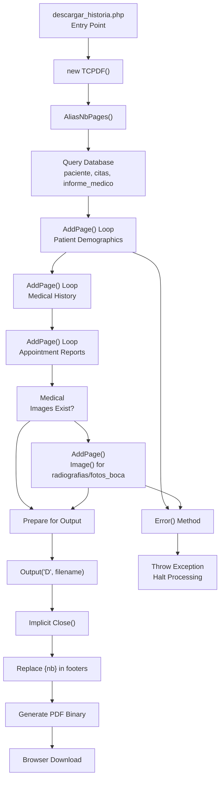

# Manejo de errores y utilidades de TCPDF

> **Archivos fuente relevantes**
> * [Reportes/fpdf/Nueva carpeta/doc/aliasnbpages.htm](https://github.com/axchisan/Consultorio_Emily_Bernal/blob/589034b9/Reportes/fpdf/Nueva carpeta/doc/aliasnbpages.htm)
> * [Reportes/fpdf/Nueva carpeta/doc/close.htm](https://github.com/axchisan/Consultorio_Emily_Bernal/blob/589034b9/Reportes/fpdf/Nueva carpeta/doc/close.htm)
> * [Reportes/fpdf/Nueva carpeta/doc/error.htm](https://github.com/axchisan/Consultorio_Emily_Bernal/blob/589034b9/Reportes/fpdf/Nueva carpeta/doc/error.htm)

## Propósito y alcance

Este documento describe los métodos de utilidad TCPDF para la gestión de errores, la numeración de páginas y la gestión del ciclo de vida de los documentos. Estos métodos proporcionan una funcionalidad esencial para la generación robusta de PDF y son utilizados por los generadores de PDF del sistema ( [9.1](/axchisan/Consultorio_Emily_Bernal/9.1-tcpdf-core-methods) , [9.2](/axchisan/Consultorio_Emily_Bernal/9.2-tcpdf-header-and-footer-customization) ).

Los tres métodos de utilidad principales que se cubren son:

* `Error()`- Manejo de errores fatales y gestión de excepciones
* `AliasNbPages()`- Reemplazo del marcador de posición del número de página
* `Close()`- Finalización y cierre de documentos

Para métodos básicos de TCPDF como `AddPage`, `SetFont`, y `Cell`, consulte [la sección 9.1](/axchisan/Consultorio_Emily_Bernal/9.1-tcpdf-core-methods) . Para personalizar encabezados y pies de página con estas utilidades, consulte [la sección 9.2](/axchisan/Consultorio_Emily_Bernal/9.2-tcpdf-header-and-footer-customization) .

---

## Sistema de manejo de errores

### Método Error()

`Error()`TCPDF invoca automáticamente el método cuando se produce un error fatal durante la generación del PDF. Genera una excepción con el mensaje de error proporcionado y finaliza el procesamiento del documento.

**Firma del método:**

```
Error(string $msg)
```

**Parámetros:**

| Parámetro | Tipo | Descripción |
| --- | --- | --- |
| `msg` | cadena | El mensaje de error que se mostrará |

**Comportamiento:**

* Se llama automáticamente en caso de errores fatales (parámetros no válidos, errores de acceso a archivos, recursos dañados)
* Lanza una excepción y detiene la ejecución.
* Se puede anular en subclases para el manejo de errores personalizado
* Los métodos de anulación nunca deben regresar normalmente o el documento se dañará

Fuentes:[Reportes/fpdf/Nueva L1-L27](https://github.com/axchisan/Consultorio_Emily_Bernal/blob/589034b9/Reportes/fpdf/Nueva carpeta/doc/error.htm#L1-L27)

### Flujo de manejo de errores


Fuentes:[Reportes/fpdf/Nueva L12-L15](https://github.com/axchisan/Consultorio_Emily_Bernal/blob/589034b9/Reportes/fpdf/Nueva carpeta/doc/error.htm#L12-L15)

### Escenarios de error comunes

**Typical errors that trigger `Error()` calls:**

| Scenario | Error Message | Cause |
| --- | --- | --- |
| Invalid font | "Could not include font definition file" | Missing font file or incorrect path |
| Missing image | "Image file has no extension" | Image path without file extension |
| Invalid page size | "Incorrect page size" | Invalid dimensions passed to AddPage |
| Corrupted resource | "Error while reading image" | Corrupted image file |
| Missing file | "Unable to create output file" | Write permission issues |

---

## Page Numbering with AliasNbPages

### AliasNbPages() Method

The `AliasNbPages()` method defines a placeholder string that will be replaced with the total page count when the document is closed. This enables dynamic page numbering like "Page 1 of 10" in headers or footers.

**Method Signature:**

```
AliasNbPages([string $alias])
```

**Parameters:**

| Parameter | Type | Default | Description |
| --- | --- | --- | --- |
| `alias` | string | `{nb}` | The placeholder string to replace |

**Key Characteristics:**

* Must be called before any pages are added (typically in constructor)
* The alias is replaced globally throughout the document during `Close()`
* Commonly used in combination with `PageNo()` in custom footers
* The default alias `{nb}` is a convention but can be customized

Sources: [Reportes/fpdf/Nueva L1-L45](https://github.com/axchisan/Consultorio_Emily_Bernal/blob/589034b9/Reportes/fpdf/Nueva carpeta/doc/aliasnbpages.htm#L1-L45)

### AliasNbPages Lifecycle

```mermaid
sequenceDiagram
  participant PDF Constructor
  participant TCPDF Instance
  participant Footer() Method
  participant Document Pages
  participant Close() Method
  participant Output() Method

  PDF Constructor->>TCPDF Instance: "AliasNbPages('{nb}')"
  note over TCPDF Instance: "Register alias placeholder"
  TCPDF Instance->>Document Pages: "AddPage()"
  Document Pages->>Footer() Method: "Call Footer()"
  Footer() Method->>Footer() Method: "Cell('Page '.$this->PageNo().'/{nb}')"
  note over Footer() Method: "Write placeholder {nb}"
  TCPDF Instance->>Document Pages: "AddPage()"
  Document Pages->>Footer() Method: "Call Footer()"
  Footer() Method->>Footer() Method: "Cell('Page '.$this->PageNo().'/{nb}')"
  TCPDF Instance->>Document Pages: "AddPage()"
  Document Pages->>Footer() Method: "Call Footer()"
  Footer() Method->>Footer() Method: "Cell('Page '.$this->PageNo().'/{nb}')"
  Output() Method->>Close() Method: "Implicit Close()"
  Close() Method->>Close() Method: "Count total pages = 3"
  Close() Method->>Document Pages: "Replace all {nb} with 3"
  note over Document Pages: "Page 1/{nb} → Page 1/3"
  note over Document Pages: "Page 2/{nb} → Page 2/3"
  note over Document Pages: "Page 3/{nb} → Page 3/3"
  Close() Method->>Output() Method: "Return finalized document"
```

Sources: [Reportes/fpdf/Nueva L22-L37](https://github.com/axchisan/Consultorio_Emily_Bernal/blob/589034b9/Reportes/fpdf/Nueva carpeta/doc/aliasnbpages.htm#L22-L37)

### Usage in PDF Generators

Both PDF generators in the system utilize `AliasNbPages` for footer page numbering:

**Clinical History PDF Pattern:**

```javascript
// In descargar_historia.php constructor equivalent
$pdf = new TCPDF();
$pdf->AliasNbPages('{nb}');

// In Footer() method
class PDF extends TCPDF {
    function Footer() {
        $this->SetY(-15);
        $this->SetFont('Arial', 'I', 8);
        $this->Cell(0, 10, 'Page '.$this->PageNo().'/{nb}', 0, 0, 'C');
    }
}
```

This pattern is implemented in:

* [Reportes/descargar_historia.php](https://github.com/axchisan/Consultorio_Emily_Bernal/blob/589034b9/Reportes/descargar_historia.php)  - Clinical history PDF generator ([3.1](/axchisan/Consultorio_Emily_Bernal/3.1-clinical-history-pdf-generator))
* [Reportes/generate_informe_pdf.php](https://github.com/axchisan/Consultorio_Emily_Bernal/blob/589034b9/Reportes/generate_informe_pdf.php)  - Medical report PDF generator ([3.2](/axchisan/Consultorio_Emily_Bernal/3.2-medical-report-pdf-generator))

Sources: [Reportes/fpdf/Nueva L22-L37](https://github.com/axchisan/Consultorio_Emily_Bernal/blob/589034b9/Reportes/fpdf/Nueva carpeta/doc/aliasnbpages.htm#L22-L37)

---

## Document Closure with Close()

### Close() Method

The `Close()` method finalizes the PDF document by completing all pending operations, processing page number aliases, and preparing the document for output.

**Method Signature:**

```
Close()
```

**Behavior:**

* Automatically called by `Output()` - explicit calls are unnecessary
* If no pages exist, automatically adds a blank page to prevent invalid PDF
* Replaces all `AliasNbPages` placeholders with actual page counts
* Flushes any buffered content to the document
* Cannot add pages or content after `Close()` is called

Sources: [Reportes/fpdf/Nueva L1-L22](https://github.com/axchisan/Consultorio_Emily_Bernal/blob/589034b9/Reportes/fpdf/Nueva carpeta/doc/close.htm#L1-L22)

### Document Lifecycle State Diagram


Sources: [Reportes/fpdf/Nueva L12-L15](https://github.com/axchisan/Consultorio_Emily_Bernal/blob/589034b9/Reportes/fpdf/Nueva carpeta/doc/close.htm#L12-L15)

### Close() and Output() Interaction


Sources: [Reportes/fpdf/Nueva L1-L22](https://github.com/axchisan/Consultorio_Emily_Bernal/blob/589034b9/Reportes/fpdf/Nueva carpeta/doc/close.htm#L1-L22)

---

## Utility Method Integration in PDF Generators

### Clinical History PDF (descargar_historia.php)

The clinical history PDF generator integrates all three utility methods:



Sources: [Reportes/descargar_historia.php](https://github.com/axchisan/Consultorio_Emily_Bernal/blob/589034b9/Reportes/descargar_historia.php)

 (inferred from system architecture), [Reportes/fpdf/Nueva L1-L45](https://github.com/axchisan/Consultorio_Emily_Bernal/blob/589034b9/Reportes/fpdf/Nueva carpeta/doc/aliasnbpages.htm#L1-L45)

 [Reportes/fpdf/Nueva L1-L22](https://github.com/axchisan/Consultorio_Emily_Bernal/blob/589034b9/Reportes/fpdf/Nueva carpeta/doc/close.htm#L1-L22)

### Medical Report PDF (generate_informe_pdf.php)

The medical report PDF generator follows a similar pattern with focused content:


Sources: [Reportes/generate_informe_pdf.php](https://github.com/axchisan/Consultorio_Emily_Bernal/blob/589034b9/Reportes/generate_informe_pdf.php)

 (inferred from system architecture), [Reportes/fpdf/Nueva L1-L27](https://github.com/axchisan/Consultorio_Emily_Bernal/blob/589034b9/Reportes/fpdf/Nueva carpeta/doc/error.htm#L1-L27)

---

## Error Handling Patterns

### Defensive Programming in PDF Generation

The PDF generators implement defensive checks before calling TCPDF methods to prevent errors:

| Check Type | Location | Purpose | Fallback Behavior |
| --- | --- | --- | --- |
| Database record exists | Before `AddPage()` | Verify patient/appointment data | Exit script with error message |
| Image file exists | Before `Image()` | Verifique file_exists() para radiografia/foto_boca | Saltar imagen, continuar documento |
| Permisos de archivos | Antes`Output('F')` | Verificar el acceso de escritura al directorio | Utilice el modo de descarga 'D' en su lugar |
| Codificación UTF-8 | Antes de la salida de texto | Convertir caracteres especiales | Usar `utf8_decode()`o`mb_convert_encoding()` |

### Ejemplo de recuperación de errores

```python
// Pattern from medical report generator
$radiografia_path = '../uploads/radiografias/' . $informe['radiografia'];

if (!empty($informe['radiografia']) && file_exists($radiografia_path)) {
    $pdf->AddPage();
    try {
        $pdf->Image($radiografia_path, 10, 10, 190);
    } catch (Exception $e) {
        // Log error but continue document generation
        error_log("Failed to add radiografia: " . $e->getMessage());
        // Continue without image rather than failing entire PDF
    }
}
```

Fuentes:[Informes/generate_informe_pdf.php](https://github.com/axchisan/Consultorio_Emily_Bernal/blob/589034b9/Reportes/generate_informe_pdf.php)

(patrón inferido),[Reportes/fpdf/Nueva L1-L27](https://github.com/axchisan/Consultorio_Emily_Bernal/blob/589034b9/Reportes/fpdf/Nueva carpeta/doc/error.htm#L1-L27)

---

## Tabla de resumen del método

| Método | Tiempo de llamada | Objetivo | ¿Automático? | ¿Se permite anulación? |
| --- | --- | --- | --- | --- |
| `Error(string $msg)` | Sobre errores fatales | Detener la ejecución con excepción | Sí | Sí (controladores personalizados) |
| `AliasNbPages([string $alias])` | Antes de primero`AddPage()` | Definir marcador de posición de recuento de páginas | No | No |
| `Close()` | Antes`Output()` | Finalizar documento, reemplazar alias | Sí (por salida) | No |

---

## Integración con componentes del sistema

### Relación con el flujo de generación de PDF


Fuentes:[Reportes/fpdf/Nueva L1-L27](https://github.com/axchisan/Consultorio_Emily_Bernal/blob/589034b9/Reportes/fpdf/Nueva carpeta/doc/error.htm#L1-L27)

 [Reportes/fpdf/Nueva L1-L45](https://github.com/axchisan/Consultorio_Emily_Bernal/blob/589034b9/Reportes/fpdf/Nueva carpeta/doc/aliasnbpages.htm#L1-L45)

 [Reportes/fpdf/Nueva L1-L22](https://github.com/axchisan/Consultorio_Emily_Bernal/blob/589034b9/Reportes/fpdf/Nueva carpeta/doc/close.htm#L1-L22)

---

## Mejores prácticas

### Manejo de errores

* Nunca anule la operación `Error()`para volver normalmente: esto corrompe el PDF
* Registrar errores antes de lanzar excepciones para depuración
* Implementar controles defensivos antes de las operaciones TCPDF para evitar la activación`Error()`
* Capturar excepciones de operaciones TCPDF en el código orientado al usuario

### Numeración de páginas

* Llamar `AliasNbPages()`inmediatamente después del constructor TCPDF
* Utilice el alias predeterminado `{nb}`a menos que existan conflictos con el contenido del documento
* Siempre emparejar con `PageNo()`pies de página para el formato "Página X de Y"
* Recuerde que el reemplazo ocurre durante `Close()`, no durante la generación de la página

### Cierre del documento

* No llame explícitamente `Close()`, deje que `Output()`lo maneje
* Asegúrese de que se haya agregado todo el contenido antes de llamar`Output()`
* Verifique que exista al menos una página o confíe en la inserción automática de páginas en blanco
* No intente agregar contenido después de `Output()`que se le llame

Fuentes:[Reportes/fpdf/Nueva L1-L27](https://github.com/axchisan/Consultorio_Emily_Bernal/blob/589034b9/Reportes/fpdf/Nueva carpeta/doc/error.htm#L1-L27)

 [Reportes/fpdf/Nueva L1-L45](https://github.com/axchisan/Consultorio_Emily_Bernal/blob/589034b9/Reportes/fpdf/Nueva carpeta/doc/aliasnbpages.htm#L1-L45)

 [Reportes/fpdf/Nueva L1-L22](https://github.com/axchisan/Consultorio_Emily_Bernal/blob/589034b9/Reportes/fpdf/Nueva carpeta/doc/close.htm#L1-L22)