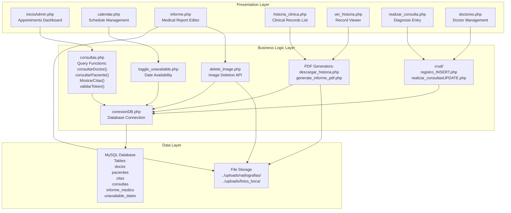
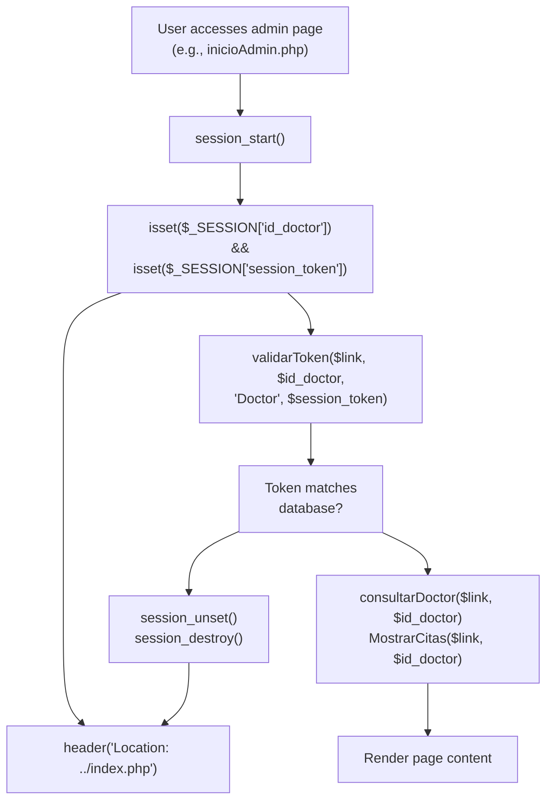
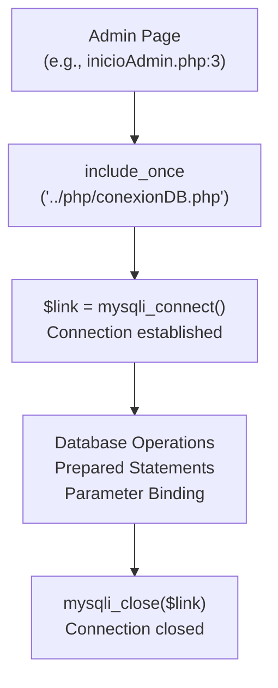
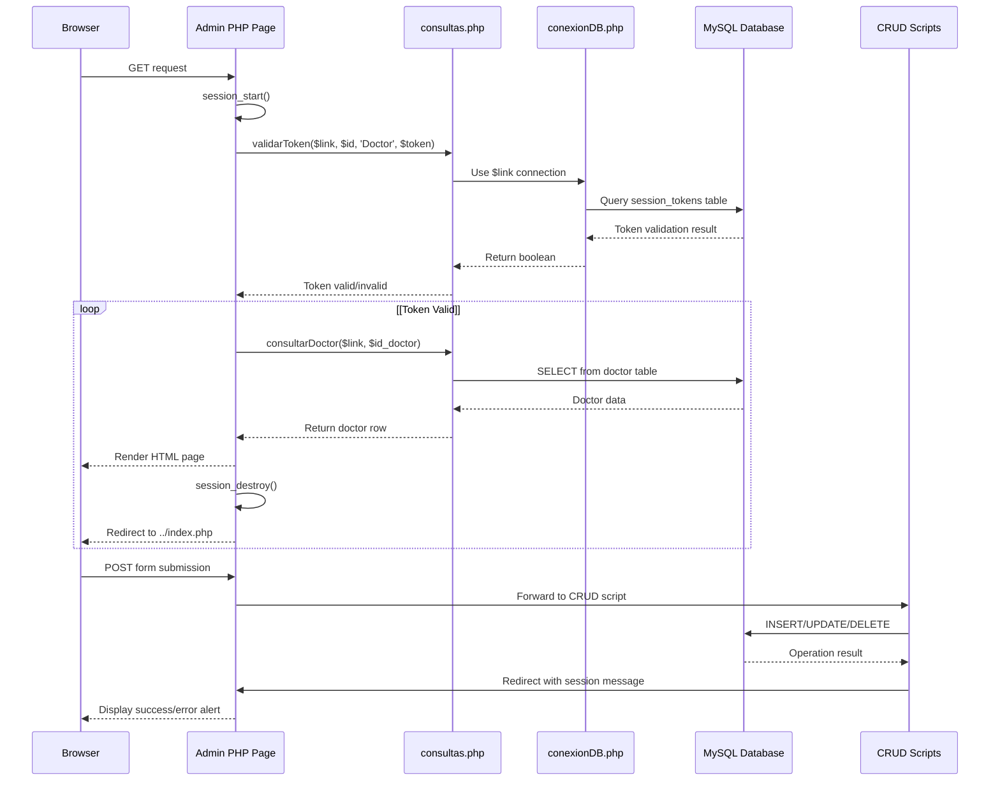

# Overview

> **Relevant source files**
> * [.gitignore](https://github.com/axchisan/Consultorio_Emily_Bernal/blob/589034b9/.gitignore)
> * [Admin/calendar.php](https://github.com/axchisan/Consultorio_Emily_Bernal/blob/589034b9/Admin/calendar.php)
> * [Admin/informe.php](https://github.com/axchisan/Consultorio_Emily_Bernal/blob/589034b9/Admin/informe.php)
> * [Admin/inicioAdmin.php](https://github.com/axchisan/Consultorio_Emily_Bernal/blob/589034b9/Admin/inicioAdmin.php)

## Purpose and Scope

The **Consultorio Emily Bernal** system is a web-based dental clinic management application built with PHP and MySQL. It provides comprehensive functionality for dentists to manage patient appointments, maintain detailed clinical histories, generate medical reports, and produce PDF documentation. The system handles the complete patient care workflow from appointment scheduling through diagnosis entry and clinical documentation.

This overview introduces the system's architecture, core components, and technical organization. For detailed information about specific subsystems, see:

* Administrative interfaces: [Core Administrative Interfaces](/axchisan/Consultorio_Emily_Bernal/2-core-administrative-interfaces)
* Database schema: [Database Architecture](/axchisan/Consultorio_Emily_Bernal/4-database-architecture)
* Security implementation: [Security & Authentication](/axchisan/Consultorio_Emily_Bernal/5-security-and-authentication)
* PDF generation: [PDF Generation System](/axchisan/Consultorio_Emily_Bernal/3-pdf-generation-system)

**Sources:** [Admin/inicioAdmin.php L1-L165](https://github.com/axchisan/Consultorio_Emily_Bernal/blob/589034b9/Admin/inicioAdmin.php#L1-L165)

 [Admin/calendar.php L1-L380](https://github.com/axchisan/Consultorio_Emily_Bernal/blob/589034b9/Admin/calendar.php#L1-L380)

 [Admin/informe.php L1-L865](https://github.com/axchisan/Consultorio_Emily_Bernal/blob/589034b9/Admin/informe.php#L1-L865)

## System Architecture Overview

The system follows a **three-tier architecture** with clear separation between presentation, business logic, and data layers:

| Layer | Components | Purpose |
| --- | --- | --- |
| **Presentation** | `Admin/*.php` files | User interfaces for doctors to interact with the system |
| **Business Logic** | `php/*.php`, `crud/*.php` | Session management, CRUD operations, PDF generation |
| **Data** | `php/conexionDB.php`, `php/consultas.php`, MySQL database | Data persistence and query abstraction |

### Architecture Diagram



**Sources:** [Admin/inicioAdmin.php L1-L165](https://github.com/axchisan/Consultorio_Emily_Bernal/blob/589034b9/Admin/inicioAdmin.php#L1-L165)

 [php/conexionDB.php](https://github.com/axchisan/Consultorio_Emily_Bernal/blob/589034b9/php/conexionDB.php)

 [php/consultas.php](https://github.com/axchisan/Consultorio_Emily_Bernal/blob/589034b9/php/consultas.php)

 [Admin/calendar.php L23-L32](https://github.com/axchisan/Consultorio_Emily_Bernal/blob/589034b9/Admin/calendar.php#L23-L32)

## Core System Components

### Entry Point and Session Management

Every administrative page begins with session validation and token verification to ensure secure access:



**Key Functions:**

* `validarToken($link, $id, $tipo, $token)`: Validates session token against database to prevent concurrent logins
* `consultarDoctor($link, $id_doctor)`: Retrieves doctor profile information
* `MostrarCitas($link, $id_doctor)`: Fetches appointments for the authenticated doctor

**Sources:** [Admin/inicioAdmin.php L6-L24](https://github.com/axchisan/Consultorio_Emily_Bernal/blob/589034b9/Admin/inicioAdmin.php#L6-L24)

 [php/consultas.php](https://github.com/axchisan/Consultorio_Emily_Bernal/blob/589034b9/php/consultas.php)

### Database Connection Pattern

All database operations use a consistent connection pattern through `conexionDB.php`:



**Connection Variables:**

* `$link`: Global MySQLi connection object used throughout the application
* Database credentials stored in `conexionDB.php`

**Sources:** [Admin/inicioAdmin.php L3](https://github.com/axchisan/Consultorio_Emily_Bernal/blob/589034b9/Admin/inicioAdmin.php#L3-L3)

 [Admin/calendar.php L5](https://github.com/axchisan/Consultorio_Emily_Bernal/blob/589034b9/Admin/calendar.php#L5-L5)

 [Admin/informe.php L7](https://github.com/axchisan/Consultorio_Emily_Bernal/blob/589034b9/Admin/informe.php#L7-L7)

## Primary User Workflows

The system supports four main workflows, each with dedicated interfaces:

| Workflow | Entry Point | Key Operations | Data Modified |
| --- | --- | --- | --- |
| **Appointment Management** | `inicioAdmin.php` | View, edit, cancel appointments | `citas` table |
| **Schedule Management** | `calendar.php` | Mark dates unavailable, view calendar | `unavailable_dates` table |
| **Clinical Documentation** | `informe.php`, `ver_historia.php` | Edit patient data, create medical reports | `pacientes`, `informe_medico` tables |
| **Diagnosis Entry** | `realizar_consulta.php` | Record diagnosis, prescribe medication | `citas.diagnostico`, `citas.medicina` |

### Request Processing Flow



**Sources:** [Admin/inicioAdmin.php L6-L27](https://github.com/axchisan/Consultorio_Emily_Bernal/blob/589034b9/Admin/inicioAdmin.php#L6-L27)

 [php/consultas.php](https://github.com/axchisan/Consultorio_Emily_Bernal/blob/589034b9/php/consultas.php)

 [crud/realizar_consultasUPDATE.php](https://github.com/axchisan/Consultorio_Emily_Bernal/blob/589034b9/crud/realizar_consultasUPDATE.php)

## Core Database Tables

The system's data model centers around five primary tables:

```css
#mermaid-pj7z4kes11h{font-family:ui-sans-serif,-apple-system,system-ui,Segoe UI,Helvetica;font-size:16px;fill:#333;}@keyframes edge-animation-frame{from{stroke-dashoffset:0;}}@keyframes dash{to{stroke-dashoffset:0;}}#mermaid-pj7z4kes11h .edge-animation-slow{stroke-dasharray:9,5!important;stroke-dashoffset:900;animation:dash 50s linear infinite;stroke-linecap:round;}#mermaid-pj7z4kes11h .edge-animation-fast{stroke-dasharray:9,5!important;stroke-dashoffset:900;animation:dash 20s linear infinite;stroke-linecap:round;}#mermaid-pj7z4kes11h .error-icon{fill:#dddddd;}#mermaid-pj7z4kes11h .error-text{fill:#222222;stroke:#222222;}#mermaid-pj7z4kes11h .edge-thickness-normal{stroke-width:1px;}#mermaid-pj7z4kes11h .edge-thickness-thick{stroke-width:3.5px;}#mermaid-pj7z4kes11h .edge-pattern-solid{stroke-dasharray:0;}#mermaid-pj7z4kes11h .edge-thickness-invisible{stroke-width:0;fill:none;}#mermaid-pj7z4kes11h .edge-pattern-dashed{stroke-dasharray:3;}#mermaid-pj7z4kes11h .edge-pattern-dotted{stroke-dasharray:2;}#mermaid-pj7z4kes11h .marker{fill:#999;stroke:#999;}#mermaid-pj7z4kes11h .marker.cross{stroke:#999;}#mermaid-pj7z4kes11h svg{font-family:ui-sans-serif,-apple-system,system-ui,Segoe UI,Helvetica;font-size:16px;}#mermaid-pj7z4kes11h p{margin:0;}#mermaid-pj7z4kes11h .entityBox{fill:#ffffff;stroke:#dddddd;}#mermaid-pj7z4kes11h .relationshipLabelBox{fill:#dddddd;opacity:0.7;background-color:#dddddd;}#mermaid-pj7z4kes11h .relationshipLabelBox rect{opacity:0.5;}#mermaid-pj7z4kes11h .labelBkg{background-color:rgba(221, 221, 221, 0.5);}#mermaid-pj7z4kes11h .edgeLabel .label{fill:#dddddd;font-size:14px;}#mermaid-pj7z4kes11h .label{font-family:ui-sans-serif,-apple-system,system-ui,Segoe UI,Helvetica;color:#333;}#mermaid-pj7z4kes11h .edge-pattern-dashed{stroke-dasharray:8,8;}#mermaid-pj7z4kes11h .node rect,#mermaid-pj7z4kes11h .node circle,#mermaid-pj7z4kes11h .node ellipse,#mermaid-pj7z4kes11h .node polygon{fill:#ffffff;stroke:#dddddd;stroke-width:1px;}#mermaid-pj7z4kes11h .relationshipLine{stroke:#999;stroke-width:1;fill:none;}#mermaid-pj7z4kes11h .marker{fill:none!important;stroke:#999!important;stroke-width:1;}#mermaid-pj7z4kes11h :root{--mermaid-font-family:"trebuchet ms",verdana,arial,sans-serif;}id_doctorid_doctorid_pacienteid_consultasid_citadoctorintid_doctorPKvarcharnombreDvarcharapellidovarcharsession_tokencitasintid_citaPKintid_pacienteFKintid_doctorFKintid_consultasFKdatefecha_citatimehora_citavarcharestadotextdiagnosticounavailable_datesintidPKintid_doctorFKdateunavailable_datepacientesintid_pacientePKvarcharnombrevarcharapellidodatefecha_nacimientotextalertas_medicasconsultasinforme_medicointid_informePKintid_citaFKintid_pacienteFKtextexamen_intraoraltextplan_tratamientovarcharradiografiavarcharfoto_boca
```

**Table Purpose:**

* **`doctor`**: Stores dentist credentials and session tokens for authentication
* **`pacientes`**: Contains patient demographics and medical history (ENUM fields for family history)
* **`citas`**: Central junction table linking patients, doctors, and appointments
* **`informe_medico`**: Stores clinical findings and treatment plans per appointment
* **`unavailable_dates`**: Tracks dates when doctors are not available for scheduling

**Sources:** [Admin/calendar.php L24-L32](https://github.com/axchisan/Consultorio_Emily_Bernal/blob/589034b9/Admin/calendar.php#L24-L32)

 [Admin/inicioAdmin.php L26-L27](https://github.com/axchisan/Consultorio_Emily_Bernal/blob/589034b9/Admin/inicioAdmin.php#L26-L27)

 [Admin/informe.php L47-L64](https://github.com/axchisan/Consultorio_Emily_Bernal/blob/589034b9/Admin/informe.php#L47-L64)

## Technology Stack Summary

| Component | Technology | Usage in System |
| --- | --- | --- |
| **Backend** | PHP 7.x+ | Server-side logic in all `Admin/*.php` and `php/*.php` files |
| **Database** | MySQL/MySQLi | Data persistence via `$link` connection object |
| **Frontend Framework** | Bootstrap 4.x | CSS framework loaded in all admin pages (e.g., [Admin/inicioAdmin.php L36](https://github.com/axchisan/Consultorio_Emily_Bernal/blob/589034b9/Admin/inicioAdmin.php#L36-L36) <br> ) |
| **JavaScript Library** | jQuery 3.x | AJAX calls, DOM manipulation (e.g., [Admin/calendar.php L76](https://github.com/axchisan/Consultorio_Emily_Bernal/blob/589034b9/Admin/calendar.php#L76-L76) <br> ) |
| **Calendar** | FullCalendar.js | Schedule visualization in [Admin/calendar.php L79-L81](https://github.com/axchisan/Consultorio_Emily_Bernal/blob/589034b9/Admin/calendar.php#L79-L81) |
| **Tables** | DataTables | Sortable/searchable tables in [Admin/inicioAdmin.php L40-L42](https://github.com/axchisan/Consultorio_Emily_Bernal/blob/589034b9/Admin/inicioAdmin.php#L40-L42) |
| **PDF Generation** | TCPDF | Document generation in `Reportes/*.php` files |
| **Icons** | FontAwesome | UI icons loaded via `src/css/lib/fontawesome/` |

**Sources:** [Admin/inicioAdmin.php L36-L42](https://github.com/axchisan/Consultorio_Emily_Bernal/blob/589034b9/Admin/inicioAdmin.php#L36-L42)

 [Admin/calendar.php L70-L81](https://github.com/axchisan/Consultorio_Emily_Bernal/blob/589034b9/Admin/calendar.php#L70-L81)

 [Admin/informe.php L444-L447](https://github.com/axchisan/Consultorio_Emily_Bernal/blob/589034b9/Admin/informe.php#L444-L447)

## File Organization

The codebase follows a modular directory structure:

```sql
Consultorio_Emily_Bernal/
├── Admin/                          # Presentation layer (7 main pages)
│   ├── inicioAdmin.php            # Appointments dashboard
│   ├── calendar.php               # Schedule management
│   ├── informe.php                # Medical report editor
│   ├── historia_clinica.php       # Clinical records list
│   ├── ver_historia.php           # Record detail viewer
│   ├── realizar_consulta.php      # Diagnosis entry
│   └── doctores.php               # Doctor management
├── php/                           # Business logic layer
│   ├── conexionDB.php             # Database connection ($link)
│   ├── consultas.php              # Query functions library
│   ├── toggle_unavailable.php     # AJAX endpoint for calendar
│   ├── delete_image.php           # Image deletion API
│   └── cerrar.php                 # Logout handler
├── crud/                          # CRUD operations
│   ├── registro_INSERT.php        # Create operations
│   └── realizar_consultasUPDATE.php # Update/delete operations
├── Reportes/                      # PDF generation
│   ├── descargar_historia.php     # Clinical history PDF
│   └── generate_informe_pdf.php   # Medical report PDF
├── uploads/                       # File storage
│   ├── radiografias/              # X-ray images
│   └── fotos_boca/                # Oral photos
└── src/                           # Static assets
    ├── css/                       # Stylesheets
    ├── js/                        # JavaScript libraries
    └── img/                       # Images
```

**Key Files by Function:**

| Function | Primary File | Supporting Files |
| --- | --- | --- |
| Session Management | `php/consultas.php::validarToken()` | All `Admin/*.php` pages |
| Database Queries | `php/consultas.php` | `php/conexionDB.php` |
| Appointment CRUD | `Admin/inicioAdmin.php` | `crud/realizar_consultasUPDATE.php` |
| Calendar Management | `Admin/calendar.php` | `php/toggle_unavailable.php` |
| Medical Reports | `Admin/informe.php` | `php/delete_image.php`, `Reportes/generate_informe_pdf.php` |

**Sources:** [.gitignore L1-L7](https://github.com/axchisan/Consultorio_Emily_Bernal/blob/589034b9/.gitignore#L1-L7)

 [Admin/inicioAdmin.php L3-L4](https://github.com/axchisan/Consultorio_Emily_Bernal/blob/589034b9/Admin/inicioAdmin.php#L3-L4)

 [Admin/informe.php L7-L8](https://github.com/axchisan/Consultorio_Emily_Bernal/blob/589034b9/Admin/informe.php#L7-L8)

## Session-Based Messaging Pattern

The system implements a Post-Redirect-Get (PRG) pattern for user feedback across all administrative pages:

```

```

**Implementation Example:**

* Set message: [Admin/inicioAdmin.php L8-L10](https://github.com/axchisan/Consultorio_Emily_Bernal/blob/589034b9/Admin/inicioAdmin.php#L8-L10)
* Display message: [Admin/inicioAdmin.php L93-L101](https://github.com/axchisan/Consultorio_Emily_Bernal/blob/589034b9/Admin/inicioAdmin.php#L93-L101)
* Message types: `"p-3 mb-2 bg-success text-white"` (success) or `"p-3 mb-2 bg-danger text-white"` (error)

**Sources:** [Admin/inicioAdmin.php L93-L101](https://github.com/axchisan/Consultorio_Emily_Bernal/blob/589034b9/Admin/inicioAdmin.php#L93-L101)

 [Admin/informe.php L497-L506](https://github.com/axchisan/Consultorio_Emily_Bernal/blob/589034b9/Admin/informe.php#L497-L506)

 [Admin/calendar.php L9-L11](https://github.com/axchisan/Consultorio_Emily_Bernal/blob/589034b9/Admin/calendar.php#L9-L11)

## Security Model

The system implements multiple security layers:

1. **Session Validation**: Every admin page checks `$_SESSION['id_doctor']` existence ([Admin/inicioAdmin.php L7-L12](https://github.com/axchisan/Consultorio_Emily_Bernal/blob/589034b9/Admin/inicioAdmin.php#L7-L12) )
2. **Token Validation**: `validarToken()` function prevents concurrent logins ([Admin/inicioAdmin.php L17-L24](https://github.com/axchisan/Consultorio_Emily_Bernal/blob/589034b9/Admin/inicioAdmin.php#L17-L24) )
3. **SQL Injection Prevention**: Prepared statements with parameter binding ([Admin/informe.php L53-L56](https://github.com/axchisan/Consultorio_Emily_Bernal/blob/589034b9/Admin/informe.php#L53-L56) )
4. **Access Control**: All queries filter by authenticated doctor's `id_doctor` ([Admin/calendar.php L38-L48](https://github.com/axchisan/Consultorio_Emily_Bernal/blob/589034b9/Admin/calendar.php#L38-L48) )

For detailed security implementation, see [Security & Authentication](/axchisan/Consultorio_Emily_Bernal/5-security-and-authentication).

**Sources:** [Admin/inicioAdmin.php L6-L24](https://github.com/axchisan/Consultorio_Emily_Bernal/blob/589034b9/Admin/inicioAdmin.php#L6-L24)

 [Admin/informe.php L53-L56](https://github.com/axchisan/Consultorio_Emily_Bernal/blob/589034b9/Admin/informe.php#L53-L56)

 [Admin/calendar.php L38-L48](https://github.com/axchisan/Consultorio_Emily_Bernal/blob/589034b9/Admin/calendar.php#L38-L48)