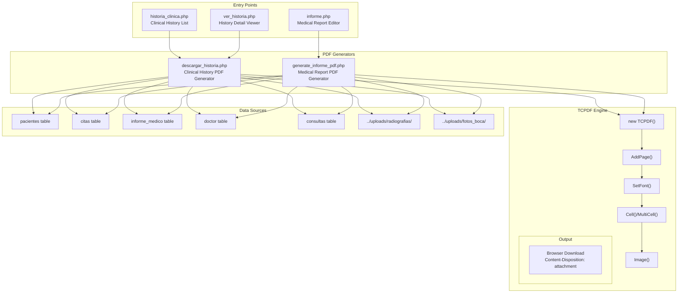
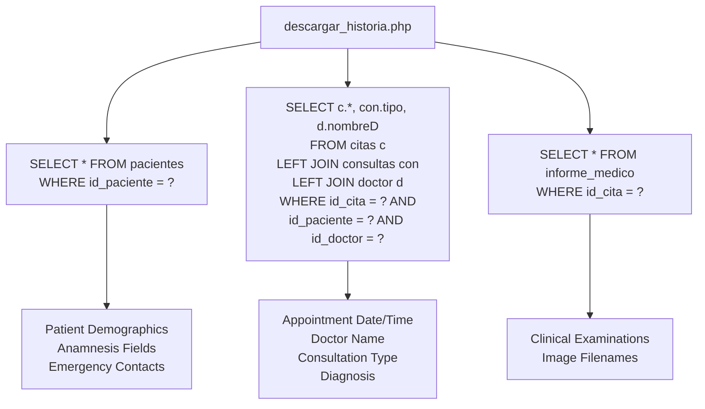
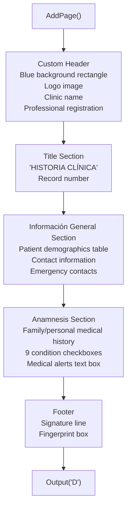
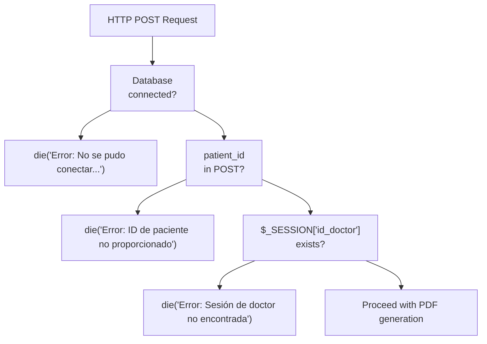
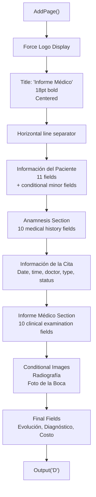
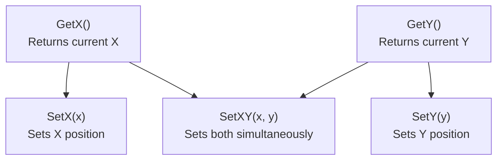

# PDF Generation System

> **Relevant source files**
> * [Admin/descargar_historia.php](https://github.com/axchisan/Consultorio_Emily_Bernal/blob/589034b9/Admin/descargar_historia.php)
> * [Admin/generate_informe_pdf.php](https://github.com/axchisan/Consultorio_Emily_Bernal/blob/589034b9/Admin/generate_informe_pdf.php)
> * [Reportes/fpdf/FAQ.htm](https://github.com/axchisan/Consultorio_Emily_Bernal/blob/589034b9/Reportes/fpdf/FAQ.htm)

## Purpose and Scope

This document describes the PDF generation subsystem of the Consultorio Emily Bernal system, which produces professional medical documents in PDF format. The system consists of two independent PDF generators that create different types of clinical documentation: comprehensive clinical histories and focused medical reports.

For information about the medical report editing interface that feeds data into these generators, see [Medical Report Editor](/axchisan/Consultorio_Emily_Bernal/2.3.3-medical-report-editor). For details on the TCPDF library API methods, see [TCPDF Library Reference](/axchisan/Consultorio_Emily_Bernal/9-tcpdf-library-reference).

**Sources:** [Admin/descargar_historia.php L1-L293](https://github.com/axchisan/Consultorio_Emily_Bernal/blob/589034b9/Admin/descargar_historia.php#L1-L293)

 [Admin/generate_informe_pdf.php L1-L331](https://github.com/axchisan/Consultorio_Emily_Bernal/blob/589034b9/Admin/generate_informe_pdf.php#L1-L331)

---

## System Architecture

The PDF generation system operates as a parallel service to the main administrative interfaces, consuming data from both the MySQL database and the file storage system. Two independent PHP scripts generate PDFs:

1. **`descargar_historia.php`** - Generates comprehensive clinical history PDFs including patient demographics, anamnesis, appointment details, and medical findings
2. **`generate_informe_pdf.php`** - Generates focused medical report PDFs for specific appointments with detailed clinical examinations and treatment plans

Both generators:

* Validate user sessions using token-based authentication
* Query multiple database tables to construct complete patient documentation
* Conditionally include medical images (radiographs and oral photos) from the file system
* Use the TCPDF library as their PDF rendering engine
* Output PDFs directly to the browser as downloadable files

**Sources:** [Admin/descargar_historia.php L1-L293](https://github.com/axchisan/Consultorio_Emily_Bernal/blob/589034b9/Admin/descargar_historia.php#L1-L293)

 [Admin/generate_informe_pdf.php L1-L331](https://github.com/axchisan/Consultorio_Emily_Bernal/blob/589034b9/Admin/generate_informe_pdf.php#L1-L331)

---

## PDF Generation Architecture



**Diagram: PDF Generation Data Flow and Component Relationships**

**Sources:** [Admin/descargar_historia.php L1-L293](https://github.com/axchisan/Consultorio_Emily_Bernal/blob/589034b9/Admin/descargar_historia.php#L1-L293)

 [Admin/generate_informe_pdf.php L1-L331](https://github.com/axchisan/Consultorio_Emily_Bernal/blob/589034b9/Admin/generate_informe_pdf.php#L1-L331)

---

## Clinical History PDF Generator

### File Location and Entry Point

The clinical history PDF generator is implemented in `descargar_historia.php`. It is triggered via POST requests containing `id_cita` and `id_paciente` parameters from the clinical history list view or detail viewer.

**Sources:** [Admin/descargar_historia.php L1-L33](https://github.com/axchisan/Consultorio_Emily_Bernal/blob/589034b9/Admin/descargar_historia.php#L1-L33)

### Session Validation

The generator enforces strict session validation before processing:

| Validation Step | Implementation | Exit Behavior |
| --- | --- | --- |
| Session existence check | `isset($_SESSION['id_doctor'])` and `isset($_SESSION['session_token'])` | Redirect to `../index.php` with error message |
| Token validity check | `validarToken($link, $vUsuario, 'Doctor', $_SESSION['session_token'])` | Destroy session and redirect to `../index.php` |
| Parameter validation | `isset($_POST['id_cita'])` and `isset($_POST['id_paciente'])` | Redirect to `historia_clinica.php` with error message |

**Sources:** [Admin/descargar_historia.php L8-L33](https://github.com/axchisan/Consultorio_Emily_Bernal/blob/589034b9/Admin/descargar_historia.php#L8-L33)

### Data Retrieval

The generator queries five database tables to construct the complete clinical history:



**Diagram: Clinical History PDF Data Retrieval Pattern**

**Sources:** [Admin/descargar_historia.php L39-L82](https://github.com/axchisan/Consultorio_Emily_Bernal/blob/589034b9/Admin/descargar_historia.php#L39-L82)

### Age Calculation

Patient age is calculated dynamically from the `fecha_nacimiento` field:

```
$birthDate = new DateTime($patient['fecha_nacimiento']);
$currentDate = new DateTime();
$age = $currentDate->diff($birthDate)->y;
```

If the birth date is missing or invalid, age defaults to `'N/A'`.

**Sources:** [Admin/descargar_historia.php L48-L54](https://github.com/axchisan/Consultorio_Emily_Bernal/blob/589034b9/Admin/descargar_historia.php#L48-L54)

### TCPDF Initialization

The generator initializes TCPDF with specific configuration:

| Configuration Method | Value | Purpose |
| --- | --- | --- |
| `SetCreator()` | `PDF_CREATOR` | Set document creator metadata |
| `SetAuthor()` | `'Sistema Odontológico'` | Set author metadata |
| `SetTitle()` | `'Historia Clínica'` | Set document title |
| `SetSubject()` | `'Historia Clínica del Paciente'` | Set subject metadata |
| `setPrintHeader()` | `false` | Disable default TCPDF header |
| `setPrintFooter()` | `false` | Disable default TCPDF footer |
| `SetMargins()` | `15, 15, 15` | Set left, top, right margins (mm) |
| `SetAutoPageBreak()` | `true, 15` | Enable auto page breaks with 15mm bottom margin |

**Sources:** [Admin/descargar_historia.php L84-L102](https://github.com/axchisan/Consultorio_Emily_Bernal/blob/589034b9/Admin/descargar_historia.php#L84-L102)

### Document Structure

The clinical history PDF follows a structured layout with multiple sections:



**Diagram: Clinical History PDF Document Flow**

**Sources:** [Admin/descargar_historia.php L104-L288](https://github.com/axchisan/Consultorio_Emily_Bernal/blob/589034b9/Admin/descargar_historia.php#L104-L288)

### Header Rendering

The header section spans lines 108-137 and creates a professional branded appearance:

* **Background**: Blue-tinted rectangle (`SetFillColor(230, 240, 255)`) covering 210mm x 35mm
* **Logo**: Loaded from `'../src/img/logo.png'` at position (15, 10) with 30mm width
* **Clinic Information**: Two text lines with clinic name and professional registration
* **Title**: "HISTORIA CLÍNICA" in blue bold 16pt font with record number

**Sources:** [Admin/descargar_historia.php L108-L137](https://github.com/axchisan/Consultorio_Emily_Bernal/blob/589034b9/Admin/descargar_historia.php#L108-L137)

### Información General Table

The demographic information is rendered as a structured table with alternating labeled and value cells:

| Column Layout | Width (mm) | Content |
| --- | --- | --- |
| Label columns | 50 | Field names with gray background |
| Value columns | 40 | Patient data with white background |

The table includes 12 rows covering: name, birth date, age, ID number, address, phone, EPS, gender, civil status, occupation, companion info, emergency contacts, and consultation reason.

**Sources:** [Admin/descargar_historia.php L145-L196](https://github.com/axchisan/Consultorio_Emily_Bernal/blob/589034b9/Admin/descargar_historia.php#L145-L196)

### Anamnesis Section

The anamnesis section uses a two-column layout:

**Left Column** (100mm width): Medical history checklist with Yes/No checkboxes

* 9 medical conditions (cardiovascular, hemorrhagic, dermatological, mental, diabetes, cancer, arthritis, allergies, surgeries)
* "X" marks displayed based on enum field values from `pacientes` table
* Additional "Otros" field for free-form text

**Right Column** (70mm width): Medical alerts text box

* Displays `alertas_medicas` field content
* 35mm height MultiCell

**Sources:** [Admin/descargar_historia.php L199-L275](https://github.com/axchisan/Consultorio_Emily_Bernal/blob/589034b9/Admin/descargar_historia.php#L199-L275)

### Footer Elements

The document concludes with:

* Italic gray text: "La información es suministrada por el paciente y en constancia firma:"
* Horizontal signature line from x=15 to x=80
* Gray-filled rectangle (30mm x 20mm) at position (165, end_y+5) for fingerprint

**Sources:** [Admin/descargar_historia.php L277-L286](https://github.com/axchisan/Consultorio_Emily_Bernal/blob/589034b9/Admin/descargar_historia.php#L277-L286)

### Output Generation

The PDF is output using a specific sequence to ensure clean file delivery:

```
ob_end_clean();
header('Content-Type: application/pdf');
header('Content-Disposition: attachment; filename="Historia_Clinica_' . $id_paciente . '_Cita_' . $id_cita . '.pdf"');
$pdf->Output('Historia_Clinica_' . $id_paciente . '_Cita_' . $id_cita . '.pdf', 'D');
exit();
```

The `ob_end_clean()` call clears any buffered output to prevent corruption, followed by HTTP headers that trigger browser download with a formatted filename.

**Sources:** [Admin/descargar_historia.php L289-L293](https://github.com/axchisan/Consultorio_Emily_Bernal/blob/589034b9/Admin/descargar_historia.php#L289-L293)

---

## Medical Report PDF Generator

### File Location and Entry Point

The medical report PDF generator is implemented in `generate_informe_pdf.php`. It accepts a POST parameter `patient_id` and generates a report for the patient's most recent appointment.

**Sources:** [Admin/generate_informe_pdf.php L1-L18](https://github.com/axchisan/Consultorio_Emily_Bernal/blob/589034b9/Admin/generate_informe_pdf.php#L1-L18)

### Session and Parameter Validation

The generator performs three validation checks:



**Diagram: Medical Report Generator Validation Flow**

**Sources:** [Admin/generate_informe_pdf.php L10-L26](https://github.com/axchisan/Consultorio_Emily_Bernal/blob/589034b9/Admin/generate_informe_pdf.php#L10-L26)

### Query Strategy

Unlike the clinical history generator which requires a specific appointment ID, the medical report generator automatically selects the most recent appointment:

```sql
SELECT c.*, con.tipo, d.nombreD 
FROM citas c 
LEFT JOIN consultas con ON con.id_consultas = c.id_consultas 
LEFT JOIN doctor d ON d.id_doctor = c.id_doctor 
WHERE c.id_paciente = ? AND c.id_doctor = ? 
ORDER BY c.fecha_cita DESC LIMIT 1
```

This query joins three tables (`citas`, `consultas`, `doctor`) and sorts by `fecha_cita` descending to retrieve the latest appointment.

**Sources:** [Admin/generate_informe_pdf.php L43-L58](https://github.com/axchisan/Consultorio_Emily_Bernal/blob/589034b9/Admin/generate_informe_pdf.php#L43-L58)

### Medical Report Data Retrieval

After obtaining the appointment, the generator queries the `informe_medico` table:

```sql
$medical_report_query = "SELECT * FROM informe_medico WHERE id_cita = ?";
$stmt = mysqli_prepare($link, $medical_report_query);
mysqli_stmt_bind_param($stmt, "i", $appointment['id_cita']);
mysqli_stmt_execute($stmt);
$medical_report_result = mysqli_stmt_get_result($stmt);
$medical_report = mysqli_num_rows($medical_report_result) > 0 ? mysqli_fetch_assoc($medical_report_result) : [];
```

If no medical report exists for the appointment, an empty array is used, allowing the PDF to display "N/A" for missing fields.

**Sources:** [Admin/generate_informe_pdf.php L60-L67](https://github.com/axchisan/Consultorio_Emily_Bernal/blob/589034b9/Admin/generate_informe_pdf.php#L60-L67)

### TCPDF Configuration Differences

The medical report generator uses different TCPDF settings compared to the clinical history generator:

| Setting | Clinical History | Medical Report |
| --- | --- | --- |
| Header | Custom rendering with `setPrintHeader(false)` | Uses TCPDF's built-in header via `SetHeaderData()` |
| Footer | Custom signature elements | Uses TCPDF's built-in footer via `SetFooterData()` |
| Margins | `(15, 15, 15)` | `(15, 30, 15)` with separate header/footer margins |
| Header Margin | Not set | `15` mm |
| Footer Margin | Not set | `15` mm |

**Sources:** [Admin/generate_informe_pdf.php L85-L98](https://github.com/axchisan/Consultorio_Emily_Bernal/blob/589034b9/Admin/generate_informe_pdf.php#L85-L98)

 [Admin/descargar_historia.php L94-L102](https://github.com/axchisan/Consultorio_Emily_Bernal/blob/589034b9/Admin/descargar_historia.php#L94-L102)

### Header Implementation

The medical report uses TCPDF's built-in header system:

```go
if (file_exists('../src/img/logo.png')) {
    $pdf->SetHeaderData('../src/img/logo.png', 30, 'Informe Médico', '');
} else {
    $pdf->SetHeaderData('', 0, 'Informe Médico', 'Logo no encontrado');
}
```

Additionally, the logo is forced on the first page using `Image()` at position (15, 15) with 30mm width.

**Sources:** [Admin/generate_informe_pdf.php L92-L109](https://github.com/axchisan/Consultorio_Emily_Bernal/blob/589034b9/Admin/generate_informe_pdf.php#L92-L109)

### Document Content Structure

The medical report PDF contains seven main sections:



**Diagram: Medical Report PDF Content Structure**

**Sources:** [Admin/generate_informe_pdf.php L112-L323](https://github.com/axchisan/Consultorio_Emily_Bernal/blob/589034b9/Admin/generate_informe_pdf.php#L112-L323)

### Patient Information Rendering

The patient information section (lines 122-179) displays basic demographics using `Cell()` method with consistent formatting:

* **Label column**: 40mm width, left-aligned
* **Value column**: 60mm width, left-aligned
* **Spacing**: 3mm `Ln()` between rows

For patients under 18 years old, additional companion fields are conditionally displayed:

* `menor_acompanante` (companion name)
* `menor_parentesco` (relationship)
* `menor_telefono` (companion phone)

**Sources:** [Admin/generate_informe_pdf.php L122-L179](https://github.com/axchisan/Consultorio_Emily_Bernal/blob/589034b9/Admin/generate_informe_pdf.php#L122-L179)

### Clinical Examination Fields

The "Informe Médico" section displays detailed clinical findings using `MultiCell()` for text wrapping:

| Field Name | Database Column | Label Width | Value Width |
| --- | --- | --- | --- |
| Examen Intraoral | `examen_intraoral` | 55mm | 135mm |
| Examen Extraoral | `examen_extraoral` | 55mm | 135mm |
| Examen ATM | `examen_atm` | 55mm | 135mm |
| Observación, Palpación Intraoral | `observacion_intraoral` | 55mm | 135mm |
| Observación, Palpación Extraoral (ATM y Músculos) | `observacion_extraoral_atm` | 85mm | 105mm |
| Descripción Radiográfica | `descripcion_radiografica` | 55mm | 135mm |
| Diagnóstico Periodontal | `diagnostico_periodontal` | 55mm | 135mm |
| Plan de Tratamiento | `plan_tratamiento` | 55mm | 135mm |
| Pronóstico | `pronostico` | 55mm | 135mm |

**Sources:** [Admin/generate_informe_pdf.php L244-L289](https://github.com/axchisan/Consultorio_Emily_Bernal/blob/589034b9/Admin/generate_informe_pdf.php#L244-L289)

### Image Inclusion Logic

Both generators conditionally include medical images if they exist in the file system:

```
// Radiograph inclusion
if (isset($medical_report['radiografia']) && !empty($medical_report['radiografia'])) {
    $radiografia_path = '../uploads/radiografias/' . $medical_report['radiografia'];
    if (!file_exists($radiografia_path)) {
        error_log("Error: No se encontró la radiografía en '$radiografia_path'");
    } else {
        $pdf->Cell(40, 7, 'Radiografía:', 0, 1, 'L');
        $pdf->Image($radiografia_path, 50, $pdf->GetY(), 100);
        $pdf->Ln(90);
    }
}

// Oral photo inclusion
if (isset($medical_report['foto_boca']) && !empty($medical_report['foto_boca'])) {
    $foto_boca_path = '../uploads/fotos_boca/' . $medical_report['foto_boca'];
    if (!file_exists($foto_boca_path)) {
        error_log("Error: No se encontró la foto de la boca en '$foto_boca_path'");
    } else {
        $pdf->Cell(40, 7, 'Foto de la Boca:', 0, 1, 'L');
        $pdf->Image($foto_boca_path, 50, $pdf->GetY(), 100);
        $pdf->Ln(90);
    }
}
```

Images are displayed at 100mm width, centered horizontally at x=50, with 90mm vertical spacing after each image.

**Sources:** [Admin/generate_informe_pdf.php L291-L312](https://github.com/axchisan/Consultorio_Emily_Bernal/blob/589034b9/Admin/generate_informe_pdf.php#L291-L312)

### Final Fields and Output

The document concludes with three fields rendered using `Cell()` and `MultiCell()`:

* **Evolución**: MultiCell with 150mm width
* **Diagnóstico**: MultiCell with 150mm width
* **Costo**: Cell displaying value prefixed with "$"

The output sequence mirrors the clinical history generator:

```
ob_end_clean();
header('Content-Type: application/pdf');
header('Content-Disposition: attachment; filename="Informe_Medico_' . $patient_id . '.pdf"');
$pdf->Output('Informe_Medico_' . $patient_id . '.pdf', 'D');
exit();
```

**Sources:** [Admin/generate_informe_pdf.php L314-L330](https://github.com/axchisan/Consultorio_Emily_Bernal/blob/589034b9/Admin/generate_informe_pdf.php#L314-L330)

---

## TCPDF Integration

### Library Loading

Both generators load TCPDF from a centralized location with error checking:

```
if (!file_exists('../Reportes/tcpdf/tcpdf.php')) {
    die("Error: No se encontró el archivo TCPDF en '../Reportes/tcpdf/tcpdf.php'");
}
require_once '../Reportes/tcpdf/tcpdf.php';
```

This defensive check ensures graceful failure if the TCPDF library is missing.

**Sources:** [Admin/descargar_historia.php L84-L88](https://github.com/axchisan/Consultorio_Emily_Bernal/blob/589034b9/Admin/descargar_historia.php#L84-L88)

 [Admin/generate_informe_pdf.php L69-L73](https://github.com/axchisan/Consultorio_Emily_Bernal/blob/589034b9/Admin/generate_informe_pdf.php#L69-L73)

### Constructor Parameters

TCPDF is instantiated with standard parameters:

```
$pdf = new TCPDF(PDF_PAGE_ORIENTATION, PDF_UNIT, PDF_PAGE_FORMAT, true, 'UTF-8', false);
```

| Parameter | Value | Meaning |
| --- | --- | --- |
| `PDF_PAGE_ORIENTATION` | Constant | Portrait mode (default) |
| `PDF_UNIT` | Constant | Measurement unit (typically 'mm') |
| `PDF_PAGE_FORMAT` | Constant | Page size (typically 'A4') |
| `unicode` | `true` | Enable Unicode support |
| `encoding` | `'UTF-8'` | Character encoding |
| `diskcache` | `false` | Disable disk caching |

**Sources:** [Admin/descargar_historia.php L91](https://github.com/axchisan/Consultorio_Emily_Bernal/blob/589034b9/Admin/descargar_historia.php#L91-L91)

 [Admin/generate_informe_pdf.php L76](https://github.com/axchisan/Consultorio_Emily_Bernal/blob/589034b9/Admin/generate_informe_pdf.php#L76-L76)

### Core Methods Used

The generators utilize a subset of TCPDF methods:

```

```

**Diagram: TCPDF Methods Used in PDF Generators**

**Sources:** [Admin/descargar_historia.php L90-L292](https://github.com/axchisan/Consultorio_Emily_Bernal/blob/589034b9/Admin/descargar_historia.php#L90-L292)

 [Admin/generate_informe_pdf.php L75-L329](https://github.com/axchisan/Consultorio_Emily_Bernal/blob/589034b9/Admin/generate_informe_pdf.php#L75-L329)

### Color Management

Colors are set using RGB values (0-255) via three methods:

* **`SetFillColor(r, g, b)`**: Background fill color for cells and rectangles
* **`SetTextColor(r, g, b)`**: Text color
* **`SetDrawColor(r, g, b)`**: Line and border color

Example color scheme in clinical history generator:

| Usage | RGB Values | Appearance |
| --- | --- | --- |
| Header background | (230, 240, 255) | Light blue |
| Primary text | (33, 37, 41) | Dark gray |
| Section titles | (0, 102, 204) | Blue |
| Table fill | (245, 245, 245) | Light gray |
| Muted text | (100, 100, 100) | Medium gray |

**Sources:** [Admin/descargar_historia.php L108-L284](https://github.com/axchisan/Consultorio_Emily_Bernal/blob/589034b9/Admin/descargar_historia.php#L108-L284)

### Font Configuration

Fonts are set using `SetFont()` method with three parameters:

```
$pdf->SetFont($family, $style, $size);
```

Common font configurations:

| Context | Family | Style | Size |
| --- | --- | --- | --- |
| Section headings | `'helvetica'` | `'B'` | 12 |
| Document title | `'helvetica'` | `'B'` | 16-18 |
| Body text | `'helvetica'` | `''` | 10 |
| Footer notes | `'helvetica'` | `'I'` | 9 |
| Clinic info | `'helvetica'` | `'B'` | 11 |

**Sources:** [Admin/descargar_historia.php L117-L278](https://github.com/axchisan/Consultorio_Emily_Bernal/blob/589034b9/Admin/descargar_historia.php#L117-L278)

 [Admin/generate_informe_pdf.php L112-L248](https://github.com/axchisan/Consultorio_Emily_Bernal/blob/589034b9/Admin/generate_informe_pdf.php#L112-L248)

### Cell vs MultiCell

The generators use two methods for text rendering:

**`Cell(w, h, txt, border, ln, align, fill)`**

* Single-line text only
* Fixed height
* Used for labels and short values
* Example: `$pdf->Cell(40, 7, 'Nombre:', 0, 0, 'L');`

**`MultiCell(w, h, txt, border, align, fill)`**

* Automatic line wrapping
* Dynamic height based on content
* Used for long text fields
* Example: `$pdf->MultiCell(150, 7, $patient['alertas_medicas'] ?? 'N/A', 0, 'L');`

**Sources:** [Admin/descargar_historia.php L157-L227](https://github.com/axchisan/Consultorio_Emily_Bernal/blob/589034b9/Admin/descargar_historia.php#L157-L227)

 [Admin/generate_informe_pdf.php L127-L218](https://github.com/axchisan/Consultorio_Emily_Bernal/blob/589034b9/Admin/generate_informe_pdf.php#L127-L218)

### Image Insertion

The `Image()` method inserts images with parameters:

```
$pdf->Image($file, $x, $y, $w, $h, $type, $link, $align)
```

Typical usage patterns:

```go
// Logo - fixed position and width
$pdf->Image('../src/img/logo.png', 15, 10, 30, 0);

// Medical images - centered with 100mm width, auto height
$pdf->Image($radiografia_path, 50, $pdf->GetY(), 100);
```

The `0` or omitted height parameter triggers automatic aspect ratio calculation.

**Sources:** [Admin/descargar_historia.php L112-L114](https://github.com/axchisan/Consultorio_Emily_Bernal/blob/589034b9/Admin/descargar_historia.php#L112-L114)

 [Admin/generate_informe_pdf.php L298-L310](https://github.com/axchisan/Consultorio_Emily_Bernal/blob/589034b9/Admin/generate_informe_pdf.php#L298-L310)

### Position Control

Position tracking and manipulation uses five methods:



**Diagram: TCPDF Position Control Methods**

Example usage for side-by-side content:

```
$alertas_x = 15 + $anamnesis_width + 10;
$alertas_y = $pdf->GetY();
$pdf->SetXY($alertas_x, $alertas_y);
```

**Sources:** [Admin/descargar_historia.php L219-L230](https://github.com/axchisan/Consultorio_Emily_Bernal/blob/589034b9/Admin/descargar_historia.php#L219-L230)

### Drawing Primitives

Two methods create graphical elements:

**`Rect(x, y, w, h, style)`**

* Draws rectangles
* Style: `'F'` (fill), `'D'` (draw border), `'DF'` (both)
* Example: `$pdf->Rect(0, 0, 210, 35, 'F');` // Full-width header background

**`Line(x1, y1, x2, y2)`**

* Draws straight lines
* Requires `SetLineStyle()` for appearance
* Example: `$pdf->Line(15, 35, 195, 35);` // Horizontal separator

**Sources:** [Admin/descargar_historia.php L109-L136](https://github.com/axchisan/Consultorio_Emily_Bernal/blob/589034b9/Admin/descargar_historia.php#L109-L136)

### Output Method

The `Output()` method has a critical second parameter specifying the destination:

```
$pdf->Output($name, $dest);
```

| Destination | Code | Behavior |
| --- | --- | --- |
| Download | `'D'` | Force browser download with filename |
| Inline | `'I'` | Display in browser |
| String | `'S'` | Return PDF as string (for email) |
| File | `'F'` | Save to server file system |

Both generators use `'D'` for direct downloads:

```
$pdf->Output('Historia_Clinica_' . $id_paciente . '_Cita_' . $id_cita . '.pdf', 'D');
```

**Sources:** [Admin/descargar_historia.php L292](https://github.com/axchisan/Consultorio_Emily_Bernal/blob/589034b9/Admin/descargar_historia.php#L292-L292)

 [Admin/generate_informe_pdf.php L329](https://github.com/axchisan/Consultorio_Emily_Bernal/blob/589034b9/Admin/generate_informe_pdf.php#L329-L329)

---

## Output Buffer Management

### Purpose of ob_start() and ob_end_clean()

Both generators use output buffering to prevent premature data transmission:

```
ob_start();  // At file start - buffer all output
// ... database queries, TCPDF generation ...
ob_end_clean();  // Before Output() - clear buffer without sending
header('Content-Type: application/pdf');
header('Content-Disposition: attachment; filename="...');
$pdf->Output('...', 'D');
```

This pattern prevents common errors:

* Whitespace before `<?php` tags
* Debug output from included files
* Warning messages from database queries
* UTF-8 BOM characters

Without buffering, any output before `header()` calls causes "headers already sent" errors.

**Sources:** [Admin/descargar_historia.php L2](https://github.com/axchisan/Consultorio_Emily_Bernal/blob/589034b9/Admin/descargar_historia.php#L2-L2)

 [Admin/descargar_historia.php L289](https://github.com/axchisan/Consultorio_Emily_Bernal/blob/589034b9/Admin/descargar_historia.php#L289-L289)

 [Admin/generate_informe_pdf.php L3](https://github.com/axchisan/Consultorio_Emily_Bernal/blob/589034b9/Admin/generate_informe_pdf.php#L3-L3)

 [Admin/generate_informe_pdf.php L325](https://github.com/axchisan/Consultorio_Emily_Bernal/blob/589034b9/Admin/generate_informe_pdf.php#L325-L325)

---

## Comparison Table: Clinical History vs Medical Report

| Feature | descargar_historia.php | generate_informe_pdf.php |
| --- | --- | --- |
| **Input Parameters** | `id_cita`, `id_paciente` (specific appointment) | `patient_id` (most recent appointment) |
| **Document Type** | Comprehensive clinical history | Focused medical report |
| **Header Style** | Custom rendered (blue background, manual layout) | TCPDF built-in header system |
| **Footer Style** | Custom signature elements | TCPDF built-in footer |
| **Page Margins** | (15, 15, 15) | (15, 30, 15) with header/footer margins |
| **Anamnesis Display** | Yes/No checkboxes with X marks | Yes/No text values |
| **Appointment Selection** | Explicit from POST | Automatic (most recent) |
| **Clinical Examination Fields** | Not included | 9 detailed examination fields |
| **Medical Alerts** | Displayed in side box | Displayed in patient info |
| **Signature/Fingerprint** | Yes (box and line) | No |
| **Image Display Width** | Not applicable (no images) | 100mm |
| **File Name Pattern** | `Historia_Clinica_{patient}_{cita}.pdf` | `Informe_Medico_{patient}.pdf` |

**Sources:** [Admin/descargar_historia.php L1-L293](https://github.com/axchisan/Consultorio_Emily_Bernal/blob/589034b9/Admin/descargar_historia.php#L1-L293)

 [Admin/generate_informe_pdf.php L1-L331](https://github.com/axchisan/Consultorio_Emily_Bernal/blob/589034b9/Admin/generate_informe_pdf.php#L1-L331)

---

## Error Handling

Both generators implement defensive error handling at multiple levels:

### Database Connection Errors

```
if (!$link) {
    die("Error: No se pudo conectar a la base de datos: " . mysqli_connect_error());
}
```

**Sources:** [Admin/generate_informe_pdf.php L10-L13](https://github.com/axchisan/Consultorio_Emily_Bernal/blob/589034b9/Admin/generate_informe_pdf.php#L10-L13)

### Data Retrieval Errors

```
$patient = consultarPaciente($link, $id_paciente);
if (!$patient) {
    $_SESSION['MensajeTexto'] = "Error: No se pudo obtener la información del paciente.";
    $_SESSION['MensajeTipo'] = "p-3 mb-2 bg-danger text-white";
    header("Location: historia_clinica.php");
    exit();
}
```

**Sources:** [Admin/descargar_historia.php L40-L46](https://github.com/axchisan/Consultorio_Emily_Bernal/blob/589034b9/Admin/descargar_historia.php#L40-L46)

### File Existence Checks

```
if (!file_exists('../Reportes/tcpdf/tcpdf.php')) {
    die("Error: No se encontró el archivo TCPDF en '../Reportes/tcpdf/tcpdf.php'");
}
```

**Sources:** [Admin/descargar_historia.php L85-L87](https://github.com/axchisan/Consultorio_Emily_Bernal/blob/589034b9/Admin/descargar_historia.php#L85-L87)

### Image File Validation

```
if (!file_exists($radiografia_path)) {
    error_log("Error: No se encontró la radiografía en '$radiografia_path'");
} else {
    $pdf->Image($radiografia_path, 50, $pdf->GetY(), 100);
}
```

Missing images are logged but do not prevent PDF generation, allowing partial reports.

**Sources:** [Admin/generate_informe_pdf.php L294-L300](https://github.com/axchisan/Consultorio_Emily_Bernal/blob/589034b9/Admin/generate_informe_pdf.php#L294-L300)

---

## Security Considerations

The PDF generators implement multiple security measures:

### SQL Injection Prevention

All user inputs are sanitized and used with prepared statements:

```
$id_cita = mysqli_real_escape_string($link, $_POST['id_cita']);
$id_paciente = mysqli_real_escape_string($link, $_POST['id_paciente']);

$stmt = mysqli_prepare($link, $query);
mysqli_stmt_bind_param($stmt, "iii", $id_cita, $id_paciente, $doctor_id);
mysqli_stmt_execute($stmt);
```

**Sources:** [Admin/descargar_historia.php L35-L64](https://github.com/axchisan/Consultorio_Emily_Bernal/blob/589034b9/Admin/descargar_historia.php#L35-L64)

### Access Control

Queries include `id_doctor` constraints to ensure doctors can only generate PDFs for their own patients:

```
WHERE c.id_cita = ? AND c.id_paciente = ? AND c.id_doctor = ?
```

**Sources:** [Admin/descargar_historia.php L57-L61](https://github.com/axchisan/Consultorio_Emily_Bernal/blob/589034b9/Admin/descargar_historia.php#L57-L61)

### Session Validation

Token-based validation prevents unauthorized access even with valid session IDs:

```
if (!validarToken($link, $vUsuario, 'Doctor', $_SESSION['session_token'])) {
    session_unset();
    session_destroy();
    $_SESSION['MensajeTexto'] = "Tu sesión ha sido cerrada por inicio en otro dispositivo.";
    header("Location: ../index.php");
    exit();
}
```

**Sources:** [Admin/descargar_historia.php L18-L25](https://github.com/axchisan/Consultorio_Emily_Bernal/blob/589034b9/Admin/descargar_historia.php#L18-L25)

### File Path Sanitization

Image paths are constructed from database values and validated before use:

```
$radiografia_path = '../uploads/radiografias/' . $medical_report['radiografia'];
if (!file_exists($radiografia_path)) {
    error_log("Error: No se encontró la radiografía...");
} else {
    // Safe to use
}
```

This prevents directory traversal attacks by validating existence in the expected directory.

**Sources:** [Admin/generate_informe_pdf.php L293-L300](https://github.com/axchisan/Consultorio_Emily_Bernal/blob/589034b9/Admin/generate_informe_pdf.php#L293-L300)