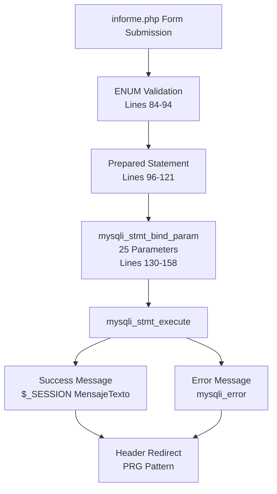
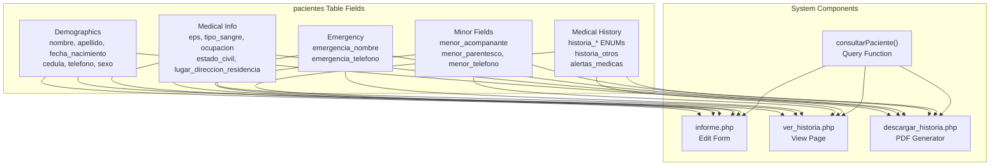

# Patient Medical History Schema

> **Relevant source files**
> * [Admin/descargar_historia.php](https://github.com/axchisan/Consultorio_Emily_Bernal/blob/589034b9/Admin/descargar_historia.php)
> * [Admin/informe.php](https://github.com/axchisan/Consultorio_Emily_Bernal/blob/589034b9/Admin/informe.php)
> * [Admin/ver_historia.php](https://github.com/axchisan/Consultorio_Emily_Bernal/blob/589034b9/Admin/ver_historia.php)

## Purpose and Scope

This document details the comprehensive structure of the `pacientes` table, which stores patient demographic information, emergency contacts, and family medical history within the Consultorio Emily Bernal database. The schema is designed to support complete anamnesis tracking for dental patients, including detailed medical history captured through standardized ENUM fields.

For information about the overall database relationships, see [Core Data Model](/axchisan/Consultorio_Emily_Bernal/4.1-core-data-model). For details about medical report data linked to patient records, see [Medical Report Data Structure](/axchisan/Consultorio_Emily_Bernal/4.3-medical-report-data-structure).

---

## Table Structure Overview

The `pacientes` table serves as the central repository for patient information, containing 27 fields organized into five functional categories: demographics, contact information, emergency contacts, minor patient data, and medical history.

**Key Table Properties:**

* **Primary Key:** `id_paciente` (INT, auto-increment)
* **Referenced By:** `citas` table (foreign key `id_paciente`)
* **Referenced By:** `informe_medico` table (foreign key `id_paciente`)

Sources: [Admin/informe.php L26-L36](https://github.com/axchisan/Consultorio_Emily_Bernal/blob/589034b9/Admin/informe.php#L26-L36)

 [Admin/descargar_historia.php L39-L46](https://github.com/axchisan/Consultorio_Emily_Bernal/blob/589034b9/Admin/descargar_historia.php#L39-L46)

---

## Demographic and Contact Fields

The following table lists all demographic and general contact fields in the `pacientes` table:

| Field Name | Data Type | Description | Required | Example |
| --- | --- | --- | --- | --- |
| `id_paciente` | INT | Primary key, auto-increment | Yes | 1 |
| `nombre` | VARCHAR | Patient's first name | Yes | "Juan" |
| `apellido` | VARCHAR | Patient's last name | Yes | "Pérez" |
| `fecha_nacimiento` | DATE | Birth date, used for age calculation | Yes | "1990-05-15" |
| `correo_electronico` | VARCHAR | Email address | Yes | "[juan@example.com](mailto:juan@example.com)" |
| `telefono` | VARCHAR | Primary phone number | No | "3001234567" |
| `cedula` | VARCHAR | National ID/document number | No | "1234567890" |
| `sexo` | ENUM | Gender: 'Masculino' or 'Femenino' | No | "Masculino" |
| `eps` | VARCHAR | Health insurance provider | No | "Sura EPS" |
| `ocupacion` | VARCHAR | Patient's occupation | No | "Ingeniero" |
| `estado_civil` | VARCHAR | Marital status | No | "Casado" |
| `lugar_direccion_residencia` | VARCHAR | Full residential address | No | "Calle 123 #45-67, Barbosa" |
| `tipo_sangre` | VARCHAR | Blood type | No | "O+" |

**Age Calculation Pattern:**

The system calculates patient age dynamically from `fecha_nacimiento` using PHP's `DateTime` class:

```
$birthDate = new DateTime($patient['fecha_nacimiento']);
$currentDate = new DateTime();
$age = $currentDate->diff($birthDate)->y;
```

This pattern appears consistently across [Admin/informe.php L39-L44](https://github.com/axchisan/Consultorio_Emily_Bernal/blob/589034b9/Admin/informe.php#L39-L44)

 [Admin/descargar_historia.php L48-L54](https://github.com/axchisan/Consultorio_Emily_Bernal/blob/589034b9/Admin/descargar_historia.php#L48-L54)

 and [Admin/ver_historia.php L46-L48](https://github.com/axchisan/Consultorio_Emily_Bernal/blob/589034b9/Admin/ver_historia.php#L46-L48)

Sources: [Admin/informe.php L508-L583](https://github.com/axchisan/Consultorio_Emily_Bernal/blob/589034b9/Admin/informe.php#L508-L583)

 [Admin/descargar_historia.php L157-L195](https://github.com/axchisan/Consultorio_Emily_Bernal/blob/589034b9/Admin/descargar_historia.php#L157-L195)

---

## Emergency Contact System

The schema includes dedicated fields for emergency contact information, critical for patient safety during dental procedures:

| Field Name | Data Type | Description | Display Context |
| --- | --- | --- | --- |
| `emergencia_nombre` | VARCHAR | Name of emergency contact | "En caso de emergencia, llamar a:" |
| `emergencia_telefono` | VARCHAR | Emergency contact phone | "Teléfono de Emergencia:" |

These fields are always displayed in patient information forms and PDF reports alongside primary patient data.

Sources: [Admin/informe.php L557-L563](https://github.com/axchisan/Consultorio_Emily_Bernal/blob/589034b9/Admin/informe.php#L557-L563)

 [Admin/descargar_historia.php L184-L190](https://github.com/axchisan/Consultorio_Emily_Bernal/blob/589034b9/Admin/descargar_historia.php#L184-L190)

---

## Minor Patient Fields

For patients under 18 years of age, additional guardian/companion information is collected and conditionally displayed:

| Field Name | Data Type | Description | Usage |
| --- | --- | --- | --- |
| `menor_acompanante` | VARCHAR | Guardian/companion name | Required if age < 18 |
| `menor_parentesco` | VARCHAR | Relationship to patient | "Madre", "Padre", "Tutor" |
| `menor_telefono` | VARCHAR | Guardian contact number | Required if age < 18 |

**Conditional Display Logic:**

```php
<?php if ($age !== 'N/A' && $age < 18) { ?>
    <div class="form-group">
        <label for="menor_acompanante">Nombre del Acompañante (Menor de Edad):</label>
        <input type="text" class="form-control" id="menor_acompanante" name="menor_acompanante">
    </div>
<?php } ?>
```

Sources: [Admin/informe.php L564-L577](https://github.com/axchisan/Consultorio_Emily_Bernal/blob/589034b9/Admin/informe.php#L564-L577)

 [Admin/ver_historia.php L158-L162](https://github.com/axchisan/Consultorio_Emily_Bernal/blob/589034b9/Admin/ver_historia.php#L158-L162)

 [Admin/descargar_historia.php L182-L193](https://github.com/axchisan/Consultorio_Emily_Bernal/blob/589034b9/Admin/descargar_historia.php#L182-L193)

---

## Medical History ENUM Schema

The anamnesis section captures family and personal medical history through nine ENUM fields, each accepting only two values: `'Sí'` or `'No'`. This standardized approach ensures data consistency for PDF generation and reporting.

### ENUM Field Definitions

| Field Name | Category | ENUM Values | PDF Label |
| --- | --- | --- | --- |
| `historia_cardiovasculares` | Cardiovascular | 'Sí', 'No' | "1. Enf. Cardiovasculares" |
| `historia_hemorragicas` | Hemorrhagic | 'Sí', 'No' | "2. Enf. Hemorrágicas" |
| `historia_dermatologicas` | Dermatological | 'Sí', 'No' | "3. Enf. Dermatológicas" |
| `historia_mentales` | Mental Health | 'Sí', 'No' | "4. Enf. Mentales" |
| `historia_diabetes` | Metabolic | 'Sí', 'No' | "5. Diabetes" |
| `historia_cancer` | Oncological | 'Sí', 'No' | "6. Cáncer" |
| `historia_artritis` | Rheumatological | 'Sí', 'No' | "7. Artritis" |
| `historia_alergias` | Allergic | 'Sí', 'No' | "8. Alergias" |
| `historia_cirugias` | Surgical | 'Sí', 'No' | "9. Cirugías" |

### Additional Medical Fields

| Field Name | Data Type | Description | Max Length |
| --- | --- | --- | --- |
| `historia_otros` | TEXT | Other medical conditions not covered by ENUMs | 17 chars in UI |
| `alertas_medicas` | TEXT | Critical medical alerts (allergies, medications, warnings) | Unlimited |

**ENUM Validation Pattern:**

```
$historia_cardiovasculares = isset($_POST['historia_cardiovasculares']) 
    && in_array($_POST['historia_cardiovasculares'], ['Sí', 'No']) 
    ? $_POST['historia_cardiovasculares'] 
    : 'No';
```

This validation pattern is applied to all nine ENUM fields in [Admin/informe.php L84-L94](https://github.com/axchisan/Consultorio_Emily_Bernal/blob/589034b9/Admin/informe.php#L84-L94)

Sources: [Admin/informe.php L84-L94](https://github.com/axchisan/Consultorio_Emily_Bernal/blob/589034b9/Admin/informe.php#L84-L94)

 [Admin/informe.php L593-L661](https://github.com/axchisan/Consultorio_Emily_Bernal/blob/589034b9/Admin/informe.php#L593-L661)

 [Admin/descargar_historia.php L233-L270](https://github.com/axchisan/Consultorio_Emily_Bernal/blob/589034b9/Admin/descargar_historia.php#L233-L270)

---

## Database Update Operation

The complete patient update operation involves 25 parameters bound to a prepared statement:



**UPDATE Query Structure:**

The query updates all patient fields simultaneously using prepared statements to prevent SQL injection:

```sql
UPDATE pacientes SET 
    telefono = ?, eps = ?, ocupacion = ?, estado_civil = ?, cedula = ?, sexo = ?,
    emergencia_nombre = ?, emergencia_telefono = ?,
    menor_acompanante = ?, menor_parentesco = ?, menor_telefono = ?,
    tipo_sangre = ?, alertas_medicas = ?, lugar_direccion_residencia = ?,
    historia_cardiovasculares = ?, historia_hemorragicas = ?,
    historia_dermatologicas = ?, historia_mentales = ?,
    historia_diabetes = ?, historia_cancer = ?, historia_artritis = ?,
    historia_alergias = ?, historia_cirugias = ?, historia_otros = ?
WHERE id_paciente = ?
```

Sources: [Admin/informe.php L96-L171](https://github.com/axchisan/Consultorio_Emily_Bernal/blob/589034b9/Admin/informe.php#L96-L171)

---

## Anamnesis Table Rendering

### HTML Form Structure

The medical history is rendered as an HTML table with radio button inputs for each ENUM field:

```mermaid
flowchart TD

Table[""]
Header["Row<br>Historia | Sí | No"]
Body["9 History Rows + Other"]
Row1["historia_cardiovasculares<br>Radio: Sí | No"]
Row2["historia_hemorragicas<br>Radio: Sí | No"]
Row3["historia_dermatologicas<br>Radio: Sí | No"]
Row4["historia_mentales<br>Radio: Sí | No"]
Row5["historia_diabetes<br>Radio: Sí | No"]
Row6["historia_cancer<br>Radio: Sí | No"]
Row7["historia_artritis<br>Radio: Sí | No"]
Row8["historia_alergias<br>Radio: Sí | No"]
Row9["historia_cirugias<br>Radio: Sí | No"]
Row10["historia_otros<br>textarea maxlength=17"]
Footer["alertas_medicas<br>textarea (unlimited)"]

Table --> Header
Table --> Body
Body --> Row1
Body --> Row2
Body --> Row3
Body --> Row4
Body --> Row5
Body --> Row6
Body --> Row7
Body --> Row8
Body --> Row9
Body --> Row10
Table --> Footer
```

### PDF Rendering Pattern

In PDF generation, the ENUM values are rendered as 'X' marks in table cells:

```
$pdf->Cell($anamnesis_label_width, 7, '1. Enf. Cardiovasculares', 1, 0, 'L', 1);
$pdf->Cell($anamnesis_check_width, 7, $patient['historia_cardiovasculares'] == 'Sí' ? 'X' : '', 1, 0, 'C', 0);
$pdf->Cell($anamnesis_check_width, 7, $patient['historia_cardiovasculares'] == 'No' ? 'X' : '', 1, 1, 'C', 0);
```

Sources: [Admin/informe.php L593-L661](https://github.com/axchisan/Consultorio_Emily_Bernal/blob/589034b9/Admin/informe.php#L593-L661)

 [Admin/descargar_historia.php L205-L271](https://github.com/axchisan/Consultorio_Emily_Bernal/blob/589034b9/Admin/descargar_historia.php#L205-L271)

 [Admin/ver_historia.php L171-L237](https://github.com/axchisan/Consultorio_Emily_Bernal/blob/589034b9/Admin/ver_historia.php#L171-L237)

---

## Data Access Patterns

### Query Function Integration

Patient data is retrieved through the `consultarPaciente()` function defined in `php/consultas.php`:

```mermaid
sequenceDiagram
  participant Admin Page
  participant consultarPaciente()
  participant MySQL Database

  Admin Page->>consultarPaciente(): consultarPaciente($link, $patient_id)
  consultarPaciente()->>MySQL Database: SELECT * FROM pacientes WHERE id_paciente = ?
  MySQL Database-->>consultarPaciente(): Patient row array
  consultarPaciente()-->>Admin Page: $patient = mysqli_fetch_assoc()
  note over Admin Page: Access fields:
```

### Field Access Pattern

Once retrieved, patient data is accessed as an associative array with null coalescing for optional fields:

```
$patient['nombre']                      // Always present
$patient['cedula'] ?? 'N/A'            // Optional with fallback
$patient['historia_cardiovasculares']   // ENUM field
$patient['alertas_medicas'] ?? ''      // TEXT field, may be empty
```

Sources: [Admin/informe.php L29-L36](https://github.com/axchisan/Consultorio_Emily_Bernal/blob/589034b9/Admin/informe.php#L29-L36)

 [Admin/descargar_historia.php L39-L46](https://github.com/axchisan/Consultorio_Emily_Bernal/blob/589034b9/Admin/descargar_historia.php#L39-L46)

 [Admin/ver_historia.php L36-L43](https://github.com/axchisan/Consultorio_Emily_Bernal/blob/589034b9/Admin/ver_historia.php#L36-L43)

---

## Entity Relationship Context

The `pacientes` table has the following relationships within the database:

```css
#mermaid-bbvz2fko8cs{font-family:ui-sans-serif,-apple-system,system-ui,Segoe UI,Helvetica;font-size:16px;fill:#333;}@keyframes edge-animation-frame{from{stroke-dashoffset:0;}}@keyframes dash{to{stroke-dashoffset:0;}}#mermaid-bbvz2fko8cs .edge-animation-slow{stroke-dasharray:9,5!important;stroke-dashoffset:900;animation:dash 50s linear infinite;stroke-linecap:round;}#mermaid-bbvz2fko8cs .edge-animation-fast{stroke-dasharray:9,5!important;stroke-dashoffset:900;animation:dash 20s linear infinite;stroke-linecap:round;}#mermaid-bbvz2fko8cs .error-icon{fill:#dddddd;}#mermaid-bbvz2fko8cs .error-text{fill:#222222;stroke:#222222;}#mermaid-bbvz2fko8cs .edge-thickness-normal{stroke-width:1px;}#mermaid-bbvz2fko8cs .edge-thickness-thick{stroke-width:3.5px;}#mermaid-bbvz2fko8cs .edge-pattern-solid{stroke-dasharray:0;}#mermaid-bbvz2fko8cs .edge-thickness-invisible{stroke-width:0;fill:none;}#mermaid-bbvz2fko8cs .edge-pattern-dashed{stroke-dasharray:3;}#mermaid-bbvz2fko8cs .edge-pattern-dotted{stroke-dasharray:2;}#mermaid-bbvz2fko8cs .marker{fill:#999;stroke:#999;}#mermaid-bbvz2fko8cs .marker.cross{stroke:#999;}#mermaid-bbvz2fko8cs svg{font-family:ui-sans-serif,-apple-system,system-ui,Segoe UI,Helvetica;font-size:16px;}#mermaid-bbvz2fko8cs p{margin:0;}#mermaid-bbvz2fko8cs .entityBox{fill:#ffffff;stroke:#dddddd;}#mermaid-bbvz2fko8cs .relationshipLabelBox{fill:#dddddd;opacity:0.7;background-color:#dddddd;}#mermaid-bbvz2fko8cs .relationshipLabelBox rect{opacity:0.5;}#mermaid-bbvz2fko8cs .labelBkg{background-color:rgba(221, 221, 221, 0.5);}#mermaid-bbvz2fko8cs .edgeLabel .label{fill:#dddddd;font-size:14px;}#mermaid-bbvz2fko8cs .label{font-family:ui-sans-serif,-apple-system,system-ui,Segoe UI,Helvetica;color:#333;}#mermaid-bbvz2fko8cs .edge-pattern-dashed{stroke-dasharray:8,8;}#mermaid-bbvz2fko8cs .node rect,#mermaid-bbvz2fko8cs .node circle,#mermaid-bbvz2fko8cs .node ellipse,#mermaid-bbvz2fko8cs .node polygon{fill:#ffffff;stroke:#dddddd;stroke-width:1px;}#mermaid-bbvz2fko8cs .relationshipLine{stroke:#999;stroke-width:1;fill:none;}#mermaid-bbvz2fko8cs .marker{fill:none!important;stroke:#999!important;stroke-width:1;}#mermaid-bbvz2fko8cs :root{--mermaid-font-family:"trebuchet ms",verdana,arial,sans-serif;}scheduleshasPACIENTESintid_pacientePKPrimary KeystringnombreFirst NamestringapellidoLast Namedatefecha_nacimientoBirth Datestringcorreo_electronicoEmailstringtelefonoPhonestringcedulaID NumberstringsexoGender ENUMstringepsHealth InsurancestringocupacionOccupationstringestado_civilMarital Statusstringlugar_direccion_residenciaAddressstringtipo_sangreBlood Typestringemergencia_nombreEmergency Contact Namestringemergencia_telefonoEmergency Phonestringmenor_acompananteGuardian Namestringmenor_parentescoGuardian Relationstringmenor_telefonoGuardian Phoneenumhistoria_cardiovascularesSí/Noenumhistoria_hemorragicasSí/Noenumhistoria_dermatologicasSí/Noenumhistoria_mentalesSí/Noenumhistoria_diabetesSí/Noenumhistoria_cancerSí/Noenumhistoria_artritisSí/Noenumhistoria_alergiasSí/Noenumhistoria_cirugiasSí/Notexthistoria_otrosOther Conditionstextalertas_medicasMedical AlertsCITASintid_citaPKintid_pacienteFKintid_doctorFKdatefecha_citastringestadoINFORME_MEDICOintid_informePKintid_citaFKintid_pacienteFKtextexamen_intraoraltextdiagnostico
```

**Relationship Notes:**

* One patient can have many appointments (`CITAS`)
* One patient can have many medical reports (`INFORME_MEDICO`)
* Medical reports are linked both to patients and specific appointments
* Patient data is retrieved via `consultarPaciente($link, $id_paciente)` function

Sources: [Admin/informe.php L47-L65](https://github.com/axchisan/Consultorio_Emily_Bernal/blob/589034b9/Admin/informe.php#L47-L65)

 [Admin/descargar_historia.php L57-L73](https://github.com/axchisan/Consultorio_Emily_Bernal/blob/589034b9/Admin/descargar_historia.php#L57-L73)

---

## Field Usage Across System Components

The following diagram maps which patient fields are used in each major system component:



### Component-Specific Field Usage

**informe.php (Medical Report Editor):**

* **Editable:** All 27 fields via HTML form inputs
* **Validation:** ENUM fields restricted to 'Sí'/'No' values
* **Update:** Single prepared statement updates all fields
* **Lines:** [Admin/informe.php L508-L668](https://github.com/axchisan/Consultorio_Emily_Bernal/blob/589034b9/Admin/informe.php#L508-L668)

**ver_historia.php (History Viewer):**

* **Display:** All 27 fields in read-only format
* **Conditional:** Minor fields shown only if age < 18
* **Format:** Checkmarks (✓) for ENUM 'Sí' values
* **Lines:** [Admin/ver_historia.php L134-L237](https://github.com/axchisan/Consultorio_Emily_Bernal/blob/589034b9/Admin/ver_historia.php#L134-L237)

**descargar_historia.php (PDF Generator):**

* **Render:** All fields formatted in structured PDF tables
* **Layout:** Demographics in 2-column table, anamnesis in specialized table
* **Special:** ENUM fields rendered as 'X' marks in checkbox columns
* **Lines:** [Admin/descargar_historia.php L139-L275](https://github.com/axchisan/Consultorio_Emily_Bernal/blob/589034b9/Admin/descargar_historia.php#L139-L275)

Sources: [Admin/informe.php L508-L783](https://github.com/axchisan/Consultorio_Emily_Bernal/blob/589034b9/Admin/informe.php#L508-L783)

 [Admin/ver_historia.php L134-L279](https://github.com/axchisan/Consultorio_Emily_Bernal/blob/589034b9/Admin/ver_historia.php#L134-L279)

 [Admin/descargar_historia.php L139-L292](https://github.com/axchisan/Consultorio_Emily_Bernal/blob/589034b9/Admin/descargar_historia.php#L139-L292)

---

## Data Validation and Constraints

### ENUM Field Validation

All nine medical history ENUM fields undergo server-side validation before database insertion:

```
// Validation pattern applied to each historia_* field
$historia_cardiovasculares = isset($_POST['historia_cardiovasculares']) 
    && in_array($_POST['historia_cardiovasculares'], ['Sí', 'No']) 
    ? $_POST['historia_cardiovasculares'] 
    : 'No';  // Default to 'No' if invalid
```

**Validation Rules:**

* Must be exactly `'Sí'` or `'No'` (case-sensitive, with accent)
* Invalid values default to `'No'`
* Applied to: `historia_cardiovasculares`, `historia_hemorragicas`, `historia_dermatologicas`, `historia_mentales`, `historia_diabetes`, `historia_cancer`, `historia_artritis`, `historia_alergias`, `historia_cirugias`

### String Field Sanitization

All text inputs are sanitized using `mysqli_real_escape_string()`:

```
$telefono = mysqli_real_escape_string($link, $_POST['telefono']);
$alertas_medicas = mysqli_real_escape_string($link, $_POST['alertas_medicas']);
```

### Special Constraints

| Field | Constraint | Enforcement |
| --- | --- | --- |
| `historia_otros` | maxlength="17" | HTML input attribute + JavaScript counter |
| `nombre`, `apellido`, `correo_electronico`, `fecha_nacimiento` | Required (non-nullable) | Database schema + application logic |
| All other fields | Optional (nullable) | Database allows NULL, UI shows 'N/A' |

Sources: [Admin/informe.php L68-L171](https://github.com/axchisan/Consultorio_Emily_Bernal/blob/589034b9/Admin/informe.php#L68-L171)

 [Admin/informe.php L792-L810](https://github.com/axchisan/Consultorio_Emily_Bernal/blob/589034b9/Admin/informe.php#L792-L810)

---

## Character Encoding Considerations

Patient data containing Spanish characters (accents, ñ) requires proper encoding handling:

**Display Context:**

```php
echo htmlspecialchars(utf8_decode($patient['nombre'] . ' ' . $patient['apellido']));
```

**PDF Generation:**

```
$pdf = new TCPDF(PDF_PAGE_ORIENTATION, PDF_UNIT, PDF_PAGE_FORMAT, true, 'UTF-8', false);
```

The system uses UTF-8 encoding throughout, with `utf8_decode()` applied selectively for specific display contexts and `htmlspecialchars()` for XSS prevention.

Sources: [Admin/informe.php L469](https://github.com/axchisan/Consultorio_Emily_Bernal/blob/589034b9/Admin/informe.php#L469-L469)

 [Admin/descargar_historia.php L91](https://github.com/axchisan/Consultorio_Emily_Bernal/blob/589034b9/Admin/descargar_historia.php#L91-L91)