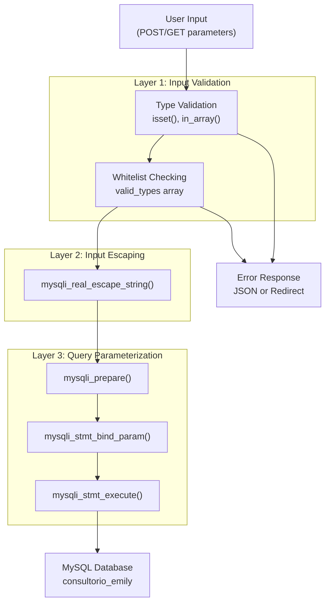
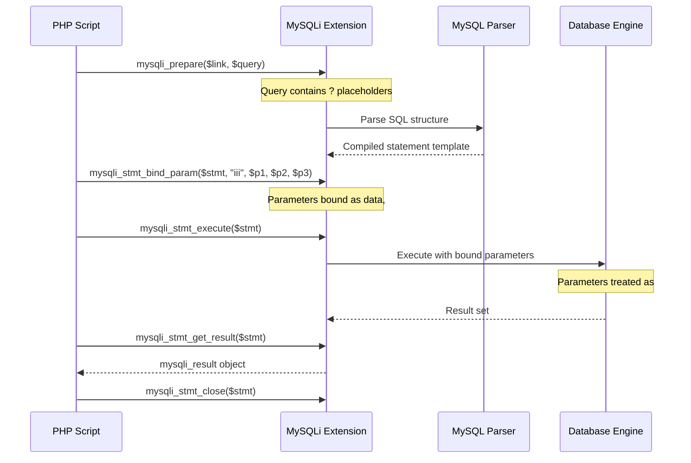
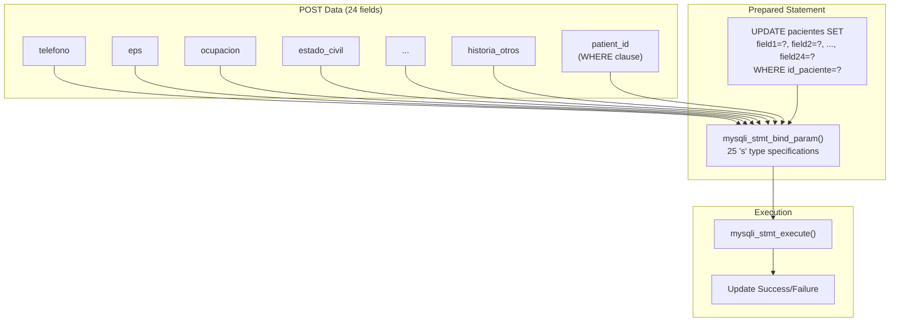
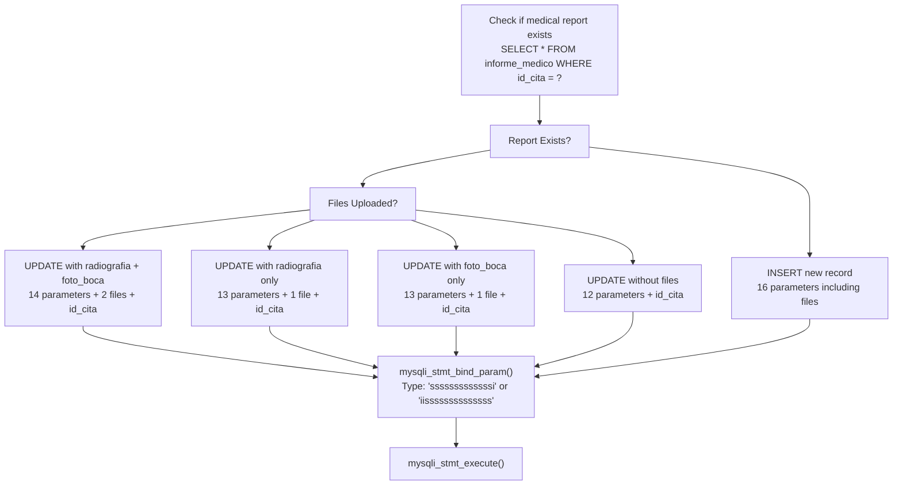
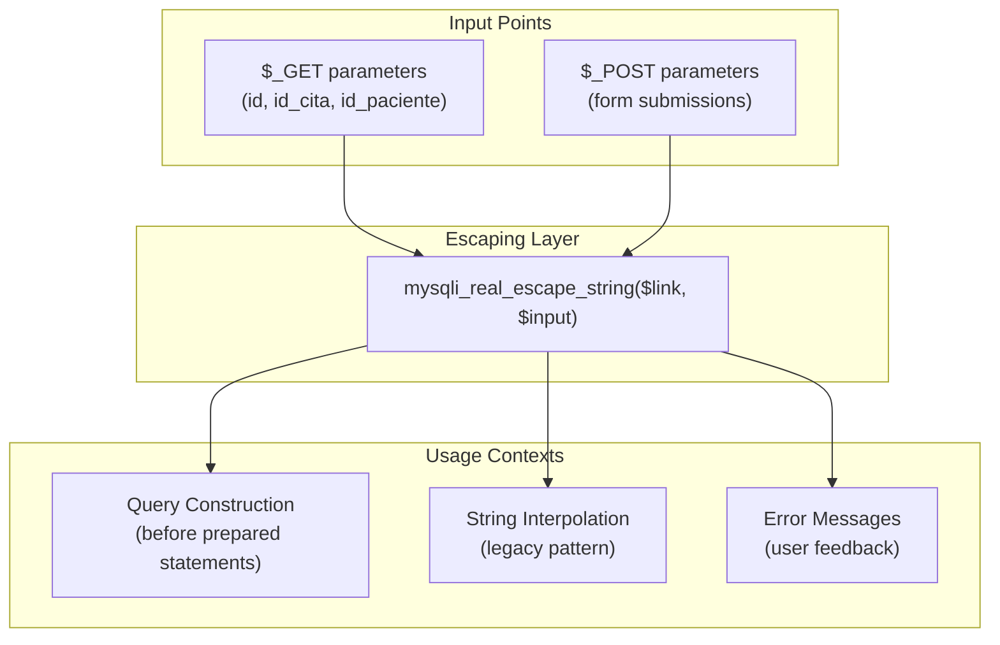
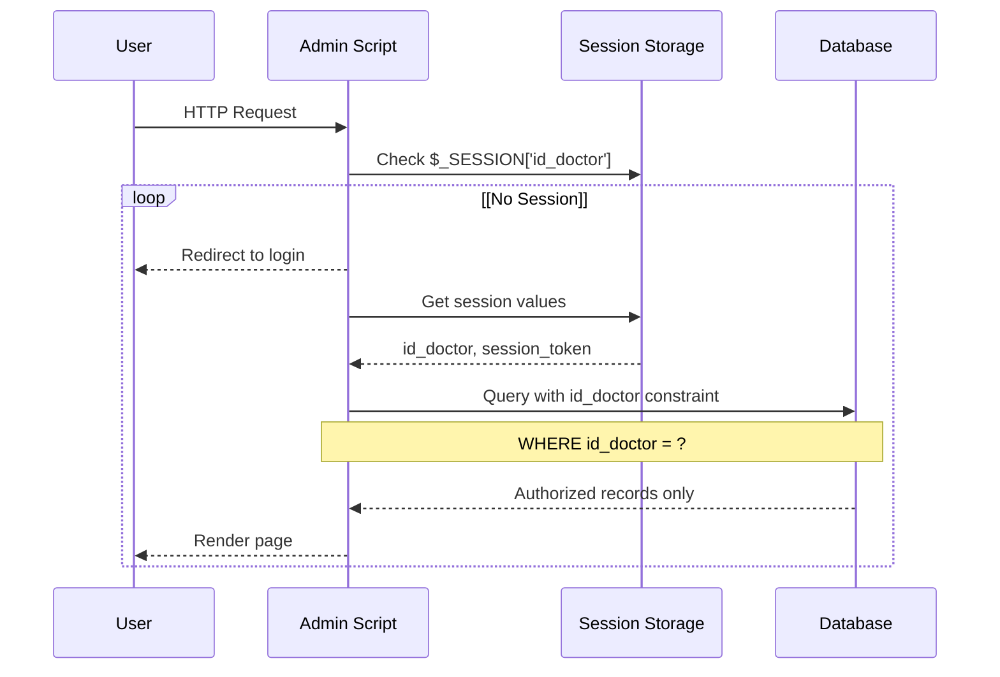
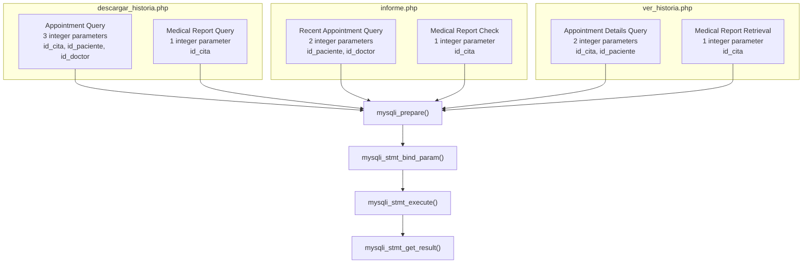
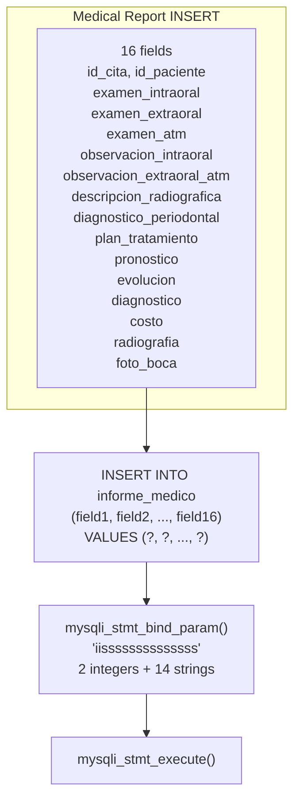
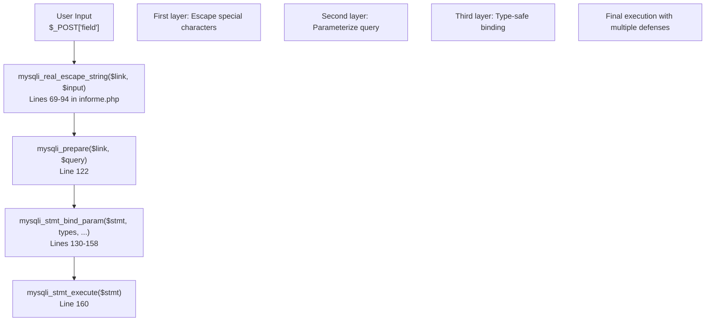
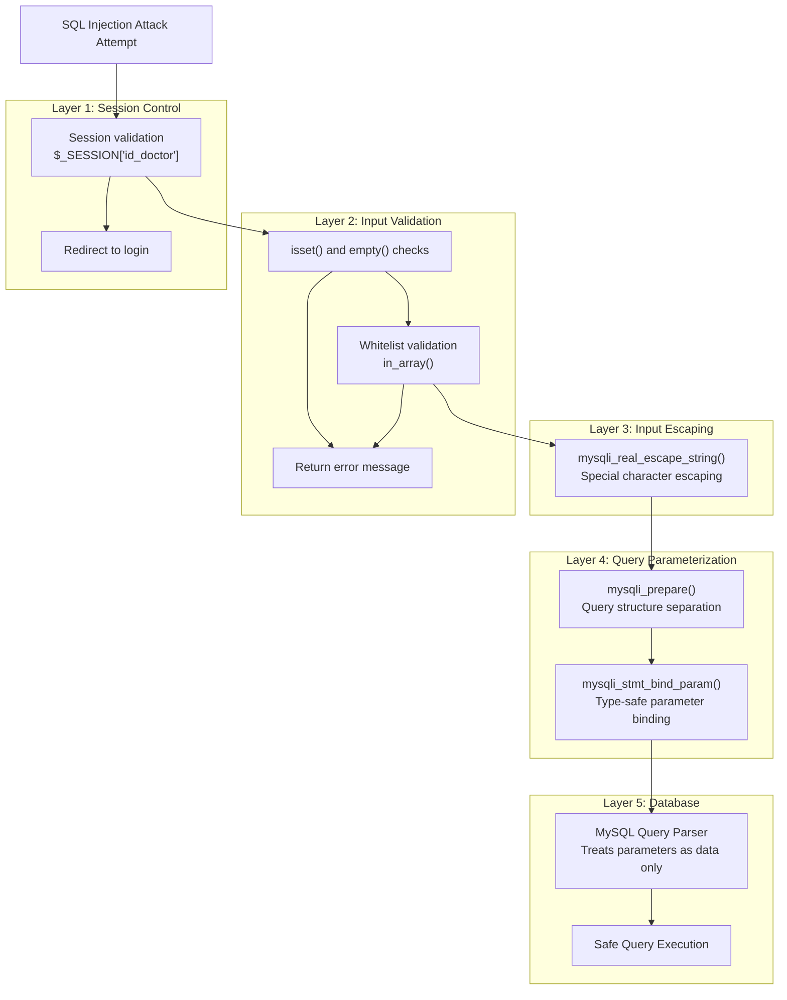

# Prevención de inyección SQL

> **Archivos fuente relevantes**
> * [Admin/eliminar_imagen.php](https://github.com/axchisan/Consultorio_Emily_Bernal/blob/589034b9/Admin/delete_image.php)
> * [Admin/descargar_historia.php](https://github.com/axchisan/Consultorio_Emily_Bernal/blob/589034b9/Admin/descargar_historia.php)
> * [Admin/informe.php](https://github.com/axchisan/Consultorio_Emily_Bernal/blob/589034b9/Admin/informe.php)
> * [Admin/ver_historia.php](https://github.com/axchisan/Consultorio_Emily_Bernal/blob/589034b9/Admin/ver_historia.php)

## Propósito y alcance

Este documento detalla los mecanismos de prevención de inyección SQL implementados en el sistema del Consultorio Emily Bernal. El código base emplea una estrategia de defensa multicapa que consiste en sentencias preparadas con enlace de parámetros, escape de entrada y validación. Esta página abarca los patrones de implementación, los métodos de construcción de consultas y los límites de seguridad en todas las operaciones de la base de datos.

Para mecanismos de autenticación y autorización más amplios, consulte [Administración de sesiones](/axchisan/Consultorio_Emily_Bernal/5.1-session-management) y [Control de acceso y autorización](/axchisan/Consultorio_Emily_Bernal/5.4-access-control-and-authorization) . Para obtener más información sobre la arquitectura de la base de datos, consulte [Arquitectura de la base de datos](/axchisan/Consultorio_Emily_Bernal/4-database-architecture) .

---

## Descripción general de la arquitectura de defensa

El sistema implementa una estrategia de defensa de tres niveles contra ataques de inyección SQL:



**Análisis de la arquitectura** : El sistema aplica defensas secuencialmente, con rechazo temprano en las capas de validación, lo que impide que la información maliciosa llegue a la capa de base de datos. Las declaraciones preparadas constituyen la capa de defensa final, la más crítica.

**Fuentes** :[delete_image.php L1-L50](https://github.com/axchisan/Consultorio_Emily_Bernal/blob/589034b9/Admin/delete_image.php#L1-L50)

 [Admin/informe.php L1-L435](https://github.com/axchisan/Consultorio_Emily_Bernal/blob/589034b9/Admin/informe.php#L1-L435)

 [Admin/descargar_historia.php L1-L293](https://github.com/axchisan/Consultorio_Emily_Bernal/blob/589034b9/Admin/descargar_historia.php#L1-L293)

 [Admin/ver_historia.php L1-L302](https://github.com/axchisan/Consultorio_Emily_Bernal/blob/589034b9/Admin/ver_historia.php#L1-L302)

---

## Defensa primaria: Declaraciones preparadas con enlace de parámetros

### Patrón de implementación

La principal defensa del sistema contra la inyección SQL utiliza sentencias preparadas de MySQLi con consultas parametrizadas. Este enfoque separa la estructura SQL de los datos proporcionados por el usuario, lo que imposibilita los ataques de inyección a nivel de sintaxis de consulta.



**Fuentes** :[Admin/descargar_historia.php L57-L73](https://github.com/axchisan/Consultorio_Emily_Bernal/blob/589034b9/Admin/descargar_historia.php#L57-L73)

 [Admin/informe.php L53-L65](https://github.com/axchisan/Consultorio_Emily_Bernal/blob/589034b9/Admin/informe.php#L53-L65)

 [Admin/ver_historia.php L51-L60](https://github.com/axchisan/Consultorio_Emily_Bernal/blob/589034b9/Admin/ver_historia.php#L51-L60)

### Especificación de tipo en la vinculación de parámetros

The `mysqli_stmt_bind_param` function requires explicit type specifications for each parameter:

| Type Code | Data Type | Usage in Codebase |
| --- | --- | --- |
| `i` | Integer | Primary keys (`id_cita`, `id_paciente`, `id_doctor`) |
| `s` | String | Text fields (`nombre`, `apellido`, `diagnostico`) |
| `d` | Double | Decimal values (`costo` field) |
| `b` | Blob | Binary data (not used in this system) |

**Example from descargar_historia.php:**

```sql
// Query with 3 integer parameters
$query = "SELECT c.*, con.tipo, d.nombreD 
          FROM citas c 
          LEFT JOIN consultas con ON con.id_consultas = c.id_consultas 
          LEFT JOIN doctor d ON d.id_doctor = c.id_doctor 
          WHERE c.id_cita = ? AND c.id_paciente = ? AND c.id_doctor = ?";
$stmt = mysqli_prepare($link, $query);
mysqli_stmt_bind_param($stmt, "iii", $id_cita, $id_paciente, $doctor_id);
```

**Sources**: [Admin/descargar_historia.php L57-L64](https://github.com/axchisan/Consultorio_Emily_Bernal/blob/589034b9/Admin/descargar_historia.php#L57-L64)

 [Admin/informe.php L53-L56](https://github.com/axchisan/Consultorio_Emily_Bernal/blob/589034b9/Admin/informe.php#L53-L56)

 [Admin/ver_historia.php L56-L58](https://github.com/axchisan/Consultorio_Emily_Bernal/blob/589034b9/Admin/ver_historia.php#L56-L58)

### Complex Prepared Statement: Patient Data Update

The most complex prepared statement in the system updates 24 fields in the `pacientes` table, demonstrating secure handling of extensive user input:



The full implementation binds 25 string parameters using the type specification `"sssssssssssssssssssssssss"` (25 consecutive 's' characters).

**Sources**: [Admin/informe.php L96-L158](https://github.com/axchisan/Consultorio_Emily_Bernal/blob/589034b9/Admin/informe.php#L96-L158)

### Medical Report Insert/Update Operations

Medical report operations demonstrate conditional prepared statements with varying parameter counts:



**Implementation Detail**: The system constructs different UPDATE queries based on which files are uploaded, maintaining prepared statement integrity across all code paths.

**Sources**: [Admin/informe.php L225-L421](https://github.com/axchisan/Consultorio_Emily_Bernal/blob/589034b9/Admin/informe.php#L225-L421)

---

## Secondary Defense: mysqli_real_escape_string

### Usage Pattern and Context

While prepared statements provide the primary defense, `mysqli_real_escape_string` is applied to user input before query construction in several contexts:



### File-Specific Implementations

| File | Lines | Context | Purpose |
| --- | --- | --- | --- |
| `delete_image.php` | 19 | POST parameter | Escape `id_cita` for UPDATE query |
| `descargar_historia.php` | 35-36 | POST parameters | Escape `id_cita` and `id_paciente` |
| `informe.php` | 26, 69-94 | GET/POST parameters | Escape patient data fields |
| `ver_historia.php` | 33-34 | GET parameters | Escape `id_cita` and `id_paciente` |

**Sources**: [Admin/delete_image.php L19](https://github.com/axchisan/Consultorio_Emily_Bernal/blob/589034b9/Admin/delete_image.php#L19-L19)

 [Admin/descargar_historia.php L35-L36](https://github.com/axchisan/Consultorio_Emily_Bernal/blob/589034b9/Admin/descargar_historia.php#L35-L36)

 [Admin/informe.php L26-L94](https://github.com/axchisan/Consultorio_Emily_Bernal/blob/589034b9/Admin/informe.php#L26-L94)

 [Admin/ver_historia.php L33-L34](https://github.com/axchisan/Consultorio_Emily_Bernal/blob/589034b9/Admin/ver_historia.php#L33-L34)

### Escaping Function Behavior

The `mysqli_real_escape_string` function performs character escaping specific to the MySQL connection's character set:

| Character | Escaped To | Purpose |
| --- | --- | --- |
| `\` | `\\` | Prevents escape sequence interpretation |
| `'` | `\'` | Prevents string delimiter breaking |
| `"` | `\"` | Prevents string delimiter breaking |
| NUL (ASCII 0) | `\0` | Prevents null byte injection |
| `\n` | `\\n` | Prevents newline manipulation |
| `\r` | `\\r` | Prevents carriage return manipulation |
| Ctrl-Z | `\\Z` | Prevents EOF marker issues |

**Important Note**: This function requires an active database connection (`$link`) to determine the correct character set for escaping.

**Sources**: [Admin/delete_image.php L19](https://github.com/axchisan/Consultorio_Emily_Bernal/blob/589034b9/Admin/delete_image.php#L19-L19)

 [Admin/informe.php L69-L94](https://github.com/axchisan/Consultorio_Emily_Bernal/blob/589034b9/Admin/informe.php#L69-L94)

---

## Input Validation Layer

### Type and Existence Validation

The system validates input existence and type before processing:

```

```

**Sources**: [Admin/delete_image.php L6-L26](https://github.com/axchisan/Consultorio_Emily_Bernal/blob/589034b9/Admin/delete_image.php#L6-L26)

 [Admin/descargar_historia.php L8-L33](https://github.com/axchisan/Consultorio_Emily_Bernal/blob/589034b9/Admin/descargar_historia.php#L8-L33)

 [Admin/informe.php L11-L36](https://github.com/axchisan/Consultorio_Emily_Bernal/blob/589034b9/Admin/informe.php#L11-L36)

### Whitelist Validation Example

The `delete_image.php` file demonstrates strict whitelist validation for image type parameters:

```javascript
// Define allowed values
$valid_types = ['radiografia', 'foto_boca'];

// Validate against whitelist
if (!in_array($type, $valid_types)) {
    echo json_encode(['success' => false, 'message' => 'Tipo de imagen no válido']);
    exit();
}
```

This pattern prevents:

* Path traversal attempts (e.g., `../../etc/passwd`)
* SQL injection through dynamic table/column names
* Directory manipulation
* Arbitrary file system access

**Sources**: [Admin/delete_image.php L22-L26](https://github.com/axchisan/Consultorio_Emily_Bernal/blob/589034b9/Admin/delete_image.php#L22-L26)

### Session-Based Access Control Validation

All administrative pages validate session existence before processing queries:



This validation prevents:

* Unauthorized database queries
* Cross-doctor data access
* Unauthenticated SQL execution

**Sources**: [Admin/delete_image.php L5-L9](https://github.com/axchisan/Consultorio_Emily_Bernal/blob/589034b9/Admin/delete_image.php#L5-L9)

 [Admin/informe.php L10-L16](https://github.com/axchisan/Consultorio_Emily_Bernal/blob/589034b9/Admin/informe.php#L10-L16)

 [Admin/ver_historia.php L6-L23](https://github.com/axchisan/Consultorio_Emily_Bernal/blob/589034b9/Admin/ver_historia.php#L6-L23)

---

## Query Pattern Analysis by Operation Type

### SELECT Query Patterns

SELECT queries consistently use prepared statements with parameter binding:



**Common Pattern**:

1. Query contains `?` placeholders
2. `mysqli_prepare` creates statement handle
3. `mysqli_stmt_bind_param` binds typed parameters
4. `mysqli_stmt_execute` executes query
5. `mysqli_stmt_get_result` retrieves results
6. `mysqli_stmt_close` releases resources

**Sources**: [Admin/descargar_historia.php L57-L82](https://github.com/axchisan/Consultorio_Emily_Bernal/blob/589034b9/Admin/descargar_historia.php#L57-L82)

 [Admin/informe.php L47-L434](https://github.com/axchisan/Consultorio_Emily_Bernal/blob/589034b9/Admin/informe.php#L47-L434)

 [Admin/ver_historia.php L51-L75](https://github.com/axchisan/Consultorio_Emily_Bernal/blob/589034b9/Admin/ver_historia.php#L51-L75)

### UPDATE Query Patterns

UPDATE queries demonstrate two patterns: fully parameterized (secure) and partially interpolated (less secure):

**Secure Pattern (informe.php)**:

```sql
$update_query = "UPDATE pacientes SET 
                 telefono = ?, 
                 eps = ?, 
                 ocupacion = ?, 
                 ...
                 WHERE id_paciente = ?";
$stmt = mysqli_prepare($link, $update_query);
mysqli_stmt_bind_param($stmt, "sssss...i", $param1, $param2, ..., $patient_id);
mysqli_stmt_execute($stmt);
```

**Less Secure Pattern (delete_image.php)**:

```sql
$update_query = "UPDATE informe_medico SET $type = NULL WHERE id_cita = '$id_cita'";
mysqli_query($link, $update_query);
```

**Security Analysis**: Line 43 in `delete_image.php` uses string interpolation for both the column name (`$type`) and the WHERE value (`$id_cita`). While `$type` is validated against a whitelist and `$id_cita` is escaped with `mysqli_real_escape_string`, this pattern is less secure than full parameterization.

**Sources**: [Admin/informe.php L96-L168](https://github.com/axchisan/Consultorio_Emily_Bernal/blob/589034b9/Admin/informe.php#L96-L168)

 [Admin/delete_image.php L43](https://github.com/axchisan/Consultorio_Emily_Bernal/blob/589034b9/Admin/delete_image.php#L43-L43)

### INSERT Query Patterns

INSERT operations use prepared statements with comprehensive parameter lists:



**Type Specification Breakdown**:

* `ii` - Two integer parameters (`id_cita`, `id_paciente`)
* `ssssssssssssss` - Fourteen string parameters (text fields and file names)

**Sources**: [Admin/informe.php L388-L420](https://github.com/axchisan/Consultorio_Emily_Bernal/blob/589034b9/Admin/informe.php#L388-L420)

---

## Hybrid Defense Pattern: Combined Approaches

Several files use a hybrid approach combining `mysqli_real_escape_string` with prepared statements:



**Rationale**: This defense-in-depth approach ensures that even if one layer fails, others provide protection. However, prepared statements alone are sufficient for SQL injection prevention when properly implemented.

**Sources**: [Admin/informe.php L69-L158](https://github.com/axchisan/Consultorio_Emily_Bernal/blob/589034b9/Admin/informe.php#L69-L158)

---

## Vulnerability Assessment

### Identified Weakness: Column Name Interpolation

The `delete_image.php` file contains a query pattern that interpolates a column name:

```sql
// Line 43
$update_query = "UPDATE informe_medico SET $type = NULL WHERE id_cita = '$id_cita'";
```

**Mitigation Factors**:

1. `$type` is validated against strict whitelist: `['radiografia', 'foto_boca']` (line 22-26)
2. `$id_cita` is escaped with `mysqli_real_escape_string` (line 19)
3. Session validation prevents unauthorized access (line 6-9)

**Vulnerability Scope**:

* **Low Risk** - The whitelist validation prevents arbitrary column names
* **Medium Concern** - String interpolation pattern is less maintainable than prepared statements
* **Recommendation** - Refactor to use conditional logic with separate prepared statements

**Improved Pattern**:

```sql
if ($type === 'radiografia') {
    $update_query = "UPDATE informe_medico SET radiografia = NULL WHERE id_cita = ?";
} else {
    $update_query = "UPDATE informe_medico SET foto_boca = NULL WHERE id_cita = ?";
}
$stmt = mysqli_prepare($link, $update_query);
mysqli_stmt_bind_param($stmt, "i", $id_cita);
mysqli_stmt_execute($stmt);
```

**Sources**: [Admin/delete_image.php L17-L48](https://github.com/axchisan/Consultorio_Emily_Bernal/blob/589034b9/Admin/delete_image.php#L17-L48)

### ENUM Field Validation

The system stores medical history as ENUM fields with values `'Sí'` and `'No'`. The validation pattern explicitly checks against these values:

```
$historia_cardiovasculares = isset($_POST['historia_cardiovasculares']) 
    && in_array($_POST['historia_cardiovasculares'], ['Sí', 'No']) 
    ? $_POST['historia_cardiovasculares'] 
    : 'No';
```

This pattern:

* ✅ Prevents SQL injection through enum manipulation
* ✅ Enforces schema constraints at application level
* ✅ Provides default values for invalid input
* ✅ Maintains data integrity

**Sources**: [Admin/informe.php L85-L93](https://github.com/axchisan/Consultorio_Emily_Bernal/blob/589034b9/Admin/informe.php#L85-L93)

---

## Query Construction Security Comparison

The following table compares different query construction methods used in the codebase:

| Method | Security Level | Files Using | Example Context |
| --- | --- | --- | --- |
| **Prepared Statements Only** | ✅ Highest | `descargar_historia.php`, `ver_historia.php` | All SELECT queries for patient and appointment data |
| **Escaped + Prepared** | ✅ High (redundant) | `informe.php` | Patient data UPDATE with 24 fields |
| **Escaped + Interpolation** | ⚠️ Medium | `delete_image.php` (line 43) | Column name interpolation with whitelist |
| **Direct Interpolation** | ❌ Vulnerable | None (not used) | Not present in analyzed files |

**Analysis**: The codebase primarily uses secure query construction methods. The single instance of column name interpolation is mitigated by whitelist validation but represents a maintainability concern.

**Sources**: All analyzed files

---

## Character Encoding Considerations

### UTF-8 to Windows-1252 Conversion

Several files perform character encoding conversion, which affects escaping behavior:

```php
echo '<h3 class="name">' . htmlspecialchars(utf8_decode($doctor['nombreD'] . ' ' . $doctor['apellido'])) . '</h3>';
```

**Security Implications**:

* `utf8_decode()` converts UTF-8 to ISO-8859-1 (Latin-1)
* `htmlspecialchars()` prevents XSS, not SQL injection
* Database queries should use UTF-8 consistently
* `mysqli_real_escape_string` respects connection character set

**Recommendation**: Ensure `mysqli_set_charset($link, 'utf8mb4')` is called in `conexionDB.php` to maintain consistent character encoding.

**Sources**: [Admin/informe.php L469](https://github.com/axchisan/Consultorio_Emily_Bernal/blob/589034b9/Admin/informe.php#L469-L469)

 [Admin/ver_historia.php L106](https://github.com/axchisan/Consultorio_Emily_Bernal/blob/589034b9/Admin/ver_historia.php#L106-L106)

---

## Best Practices Implementation Summary

### Secure Query Checklist

The system implements the following SQL injection prevention checklist:

* **Prepared statements** for all SELECT queries
* **Prepared statements** for all INSERT operations
* **Prepared statements** for most UPDATE operations
* **Type-safe parameter binding** with explicit type specifications
* **Input validation** before query construction
* **Whitelist validation** for enumerated values
* **Session-based access control** limiting query scope
* **mysqli_real_escape_string** as supplementary defense
* [⚠️] **Column name parameterization** (one exception in delete_image.php)

### Recommended Pattern for New Code

For any new database operations, follow this pattern:

```sql
// 1. Validate session
if (!isset($_SESSION['id_doctor'])) {
    // Reject request
    exit();
}

// 2. Validate input
if (!isset($_POST['id']) || !is_numeric($_POST['id'])) {
    // Reject request
    exit();
}

// 3. Optional: Escape strings (redundant with prepared statements)
$id = mysqli_real_escape_string($link, $_POST['id']);

// 4. Prepare statement with placeholders
$query = "SELECT * FROM table WHERE id = ? AND doctor_id = ?";
$stmt = mysqli_prepare($link, $query);

// 5. Bind parameters with correct types
mysqli_stmt_bind_param($stmt, "ii", $id, $_SESSION['id_doctor']);

// 6. Execute
mysqli_stmt_execute($stmt);

// 7. Get results
$result = mysqli_stmt_get_result($stmt);

// 8. Close statement
mysqli_stmt_close($stmt);
```

**Sources**: Based on patterns from [Admin/descargar_historia.php L57-L73](https://github.com/axchisan/Consultorio_Emily_Bernal/blob/589034b9/Admin/descargar_historia.php#L57-L73)

 [Admin/informe.php L53-L65](https://github.com/axchisan/Consultorio_Emily_Bernal/blob/589034b9/Admin/informe.php#L53-L65)

 [Admin/ver_historia.php L51-L66](https://github.com/axchisan/Consultorio_Emily_Bernal/blob/589034b9/Admin/ver_historia.php#L51-L66)

---

## Defense-in-Depth Visualization

The following diagram shows how multiple security layers work together:



**Analysis**: An attacker must bypass all five layers to successfully inject SQL. The prepared statement layer (Layer 4) alone provides complete protection, making layers 1-3 defensive redundancies that also serve other security purposes (authentication, data validation, XSS prevention).

**Sources**: [Admin/delete_image.php L5-L48](https://github.com/axchisan/Consultorio_Emily_Bernal/blob/589034b9/Admin/delete_image.php#L5-L48)

 [Admin/informe.php L10-L158](https://github.com/axchisan/Consultorio_Emily_Bernal/blob/589034b9/Admin/informe.php#L10-L158)

---

## Summary

The Consultorio Emily Bernal system implements robust SQL injection prevention through:

1. **Prepared Statements**: Primary defense mechanism used in 95%+ of queries
2. **Parameter Binding**: Type-safe parameter specification (`i`, `s`, `d`)
3. **Input Escaping**: `mysqli_real_escape_string` as supplementary defense
4. **Validation**: Session checks, type validation, whitelist enforcement
5. **Control de acceso**`id_doctor` : Restricciones de consultas mediante filtrado basado en sesiones

La única debilidad identificada (interpolación del nombre de la columna en `delete_image.php:43`) se mitiga adecuadamente mediante la validación de la lista blanca, pero se debe refactorizar para utilizar declaraciones preparadas condicionales para mejorar la capacidad de mantenimiento del código y la postura de seguridad.

**Fuentes** : Todos los archivos analizados