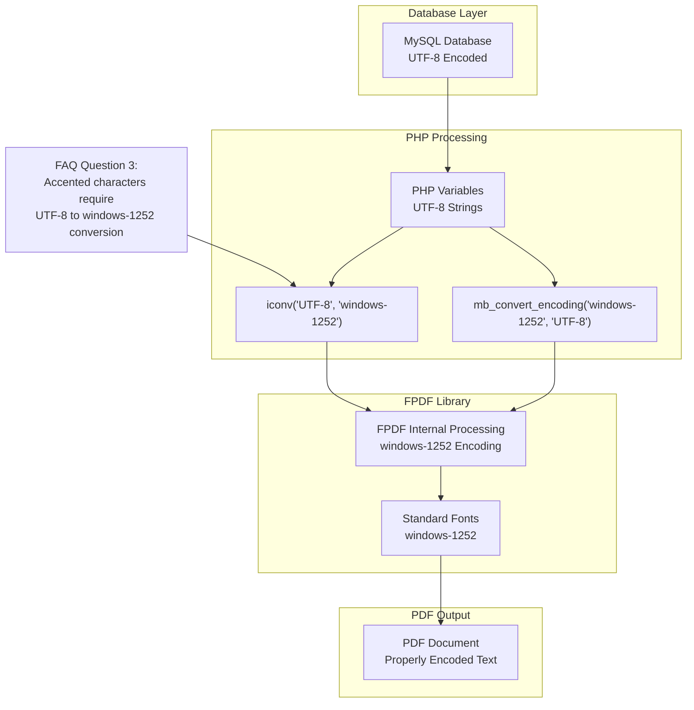
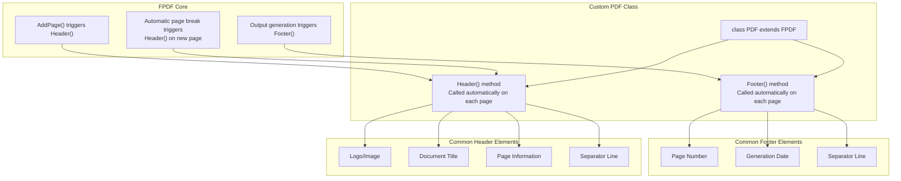
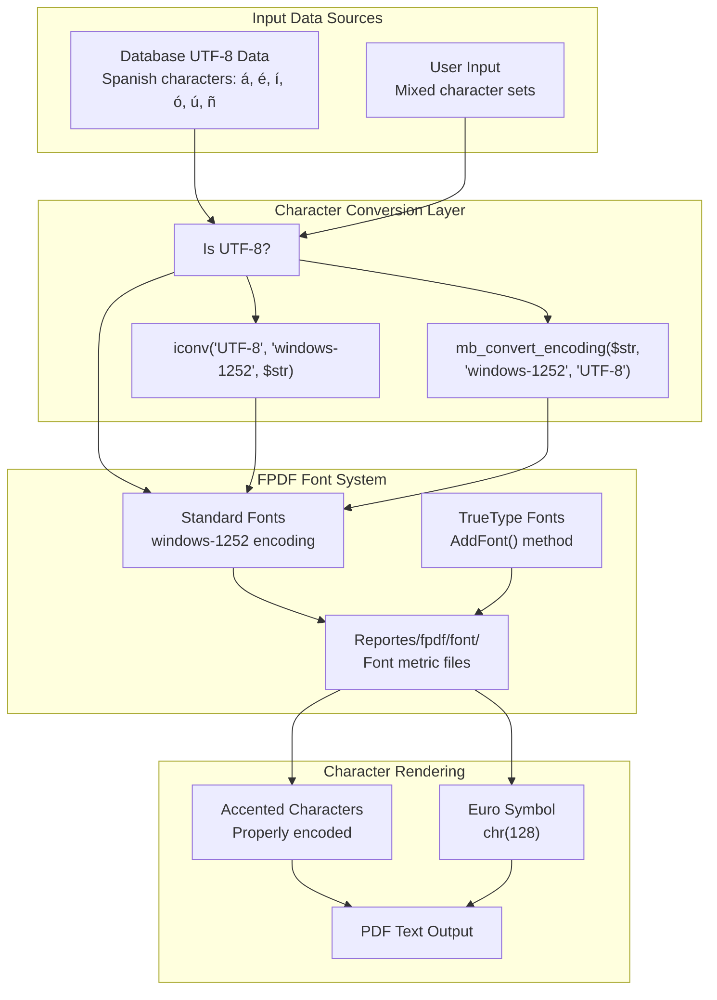
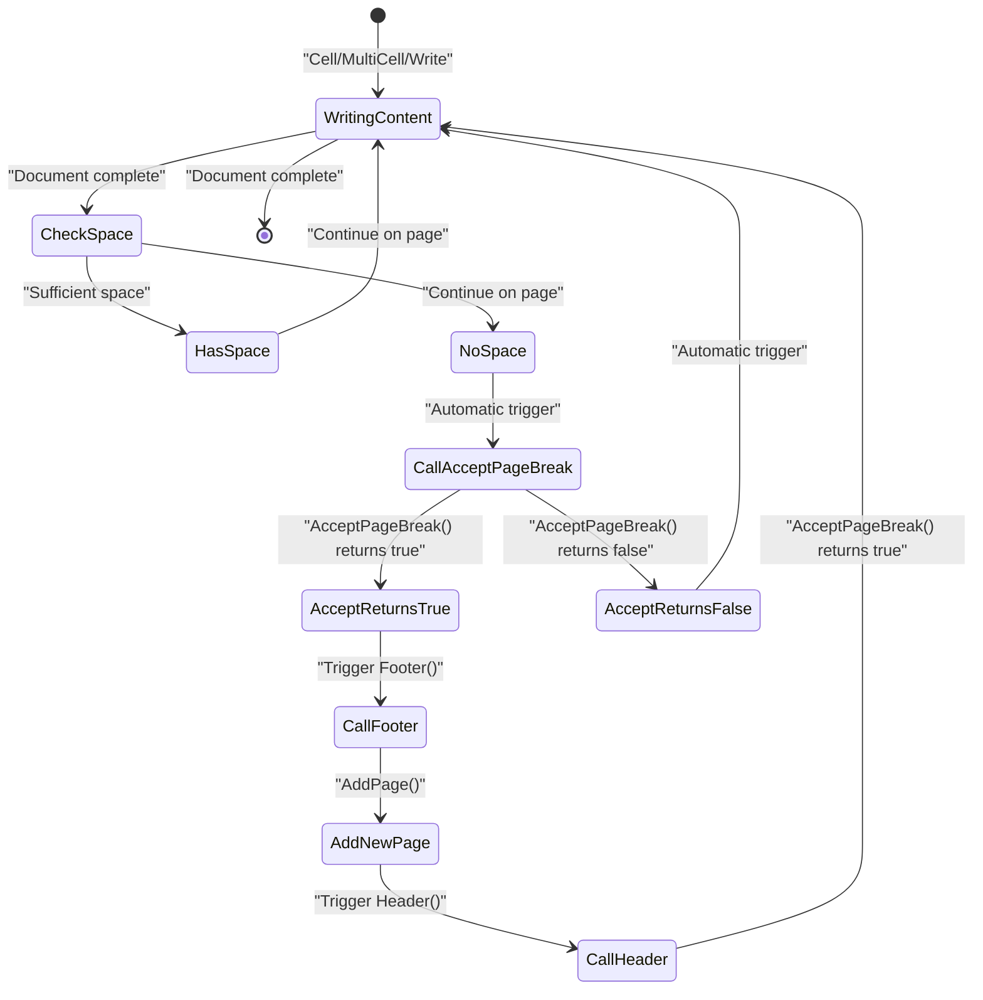
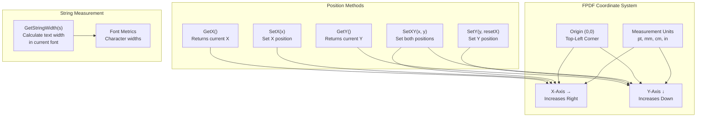

# Referencia de la biblioteca TCPDF

> **Archivos fuente relevantes**
> * [Informes/fpdf/FAQ.htm](https://github.com/axchisan/Consultorio_Emily_Bernal/blob/589034b9/Reportes/fpdf/FAQ.htm)
> * [Reportes/fpdf/Nueva carpeta/FAQ.htm](https://github.com/axchisan/Consultorio_Emily_Bernal/blob/589034b9/Reportes/fpdf/Nueva carpeta/FAQ.htm)
> * [Reportes/fpdf/Nueva carpeta/changelog.htm](https://github.com/axchisan/Consultorio_Emily_Bernal/blob/589034b9/Reportes/fpdf/Nueva carpeta/changelog.htm)

Este documento proporciona documentación de referencia completa para la biblioteca FPDF/TCPDF utilizada en el sistema del Consultorio Emily Bernal. La biblioteca proporciona la funcionalidad básica de generación de PDF para la creación de informes de historia clínica e informes médicos.

**Nota:** El código base utiliza FPDF como motor subyacente de generación de PDF. FPDF es una biblioteca PHP con licencia permisiva para crear documentos PDF sin dependencias externas. Para obtener información sobre los generadores de PDF específicos que utilizan esta biblioteca, consulte [Generador de PDF de Historia Clínica](/axchisan/Consultorio_Emily_Bernal/3.1-clinical-history-pdf-generator) y [Generador de PDF de Informes Médicos](/axchisan/Consultorio_Emily_Bernal/3.2-medical-report-pdf-generator) . Para conocer la arquitectura general del flujo de generación de PDF, consulte [Sistema de Generación de PDF](/axchisan/Consultorio_Emily_Bernal/3-pdf-generation-system) .

**Alcance:** Esta página documenta los métodos de la API FPDF/TCPDF, los patrones de configuración, la resolución de problemas y el historial de versiones. Se centra en los métodos que se utilizan realmente en[Reportes/descargar_historia.php](https://github.com/axchisan/Consultorio_Emily_Bernal/blob/589034b9/Reportes/descargar_historia.php)

y[Informes/generate_informe_pdf.php](https://github.com/axchisan/Consultorio_Emily_Bernal/blob/589034b9/Reportes/generate_informe_pdf.php)

## Descripción general de la biblioteca

FPDF es una clase PHP que permite la generación de documentos PDF usando PHP puro sin necesidad de PDFlib ni otras dependencias externas. La biblioteca se publica bajo una licencia permisiva sin restricciones de uso.

### Arquitectura de integración

```mermaid
flowchart TD

HistoriaPDF["descargar_historia.php"]
InformePDF["generate_informe_pdf.php"]
FPDFCore["Reportes/fpdf/fpdf.php<br>FPDF Class"]
FontFiles["Reportes/fpdf/font/<br>Font Metrics"]
FAQ["Reportes/fpdf/FAQ.htm"]
Changelog["Reportes/fpdf/Nueva carpeta/changelog.htm"]
Constructor["__construct(orientation, unit, size)"]
AddPageMethod["AddPage(orientation, size, rotation)"]
SetFontMethod["SetFont(family, style, size)"]
CellMethod["Cell(w, h, txt, border, ln, align, fill, link)"]
MultiCellMethod["MultiCell(w, h, txt, border, align, fill)"]
ImageMethod["Image(file, x, y, w, h, type, link)"]
OutputMethod["Output(dest, name, isUTF8)"]
HeaderMethod["Header() - Override"]
FooterMethod["Footer() - Override"]
BrowserInline["Browser Inline Display<br>dest='I'"]
BrowserDownload["Browser Download<br>dest='D'"]
FileSystem["Save to File<br>dest='F'"]
StringReturn["Return as String<br>dest='S'"]

HistoriaPDF --> FPDFCore
InformePDF --> FPDFCore
FPDFCore --> Constructor
FPDFCore --> AddPageMethod
FPDFCore --> SetFontMethod
FPDFCore --> CellMethod
FPDFCore --> MultiCellMethod
FPDFCore --> ImageMethod
FPDFCore --> OutputMethod
FPDFCore --> HeaderMethod
FPDFCore --> FooterMethod
OutputMethod --> BrowserInline
OutputMethod --> BrowserDownload
OutputMethod --> FileSystem
OutputMethod --> StringReturn

subgraph subGraph3 ["Output Destinations"]
    BrowserInline
    BrowserDownload
    FileSystem
    StringReturn
end

subgraph subGraph2 ["Core FPDF Methods"]
    Constructor
    AddPageMethod
    SetFontMethod
    CellMethod
    MultiCellMethod
    ImageMethod
    OutputMethod
    HeaderMethod
    FooterMethod
end

subgraph subGraph1 ["FPDF Library Location"]
    FPDFCore
    FontFiles
    FAQ
    Changelog
    FPDFCore --> FontFiles
end

subgraph subGraph0 ["PDF Generators"]
    HistoriaPDF
    InformePDF
end
```



**Fuentes:** [FAQ.htm L1-L267](https://github.com/axchisan/Consultorio_Emily_Bernal/blob/589034b9/Reportes/fpdf/FAQ.htm#L1-L267)

 [Reportes/fpdf/Nueva L1-L189](https://github.com/axchisan/Consultorio_Emily_Bernal/blob/589034b9/Reportes/fpdf/Nueva carpeta/changelog.htm#L1-L189)

### Flujo de codificación de caracteres



**Fuentes:** [FAQ.htm L61-L72](https://github.com/axchisan/Consultorio_Emily_Bernal/blob/589034b9/Reportes/fpdf/FAQ.htm#L61-L72)

 [Reportes/fpdf/Nueva L61-L72](https://github.com/axchisan/Consultorio_Emily_Bernal/blob/589034b9/Reportes/fpdf/Nueva carpeta/FAQ.htm#L61-L72)

## Métodos básicos de la API

La siguiente tabla resume los métodos FPDF esenciales utilizados en todo el sistema de generación de PDF:

| Método | Objetivo | Parámetros clave | Contexto de uso |
| --- | --- | --- | --- |
| `__construct()` | Inicializar documento PDF | `orientation`, `unit`,`size` | Document creation |
| `AddPage()` | Insert new page | `orientation`, `size`, `rotation` | Page management |
| `SetFont()` | Select font family and style | `family`, `style`, `size` | Text formatting |
| `Cell()` | Output single-line text cell | `w`, `h`, `txt`, `border`, `ln`, `align` | Structured content |
| `MultiCell()` | Output multi-line text block | `w`, `h`, `txt`, `border`, `align` | Long text content |
| `Image()` | Insert image | `file`, `x`, `y`, `w`, `h` | Medical images |
| `Output()` | Generate and send PDF | `dest`, `name` | Document delivery |
| `Header()` | Custom page header | (override method) | Page template |
| `Footer()` | Custom page footer | (override method) | Page template |

**Sources:** [Reportes/fpdf/FAQ.htm L1-L267](https://github.com/axchisan/Consultorio_Emily_Bernal/blob/589034b9/Reportes/fpdf/FAQ.htm#L1-L267)

 [Reportes/fpdf/Nueva L44-L142](https://github.com/axchisan/Consultorio_Emily_Bernal/blob/589034b9/Reportes/fpdf/Nueva carpeta/changelog.htm#L44-L142)

### Constructor Method

```yaml
FPDF::__construct([string orientation [, string unit [, mixed size]]])
```

**Parameters:**

* `orientation`: Page orientation - `'P'` (Portrait) or `'L'` (Landscape). Default: `'P'`
* `unit`: Measurement unit - `'pt'`, `'mm'`, `'cm'`, `'in'`. Default: `'mm'`
* `size`: Page size - `'A3'`, `'A4'`, `'A5'`, `'Letter'`, `'Legal'`, or custom array `[width, height]`. Default: `'A4'`

**Example Usage Pattern:**

```
$pdf = new FPDF('P', 'mm', 'A4');
```

**Notes:**

* Since v1.6, different page formats can exist in a single document
* Custom page sizes are validated to ensure width < height
* The decimal separator is forced to dot in the constructor to ensure valid PDFs

**Sources:** [Reportes/fpdf/Nueva L78-L99](https://github.com/axchisan/Consultorio_Emily_Bernal/blob/589034b9/Reportes/fpdf/Nueva carpeta/changelog.htm#L78-L99)

### AddPage Method

```
AddPage([string orientation [, mixed size [, int rotation]]])
```

**Parameters:**

* `orientation`: Override document orientation for this page
* `size`: Override page size for this page
* `rotation`: Page rotation angle - `0`, `90`, `180`, `270` (added in v1.8)

**Behavior:**

* Automatically calls `Open()` if document not yet opened (since v1.52)
* Triggers `Header()` and `Footer()` method calls
* Resets margins and positioning
* Automatic page break in `Header()` no longer causes infinite loop (since v1.6)

**Common Pattern:**

```
$pdf->AddPage();
$pdf->SetFont('Arial', 'B', 16);
$pdf->Cell(0, 10, 'Title', 0, 1, 'C');
```

**Sources:** [Reportes/fpdf/Nueva L49-L98](https://github.com/axchisan/Consultorio_Emily_Bernal/blob/589034b9/Reportes/fpdf/Nueva carpeta/changelog.htm#L49-L98)

### SetFont Method

```
SetFont(string family [, string style [, float size]])
```

**Parameters:**

* `family`: Font family - `'Arial'`, `'Times'`, `'Courier'`, `'Symbol'`, `'ZapfDingbats'`, or custom TrueType font
* `style`: Font style - `''` (regular), `'B'` (bold), `'I'` (italic), `'U'` (underline), or combinations like `'BIU'`
* `size`: Font size in points

**Requirements:**

* Must be called before outputting any text
* Outputting text with no font selected raises an error (since v1.8)
* Font must exist or be added with `AddFont()`

**Standard Fonts:**

* Core 14 PDF fonts available without loading: Arial, Times, Courier, Symbol, ZapfDingbats
* Support windows-1252 encoding
* Symbol and ZapfDingbats support underline since v1.7

**Sources:** [Reportes/fpdf/FAQ.htm L85-L95](https://github.com/axchisan/Consultorio_Emily_Bernal/blob/589034b9/Reportes/fpdf/FAQ.htm#L85-L95)

 [Reportes/fpdf/Nueva L54-L67](https://github.com/axchisan/Consultorio_Emily_Bernal/blob/589034b9/Reportes/fpdf/Nueva carpeta/changelog.htm#L54-L67)

### Cell Method

```
Cell(float w [, float h [, string txt [, mixed border [, int ln [, string align [, boolean fill [, mixed link]]]]]]])
```

**Parameters:**

* `w`: Cell width. If `0`, cell extends to right margin
* `h`: Cell height
* `txt`: Text to display. Can be `0` (the number, not string)
* `border`: Border drawing - `0` (none), `1` (all sides), or combination of `'L'`, `'T'`, `'R'`, `'B'`
* `ln`: Position after cell - `0` (right), `1` (next line), `2` (below)
* `align`: Text alignment - `'L'`, `'C'`, `'R'`
* `fill`: Fill background - `true` or `false`
* `link`: Link destination - URL string or link identifier

**Evolution:**

* v1.2: Added centering and right-aligning
* v1.3: Null width extends to right margin
* v1.4: Border parameter can now specify individual sides
* v1.4: Current position can move under the cell
* v1.53: Fixed bug where number `0` couldn't be printed

**Sources:** [Reportes/fpdf/Nueva L91-L167](https://github.com/axchisan/Consultorio_Emily_Bernal/blob/589034b9/Reportes/fpdf/Nueva carpeta/changelog.htm#L91-L167)

### MultiCell Method

```
MultiCell(float w, float h, string txt [, mixed border [, string align [, boolean fill]]])
```

**Parameters:**

* `w`: Cell width
* `h`: Line height
* `txt`: Text with automatic line breaks. Use double quotes for `\n` to work
* `border`: Border drawing - `0`, `1`, or `'L'`, `'T'`, `'R'`, `'B'` combinations (since v1.5)
* `align`: Text alignment - `'L'`, `'C'`, `'R'`, `'J'` (justified)
* `fill`: Fill background

**Features:**

* Automatic line breaking (since v1.3)
* Text justification support (since v1.3)
* Last line of right-aligned text correctly aligned when terminated by carriage return (fixed v1.52)

**Common Issue:**
Line breaks require double quotes, not single quotes:

```
// WRONG:
$pdf->MultiCell(100, 5, 'Line 1\nLine 2', 0, 'L');

// CORRECT:
$pdf->MultiCell(100, 5, "Line 1\nLine 2", 0, 'L');
```

**Sources:** [Reportes/fpdf/FAQ.htm L117-L120](https://github.com/axchisan/Consultorio_Emily_Bernal/blob/589034b9/Reportes/fpdf/FAQ.htm#L117-L120)

 [Reportes/fpdf/Nueva L125-L158](https://github.com/axchisan/Consultorio_Emily_Bernal/blob/589034b9/Reportes/fpdf/Nueva carpeta/changelog.htm#L125-L158)

### Image Method

```
Image(string file [, float x [, float y [, float w [, float h [, string type [, mixed link]]]]]])
```

**Parameters:**

* `file`: Image path or URL. Supported formats: JPEG, PNG (since v1.1), GIF (since v1.6)
* `x`: Abscissa of upper-left corner
* `y`: Ordinate of upper-left corner
* `w`: Image width. If `0`, calculated from height and aspect ratio
* `h`: Image height. If only height given, width calculated automatically (since v1.4)
* `type`: Image format - `'JPEG'`, `'PNG'`, `'GIF'`
* `link`: Link destination

**Image Format Support:**

* **JPEG:** Full support including remote URLs (fixed v1.52)
* **PNG:** Alpha channel support since v1.7, grayscale/true color transparency fixed v1.51
* **GIF:** Support added v1.6, no temporary file needed on PHP 5.1+ (v1.7)

**Resolution Handling:**

* Default resolution increased from 72 to 96 dpi (v1.7)
* Can specify resolution when inserting (v1.7)
* Displays at 72 dpi if no dimension given (v1.52)

**Color Mode Support:**

* PNG: Grayscale, true color, indexed color, alpha channel
* JPEG: RGB, CMYK (fixed inverted colors issue v1.51)

**Common Pattern:**

```
$pdf->Image('../uploads/radiografias/image.jpg', 10, 50, 80);
```

**Sources:** [Reportes/fpdf/Nueva L58-L177](https://github.com/axchisan/Consultorio_Emily_Bernal/blob/589034b9/Reportes/fpdf/Nueva carpeta/changelog.htm#L58-L177)

### Output Method

```
Output([string dest [, string name [, boolean isUTF8]]])
```

**Parameters:**

* `dest`: Output destination * `'I'`: Send inline to browser (default) * `'D'`: Force download * `'F'`: Save to local file * `'S'`: Return as string (for email attachments)
* `name`: File name
* `isUTF8`: Indicates if name encoding is UTF-8 (since v1.8)

**Evolution:**

* v1.52: Second parameter changed from boolean to string for destination
* v1.8: Parameter order reversed (dest, name), old order still supported
* v1.8: Special characters properly encoded in filename
* v1.85: Content-type always `application/pdf`, even for downloads

**Email Attachment Pattern:**

```
$doc = $pdf->Output('S');
$mail->AddStringAttachment($doc, 'doc.pdf', 'base64', 'application/pdf');
```

**Common Errors:**
Output error "Some data has already been output" occurs when:

* HTML, spaces, or line breaks sent before PDF
* Extra whitespace at end of included files
* Solution: Add `ob_end_clean();` at script start

**Sources:** [Reportes/fpdf/FAQ.htm L46-L59](https://github.com/axchisan/Consultorio_Emily_Bernal/blob/589034b9/Reportes/fpdf/FAQ.htm#L46-L59)

 [Reportes/fpdf/FAQ.htm L212-L222](https://github.com/axchisan/Consultorio_Emily_Bernal/blob/589034b9/Reportes/fpdf/FAQ.htm#L212-L222)

 [Reportes/fpdf/Nueva L25-L102](https://github.com/axchisan/Consultorio_Emily_Bernal/blob/589034b9/Reportes/fpdf/Nueva carpeta/changelog.htm#L25-L102)

## Header and Footer Customization

The `Header()` and `Footer()` methods are template methods designed to be overridden in custom classes extending FPDF.

### Method Override Pattern



**Sources:** [Reportes/fpdf/FAQ.htm L84-L115](https://github.com/axchisan/Consultorio_Emily_Bernal/blob/589034b9/Reportes/fpdf/FAQ.htm#L84-L115)

 [Reportes/fpdf/FAQ.htm L145-L161](https://github.com/axchisan/Consultorio_Emily_Bernal/blob/589034b9/Reportes/fpdf/FAQ.htm#L145-L161)

### Accessing External Variables in Header/Footer

**Problem:** Variables don't appear when referenced in `Header()` or `Footer()`.

**Solution 1: Use `global` keyword**

```javascript
function Header() {
    global $title;
    $this->SetFont('Arial', 'B', 15);
    $this->Cell(0, 10, $title, 1, 1, 'C');
}

$title = 'Mi Título';
```

**Solution 2: Use object properties**

```javascript
function Header() {
    $this->SetFont('Arial', 'B', 15);
    $this->Cell(0, 10, $this->title, 1, 1, 'C');
}

$pdf->title = 'Mi Título';
```

**Sources:** [Reportes/fpdf/FAQ.htm L83-L107](https://github.com/axchisan/Consultorio_Emily_Bernal/blob/589034b9/Reportes/fpdf/FAQ.htm#L83-L107)

 [Reportes/fpdf/Nueva L83-L107](https://github.com/axchisan/Consultorio_Emily_Bernal/blob/589034b9/Reportes/fpdf/Nueva carpeta/FAQ.htm#L83-L107)

### Conditional First Page Headers

```javascript
function Header() {
    if($this->PageNo() == 1) {
        // First Page
        $this->SetFont('Arial', 'B', 20);
        $this->Cell(0, 15, 'Cover Page Title', 0, 1, 'C');
    } else {
        // Other Pages
        $this->SetFont('Arial', '', 10);
        $this->Cell(0, 10, 'Chapter Header', 0, 1, 'L');
    }
}
```

**Sources:** [Reportes/fpdf/FAQ.htm L144-L161](https://github.com/axchisan/Consultorio_Emily_Bernal/blob/589034b9/Reportes/fpdf/FAQ.htm#L144-L161)

 [Reportes/fpdf/Nueva L144-L161](https://github.com/axchisan/Consultorio_Emily_Bernal/blob/589034b9/Reportes/fpdf/Nueva carpeta/FAQ.htm#L144-L161)

### Background Images in Header

To add a background image or color to the entire page:

```javascript
function Header() {
    // For background image - call before any other output
    $this->Image('background.jpg', 0, 0, 210, 297);
    
    // For background color
    $this->SetFillColor(200, 220, 255);
    $this->Rect(0, 0, 210, 297, 'F');
    
    // Then add normal header content
    $this->SetFont('Arial', 'B', 12);
    $this->Cell(0, 10, 'Header Text', 0, 1);
}
```

**Sources:** [Reportes/fpdf/FAQ.htm L138-L142](https://github.com/axchisan/Consultorio_Emily_Bernal/blob/589034b9/Reportes/fpdf/FAQ.htm#L138-L142)

 [Reportes/fpdf/Nueva L138-L142](https://github.com/axchisan/Consultorio_Emily_Bernal/blob/589034b9/Reportes/fpdf/Nueva carpeta/FAQ.htm#L138-L142)

### Common Mistake: Class Instantiation

**Problem:** Header and Footer defined but not showing.

**Incorrect:**

```
$pdf = new FPDF(); // Wrong - using base class
```

**Correct:**

```javascript
class PDF extends FPDF {
    function Header() { /* ... */ }
    function Footer() { /* ... */ }
}

$pdf = new PDF(); // Correct - using custom class
```

**Sources:** [Reportes/fpdf/FAQ.htm L109-L115](https://github.com/axchisan/Consultorio_Emily_Bernal/blob/589034b9/Reportes/fpdf/FAQ.htm#L109-L115)

 [Reportes/fpdf/Nueva L109-L115](https://github.com/axchisan/Consultorio_Emily_Bernal/blob/589034b9/Reportes/fpdf/Nueva carpeta/FAQ.htm#L109-L115)

## Font Management

### Font Encoding Architecture



**Sources:** [Reportes/fpdf/FAQ.htm L61-L82](https://github.com/axchisan/Consultorio_Emily_Bernal/blob/589034b9/Reportes/fpdf/FAQ.htm#L61-L82)

 [Reportes/fpdf/Nueva L47-L120](https://github.com/axchisan/Consultorio_Emily_Bernal/blob/589034b9/Reportes/fpdf/Nueva carpeta/changelog.htm#L47-L120)

### Standard Font Encoding

**Default Encoding:** windows-1252 (Western European)

**Common Issue:** UTF-8 encoded text displays incorrectly (e.g., `é` becomes `é`)

**Solution - Using iconv:**

```
$str = iconv('UTF-8', 'windows-1252', $str);
$pdf->Cell(50, 10, $str);
```

**Solution - Using mbstring:**

```
$str = mb_convert_encoding($str, 'windows-1252', 'UTF-8');
$pdf->Cell(50, 10, $str);
```

**Sources:** [Reportes/fpdf/FAQ.htm L61-L72](https://github.com/axchisan/Consultorio_Emily_Bernal/blob/589034b9/Reportes/fpdf/FAQ.htm#L61-L72)

 [Reportes/fpdf/Nueva L61-L72](https://github.com/axchisan/Consultorio_Emily_Bernal/blob/589034b9/Reportes/fpdf/Nueva carpeta/FAQ.htm#L61-L72)

### Euro Symbol Support

The euro symbol (€) is available in standard fonts at position 128:

```
define('EURO', chr(128));
$pdf->Cell(50, 10, 'Price: ' . EURO . '100');
```

**Sources:** [Reportes/fpdf/FAQ.htm L74-L81](https://github.com/axchisan/Consultorio_Emily_Bernal/blob/589034b9/Reportes/fpdf/FAQ.htm#L74-L81)

 [Reportes/fpdf/Nueva L74-L81](https://github.com/axchisan/Consultorio_Emily_Bernal/blob/589034b9/Reportes/fpdf/Nueva carpeta/FAQ.htm#L74-L81)

### TrueType Font Support

**Added:** Version 1.5

**Supported Encodings:**

* Western Europe
* Eastern Europe
* Cyrillic
* Greek
* Turkish (v1.52)
* Thai (v1.52)
* Hebrew (v1.52)
* Ukrainian (v1.52)
* Vietnamese (v1.52)
* Baltic (v1.51)

**Font Loading:**

```
$pdf->AddFont('FontName', 'Style', 'fontfile.php');
$pdf->SetFont('FontName', '', 12);
```

**Font Subsetting:** Since v1.8, the MakeFont utility subsets fonts, greatly reducing file sizes.

**Sources:** [Reportes/fpdf/Nueva L47-L119](https://github.com/axchisan/Consultorio_Emily_Bernal/blob/589034b9/Reportes/fpdf/Nueva carpeta/changelog.htm#L47-L119)

### AddFont Method Evolution

**v1.86 (2023-06-25):** Added parameter to specify directory for font definition file:

```
$pdf->AddFont('CustomFont', '', 'customfont.php', '/path/to/fonts/');
```

**Font Files:** Since v1.7, standard font files use the same format as user fonts.

**Sources:** [Reportes/fpdf/Nueva L16-L67](https://github.com/axchisan/Consultorio_Emily_Bernal/blob/589034b9/Reportes/fpdf/Nueva carpeta/changelog.htm#L16-L67)

## Page Management and Links

### Page Break Control



**Sources:** [Reportes/fpdf/Nueva L81-L138](https://github.com/axchisan/Consultorio_Emily_Bernal/blob/589034b9/Reportes/fpdf/Nueva carpeta/changelog.htm#L81-L138)

### Link Management Methods

**Internal Links:**

```sql
// Create link identifier
$link = $pdf->AddLink();

// Set link target to specific page
$pdf->SetLink($link, 0, 50); // Page 0 (current), y=50

// Create clickable cell
$pdf->Cell(50, 10, 'Click here', 1, 0, 'C', false, $link);
```

**External Links:**

```
// URL link
$pdf->Cell(50, 10, 'Visit website', 1, 0, 'C', false, 'http://example.com');

// Image link
$pdf->Image('image.jpg', 10, 10, 30, 0, '', 'http://example.com');
```

**Link Support Added:** Version 1.5 (Internal and external links)

**Sources:** [Reportes/fpdf/Nueva L118-L127](https://github.com/axchisan/Consultorio_Emily_Bernal/blob/589034b9/Reportes/fpdf/Nueva carpeta/changelog.htm#L118-L127)

### Page Dimension Methods

**GetPageWidth() and GetPageHeight()** (Added v1.81):

```
$width = $pdf->GetPageWidth();
$height = $pdf->GetPageHeight();
```

**Custom Page Sizes** (v1.6):

```
// Different formats in same document
$pdf->AddPage('P', 'A4');      // Portrait A4
$pdf->AddPage('L', 'Letter');  // Landscape Letter
$pdf->AddPage('P', [100, 150]); // Custom 100x150mm
```

**Sources:** [Reportes/fpdf/Nueva L40-L78](https://github.com/axchisan/Consultorio_Emily_Bernal/blob/589034b9/Reportes/fpdf/Nueva carpeta/changelog.htm#L40-L78)

### Page Numbering

**Total Pages Alias:**

```javascript
$pdf->AliasNbPages('{nb}');

function Footer() {
    $this->SetY(-15);
    $this->SetFont('Arial', 'I', 8);
    $this->Cell(0, 10, 'Page ' . $this->PageNo() . ' / {nb}', 0, 0, 'C');
}
```

**AliasNbPages() Added:** Version 1.4

**Sources:** [Reportes/fpdf/Nueva L138-L143](https://github.com/axchisan/Consultorio_Emily_Bernal/blob/589034b9/Reportes/fpdf/Nueva carpeta/changelog.htm#L138-L143)

## Positioning and Dimensions

### Coordinate System



**Sources:** [Reportes/fpdf/Nueva L123-L167](https://github.com/axchisan/Consultorio_Emily_Bernal/blob/589034b9/Reportes/fpdf/Nueva carpeta/changelog.htm#L123-L167)

### Position Control Methods

**GetX() and SetX()** (Added v1.2):

```
$x = $pdf->GetX();
$pdf->SetX(50); // Set absolute X position
```

**GetY() and SetY():**

```
$y = $pdf->GetY();
$pdf->SetY(100); // Set absolute Y position
```

**SetY() Reset Parameter** (Added v1.8):

```
$pdf->SetY(50, true);  // Reset X to left margin (default)
$pdf->SetY(50, false); // Keep current X position
```

**SetXY() Method** (Added v1.3):

```
$pdf->SetXY(50, 100); // Set both coordinates
```

**Fixed Bug (v1.81):** SetXY() bug corrected.

**Sources:** [Reportes/fpdf/Nueva L41-L167](https://github.com/axchisan/Consultorio_Emily_Bernal/blob/589034b9/Reportes/fpdf/Nueva carpeta/changelog.htm#L41-L167)

### String Width Calculation

**GetStringWidth()** (Added v1.2):

```
$pdf->SetFont('Arial', '', 12);
$width = $pdf->GetStringWidth('Sample Text');

// Use for centering
$x = (210 - $width) / 2; // Center on A4 width
$pdf->SetX($x);
$pdf->Cell($width, 10, 'Sample Text');
```

**Purpose:**

* Calculate text width for precise positioning
* Center text manually
* Determine if text fits in available space

**Sources:** [Reportes/fpdf/Nueva L161-L167](https://github.com/axchisan/Consultorio_Emily_Bernal/blob/589034b9/Reportes/fpdf/Nueva carpeta/changelog.htm#L161-L167)

### Margin Management

**SetLeftMargin():**

```
$pdf->SetLeftMargin(20); // 20mm left margin
```

**SetRightMargin()** (Added v1.5):

```
$pdf->SetRightMargin(20); // 20mm right margin
```

**SetTopMargin()** (Added v1.5):

```
$pdf->SetTopMargin(15); // 15mm top margin
```

**Automatic Page Break:**
During automatic page breaks (v1.2), current abscissa (X position) is retained.

**Sources:** [Reportes/fpdf/Nueva L123-L167](https://github.com/axchisan/Consultorio_Emily_Bernal/blob/589034b9/Reportes/fpdf/Nueva carpeta/changelog.htm#L123-L167)

### Physical Printer Margins

**Important Limitation:** All printers have physical margins that cannot be eliminated. It is impossible to print on the entire paper surface regardless of PDF margin settings.

**Sources:** [Reportes/fpdf/FAQ.htm L132-L136](https://github.com/axchisan/Consultorio_Emily_Bernal/blob/589034b9/Reportes/fpdf/FAQ.htm#L132-L136)

 [Reportes/fpdf/Nueva L132-L136](https://github.com/axchisan/Consultorio_Emily_Bernal/blob/589034b9/Reportes/fpdf/Nueva carpeta/FAQ.htm#L132-L136)

## Drawing and Color Methods

### Color Management

**SetDrawColor()** (Added v1.3):

```
$pdf->SetDrawColor(255, 0, 0); // Red borders RGB
$pdf->SetDrawColor(128);        // Gray borders Grayscale
```

**SetFillColor()** (Added v1.3):

```
$pdf->SetFillColor(200, 220, 255); // Light blue background RGB
$pdf->Rect(10, 10, 100, 50, 'F');  // Filled rectangle
```

**SetTextColor()** (Added v1.3):

```
$pdf->SetTextColor(0, 0, 0);      // Black text RGB
$pdf->SetTextColor(64);            // Dark gray Grayscale
```

**Sources:** [Reportes/fpdf/Nueva L152-L158](https://github.com/axchisan/Consultorio_Emily_Bernal/blob/589034b9/Reportes/fpdf/Nueva carpeta/changelog.htm#L152-L158)

### Filled Rectangles and Cells

**Cell Background Fill:**

```
$pdf->SetFillColor(240, 240, 240);
$pdf->Cell(50, 10, 'Text', 1, 0, 'L', true); // Last parameter enables fill
```

**Rect() Method:**

```
// Draw rectangle outline
$pdf->Rect(10, 10, 100, 50, 'D');

// Draw filled rectangle
$pdf->Rect(10, 10, 100, 50, 'F');

// Draw filled with border
$pdf->Rect(10, 10, 100, 50, 'DF');
```

**Sources:** [Reportes/fpdf/FAQ.htm L138-L142](https://github.com/axchisan/Consultorio_Emily_Bernal/blob/589034b9/Reportes/fpdf/FAQ.htm#L138-L142)

 [Reportes/fpdf/Nueva L152-L158](https://github.com/axchisan/Consultorio_Emily_Bernal/blob/589034b9/Reportes/fpdf/Nueva carpeta/changelog.htm#L152-L158)

## Error Handling and Utilities

### Error Method Behavior

**Evolution:**

* **Before v1.8:** Error() method displayed message and halted execution
* **Since v1.8:** Error() method throws an exception

```
try {
    $pdf->Output('I', 'document.pdf');
} catch (Exception $e) {
    error_log('PDF generation failed: ' . $e->getMessage());
    // Handle error gracefully
}
```

**Common Errors:**

* Adding content before first AddPage() (raises error since v1.8)
* Adding content after Close() (raises error since v1.8)
* Outputting text without selecting font (raises error since v1.8)

**Sources:** [Reportes/fpdf/Nueva L52-L55](https://github.com/axchisan/Consultorio_Emily_Bernal/blob/589034b9/Reportes/fpdf/Nueva carpeta/changelog.htm#L52-L55)

### Output Buffer Management

**Problem:** "Some data has already been output, can't send PDF file"

**Common Causes:**

* HTML output before PDF
* Whitespace at end of included PHP files
* UTF-8 BOM in files

**Solution v1.7+:**
When output buffering is enabled and buffer contains only UTF-8 BOM and/or whitespace, it's automatically cleared.

**Manual Solution:**

```javascript
ob_end_clean(); // Add at script start
require('fpdf.php');
$pdf = new FPDF();
// ... generate PDF
$pdf->Output();
```

**Debugging:**
Look for error message: `(output started at script.php:X)` to identify the line causing output.

**Sources:** [Reportes/fpdf/FAQ.htm L45-L59](https://github.com/axchisan/Consultorio_Emily_Bernal/blob/589034b9/Reportes/fpdf/FAQ.htm#L45-L59)

 [Reportes/fpdf/Nueva L63-L64](https://github.com/axchisan/Consultorio_Emily_Bernal/blob/589034b9/Reportes/fpdf/Nueva carpeta/changelog.htm#L63-L64)

### Document Properties

**SetAuthor(), SetCreator(), SetKeywords(), SetSubject(), SetTitle()** (Added v1.2):

```
$pdf->SetAuthor('Dr. Emily Bernal');
$pdf->SetTitle('Clinical History Report');
$pdf->SetSubject('Patient Medical Records');
$pdf->SetKeywords('dental, patient, diagnosis');
$pdf->SetCreator('Consultorio System');
```

**UTF-8 Support:** Since v1.6, these properties can be specified in UTF-8 encoding.

**Sources:** [Reportes/fpdf/Nueva L79-L164](https://github.com/axchisan/Consultorio_Emily_Bernal/blob/589034b9/Reportes/fpdf/Nueva carpeta/changelog.htm#L79-L164)

### Close Method

**Close():**

* Terminates PDF document
* Automatically called by Output() if not already closed
* Since v1.5: If document contains no pages, Close() calls AddPage() instead of causing fatal error

**Sources:** [Reportes/fpdf/Nueva L126-L127](https://github.com/axchisan/Consultorio_Emily_Bernal/blob/589034b9/Reportes/fpdf/Nueva carpeta/changelog.htm#L126-L127)

## Frequently Asked Questions

### License and Usage

**Q: What is the FPDF license? Are there usage restrictions?**

A: FPDF is released under a permissive license with no usage restrictions. You can freely integrate it into any application (commercial or non-commercial) with or without modifications.

**Sources:** [Reportes/fpdf/FAQ.htm L39-L43](https://github.com/axchisan/Consultorio_Emily_Bernal/blob/589034b9/Reportes/fpdf/FAQ.htm#L39-L43)

 [Reportes/fpdf/Nueva L39-L43](https://github.com/axchisan/Consultorio_Emily_Bernal/blob/589034b9/Reportes/fpdf/Nueva carpeta/FAQ.htm#L39-L43)

### Character Encoding Issues

**Q: Accented characters appear as strange symbols (e.g., é).**

A: Do not use UTF-8 encoding directly. FPDF standard fonts use windows-1252 encoding. Convert strings using:

```
// Method 1: iconv
$str = iconv('UTF-8', 'windows-1252', $str);

// Method 2: mbstring
$str = mb_convert_encoding($str, 'windows-1252', 'UTF-8');
```

**Sources:** [Reportes/fpdf/FAQ.htm L61-L72](https://github.com/axchisan/Consultorio_Emily_Bernal/blob/589034b9/Reportes/fpdf/FAQ.htm#L61-L72)

 [Reportes/fpdf/Nueva L61-L72](https://github.com/axchisan/Consultorio_Emily_Bernal/blob/589034b9/Reportes/fpdf/Nueva carpeta/FAQ.htm#L61-L72)

### Line Breaks in MultiCell

**Q: Line breaks (\n) don't work in MultiCell().**

A: Use double quotes ("), not single quotes ('), for strings with escape sequences:

```
// WRONG:
$pdf->MultiCell(100, 5, 'Line 1\nLine 2');

// CORRECT:
$pdf->MultiCell(100, 5, "Line 1\nLine 2");
```

**Sources:** [Reportes/fpdf/FAQ.htm L117-L120](https://github.com/axchisan/Consultorio_Emily_Bernal/blob/589034b9/Reportes/fpdf/FAQ.htm#L117-L120)

 [Reportes/fpdf/Nueva L117-L120](https://github.com/axchisan/Consultorio_Emily_Bernal/blob/589034b9/Reportes/fpdf/Nueva carpeta/FAQ.htm#L117-L120)

### AJAX and jQuery

**Q: PDF doesn't display when using jQuery/AJAX.**

A: Do not use AJAX requests to retrieve PDF files. Use direct navigation or form submission with `target="_blank"`.

**Sources:** [Reportes/fpdf/FAQ.htm L122-L125](https://github.com/axchisan/Consultorio_Emily_Bernal/blob/589034b9/Reportes/fpdf/FAQ.htm#L122-L125)

 [Reportes/fpdf/Nueva L122-L125](https://github.com/axchisan/Consultorio_Emily_Bernal/blob/589034b9/Reportes/fpdf/Nueva carpeta/FAQ.htm#L122-L125)

### Print Scaling

**Q: Dimensions are incorrect when printing.**

A: In the print dialog, select "None" for page scaling instead of "Fit to printable area" to preserve exact dimensions.

**Sources:** [Reportes/fpdf/FAQ.htm L127-L130](https://github.com/axchisan/Consultorio_Emily_Bernal/blob/589034b9/Reportes/fpdf/FAQ.htm#L127-L130)

 [Reportes/fpdf/Nueva L127-L130](https://github.com/axchisan/Consultorio_Emily_Bernal/blob/589034b9/Reportes/fpdf/Nueva carpeta/FAQ.htm#L127-L130)

### Combining Extensions

**Q: How to combine extensions from different scripts?**

A: Use chained inheritance:

```javascript
// File a.php
require('fpdf.php');
class A extends FPDF { /* extensions */ }

// File b.php  
require('a.php');
class B extends A { /* more extensions */ }

// Your code
require('b.php');
class PDF extends B { /* customizations */ }
$pdf = new PDF();
```

**Sources:** [Reportes/fpdf/FAQ.htm L163-L203](https://github.com/axchisan/Consultorio_Emily_Bernal/blob/589034b9/Reportes/fpdf/FAQ.htm#L163-L203)

 [Reportes/fpdf/Nueva L163-L203](https://github.com/axchisan/Consultorio_Emily_Bernal/blob/589034b9/Reportes/fpdf/Nueva carpeta/FAQ.htm#L163-L203)

### File Size Limits

**Q: What is the file size limit?**

A: No specific limit, but consider:

**Memory Limit:**

* Default PHP memory: 128 MB (configured in php.ini)
* PDFs build in memory
* Large documents with images may exceed limit

**Execution Time Limit:**

* Default: 30 seconds (configured in php.ini)
* Can be modified dynamically: `set_time_limit(0)`

**Sources:** [Reportes/fpdf/FAQ.htm L224-L236](https://github.com/axchisan/Consultorio_Emily_Bernal/blob/589034b9/Reportes/fpdf/FAQ.htm#L224-L236)

 [Reportes/fpdf/Nueva L224-L236](https://github.com/axchisan/Consultorio_Emily_Bernal/blob/589034b9/Reportes/fpdf/Nueva carpeta/FAQ.htm#L224-L236)

### Modifying Existing PDFs

**Q: Can FPDF modify existing PDFs?**

A: Not directly. Use the FPDI extension ([https://www.setasign.com/products/fpdi/about/](https://www.setasign.com/products/fpdi/about/)) to import pages from existing PDFs, then add new content.

**Sources:** [Reportes/fpdf/FAQ.htm L238-L243](https://github.com/axchisan/Consultorio_Emily_Bernal/blob/589034b9/Reportes/fpdf/FAQ.htm#L238-L243)

 [Reportes/fpdf/Nueva L238-L243](https://github.com/axchisan/Consultorio_Emily_Bernal/blob/589034b9/Reportes/fpdf/Nueva carpeta/FAQ.htm#L238-L243)

### HTML to PDF Conversion

**Q: Can FPDF convert HTML to PDF?**

A: No. FPDF does not parse HTML. Consider using external tools like HTMLDOC ([https://www.msweet.org/htmldoc/](https://www.msweet.org/htmldoc/)) for HTML conversion.

**Sources:** [Reportes/fpdf/FAQ.htm L251-L255](https://github.com/axchisan/Consultorio_Emily_Bernal/blob/589034b9/Reportes/fpdf/FAQ.htm#L251-L255)

 [Reportes/fpdf/Nueva L251-L255](https://github.com/axchisan/Consultorio_Emily_Bernal/blob/589034b9/Reportes/fpdf/Nueva carpeta/FAQ.htm#L251-L255)

### Email Attachments

**Q: How to send PDF via email?**

A: Use PHPMailer with Output mode 'S':

```
$mail = new PHPMailer();
// ... configure mail settings
$doc = $pdf->Output('S'); // Return as string
$mail->AddStringAttachment($doc, 'document.pdf', 'base64', 'application/pdf');
$mail->Send();
```

**Sources:** [Reportes/fpdf/FAQ.htm L212-L222](https://github.com/axchisan/Consultorio_Emily_Bernal/blob/589034b9/Reportes/fpdf/FAQ.htm#L212-L222)

 [Reportes/fpdf/Nueva L212-L222](https://github.com/axchisan/Consultorio_Emily_Bernal/blob/589034b9/Reportes/fpdf/Nueva carpeta/FAQ.htm#L212-L222)

## Version History

### Major Versions Summary

| Version | Date | Key Features |
| --- | --- | --- |
| v1.86 | 2023-06-25 | AddFont directory parameter, PDF date bug fix |
| v1.85 | 2022-11-10 | PHP 8.2 compatibility, timezone in PDF date |
| v1.84 | 2021-08-28 | Annotation fixes |
| v1.83 | 2021-04-18 | Annotation fixes |
| v1.82 | 2019-12-07 | PHP 7.4 compatibility |
| v1.81 | 2015-12-20 | GetPageWidth/GetPageHeight, SetXY bug fix |
| v1.8 | 2015-11-29 | PHP 5.1+ required, font subsetting, exceptions |
| v1.7 | 2011-06-18 | PNG alpha, rewritten MakeFont, improved images |
| v1.6 | 2008-08-03 | GIF support, page breaks in images, UTF-8 metadata |
| v1.5 | 2002-05-28 | TrueType fonts, links, Write method, underline |

**Sources:** [Reportes/fpdf/Nueva L13-L185](https://github.com/axchisan/Consultorio_Emily_Bernal/blob/589034b9/Reportes/fpdf/Nueva carpeta/changelog.htm#L13-L185)

### Recent Changes (v1.85-v1.86)

**v1.86 (2023-06-25):**

* Added directory parameter to AddFont() for custom font paths
* Fixed bug related to PDF creation date

**v1.85 (2022-11-10):**

* Removed deprecation notices for PHP 8.2 compatibility
* Removed notices when passing null instead of string values
* FPDF_VERSION constant replaced with class constant
* PDF creation date now includes timezone information
* Content-type always set to application/pdf, even for downloads

**Sources:** [Reportes/fpdf/Nueva L14-L27](https://github.com/axchisan/Consultorio_Emily_Bernal/blob/589034b9/Reportes/fpdf/Nueva carpeta/changelog.htm#L14-L27)

### Version 1.8 Breaking Changes (2015-11-29)

**Major Updates:**

* **Minimum PHP Version:** Now requires PHP 5.1.0 or higher
* **Font Subsetting:** MakeFont utility now subsets fonts, greatly reducing file sizes
* **ToUnicode CMaps:** Added to improve text extraction from PDFs
* **Page Rotation:** AddPage() accepts rotation parameter
* **Output() Changes:** Parameter order reversed to (dest, name), special characters properly encoded
* **Error Handling:** Error() method now throws exceptions instead of halting
* **Stricter Validation:** * Adding content before AddPage() raises error * Adding content after Close() raises error * Outputting text without font selection raises error

**Sources:** [Reportes/fpdf/Nueva L44-L55](https://github.com/axchisan/Consultorio_Emily_Bernal/blob/589034b9/Reportes/fpdf/Nueva carpeta/changelog.htm#L44-L55)

### Version 1.7 Major Features (2011-06-18)

**Font Processing:**

* MakeFont utility completely rewritten
* No longer depends on ttf2pt1
* Standard font files now use same format as user fonts

**Image Support:**

* PNG alpha channel support added
* Image resolution can be specified
* Default resolution increased from 72 to 96 dpi
* GIF images no longer require temporary files on PHP 5.1+

**Bug Fixes:**

* Fixed Type1 font embedding bug
* Fixed SetDisplayMode() locale issue
* Fixed Adobe Reader X plug-in display issue
* Fixed transparency issue with some Adobe Reader versions
* Removed Content-Length header (caused compression issues)

**Sources:** [Reportes/fpdf/Nueva L56-L72](https://github.com/axchisan/Consultorio_Emily_Bernal/blob/589034b9/Reportes/fpdf/Nueva carpeta/changelog.htm#L56-L72)

### Version 1.6 Features (2008-08-03)

**Requirements:**

* PHP 4.3.10 or higher now required

**New Capabilities:**

* GIF image support added
* Images can trigger automatic page breaks
* Different page formats in single document
* Document properties support UTF-8 encoding

**Bug Fixes:**

* PNG URL insertion error fixed
* Header() page break infinite loop fixed
* PHP warning messages addressed
* HTTP headers added to reduce IE issues

**Sources:** [Reportes/fpdf/Nueva L73-L84](https://github.com/axchisan/Consultorio_Emily_Bernal/blob/589034b9/Reportes/fpdf/Nueva carpeta/changelog.htm#L73-L84)

### Version 1.5 TrueType Support (2002-05-28)

**Major Features:**

* TrueType font support via AddFont()
* Character encoding support: Western/Eastern Europe, Cyrillic, Greek
* Write() method added
* Underlined text style
* Internal and external link support (AddLink, SetLink, Link)
* Right margin management (SetRightMargin, SetTopMargin)
* SetDisplayMode() page layout selection
* MultiCell() border parameter enhanced
* Close() now calls AddPage() if no pages exist

**Sources:** [Reportes/fpdf/Nueva L117-L127](https://github.com/axchisan/Consultorio_Emily_Bernal/blob/589034b9/Reportes/fpdf/Nueva carpeta/changelog.htm#L117-L127)

### Version 1.4 Major Enhancements (2002-03-02)

**Dropped Support:**

* PHP 3 no longer supported

**New Features:**

* Page compression via SetCompression()
* Page format selection with orientation changes
* AcceptPageBreak() method for custom page break control
* Total page count printing (AliasNbPages)
* Individual cell border selection
* Cell positioning mode (move under cell)
* Auto-width image insertion (height-only specification)

**Bug Fixes:**

* Justified text page break word spacing issue

**Sources:** [Reportes/fpdf/Nueva L132-L143](https://github.com/axchisan/Consultorio_Emily_Bernal/blob/589034b9/Reportes/fpdf/Nueva carpeta/changelog.htm#L132-L143)

### Early Versions (v1.0-v1.3)

**v1.3 (2001-12-03):**

* MultiCell() line break and justification
* Color support (SetDrawColor, SetFillColor, SetTextColor)
* Filled rectangles and cell backgrounds
* Null-width cells extend to right margin
* SetXY() method added

**v1.2 (2001-11-11):**

* Font metrics and GetStringWidth()
* Cell text alignment (center, right)
* SetDisplayMode() for viewer control
* Document property methods
* Browser download forcing
* GetX()/SetX() methods

**v1.1 (2001-10-07):**

* JPEG and PNG image support

**v1.0 (2001-09-17):**

* Initial release

**Sources:** [Reportes/fpdf/Nueva L150-L185](https://github.com/axchisan/Consultorio_Emily_Bernal/blob/589034b9/Reportes/fpdf/Nueva carpeta/changelog.htm#L150-L185)

## Usage in Consultorio System

The FPDF library is utilized by two main PDF generators in the system:

### Clinical History PDF Generator

**File:** [Reportes/descargar_historia.php](https://github.com/axchisan/Consultorio_Emily_Bernal/blob/589034b9/Reportes/descargar_historia.php)

**Usage Pattern:**

* Generates comprehensive patient medical history PDFs
* Includes patient demographics, anamnesis, appointments, diagnoses
* Embeds medical images (radiographs, oral photos) if available
* Multi-page documents with automatic page breaks
* Custom header and footer for each page

**Key FPDF Methods Used:**

* `__construct()` - Initialize A4 portrait document
* `AddPage()` - Create pages as needed for content
* `SetFont()` - Format section headers and body text
* `Cell()` - Structured data display (labels and values)
* `MultiCell()` - Long text content (diagnoses, descriptions)
* `Image()` - Embed radiographs and oral photographs
* `Output('D')` - Force browser download

### Medical Report PDF Generator

**File:** [Reportes/generate_informe_pdf.php](https://github.com/axchisan/Consultorio_Emily_Bernal/blob/589034b9/Reportes/generate_informe_pdf.php)

**Usage Pattern:**

* Generates focused medical reports for specific appointments
* Includes clinical examinations (intraoral, extraoral, ATM)
* Treatment plans, prognosis, evolution notes
* Cost information
* Conditional image inclusion

**Key FPDF Methods Used:**

* `__construct()` - Initialize document
* `AddPage()` - Page management
* `SetFont()`- Formato de texto
* `Cell()`/ `MultiCell()`- Diseño de contenido
* `Image()`- Incorporación de imágenes médicas
* `Output('I')`o `Output('D')`- Mostrar o descargar

**Codificación de caracteres:** 
Ambos generadores deben procesar texto en español con acentos (á, é, í, ó, ú, ñ). Es probable que el sistema implemente la conversión de UTF-8 a Windows-1252 antes de pasar cadenas a los métodos FPDF, siguiendo el patrón documentado en[FAQ.htm L61-L72](https://github.com/axchisan/Consultorio_Emily_Bernal/blob/589034b9/Reportes/fpdf/FAQ.htm#L61-L72)

**Fuentes:** Diagramas de alto nivel,[FAQ.htm L1-L267](https://github.com/axchisan/Consultorio_Emily_Bernal/blob/589034b9/Reportes/fpdf/FAQ.htm#L1-L267)

 [Reportes/fpdf/Nueva L1-L189](https://github.com/axchisan/Consultorio_Emily_Bernal/blob/589034b9/Reportes/fpdf/Nueva carpeta/changelog.htm#L1-L189)