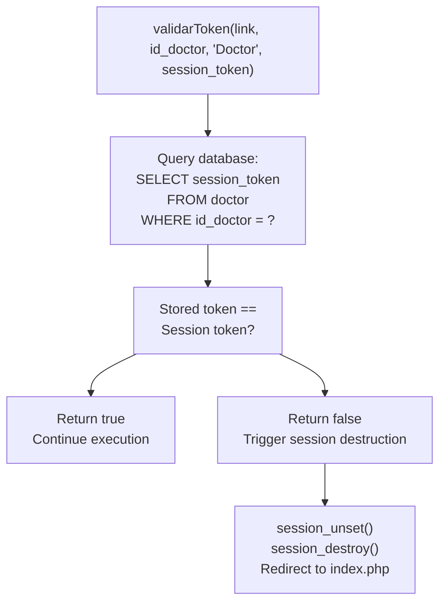
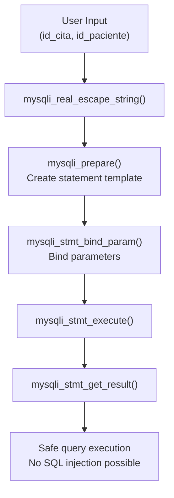
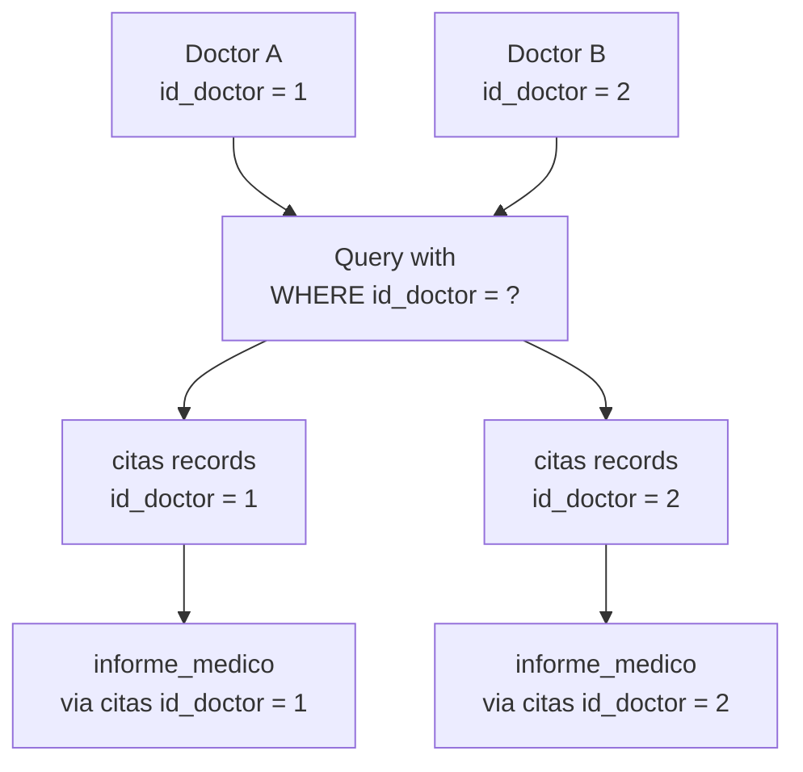

# Security & Authentication

> **Relevant source files**
> * [Admin/descargar_historia.php](https://github.com/axchisan/Consultorio_Emily_Bernal/blob/589034b9/Admin/descargar_historia.php)
> * [Admin/historia_clinica.php](https://github.com/axchisan/Consultorio_Emily_Bernal/blob/589034b9/Admin/historia_clinica.php)
> * [Admin/inicioAdmin.php](https://github.com/axchisan/Consultorio_Emily_Bernal/blob/589034b9/Admin/inicioAdmin.php)
> * [Admin/ver_historia.php](https://github.com/axchisan/Consultorio_Emily_Bernal/blob/589034b9/Admin/ver_historia.php)

This document provides an overview of the security architecture implemented in the Consultorio Emily Bernal system. The security model employs multiple defensive layers including session management, token-based authentication, SQL injection prevention, and role-based access control to protect patient data and ensure system integrity.

**Scope**: This page covers the authentication mechanisms, session lifecycle, and data protection strategies used across all administrative interfaces. For details on specific subsystems, see [Session Management](/axchisan/Consultorio_Emily_Bernal/5.1-session-management), [Token Validation System](/axchisan/Consultorio_Emily_Bernal/5.2-token-validation-system), [SQL Injection Prevention](/axchisan/Consultorio_Emily_Bernal/5.3-sql-injection-prevention), and [Access Control & Authorization](/axchisan/Consultorio_Emily_Bernal/5.4-access-control-and-authorization).

## Security Architecture Overview

The system implements a defense-in-depth security model with four primary layers that protect every administrative page and database operation.

### Multi-Layer Security Model

```

```

**Sources**: [Admin/inicioAdmin.php L7-L24](https://github.com/axchisan/Consultorio_Emily_Bernal/blob/589034b9/Admin/inicioAdmin.php#L7-L24)

 [Admin/historia_clinica.php L7-L24](https://github.com/axchisan/Consultorio_Emily_Bernal/blob/589034b9/Admin/historia_clinica.php#L7-L24)

 [Admin/ver_historia.php L7-L23](https://github.com/axchisan/Consultorio_Emily_Bernal/blob/589034b9/Admin/ver_historia.php#L7-L23)

 [Admin/descargar_historia.php L9-L25](https://github.com/axchisan/Consultorio_Emily_Bernal/blob/589034b9/Admin/descargar_historia.php#L9-L25)

### Security Mechanisms Summary

| Mechanism | Implementation | Files | Purpose |
| --- | --- | --- | --- |
| Session Validation | `isset($_SESSION['id_doctor'])` | All admin pages | Verify authenticated session exists |
| Token Validation | `validarToken($link, $id, 'Doctor', $token)` | All admin pages | Prevent concurrent logins |
| Input Sanitization | `mysqli_real_escape_string($link, $input)` | All form handlers | Escape special characters |
| Prepared Statements | `mysqli_prepare()` + `mysqli_stmt_bind_param()` | All database queries | Prevent SQL injection |
| Access Control | `WHERE id_doctor = ?` clauses | All data queries | Restrict data to logged-in doctor |
| Session Destruction | `session_unset()` + `session_destroy()` | Token validation failures | Force re-authentication |

**Sources**: [Admin/inicioAdmin.php L7-L24](https://github.com/axchisan/Consultorio_Emily_Bernal/blob/589034b9/Admin/inicioAdmin.php#L7-L24)

 [Admin/descargar_historia.php L35-L73](https://github.com/axchisan/Consultorio_Emily_Bernal/blob/589034b9/Admin/descargar_historia.php#L35-L73)

 [Admin/ver_historia.php L33-L66](https://github.com/axchisan/Consultorio_Emily_Bernal/blob/589034b9/Admin/ver_historia.php#L33-L66)

## Authentication Flow

### Complete Authentication Sequence

```mermaid
sequenceDiagram
  participant Browser
  participant Admin Page
  participant (inicioAdmin.php, etc.)
  participant session_start()
  participant Session Check
  participant validarToken()
  participant (consultas.php)
  participant MySQL Database
  participant (doctor table)
  participant index.php
  participant (Login Page)

  Browser->>Admin Page: GET request
  Admin Page->>session_start(): session_start()
  Admin Page->>session_start(): Check $_SESSION['id_doctor']
  Admin Page->>session_start(): Check $_SESSION['session_token']
  loop [Token Mismatch]
    Admin Page->>Admin Page: Set $_SESSION['MensajeTexto']
    Admin Page->>Admin Page: Set $_SESSION['MensajeTipo'] = 'bg-danger'
    Admin Page->>index.php: header("Location: ../index.php")
    index.php-->>Browser: Show login form
    Admin Page->>validarToken(): validarToken(link, id_doctor, 'Doctor', session_token)
    validarToken()->>MySQL Database: SELECT session_token FROM doctor WHERE id_doctor = ?
    MySQL Database-->>validarToken(): Return stored token
    validarToken()-->>Admin Page: return false
    Admin Page->>Admin Page: session_unset()
    Admin Page->>Admin Page: session_destroy()
    Admin Page->>Admin Page: Set MensajeTexto = "Tu sesión ha sido cerrada..."
    Admin Page->>index.php: header("Location: ../index.php")
    index.php-->>Browser: Show concurrent login message
    validarToken()-->>Admin Page: return true
    Admin Page->>MySQL Database: Query page-specific data
    MySQL Database-->>Admin Page: Return filtered results
    Admin Page-->>Browser: Render authenticated page
  end
```

**Sources**: [Admin/inicioAdmin.php L7-L24](https://github.com/axchisan/Consultorio_Emily_Bernal/blob/589034b9/Admin/inicioAdmin.php#L7-L24)

 [Admin/historia_clinica.php L7-L24](https://github.com/axchisan/Consultorio_Emily_Bernal/blob/589034b9/Admin/historia_clinica.php#L7-L24)

 [Admin/ver_historia.php L7-L23](https://github.com/axchisan/Consultorio_Emily_Bernal/blob/589034b9/Admin/ver_historia.php#L7-L23)

### Session Variable Structure

Every authenticated doctor session maintains two critical variables:

| Variable | Type | Source | Purpose |
| --- | --- | --- | --- |
| `$_SESSION['id_doctor']` | integer | Login process | Identifies the authenticated doctor |
| `$_SESSION['session_token']` | string | Login process | Unique token for concurrent login detection |

**Implementation Pattern** (repeated in all admin pages):

```

```

**Sources**: [Admin/inicioAdmin.php L7-L12](https://github.com/axchisan/Consultorio_Emily_Bernal/blob/589034b9/Admin/inicioAdmin.php#L7-L12)

 [Admin/historia_clinica.php L7-L12](https://github.com/axchisan/Consultorio_Emily_Bernal/blob/589034b9/Admin/historia_clinica.php#L7-L12)

 [Admin/ver_historia.php L7-L12](https://github.com/axchisan/Consultorio_Emily_Bernal/blob/589034b9/Admin/ver_historia.php#L7-L12)

 [Admin/descargar_historia.php L9-L14](https://github.com/axchisan/Consultorio_Emily_Bernal/blob/589034b9/Admin/descargar_historia.php#L9-L14)

## Token-Based Concurrent Login Prevention

The `validarToken()` function implements a critical security control that prevents multiple simultaneous sessions for the same doctor account.

### Token Validation Process



**Sources**: [Admin/inicioAdmin.php L17-L24](https://github.com/axchisan/Consultorio_Emily_Bernal/blob/589034b9/Admin/inicioAdmin.php#L17-L24)

 [Admin/historia_clinica.php L17-L24](https://github.com/axchisan/Consultorio_Emily_Bernal/blob/589034b9/Admin/historia_clinica.php#L17-L24)

### Token Validation Call Pattern

All administrative pages follow this consistent pattern immediately after session validation:

```

```

**Key Security Properties**:

* **Stateful**: Token stored in database, not just session
* **Exclusive**: One valid token per doctor at any time
* **Immediate**: Existing sessions invalidated when new login occurs
* **Transparent**: User sees clear message about concurrent login

**Sources**: [Admin/inicioAdmin.php L17-L24](https://github.com/axchisan/Consultorio_Emily_Bernal/blob/589034b9/Admin/inicioAdmin.php#L17-L24)

 [Admin/historia_clinica.php L17-L24](https://github.com/axchisan/Consultorio_Emily_Bernal/blob/589034b9/Admin/historia_clinica.php#L17-L24)

 [Admin/ver_historia.php L16-L23](https://github.com/axchisan/Consultorio_Emily_Bernal/blob/589034b9/Admin/ver_historia.php#L16-L23)

 [Admin/descargar_historia.php L18-L25](https://github.com/axchisan/Consultorio_Emily_Bernal/blob/589034b9/Admin/descargar_historia.php#L18-L25)

## SQL Injection Prevention

The system employs a two-pronged defense against SQL injection attacks: input sanitization with `mysqli_real_escape_string()` and parameterized queries using prepared statements.

### Defense Mechanisms Comparison

| Technique | Usage Context | Example | Files |
| --- | --- | --- | --- |
| `mysqli_real_escape_string()` | GET/POST input | `mysqli_real_escape_string($link, $_POST['id_cita'])` | descargar_historia.php, ver_historia.php |
| `mysqli_prepare()` | All database queries | `mysqli_prepare($link, "SELECT * FROM citas WHERE id_cita = ?")` | descargar_historia.php, ver_historia.php |
| `mysqli_stmt_bind_param()` | Parameter binding | `mysqli_stmt_bind_param($stmt, "iii", $id_cita, $id_paciente, $doctor_id)` | descargar_historia.php, ver_historia.php |

### Prepared Statement Implementation



**Sources**: [Admin/descargar_historia.php L35-L73](https://github.com/axchisan/Consultorio_Emily_Bernal/blob/589034b9/Admin/descargar_historia.php#L35-L73)

 [Admin/ver_historia.php L33-L66](https://github.com/axchisan/Consultorio_Emily_Bernal/blob/589034b9/Admin/ver_historia.php#L33-L66)

### Query Security Pattern Examples

**Pattern 1: Input Sanitization + Prepared Statement** (descargar_historia.php):

```

```

**Pattern 2: Type Specification in Parameter Binding**:

* `"i"` = integer
* `"s"` = string
* `"d"` = double
* Multiple types concatenated: `"iii"` for three integers

**Sources**: [Admin/descargar_historia.php L35-L73](https://github.com/axchisan/Consultorio_Emily_Bernal/blob/589034b9/Admin/descargar_historia.php#L35-L73)

 [Admin/ver_historia.php L33-L66](https://github.com/axchisan/Consultorio_Emily_Bernal/blob/589034b9/Admin/ver_historia.php#L33-L66)

### Medical Report Query Security

The medical report query demonstrates defense-in-depth with prepared statements:

```

```

**Security Benefits**:

1. Query template separated from data
2. Database driver handles escaping automatically
3. Type enforcement prevents type juggling attacks
4. Statement closure prevents resource leaks

**Sources**: [Admin/descargar_historia.php L76-L82](https://github.com/axchisan/Consultorio_Emily_Bernal/blob/589034b9/Admin/descargar_historia.php#L76-L82)

 [Admin/ver_historia.php L69-L75](https://github.com/axchisan/Consultorio_Emily_Bernal/blob/589034b9/Admin/ver_historia.php#L69-L75)

## Access Control Implementation

Access control ensures doctors can only view and modify data for their own patients. This is implemented through WHERE clause constraints in all data queries.

### Access Control Architecture



**Sources**: [Admin/descargar_historia.php L57-L73](https://github.com/axchisan/Consultorio_Emily_Bernal/blob/589034b9/Admin/descargar_historia.php#L57-L73)

 [Admin/ver_historia.php L51-L66](https://github.com/axchisan/Consultorio_Emily_Bernal/blob/589034b9/Admin/ver_historia.php#L51-L66)

### Access Control Query Pattern

**Pattern from descargar_historia.php**:

```

```

**Key Access Control Points**:

1. `$doctor_id` always sourced from `$_SESSION['id_doctor']` (line 37)
2. Never from user input (GET/POST parameters)
3. Always included in WHERE clause as bound parameter
4. Applied to all queries returning patient data

**Sources**: [Admin/descargar_historia.php L37-L73](https://github.com/axchisan/Consultorio_Emily_Bernal/blob/589034b9/Admin/descargar_historia.php#L37-L73)

### Indirect Access Control via Relationships

For tables without direct `id_doctor` columns (e.g., `informe_medico`, `paciente`), access control is enforced through JOIN relationships:

```

```

**Transitive Access Control**:

1. Validate `id_cita` belongs to `doctor` in initial query
2. Use validated `id_cita` to query related tables
3. Ensures `informe_medico` access only through owned appointments

**Sources**: [Admin/descargar_historia.php L57-L82](https://github.com/axchisan/Consultorio_Emily_Bernal/blob/589034b9/Admin/descargar_historia.php#L57-L82)

## Security Validation Summary

### Per-Page Security Checklist

| Page | Session Check | Token Validation | Input Sanitization | Prepared Statements | Access Control |
| --- | --- | --- | --- | --- | --- |
| inicioAdmin.php | ✓ Lines 7-12 | ✓ Lines 17-24 | N/A (no direct input) | Via consultas.php | Via MostrarCitas |
| historia_clinica.php | ✓ Lines 7-12 | ✓ Lines 17-24 | N/A (no direct input) | Via consultas.php | Via MostrarCitasCompletadas |
| ver_historia.php | ✓ Lines 7-12 | ✓ Lines 16-23 | ✓ Lines 33-34 | ✓ Lines 51-75 | ✓ Lines 55, 61 |
| descargar_historia.php | ✓ Lines 9-14 | ✓ Lines 18-25 | ✓ Lines 35-36 | ✓ Lines 57-82 | ✓ Lines 37, 61 |

**Sources**: [Admin/inicioAdmin.php](https://github.com/axchisan/Consultorio_Emily_Bernal/blob/589034b9/Admin/inicioAdmin.php)

 [Admin/historia_clinica.php](https://github.com/axchisan/Consultorio_Emily_Bernal/blob/589034b9/Admin/historia_clinica.php)

 [Admin/ver_historia.php](https://github.com/axchisan/Consultorio_Emily_Bernal/blob/589034b9/Admin/ver_historia.php)

 [Admin/descargar_historia.php](https://github.com/axchisan/Consultorio_Emily_Bernal/blob/589034b9/Admin/descargar_historia.php)

### Security Failure Handling

All security failures follow a consistent pattern:

1. **Set Flash Message**: `$_SESSION['MensajeTexto']` and `$_SESSION['MensajeTipo']`
2. **Redirect**: `header("Location: ../index.php")`
3. **Exit**: `exit()` to prevent further execution

**Error Message Types**:

* `"Error acceso al sistema: Sesión no iniciada."` - No session
* `"Tu sesión ha sido cerrada por inicio en otro dispositivo."` - Token mismatch
* `"Error: ID de cita o paciente no proporcionado."` - Missing parameters
* `"Error: No se encontró la cita."` - Data access violation

**Sources**: [Admin/inicioAdmin.php L8-L12](https://github.com/axchisan/Consultorio_Emily_Bernal/blob/589034b9/Admin/inicioAdmin.php#L8-L12)

 [Admin/historia_clinica.php L8-L12](https://github.com/axchisan/Consultorio_Emily_Bernal/blob/589034b9/Admin/historia_clinica.php#L8-L12)

 [Admin/ver_historia.php L8-L12](https://github.com/axchisan/Consultorio_Emily_Bernal/blob/589034b9/Admin/ver_historia.php#L8-L12)

 [Admin/descargar_historia.php L10-L14](https://github.com/axchisan/Consultorio_Emily_Bernal/blob/589034b9/Admin/descargar_historia.php#L10-L14)