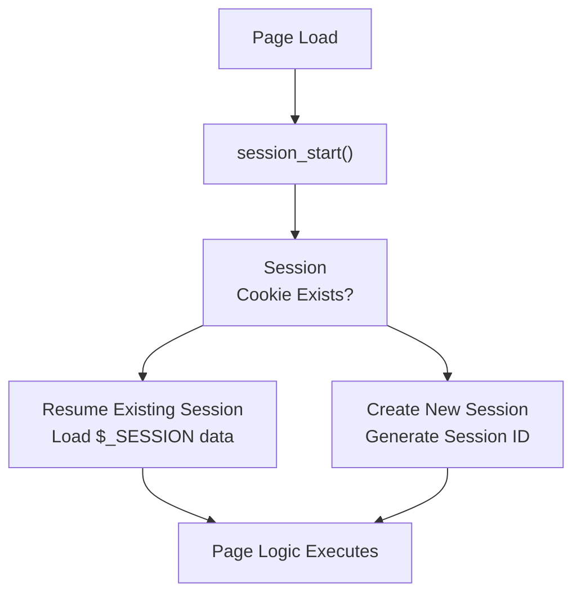
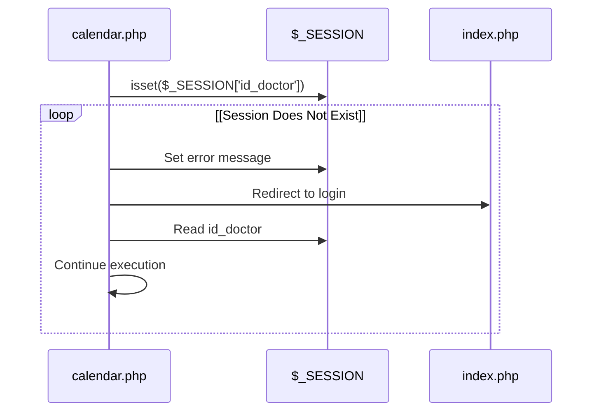
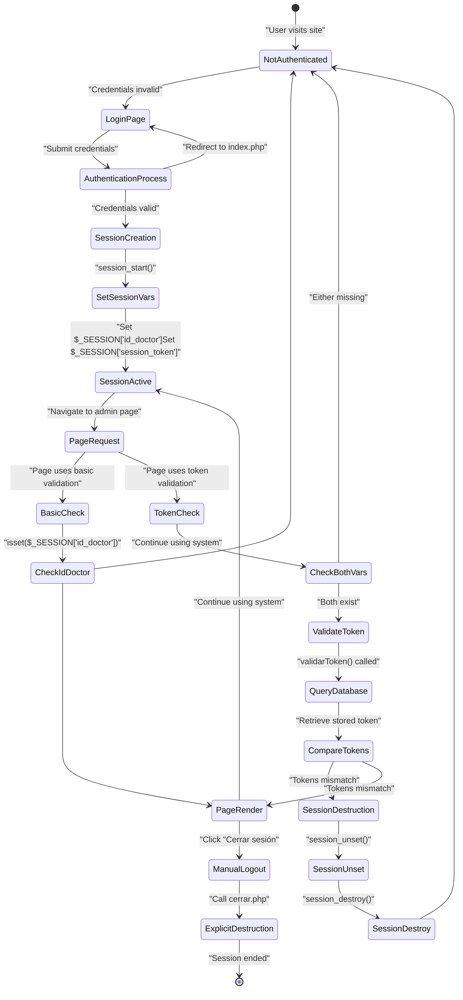
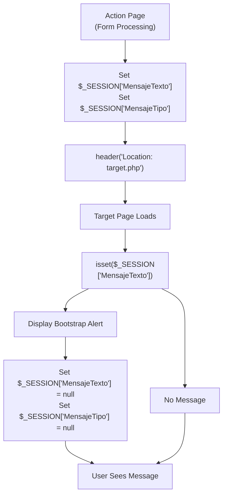

# Session Management

> **Relevant source files**
> * [Admin/calendar.php](https://github.com/axchisan/Consultorio_Emily_Bernal/blob/589034b9/Admin/calendar.php)
> * [Admin/historia_clinica.php](https://github.com/axchisan/Consultorio_Emily_Bernal/blob/589034b9/Admin/historia_clinica.php)
> * [Admin/informe.php](https://github.com/axchisan/Consultorio_Emily_Bernal/blob/589034b9/Admin/informe.php)
> * [Admin/inicioAdmin.php](https://github.com/axchisan/Consultorio_Emily_Bernal/blob/589034b9/Admin/inicioAdmin.php)

## Purpose and Scope

This document covers the session management system used throughout the Consultorio Emily Bernal application to maintain user authentication state across HTTP requests. It describes the session lifecycle, session variable structure, validation patterns, and destruction mechanisms.

For details on the token validation system that prevents concurrent logins, see [Token Validation System](/axchisan/Consultorio_Emily_Bernal/5.2-token-validation-system). For information about how session-based flash messages are displayed to users, see [Session-Based Flash Messaging](/axchisan/Consultorio_Emily_Bernal/7.5-session-based-flash-messaging). For access control mechanisms that work in conjunction with sessions, see [Access Control & Authorization](/axchisan/Consultorio_Emily_Bernal/5.4-access-control-and-authorization).

---

## Session Variables Structure

The system uses PHP's native session management with the following session variables stored in the `$_SESSION` superglobal:

| Variable Name | Type | Purpose |
| --- | --- | --- |
| `$_SESSION['id_doctor']` | Integer | Primary identifier for the authenticated doctor |
| `$_SESSION['session_token']` | String | Unique token to prevent concurrent logins |
| `$_SESSION['MensajeTexto']` | String | Flash message content (temporary) |
| `$_SESSION['MensajeTipo']` | String | Bootstrap CSS class for message styling (temporary) |

The `id_doctor` and `session_token` variables persist throughout the authenticated session, while the message variables are single-use and cleared after display.

**Sources:** [Admin/inicioAdmin.php L7-L24](https://github.com/axchisan/Consultorio_Emily_Bernal/blob/589034b9/Admin/inicioAdmin.php#L7-L24)

 [Admin/historia_clinica.php L7-L24](https://github.com/axchisan/Consultorio_Emily_Bernal/blob/589034b9/Admin/historia_clinica.php#L7-L24)

 [Admin/calendar.php L8-L15](https://github.com/axchisan/Consultorio_Emily_Bernal/blob/589034b9/Admin/calendar.php#L8-L15)

---

## Session Initialization

Sessions are initialized at the beginning of every administrative page using `session_start()`. This function must be called before any output is sent to the browser.



**Session Start Examples**

All administrative pages begin with session initialization:

```
session_start();  // calendario.php, inicioAdmin.php, historia_clinica.php
```

The `informe.php` page includes a conditional check to prevent re-initialization:

```
if (session_status() === PHP_SESSION_NONE) {
    session_start();
}
```

**Sources:** [Admin/calendar.php L4](https://github.com/axchisan/Consultorio_Emily_Bernal/blob/589034b9/Admin/calendar.php#L4-L4)

 [Admin/inicioAdmin.php L2](https://github.com/axchisan/Consultorio_Emily_Bernal/blob/589034b9/Admin/inicioAdmin.php#L2-L2)

 [Admin/historia_clinica.php L2](https://github.com/axchisan/Consultorio_Emily_Bernal/blob/589034b9/Admin/historia_clinica.php#L2-L2)

 [Admin/informe.php L3-L5](https://github.com/axchisan/Consultorio_Emily_Bernal/blob/589034b9/Admin/informe.php#L3-L5)

---

## Session Validation Patterns

The system implements two distinct validation patterns depending on the security requirements of each page.

### Basic Session Check

Used by pages that require authentication but do not need concurrent login prevention (e.g., calendar view).



**Implementation in calendar.php:**

[Admin/calendar.php L8-L13](https://github.com/axchisan/Consultorio_Emily_Bernal/blob/589034b9/Admin/calendar.php#L8-L13)

 demonstrates the basic validation:

```
if (!isset($_SESSION['id_doctor'])) {
    $_SESSION['MensajeTexto'] = "Error acceso al sistema no registrado.";
    $_SESSION['MensajeTipo'] = "p-3 mb-2 bg-danger text-white";
    header("Location: ../index.php");
    exit;
}
```

### Token-Based Validation

Used by pages handling sensitive data that require protection against concurrent logins (e.g., patient records, medical history).

```mermaid
sequenceDiagram
  participant inicioAdmin.php/historia_clinica.php
  participant $_SESSION
  participant validarToken()
  participant Database
  participant index.php

  inicioAdmin.php/historia_clinica.php->>$_SESSION: Check isset($_SESSION['id_doctor'])
  inicioAdmin.php/historia_clinica.php->>$_SESSION: Check isset($_SESSION['session_token'])
  loop [Token Mismatch]
    inicioAdmin.php/historia_clinica.php->>$_SESSION: Set error message
    inicioAdmin.php/historia_clinica.php->>index.php: Redirect to login
    inicioAdmin.php/historia_clinica.php->>validarToken(): validarToken(link, id_doctor, 'Doctor', token)
    validarToken()->>Database: Query session_token from doctor table
    Database-->>validarToken(): Return stored token
    validarToken()-->>inicioAdmin.php/historia_clinica.php: Return false
    inicioAdmin.php/historia_clinica.php->>$_SESSION: session_unset()
    inicioAdmin.php/historia_clinica.php->>$_SESSION: session_destroy()
    inicioAdmin.php/historia_clinica.php->>$_SESSION: Set concurrent login message
    inicioAdmin.php/historia_clinica.php->>index.php: Redirect to login
    validarToken()-->>inicioAdmin.php/historia_clinica.php: Return true
    inicioAdmin.php/historia_clinica.php->>inicioAdmin.php/historia_clinica.php: Continue execution
  end
```

**Implementation in inicioAdmin.php:**

[Admin/inicioAdmin.php L7-L24](https://github.com/axchisan/Consultorio_Emily_Bernal/blob/589034b9/Admin/inicioAdmin.php#L7-L24)

 shows the complete token validation pattern:

```
// Validate session and token
if (!isset($_SESSION['id_doctor']) || !isset($_SESSION['session_token'])) {
    $_SESSION['MensajeTexto'] = "Error acceso al sistema: Sesión no iniciada.";
    $_SESSION['MensajeTipo'] = "p-3 mb-2 bg-danger text-white";
    header("Location: ../index.php");
    exit();
}

$vUsuario = $_SESSION['id_doctor'];

// Validate token against database to prevent concurrent access
if (!validarToken($link, $vUsuario, 'Doctor', $_SESSION['session_token'])) {
    session_unset();
    session_destroy();
    $_SESSION['MensajeTexto'] = "Tu sesión ha sido cerrada por inicio en otro dispositivo.";
    $_SESSION['MensajeTipo'] = "p-3 mb-2 bg-danger text-white";
    header("Location: ../index.php");
    exit();
}
```

The same pattern appears in [Admin/historia_clinica.php L7-L24](https://github.com/axchisan/Consultorio_Emily_Bernal/blob/589034b9/Admin/historia_clinica.php#L7-L24)

**Sources:** [Admin/inicioAdmin.php L7-L24](https://github.com/axchisan/Consultorio_Emily_Bernal/blob/589034b9/Admin/inicioAdmin.php#L7-L24)

 [Admin/historia_clinica.php L7-L24](https://github.com/axchisan/Consultorio_Emily_Bernal/blob/589034b9/Admin/historia_clinica.php#L7-L24)

 [Admin/calendar.php L8-L13](https://github.com/axchisan/Consultorio_Emily_Bernal/blob/589034b9/Admin/calendar.php#L8-L13)

---

## Complete Session Lifecycle

The following diagram illustrates the full session lifecycle from login through validation to logout.



**Sources:** [Admin/inicioAdmin.php L2-L24](https://github.com/axchisan/Consultorio_Emily_Bernal/blob/589034b9/Admin/inicioAdmin.php#L2-L24)

 [Admin/historia_clinica.php L2-L24](https://github.com/axchisan/Consultorio_Emily_Bernal/blob/589034b9/Admin/historia_clinica.php#L2-L24)

 [Admin/calendar.php L4-L15](https://github.com/axchisan/Consultorio_Emily_Bernal/blob/589034b9/Admin/calendar.php#L4-L15)

---

## Session Destruction

Sessions are destroyed in two scenarios: explicit logout and concurrent login detection.

### Explicit Logout

Users can manually terminate their session by clicking the "Cerrar sesión" link in the navigation menu.

**Navigation Link Structure:**

[Admin/calendar.php L167](https://github.com/axchisan/Consultorio_Emily_Bernal/blob/589034b9/Admin/calendar.php#L167-L167)

 and similar pages contain:

```xml
<li><a href="../php/cerrar.php">
    <span class="icon-sign-out mr-3"></span>
    <i class="fas fa-sign-out-alt"></i> Cerrar sesión
</a></li>
```

The `cerrar.php` script (referenced but not shown in provided files) would execute:

```
session_start();
session_unset();   // Remove all session variables
session_destroy(); // Destroy the session
header("Location: ../index.php");
```

### Automatic Destruction on Concurrent Login

When token validation fails (indicating a login from another device), the session is automatically destroyed.

**Destruction Sequence:**

[Admin/inicioAdmin.php L16-L23](https://github.com/axchisan/Consultorio_Emily_Bernal/blob/589034b9/Admin/inicioAdmin.php#L16-L23)

 demonstrates:

```
if (!validarToken($link, $vUsuario, 'Doctor', $_SESSION['session_token'])) {
    session_unset();    // Clear all session variables
    session_destroy();  // Destroy session file
    $_SESSION['MensajeTexto'] = "Tu sesión ha sido cerrada por inicio en otro dispositivo.";
    $_SESSION['MensajeTipo'] = "p-3 mb-2 bg-danger text-white";
    header("Location: ../index.php");
    exit();
}
```

**Important Note:** After calling `session_destroy()`, a new session is implicitly started by setting `$_SESSION` variables for the flash message. This is intentional to display the error message on the login page.

**Sources:** [Admin/inicioAdmin.php L16-L23](https://github.com/axchisan/Consultorio_Emily_Bernal/blob/589034b9/Admin/inicioAdmin.php#L16-L23)

 [Admin/historia_clinica.php L18-L23](https://github.com/axchisan/Consultorio_Emily_Bernal/blob/589034b9/Admin/historia_clinica.php#L18-L23)

 [Admin/calendar.php L167](https://github.com/axchisan/Consultorio_Emily_Bernal/blob/589034b9/Admin/calendar.php#L167-L167)

---

## Flash Messaging Integration

Sessions are used to implement flash messages following the Post-Redirect-Get (PRG) pattern. Messages persist across a single redirect and are then cleared.



**Display Implementation:**

[Admin/inicioAdmin.php L93-L101](https://github.com/axchisan/Consultorio_Emily_Bernal/blob/589034b9/Admin/inicioAdmin.php#L93-L101)

 shows the message display pattern:

```php
<?php if (isset($_SESSION['MensajeTexto'])) { ?>
    <div class="alert <?php echo $_SESSION['MensajeTipo']; ?>" role="alert">
        <?php echo $_SESSION['MensajeTexto']; ?>
        <button class="delete"><i class="fa fa-times"></i></button>
    </div>
<?php
    $_SESSION['MensajeTexto'] = null;
    $_SESSION['MensajeTipo'] = null;
} ?>
```

Similar patterns appear in [Admin/informe.php L497-L506](https://github.com/axchisan/Consultorio_Emily_Bernal/blob/589034b9/Admin/informe.php#L497-L506)

**Message Types:**

| `$_SESSION['MensajeTipo']` Value | Purpose | Bootstrap Class |
| --- | --- | --- |
| `"p-3 mb-2 bg-success text-white"` | Success operations | Green background |
| `"p-3 mb-2 bg-danger text-white"` | Errors/failures | Red background |

**Sources:** [Admin/inicioAdmin.php L93-L101](https://github.com/axchisan/Consultorio_Emily_Bernal/blob/589034b9/Admin/inicioAdmin.php#L93-L101)

 [Admin/informe.php L497-L506](https://github.com/axchisan/Consultorio_Emily_Bernal/blob/589034b9/Admin/informe.php#L497-L506)

 [Admin/calendar.php L9-L10](https://github.com/axchisan/Consultorio_Emily_Bernal/blob/589034b9/Admin/calendar.php#L9-L10)

---

## Code Entity Mapping

This section maps the natural language concepts to specific code entities in the system.

```mermaid
flowchart TD

SessionInit["Session Initialization"]
SessionVars["Session Variables"]
BasicVal["Basic Validation"]
TokenVal["Token Validation"]
Destruction["Session Destruction"]
Flash["Flash Messages"]
session_start["session_start()"]
id_doctor["$_SESSION['id_doctor']"]
session_token["$_SESSION['session_token']"]
MensajeTexto["$_SESSION['MensajeTexto']"]
MensajeTipo["$_SESSION['MensajeTipo']"]
isset_check["isset() checks"]
validarToken["validarToken() function"]
session_unset["session_unset()"]
session_destroy["session_destroy()"]
header_redirect["header('Location: ...')"]
calendar["calendar.php<br>(Basic Check)"]
inicioAdmin["inicioAdmin.php<br>(Token Check)"]
historia["historia_clinica.php<br>(Token Check)"]
informe["informe.php<br>(Basic Check)"]
cerrar["cerrar.php<br>(Logout)"]

SessionInit --> session_start
session_start --> calendar
session_start --> inicioAdmin
session_start --> historia
session_start --> informe
SessionVars --> id_doctor
SessionVars --> session_token
SessionVars --> MensajeTexto
SessionVars --> MensajeTipo
BasicVal --> isset_check
isset_check --> calendar
isset_check --> informe
TokenVal --> isset_check
TokenVal --> validarToken
validarToken --> inicioAdmin
validarToken --> historia
Destruction --> session_unset
Destruction --> session_destroy
Destruction --> header_redirect
session_unset --> inicioAdmin
session_unset --> historia
session_unset --> cerrar
session_destroy --> inicioAdmin
session_destroy --> historia
session_destroy --> cerrar
Flash --> MensajeTexto
Flash --> MensajeTipo
Flash --> header_redirect

subgraph subGraph2 ["Files Implementing Patterns"]
    calendar
    inicioAdmin
    historia
    informe
    cerrar
end

subgraph subGraph1 ["Code Entities"]
    session_start
    id_doctor
    session_token
    MensajeTexto
    MensajeTipo
    isset_check
    validarToken
    session_unset
    session_destroy
    header_redirect
end

subgraph subGraph0 ["Session Management Concepts"]
    SessionInit
    SessionVars
    BasicVal
    TokenVal
    Destruction
    Flash
end
```



### Key Function Locations

| Function/Variable | Purpose | Primary Usage |
| --- | --- | --- |
| `session_start()` | Initialize PHP session | [calendar.php L4](https://github.com/axchisan/Consultorio_Emily_Bernal/blob/589034b9/calendar.php#L4-L4) <br>  [inicioAdmin.php L2](https://github.com/axchisan/Consultorio_Emily_Bernal/blob/589034b9/inicioAdmin.php#L2-L2) <br>  [historia_clinica.php L2](https://github.com/axchisan/Consultorio_Emily_Bernal/blob/589034b9/historia_clinica.php#L2-L2) |
| `$_SESSION['id_doctor']` | Store authenticated doctor ID | [calendar.php L15](https://github.com/axchisan/Consultorio_Emily_Bernal/blob/589034b9/calendar.php#L15-L15) <br>  [inicioAdmin.php L14](https://github.com/axchisan/Consultorio_Emily_Bernal/blob/589034b9/inicioAdmin.php#L14-L14) |
| `$_SESSION['session_token']` | Store session token | [inicioAdmin.php L7](https://github.com/axchisan/Consultorio_Emily_Bernal/blob/589034b9/inicioAdmin.php#L7-L7) <br>  [historia_clinica.php L7](https://github.com/axchisan/Consultorio_Emily_Bernal/blob/589034b9/historia_clinica.php#L7-L7) |
| `validarToken()` | Validate token against database | [inicioAdmin.php L17](https://github.com/axchisan/Consultorio_Emily_Bernal/blob/589034b9/inicioAdmin.php#L17-L17) <br>  [historia_clinica.php L17](https://github.com/axchisan/Consultorio_Emily_Bernal/blob/589034b9/historia_clinica.php#L17-L17) |
| `session_unset()` | Remove session variables | [inicioAdmin.php L18](https://github.com/axchisan/Consultorio_Emily_Bernal/blob/589034b9/inicioAdmin.php#L18-L18) <br>  [historia_clinica.php L18](https://github.com/axchisan/Consultorio_Emily_Bernal/blob/589034b9/historia_clinica.php#L18-L18) |
| `session_destroy()` | Destroy session file | [inicioAdmin.php L19](https://github.com/axchisan/Consultorio_Emily_Bernal/blob/589034b9/inicioAdmin.php#L19-L19) <br>  [historia_clinica.php L19](https://github.com/axchisan/Consultorio_Emily_Bernal/blob/589034b9/historia_clinica.php#L19-L19) |
| `$_SESSION['MensajeTexto']` | Store flash message content | [inicioAdmin.php L99](https://github.com/axchisan/Consultorio_Emily_Bernal/blob/589034b9/inicioAdmin.php#L99-L99) <br>  [calendar.php L9](https://github.com/axchisan/Consultorio_Emily_Bernal/blob/589034b9/calendar.php#L9-L9) |
| `$_SESSION['MensajeTipo']` | Store flash message CSS class | [inicioAdmin.php L100](https://github.com/axchisan/Consultorio_Emily_Bernal/blob/589034b9/inicioAdmin.php#L100-L100) <br>  [calendar.php L10](https://github.com/axchisan/Consultorio_Emily_Bernal/blob/589034b9/calendar.php#L10-L10) |

**Sources:** [Admin/calendar.php L4-L15](https://github.com/axchisan/Consultorio_Emily_Bernal/blob/589034b9/Admin/calendar.php#L4-L15)

 [Admin/inicioAdmin.php L2-L24](https://github.com/axchisan/Consultorio_Emily_Bernal/blob/589034b9/Admin/inicioAdmin.php#L2-L24)

 [Admin/historia_clinica.php L2-L24](https://github.com/axchisan/Consultorio_Emily_Bernal/blob/589034b9/Admin/historia_clinica.php#L2-L24)

 [Admin/informe.php L3-L16](https://github.com/axchisan/Consultorio_Emily_Bernal/blob/589034b9/Admin/informe.php#L3-L16)

---

## Security Considerations

### Session Variable Validation

The system validates both the existence of session variables and (in secure pages) their validity against the database. This two-tier approach ensures:

1. **Basic Protection:** All pages check if `$_SESSION['id_doctor']` exists
2. **Enhanced Protection:** Sensitive pages also validate `$_SESSION['session_token']` against database records

### Concurrent Login Prevention

The token validation system prevents multiple simultaneous logins with the same doctor account. When a doctor logs in from a new device:

1. A new token is generated and stored in the database
2. The previous session token becomes invalid
3. Any pages accessed from the old session detect the token mismatch
4. The old session is automatically destroyed with an explanatory message

This mechanism is implemented in [Admin/inicioAdmin.php L17-L23](https://github.com/axchisan/Consultorio_Emily_Bernal/blob/589034b9/Admin/inicioAdmin.php#L17-L23)

 and [Admin/historia_clinica.php L17-L23](https://github.com/axchisan/Consultorio_Emily_Bernal/blob/589034b9/Admin/historia_clinica.php#L17-L23)

### Redirect After Authentication Failure

All authentication failures use the `header("Location: ...")` function followed by `exit()` to prevent further code execution:

```
header("Location: ../index.php");
exit();  // Critical to prevent continued execution
```

**Sources:** [Admin/inicioAdmin.php L7-L24](https://github.com/axchisan/Consultorio_Emily_Bernal/blob/589034b9/Admin/inicioAdmin.php#L7-L24)

 [Admin/historia_clinica.php L7-L24](https://github.com/axchisan/Consultorio_Emily_Bernal/blob/589034b9/Admin/historia_clinica.php#L7-L24)

 [Admin/calendar.php L8-L13](https://github.com/axchisan/Consultorio_Emily_Bernal/blob/589034b9/Admin/calendar.php#L8-L13)

 [Admin/informe.php L11-L16](https://github.com/axchisan/Consultorio_Emily_Bernal/blob/589034b9/Admin/informe.php#L11-L16)