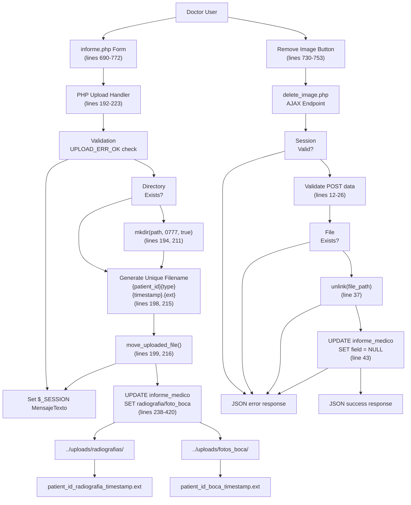
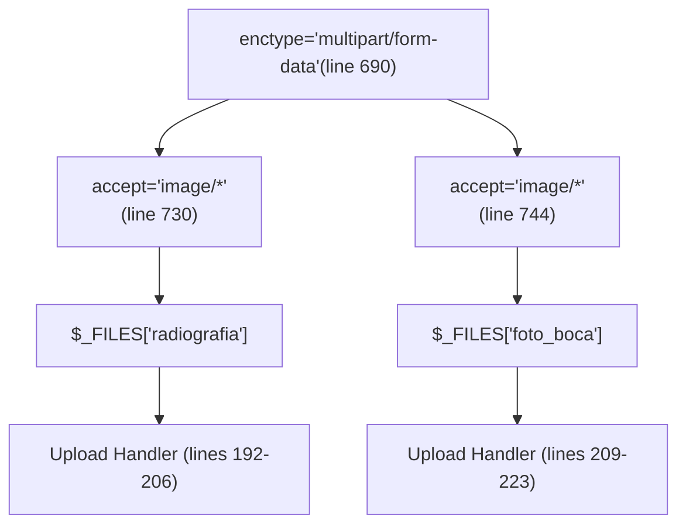
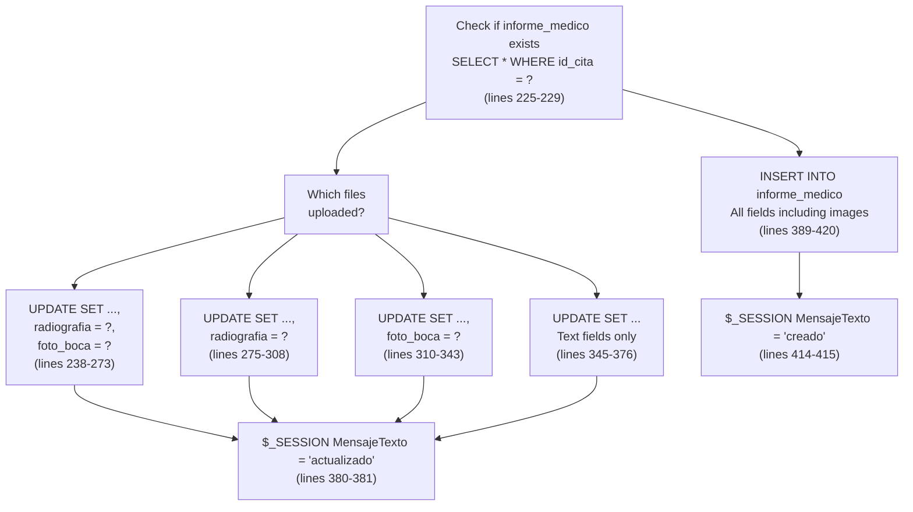
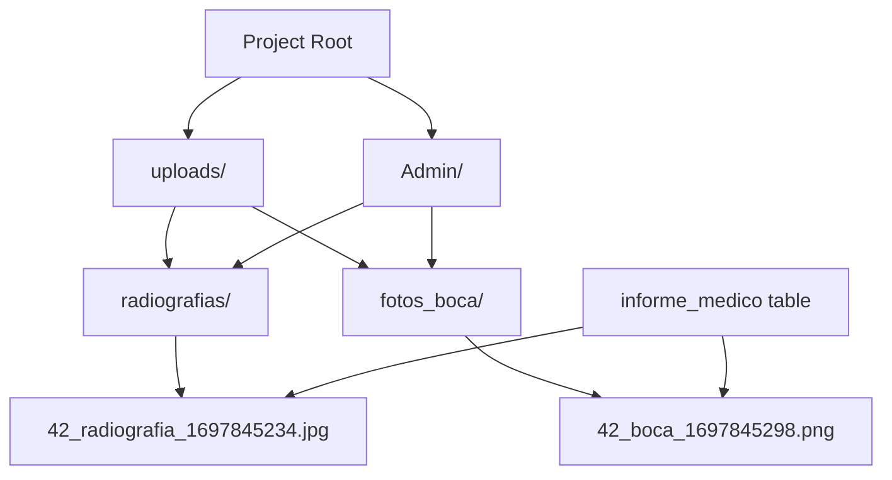
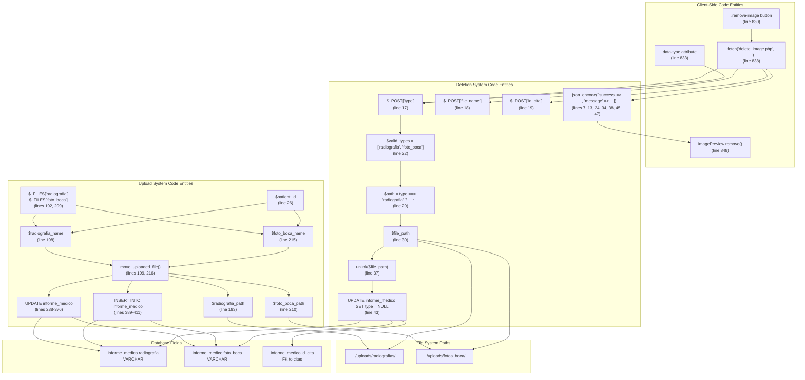

# Sistema de gestión de archivos

> **Archivos fuente relevantes**
> * [Admin/eliminar_imagen.php](https://github.com/axchisan/Consultorio_Emily_Bernal/blob/589034b9/Admin/delete_image.php)
> * [Admin/informe.php](https://github.com/axchisan/Consultorio_Emily_Bernal/blob/589034b9/Admin/informe.php)

## Propósito y alcance

Este documento describe el sistema de gestión de archivos responsable de la carga, el almacenamiento y la eliminación de imágenes médicas (radiografías y fotos orales) en la aplicación de la clínica dental Consultorio Emily Bernal. El sistema implementa un patrón de almacenamiento basado en referencias donde los nombres de archivo se almacenan en la base de datos, mientras que los archivos reales residen en el disco.

Para obtener información sobre la interfaz del editor de informes médicos que utiliza este sistema, consulte [Editor de Informes Médicos](/axchisan/Consultorio_Emily_Bernal/2.3.3-medical-report-editor) . Para obtener detalles del esquema de base de datos de las referencias de imágenes, consulte [Estructura de datos de informes médicos](/axchisan/Consultorio_Emily_Bernal/4.3-medical-report-data-structure) .

**Fuentes:** [Admin/informe.php L1-L435](https://github.com/axchisan/Consultorio_Emily_Bernal/blob/589034b9/Admin/informe.php#L1-L435)

 [delete_image.php L1-L50](https://github.com/axchisan/Consultorio_Emily_Bernal/blob/589034b9/Admin/delete_image.php#L1-L50)

---

## Descripción general de la arquitectura del sistema

El sistema de gestión de archivos consta de tres componentes principales:

| Componente | Archivo | Responsabilidad |
| --- | --- | --- |
| **Controlador de carga** | `Admin/informe.php` | Procesa datos de formularios multiparte, valida cargas, genera nombres de archivos únicos, crea directorios y mueve archivos al almacenamiento. |
| **API de eliminación** | `Admin/delete_image.php` | Punto final AJAX que elimina referencias de imágenes de la base de datos y elimina archivos físicos |
| **Capa de almacenamiento** | `../uploads/` | Estructura de dos directorios para organizar radiografías y fotografías orales |

### Diagrama de flujo de carga y eliminación de archivos



**Fuentes:** [Admin/informe.php L192-L860](https://github.com/axchisan/Consultorio_Emily_Bernal/blob/589034b9/Admin/informe.php#L192-L860)

 [delete_image.php L1-L50](https://github.com/axchisan/Consultorio_Emily_Bernal/blob/589034b9/Admin/delete_image.php#L1-L50)

---

## Sistema de carga de imágenes

### Cargar configuración del formulario

La interfaz de carga se define `informe.php`dentro de un `enctype="multipart/form-data"`elemento de formulario. Dos campos de entrada de archivos aceptan imágenes médicas:



**Fuentes:** [Admin/informe.php L690-L744](https://github.com/axchisan/Consultorio_Emily_Bernal/blob/589034b9/Admin/informe.php#L690-L744)

### Lógica de procesamiento de carga

El controlador de carga procesa los archivos cuando se envía el formulario con `$_POST['update_medical']`. El sistema sigue esta secuencia:

**Paso 1: Validación del archivo**

[Admin/informe.php L192-L193](https://github.com/axchisan/Consultorio_Emily_Bernal/blob/589034b9/Admin/informe.php#L192-L193)

```
if (isset($_FILES['radiografia']) && $_FILES['radiografia']['error'] === UPLOAD_ERR_OK)
```

Checks if file upload succeeded without errors using the `UPLOAD_ERR_OK` constant.

**Step 2: Directory Management**

[Admin/informe.php L193-L197](https://github.com/axchisan/Consultorio_Emily_Bernal/blob/589034b9/Admin/informe.php#L193-L197)

```
$radiografia_path = "../uploads/radiografias/";
if (!is_dir($radiografia_path) && !mkdir($radiografia_path, 0777, true)) {
    $_SESSION['MensajeTexto'] = "Error: No se pudo crear el directorio para radiografías.";
    $_SESSION['MensajeTipo'] = "p-3 mb-2 bg-danger text-white";
}
```

Creates the storage directory with `0777` permissions if it doesn't exist. The third parameter `true` enables recursive directory creation.

**Step 3: Unique Filename Generation**

[Admin/informe.php L198](https://github.com/axchisan/Consultorio_Emily_Bernal/blob/589034b9/Admin/informe.php#L198-L198)

```
$radiografia_name = $patient_id . "_radiografia_" . time() . "." . pathinfo($_FILES['radiografia']['name'], PATHINFO_EXTENSION);
```

Filename pattern: `{patient_id}_radiografia_{unix_timestamp}.{original_extension}`

Example: `42_radiografia_1697845234.jpg`

This pattern ensures uniqueness through the timestamp and maintains traceability to the patient through `$patient_id`.

**Step 4: File System Write**

[Admin/informe.php L199-L204](https://github.com/axchisan/Consultorio_Emily_Bernal/blob/589034b9/Admin/informe.php#L199-L204)

```
if (!move_uploaded_file($_FILES['radiografia']['tmp_name'], $radiografia_path . $radiografia_name)) {
    $_SESSION['MensajeTexto'] = "Error al subir la radiografía.";
    $_SESSION['MensajeTipo'] = "p-3 mb-2 bg-danger text-white";
} else {
    $radiografia = $radiografia_name;
}
```

The `move_uploaded_file()` function securely moves the temporary uploaded file to the destination directory. On success, the filename is stored in `$radiografia` variable for database insertion.

### Upload Processing for Both Image Types

The system handles two image types with identical logic but different paths:

| Image Type | Directory Path | Field Name | Filename Pattern |
| --- | --- | --- | --- |
| Radiografía | `../uploads/radiografias/` | `radiografia` | `{patient_id}_radiografia_{timestamp}.{ext}` |
| Foto Boca | `../uploads/fotos_boca/` | `foto_boca` | `{patient_id}_boca_{timestamp}.{ext}` |

**Sources:** [Admin/informe.php L192-L223](https://github.com/axchisan/Consultorio_Emily_Bernal/blob/589034b9/Admin/informe.php#L192-L223)

### Database Update Logic

After successful file uploads, the system updates or inserts records in the `informe_medico` table. The handler uses conditional SQL to update only the fields corresponding to uploaded files:



This conditional approach prevents overwriting existing image references when only updating text fields.

**Sources:** [Admin/informe.php L225-L424](https://github.com/axchisan/Consultorio_Emily_Bernal/blob/589034b9/Admin/informe.php#L225-L424)

---

## Image Deletion System

### Deletion API Endpoint

The `delete_image.php` file implements a secure AJAX endpoint for removing medical images. The endpoint expects three POST parameters:

| Parameter | Type | Purpose | Validation |
| --- | --- | --- | --- |
| `type` | string | Image type (`'radiografia'` or `'foto_boca'`) | Must be in `$valid_types` array |
| `file_name` | string | Filename to delete | Must exist in filesystem |
| `id_cita` | integer | Appointment ID | Escaped with `mysqli_real_escape_string` |

### Deletion Flow Diagram

```mermaid
sequenceDiagram
  participant Browser
  participant .remove-image Button
  participant (informe.php:830-860)
  participant fetch() API
  participant delete_image.php
  participant Session Check
  participant File System
  participant informe_medico Table

  Browser->>.remove-image Button: Click remove button
  .remove-image Button->>Browser: confirm() dialog
  Browser->>.remove-image Button: User confirms
  .remove-image Button->>fetch() API: POST request
  fetch() API->>delete_image.php: type, file_name, id_cita
  delete_image.php->>Session Check: HTTP POST
  loop [DB update success]
    Session Check-->>fetch() API: Check $_SESSION['id_doctor']
    fetch() API-->>Browser: (lines 6-9)
    delete_image.php->>delete_image.php: {success: false, message: 'Acceso no autorizado'}
    delete_image.php->>delete_image.php: Show alert
    delete_image.php->>File System: Validate POST data
    delete_image.php-->>fetch() API: (lines 12-26)
    delete_image.php->>File System: Validate type in valid_types
    delete_image.php-->>fetch() API: (lines 22-26)
    delete_image.php->>informe_medico Table: Check file_exists(file_path)
    informe_medico Table-->>delete_image.php: (line 33)
    delete_image.php-->>fetch() API: {success: false, message: 'Archivo no encontrado'}
    fetch() API->>Browser: unlink(file_path)
    Browser->>Browser: (line 37)
    informe_medico Table-->>delete_image.php: {success: false, message: 'No se pudo eliminar'}
    delete_image.php-->>fetch() API: UPDATE informe_medico
  end
```

**Sources:** [Admin/delete_image.php L1-L50](https://github.com/axchisan/Consultorio_Emily_Bernal/blob/589034b9/Admin/delete_image.php#L1-L50)

 [Admin/informe.php L829-L860](https://github.com/axchisan/Consultorio_Emily_Bernal/blob/589034b9/Admin/informe.php#L829-L860)

### Two-Step Deletion Process

The deletion system implements a defensive two-step process:

**Step 1: Physical File Deletion**

[Admin/delete_image.php L28-L40](https://github.com/axchisan/Consultorio_Emily_Bernal/blob/589034b9/Admin/delete_image.php#L28-L40)

```typescript
$path = $type === 'radiografia' ? '../uploads/radiografias/' : '../uploads/fotos_boca/';
$file_path = $path . $file_name;

if (!file_exists($file_path)) {
    echo json_encode(['success' => false, 'message' => 'Archivo no encontrado']);
    exit();
}
if (!unlink($file_path)) {
    echo json_encode(['success' => false, 'message' => 'No se pudo eliminar el archivo']);
    exit();
}
```

The `unlink()` function removes the file from the filesystem. If this fails, the process terminates before database modification.

**Step 2: Database Reference Removal**

[Admin/delete_image.php L42-L48](https://github.com/axchisan/Consultorio_Emily_Bernal/blob/589034b9/Admin/delete_image.php#L42-L48)

```typescript
$update_query = "UPDATE informe_medico SET $type = NULL WHERE id_cita = '$id_cita'";
if (mysqli_query($link, $update_query)) {
    echo json_encode(['success' => true, 'message' => 'Imagen eliminada correctamente']);
} else {
    echo json_encode(['success' => false, 'message' => 'Error al actualizar la base de datos: ' . mysqli_error($link)]);
}
```

The database field is set to `NULL`, removing the reference to the deleted file. This order prevents orphaned database references (records pointing to non-existent files).

### Client-Side AJAX Implementation

[Admin/informe.php L830-L860](https://github.com/axchisan/Consultorio_Emily_Bernal/blob/589034b9/Admin/informe.php#L830-L860)

The client-side deletion is triggered by buttons with class `.remove-image` and a `data-type` attribute:

```typescript
document.querySelectorAll('.remove-image').forEach(button => {
    button.addEventListener('click', function() {
        const imagePreview = this.parentElement;
        const type = this.getAttribute('data-type');
        const fileName = imagePreview.querySelector('img').src.split('/').pop();
        const idCita = <?php echo json_encode($appointment['id_cita']); ?>;

        if (confirm('¿Estás seguro de que deseas eliminar esta imagen?')) {
            fetch('delete_image.php', {
                method: 'POST',
                headers: {
                    'Content-Type': 'application/x-www-form-urlencoded'
                },
                body: `type=${type}&file_name=${encodeURIComponent(fileName)}&id_cita=${idCita}`
            })
            .then(response => response.json())
            .then(data => {
                if (data.success) {
                    imagePreview.remove();
                    alert(data.message);
                } else {
                    alert(data.message);
                }
            })
```

The JavaScript extracts the filename from the image `src` attribute, sends it to the API, and removes the preview element on success.

**Sources:** [Admin/informe.php L829-L860](https://github.com/axchisan/Consultorio_Emily_Bernal/blob/589034b9/Admin/informe.php#L829-L860)

---

## File Storage Architecture

### Directory Structure

The system maintains a two-directory structure relative to the `Admin/` directory:



**File Path Resolution:**

* From `Admin/informe.php`: `../uploads/radiografias/` resolves to `uploads/radiografias/`
* From `Admin/delete_image.php`: `../uploads/radiografias/` resolves to `uploads/radiografias/`

**Sources:** [Admin/informe.php L193-L210](https://github.com/axchisan/Consultorio_Emily_Bernal/blob/589034b9/Admin/informe.php#L193-L210)

 [Admin/delete_image.php L29](https://github.com/axchisan/Consultorio_Emily_Bernal/blob/589034b9/Admin/delete_image.php#L29-L29)

### Reference-Based Storage Pattern

The system implements a reference-based storage pattern where:

1. **Binary data** is stored in the filesystem as image files
2. **Filename strings** are stored in the database in `VARCHAR` fields
3. **No binary data** is stored in the database

**Database Schema Reference:**

```css
#mermaid-sqsjj0tcxk{font-family:ui-sans-serif,-apple-system,system-ui,Segoe UI,Helvetica;font-size:16px;fill:#333;}@keyframes edge-animation-frame{from{stroke-dashoffset:0;}}@keyframes dash{to{stroke-dashoffset:0;}}#mermaid-sqsjj0tcxk .edge-animation-slow{stroke-dasharray:9,5!important;stroke-dashoffset:900;animation:dash 50s linear infinite;stroke-linecap:round;}#mermaid-sqsjj0tcxk .edge-animation-fast{stroke-dasharray:9,5!important;stroke-dashoffset:900;animation:dash 20s linear infinite;stroke-linecap:round;}#mermaid-sqsjj0tcxk .error-icon{fill:#dddddd;}#mermaid-sqsjj0tcxk .error-text{fill:#222222;stroke:#222222;}#mermaid-sqsjj0tcxk .edge-thickness-normal{stroke-width:1px;}#mermaid-sqsjj0tcxk .edge-thickness-thick{stroke-width:3.5px;}#mermaid-sqsjj0tcxk .edge-pattern-solid{stroke-dasharray:0;}#mermaid-sqsjj0tcxk .edge-thickness-invisible{stroke-width:0;fill:none;}#mermaid-sqsjj0tcxk .edge-pattern-dashed{stroke-dasharray:3;}#mermaid-sqsjj0tcxk .edge-pattern-dotted{stroke-dasharray:2;}#mermaid-sqsjj0tcxk .marker{fill:#999;stroke:#999;}#mermaid-sqsjj0tcxk .marker.cross{stroke:#999;}#mermaid-sqsjj0tcxk svg{font-family:ui-sans-serif,-apple-system,system-ui,Segoe UI,Helvetica;font-size:16px;}#mermaid-sqsjj0tcxk p{margin:0;}#mermaid-sqsjj0tcxk .entityBox{fill:#ffffff;stroke:#dddddd;}#mermaid-sqsjj0tcxk .relationshipLabelBox{fill:#dddddd;opacity:0.7;background-color:#dddddd;}#mermaid-sqsjj0tcxk .relationshipLabelBox rect{opacity:0.5;}#mermaid-sqsjj0tcxk .labelBkg{background-color:rgba(221, 221, 221, 0.5);}#mermaid-sqsjj0tcxk .edgeLabel .label{fill:#dddddd;font-size:14px;}#mermaid-sqsjj0tcxk .label{font-family:ui-sans-serif,-apple-system,system-ui,Segoe UI,Helvetica;color:#333;}#mermaid-sqsjj0tcxk .edge-pattern-dashed{stroke-dasharray:8,8;}#mermaid-sqsjj0tcxk .node rect,#mermaid-sqsjj0tcxk .node circle,#mermaid-sqsjj0tcxk .node ellipse,#mermaid-sqsjj0tcxk .node polygon{fill:#ffffff;stroke:#dddddd;stroke-width:1px;}#mermaid-sqsjj0tcxk .relationshipLine{stroke:#999;stroke-width:1;fill:none;}#mermaid-sqsjj0tcxk .marker{fill:none!important;stroke:#999!important;stroke-width:1;}#mermaid-sqsjj0tcxk :root{--mermaid-font-family:"trebuchet ms",verdana,arial,sans-serif;}references by filenameinforme_medicointid_informePKintid_citaFKintid_pacienteFKtextexamen_intraoraltextdescripcion_radiograficavarcharradiografiaFilename onlyvarcharfoto_bocaFilename onlydecimalcostoFileSystempathradiografias_directory../uploads/radiografias/pathfotos_boca_directory../uploads/fotos_boca/
```

**Advantages of this pattern:**

* Reduces database size (filenames are ~50 bytes vs. images at ~500KB-5MB)
* Enables direct HTTP serving of images without database queries
* Simplifies backups (database and files can be backed up separately)
* Improves database performance (no BLOB field scans)

**Sources:** [Admin/informe.php L188-L420](https://github.com/axchisan/Consultorio_Emily_Bernal/blob/589034b9/Admin/informe.php#L188-L420)

### Image Display in Interface

Images are displayed using relative paths constructed from database filenames:

[Admin/informe.php L734-L739](https://github.com/axchisan/Consultorio_Emily_Bernal/blob/589034b9/Admin/informe.php#L734-L739)

```php
<?php if (isset($medical_report['radiografia']) && $medical_report['radiografia']) { ?>
    <div class="image-preview">
        " 
             class="uploaded-image" alt="Radiografía">
        <button type="button" class="remove-image" data-type="radiografia">
            <i class="fas fa-trash-alt"></i> Eliminar
        </button>
    </div>
<?php } ?>
```

The `htmlspecialchars()` function prevents XSS attacks by escaping special characters in filenames.

**Sources:** [Admin/informe.php L734-L753](https://github.com/axchisan/Consultorio_Emily_Bernal/blob/589034b9/Admin/informe.php#L734-L753)

---

## Security Considerations

### Authentication and Authorization

**Session Validation in Upload Handler**

[Admin/informe.php L10-L16](https://github.com/axchisan/Consultorio_Emily_Bernal/blob/589034b9/Admin/informe.php#L10-L16)

```
if (!isset($_SESSION['id_doctor'])) {
    $_SESSION['MensajeTexto'] = "Error: Acceso al sistema no registrado.";
    $_SESSION['MensajeTipo'] = "p-3 mb-2 bg-danger text-white";
    header("Location: ../index.php");
    exit();
}
```

All upload operations require an active doctor session. Unauthenticated requests are redirected to the login page.

**Session Validation in Deletion API**

[Admin/delete_image.php L6-L9](https://github.com/axchisan/Consultorio_Emily_Bernal/blob/589034b9/Admin/delete_image.php#L6-L9)

```javascript
if (!isset($_SESSION['id_doctor'])) {
    echo json_encode(['success' => false, 'message' => 'Acceso no autorizado']);
    exit();
}
```

The deletion endpoint returns JSON error responses for unauthenticated requests.

### Input Validation

**Type Whitelisting**

[Admin/delete_image.php L22-L26](https://github.com/axchisan/Consultorio_Emily_Bernal/blob/589034b9/Admin/delete_image.php#L22-L26)

```javascript
$valid_types = ['radiografia', 'foto_boca'];
if (!in_array($type, $valid_types)) {
    echo json_encode(['success' => false, 'message' => 'Tipo de imagen no válido']);
    exit();
}
```

Only two predefined types are permitted, preventing directory traversal attacks.

**SQL Injection Prevention**

[Admin/delete_image.php L19](https://github.com/axchisan/Consultorio_Emily_Bernal/blob/589034b9/Admin/delete_image.php#L19-L19)

```
$id_cita = mysqli_real_escape_string($link, $_POST['id_cita']);
```

The `mysqli_real_escape_string()` function escapes special SQL characters in the appointment ID.

**File Existence Verification**

[Admin/delete_image.php L33-L36](https://github.com/axchisan/Consultorio_Emily_Bernal/blob/589034b9/Admin/delete_image.php#L33-L36)

```javascript
if (!file_exists($file_path)) {
    echo json_encode(['success' => false, 'message' => 'Archivo no encontrado']);
    exit();
}
```

Prevents attempts to delete non-existent files, which could reveal filesystem information through error messages.

### File Upload Security

**Upload Error Checking**

[Admin/informe.php L192](https://github.com/axchisan/Consultorio_Emily_Bernal/blob/589034b9/Admin/informe.php#L192-L192)

```
if (isset($_FILES['radiografia']) && $_FILES['radiografia']['error'] === UPLOAD_ERR_OK)
```

Only processes files with no upload errors, rejecting partially uploaded or corrupted files.

**File Type Restriction (HTML)**

[Admin/informe.php L730-L744](https://github.com/axchisan/Consultorio_Emily_Bernal/blob/589034b9/Admin/informe.php#L730-L744)

```
<input type="file" class="custom-file-input" id="radiografia" name="radiografia" accept="image/*">
```

The `accept="image/*"` attribute provides client-side filtering, though server-side validation should be added for production security.

**Filename Sanitization**

The system generates filenames server-side using trusted data (`$patient_id`, `time()`) and only extracts the file extension from user input:

[Admin/informe.php L198](https://github.com/axchisan/Consultorio_Emily_Bernal/blob/589034b9/Admin/informe.php#L198-L198)

```
$radiografia_name = $patient_id . "_radiografia_" . time() . "." . pathinfo($_FILES['radiografia']['name'], PATHINFO_EXTENSION);
```

The `pathinfo(..., PATHINFO_EXTENSION)` function extracts only the extension, preventing directory traversal attempts in the original filename.

### XSS Prevention

**Output Escaping**

[Admin/informe.php L736](https://github.com/axchisan/Consultorio_Emily_Bernal/blob/589034b9/Admin/informe.php#L736-L736)

```php
"
```

All database-sourced filenames are passed through `htmlspecialchars()` before HTML output, preventing XSS attacks through malicious filenames stored in the database.

**Sources:** [Admin/informe.php L10-L744](https://github.com/axchisan/Consultorio_Emily_Bernal/blob/589034b9/Admin/informe.php#L10-L744)

 [Admin/delete_image.php L6-L36](https://github.com/axchisan/Consultorio_Emily_Bernal/blob/589034b9/Admin/delete_image.php#L6-L36)

---

## File Management Code Entities Map

This diagram maps the natural language concepts to specific code entities in the file management system:



**Sources:** [Admin/informe.php L26-L860](https://github.com/axchisan/Consultorio_Emily_Bernal/blob/589034b9/Admin/informe.php#L26-L860)

 [Admin/delete_image.php L7-L47](https://github.com/axchisan/Consultorio_Emily_Bernal/blob/589034b9/Admin/delete_image.php#L7-L47)

---

## Error Handling

The file management system implements comprehensive error handling with user-friendly messages:

### Upload Error Scenarios

| Error Condition | Detection | Response | Code Reference |
| --- | --- | --- | --- |
| Directory creation failure | `!mkdir($radiografia_path, 0777, true)` | Session error message, form redisplay | [Admin/informe.php L194-L197](https://github.com/axchisan/Consultorio_Emily_Bernal/blob/589034b9/Admin/informe.php#L194-L197) |
| File move failure | `!move_uploaded_file(...)` | Session error message, form redisplay | [Admin/informe.php L199-L201](https://github.com/axchisan/Consultorio_Emily_Bernal/blob/589034b9/Admin/informe.php#L199-L201) |
| Database insert/update failure | `!mysqli_stmt_execute($stmt)` | Session error message with `mysqli_error()` | [Admin/informe.php L383-L418](https://github.com/axchisan/Consultorio_Emily_Bernal/blob/589034b9/Admin/informe.php#L383-L418) |

### Deletion Error Scenarios

| Error Condition | Detection | JSON Response | Code Reference |
| --- | --- | --- | --- |
| Missing session | `!isset($_SESSION['id_doctor'])` | `{success: false, message: 'Acceso no autorizado'}` | [Admin/delete_image.php L6-L9](https://github.com/axchisan/Consultorio_Emily_Bernal/blob/589034b9/Admin/delete_image.php#L6-L9) |
| Incomplete POST data | `!isset($_POST['type']) ...` | `{success: false, message: 'Datos incompletos'}` | [Admin/delete_image.php L12-L15](https://github.com/axchisan/Consultorio_Emily_Bernal/blob/589034b9/Admin/delete_image.php#L12-L15) |
| Invalid image type | `!in_array($type, $valid_types)` | `{success: false, message: 'Tipo de imagen no válido'}` | [Admin/delete_image.php L23-L26](https://github.com/axchisan/Consultorio_Emily_Bernal/blob/589034b9/Admin/delete_image.php#L23-L26) |
| File not found | `!file_exists($file_path)` | `{success: false, message: 'Archivo no encontrado'}` | [Admin/delete_image.php L33-L36](https://github.com/axchisan/Consultorio_Emily_Bernal/blob/589034b9/Admin/delete_image.php#L33-L36) |
| Unlink failure | `!unlink($file_path)` | `{success: false, message: 'No se pudo eliminar el archivo'}` | [Admin/delete_image.php L37-L40](https://github.com/axchisan/Consultorio_Emily_Bernal/blob/589034b9/Admin/delete_image.php#L37-L40) |
| Database update failure | `!mysqli_query($link, $update_query)` | `{success: false, message: 'Error al actualizar...'}` | [Admin/delete_image.php L46-L48](https://github.com/axchisan/Consultorio_Emily_Bernal/blob/589034b9/Admin/delete_image.php#L46-L48) |

### Session-Based Flash Messages

Upload errors use the session-based messaging system documented in [Session-Based Flash Messaging](/axchisan/Consultorio_Emily_Bernal/7.5-session-based-flash-messaging):

[Admin/informe.php L196-L197](https://github.com/axchisan/Consultorio_Emily_Bernal/blob/589034b9/Admin/informe.php#L196-L197)

```
$_SESSION['MensajeTexto'] = "Error: No se pudo crear el directorio para radiografías.";
$_SESSION['MensajeTipo'] = "p-3 mb-2 bg-danger text-white";
```

Los mensajes se muestran como alertas de Bootstrap en la siguiente carga de página:

[Admin/informe.php L497-L506](https://github.com/axchisan/Consultorio_Emily_Bernal/blob/589034b9/Admin/informe.php#L497-L506)

```php
<?php if (isset($_SESSION['MensajeTexto'])) { ?>
    <div class="alert <?php echo htmlspecialchars($_SESSION['MensajeTipo']); ?>" role="alert">
        <?php echo htmlspecialchars($_SESSION['MensajeTexto']); ?>
        <button class="delete"><i class="fa fa-times"></i></button>
    </div>
    <?php
    $_SESSION['MensajeTexto'] = null;
    $_SESSION['MensajeTipo'] = null;
    ?>
<?php } ?>
```

**Fuentes:** [Admin/informe.php L194-L506](https://github.com/axchisan/Consultorio_Emily_Bernal/blob/589034b9/Admin/informe.php#L194-L506)

 [delete_image.php L6-L48](https://github.com/axchisan/Consultorio_Emily_Bernal/blob/589034b9/Admin/delete_image.php#L6-L48)