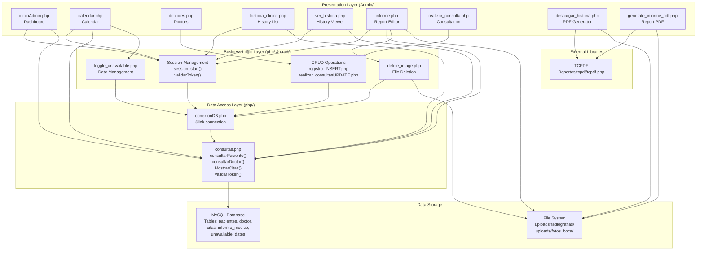
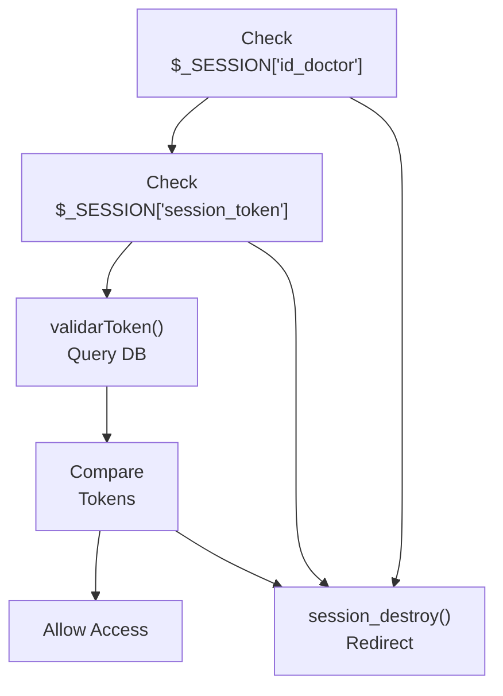
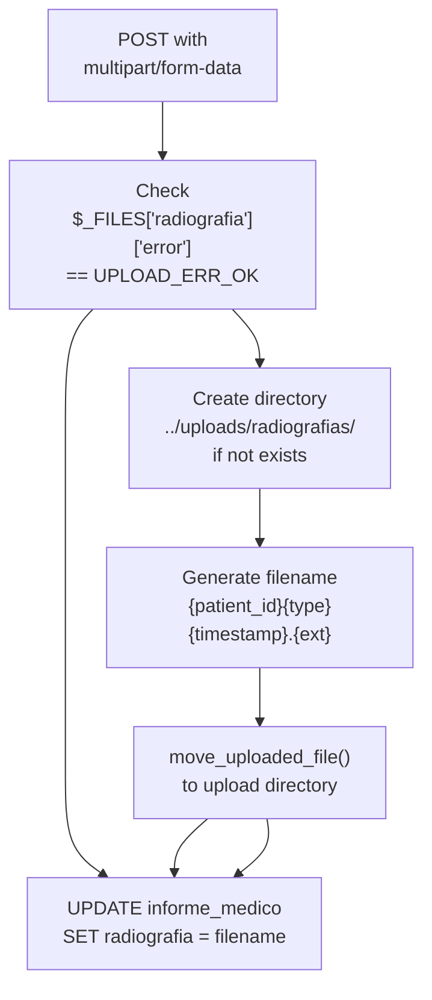
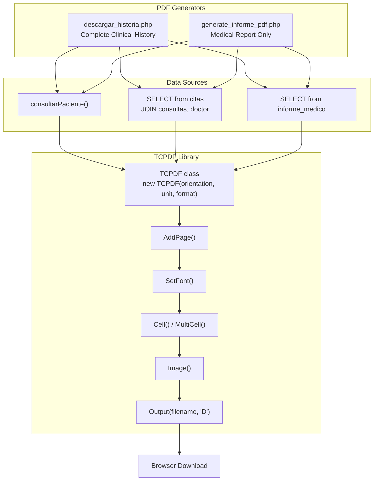
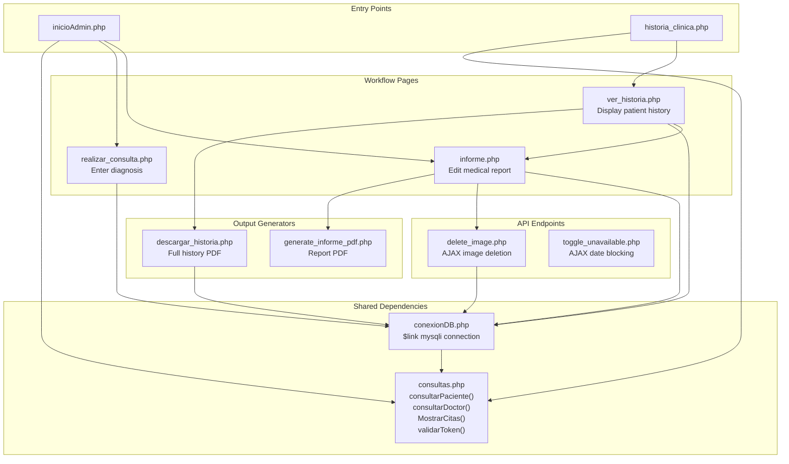

# System Architecture

> **Relevant source files**
> * [Admin/descargar_historia.php](https://github.com/axchisan/Consultorio_Emily_Bernal/blob/589034b9/Admin/descargar_historia.php)
> * [Admin/informe.php](https://github.com/axchisan/Consultorio_Emily_Bernal/blob/589034b9/Admin/informe.php)
> * [Admin/inicioAdmin.php](https://github.com/axchisan/Consultorio_Emily_Bernal/blob/589034b9/Admin/inicioAdmin.php)
> * [Admin/ver_historia.php](https://github.com/axchisan/Consultorio_Emily_Bernal/blob/589034b9/Admin/ver_historia.php)

This page describes the high-level three-tier architecture of the Consultorio Emily Bernal dental clinic management system and explains how major components interact. The system follows a traditional web application pattern with distinct presentation, business logic, and data access layers.

For information about specific technologies used in each layer, see [Technology Stack](/axchisan/Consultorio_Emily_Bernal/1.2-technology-stack). For details on security mechanisms, see [Security & Authentication](/axchisan/Consultorio_Emily_Bernal/5-security-and-authentication). For the database schema, see [Database Architecture](/axchisan/Consultorio_Emily_Bernal/4-database-architecture).

## Architecture Overview

The system implements a three-tier architecture where PHP pages in the `Admin/` directory serve as the presentation layer, business logic is distributed across PHP scripts and validation functions, and data persistence is managed through a MySQL database accessed via abstraction functions in `consultas.php`.

### Three-Tier Architecture Diagram



**Sources:** [Admin/inicioAdmin.php L1-L165](https://github.com/axchisan/Consultorio_Emily_Bernal/blob/589034b9/Admin/inicioAdmin.php#L1-L165)

 [Admin/informe.php L1-L865](https://github.com/axchisan/Consultorio_Emily_Bernal/blob/589034b9/Admin/informe.php#L1-L865)

 [Admin/ver_historia.php L1-L302](https://github.com/axchisan/Consultorio_Emily_Bernal/blob/589034b9/Admin/ver_historia.php#L1-L302)

 [Admin/descargar_historia.php L1-L293](https://github.com/axchisan/Consultorio_Emily_Bernal/blob/589034b9/Admin/descargar_historia.php#L1-L293)

## Layer Responsibilities

### Presentation Layer

The presentation layer consists of PHP files in the `Admin/` directory that generate HTML interfaces and handle user interactions. Each page follows a consistent pattern:

| File | Primary Function | Key Operations |
| --- | --- | --- |
| `inicioAdmin.php` | Dashboard with appointment listing | Display appointments via `MostrarCitas()` |
| `calendar.php` | Visual calendar interface | Render calendar events, manage availability |
| `historia_clinica.php` | Clinical history list view | Query completed appointments |
| `ver_historia.php` | Detailed history viewer | Display patient records, medical reports |
| `informe.php` | Medical report editor | Update patient data, manage images, edit reports |
| `realizar_consulta.php` | Consultation form | Enter diagnosis, prescriptions |
| `doctores.php` | Doctor management | Add/edit doctor records |

All presentation layer pages include these common elements:

* Session validation via `session_start()` at [Admin/inicioAdmin.php L2](https://github.com/axchisan/Consultorio_Emily_Bernal/blob/589034b9/Admin/inicioAdmin.php#L2-L2)
* Token verification via `validarToken($link, $vUsuario, 'Doctor', $_SESSION['session_token'])` at [Admin/inicioAdmin.php L17](https://github.com/axchisan/Consultorio_Emily_Bernal/blob/589034b9/Admin/inicioAdmin.php#L17-L17)
* Database connection via `include_once('../php/conexionDB.php')` at [Admin/inicioAdmin.php L3](https://github.com/axchisan/Consultorio_Emily_Bernal/blob/589034b9/Admin/inicioAdmin.php#L3-L3)
* Query functions via `include_once('../php/consultas.php')` at [Admin/inicioAdmin.php L4](https://github.com/axchisan/Consultorio_Emily_Bernal/blob/589034b9/Admin/inicioAdmin.php#L4-L4)

**Sources:** [Admin/inicioAdmin.php L1-L165](https://github.com/axchisan/Consultorio_Emily_Bernal/blob/589034b9/Admin/inicioAdmin.php#L1-L165)

 [Admin/informe.php L1-L435](https://github.com/axchisan/Consultorio_Emily_Bernal/blob/589034b9/Admin/informe.php#L1-L435)

 [Admin/ver_historia.php L1-L302](https://github.com/axchisan/Consultorio_Emily_Bernal/blob/589034b9/Admin/ver_historia.php#L1-L302)

### Request Flow Diagram

```

```

**Sources:** [Admin/inicioAdmin.php L6-L24](https://github.com/axchisan/Consultorio_Emily_Bernal/blob/589034b9/Admin/inicioAdmin.php#L6-L24)

 [Admin/ver_historia.php L6-L23](https://github.com/axchisan/Consultorio_Emily_Bernal/blob/589034b9/Admin/ver_historia.php#L6-L23)

 [php/consultas.php](https://github.com/axchisan/Consultorio_Emily_Bernal/blob/589034b9/php/consultas.php)

 (implied from validation pattern)

### Business Logic Layer

The business logic layer handles authentication, authorization, data validation, and orchestrates operations between presentation and data layers. Key components include:

#### Session Management

Every administrative page validates two security tokens:

1. PHP session existence via `$_SESSION['id_doctor']` check at [Admin/inicioAdmin.php L7](https://github.com/axchisan/Consultorio_Emily_Bernal/blob/589034b9/Admin/inicioAdmin.php#L7-L7)
2. Database token via `validarToken()` function call at [Admin/inicioAdmin.php L17](https://github.com/axchisan/Consultorio_Emily_Bernal/blob/589034b9/Admin/inicioAdmin.php#L17-L17)

The `validarToken()` function prevents concurrent logins by comparing the session token against the database:



**Sources:** [Admin/inicioAdmin.php L6-L24](https://github.com/axchisan/Consultorio_Emily_Bernal/blob/589034b9/Admin/inicioAdmin.php#L6-L24)

 [Admin/ver_historia.php L6-L23](https://github.com/axchisan/Consultorio_Emily_Bernal/blob/589034b9/Admin/ver_historia.php#L6-L23)

 [Admin/descargar_historia.php L8-L25](https://github.com/axchisan/Consultorio_Emily_Bernal/blob/589034b9/Admin/descargar_historia.php#L8-L25)

#### CRUD Operations

Form submissions are processed through dedicated scripts in the `crud/` directory:

* `registro_INSERT.php` - Insert new appointments
* `realizar_consultasUPDATE.php` - Update appointment diagnosis/status
* Doctor registration handled directly in `doctores.php`

The medical report editor (`informe.php`) handles both patient updates and medical report CRUD operations internally using prepared statements:

* Patient data update at [Admin/informe.php L68-L171](https://github.com/axchisan/Consultorio_Emily_Bernal/blob/589034b9/Admin/informe.php#L68-L171)
* Medical report INSERT/UPDATE logic at [Admin/informe.php L174-L425](https://github.com/axchisan/Consultorio_Emily_Bernal/blob/589034b9/Admin/informe.php#L174-L425)

**Sources:** [Admin/informe.php L68-L425](https://github.com/axchisan/Consultorio_Emily_Bernal/blob/589034b9/Admin/informe.php#L68-L425)

 [crud/realizar_consultasUPDATE.php](https://github.com/axchisan/Consultorio_Emily_Bernal/blob/589034b9/crud/realizar_consultasUPDATE.php)

 (referenced at [Admin/inicioAdmin.php L130](https://github.com/axchisan/Consultorio_Emily_Bernal/blob/589034b9/Admin/inicioAdmin.php#L130-L130)

)

#### File Upload Management

The file upload system in `informe.php` implements a multi-step process:



File upload logic:

* Radiograph upload at [Admin/informe.php L192-L206](https://github.com/axchisan/Consultorio_Emily_Bernal/blob/589034b9/Admin/informe.php#L192-L206)
* Oral photo upload at [Admin/informe.php L209-L223](https://github.com/axchisan/Consultorio_Emily_Bernal/blob/589034b9/Admin/informe.php#L209-L223)
* Directory creation with `mkdir($path, 0777, true)` at [Admin/informe.php L194](https://github.com/axchisan/Consultorio_Emily_Bernal/blob/589034b9/Admin/informe.php#L194-L194)
* Unique filename generation: `$patient_id . "_radiografia_" . time() . "." . pathinfo(...)` at [Admin/informe.php L198](https://github.com/axchisan/Consultorio_Emily_Bernal/blob/589034b9/Admin/informe.php#L198-L198)

**Sources:** [Admin/informe.php L192-L223](https://github.com/axchisan/Consultorio_Emily_Bernal/blob/589034b9/Admin/informe.php#L192-L223)

### Data Access Layer

The data access layer provides abstraction between business logic and raw SQL queries through two key files:

#### conexionDB.php

Establishes the MySQL connection and exposes the `$link` variable globally:

* Connection initialization (structure inferred from usage patterns)
* Used by all pages via `include_once('../php/conexionDB.php')`

#### consultas.php Functions

Query abstraction functions that return data arrays or execute operations:

| Function | Purpose | Usage Example |
| --- | --- | --- |
| `consultarPaciente($link, $id)` | Fetch patient record | [Admin/informe.php L30](https://github.com/axchisan/Consultorio_Emily_Bernal/blob/589034b9/Admin/informe.php#L30-L30) |
| `consultarDoctor($link, $id)` | Fetch doctor record | [Admin/inicioAdmin.php L26](https://github.com/axchisan/Consultorio_Emily_Bernal/blob/589034b9/Admin/inicioAdmin.php#L26-L26) |
| `MostrarCitas($link, $doctor_id)` | List appointments for doctor | [Admin/inicioAdmin.php L27](https://github.com/axchisan/Consultorio_Emily_Bernal/blob/589034b9/Admin/inicioAdmin.php#L27-L27) |
| `validarToken($link, $id, $type, $token)` | Validate session token | [Admin/inicioAdmin.php L17](https://github.com/axchisan/Consultorio_Emily_Bernal/blob/589034b9/Admin/inicioAdmin.php#L17-L17) |

All queries use prepared statements with parameter binding to prevent SQL injection. Example pattern from `informe.php`:

* Query preparation at [Admin/informe.php L53](https://github.com/axchisan/Consultorio_Emily_Bernal/blob/589034b9/Admin/informe.php#L53-L53)
* Parameter binding at [Admin/informe.php L54](https://github.com/axchisan/Consultorio_Emily_Bernal/blob/589034b9/Admin/informe.php#L54-L54)
* Execution at [Admin/informe.php L55](https://github.com/axchisan/Consultorio_Emily_Bernal/blob/589034b9/Admin/informe.php#L55-L55)
* Result retrieval at [Admin/informe.php L56](https://github.com/axchisan/Consultorio_Emily_Bernal/blob/589034b9/Admin/informe.php#L56-L56)

**Sources:** [Admin/inicioAdmin.php L3-L4](https://github.com/axchisan/Consultorio_Emily_Bernal/blob/589034b9/Admin/inicioAdmin.php#L3-L4)

 [Admin/informe.php L7-L8](https://github.com/axchisan/Consultorio_Emily_Bernal/blob/589034b9/Admin/informe.php#L7-L8)

 [Admin/ver_historia.php L3-L4](https://github.com/axchisan/Consultorio_Emily_Bernal/blob/589034b9/Admin/ver_historia.php#L3-L4)

## Cross-Cutting Concerns

### Flash Messaging System

The system implements Post-Redirect-Get (PRG) pattern for user notifications using session variables:

```

```

Message setting pattern at [Admin/informe.php L161-L162](https://github.com/axchisan/Consultorio_Emily_Bernal/blob/589034b9/Admin/informe.php#L161-L162)

:

```
$_SESSION['MensajeTexto'] = "Datos del paciente actualizados correctamente.";
$_SESSION['MensajeTipo'] = "p-3 mb-2 bg-success text-white";
```

Message display and clearing at [Admin/inicioAdmin.php L93-L101](https://github.com/axchisan/Consultorio_Emily_Bernal/blob/589034b9/Admin/inicioAdmin.php#L93-L101)

:

* Check for message existence
* Display alert div with Bootstrap classes from `$_SESSION['MensajeTipo']`
* Clear session variables immediately after display

**Sources:** [Admin/inicioAdmin.php L93-L101](https://github.com/axchisan/Consultorio_Emily_Bernal/blob/589034b9/Admin/inicioAdmin.php#L93-L101)

 [Admin/informe.php L161-L169](https://github.com/axchisan/Consultorio_Emily_Bernal/blob/589034b9/Admin/informe.php#L161-L169)

 [Admin/ver_historia.php](https://github.com/axchisan/Consultorio_Emily_Bernal/blob/589034b9/Admin/ver_historia.php)

 (pattern consistent across all admin pages)

### PDF Generation Architecture

Two separate PDF generators share the TCPDF library but serve different purposes:



Both generators follow similar patterns:

1. Query data from multiple tables at [Admin/descargar_historia.php L40-L82](https://github.com/axchisan/Consultorio_Emily_Bernal/blob/589034b9/Admin/descargar_historia.php#L40-L82)
2. Instantiate TCPDF at [Admin/descargar_historia.php L91](https://github.com/axchisan/Consultorio_Emily_Bernal/blob/589034b9/Admin/descargar_historia.php#L91-L91)
3. Configure document at [Admin/descargar_historia.php L94-L102](https://github.com/axchisan/Consultorio_Emily_Bernal/blob/589034b9/Admin/descargar_historia.php#L94-L102)
4. Add pages and content at [Admin/descargar_historia.php L105-L287](https://github.com/axchisan/Consultorio_Emily_Bernal/blob/589034b9/Admin/descargar_historia.php#L105-L287)
5. Output as download at [Admin/descargar_historia.php L292](https://github.com/axchisan/Consultorio_Emily_Bernal/blob/589034b9/Admin/descargar_historia.php#L292-L292)

**Sources:** [Admin/descargar_historia.php L1-L293](https://github.com/axchisan/Consultorio_Emily_Bernal/blob/589034b9/Admin/descargar_historia.php#L1-L293)

 [Admin/generate_informe_pdf.php](https://github.com/axchisan/Consultorio_Emily_Bernal/blob/589034b9/Admin/generate_informe_pdf.php)

 (referenced at [Admin/informe.php L773](https://github.com/axchisan/Consultorio_Emily_Bernal/blob/589034b9/Admin/informe.php#L773-L773)

)

### File Storage Strategy

The system stores medical images using a reference-based pattern:

**Storage Locations:**

* Radiographs: `../uploads/radiografias/`
* Oral photos: `../uploads/fotos_boca/`

**Database References:**

* `informe_medico.radiografia` stores filename only (not binary data)
* `informe_medico.foto_boca` stores filename only

**Deletion Process (delete_image.php):**

1. Receive AJAX request with `type`, `file_name`, `id_cita`
2. Update database: `SET {type} = NULL` for the informe record
3. Delete physical file: `unlink("../uploads/{directory}/{filename}")`
4. Return JSON response

This two-step deletion ensures database consistency - if the database update fails, the file remains accessible.

**Sources:** [Admin/informe.php L192-L223](https://github.com/axchisan/Consultorio_Emily_Bernal/blob/589034b9/Admin/informe.php#L192-L223)

 [Admin/delete_image.php](https://github.com/axchisan/Consultorio_Emily_Bernal/blob/589034b9/Admin/delete_image.php)

 (referenced at [Admin/informe.php L838](https://github.com/axchisan/Consultorio_Emily_Bernal/blob/589034b9/Admin/informe.php#L838-L838)

)

## Component Interaction Map



**Sources:** [Admin/inicioAdmin.php L128-L130](https://github.com/axchisan/Consultorio_Emily_Bernal/blob/589034b9/Admin/inicioAdmin.php#L128-L130)

 [Admin/historia_clinica.php](https://github.com/axchisan/Consultorio_Emily_Bernal/blob/589034b9/Admin/historia_clinica.php)

 (navigation references), [Admin/ver_historia.php L283-L289](https://github.com/axchisan/Consultorio_Emily_Bernal/blob/589034b9/Admin/ver_historia.php#L283-L289)

 [Admin/informe.php L773-L778](https://github.com/axchisan/Consultorio_Emily_Bernal/blob/589034b9/Admin/informe.php#L773-L778)

 [Admin/informe.php L838-L858](https://github.com/axchisan/Consultorio_Emily_Bernal/blob/589034b9/Admin/informe.php#L838-L858)

## Security Architecture Pattern

All administrative pages implement a consistent security validation pattern before executing any business logic:

**Two-Layer Validation:**

1. **Session Layer:** Check `$_SESSION['id_doctor']` and `$_SESSION['session_token']` exist
2. **Database Layer:** Call `validarToken()` to verify token matches database record

**Implementation Pattern:**

```
// Layer 1: Session check at lines 7-14
if (!isset($_SESSION['id_doctor']) || !isset($_SESSION['session_token'])) {
    // Set error message and redirect
}

// Layer 2: Token validation at lines 17-24
if (!validarToken($link, $vUsuario, 'Doctor', $_SESSION['session_token'])) {
    session_unset();
    session_destroy();
    // Set error message and redirect
}
```

This pattern appears identically in:

* [Admin/inicioAdmin.php L6-L24](https://github.com/axchisan/Consultorio_Emily_Bernal/blob/589034b9/Admin/inicioAdmin.php#L6-L24)
* [Admin/ver_historia.php L6-L23](https://github.com/axchisan/Consultorio_Emily_Bernal/blob/589034b9/Admin/ver_historia.php#L6-L23)
* [Admin/descargar_historia.php L8-L25](https://github.com/axchisan/Consultorio_Emily_Bernal/blob/589034b9/Admin/descargar_historia.php#L8-L25)

For detailed security mechanisms, see [Security & Authentication](/axchisan/Consultorio_Emily_Bernal/5-security-and-authentication).

**Sources:** [Admin/inicioAdmin.php L6-L24](https://github.com/axchisan/Consultorio_Emily_Bernal/blob/589034b9/Admin/inicioAdmin.php#L6-L24)

 [Admin/ver_historia.php L6-L23](https://github.com/axchisan/Consultorio_Emily_Bernal/blob/589034b9/Admin/ver_historia.php#L6-L23)

 [Admin/descargar_historia.php L8-L25](https://github.com/axchisan/Consultorio_Emily_Bernal/blob/589034b9/Admin/descargar_historia.php#L8-L25)