# TCPDF Core Methods

> **Relevant source files**
> * [Reportes/fpdf/Nueva carpeta/doc/__construct.htm](https://github.com/axchisan/Consultorio_Emily_Bernal/blob/589034b9/Reportes/fpdf/Nueva carpeta/doc/__construct.htm)
> * [Reportes/fpdf/Nueva carpeta/doc/addpage.htm](https://github.com/axchisan/Consultorio_Emily_Bernal/blob/589034b9/Reportes/fpdf/Nueva carpeta/doc/addpage.htm)
> * [Reportes/fpdf/Nueva carpeta/doc/cell.htm](https://github.com/axchisan/Consultorio_Emily_Bernal/blob/589034b9/Reportes/fpdf/Nueva carpeta/doc/cell.htm)
> * [Reportes/fpdf/Nueva carpeta/doc/close.htm](https://github.com/axchisan/Consultorio_Emily_Bernal/blob/589034b9/Reportes/fpdf/Nueva carpeta/doc/close.htm)

## Purpose and Scope

This document provides a comprehensive reference for the essential TCPDF library methods used throughout the Consultorio Emily Bernal system. TCPDF is a PHP library for generating PDF documents, used extensively in [Clinical History PDF Generator](/axchisan/Consultorio_Emily_Bernal/3.1-clinical-history-pdf-generator) and [Medical Report PDF Generator](/axchisan/Consultorio_Emily_Bernal/3.2-medical-report-pdf-generator) to produce clinical documentation.

This page focuses specifically on the seven core methods that form the foundation of PDF generation in the codebase:

* `__construct()` - Document initialization
* `AddPage()` - Page management
* `SetFont()` - Font configuration
* `Cell()` - Single-line text output
* `MultiCell()` - Multi-line text output with wrapping
* `Image()` - Image insertion
* `Output()` - Document delivery

For header and footer customization, see [TCPDF Header & Footer Customization](/axchisan/Consultorio_Emily_Bernal/9.2-tcpdf-header-and-footer-customization). For advanced font management including custom fonts and encoding, see [TCPDF Font Management](/axchisan/Consultorio_Emily_Bernal/9.3-tcpdf-font-management). For coordinate system and positioning methods, see [TCPDF Positioning & Dimensions](/axchisan/Consultorio_Emily_Bernal/9.5-tcpdf-positioning-and-dimensions).

---

## TCPDF Lifecycle Overview

The following diagram illustrates the standard lifecycle of a TCPDF document object from initialization through output, showing the sequence of core method calls:


**Sources:** [Reportes/fpdf/Nueva carpeta/doc/__construct.htm](https://github.com/axchisan/Consultorio_Emily_Bernal/blob/589034b9/Reportes/fpdf/Nueva carpeta/doc/__construct.htm)

 [Reportes/fpdf/Nueva carpeta/doc/addpage.htm](https://github.com/axchisan/Consultorio_Emily_Bernal/blob/589034b9/Reportes/fpdf/Nueva carpeta/doc/addpage.htm)

 [Reportes/fpdf/Nueva carpeta/doc/cell.htm](https://github.com/axchisan/Consultorio_Emily_Bernal/blob/589034b9/Reportes/fpdf/Nueva carpeta/doc/cell.htm)

 [Reportes/fpdf/Nueva carpeta/doc/close.htm](https://github.com/axchisan/Consultorio_Emily_Bernal/blob/589034b9/Reportes/fpdf/Nueva carpeta/doc/close.htm)

---

## Document Initialization: __construct()

### Method Signature

```javascript
public function __construct(
    string $orientation = 'P',
    string $unit = 'mm',
    mixed $size = 'A4',
    boolean $unicode = true,
    string $encoding = 'UTF-8',
    boolean $diskcache = false,
    boolean $pdfa = false
)
```

### Description

The constructor initializes a new TCPDF document instance, establishing fundamental properties that affect all subsequent operations. This method must be called first before any other TCPDF operations.

### Parameters

| Parameter | Type | Description | Default Value | Used In System |
| --- | --- | --- | --- | --- |
| `$orientation` | string | Page orientation: `'P'` (Portrait) or `'L'` (Landscape) | `'P'` | `'P'` in both generators |
| `$unit` | string | Measurement unit: `'pt'`, `'mm'`, `'cm'`, `'in'` | `'mm'` | `'mm'` |
| `$size` | mixed | Page format: `'A4'`, `'Letter'`, `'Legal'`, or array `[width, height]` | `'A4'` | `'Letter'` |
| `$unicode` | boolean | Enable Unicode support (UTF-8) | `true` | `true` |
| `$encoding` | string | Character encoding | `'UTF-8'` | `'UTF-8'` |
| `$diskcache` | boolean | Enable disk caching for images | `false` | `false` |
| `$pdfa` | boolean | Enable PDF/A compliance mode | `false` | `false` |

### Usage Pattern in Codebase

```
// Standard initialization in descargar_historia.php and generate_informe_pdf.php
$pdf = new TCPDF('P', 'mm', 'Letter', true, 'UTF-8', false);
```

### Configuration Methods Called After Construction

After instantiation, the following configuration is typically applied:

```
$pdf->SetCreator(PDF_CREATOR);
$pdf->SetAuthor('Consultorio Emily Bernal');
$pdf->SetTitle('Historia Clínica');
$pdf->SetSubject('Dental Clinical History');
$pdf->SetMargins(15, 27, 15);  // left, top, right
$pdf->SetAutoPageBreak(TRUE, 25);  // Enable auto page break with 25mm bottom margin
$pdf->SetImageScale(PDF_IMAGE_SCALE_RATIO);
```

**Sources:** [Reportes/fpdf/Nueva L1-L62](https://github.com/axchisan/Consultorio_Emily_Bernal/blob/589034b9/Reportes/fpdf/Nueva carpeta/doc/__construct.htm#L1-L62)

---

## Page Management: AddPage()

### Method Signature

```javascript
public function AddPage(
    string $orientation = '',
    mixed $size = '',
    boolean $keepmargins = false,
    boolean $tocpage = false
)
```

### Description

Creates a new page in the PDF document. When called, the system automatically invokes `Footer()` for the previous page, adds the new page, resets the current position to the top-left corner (respecting margins), and invokes `Header()` for the new page. Font settings, colors, and line width are automatically preserved across pages.

### Parameters

| Parameter | Type | Description | Default |
| --- | --- | --- | --- |
| `$orientation` | string | Page orientation: `'P'` or `'L'`. Empty string uses default from constructor | `''` |
| `$size` | mixed | Page size: standard format string or custom array. Empty uses default | `''` |
| `$keepmargins` | boolean | If `true`, maintains current margins instead of resetting to defaults | `false` |
| `$tocpage` | boolean | If `true`, marks page as part of Table of Contents | `false` |

### Coordinate System

The origin `(0,0)` is located at the **top-left corner** of the page. The coordinate system increases:

* **X-axis**: left to right
* **Y-axis**: top to bottom

### Automatic Behaviors


### Usage Examples from System

```
// Add first page with default settings
$pdf->AddPage();

// Add landscape page for wide tables
$pdf->AddPage('L');

// Add page with custom size while keeping margins
$pdf->AddPage('P', array(100, 150), true);
```

**Sources:** [Reportes/fpdf/Nueva L1-L57](https://github.com/axchisan/Consultorio_Emily_Bernal/blob/589034b9/Reportes/fpdf/Nueva carpeta/doc/addpage.htm#L1-L57)

---

## Font Configuration: SetFont()

### Method Signature

```javascript
public function SetFont(
    string $family,
    string $style = '',
    float $size = 0,
    string $fontfile = '',
    boolean $subset = 'default',
    boolean $out = true
)
```

### Description

Configures the font to be used for all subsequent text output operations (`Cell`, `MultiCell`, `Write`, etc.). This method must be called at least once before outputting any text. The font remains active until explicitly changed by another `SetFont()` call.

### Parameters

| Parameter | Type | Description | Common Values in System |
| --- | --- | --- | --- |
| `$family` | string | Font family name | `'helvetica'`, `'times'`, `'courier'` |
| `$style` | string | Font style combination | `''` (regular), `'B'` (bold), `'I'` (italic), `'BI'` (bold+italic), `'U'` (underline) |
| `$size` | float | Font size in points | `8`, `10`, `12`, `14`, `16`, `18` |
| `$fontfile` | string | Custom font file path (advanced) | `''` (use standard fonts) |
| `$subset` | boolean | Enable font subsetting | `'default'` |
| `$out` | boolean | Write font selection to output stream | `true` |

### Core Fonts Available

TCPDF includes 14 standard core fonts that are always available without additional files:

| Family | Styles Available | Use Case in System |
| --- | --- | --- |
| `helvetica` | Regular, Bold, Italic, Bold+Italic | Primary font for headers, labels, body text |
| `times` | Regular, Bold, Italic, Bold+Italic | Alternative serif font for formal documents |
| `courier` | Regular, Bold, Italic, Bold+Italic | Monospaced font for codes or IDs |
| `symbol` | Regular | Special mathematical symbols |
| `zapfdingbats` | Regular | Decorative symbols and icons |

### Font Usage Patterns in PDF Generators


### Common Usage Examples

```
// Document title
$pdf->SetFont('helvetica', 'B', 18);
$pdf->Cell(0, 10, 'HISTORIA CLÍNICA', 0, 1, 'C');

// Section header
$pdf->SetFont('helvetica', 'B', 12);
$pdf->Cell(0, 8, 'DATOS DEL PACIENTE', 0, 1, 'L');

// Field label (bold)
$pdf->SetFont('helvetica', 'B', 10);
$pdf->Cell(40, 6, 'Nombre:', 0, 0, 'L');

// Field value (regular)
$pdf->SetFont('helvetica', '', 10);
$pdf->Cell(0, 6, $nombre_paciente, 0, 1, 'L');

// Multi-line diagnosis with regular font
$pdf->SetFont('helvetica', '', 10);
$pdf->MultiCell(0, 5, $diagnostico, 0, 'L');
```

### Important Notes

* **Size Parameter**: Font size is always specified in **points** (1/72 inch), regardless of the unit specified in constructor
* **UTF-8 Support**: When using Unicode text, ensure the font supports the required character set
* **Performance**: Changing fonts frequently impacts PDF generation time; minimize font switches when possible
* **Font Persistence**: Font settings persist across `AddPage()` calls automatically

**Sources:** [Reportes/fpdf/Nueva L80-L85](https://github.com/axchisan/Consultorio_Emily_Bernal/blob/589034b9/Reportes/fpdf/Nueva carpeta/doc/cell.htm#L80-L85)

---

## Single-Line Text Output: Cell()

### Method Signature

```javascript
public function Cell(
    float $w,
    float $h = 0,
    string $txt = '',
    mixed $border = 0,
    int $ln = 0,
    string $align = '',
    boolean $fill = false,
    mixed $link = '',
    int $stretch = 0,
    boolean $ignore_min_height = false,
    string $calign = 'T',
    string $valign = 'M'
)
```

### Description

Outputs a rectangular cell with optional border, background fill, and text content. The cell is positioned at the current coordinates and can contain a single line of text with specified alignment. After output, the current position moves according to the `$ln` parameter.

### Core Parameters

| Parameter | Type | Description | Default |
| --- | --- | --- | --- |
| `$w` | float | Cell width. If `0`, extends to right margin | Required |
| `$h` | float | Cell height | `0` |
| `$txt` | string | Text to display (single line) | `''` |
| `$border` | mixed | Border style (see table below) | `0` |
| `$ln` | int | Position after output (see table below) | `0` |
| `$align` | string | Horizontal alignment: `'L'`, `'C'`, `'R'` | `'L'` |
| `$fill` | boolean | Fill background with current fill color | `false` |
| `$link` | mixed | URL string or link identifier from `AddLink()` | `''` |

### Border Options

| Value | Result |
| --- | --- |
| `0` | No border |
| `1` | Complete frame around cell |
| `'L'` | Left border only |
| `'T'` | Top border only |
| `'R'` | Right border only |
| `'B'` | Bottom border only |
| `'LTRB'` | All borders (equivalent to `1`) |
| `'LR'` | Left and right borders |
| `'TB'` | Top and bottom borders |

### Position After Output ($ln parameter)

| Value | Behavior |
| --- | --- |
| `0` | Next cell starts to the right of current cell (same line) |
| `1` | Next cell starts at left margin of next line |
| `2` | Next cell starts directly below current cell (same X position) |

### Cell Layout Patterns


### Usage Examples from System

```
// Full-width centered title with border
$pdf->Cell(0, 10, 'HISTORIA CLÍNICA ODONTOLÓGICA', 1, 1, 'C');

// Label-value pair without border
$pdf->SetFont('helvetica', 'B', 10);
$pdf->Cell(40, 6, 'Cédula:', 0, 0, 'L');
$pdf->SetFont('helvetica', '', 10);
$pdf->Cell(0, 6, $cedula, 0, 1, 'L');

// Table header with borders
$pdf->SetFont('helvetica', 'B', 10);
$pdf->Cell(30, 8, 'Fecha', 1, 0, 'C', true);  // filled background
$pdf->Cell(40, 8, 'Diagnóstico', 1, 0, 'C', true);
$pdf->Cell(0, 8, 'Tratamiento', 1, 1, 'C', true);

// Empty cell for spacing (invisible spacer)
$pdf->Cell(0, 5, '', 0, 1);
```

### Auto Page Break Behavior

When `SetAutoPageBreak(true)` is enabled, if a `Cell()` would extend beyond the bottom margin, TCPDF automatically:

1. Calls `Footer()` for current page
2. Executes `AddPage()`
3. Calls `Header()` for new page
4. Outputs the cell on the new page

**Sources:** [Reportes/fpdf/Nueva L1-L101](https://github.com/axchisan/Consultorio_Emily_Bernal/blob/589034b9/Reportes/fpdf/Nueva carpeta/doc/cell.htm#L1-L101)

---

## Multi-Line Text Output: MultiCell()

### Method Signature

```javascript
public function MultiCell(
    float $w,
    float $h,
    string $txt,
    mixed $border = 0,
    string $align = 'J',
    boolean $fill = false,
    int $ln = 1,
    float $x = '',
    float $y = '',
    boolean $reseth = true,
    int $stretch = 0,
    boolean $ishtml = false,
    boolean $autopadding = true,
    float $maxh = 0,
    string $valign = 'T',
    boolean $fitcell = false
)
```

### Description

Outputs a cell with text that automatically wraps to multiple lines. This method is essential for displaying variable-length content such as diagnoses, treatment plans, and clinical observations. The text wraps at the cell width boundary, respecting word boundaries when possible.

### Core Parameters

| Parameter | Type | Description | Default |
| --- | --- | --- | --- |
| `$w` | float | Cell width. If `0`, extends to right margin | Required |
| `$h` | float | Minimum height of each line | Required |
| `$txt` | string | Text content (can contain `\n` for explicit line breaks) | Required |
| `$border` | mixed | Border style (same as `Cell()`) | `0` |
| `$align` | string | Alignment: `'L'`, `'C'`, `'R'`, `'J'` (justified) | `'J'` |
| `$fill` | boolean | Fill background | `false` |
| `$ln` | int | Position after output: `0` (right), `1` (next line), `2` (below) | `1` |
| `$x` | float | Explicit X position (overrides current) | `''` |
| `$y` | float | Explicit Y position (overrides current) | `''` |
| `$ishtml` | boolean | Parse text as HTML | `false` |
| `$maxh` | float | Maximum height constraint | `0` |

### Key Differences from Cell()

| Feature | `Cell()` | `MultiCell()` |
| --- | --- | --- |
| Text wrapping | No - single line only | Yes - automatic word wrapping |
| Default alignment | Left (`'L'`) | Justified (`'J'`) |
| Height behavior | Fixed height | Expands to fit content |
| Typical use | Labels, headers, short values | Paragraphs, descriptions, long text |
| Performance | Faster | Slower (text calculation) |

### Text Wrapping Algorithm


### Practical Usage Examples

```go
// Simple multi-line description without border
$pdf->SetFont('helvetica', '', 10);
$pdf->MultiCell(0, 5, $descripcion_tratamiento, 0, 'L');

// Boxed multi-line text with justified alignment
$pdf->MultiCell(0, 5, $observaciones, 1, 'J', false);

// Multi-line cell with explicit position
$pdf->MultiCell(90, 5, $diagnostico, 1, 'L', false, 0, 15, 50);

// Long text that may trigger page breaks
$texto_largo = str_repeat('Lorem ipsum dolor sit amet. ', 50);
$pdf->MultiCell(0, 5, $texto_largo, 0, 'J');
```

### Common Patterns in Clinical PDF Generation

```
// Section with label and multi-line content
$pdf->SetFont('helvetica', 'B', 11);
$pdf->Cell(0, 6, 'DIAGNÓSTICO:', 0, 1, 'L');

$pdf->SetFont('helvetica', '', 10);
$pdf->MultiCell(0, 5, $diagnostico_detallado, 1, 'J');
$pdf->Ln(3);  // spacing after

// Two-column layout with MultiCell
$pdf->SetFont('helvetica', 'B', 10);
$pdf->Cell(50, 6, 'Examen Intraoral:', 0, 1);

$pdf->SetFont('helvetica', '', 9);
$pdf->MultiCell(90, 4, $examen_intraoral, 1, 'L', false, 0);
$pdf->MultiCell(90, 4, $examen_extraoral, 1, 'L', false, 1);
```

### Performance Considerations

`MultiCell()` is computationally more expensive than `Cell()` because it must:

1. Calculate text width for each word
2. Determine line breaks
3. Handle multiple line outputs
4. Check for page breaks after each line

**Best Practice**: Use `Cell()` for fixed, short content. Reserve `MultiCell()` for variable-length text fields.

**Sources:** [Reportes/fpdf/Nueva L95](https://github.com/axchisan/Consultorio_Emily_Bernal/blob/589034b9/Reportes/fpdf/Nueva carpeta/doc/cell.htm#L95-L95)

---

## Image Insertion: Image()

### Method Signature

```javascript
public function Image(
    string $file,
    float $x = '',
    float $y = '',
    float $w = 0,
    float $h = 0,
    string $type = '',
    mixed $link = '',
    string $align = '',
    boolean $resize = false,
    int $dpi = 300,
    string $palign = '',
    boolean $ismask = false,
    mixed $imgmask = false,
    mixed $border = 0,
    mixed $fitbox = false,
    boolean $hidden = false,
    boolean $fitonpage = false,
    boolean $alt = false,
    array $altimgs = array()
)
```

### Description

Inserts an image into the PDF document at the specified coordinates. The method supports multiple image formats (JPEG, PNG, GIF) and provides automatic scaling, aspect ratio preservation, and positioning options. Images are essential for including radiographs (`radiografias/`) and oral photos (`fotos_boca/`) in clinical reports.

### Core Parameters

| Parameter | Type | Description | Default |
| --- | --- | --- | --- |
| `$file` | string | Image file path (absolute or relative) | Required |
| `$x` | float | X coordinate (left position). Empty string uses current X | `''` |
| `$y` | float | Y coordinate (top position). Empty string uses current Y | `''` |
| `$w` | float | Image width. If `0`, calculates from height. If both `0`, uses actual size | `0` |
| `$h` | float | Image height. If `0`, calculates from width | `0` |
| `$type` | string | Image format: `'JPG'`, `'JPEG'`, `'PNG'`, `'GIF'`. Auto-detected if empty | `''` |
| `$link` | mixed | URL or link identifier (makes image clickable) | `''` |
| `$align` | string | Alignment relative to current position (see below) | `''` |
| `$resize` | boolean | Resize image if too large for page | `false` |
| `$border` | mixed | Border style (same as `Cell()`) | `0` |

### Alignment Options

The `$align` parameter positions the image relative to the current X,Y coordinates:

| Value | Positioning |
| --- | --- |
| `''` | No special alignment (uses X,Y directly) |
| `'L'` | Left-aligned at current Y position |
| `'C'` | Centered horizontally at current Y position |
| `'R'` | Right-aligned at current Y position |
| `'N'` | Next line (moves to next line after image) |

### Size Calculation Logic

```mermaid
flowchart TD

Image["Image($file, $x, $y, $w, $h)"]
ReadImage["Read image file<br>Get actual dimensions:<br>actual_w, actual_h"]
CheckW["$w == 0 ?"]
CheckH["$h == 0 ?"]
HasW["Width specified"]
UseActual["Use actual size:<br>display_w = actual_w<br>display_h = actual_h"]
CalcFromH["Calculate from height:<br>display_w = $h * aspect_ratio"]
CheckH2["$h == 0 ?"]
CalcFromW["Calculate from width:<br>display_h = $w / aspect_ratio"]
UseBoth["Use both:<br>display_w = $w<br>display_h = $h"]
CheckFit["Image fits<br>on page?"]
Render["Render at position<br>($x, $y)"]
Scale["Scale down to fit<br>maintaining aspect ratio"]
PageBreak["Auto page break<br>if enabled"]

Image --> ReadImage
ReadImage --> CheckW
CheckW --> CheckH
CheckW --> HasW
CheckH --> UseActual
CheckH --> CalcFromH
HasW --> CheckH2
CheckH2 --> CalcFromW
CheckH2 --> UseBoth
UseActual --> CheckFit
CalcFromH --> CheckFit
CalcFromW --> CheckFit
UseBoth --> CheckFit
CheckFit --> Render
CheckFit --> Scale
CheckFit --> PageBreak
Scale --> Render
PageBreak --> Render
```



### Usage Patterns in Medical PDFs

The system stores medical images in two directories and references them in the `informe_medico` table:

```sql
// Check if radiograph exists in database
if (!empty($row['radiografia'])) {
    $radiografia_path = '../uploads/radiografias/' . $row['radiografia'];
    
    // Verify file exists on filesystem
    if (file_exists($radiografia_path)) {
        $pdf->SetFont('helvetica', 'B', 11);
        $pdf->Cell(0, 6, 'RADIOGRAFÍA:', 0, 1, 'L');
        $pdf->Ln(2);
        
        // Insert image with automatic width calculation
        // Height = 60mm, width auto-calculated to preserve aspect ratio
        $pdf->Image($radiografia_path, '', '', 0, 60, '', '', '', false, 300);
        $pdf->Ln(5);
    }
}

// Check if oral photo exists
if (!empty($row['foto_boca'])) {
    $foto_path = '../uploads/fotos_boca/' . $row['foto_boca'];
    
    if (file_exists($foto_path)) {
        $pdf->SetFont('helvetica', 'B', 11);
        $pdf->Cell(0, 6, 'FOTOGRAFÍA INTRAORAL:', 0, 1, 'L');
        $pdf->Ln(2);
        
        // Center-aligned image with fixed width
        $pdf->Image($foto_path, '', '', 80, 0, '', '', 'C', false, 300);
        $pdf->Ln(5);
    }
}
```

### Image Format Support

| Format | Extensions | Notes |
| --- | --- | --- |
| JPEG | `.jpg`, `.jpeg` | Best for photographs (radiographs, oral photos) |
| PNG | `.png` | Supports transparency; larger file size |
| GIF | `.gif` | Limited to 256 colors; rarely used in medical imaging |

### Common Sizing Strategies

```
// Strategy 1: Fixed height, auto width (preserves aspect ratio)
$pdf->Image($file, 10, 50, 0, 60);

// Strategy 2: Fixed width, auto height (preserves aspect ratio)
$pdf->Image($file, 10, 50, 80, 0);

// Strategy 3: Fixed width and height (may distort if ratios don't match)
$pdf->Image($file, 10, 50, 80, 60);

// Strategy 4: Actual size (no scaling)
$pdf->Image($file, 10, 50, 0, 0);

// Strategy 5: Centered with auto-calculated dimensions
$pdf->Image($file, '', '', 0, 50, '', '', 'C');
```

### Error Handling

The system implements defensive checking before image insertion:


This prevents TCPDF errors when:

* Database field is `NULL`
* File has been deleted from filesystem
* Filename is corrupted

**Sources:** Based on standard TCPDF image handling patterns and system architecture from Diagram 5 (PDF Generation Pipeline)

---

## Document Output: Output()

### Method Signature

```javascript
public function Output(
    string $name = 'doc.pdf',
    string $dest = 'I'
)
```

### Description

Finalizes the PDF document and delivers it according to the specified destination mode. This method automatically calls `Close()` to complete the PDF structure before output. It is the final method called in the PDF generation process.

### Parameters

| Parameter | Type | Description | Default |
| --- | --- | --- | --- |
| `$name` | string | Filename for the PDF document | `'doc.pdf'` |
| `$dest` | string | Destination mode (see table below) | `'I'` |

### Destination Modes

| Mode | Behavior | HTTP Headers | Use Case in System |
| --- | --- | --- | --- |
| `'I'` | **Inline**: Send to browser for display | `Content-Type: application/pdf``Content-Disposition: inline` | Quick preview of clinical history in browser |
| `'D'` | **Download**: Force file download dialog | `Content-Type: application/pdf``Content-Disposition: attachment` | Download clinical history or medical report |
| `'F'` | **File**: Save to server filesystem at `$name` path | None (server-side operation) | Archiving PDFs on server (not used in system) |
| `'S'` | **String**: Return PDF as string value | None | Email attachment preparation (potential use) |
| `'E'` | **Email**: Return as base64 RFC 2045 string | None | Direct email encoding (not currently used) |
| `'FI'` | **File + Inline**: Save to file AND display inline | Mixed | Dual-purpose output (not used) |
| `'FD'` | **File + Download**: Save to file AND download | Mixed | Dual-purpose output (not used) |

### Output Mode Selection in Codebase


### Dynamic Filename Generation

The system generates descriptive filenames incorporating patient identifiers:

```
// Clinical history PDF - includes patient ID number
$filename = 'Historia_Clinica_' . $cedula . '_' . date('Y-m-d') . '.pdf';
$pdf->Output($filename, 'D');

// Medical report PDF - includes appointment ID
$filename = 'Informe_Medico_Cita_' . $id_cita . '.pdf';
$pdf->Output($filename, 'D');

// Inline viewing with generic name
$pdf->Output('Historia_Clinica.pdf', 'I');
```

### HTTP Headers Set by TCPDF

When using `'I'` (inline) mode:

```yaml
Content-Type: application/pdf
Content-Disposition: inline; filename="Historia.pdf"
Cache-Control: public, must-revalidate, max-age=0
Pragma: public
Expires: Sat, 26 Jul 1997 05:00:00 GMT
Last-Modified: [current datetime]
```

When using `'D'` (download) mode:

```yaml
Content-Type: application/pdf
Content-Disposition: attachment; filename="Historia_123456.pdf"
Content-Transfer-Encoding: binary
Content-Length: [file size]
Cache-Control: private, must-revalidate, post-check=0, pre-check=0
Pragma: public
Expires: 0
```

### Error Handling

The system should verify document has content before output:

```
// Ensure at least one page exists
if ($pdf->getNumPages() === 0) {
    $pdf->AddPage();
    $pdf->SetFont('helvetica', '', 12);
    $pdf->Cell(0, 10, 'No hay datos disponibles', 0, 1, 'C');
}

// Output with error suppression for headers already sent
try {
    $pdf->Output($filename, 'D');
} catch (Exception $e) {
    error_log('PDF Output Error: ' . $e->getMessage());
    die('Error al generar el PDF');
}
```

### Alternative String Output for Email

For future email functionality, use string mode:

```sql
// Generate PDF as string
$pdf_content = $pdf->Output('', 'S');

// Create email with attachment
$mail->addStringAttachment($pdf_content, 'Historia_Clinica.pdf', 'base64', 'application/pdf');
```

**Sources:** [Reportes/fpdf/Nueva L1-L21](https://github.com/axchisan/Consultorio_Emily_Bernal/blob/589034b9/Reportes/fpdf/Nueva carpeta/doc/close.htm#L1-L21)

---

## Core Methods Reference Table

| Method | Primary Purpose | Returns | Must Call Before | Triggers Auto |
| --- | --- | --- | --- | --- |
| `__construct()` | Initialize document object | TCPDF instance | - | None |
| `AddPage()` | Create new page | void | `__construct()` | `Header()`, `Footer()` |
| `SetFont()` | Configure text font | void | `__construct()` | None |
| `Cell()` | Output single-line cell | void | `SetFont()`, `AddPage()` | Page break if needed |
| `MultiCell()` | Output multi-line cell | void | `SetFont()`, `AddPage()` | Page break if needed |
| `Image()` | Insert image | void | `AddPage()` | Page break if needed |
| `Output()` | Finalize and deliver PDF | mixed (depends on mode) | At least one `AddPage()` | `Close()` |

---

## Method Call Sequence in System

This diagram maps the actual method calls in both PDF generators to show the standard flow:


**Sources:** Based on architectural patterns from Diagram 5 (PDF Generation Pipeline) and typical TCPDF usage patterns

---

## Common Patterns and Best Practices

### Pattern 1: Label-Value Pair

Used extensively for displaying patient information:

```
$pdf->SetFont('helvetica', 'B', 10);
$pdf->Cell(40, 6, 'Cédula:', 0, 0, 'L');
$pdf->SetFont('helvetica', '', 10);
$pdf->Cell(0, 6, $cedula, 0, 1, 'L');
```

### Pattern 2: Section Header

Creates visual separation between document sections:

```
$pdf->Ln(3);  // spacing before
$pdf->SetFont('helvetica', 'B', 12);
$pdf->Cell(0, 8, 'ANAMNESIS', 0, 1, 'L');
$pdf->Ln(2);  // spacing after
```

### Pattern 3: Bordered Multi-line Content

For variable-length clinical text:

```
$pdf->SetFont('helvetica', 'B', 10);
$pdf->Cell(0, 6, 'Diagnóstico:', 0, 1, 'L');
$pdf->SetFont('helvetica', '', 10);
$pdf->MultiCell(0, 5, $diagnostico, 1, 'J');
```

### Pattern 4: Conditional Image Insertion

Defensive programming for optional images:

```
if (!empty($radiografia) && file_exists($radiografia_path)) {
    $pdf->SetFont('helvetica', 'B', 11);
    $pdf->Cell(0, 6, 'RADIOGRAFÍA:', 0, 1, 'L');
    $pdf->Ln(2);
    $pdf->Image($radiografia_path, '', '', 0, 60);
    $pdf->Ln(5);
}
```

### Pattern 5: Table Structure

Creating structured appointment history tables:

```
// Header row
$pdf->SetFont('helvetica', 'B', 9);
$pdf->Cell(25, 7, 'Fecha', 1, 0, 'C', true);
$pdf->Cell(40, 7, 'Diagnóstico', 1, 0, 'C', true);
$pdf->Cell(0, 7, 'Tratamiento', 1, 1, 'C', true);

// Data rows
$pdf->SetFont('helvetica', '', 9);
foreach ($citas as $cita) {
    $pdf->Cell(25, 6, $cita['fecha'], 1, 0, 'C');
    $pdf->Cell(40, 6, $cita['diagnostico'], 1, 0, 'L');
    $pdf->Cell(0, 6, $cita['tratamiento'], 1, 1, 'L');
}
```

---

## Performance Considerations

| Operation | Performance Impact | Optimization Strategy |
| --- | --- | --- |
| `SetFont()` | Low-Medium | Minimize font changes; group content by font |
| `Cell()` | Low | Preferred for short content |
| `MultiCell()` | Medium-High | Use only for long text; consider `Cell()` for short content |
| `Image()` | High | Compress images before upload; use appropriate dimensions |
| `AddPage()` | Medium | Let auto page break handle pagination |

---

## Error Prevention Checklist

✓ **Always call `SetFont()` before any text output**

* Missing font call results in TCPDF error: "No font has been set"

✓ **Create at least one page before content output**

* Call `AddPage()` after configuration and before first `Cell()`/`MultiCell()`

✓ **Verify image file existence before `Image()` call**

* Use `file_exists()` to prevent file not found errors

✓ **Ensure proper character encoding**

* Convert text to UTF-8 before passing to TCPDF methods

✓ **Set margins before `AddPage()`**

* Margins affect header/footer positioning

✓ **Check auto page break configuration**

* Ensure sufficient bottom margin for footer

✓ **Validate numeric parameters**

* Widths, heights, and positions must be numeric values

---

## Related Documentation

For additional TCPDF functionality used in the system:

* [TCPDF Header & Footer Customization](/axchisan/Consultorio_Emily_Bernal/9.2-tcpdf-header-and-footer-customization) - Overriding `Header()` and `Footer()` methods
* [TCPDF Font Management](/axchisan/Consultorio_Emily_Bernal/9.3-tcpdf-font-management) - Custom fonts and character encoding
* [TCPDF Positioning & Dimensions](/axchisan/Consultorio_Emily_Bernal/9.5-tcpdf-positioning-and-dimensions) - Coordinate system methods (`GetX()`, `GetY()`, `SetX()`, `SetY()`)
* [Clinical History PDF Generator](/axchisan/Consultorio_Emily_Bernal/3.1-clinical-history-pdf-generator) - Implementation example using these methods
* [Medical Report PDF Generator](/axchisan/Consultorio_Emily_Bernal/3.2-medical-report-pdf-generator) - Implementation example using these methods

**Sources:** [Reportes/fpdf/Nueva carpeta/doc/__construct.htm](https://github.com/axchisan/Consultorio_Emily_Bernal/blob/589034b9/Reportes/fpdf/Nueva carpeta/doc/__construct.htm)

 [Reportes/fpdf/Nueva carpeta/doc/addpage.htm](https://github.com/axchisan/Consultorio_Emily_Bernal/blob/589034b9/Reportes/fpdf/Nueva carpeta/doc/addpage.htm)

 [Reportes/fpdf/Nueva carpeta/doc/cell.htm](https://github.com/axchisan/Consultorio_Emily_Bernal/blob/589034b9/Reportes/fpdf/Nueva carpeta/doc/cell.htm)

 [Reportes/fpdf/Nueva carpeta/doc/close.htm](https://github.com/axchisan/Consultorio_Emily_Bernal/blob/589034b9/Reportes/fpdf/Nueva carpeta/doc/close.htm)