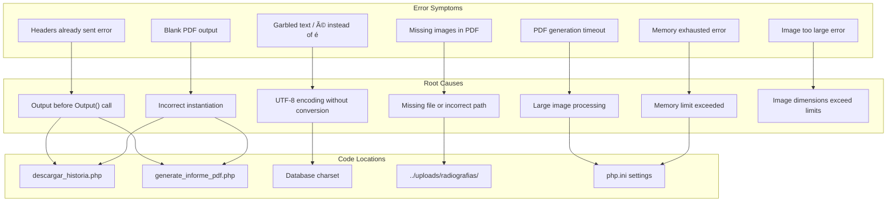
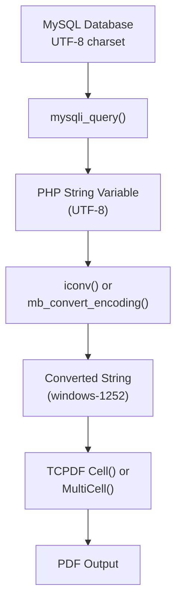
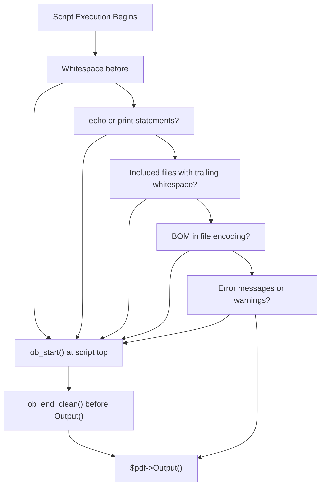
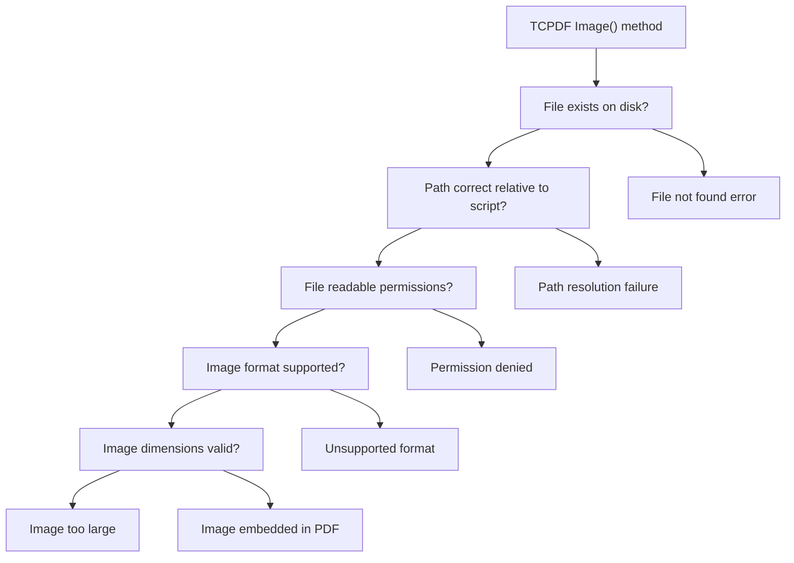
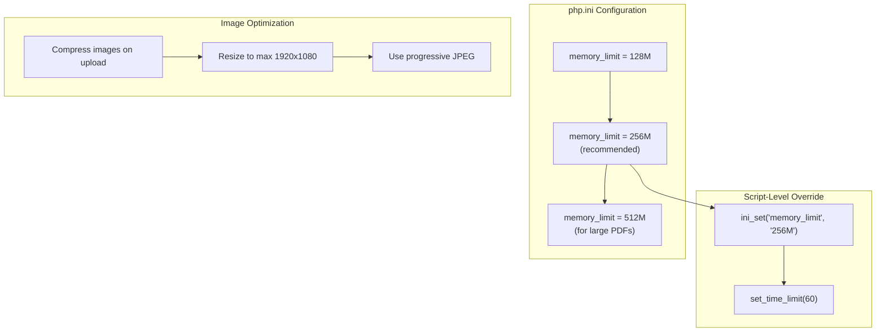
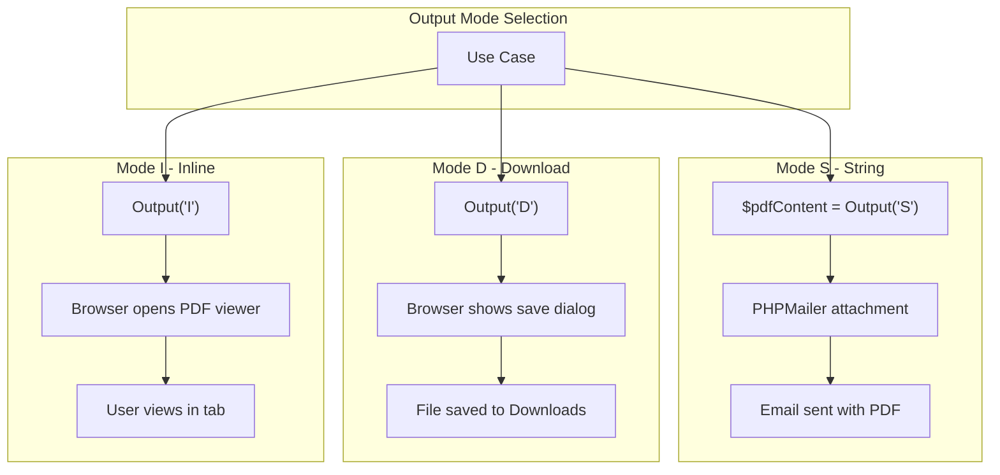
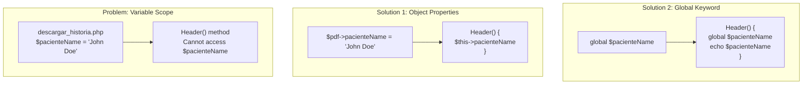
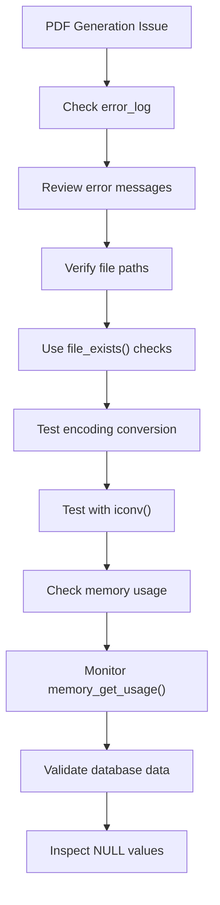

# TCPDF FAQ & Troubleshooting

> **Relevant source files**
> * [Reportes/fpdf/FAQ.htm](https://github.com/axchisan/Consultorio_Emily_Bernal/blob/589034b9/Reportes/fpdf/FAQ.htm)
> * [Reportes/fpdf/Nueva carpeta/FAQ.htm](https://github.com/axchisan/Consultorio_Emily_Bernal/blob/589034b9/Reportes/fpdf/Nueva carpeta/FAQ.htm)

This page documents common issues, solutions, and best practices when working with the TCPDF library in the Consultorio Emily Bernal system. It focuses on practical problems encountered during PDF generation in [descargar_historia.php](https://github.com/axchisan/Consultorio_Emily_Bernal/blob/589034b9/descargar_historia.php)

 and [generate_informe_pdf.php](https://github.com/axchisan/Consultorio_Emily_Bernal/blob/589034b9/generate_informe_pdf.php)

 including character encoding, image embedding, memory management, and output handling.

For detailed API documentation of TCPDF methods, see [TCPDF Core Methods](/axchisan/Consultorio_Emily_Bernal/9.1-tcpdf-core-methods). For font management specifics, see [TCPDF Font Management](/axchisan/Consultorio_Emily_Bernal/9.3-tcpdf-font-management). For header and footer customization, see [TCPDF Header & Footer Customization](/axchisan/Consultorio_Emily_Bernal/9.2-tcpdf-header-and-footer-customization).

---

## Common Issues Overview

The following diagram maps common error messages and symptoms to their underlying causes in the PDF generation pipeline:



**Sources:** [Reportes/fpdf/FAQ.htm](https://github.com/axchisan/Consultorio_Emily_Bernal/blob/589034b9/Reportes/fpdf/FAQ.htm)

 system architecture analysis

---

## Character Encoding Issues

### Problem: Accented Characters Display Incorrectly

Spanish text containing accented characters (á, é, í, ó, ú, ñ) appears as garbled characters like "é" instead of "é" in generated PDFs.

**Root Cause:** TCPDF's standard fonts use `windows-1252` encoding, but PHP strings are typically in `UTF-8`. When UTF-8 encoded strings are passed directly to TCPDF without conversion, character mapping fails.

**Solution:** Convert strings from UTF-8 to windows-1252 before passing to TCPDF methods:

| Conversion Method | PHP Function | Example |
| --- | --- | --- |
| Using iconv | `iconv()` | `$str = iconv('UTF-8', 'windows-1252', $str);` |
| Using mbstring | `mb_convert_encoding()` | `$str = mb_convert_encoding($str, 'windows-1252', 'UTF-8');` |

**Implementation in Codebase:**

Both [descargar_historia.php](https://github.com/axchisan/Consultorio_Emily_Bernal/blob/589034b9/descargar_historia.php)

 and [generate_informe_pdf.php](https://github.com/axchisan/Consultorio_Emily_Bernal/blob/589034b9/generate_informe_pdf.php)

 must convert all text retrieved from the database before rendering. This includes:

* Patient names and demographic data from `pacientes` table
* Diagnosis text from `citas` table
* Medical report fields from `informe_medico` table
* Doctor names from `doctor` table



**Sources:** [Reportes/fpdf/FAQ.htm L62-L72](https://github.com/axchisan/Consultorio_Emily_Bernal/blob/589034b9/Reportes/fpdf/FAQ.htm#L62-L72)

### Special Character Reference

| Character | windows-1252 Position | How to Use |
| --- | --- | --- |
| Euro (€) | 128 | `chr(128)` or `define('EURO', chr(128));` |
| Ñ | 209 | Converts correctly from UTF-8 |
| ñ | 241 | Converts correctly from UTF-8 |

**Sources:** [Reportes/fpdf/FAQ.htm L74-L81](https://github.com/axchisan/Consultorio_Emily_Bernal/blob/589034b9/Reportes/fpdf/FAQ.htm#L74-L81)

---

## Output Buffer Issues

### Problem: "Some data has already been output, can't send PDF file"

This error occurs when attempting to send PDF output after other content has been sent to the browser.

**Root Cause:** PHP requires HTTP headers to be sent before body content. TCPDF's `Output()` method with mode `'I'` (inline) or `'D'` (download) sends PDF-specific headers. If any output (HTML, whitespace, echo statements, or even BOM markers) precedes the `Output()` call, PHP has already sent default headers.

**Common Culprits in Codebase:**



**Solutions:**

1. **Remove all output before PDF generation** in [descargar_historia.php](https://github.com/axchisan/Consultorio_Emily_Bernal/blob/589034b9/descargar_historia.php)  and [generate_informe_pdf.php](https://github.com/axchisan/Consultorio_Emily_Bernal/blob/589034b9/generate_informe_pdf.php)
2. **Check included files** like [php/conexionDB.php](https://github.com/axchisan/Consultorio_Emily_Bernal/blob/589034b9/php/conexionDB.php)  for trailing whitespace
3. **Use output buffering as a safeguard:**

```
ob_start();
// ... TCPDF code ...
ob_end_clean();
$pdf->Output('document.pdf', 'I');
```

**Diagnostic Technique:**

When the error message includes "(output started at script.php:X)", it identifies the exact file and line number where output began. Inspect that location immediately.

**Sources:** [Reportes/fpdf/FAQ.htm L45-L59](https://github.com/axchisan/Consultorio_Emily_Bernal/blob/589034b9/Reportes/fpdf/FAQ.htm#L45-L59)

---

## Image Handling Issues

### Problem: Missing Images in PDF

Medical images (radiographs from `../uploads/radiografias/` or oral photos from `../uploads/fotos_boca/`) fail to appear in generated PDFs.

**Root Causes and Solutions:**



**Path Resolution in Codebase:**

Both PDF generators use relative paths to image files. The path must be relative to the script executing TCPDF:

| Script | Image Path Pattern | Example |
| --- | --- | --- |
| descargar_historia.php | `../uploads/radiografias/{filename}` | `../uploads/radiografias/123_radiografia_1234567890.jpg` |
| generate_informe_pdf.php | `../uploads/fotos_boca/{filename}` | `../uploads/fotos_boca/123_foto_1234567890.jpg` |

**Defensive Image Handling Pattern:**

```python
// Retrieve filename from informe_medico table
$radiografia = $row['radiografia']; // e.g., "123_radiografia_1234567890.jpg"

if (!empty($radiografia)) {
    $imagePath = '../uploads/radiografias/' . $radiografia;
    
    if (file_exists($imagePath) && is_readable($imagePath)) {
        // Get image dimensions
        list($width, $height) = getimagesize($imagePath);
        
        // Check if dimensions are reasonable
        if ($width > 0 && $height > 0 && $width < 10000 && $height < 10000) {
            $pdf->Image($imagePath, 10, $pdf->GetY(), 100);
        } else {
            // Log error or show placeholder
        }
    } else {
        // File missing - database reference is stale
    }
}
```

**Supported Image Formats:**

TCPDF supports: JPEG, PNG, GIF. The codebase primarily uses JPEG for medical images.

**Sources:** System architecture analysis, file storage patterns

---

## Memory and Performance Issues

### Problem: Memory Exhausted During PDF Generation

Large PDFs with multiple high-resolution medical images may exceed PHP's memory limit.

**Symptoms:**

* Fatal error: Allowed memory size of X bytes exhausted
* Script timeout (exceeds 30 seconds)
* Browser displays blank page

**Memory Consumption Factors:**

| Factor | Impact | Mitigation |
| --- | --- | --- |
| Image resolution | High-res images (>2MB) consume significant memory | Resize images before upload in [informe.php](https://github.com/axchisan/Consultorio_Emily_Bernal/blob/589034b9/informe.php) |
| Number of images | Each image in [informe_medico](https://github.com/axchisan/Consultorio_Emily_Bernal/blob/589034b9/informe_medico) <br>  adds to memory | Limit images per report |
| PDF page count | More pages = more memory | Paginate long clinical histories |
| Font embedding | Custom fonts increase size | Use standard fonts when possible |

**Configuration Solutions:**



**Script-Level Adjustments:**

Insert at the top of [descargar_historia.php](https://github.com/axchisan/Consultorio_Emily_Bernal/blob/589034b9/descargar_historia.php)

 and [generate_informe_pdf.php](https://github.com/axchisan/Consultorio_Emily_Bernal/blob/589034b9/generate_informe_pdf.php)

:

```
ini_set('memory_limit', '256M');  // Increase memory limit
set_time_limit(60);                // Allow 60 seconds execution
```

**Image Optimization Strategy:**

1. **At upload time** in [informe.php](https://github.com/axchisan/Consultorio_Emily_Bernal/blob/589034b9/informe.php) : Validate and resize images before saving
2. **At render time**: Scale images to appropriate dimensions in PDF (not full resolution)

**Sources:** [Reportes/fpdf/FAQ.htm L224-L236](https://github.com/axchisan/Consultorio_Emily_Bernal/blob/589034b9/Reportes/fpdf/FAQ.htm#L224-L236)

---

## PDF Output Modes

### Understanding Output() Method Modes

The `Output()` method's second parameter controls PDF delivery. The codebase uses different modes for different use cases:

| Mode | Behavior | Use Case in Codebase | Example Location |
| --- | --- | --- | --- |
| `'I'` | Inline display in browser | View PDF in new tab | [descargar_historia.php](https://github.com/axchisan/Consultorio_Emily_Bernal/blob/589034b9/descargar_historia.php) <br>  default |
| `'D'` | Force download with dialog | Download clinical history | User-triggered download |
| `'F'` | Save to file on server | Archive PDFs (not implemented) | N/A |
| `'S'` | Return as string | Email attachment | Email integration |



**Email Attachment Pattern:**

For sending PDFs via email (future enhancement):

```
$pdfContent = $pdf->Output('S');  // Return as string

$mail = new PHPMailer();
// ... configure mail settings ...
$mail->AddStringAttachment($pdfContent, 'historia_clinica.pdf', 'base64', 'application/pdf');
$mail->Send();
```

**Sources:** [Reportes/fpdf/FAQ.htm L211-L222](https://github.com/axchisan/Consultorio_Emily_Bernal/blob/589034b9/Reportes/fpdf/FAQ.htm#L211-L222)

---

## Header and Footer Issues

### Problem: Variables Not Displaying in Header/Footer

Custom `Header()` or `Footer()` methods fail to display dynamic content like patient names or page counts.

**Root Cause:** Variable scope. The `Header()` and `Footer()` methods are called automatically by TCPDF and do not have access to local variables from the main script.

**Solution Patterns:**



**Recommended Pattern (Object Properties):**

```javascript
// In descargar_historia.php
class PDF extends TCPDF {
    public $pacienteNombre;
    public $fechaReporte;
    
    public function Header() {
        $this->SetFont('Arial', 'B', 12);
        $this->Cell(0, 10, 'Paciente: ' . $this->pacienteNombre, 0, 1, 'C');
        $this->Cell(0, 10, 'Fecha: ' . $this->fechaReporte, 0, 1, 'C');
    }
}

$pdf = new PDF();
$pdf->pacienteNombre = $row['nombre'] . ' ' . $row['apellido'];
$pdf->fechaReporte = date('Y-m-d');
```

**Sources:** [Reportes/fpdf/FAQ.htm L83-L107](https://github.com/axchisan/Consultorio_Emily_Bernal/blob/589034b9/Reportes/fpdf/FAQ.htm#L83-L107)

### Problem: Header/Footer Not Appearing

Custom PDF class defines `Header()` and `Footer()` methods but they don't render.

**Root Cause:** Instantiating `TCPDF` instead of the custom class.

**Incorrect:**

```javascript
class PDF extends TCPDF {
    public function Header() { /* ... */ }
}

$pdf = new TCPDF();  // ❌ Wrong - instantiates base class
```

**Correct:**

```javascript
class PDF extends TCPDF {
    public function Header() { /* ... */ }
}

$pdf = new PDF();  // ✓ Correct - instantiates custom class
```

**Sources:** [Reportes/fpdf/FAQ.htm L109-L115](https://github.com/axchisan/Consultorio_Emily_Bernal/blob/589034b9/Reportes/fpdf/FAQ.htm#L109-L115)

---

## Line Breaks and Text Formatting

### Problem: Line Breaks Not Working in MultiCell

Attempting to use `\n` for line breaks in `MultiCell()` content, but text appears on a single line.

**Root Cause:** PHP string escaping. In single-quoted strings (`'...'`), `\n` is treated as literal characters, not a newline escape sequence.

**Incorrect:**

```
$pdf->MultiCell(0, 10, 'Line 1\nLine 2\nLine 3');  // ❌ Single quotes
// Output: "Line 1\nLine 2\nLine 3" (literal backslash-n)
```

**Correct:**

```
$pdf->MultiCell(0, 10, "Line 1\nLine 2\nLine 3");  // ✓ Double quotes
// Output: Line 1
//         Line 2
//         Line 3
```

**Application in Codebase:**

When rendering multi-line fields from [informe_medico](https://github.com/axchisan/Consultorio_Emily_Bernal/blob/589034b9/informe_medico)

 like `examen_intraoral`, `plan_tratamiento`, or `evolucion`:

```
$examen = $row['examen_intraoral'];
$examen = str_replace('\r\n', "\n", $examen);  // Normalize line breaks
$examen = iconv('UTF-8', 'windows-1252', $examen);  // Encoding conversion

$pdf->MultiCell(0, 6, $examen, 0, 'L');  // Renders with line breaks
```

**Sources:** [Reportes/fpdf/FAQ.htm L117-L120](https://github.com/axchisan/Consultorio_Emily_Bernal/blob/589034b9/Reportes/fpdf/FAQ.htm#L117-L120)

---

## AJAX and PDF Generation

### Problem: PDF Not Displaying When Generated via AJAX

jQuery or Fetch API request to PDF generation script results in binary data in response but PDF does not display.

**Root Cause:** AJAX requests return the PDF as binary data in the JavaScript response. Browsers cannot directly render binary data from AJAX responses as PDFs.

**Incorrect Pattern:**

```yaml
// ❌ Does not work
$.ajax({
    url: 'descargar_historia.php?id=123',
    success: function(data) {
        // data contains binary PDF, but browser cannot render it
    }
});
```

**Correct Patterns:**

| Approach | Implementation | Use Case |
| --- | --- | --- |
| Direct link | `<a href="descargar_historia.php?id=123">Download</a>` | Simple download |
| New window | `window.open('descargar_historia.php?id=123')` | View inline |
| Blob conversion | Fetch → Blob → URL.createObjectURL() | Advanced client-side handling |

**Recommended Pattern for Codebase:**

```javascript
// Generate PDF in new tab/window
function downloadPDF(idPaciente, idCita) {
    const url = `descargar_historia.php?id_paciente=${idPaciente}&id_cita=${idCita}`;
    window.open(url, '_blank');
}
```

This approach is used in [historia_clinica.php](https://github.com/axchisan/Consultorio_Emily_Bernal/blob/589034b9/historia_clinica.php)

 and [ver_historia.php](https://github.com/axchisan/Consultorio_Emily_Bernal/blob/589034b9/ver_historia.php)

 for PDF download links.

**Sources:** [Reportes/fpdf/FAQ.htm L122-L125](https://github.com/axchisan/Consultorio_Emily_Bernal/blob/589034b9/Reportes/fpdf/FAQ.htm#L122-L125)

---

## Database Integration Issues

### Problem: Null Values Breaking PDF Generation

Database queries may return NULL values for optional fields in [informe_medico](https://github.com/axchisan/Consultorio_Emily_Bernal/blob/589034b9/informe_medico)

 table, causing errors when passed to TCPDF methods.

**Defensive Pattern:**

```
$examen_intraoral = $row['examen_intraoral'] ?? 'Sin información registrada';
$examen_extraoral = $row['examen_extraoral'] ?? 'Sin información registrada';
$diagnostico = $row['diagnostico'] ?? 'Sin diagnóstico';

// Convert only non-empty strings
if (!empty($examen_intraoral)) {
    $examen_intraoral = iconv('UTF-8', 'windows-1252', $examen_intraoral);
}
```

### Problem: Large TEXT Fields Causing Overflow

Medical report fields like `plan_tratamiento` or `evolucion` may contain extensive text that overflows page boundaries.

**Solution: Auto Page Break**

```
$pdf->SetAutoPageBreak(true, 15);  // Enable with 15mm bottom margin

// MultiCell automatically breaks to new page when needed
$pdf->MultiCell(0, 6, $plan_tratamiento, 0, 'L');
```

**Sources:** System implementation analysis

---

## Debugging Techniques

### Error Visibility Configuration

Enable full error reporting during development:

```
error_reporting(E_ALL);
ini_set('display_errors', 1);

// At top of descargar_historia.php and generate_informe_pdf.php during debugging
```

### TCPDF Debug Mode

```
$pdf = new TCPDF(PDF_PAGE_ORIENTATION, PDF_UNIT, PDF_PAGE_FORMAT, true, 'UTF-8', false);

// Enable debugging
$pdf->setDebugMode(true);
```

### Common Diagnostic Checks



**Diagnostic Script Template:**

```php
// Test character encoding
$test = "Diagnóstico médico: atención especial";
echo "Original: " . $test . "\n";
echo "Converted: " . iconv('UTF-8', 'windows-1252', $test) . "\n";

// Test image path
$imagePath = '../uploads/radiografias/test.jpg';
echo "File exists: " . (file_exists($imagePath) ? 'Yes' : 'No') . "\n";
echo "Is readable: " . (is_readable($imagePath) ? 'Yes' : 'No') . "\n";

// Check memory
echo "Memory usage: " . memory_get_usage(true) / 1024 / 1024 . " MB\n";
```

**Sources:** System implementation analysis

---

## Best Practices Checklist

| Practice | Implementation | Benefit |
| --- | --- | --- |
| ✓ Convert encoding | Use `iconv()` or `mb_convert_encoding()` for all text | Prevents garbled characters |
| ✓ Validate image paths | Check `file_exists()` before `Image()` | Prevents missing image errors |
| ✓ Handle NULL values | Use null coalescing `??` operator | Prevents undefined variable errors |
| ✓ Set auto page break | `SetAutoPageBreak(true, margin)` | Prevents content overflow |
| ✓ Use object properties | Store dynamic data as class properties | Enables Header/Footer access |
| ✓ Increase memory limit | Set appropriate `memory_limit` | Handles large PDFs |
| ✓ Clear output buffer | `ob_end_clean()` before `Output()` | Prevents headers already sent |
| ✓ Use double quotes | For strings with escape sequences like `\n` | Enables proper line breaks |
| ✓ Avoid AJAX for PDFs | Use direct links or `window.open()` | Ensures proper PDF display |
| ✓ Test with sample data | Create test PDFs with various data scenarios | Catches edge cases early |

**Sources:** System implementation analysis, [Reportes/fpdf/FAQ.htm](https://github.com/axchisan/Consultorio_Emily_Bernal/blob/589034b9/Reportes/fpdf/FAQ.htm)

---

## Quick Reference: Error Messages

| Error Message | Common Cause | Solution |
| --- | --- | --- |
| "Some data has already been output" | Output before `Output()` call | Check for whitespace, use `ob_end_clean()` |
| "FPDF error: Incorrect PNG file" | Corrupted or unsupported PNG | Verify image file integrity |
| "FPDF error: Missing or incorrect image file" | Wrong path or missing file | Verify path relative to script |
| "Allowed memory size exhausted" | Large images or many pages | Increase `memory_limit` |
| "Maximum execution time exceeded" | Complex PDF generation | Increase `set_time_limit()` |
| Characters display as "é" | UTF-8 not converted | Convert to windows-1252 |
| Line breaks show as "\n" | Single quotes used | Use double quotes |
| Header/Footer not showing | Wrong class instantiated | Instantiate custom PDF class, not TCPDF |

**Sources:** [Reportes/fpdf/FAQ.htm](https://github.com/axchisan/Consultorio_Emily_Bernal/blob/589034b9/Reportes/fpdf/FAQ.htm)

 system implementation analysis