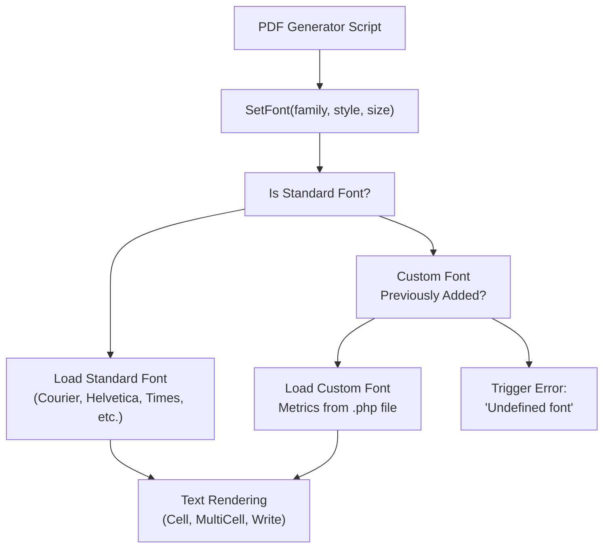
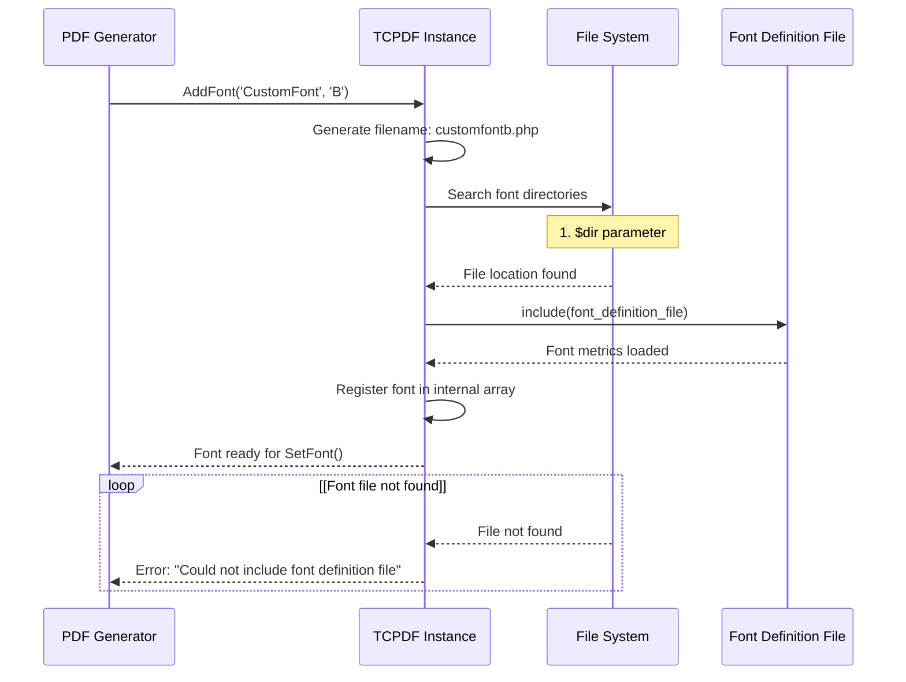
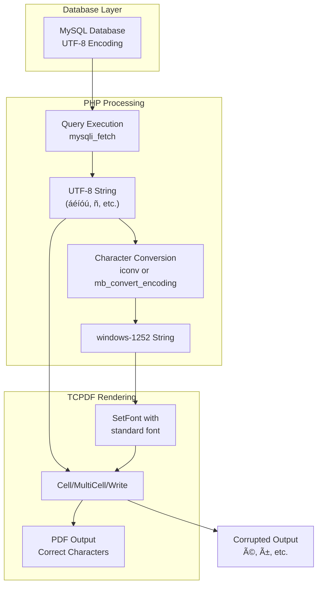
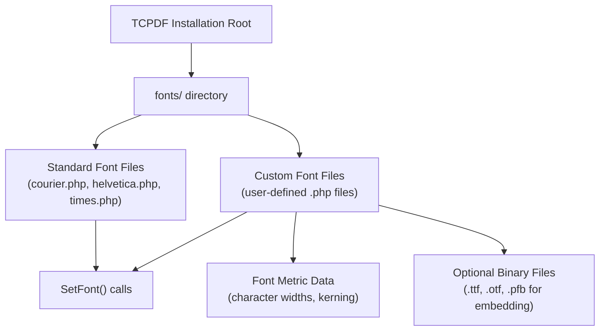
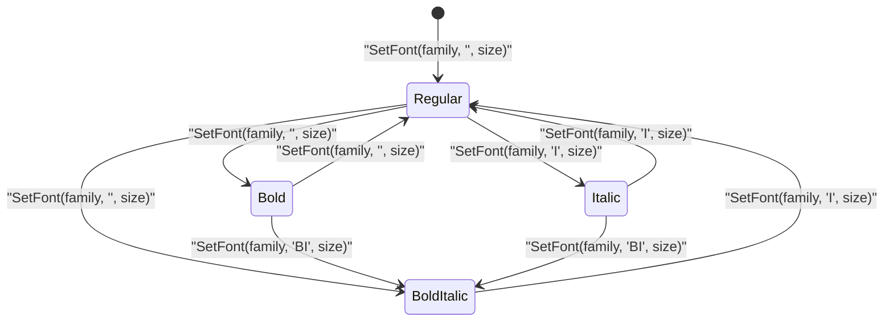
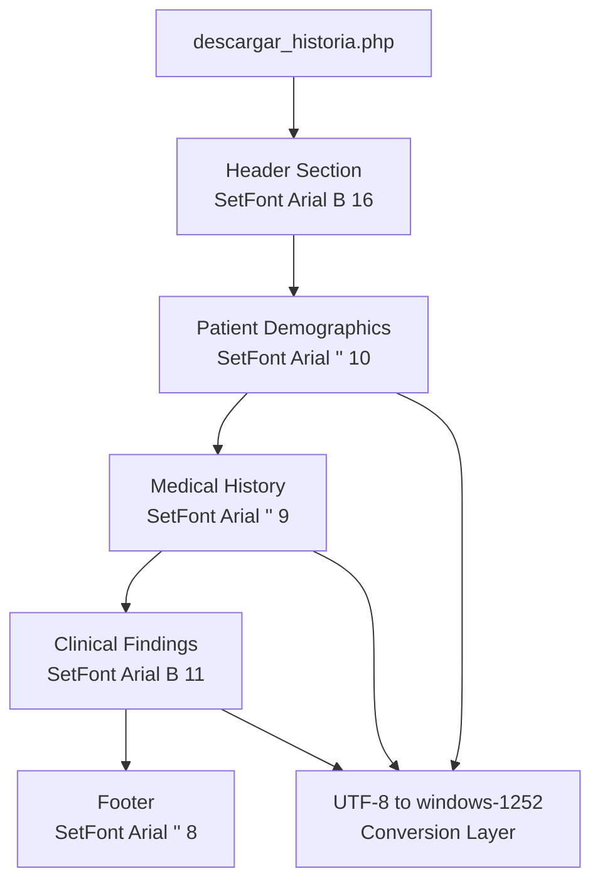

# TCPDF Font Management

> **Relevant source files**
> * [Reportes/fpdf/FAQ.htm](https://github.com/axchisan/Consultorio_Emily_Bernal/blob/589034b9/Reportes/fpdf/FAQ.htm)
> * [Reportes/fpdf/Nueva carpeta/FAQ.htm](https://github.com/axchisan/Consultorio_Emily_Bernal/blob/589034b9/Reportes/fpdf/Nueva carpeta/FAQ.htm)
> * [Reportes/fpdf/Nueva carpeta/doc/addfont.htm](https://github.com/axchisan/Consultorio_Emily_Bernal/blob/589034b9/Reportes/fpdf/Nueva carpeta/doc/addfont.htm)

## Purpose and Scope

This page documents font handling within the TCPDF library as used in the Consultorio Emily Bernal system. It covers font selection, custom font integration, character encoding requirements, and font file management. For general TCPDF API documentation, see [TCPDF Core Methods](/axchisan/Consultorio_Emily_Bernal/9.1-tcpdf-core-methods). For output and rendering details, see [TCPDF FAQ & Troubleshooting](/axchisan/Consultorio_Emily_Bernal/9.7-tcpdf-faq-and-troubleshooting).

## Font System Overview

TCPDF employs a two-tier font system that supports both standard built-in fonts and custom TrueType/OpenType fonts. The font management system is responsible for:

* Loading and caching font metrics
* Handling character encoding conversions
* Managing font file locations
* Supporting multiple font styles (regular, bold, italic, bold-italic)
* Enabling Unicode character rendering through proper encoding

The system is used extensively in [Reportes/descargar_historia.php](https://github.com/axchisan/Consultorio_Emily_Bernal/blob/589034b9/Reportes/descargar_historia.php)

 and [Reportes/generate_informe_pdf.php](https://github.com/axchisan/Consultorio_Emily_Bernal/blob/589034b9/Reportes/generate_informe_pdf.php)

 for generating clinical history and medical report PDFs with properly formatted text content.

**Sources:** High-level architecture Diagram 5, Table of Contents sections 3.1-3.3

## Font Selection Architecture



**Sources:** [Reportes/fpdf/Nueva L1-L66](https://github.com/axchisan/Consultorio_Emily_Bernal/blob/589034b9/Reportes/fpdf/Nueva carpeta/doc/addfont.htm#L1-L66)

 High-level Diagram 5

## SetFont Method

The `SetFont` method is the primary API for selecting fonts during PDF generation. This method must be called before any text output operation.

### Method Signature

```
SetFont(string $family, string $style = '', float $size = 0)
```

### Parameters

| Parameter | Type | Description | Default |
| --- | --- | --- | --- |
| `family` | string | Font family name ('Arial', 'Times', 'Courier', or custom) | Required |
| `style` | string | Style modifier: '' (regular), 'B' (bold), 'I' (italic), 'BI' (bold-italic) | '' |
| `size` | float | Font size in points | 0 (keeps current size) |

### Usage Patterns in PDF Generators

The PDF generator scripts follow a consistent pattern of setting fonts before content sections:

1. **Header sections:** Larger bold fonts (12-16pt)
2. **Section labels:** Bold fonts at standard size (10-11pt)
3. **Content text:** Regular fonts (9-10pt)
4. **Footer information:** Smaller fonts (8-9pt)

**Example from typical usage:**

```
$pdf->SetFont('Arial', 'B', 14);  // Bold header
$pdf->Cell(0, 10, 'HISTORIA CLÍNICA', 0, 1, 'C');

$pdf->SetFont('Arial', '', 10);   // Regular body text
$pdf->MultiCell(0, 5, $patient_info);
```

**Sources:** [Reportes/fpdf/FAQ.htm L85-L106](https://github.com/axchisan/Consultorio_Emily_Bernal/blob/589034b9/Reportes/fpdf/FAQ.htm#L85-L106)

 Table of Contents section 3.3

## AddFont Method for Custom Fonts

The `AddFont` method imports custom TrueType, OpenType, or Type1 fonts into TCPDF. Custom fonts must be converted to TCPDF format using the MakeFont utility before use.

### Method Signature

```
AddFont(string $family, string $style = '', string $file = '', string $dir = '')
```

### Parameters

| Parameter | Type | Description |
| --- | --- | --- |
| `family` | string | Font family name (arbitrary, user-defined) |
| `style` | string | Style: '' (regular), 'B', 'I', 'BI' |
| `file` | string | Font definition filename (defaults to family+style.php) |
| `dir` | string | Directory path (optional, uses default font directory if not specified) |

### Font Loading Sequence



**Sources:** [Reportes/fpdf/Nueva L10-L60](https://github.com/axchisan/Consultorio_Emily_Bernal/blob/589034b9/Reportes/fpdf/Nueva carpeta/doc/addfont.htm#L10-L60)

## Character Encoding Management

TCPDF's standard fonts use the **windows-1252** (Western European) character encoding by default. When working with UTF-8 encoded data from the database, explicit conversion is required to prevent character corruption.

### Encoding Conversion Requirements



### Conversion Implementation

Two standard PHP functions handle encoding conversion:

**Using iconv:**

```
$str = iconv('UTF-8', 'windows-1252', $str);
```

**Using mbstring:**

```
$str = mb_convert_encoding($str, 'windows-1252', 'UTF-8');
```

### Common Character Encoding Issues

| Symptom | Cause | Solution |
| --- | --- | --- |
| `é` appears as `é` | UTF-8 data passed to windows-1252 font | Convert with `iconv()` or `mb_convert_encoding()` |
| Spanish ñ corrupted | Missing conversion | Apply encoding conversion before `SetFont()` |
| Accented characters display as `?` | Character not in windows-1252 | Use Unicode-compatible custom font |

**Sources:** [Reportes/fpdf/FAQ.htm L61-L72](https://github.com/axchisan/Consultorio_Emily_Bernal/blob/589034b9/Reportes/fpdf/FAQ.htm#L61-L72)

 [Reportes/fpdf/Nueva L61-L72](https://github.com/axchisan/Consultorio_Emily_Bernal/blob/589034b9/Reportes/fpdf/Nueva carpeta/FAQ.htm#L61-L72)

## Font File Structure and Management

### Font Directory Structure

TCPDF searches for font files in the following order:

1. **Explicit directory** specified in `AddFont()` `$dir` parameter
2. **FPDF_FONTPATH constant** (if defined in configuration)
3. **Default fonts directory** (relative to TCPDF installation)



### Font Definition File Format

Custom font definition files (`.php` files generated by MakeFont utility) contain:

* **Font name and family**
* **Character width metrics** for each glyph
* **Font bounding box** dimensions
* **Kerning pairs** (if applicable)
* **Encoding map** (character code to glyph index)
* **Optional embedded font data** (for font embedding)

**Sources:** [Reportes/fpdf/Nueva L16-L21](https://github.com/axchisan/Consultorio_Emily_Bernal/blob/589034b9/Reportes/fpdf/Nueva carpeta/doc/addfont.htm#L16-L21)

## Standard Font Support

TCPDF includes built-in support for 14 standard PDF fonts that do not require `AddFont()` or external files.

### Available Standard Fonts

| Font Family | Regular | Bold | Italic | Bold-Italic |
| --- | --- | --- | --- | --- |
| Courier | ✓ | ✓ | ✓ | ✓ |
| Helvetica | ✓ | ✓ | ✓ | ✓ |
| Times | ✓ | ✓ | ✓ | ✓ |
| Symbol | ✓ | - | - | - |
| ZapfDingbats | ✓ | - | - | - |

### Font Aliases

TCPDF provides case-insensitive aliases for convenience:

* **Arial** → Helvetica
* **Times New Roman** → Times
* **Courier New** → Courier

These standard fonts are immediately available after TCPDF initialization without calling `AddFont()`.

**Sources:** [Reportes/fpdf/FAQ.htm L74-L81](https://github.com/axchisan/Consultorio_Emily_Bernal/blob/589034b9/Reportes/fpdf/FAQ.htm#L74-L81)

 (Euro character reference)

## Special Character Handling

### Euro Symbol Support

The Euro (€) character is available in standard fonts at character code 128:

```
define('EURO', chr(128));
$pdf->Cell(40, 10, 'Price: ' . EURO . '50.00');
```

### Symbol Fonts

For mathematical symbols, Greek letters, or special glyphs, use the Symbol or ZapfDingbats fonts:

```
$pdf->SetFont('Symbol', '', 12);
$pdf->Write(5, 'Greek: α β γ δ');  // Requires proper character codes
```

**Sources:** [Reportes/fpdf/FAQ.htm L74-L81](https://github.com/axchisan/Consultorio_Emily_Bernal/blob/589034b9/Reportes/fpdf/FAQ.htm#L74-L81)

 [Reportes/fpdf/Nueva L74-L81](https://github.com/axchisan/Consultorio_Emily_Bernal/blob/589034b9/Reportes/fpdf/Nueva carpeta/FAQ.htm#L74-L81)

## Font Style Management

### Style Combinations

Font styles are specified as single-character codes in the `SetFont()` `$style` parameter:

| Code | Style | Usage |
| --- | --- | --- |
| `''` | Regular | Body text, standard content |
| `'B'` | Bold | Headers, emphasis, labels |
| `'I'` | Italic | Citations, notes, foreign terms |
| `'BI'` or `'IB'` | Bold-Italic | Strong emphasis |

### Style Switching Pattern



Styles are case-insensitive: `'B'`, `'b'`, `'Bold'` are equivalent.

**Sources:** [Reportes/fpdf/Nueva L29-L38](https://github.com/axchisan/Consultorio_Emily_Bernal/blob/589034b9/Reportes/fpdf/Nueva carpeta/doc/addfont.htm#L29-L38)

## Font Size Management

### Size Units

Font sizes in TCPDF are specified in **points** (1 point = 1/72 inch). Common sizes used in medical document generation:

| Purpose | Typical Size Range |
| --- | --- |
| Main headers | 14-18pt |
| Section headers | 12-14pt |
| Body text | 9-11pt |
| Footnotes/captions | 8-9pt |
| Fine print | 7-8pt |

### Size Persistence

The `SetFont()` method with `$size = 0` maintains the current font size:

```
$pdf->SetFont('Arial', '', 10);   // Set size to 10pt
$pdf->SetFont('Arial', 'B', 0);   // Switch to bold, keep 10pt
$pdf->SetFont('Arial', '', 0);    // Back to regular, still 10pt
```

**Sources:** General TCPDF documentation patterns

## Integration with PDF Generators

### Clinical History PDF Generator

The clinical history generator uses fonts to structure medical documentation:



### Medical Report PDF Generator

Similar font structure is applied in medical reports with specialized sections for examinations and treatment plans.

**Sources:** High-level Diagram 5, Table of Contents sections 3.1-3.2

## Common Font Issues and Solutions

### Issue: Undefined Font Error

**Symptom:** `Error: Undefined font: CustomFont`

**Cause:** Font not added with `AddFont()` before `SetFont()` call

**Solution:**

```
// Must call AddFont before SetFont
$pdf->AddFont('CustomFont', '', 'customfont.php');
$pdf->SetFont('CustomFont', '', 12);
```

### Issue: Font File Not Found

**Symptom:** `Error: Could not include font definition file`

**Cause:** Font file missing from search directories

**Solution:**

1. Verify font file exists in fonts directory
2. Check filename matches expected pattern (lowercase family+style.php)
3. Specify explicit directory in `AddFont()`: ``` $pdf->AddFont('Custom', '', 'custom.php', '/full/path/to/fonts/'); ```

### Issue: Character Corruption in Spanish Text

**Symptom:** Spanish characters display as `ñ`, `é`, etc.

**Cause:** UTF-8 data not converted to windows-1252

**Solution:**

```
$diagnostico = iconv('UTF-8', 'windows-1252', $row['diagnostico']);
$pdf->MultiCell(0, 5, $diagnostico);
```

### Issue: Missing Glyphs

**Symptom:** Special characters appear as empty boxes or question marks

**Cause:** Character not available in windows-1252 encoding

**Solution:**

1. Use Unicode-compatible custom font with `AddFont()`
2. Or replace character with available alternative
3. Or use HTML entities conversion if supported

**Sources:** [Reportes/fpdf/FAQ.htm L61-L72](https://github.com/axchisan/Consultorio_Emily_Bernal/blob/589034b9/Reportes/fpdf/FAQ.htm#L61-L72)

 [Reportes/fpdf/Nueva L22](https://github.com/axchisan/Consultorio_Emily_Bernal/blob/589034b9/Reportes/fpdf/Nueva carpeta/doc/addfont.htm#L22-L22)

## Best Practices

### Encoding Conversion Strategy

Always convert database strings before PDF generation:

```javascript
// Convert all UTF-8 strings from database
foreach ($patient_data as $key => $value) {
    if (is_string($value)) {
        $patient_data[$key] = iconv('UTF-8', 'windows-1252', $value);
    }
}
```

### Font Loading Optimization

Load custom fonts once during initialization:

```
// In PDF generator constructor or initialization
$this->AddFont('CustomFont', '');
$this->AddFont('CustomFont', 'B');
$this->AddFont('CustomFont', 'I');
// Then use throughout document without reloading
```

### Style Consistency

Define font constants for consistent styling:

```
define('FONT_HEADER', ['Arial', 'B', 14]);
define('FONT_BODY', ['Arial', '', 10]);
define('FONT_CAPTION', ['Arial', 'I', 9]);

// Usage
$pdf->SetFont(...FONT_HEADER);
```

**Sources:** General TCPDF best practices, [Reportes/fpdf/FAQ.htm L85-L106](https://github.com/axchisan/Consultorio_Emily_Bernal/blob/589034b9/Reportes/fpdf/FAQ.htm#L85-L106)

---

This documentation provides comprehensive coverage of TCPDF font management as implemented in the Consultorio Emily Bernal PDF generation system. For related information on PDF output methods, see [TCPDF Core Methods](/axchisan/Consultorio_Emily_Bernal/9.1-tcpdf-core-methods). For troubleshooting other PDF issues, consult [TCPDF FAQ & Troubleshooting](/axchisan/Consultorio_Emily_Bernal/9.7-tcpdf-faq-and-troubleshooting).