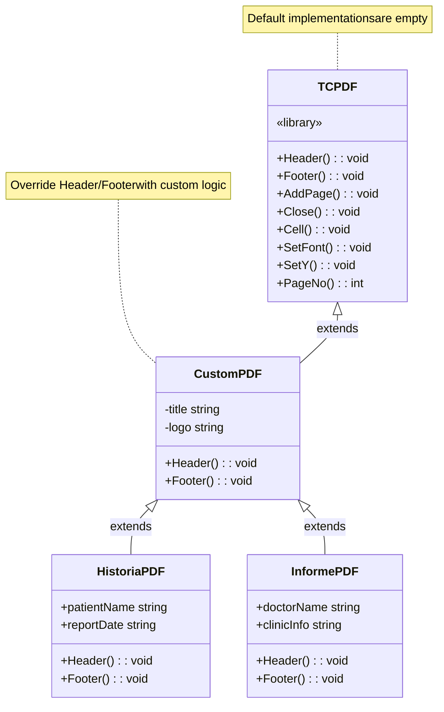
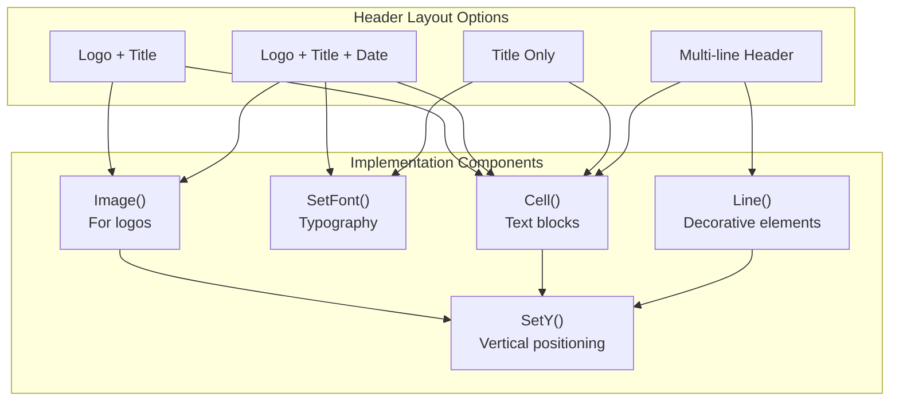
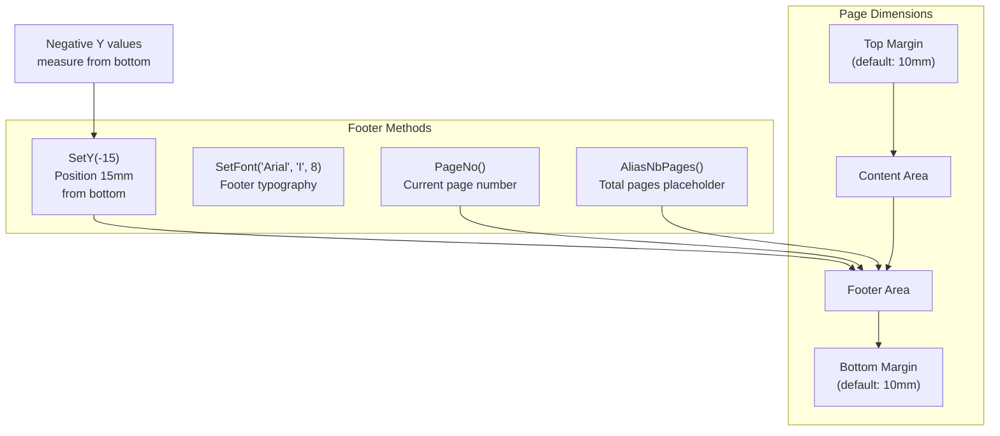
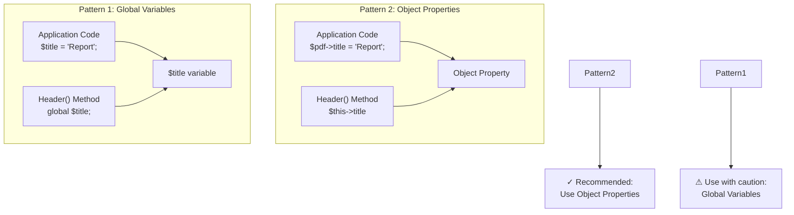
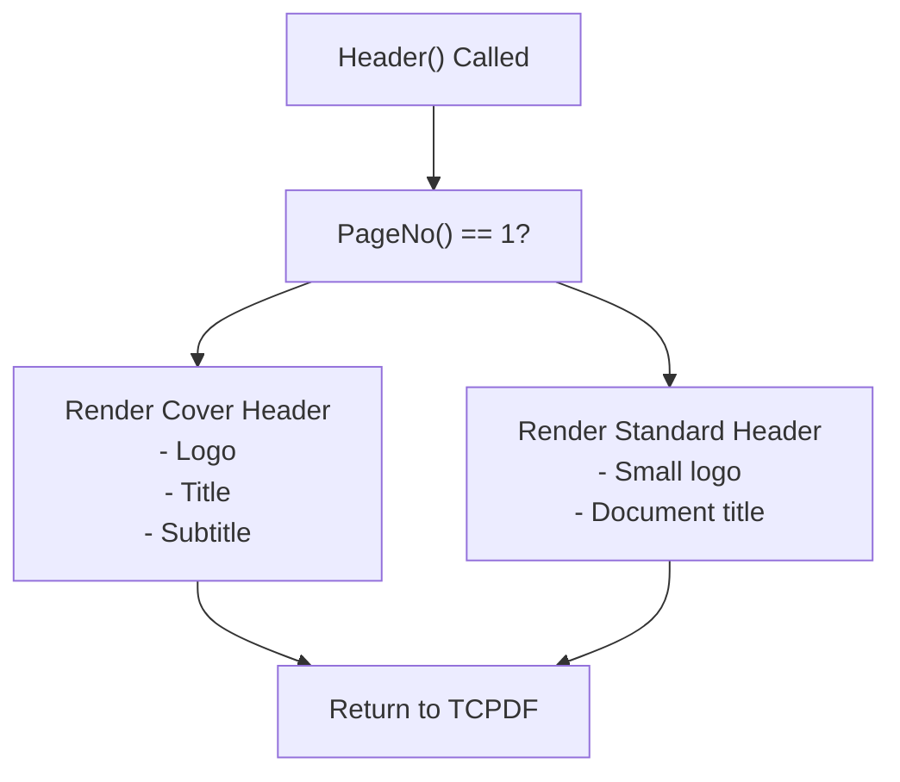
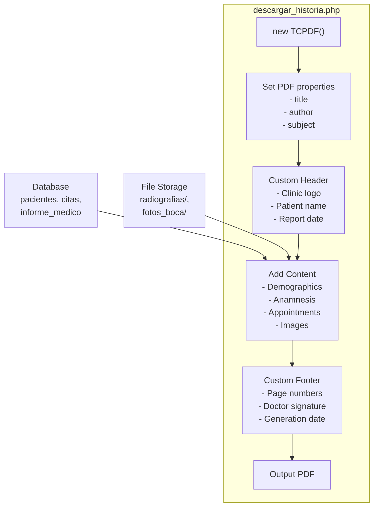
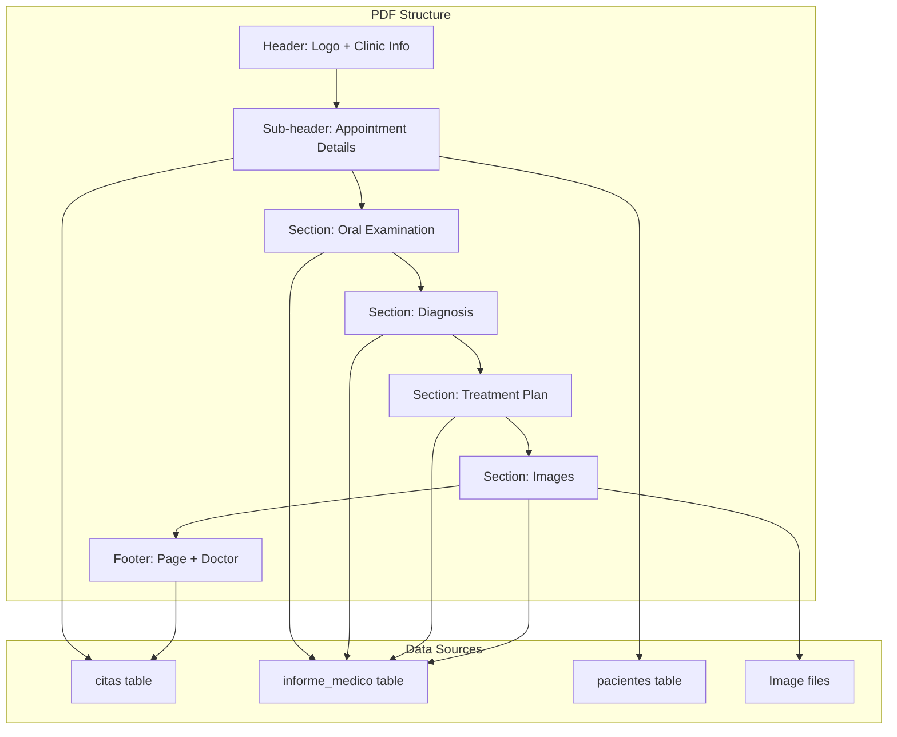
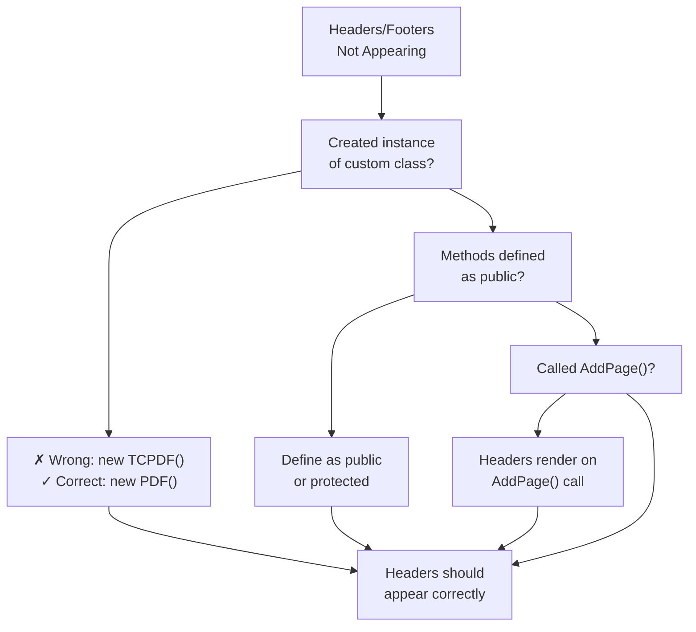

# TCPDF Header & Footer Customization

> **Relevant source files**
> * [Reportes/fpdf/FAQ.htm](https://github.com/axchisan/Consultorio_Emily_Bernal/blob/589034b9/Reportes/fpdf/FAQ.htm)
> * [Reportes/fpdf/Nueva carpeta/doc/acceptpagebreak.htm](https://github.com/axchisan/Consultorio_Emily_Bernal/blob/589034b9/Reportes/fpdf/Nueva carpeta/doc/acceptpagebreak.htm)
> * [Reportes/fpdf/Nueva carpeta/doc/footer.htm](https://github.com/axchisan/Consultorio_Emily_Bernal/blob/589034b9/Reportes/fpdf/Nueva carpeta/doc/footer.htm)

## Purpose and Scope

This document explains how to customize page headers and footers in TCPDF by overriding the `Header()` and `Footer()` methods. These methods are automatically invoked by TCPDF during PDF generation and provide consistent branding, page numbers, and document metadata across all pages.

For core TCPDF methods including `AddPage()` and `Output()`, see [TCPDF Core Methods](/axchisan/Consultorio_Emily_Bernal/9.1-tcpdf-core-methods). For font configuration used within headers/footers, see [TCPDF Font Management](/axchisan/Consultorio_Emily_Bernal/9.3-tcpdf-font-management). For page positioning methods like `SetY()` and `GetY()`, see [TCPDF Positioning & Dimensions](/axchisan/Consultorio_Emily_Bernal/9.5-tcpdf-positioning-and-dimensions).

---

## Header and Footer Method Overview

TCPDF provides two empty methods designed for customization through inheritance:

| Method | Invoked By | Timing | Purpose |
| --- | --- | --- | --- |
| `Header()` | `AddPage()` | After page creation, before content | Page headers, logos, titles |
| `Footer()` | `AddPage()`, `Close()` | After content, before page finalization | Page numbers, footers, disclaimers |

Both methods have **void return types** and **no parameters**. The default implementation in TCPDF is empty, requiring subclass overrides for custom behavior.

**Sources:** [Reportes/fpdf/Nueva L9-L14](https://github.com/axchisan/Consultorio_Emily_Bernal/blob/589034b9/Reportes/fpdf/Nueva carpeta/doc/footer.htm#L9-L14)

---

## Automatic Invocation Sequence

The following diagram illustrates when `Header()` and `Footer()` are automatically called during PDF generation:

```mermaid
sequenceDiagram
  participant Application Code
  participant TCPDF Instance
  participant Header() Method
  participant Footer() Method
  participant PDF Page Buffer

  Application Code->>TCPDF Instance: new TCPDF()
  Application Code->>TCPDF Instance: AddPage()
  TCPDF Instance->>Header() Method: Header()
  note over Header() Method: Renders header content
  Header() Method->>PDF Page Buffer: Cell, Image, etc.
  TCPDF Instance->>PDF Page Buffer: Ready for content
  Application Code->>TCPDF Instance: Cell, MultiCell, Write...
  note over Application Code,TCPDF Instance: Application adds
  loop [Auto Page Break Triggered]
    TCPDF Instance->>Footer() Method: Footer()
    note over Footer() Method: Renders footer on
    Footer() Method->>PDF Page Buffer: Page number, etc.
    TCPDF Instance->>TCPDF Instance: AddPage() (internal)
    TCPDF Instance->>Header() Method: Header()
    note over Header() Method: Header on new page
  end
  Application Code->>TCPDF Instance: Close()
  TCPDF Instance->>Footer() Method: Footer()
  note over Footer() Method: Final footer on
  Footer() Method->>PDF Page Buffer: Complete footer
  TCPDF Instance->>Application Code: Return completed PDF
```

**Key points:**

* `Header()` executes **after** a new page is created but **before** any content
* `Footer()` executes when `AddPage()` is called for the **next** page and during `Close()`
* Automatic page breaks trigger both `Footer()` on the current page and `Header()` on the new page

**Sources:** [Reportes/fpdf/Nueva L12-L14](https://github.com/axchisan/Consultorio_Emily_Bernal/blob/589034b9/Reportes/fpdf/Nueva carpeta/doc/footer.htm#L12-L14)

---

## Implementation Pattern: Class Extension

Headers and footers are customized by extending the TCPDF class and overriding the methods:



**Basic implementation structure:**

```javascript
class PDF extends TCPDF {
    function Header() {
        // Custom header logic
        $this->SetFont('Arial', 'B', 15);
        $this->Cell(0, 10, 'Document Title', 0, 1, 'C');
    }
    
    function Footer() {
        // Custom footer logic
        $this->SetY(-15);
        $this->SetFont('Arial', 'I', 8);
        $this->Cell(0, 10, 'Page '.$this->PageNo(), 0, 0, 'C');
    }
}

$pdf = new PDF();
$pdf->AddPage();
// Headers and footers automatically render
```

**Sources:** [Reportes/fpdf/FAQ.htm L110-L115](https://github.com/axchisan/Consultorio_Emily_Bernal/blob/589034b9/Reportes/fpdf/FAQ.htm#L110-L115)

 [Reportes/fpdf/Nueva L15-L28](https://github.com/axchisan/Consultorio_Emily_Bernal/blob/589034b9/Reportes/fpdf/Nueva carpeta/doc/footer.htm#L15-L28)

---

## Header Method Details

### Method Signature and Usage

```javascript
function Header() {
    // No parameters, no return value
    // Use $this-> to access TCPDF methods
}
```

### Common Header Patterns

The following diagram shows typical header configurations used in the system:



### Header Example: Logo and Title

```javascript
function Header() {
    // Logo (assuming logo.png in images directory)
    $this->Image('images/logo.png', 10, 8, 30);
    
    // Set font for title
    $this->SetFont('Arial', 'B', 15);
    
    // Move to the right
    $this->Cell(80);
    
    // Title
    $this->Cell(30, 10, 'Clinical History Report', 0, 0, 'C');
    
    // Line break
    $this->Ln(20);
}
```

**Sources:** [Reportes/fpdf/FAQ.htm L87-L96](https://github.com/axchisan/Consultorio_Emily_Bernal/blob/589034b9/Reportes/fpdf/FAQ.htm#L87-L96)

---

## Footer Method Details

### Method Signature and Positioning

```javascript
function Footer() {
    // Position at 15mm from bottom
    $this->SetY(-15);
    
    // Set font
    $this->SetFont('Arial', 'I', 8);
    
    // Page number
    $this->Cell(0, 10, 'Page '.$this->PageNo(), 0, 0, 'C');
}
```

### Footer Positioning Mechanics



### Footer Example: Page Numbers with Total

```javascript
function Footer() {
    // Position footer 1.5 cm from bottom
    $this->SetY(-15);
    
    // Arial italic 8
    $this->SetFont('Arial', 'I', 8);
    
    // Page number format: "Page X of Y"
    $this->Cell(0, 10, 'Page '.$this->PageNo().'/{nb}', 0, 0, 'C');
}

// In application code:
$pdf = new PDF();
$pdf->AliasNbPages(); // Replace {nb} with total page count
$pdf->AddPage();
```

**Sources:** [Reportes/fpdf/Nueva L16-L28](https://github.com/axchisan/Consultorio_Emily_Bernal/blob/589034b9/Reportes/fpdf/Nueva carpeta/doc/footer.htm#L16-L28)

---

## Variable Access Patterns

### Problem: Scope Isolation

Methods `Header()` and `Footer()` execute in object scope but need access to external data (patient names, report dates, etc.). Two patterns solve this:



### Pattern 1: Global Variables

```javascript
// Define global variable
$title = 'Medical History Report';

class PDF extends TCPDF {
    function Header() {
        // Access global variable with 'global' keyword
        global $title;
        
        $this->SetFont('Arial', 'B', 15);
        $this->Cell(0, 10, $title, 1, 1, 'C');
    }
}

$pdf = new PDF();
```

**Limitations:**

* Pollutes global namespace
* Harder to test
* Coupling between application and PDF class

**Sources:** [Reportes/fpdf/FAQ.htm L83-L96](https://github.com/axchisan/Consultorio_Emily_Bernal/blob/589034b9/Reportes/fpdf/FAQ.htm#L83-L96)

### Pattern 2: Object Properties (Recommended)

```javascript
class PDF extends TCPDF {
    public $title;
    public $patientName;
    public $reportDate;
    
    function Header() {
        // Access via object properties
        $this->SetFont('Arial', 'B', 15);
        $this->Cell(0, 10, $this->title, 1, 1, 'C');
        
        $this->SetFont('Arial', '', 10);
        $this->Cell(0, 5, 'Patient: '.$this->patientName, 0, 1);
        $this->Cell(0, 5, 'Date: '.$this->reportDate, 0, 1);
    }
}

// Usage in application
$pdf = new PDF();
$pdf->title = 'Clinical History';
$pdf->patientName = 'John Doe';
$pdf->reportDate = date('Y-m-d');
$pdf->AddPage();
```

**Advantages:**

* Clean encapsulation
* Easy to test
* No global namespace pollution
* Type hinting possible

**Sources:** [Reportes/fpdf/FAQ.htm L97-L106](https://github.com/axchisan/Consultorio_Emily_Bernal/blob/589034b9/Reportes/fpdf/FAQ.htm#L97-L106)

---

## Conditional Header/Footer Content

### Page-Specific Headers

Use `PageNo()` method to render different headers on specific pages:



### Implementation: Different First Page

```javascript
function Header() {
    if ($this->PageNo() == 1) {
        // First page: Large logo and title
        $this->Image('logo.png', 10, 8, 50);
        $this->SetFont('Arial', 'B', 20);
        $this->Cell(0, 30, 'Medical Report', 0, 1, 'C');
        $this->Ln(10);
    } else {
        // Other pages: Compact header
        $this->Image('logo_small.png', 10, 8, 20);
        $this->SetFont('Arial', '', 10);
        $this->Cell(0, 10, 'Medical Report - Continued', 0, 1, 'R');
    }
}
```

**Sources:** [Reportes/fpdf/FAQ.htm L143-L160](https://github.com/axchisan/Consultorio_Emily_Bernal/blob/589034b9/Reportes/fpdf/FAQ.htm#L143-L160)

### Implementation: Skip Header on Specific Pages

```javascript
function Header() {
    // Skip header on last page
    if ($this->PageNo() == $this->getNumPages()) {
        return;
    }
    
    // Or skip on even pages
    if ($this->PageNo() % 2 == 0) {
        return;
    }
    
    // Regular header for other pages
    $this->SetFont('Arial', 'B', 12);
    $this->Cell(0, 10, 'Standard Header', 0, 1, 'C');
}
```

---

## Use Cases in Consultorio Emily Bernal System

### Clinical History PDF Generator

The system uses custom headers/footers in `descargar_historia.php` for clinical history reports:



**Typical header structure:**

* Clinic branding (logo, name, contact)
* Patient identification
* Report type and date

**Typical footer structure:**

* Page numbering ("Page X of Y")
* Document generation timestamp
* Confidentiality notice

**Sources:** Referenced from Diagram 5 (PDF Generation Pipeline) in high-level architecture

### Medical Report PDF Generator

The `generate_informe_pdf.php` uses similar patterns with appointment-specific details:



**Sources:** Referenced from Diagram 5 (PDF Generation Pipeline) in high-level architecture

---

## Best Practices

### Do's

| Practice | Rationale | Example |
| --- | --- | --- |
| **Use object properties** | Clean encapsulation | `$this->patientName` |
| **Position footer with SetY(-15)** | Consistent bottom positioning | `$this->SetY(-15);` |
| **Check page numbers** | Conditional rendering | `if ($this->PageNo() == 1)` |
| **Set fonts explicitly** | Headers don't inherit page fonts | `$this->SetFont('Arial', 'B', 12);` |
| **Use Ln() for spacing** | Clear vertical separation | `$this->Ln(10);` |
| **Reset Y position after header** | Content starts at correct position | Return control to TCPDF |

### Don'ts

| Anti-Pattern | Problem | Solution |
| --- | --- | --- |
| **Forget to define class** | No header/footer renders | Extend TCPDF, instantiate custom class |
| **Use global variables extensively** | Maintenance nightmare | Use object properties |
| **Absolute positioning in header** | Breaks with margin changes | Use relative positioning |
| **Complex logic in Header/Footer** | Performance impact | Pre-compute in application code |
| **Forget SetY() in Footer** | Footer at wrong position | Always use `SetY(-15)` or similar |

**Sources:** [Reportes/fpdf/FAQ.htm L109-L115](https://github.com/axchisan/Consultorio_Emily_Bernal/blob/589034b9/Reportes/fpdf/FAQ.htm#L109-L115)

---

## Common Pitfalls and Solutions

### Issue 1: Header/Footer Not Displaying



**Example of incorrect usage:**

```javascript
class PDF extends TCPDF {
    function Header() {
        $this->Cell(0, 10, 'My Header', 0, 1, 'C');
    }
}

// WRONG: Using TCPDF class directly
$pdf = new TCPDF();  // Header() never called!
$pdf->AddPage();
```

**Correct usage:**

```
// CORRECT: Using custom PDF class
$pdf = new PDF();  // Header() will be called
$pdf->AddPage();
```

**Sources:** [Reportes/fpdf/FAQ.htm L109-L115](https://github.com/axchisan/Consultorio_Emily_Bernal/blob/589034b9/Reportes/fpdf/FAQ.htm#L109-L115)

### Issue 2: Variables Not Accessible in Header

**Problem:** Variables defined in application code don't appear in header.

**Cause:** Scope isolation - Header() method doesn't have access to local variables.

**Solution:** Use object properties (see [Variable Access Patterns](https://github.com/axchisan/Consultorio_Emily_Bernal/blob/589034b9/Variable Access Patterns)

 above).

**Sources:** [Reportes/fpdf/FAQ.htm L83-L96](https://github.com/axchisan/Consultorio_Emily_Bernal/blob/589034b9/Reportes/fpdf/FAQ.htm#L83-L96)

### Issue 3: Footer Overlaps Content

**Problem:** Last line of content overlaps with footer.

**Cause:** Insufficient bottom margin or incorrect footer positioning.

**Solution:**

```javascript
// In constructor or before AddPage()
$pdf->SetMargins(15, 15, 15);  // left, top, right
$pdf->SetAutoPageBreak(true, 20);  // Enable auto page break, 20mm bottom margin

function Footer() {
    // Position 15mm from bottom (within the 20mm margin)
    $this->SetY(-15);
    $this->Cell(0, 10, 'Page '.$this->PageNo(), 0, 0, 'C');
}
```

---

## Summary

Key takeaways for TCPDF header and footer customization:

1. **Override `Header()` and `Footer()`** in a subclass of TCPDF
2. **Automatic invocation** by `AddPage()` and `Close()` - never call directly
3. **Use object properties** for variable access, not global variables
4. **Position footers** with `SetY(-15)` or similar negative values
5. **Conditional rendering** with `PageNo()` for page-specific content
6. **Instantiate custom class** not TCPDF directly
7. **Set fonts explicitly** in Header/Footer methods

The Consultorio Emily Bernal system leverages these patterns in `descargar_historia.php` and `generate_informe_pdf.php` to produce professional clinical documentation with consistent branding and page numbering.

**Primary Sources:**

* [Reportes/fpdf/FAQ.htm L83-L160](https://github.com/axchisan/Consultorio_Emily_Bernal/blob/589034b9/Reportes/fpdf/FAQ.htm#L83-L160)
* [Reportes/fpdf/Nueva L1-L35](https://github.com/axchisan/Consultorio_Emily_Bernal/blob/589034b9/Reportes/fpdf/Nueva carpeta/doc/footer.htm#L1-L35)
* [Reportes/fpdf/Nueva L1-L62](https://github.com/axchisan/Consultorio_Emily_Bernal/blob/589034b9/Reportes/fpdf/Nueva carpeta/doc/acceptpagebreak.htm#L1-L62)  (for page break mechanics)