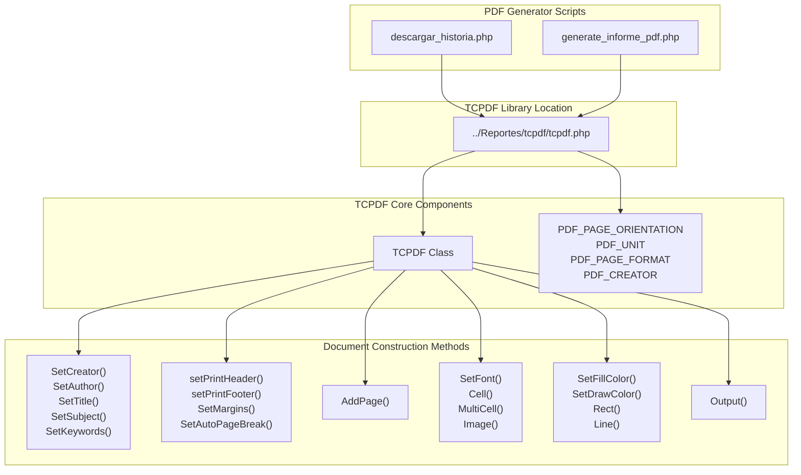
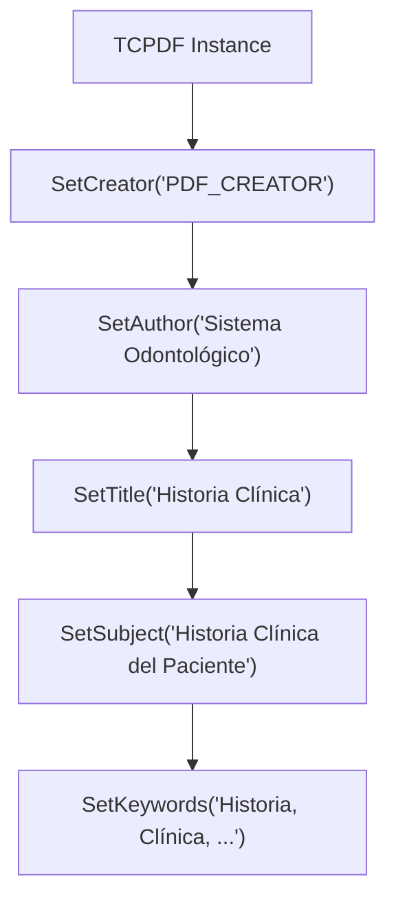
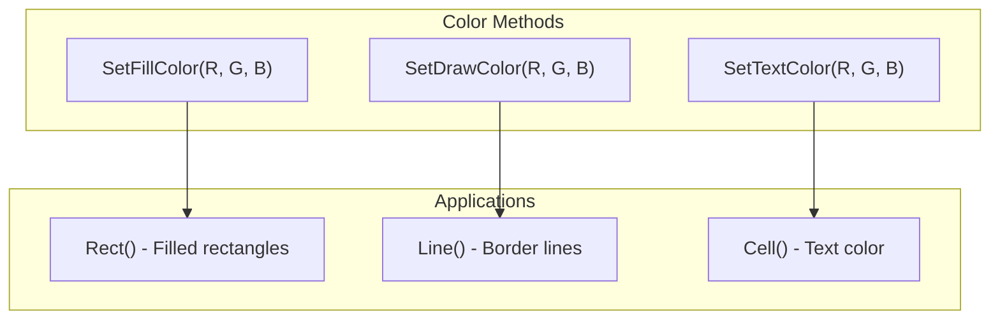
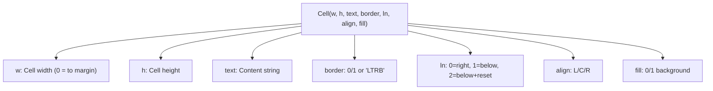
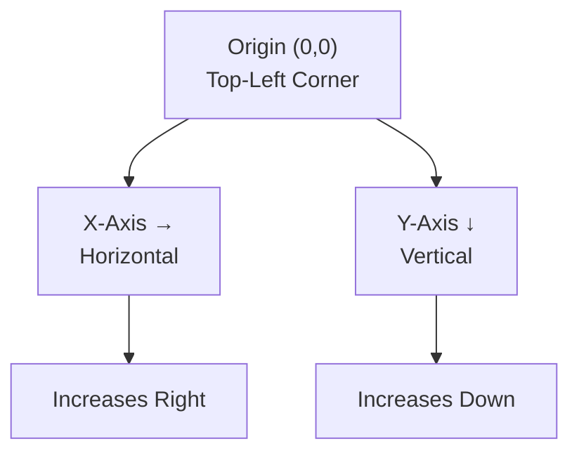
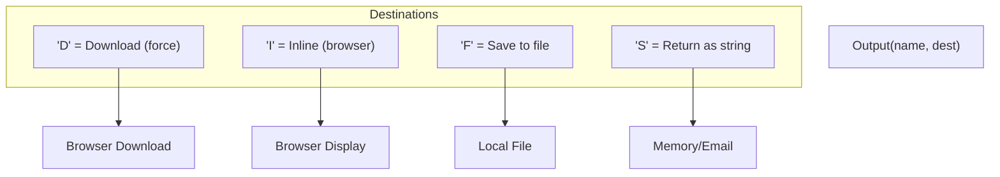
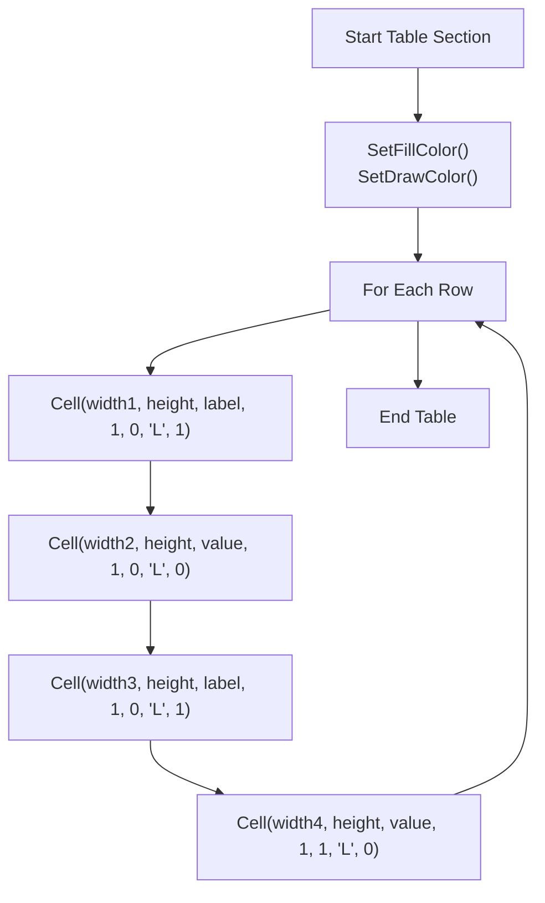
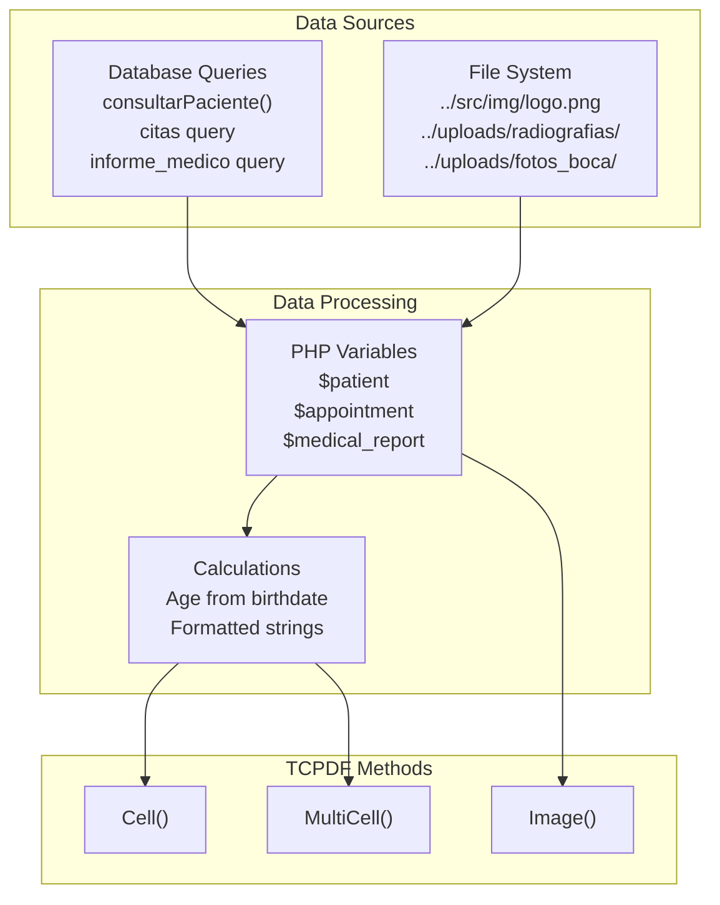

# TCPDF Library Integration

> **Relevant source files**
> * [Admin/descargar_historia.php](https://github.com/axchisan/Consultorio_Emily_Bernal/blob/589034b9/Admin/descargar_historia.php)
> * [Reportes/fpdf/FAQ.htm](https://github.com/axchisan/Consultorio_Emily_Bernal/blob/589034b9/Reportes/fpdf/FAQ.htm)
> * [Reportes/fpdf/Nueva carpeta/FAQ.htm](https://github.com/axchisan/Consultorio_Emily_Bernal/blob/589034b9/Reportes/fpdf/Nueva carpeta/FAQ.htm)
> * [Reportes/fpdf/Nueva carpeta/changelog.htm](https://github.com/axchisan/Consultorio_Emily_Bernal/blob/589034b9/Reportes/fpdf/Nueva carpeta/changelog.htm)

This document explains how the TCPDF library is integrated into the Consultorio Emily Bernal system and describes the specific TCPDF methods and patterns used by the PDF generation system. For details on the specific PDF generators that use this library, see [Clinical History PDF Generator](/axchisan/Consultorio_Emily_Bernal/3.1-clinical-history-pdf-generator) and [Medical Report PDF Generator](/axchisan/Consultorio_Emily_Bernal/3.2-medical-report-pdf-generator). For comprehensive TCPDF API reference, see section [9](/axchisan/Consultorio_Emily_Bernal/9-tcpdf-library-reference).

## Overview of TCPDF in the System

TCPDF is a PHP library for generating PDF documents. The system uses TCPDF to create two types of clinical documentation: complete patient histories and focused medical reports. The library is stored in the `Reportes/tcpdf/` directory and is loaded dynamically by both PDF generator scripts.

### Library Architecture



**Sources:** [Admin/descargar_historia.php L84-L292](https://github.com/axchisan/Consultorio_Emily_Bernal/blob/589034b9/Admin/descargar_historia.php#L84-L292)

## Library Loading and Instantiation

### File Existence Check

Before loading TCPDF, the system verifies the library file exists to prevent fatal errors:

```
if (!file_exists('../Reportes/tcpdf/tcpdf.php')) {
    die("Error: No se encontró el archivo TCPDF en '../Reportes/tcpdf/tcpdf.php'");
}
require_once '../Reportes/tcpdf/tcpdf.php';
```

This defensive check at [Admin/descargar_historia.php L85-L88](https://github.com/axchisan/Consultorio_Emily_Bernal/blob/589034b9/Admin/descargar_historia.php#L85-L88)

 ensures graceful error handling if the TCPDF library is missing.

### TCPDF Constructor Parameters

The TCPDF object is instantiated with predefined constants:

```
$pdf = new TCPDF(PDF_PAGE_ORIENTATION, PDF_UNIT, PDF_PAGE_FORMAT, true, 'UTF-8', false);
```

| Parameter | Value | Purpose |
| --- | --- | --- |
| `PDF_PAGE_ORIENTATION` | 'P' (Portrait) | Page orientation constant |
| `PDF_UNIT` | 'mm' | Measurement unit (millimeters) |
| `PDF_PAGE_FORMAT` | 'A4' | Page size format |
| `unicode` | `true` | Enable Unicode support |
| `encoding` | `'UTF-8'` | Character encoding |
| `diskcache` | `false` | Disable disk caching |

**Sources:** [Admin/descargar_historia.php L91](https://github.com/axchisan/Consultorio_Emily_Bernal/blob/589034b9/Admin/descargar_historia.php#L91-L91)

## Document Configuration

### Metadata Setup

Document metadata is configured immediately after instantiation:



These methods set PDF metadata visible in document properties:

* `SetCreator()` - Application that created the document
* `SetAuthor()` - Document author
* `SetTitle()` - Document title
* `SetSubject()` - Subject description
* `SetKeywords()` - Searchable keywords

**Sources:** [Admin/descargar_historia.php L94-L98](https://github.com/axchisan/Consultorio_Emily_Bernal/blob/589034b9/Admin/descargar_historia.php#L94-L98)

### Header and Footer Control

The system disables default headers and footers for custom layout control:

```
$pdf->setPrintHeader(false);
$pdf->setPrintFooter(false);
```

This allows complete control over page content without TCPDF's automatic header/footer rendering.

**Sources:** [Admin/descargar_historia.php L99-L100](https://github.com/axchisan/Consultorio_Emily_Bernal/blob/589034b9/Admin/descargar_historia.php#L99-L100)

### Page Margins and Auto-Break

```
$pdf->SetMargins(15, 15, 15);
$pdf->SetAutoPageBreak(true, 15);
```

| Method | Parameters | Purpose |
| --- | --- | --- |
| `SetMargins()` | left: 15mm, top: 15mm, right: 15mm | Define page margins |
| `SetAutoPageBreak()` | auto: true, margin: 15mm | Enable automatic page breaks with bottom margin |

**Sources:** [Admin/descargar_historia.php L101-L102](https://github.com/axchisan/Consultorio_Emily_Bernal/blob/589034b9/Admin/descargar_historia.php#L101-L102)

## Page Management

### Adding Pages

Pages must be explicitly added before content rendering:

```
$pdf->AddPage();
```

This creates a new page and sets the drawing position to the top-left margin.

**Sources:** [Admin/descargar_historia.php L105](https://github.com/axchisan/Consultorio_Emily_Bernal/blob/589034b9/Admin/descargar_historia.php#L105-L105)

## Graphics and Styling Methods

### Color Management



Color methods accept RGB values (0-255):

```
$pdf->SetFillColor(230, 240, 255);  // Light blue fill
$pdf->SetTextColor(33, 37, 41);     // Dark gray text
$pdf->SetDrawColor(150, 150, 150);  // Gray borders
```

**Sources:** [Admin/descargar_historia.php L108-L149](https://github.com/axchisan/Consultorio_Emily_Bernal/blob/589034b9/Admin/descargar_historia.php#L108-L149)

### Rectangle Drawing

```
$pdf->Rect(0, 0, 210, 35, 'F');
```

Parameters: `Rect(x, y, width, height, style)`

* Style `'F'` = Filled rectangle
* Style `'D'` = Draw border only
* Style `'DF'` = Both filled and bordered

Used for background sections and decorative boxes.

**Sources:** [Admin/descargar_historia.php L109-L286](https://github.com/axchisan/Consultorio_Emily_Bernal/blob/589034b9/Admin/descargar_historia.php#L109-L286)

### Line Drawing

```javascript
$pdf->SetLineStyle(array('width' => 0.3, 'color' => array(0, 102, 204)));
$pdf->Line(15, 35, 195, 35);
```

The `SetLineStyle()` method accepts an array defining:

* `width` - Line thickness in current units
* `color` - RGB array

`Line()` draws from (x1, y1) to (x2, y2).

**Sources:** [Admin/descargar_historia.php L131-L282](https://github.com/axchisan/Consultorio_Emily_Bernal/blob/589034b9/Admin/descargar_historia.php#L131-L282)

## Font and Text Rendering

### Font Selection

```
$pdf->SetFont('helvetica', 'B', 16);
```

Parameters: `SetFont(family, style, size)`

| Parameter | Common Values | Purpose |
| --- | --- | --- |
| `family` | `'helvetica'`, `'times'`, `'courier'` | Font family name |
| `style` | `''`, `'B'`, `'I'`, `'BI'` | Normal, Bold, Italic, Bold-Italic |
| `size` | `10`, `12`, `16` | Font size in points |

The font must be set before any text rendering operation.

**Sources:** [Admin/descargar_historia.php L117-L278](https://github.com/axchisan/Consultorio_Emily_Bernal/blob/589034b9/Admin/descargar_historia.php#L117-L278)

### Cell-Based Text Output



The `Cell()` method is the primary text rendering method:

```
$pdf->Cell(150, 10, 'HISTORIA CLÍNICA', 0, 0, 'C');
$pdf->Cell(30, 10, 'Nº ' . $id_cita, 1, 1, 'R', 1);
```

First call: width=150mm, height=10mm, centered text, no border, stay on line
Second call: width=30mm, height=10mm, right-aligned, bordered, move to next line, filled background

**Sources:** [Admin/descargar_historia.php L120-L280](https://github.com/axchisan/Consultorio_Emily_Bernal/blob/589034b9/Admin/descargar_historia.php#L120-L280)

### Multi-Line Text

```
$pdf->MultiCell(70, 35, $patient['alertas_medicas'] ?? 'N/A', 1, 'L', 1);
```

`MultiCell()` automatically wraps text and handles multiple lines within a defined width and height. Parameters similar to `Cell()` but with automatic text flow.

**Sources:** [Admin/descargar_historia.php L227](https://github.com/axchisan/Consultorio_Emily_Bernal/blob/589034b9/Admin/descargar_historia.php#L227-L227)

## Position Management

### Coordinate System



TCPDF uses a coordinate system with origin at the top-left corner of the page.

### Position Control Methods

```
$pdf->SetXY(50, 10);
$pdf->SetY(25);
```

| Method | Purpose |
| --- | --- |
| `SetXY(x, y)` | Set absolute X and Y coordinates |
| `SetX(x)` | Set X coordinate only |
| `SetY(y)` | Set Y coordinate only |
| `GetX()` | Get current X position |
| `GetY()` | Get current Y position |
| `Ln(h)` | Line break with optional height |

**Sources:** [Admin/descargar_historia.php L119-L283](https://github.com/axchisan/Consultorio_Emily_Bernal/blob/589034b9/Admin/descargar_historia.php#L119-L283)

## Image Handling

### Image Insertion

```
if (file_exists('../src/img/logo.png')) {
    $pdf->Image('../src/img/logo.png', 15, 10, 30, 0);
}
```

Parameters: `Image(file, x, y, width, height)`

* `file` - Path to image file
* `x`, `y` - Position coordinates
* `width` - Image width (0 = auto)
* `height` - Image height (0 = calculate proportionally)

When one dimension is 0, TCPDF calculates it proportionally to maintain aspect ratio.

**Sources:** [Admin/descargar_historia.php L112-L114](https://github.com/axchisan/Consultorio_Emily_Bernal/blob/589034b9/Admin/descargar_historia.php#L112-L114)

### Supported Image Formats

The system uses PNG images for logos. TCPDF supports:

* JPEG
* PNG (including transparency)
* GIF

Images from the `uploads/radiografias/` and `uploads/fotos_boca/` directories are conditionally included in medical report PDFs.

**Sources:** [Admin/descargar_historia.php L112-L114](https://github.com/axchisan/Consultorio_Emily_Bernal/blob/589034b9/Admin/descargar_historia.php#L112-L114)

## Document Output

### Output Method Signatures



### Download Implementation

```
ob_end_clean();
header('Content-Type: application/pdf');
header('Content-Disposition: attachment; filename="Historia_Clinica_' . $id_paciente . '_Cita_' . $id_cita . '.pdf"');
$pdf->Output('Historia_Clinica_' . $id_paciente . '_Cita_' . $id_cita . '.pdf', 'D');
exit();
```

Key steps:

1. `ob_end_clean()` - Clear output buffer to prevent corruption
2. Set `Content-Type` header to `application/pdf`
3. Set `Content-Disposition` with dynamic filename
4. Call `Output()` with destination `'D'` for forced download
5. `exit()` to prevent additional output

**Sources:** [Admin/descargar_historia.php L289-L293](https://github.com/axchisan/Consultorio_Emily_Bernal/blob/589034b9/Admin/descargar_historia.php#L289-L293)

## Character Encoding Considerations

### UTF-8 Configuration

The TCPDF instance is configured with UTF-8 encoding:

```
new TCPDF(PDF_PAGE_ORIENTATION, PDF_UNIT, PDF_PAGE_FORMAT, true, 'UTF-8', false);
```

The `true` parameter enables Unicode support, and `'UTF-8'` specifies the character encoding.

### Encoding Best Practices

Based on the FAQ files, the standard font encoding in FPDF/TCPDF is `windows-1252`. For UTF-8 data:

```
// If conversion needed
$str = iconv('UTF-8', 'windows-1252', $str);
// or
$str = mb_convert_encoding($str, 'windows-1252', 'UTF-8');
```

However, the system uses TCPDF's Unicode mode (`true` in constructor) which handles UTF-8 natively.

**Sources:** [Admin/descargar_historia.php L91](https://github.com/axchisan/Consultorio_Emily_Bernal/blob/589034b9/Admin/descargar_historia.php#L91-L91)

 [Reportes/fpdf/FAQ.htm L62-L71](https://github.com/axchisan/Consultorio_Emily_Bernal/blob/589034b9/Reportes/fpdf/FAQ.htm#L62-L71)

## Common TCPDF Patterns in the System

### Table-Like Layout



The system creates table-like structures using `Cell()` with borders:

* Alternating filled/unfilled cells for labels/values
* Border parameter `1` for all sides
* Line break parameter controls row advancement

**Sources:** [Admin/descargar_historia.php L157-L196](https://github.com/axchisan/Consultorio_Emily_Bernal/blob/589034b9/Admin/descargar_historia.php#L157-L196)

### Section Headers

```
$pdf->SetFont('helvetica', 'B', 12);
$pdf->SetTextColor(0, 102, 204);
$pdf->Cell(0, 10, 'INFORMACIÓN GENERAL', 0, 1, 'L');
$pdf->Ln(5);
```

Pattern for section headers:

1. Set bold font
2. Set blue text color
3. Render full-width cell with text
4. Add extra spacing with `Ln()`

**Sources:** [Admin/descargar_historia.php L140-L203](https://github.com/axchisan/Consultorio_Emily_Bernal/blob/589034b9/Admin/descargar_historia.php#L140-L203)

### Positioned Elements

```
$alertas_x = 15 + $anamnesis_width + 10;
$alertas_y = $pdf->GetY();
$pdf->SetXY($alertas_x, $alertas_y);
```

Complex layouts use:

* `GetY()` to capture current position
* Calculated X coordinates for column positioning
* `SetXY()` to position elements precisely

**Sources:** [Admin/descargar_historia.php L219-L230](https://github.com/axchisan/Consultorio_Emily_Bernal/blob/589034b9/Admin/descargar_historia.php#L219-L230)

## Error Prevention and Buffer Management

### Output Buffer Clearing

```
ob_start();  // At script start
// ... PDF generation ...
ob_end_clean();  // Before output
```

This pattern prevents PHP warnings/errors from corrupting the PDF:

* `ob_start()` at [Admin/descargar_historia.php L2](https://github.com/axchisan/Consultorio_Emily_Bernal/blob/589034b9/Admin/descargar_historia.php#L2-L2)  captures all output
* `ob_end_clean()` at [Admin/descargar_historia.php L289](https://github.com/axchisan/Consultorio_Emily_Bernal/blob/589034b9/Admin/descargar_historia.php#L289-L289)  discards buffer before PDF output

This addresses the common "Some data has already been output" error mentioned in FAQ.

**Sources:** [Admin/descargar_historia.php L2-L289](https://github.com/axchisan/Consultorio_Emily_Bernal/blob/589034b9/Admin/descargar_historia.php#L2-L289)

 [Reportes/fpdf/FAQ.htm L46-L58](https://github.com/axchisan/Consultorio_Emily_Bernal/blob/589034b9/Reportes/fpdf/FAQ.htm#L46-L58)

### File Existence Checks

All file operations include existence checks:

```
if (file_exists('../src/img/logo.png')) {
    $pdf->Image('../src/img/logo.png', 15, 10, 30, 0);
}
```

This prevents fatal errors when expected files are missing.

**Sources:** [Admin/descargar_historia.php L112-L114](https://github.com/axchisan/Consultorio_Emily_Bernal/blob/589034b9/Admin/descargar_historia.php#L112-L114)

## Integration with System Data

### Data Flow to TCPDF



The system queries database tables, processes data in PHP, then passes string values to TCPDF rendering methods. No direct database access occurs within TCPDF calls.

**Sources:** [Admin/descargar_historia.php L40-L270](https://github.com/axchisan/Consultorio_Emily_Bernal/blob/589034b9/Admin/descargar_historia.php#L40-L270)