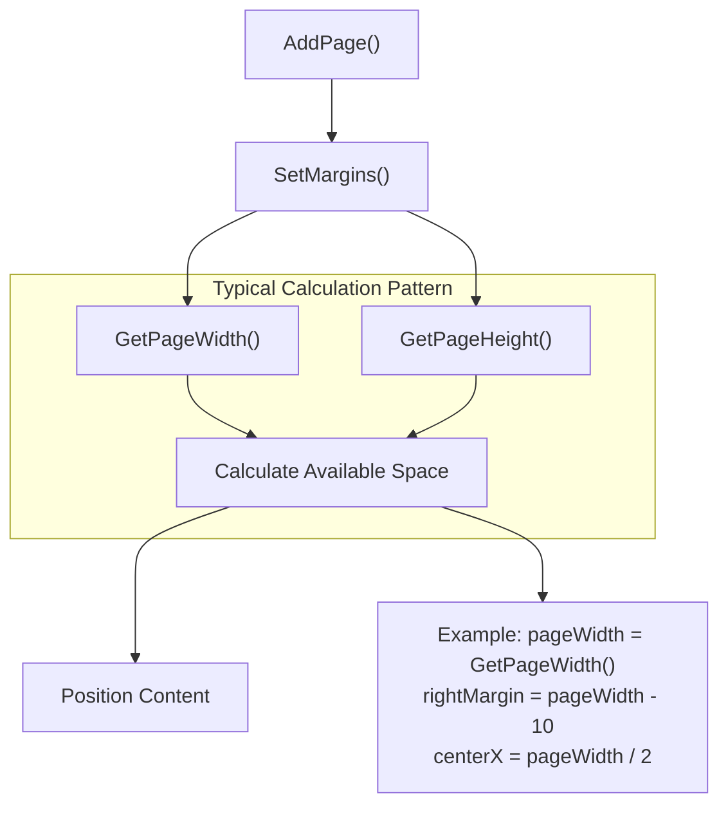
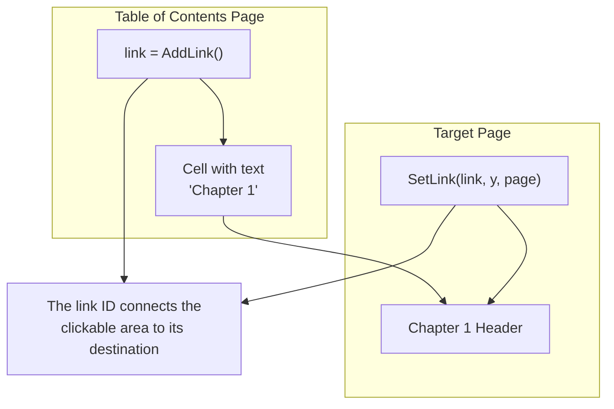
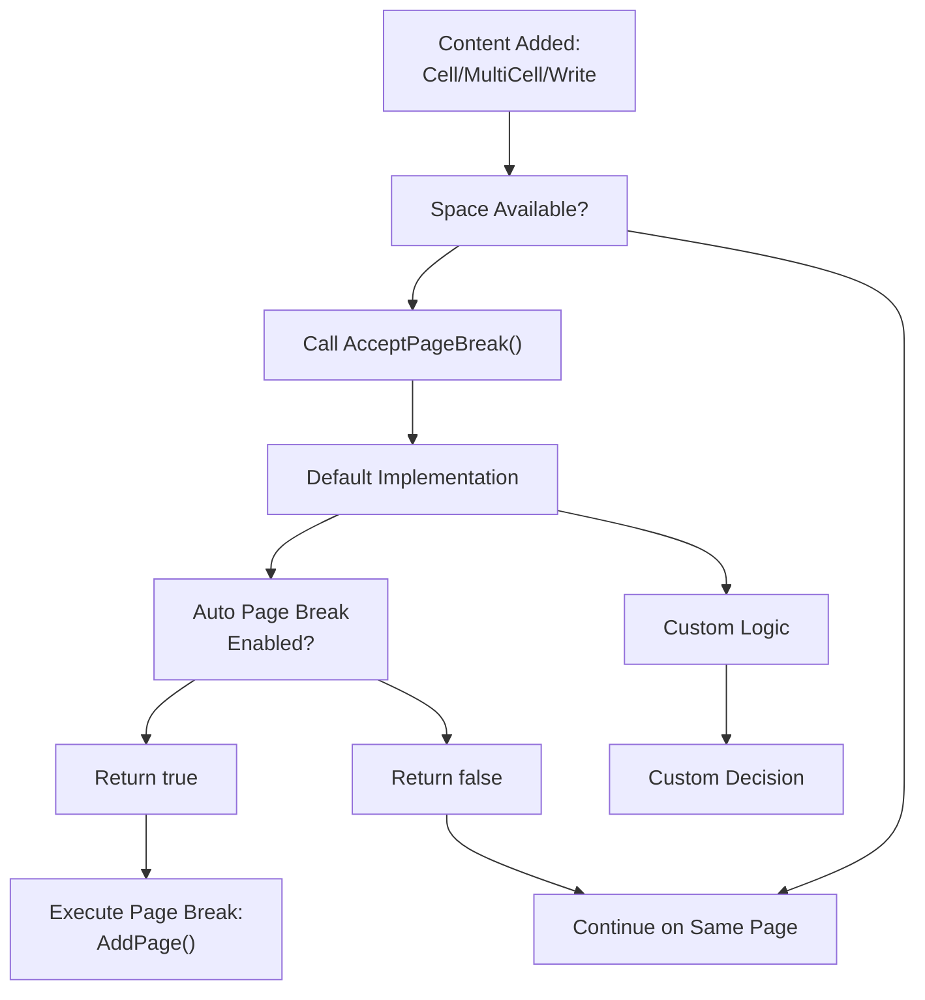
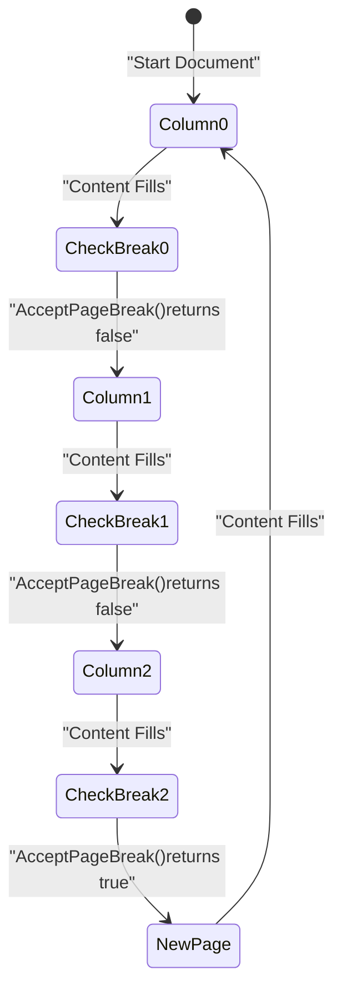
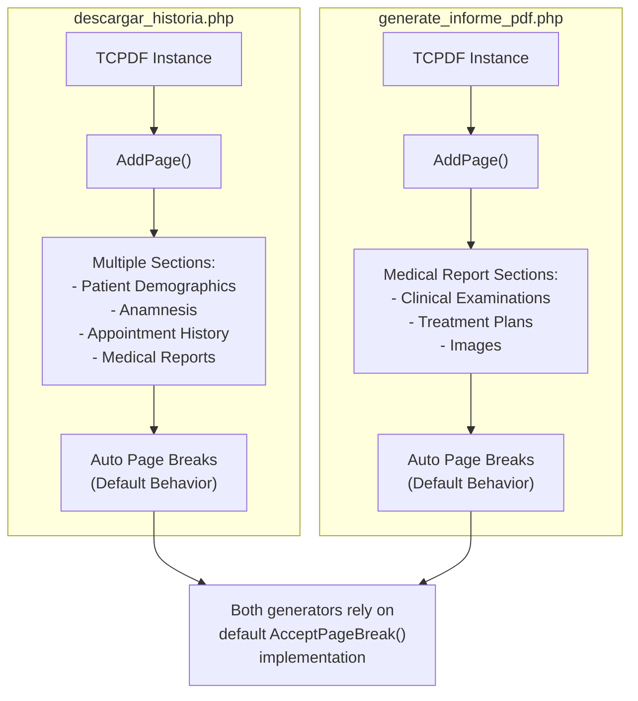

# TCPDF Page Management & Links

> **Relevant source files**
> * [Reportes/fpdf/Nueva carpeta/doc/acceptpagebreak.htm](https://github.com/axchisan/Consultorio_Emily_Bernal/blob/589034b9/Reportes/fpdf/Nueva carpeta/doc/acceptpagebreak.htm)
> * [Reportes/fpdf/Nueva carpeta/doc/addlink.htm](https://github.com/axchisan/Consultorio_Emily_Bernal/blob/589034b9/Reportes/fpdf/Nueva carpeta/doc/addlink.htm)
> * [Reportes/fpdf/Nueva carpeta/doc/getpageheight.htm](https://github.com/axchisan/Consultorio_Emily_Bernal/blob/589034b9/Reportes/fpdf/Nueva carpeta/doc/getpageheight.htm)
> * [Reportes/fpdf/Nueva carpeta/doc/getpagewidth.htm](https://github.com/axchisan/Consultorio_Emily_Bernal/blob/589034b9/Reportes/fpdf/Nueva carpeta/doc/getpagewidth.htm)

## Purpose & Scope

This document covers TCPDF methods for managing page dimensions, controlling page breaks, and creating internal document links. These methods enable dynamic page layout management and navigation within generated PDF documents.

For core document construction methods, see [TCPDF Core Methods](/axchisan/Consultorio_Emily_Bernal/9.1-tcpdf-core-methods). For positioning and coordinate system methods, see [TCPDF Positioning & Dimensions](/axchisan/Consultorio_Emily_Bernal/9.5-tcpdf-positioning-and-dimensions).

---

## Page Dimension Retrieval

TCPDF provides methods to query the current page dimensions, enabling dynamic content positioning and layout calculations.

### Method Reference

| Method | Return Type | Description |
| --- | --- | --- |
| `GetPageWidth()` | `float` | Returns the current page width in user units |
| `GetPageHeight()` | `float` | Returns the current page height in user units |

### GetPageWidth()

Returns the width of the current page in the document's unit system (typically millimeters or points).

**Signature:**

```
float GetPageWidth()
```

**Common Usage:**

* Calculating center positions for headers/footers
* Determining right-side alignment coordinates
* Computing cell widths as percentages of page width
* Dynamic content scaling based on available width

**Sources:** [Reportes/fpdf/Nueva L1-L19](https://github.com/axchisan/Consultorio_Emily_Bernal/blob/589034b9/Reportes/fpdf/Nueva carpeta/doc/getpagewidth.htm#L1-L19)

### GetPageHeight()

Returns the height of the current page in the document's unit system.

**Signature:**

```
float GetPageHeight()
```

**Common Usage:**

* Positioning footer elements at page bottom
* Calculating remaining vertical space before page break
* Determining when to trigger manual page breaks
* Vertical centering calculations

**Sources:** [Reportes/fpdf/Nueva L1-L19](https://github.com/axchisan/Consultorio_Emily_Bernal/blob/589034b9/Reportes/fpdf/Nueva carpeta/doc/getpageheight.htm#L1-L19)

### Page Dimension Workflow



**Sources:** [Reportes/fpdf/Nueva L1-L19](https://github.com/axchisan/Consultorio_Emily_Bernal/blob/589034b9/Reportes/fpdf/Nueva carpeta/doc/getpagewidth.htm#L1-L19)

 [Reportes/fpdf/Nueva L1-L19](https://github.com/axchisan/Consultorio_Emily_Bernal/blob/589034b9/Reportes/fpdf/Nueva carpeta/doc/getpageheight.htm#L1-L19)

---

## Internal Link System

TCPDF supports creating clickable internal links within PDF documents, allowing navigation between sections without external URLs.

### Link Creation Workflow

The internal link system uses a two-phase approach:

1. **Link Creation**: `AddLink()` creates a link identifier
2. **Destination Definition**: `SetLink()` associates the identifier with a specific page location

```mermaid
sequenceDiagram
  participant PDF Generation Code
  participant AddLink()
  participant Content Methods
  participant SetLink()
  participant PDF Document

  PDF Generation Code->>AddLink(): Create link identifier
  AddLink()-->>PDF Generation Code: Returns link ID (int)
  PDF Generation Code->>Content Methods: Cell/Write/Image with link ID
  Content Methods->>PDF Document: Creates clickable area
  note over PDF Generation Code: Later in document...
  PDF Generation Code->>SetLink(): SetLink(linkID, page, y)
  SetLink()->>PDF Document: Associates click with destination
  note over PDF Document: When user clicks area,
```

**Sources:** [Reportes/fpdf/Nueva L1-L25](https://github.com/axchisan/Consultorio_Emily_Bernal/blob/589034b9/Reportes/fpdf/Nueva carpeta/doc/addlink.htm#L1-L25)

### AddLink()

Creates a new internal link identifier that can be used to create clickable areas within the document.

**Signature:**

```
int AddLink()
```

**Returns:** Integer identifier for the newly created link

**Parameters:** None

**Description:**
Creates an internal link reference and returns its identifier. This identifier can then be passed to `Cell()`, `Write()`, `Image()`, or `Link()` methods to create clickable regions. The actual destination is defined later using `SetLink()`.

**Sources:** [Reportes/fpdf/Nueva L1-L25](https://github.com/axchisan/Consultorio_Emily_Bernal/blob/589034b9/Reportes/fpdf/Nueva carpeta/doc/addlink.htm#L1-L25)

### SetLink()

Defines the destination for a previously created link identifier.

**Signature:**

```
void SetLink(int link [, float y [, int page]])
```

**Parameters:**

* `link`: Link identifier returned by `AddLink()`
* `y`: (Optional) Y-coordinate of destination. Default: 0
* `page`: (Optional) Target page number. Default: -1 (current page)

**Note:** While `SetLink()` documentation is referenced in the codebase, the specific implementation details depend on TCPDF/FPDF library version.

**Sources:** [Reportes/fpdf/Nueva L14](https://github.com/axchisan/Consultorio_Emily_Bernal/blob/589034b9/Reportes/fpdf/Nueva carpeta/doc/addlink.htm#L14-L14)

### Internal Link Usage Pattern



**Sources:** [Reportes/fpdf/Nueva L1-L25](https://github.com/axchisan/Consultorio_Emily_Bernal/blob/589034b9/Reportes/fpdf/Nueva carpeta/doc/addlink.htm#L1-L25)

### Link Method Compatibility

| Content Method | Supports Links | Link Parameter |
| --- | --- | --- |
| `Cell()` | Yes | Last parameter |
| `Write()` | Yes | Last parameter |
| `Image()` | Yes | Named parameter |
| `Link()` | Yes | Dedicated link method |
| `MultiCell()` | Limited | Varies by version |

**Sources:** [Reportes/fpdf/Nueva L14-L19](https://github.com/axchisan/Consultorio_Emily_Bernal/blob/589034b9/Reportes/fpdf/Nueva carpeta/doc/addlink.htm#L14-L19)

---

## Page Break Control

### AcceptPageBreak()

Controls whether automatic page breaks occur at specific points in the document. This method is invoked automatically by TCPDF when content approaches the bottom margin.

**Signature:**

```
boolean AcceptPageBreak()
```

**Returns:**

* `true` - Allow the page break to occur
* `false` - Prevent the page break (custom handling required)

**Default Behavior:**
The base implementation returns a value based on the mode set by `SetAutoPageBreak()`. When auto page breaks are enabled, it returns `true`; otherwise `false`.

**Important:** This method is called automatically by the library and should not be invoked directly by application code.

**Sources:** [Reportes/fpdf/Nueva L1-L63](https://github.com/axchisan/Consultorio_Emily_Bernal/blob/589034b9/Reportes/fpdf/Nueva carpeta/doc/acceptpagebreak.htm#L1-L63)

### AcceptPageBreak() Flow



**Sources:** [Reportes/fpdf/Nueva L1-L63](https://github.com/axchisan/Consultorio_Emily_Bernal/blob/589034b9/Reportes/fpdf/Nueva carpeta/doc/acceptpagebreak.htm#L1-L63)

### Custom AcceptPageBreak() Implementation

The method can be overridden in subclasses to implement custom page break behavior, such as multi-column layouts.

**Example: Three-Column Layout**

The following pattern demonstrates overriding `AcceptPageBreak()` to create a three-column layout where columns fill left-to-right before triggering a page break:

```javascript
class PDF extends FPDF
{
    protected $col = 0;

    function SetCol($col)
    {
        // Move position to a column
        $this->col = $col;
        $x = 10 + $col*65;
        $this->SetLeftMargin($x);
        $this->SetX($x);
    }

    function AcceptPageBreak()
    {
        if($this->col<2)
        {
            // Go to next column
            $this->SetCol($this->col+1);
            $this->SetY(10);
            return false;
        }
        else
        {
            // Return to first column and emit page break
            $this->SetCol(0);
            return true;
        }
    }
}
```

**Sources:** [Reportes/fpdf/Nueva L19-L48](https://github.com/axchisan/Consultorio_Emily_Bernal/blob/589034b9/Reportes/fpdf/Nueva carpeta/doc/acceptpagebreak.htm#L19-L48)

### Multi-Column Page Break Logic



**Sources:** [Reportes/fpdf/Nueva L32-L47](https://github.com/axchisan/Consultorio_Emily_Bernal/blob/589034b9/Reportes/fpdf/Nueva carpeta/doc/acceptpagebreak.htm#L32-L47)

---

## Usage in Consultorio Emily Bernal

### PDF Generator Context

Both PDF generators in the system (`descargar_historia.php` and `generate_informe_pdf.php`) utilize TCPDF's page management capabilities, though they primarily rely on automatic page breaks rather than custom implementations.



**Sources:** Based on architecture analysis from Diagram 5: PDF Generation Pipeline

### Page Dimension Usage Patterns

The PDF generators likely use page dimension methods for:

| Use Case | Method | Purpose |
| --- | --- | --- |
| Header centering | `GetPageWidth()` | Calculate center X coordinate |
| Footer positioning | `GetPageHeight()` | Position footer at bottom |
| Image sizing | `GetPageWidth()` | Scale images to fit page width |
| Column widths | `GetPageWidth()` | Calculate proportional cell widths |
| Content margins | Both methods | Determine printable area |

**Note:** While these patterns are standard TCPDF usage, specific implementation depends on the PDF generator code structure.

**Sources:** Architecture context from system overview

---

## Method Summary Table

| Method | Category | Auto-Called | Override-able | Primary Use Case |
| --- | --- | --- | --- | --- |
| `AddLink()` | Links | No | No | Create internal document navigation |
| `SetLink()` | Links | No | No | Define link destinations |
| `GetPageWidth()` | Dimensions | No | No | Query current page width |
| `GetPageHeight()` | Dimensions | No | No | Query current page height |
| `AcceptPageBreak()` | Page Breaks | Yes | Yes | Control automatic page break behavior |

**Sources:** [Reportes/fpdf/Nueva L1-L25](https://github.com/axchisan/Consultorio_Emily_Bernal/blob/589034b9/Reportes/fpdf/Nueva carpeta/doc/addlink.htm#L1-L25)

 [Reportes/fpdf/Nueva L1-L63](https://github.com/axchisan/Consultorio_Emily_Bernal/blob/589034b9/Reportes/fpdf/Nueva carpeta/doc/acceptpagebreak.htm#L1-L63)

 [Reportes/fpdf/Nueva L1-L19](https://github.com/axchisan/Consultorio_Emily_Bernal/blob/589034b9/Reportes/fpdf/Nueva carpeta/doc/getpagewidth.htm#L1-L19)

 [Reportes/fpdf/Nueva L1-L19](https://github.com/axchisan/Consultorio_Emily_Bernal/blob/589034b9/Reportes/fpdf/Nueva carpeta/doc/getpageheight.htm#L1-L19)

---

## Related Methods

The following methods work in conjunction with page management:

* **`AddPage()`**: Creates new pages (see [TCPDF Core Methods](/axchisan/Consultorio_Emily_Bernal/9.1-tcpdf-core-methods))
* **`SetAutoPageBreak()`**: Configures automatic page break behavior
* **`SetMargins()`**: Defines page margins affecting available space
* **`GetX()`, `GetY()`**: Position queries (see [TCPDF Positioning & Dimensions](/axchisan/Consultorio_Emily_Bernal/9.5-tcpdf-positioning-and-dimensions))
* **`SetX()`, `SetY()`**: Position setting (see [TCPDF Positioning & Dimensions](/axchisan/Consultorio_Emily_Bernal/9.5-tcpdf-positioning-and-dimensions))

**Sources:** [Reportes/fpdf/Nueva L58](https://github.com/axchisan/Consultorio_Emily_Bernal/blob/589034b9/Reportes/fpdf/Nueva carpeta/doc/acceptpagebreak.htm#L58-L58)

 [Reportes/fpdf/Nueva L15-L20](https://github.com/axchisan/Consultorio_Emily_Bernal/blob/589034b9/Reportes/fpdf/Nueva carpeta/doc/addlink.htm#L15-L20)

---

## Best Practices

### Page Dimension Queries

1. **Cache values when used repeatedly** in loops or complex calculations
2. **Consider margins** when calculating usable space: `usableWidth = GetPageWidth() - leftMargin - rightMargin`
3. **Account for page orientation** when sizing content

### Internal Links

1. **Create link IDs early** in the document generation process
2. **Set link destinations after** the target content is rendered
3. **Use descriptive variable names** for link IDs: `$tocChapter1Link` rather than `$link1`
4. **Test link behavior** in multiple PDF viewers

### Page Break Control

1. **Override `AcceptPageBreak()` only when necessary** for complex layouts
2. **Always reset state** when preventing page breaks (position, column, etc.)
3. **Document custom logic** clearly for maintainability
4. **Test with varying content lengths** to ensure proper pagination

**Sources:** General TCPDF best practices based on method documentation