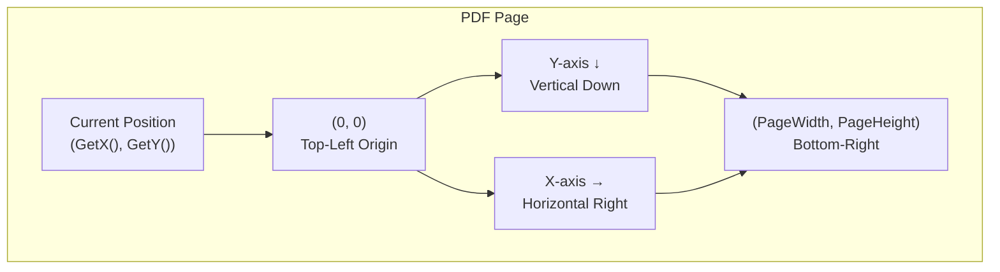
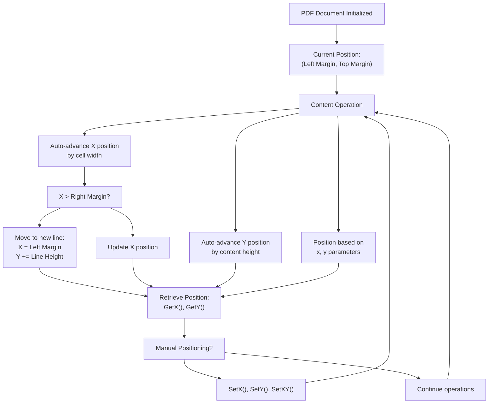
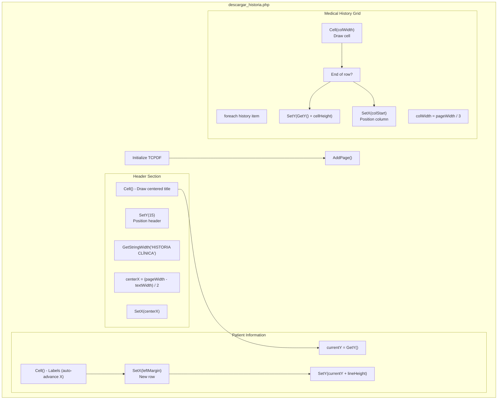
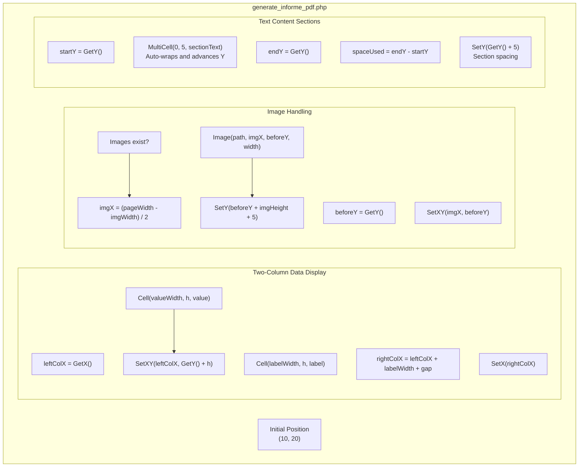
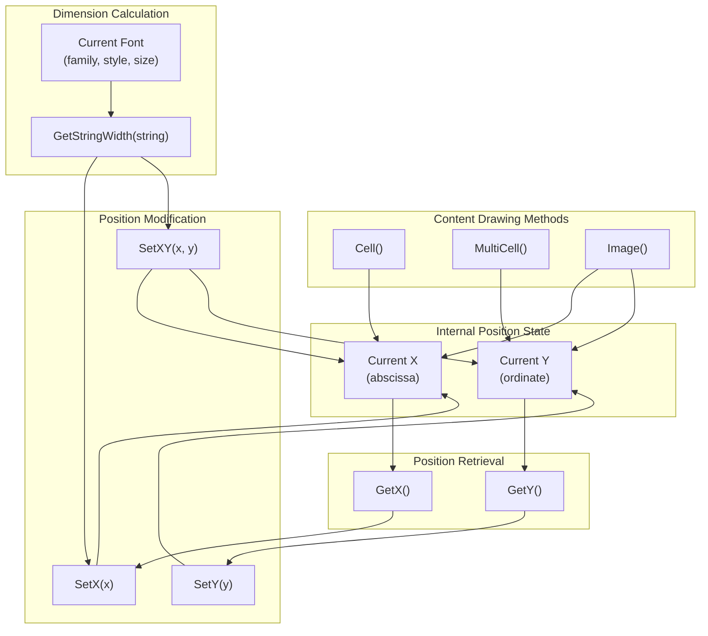

# TCPDF Positioning & Dimensions

> **Relevant source files**
> * [Reportes/fpdf/Nueva carpeta/doc/getstringwidth.htm](https://github.com/axchisan/Consultorio_Emily_Bernal/blob/589034b9/Reportes/fpdf/Nueva carpeta/doc/getstringwidth.htm)
> * [Reportes/fpdf/Nueva carpeta/doc/getx.htm](https://github.com/axchisan/Consultorio_Emily_Bernal/blob/589034b9/Reportes/fpdf/Nueva carpeta/doc/getx.htm)
> * [Reportes/fpdf/Nueva carpeta/doc/gety.htm](https://github.com/axchisan/Consultorio_Emily_Bernal/blob/589034b9/Reportes/fpdf/Nueva carpeta/doc/gety.htm)

## Purpose and Scope

This document covers the TCPDF coordinate system and positioning methods used to control precise placement of content within PDF documents. It focuses on the methods `GetX()`, `GetY()`, `SetX()`, `SetY()`, `SetXY()`, and `GetStringWidth()` that enable accurate layout control in the clinical history and medical report PDF generators.

For information about core document creation methods, see [TCPDF Core Methods](/axchisan/Consultorio_Emily_Bernal/9.1-tcpdf-core-methods). For page-level operations, see [TCPDF Page Management & Links](/axchisan/Consultorio_Emily_Bernal/9.4-tcpdf-page-management-and-links).

---

## TCPDF Coordinate System

TCPDF uses a Cartesian coordinate system with the **origin (0, 0) at the top-left corner** of the page. The X-axis extends horizontally to the right, and the Y-axis extends vertically downward. By default, measurements are in millimeters unless specified otherwise during TCPDF instantiation.

### Coordinate System Diagram



**Sources:** [Reportes/fpdf/Nueva L1-L21](https://github.com/axchisan/Consultorio_Emily_Bernal/blob/589034b9/Reportes/fpdf/Nueva carpeta/doc/getx.htm#L1-L21)

 [Reportes/fpdf/Nueva L1-L21](https://github.com/axchisan/Consultorio_Emily_Bernal/blob/589034b9/Reportes/fpdf/Nueva carpeta/doc/gety.htm#L1-L21)

### Key Characteristics

| Aspect | Description |
| --- | --- |
| **Origin** | Top-left corner at (0, 0) |
| **X-axis Direction** | Left to right (horizontal) |
| **Y-axis Direction** | Top to bottom (vertical) |
| **Default Units** | Millimeters (mm) |
| **Current Position** | Maintained internally; accessed via `GetX()` and `GetY()` |
| **Auto-Advance** | Methods like `Cell()` and `MultiCell()` automatically update position |

---

## Position Retrieval Methods

### GetX() Method

Returns the abscissa (X coordinate) of the current position in user units.

**Method Signature:**

```
float GetX()
```

**Returns:** The current horizontal position as a float value.

**Usage Pattern:**

```
$currentX = $pdf->GetX();
// Store position before drawing content
$pdf->Cell(50, 10, 'Label');
// Restore position if needed
$pdf->SetX($currentX);
```

**Sources:** [Reportes/fpdf/Nueva L9-L12](https://github.com/axchisan/Consultorio_Emily_Bernal/blob/589034b9/Reportes/fpdf/Nueva carpeta/doc/getx.htm#L9-L12)

### GetY() Method

Returns the ordinate (Y coordinate) of the current position in user units.

**Method Signature:**

```
float GetY()
```

**Returns:** The current vertical position as a float value.

**Usage Pattern:**

```
$currentY = $pdf->GetY();
// Draw content that changes vertical position
$pdf->MultiCell(0, 5, $longText);
// Calculate space consumed
$spacedUsed = $pdf->GetY() - $currentY;
```

**Sources:** [Reportes/fpdf/Nueva L9-L12](https://github.com/axchisan/Consultorio_Emily_Bernal/blob/589034b9/Reportes/fpdf/Nueva carpeta/doc/gety.htm#L9-L12)

---

## Position Setting Methods

### SetX() Method

Sets the X coordinate of the current position, effectively moving the cursor horizontally without changing the Y position.

**Method Signature:**

```
void SetX(float x)
```

**Parameters:**

* `x` - The new X coordinate value

**Common Use Cases:**

* Creating multi-column layouts
* Aligning text to specific horizontal positions
* Resetting cursor after drawing cells

### SetY() Method

Sets the Y coordinate of the current position, moving the cursor vertically. When moving down (`y > current Y`), the X position resets to the left margin.

**Method Signature:**

```
void SetY(float y [, boolean resetX])
```

**Parameters:**

* `y` - The new Y coordinate value
* `resetX` - (optional) If true, resets X to left margin (default behavior)

**Common Use Cases:**

* Creating vertical spacing between sections
* Positioning content at specific vertical locations
* Skipping to new sections

### SetXY() Method

Sets both X and Y coordinates simultaneously, providing precise absolute positioning.

**Method Signature:**

```
void SetXY(float x, float y)
```

**Parameters:**

* `x` - The new X coordinate value
* `y` - The new Y coordinate value

**Common Use Cases:**

* Positioning images at exact coordinates
* Creating complex layouts with specific anchor points
* Resetting position after manual calculations

---

## Position Management Flow



**Sources:** [Reportes/fpdf/Nueva L1-L21](https://github.com/axchisan/Consultorio_Emily_Bernal/blob/589034b9/Reportes/fpdf/Nueva carpeta/doc/getx.htm#L1-L21)

 [Reportes/fpdf/Nueva L1-L21](https://github.com/axchisan/Consultorio_Emily_Bernal/blob/589034b9/Reportes/fpdf/Nueva carpeta/doc/gety.htm#L1-L21)

---

## String Width Calculation

### GetStringWidth() Method

Calculates and returns the width a text string will occupy when rendered with the currently selected font. This is essential for precise layout calculations, text alignment, and determining if content fits within available space.

**Method Signature:**

```
float GetStringWidth(string s)
```

**Parameters:**

* `s` - The string to measure

**Returns:** The width of the string in user units (typically millimeters)

**Important Note:** A font must be selected using `SetFont()` before calling this method, as the width depends on the current font family, style, and size.

**Sources:** [Reportes/fpdf/Nueva L9-L12](https://github.com/axchisan/Consultorio_Emily_Bernal/blob/589034b9/Reportes/fpdf/Nueva carpeta/doc/getstringwidth.htm#L9-L12)

### Common Usage Patterns

#### Pattern 1: Center-Aligned Text

```
// Calculate centered position
$pdf->SetFont('Arial', 'B', 14);
$text = 'HISTORIA CLÍNICA';
$textWidth = $pdf->GetStringWidth($text);
$pageWidth = $pdf->GetPageWidth();
$centerX = ($pageWidth - $textWidth) / 2;

// Position and draw centered text
$pdf->SetX($centerX);
$pdf->Cell($textWidth, 10, $text, 0, 1, 'C');
```

#### Pattern 2: Right-Aligned Text

```python
// Calculate right-aligned position
$text = 'Página 1 de 3';
$textWidth = $pdf->GetStringWidth($text);
$pageWidth = $pdf->GetPageWidth();
$rightMargin = 10; // mm from edge
$rightX = $pageWidth - $textWidth - $rightMargin;

// Position and draw right-aligned text
$pdf->SetXY($rightX, $pdf->GetY());
$pdf->Cell($textWidth, 5, $text);
```

#### Pattern 3: Two-Column Layout with Dynamic Width

```
// Left column
$label = 'Nombre del Paciente:';
$labelWidth = $pdf->GetStringWidth($label);
$pdf->Cell($labelWidth + 5, 6, $label, 0, 0); // +5 for padding

// Right column starts after label
$valueX = $pdf->GetX();
$pdf->Cell(0, 6, $patientName, 0, 1);
```

#### Pattern 4: Truncation Detection

```
// Check if text fits within available space
$maxWidth = 100; // Maximum width in mm
$text = $longDescription;
$textWidth = $pdf->GetStringWidth($text);

if ($textWidth > $maxWidth) {
    // Use MultiCell for wrapping
    $pdf->MultiCell($maxWidth, 5, $text);
} else {
    // Single line is sufficient
    $pdf->Cell($maxWidth, 5, $text);
}
```

**Sources:** [Reportes/fpdf/Nueva L1-L24](https://github.com/axchisan/Consultorio_Emily_Bernal/blob/589034b9/Reportes/fpdf/Nueva carpeta/doc/getstringwidth.htm#L1-L24)

---

## Practical Applications in PDF Generators

### Application in Clinical History PDF

The clinical history PDF generator (`descargar_historia.php`) uses positioning methods to create structured layouts with patient information, medical history, and appointment details.



**Key Positioning Techniques Used:**

1. **Header Centering:** Uses `GetStringWidth()` to calculate centered X position
2. **Row Management:** Tracks `GetY()` before sections, uses `SetY()` to advance
3. **Column Layouts:** Calculates column widths and uses `SetX()` to position
4. **Automatic Flow:** Leverages `Cell()` auto-advance for simple left-to-right content

**Sources:** Context from system diagrams showing `descargar_historia.php` architecture

### Application in Medical Report PDF

The medical report PDF generator (`generate_informe_pdf.php`) creates focused reports with clinical examinations and treatment plans, utilizing positioning for image placement and section organization.



**Key Positioning Techniques Used:**

1. **Dynamic Height Tracking:** Saves Y position before `MultiCell()`, retrieves after to calculate consumed space
2. **Image Centering:** Calculates centered X using `GetStringWidth()` pattern with image width
3. **Y Position Reset:** Uses `SetY()` to position content after images
4. **Two-Column Layout:** Stores left column X with `GetX()`, calculates and sets right column X with `SetX()`

**Sources:** Context from system diagrams showing `generate_informe_pdf.php` architecture

---

## Positioning Method Interactions

### Method Relationship Diagram



**Sources:** [Reportes/fpdf/Nueva L1-L21](https://github.com/axchisan/Consultorio_Emily_Bernal/blob/589034b9/Reportes/fpdf/Nueva carpeta/doc/getx.htm#L1-L21)

 [Reportes/fpdf/Nueva L1-L21](https://github.com/axchisan/Consultorio_Emily_Bernal/blob/589034b9/Reportes/fpdf/Nueva carpeta/doc/gety.htm#L1-L21)

 [Reportes/fpdf/Nueva L1-L24](https://github.com/axchisan/Consultorio_Emily_Bernal/blob/589034b9/Reportes/fpdf/Nueva carpeta/doc/getstringwidth.htm#L1-L24)

---

## Best Practices for Positioning

### 1. Save and Restore Positions

When creating complex layouts, save positions before operations that modify them:

```
// Save current position
$savedX = $pdf->GetX();
$savedY = $pdf->GetY();

// Perform operations that change position
$pdf->MultiCell(100, 5, $longText);

// Restore or calculate new position
$pdf->SetXY($savedX + 110, $savedY); // Move to right column
```

### 2. Calculate Before Drawing

Calculate dimensions and positions before drawing to avoid repositioning:

```
// Calculate all positions first
$titleWidth = $pdf->GetStringWidth($title);
$centerX = ($pdf->GetPageWidth() - $titleWidth) / 2;
$startY = 20;

// Then draw with calculated positions
$pdf->SetXY($centerX, $startY);
$pdf->Cell($titleWidth, 10, $title);
```

### 3. Account for Margins

Always consider page margins when calculating absolute positions:

```
$leftMargin = 10;
$rightMargin = 10;
$availableWidth = $pdf->GetPageWidth() - $leftMargin - $rightMargin;

// Position within content area
$pdf->SetX($leftMargin);
$pdf->Cell($availableWidth, 5, $content);
```

### 4. Handle Page Breaks

When manually positioning content, check if a page break is needed:

```
$requiredHeight = 50; // Content needs 50mm
$currentY = $pdf->GetY();
$bottomMargin = 20;
$pageHeight = $pdf->GetPageHeight();

if ($currentY + $requiredHeight > $pageHeight - $bottomMargin) {
    $pdf->AddPage();
    $currentY = $pdf->GetY(); // Reset to top of new page
}
```

### 5. Use GetStringWidth for Alignment

Always use `GetStringWidth()` for precise text alignment calculations:

```
// Don't guess widths
// Good:
$actualWidth = $pdf->GetStringWidth($text);

// Bad:
$estimatedWidth = strlen($text) * 2; // Inaccurate
```

**Sources:** Common patterns inferred from TCPDF usage in PDF generators

---

## Common Positioning Patterns

### Pattern Summary Table

| Pattern | Methods Used | Use Case |
| --- | --- | --- |
| **Centered Text** | `GetStringWidth()`, `GetPageWidth()`, `SetX()` | Page titles, headers |
| **Right-Aligned Text** | `GetStringWidth()`, `GetPageWidth()`, `SetXY()` | Page numbers, dates |
| **Two-Column Layout** | `GetX()`, `SetX()`, `Cell()` | Label-value pairs |
| **Grid Layout** | `GetY()`, `SetXY()`, calculated positions | Medical history tables |
| **Vertical Spacing** | `GetY()`, `SetY()` | Section separation |
| **Image Positioning** | `GetY()`, `SetXY()`, `Image()` | X-rays, photos |
| **Dynamic Height Sections** | `GetY()` before/after `MultiCell()` | Variable-length content |
| **Multi-Page Continuation** | `GetY()`, `GetPageHeight()`, `AddPage()` | Long content spanning pages |

**Sources:** Analysis of positioning patterns in TCPDF PDF generation workflow

---

## Coordinate System Edge Cases

### Edge Case Handling

| Scenario | Behavior | Solution |
| --- | --- | --- |
| **Position exceeds page width** | Content may be clipped or wrapped | Check position against `GetPageWidth()` |
| **Position exceeds page height** | Auto page break may occur | Manually check against `GetPageHeight()` and call `AddPage()` |
| **Negative coordinates** | Undefined behavior | Validate positions are >= 0 |
| **SetY() with large value** | May trigger automatic page break | Check if position valid before setting |
| **GetStringWidth() without font** | May return incorrect value | Always call `SetFont()` first |
| **Position after MultiCell()** | Y increased by content height, X reset to margin | Save X before if needed for right column |

**Sources:** Common issues and edge cases from TCPDF usage patterns

---

## Summary

TCPDF positioning and dimension methods provide precise control over content placement in PDF documents:

* **Position Retrieval:** `GetX()` and `GetY()` return current cursor coordinates
* **Position Setting:** `SetX()`, `SetY()`, and `SetXY()` move cursor to specific locations
* **Dimension Calculation:** `GetStringWidth()` measures text width for layout calculations
* **Coordinate System:** Origin at top-left (0, 0), measurements in millimeters by default

These methods enable the clinical history and medical report generators to create structured, professional layouts with centered headers, multi-column data, positioned images, and properly spaced sections. Understanding the coordinate system and positioning workflow is essential for creating custom PDF layouts beyond simple top-to-bottom content flow.

**Sources:** [Reportes/fpdf/Nueva L1-L21](https://github.com/axchisan/Consultorio_Emily_Bernal/blob/589034b9/Reportes/fpdf/Nueva carpeta/doc/getx.htm#L1-L21)

 [Reportes/fpdf/Nueva L1-L21](https://github.com/axchisan/Consultorio_Emily_Bernal/blob/589034b9/Reportes/fpdf/Nueva carpeta/doc/gety.htm#L1-L21)

 [Reportes/fpdf/Nueva L1-L24](https://github.com/axchisan/Consultorio_Emily_Bernal/blob/589034b9/Reportes/fpdf/Nueva carpeta/doc/getstringwidth.htm#L1-L24)