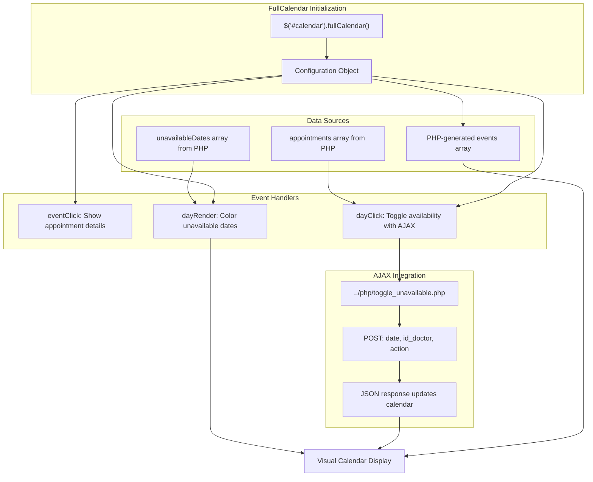
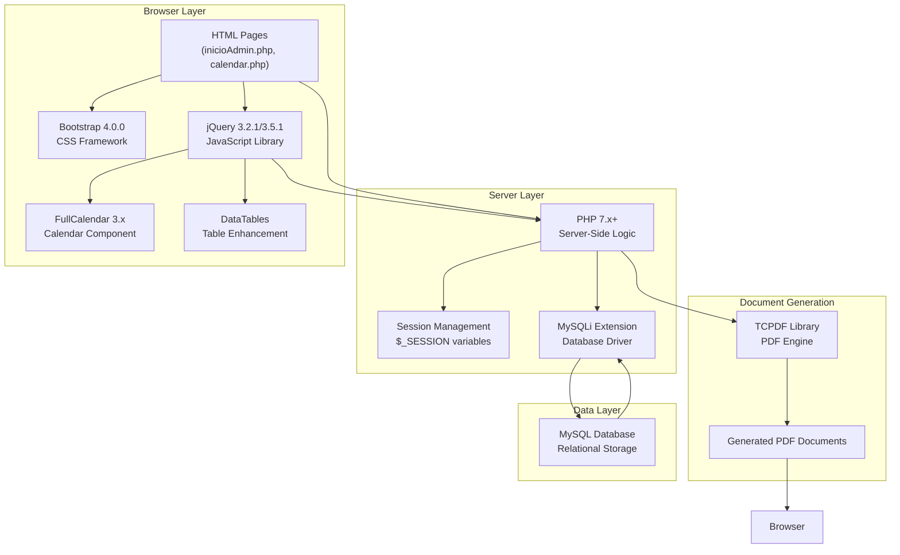
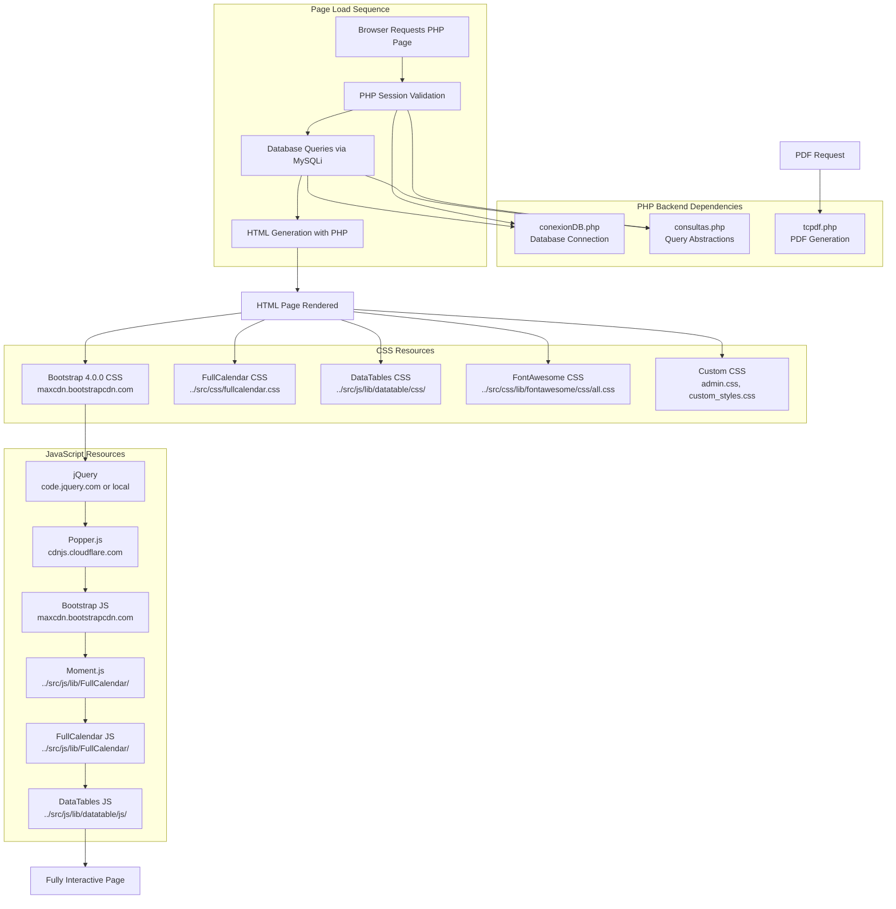
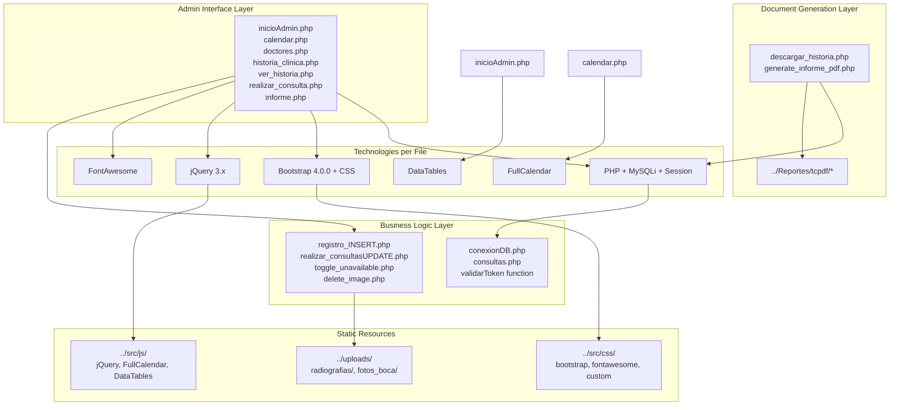

# Technology Stack

> **Relevant source files**
> * [.gitignore](https://github.com/axchisan/Consultorio_Emily_Bernal/blob/589034b9/.gitignore)
> * [Admin/calendar.php](https://github.com/axchisan/Consultorio_Emily_Bernal/blob/589034b9/Admin/calendar.php)
> * [Admin/descargar_historia.php](https://github.com/axchisan/Consultorio_Emily_Bernal/blob/589034b9/Admin/descargar_historia.php)
> * [Admin/inicioAdmin.php](https://github.com/axchisan/Consultorio_Emily_Bernal/blob/589034b9/Admin/inicioAdmin.php)

## Purpose and Scope

This page documents the complete technology stack used in the Consultorio Emily Bernal dental clinic management system, including server-side languages, database systems, frontend frameworks, and third-party libraries. For information about how these technologies are configured and deployed, see [Development Setup & Configuration](/axchisan/Consultorio_Emily_Bernal/8-development-setup-and-configuration). For details on specific library APIs and usage patterns, see the TCPDF Library Reference section [#9].

---

## Technology Overview

The system is built on a traditional LAMP-like stack with modern frontend enhancements. The following table summarizes all technologies and their primary purposes:

| Technology | Version | Purpose | Key Files |
| --- | --- | --- | --- |
| **PHP** | 7.x+ | Server-side scripting, business logic | All `Admin/*.php`, `php/*.php`, `crud/*.php` |
| **MySQL** | 5.x+ | Relational database via mysqli extension | `php/conexionDB.php` |
| **Bootstrap** | 4.0.0 | CSS framework, responsive layout | All admin pages |
| **jQuery** | 3.2.1 / 3.5.1 | DOM manipulation, AJAX | All admin pages |
| **FullCalendar** | 3.x | Interactive calendar UI | `Admin/calendar.php` |
| **DataTables** | Latest | Enhanced table functionality | `Admin/inicioAdmin.php`, `Admin/historia_clinica.php` |
| **TCPDF** | 6.x | PDF document generation | `Reportes/tcpdf/`, `Admin/descargar_historia.php` |
| **FontAwesome** | 5.x+ | Icon library | All admin interfaces |
| **Popper.js** | 1.12.9 | Tooltip positioning | Bootstrap dependency |
| **Moment.js** | Latest | Date manipulation for FullCalendar | `src/js/lib/FullCalendar/moment.min.js` |

---

## Backend Technology Stack

### PHP Server-Side Architecture

PHP serves as the primary server-side language handling all business logic, authentication, database operations, and view rendering. The system uses procedural PHP with session-based authentication.

**Key PHP Features Used:**

* **Session Management**: `session_start()`, `$_SESSION` variables for authentication state [Admin/inicioAdmin.php L2](https://github.com/axchisan/Consultorio_Emily_Bernal/blob/589034b9/Admin/inicioAdmin.php#L2-L2)
* **MySQLi Extension**: Prepared statements for SQL injection prevention [Admin/calendar.php L24-L32](https://github.com/axchisan/Consultorio_Emily_Bernal/blob/589034b9/Admin/calendar.php#L24-L32)
* **File Uploads**: `$_FILES` superglobal for medical image handling
* **Output Buffering**: `ob_start()` / `ob_end_clean()` for PDF generation [Admin/descargar_historia.php L2](https://github.com/axchisan/Consultorio_Emily_Bernal/blob/589034b9/Admin/descargar_historia.php#L2-L2)  [Admin/descargar_historia.php L289](https://github.com/axchisan/Consultorio_Emily_Bernal/blob/589034b9/Admin/descargar_historia.php#L289-L289)
* **Include System**: Modular architecture with `include_once()` for shared functions [Admin/calendar.php L5-L6](https://github.com/axchisan/Consultorio_Emily_Bernal/blob/589034b9/Admin/calendar.php#L5-L6)

**PHP Configuration Requirements:**

* `post_max_size`: Sufficient for medical image uploads
* `upload_max_filesize`: Configured for radiograph uploads
* `session.cookie_httponly`: Enabled for security
* `mysqli` extension enabled

### MySQL Database Layer

The system uses MySQL via the `mysqli` extension with prepared statements for all database operations. Database abstraction is provided through `php/conexionDB.php` and `php/consultas.php`.

**Database Connection Pattern:**

```
// From php/conexionDB.php (inferred pattern)
$link = mysqli_connect($host, $user, $password, $database);
```

**Prepared Statement Pattern:**
[Admin/calendar.php L24-L32](https://github.com/axchisan/Consultorio_Emily_Bernal/blob/589034b9/Admin/calendar.php#L24-L32)

 demonstrates the consistent pattern used throughout:

```sql
$stmtUnavailable = $link->prepare("SELECT unavailable_date FROM unavailable_dates WHERE id_doctor = ?");
$stmtUnavailable->bind_param("i", $vUsuario);
$stmtUnavailable->execute();
$resultadoUnavailable = $stmtUnavailable->get_result();
// ... fetch results ...
$stmtUnavailable->close();
```

**Query Abstraction Functions** (defined in `php/consultas.php`):

* `consultarDoctor($link, $id_doctor)`: Fetch doctor details
* `consultarPaciente($link, $id_paciente)`: Fetch patient data
* `MostrarCitas($link, $id_doctor)`: Retrieve appointments
* `validarToken($link, $user_id, $user_type, $token)`: Session token validation

**Sources:** [Admin/calendar.php L5-L6](https://github.com/axchisan/Consultorio_Emily_Bernal/blob/589034b9/Admin/calendar.php#L5-L6)

 [Admin/calendar.php L24-L32](https://github.com/axchisan/Consultorio_Emily_Bernal/blob/589034b9/Admin/calendar.php#L24-L32)

 [Admin/inicioAdmin.php L3-L4](https://github.com/axchisan/Consultorio_Emily_Bernal/blob/589034b9/Admin/inicioAdmin.php#L3-L4)

 [Admin/descargar_historia.php L5-L6](https://github.com/axchisan/Consultorio_Emily_Bernal/blob/589034b9/Admin/descargar_historia.php#L5-L6)

---

## Frontend Technology Stack

### Bootstrap Framework Integration

Bootstrap 4.0.0 provides the CSS foundation, grid system, and component library. The system uses Bootstrap's CDN delivery for core files and local copies for customizations.

**Bootstrap Components Used:**

* **Grid System**: Responsive layouts with `.container`, `.row`, `.col-md-*` classes
* **Card Components**: Content boxes via `.content-box-large` custom class
* **Modals**: Confirmation dialogs [Admin/calendar.php L88-L137](https://github.com/axchisan/Consultorio_Emily_Bernal/blob/589034b9/Admin/calendar.php#L88-L137)
* **Alerts**: Flash messages with `.alert` classes [Admin/inicioAdmin.php L94-L97](https://github.com/axchisan/Consultorio_Emily_Bernal/blob/589034b9/Admin/inicioAdmin.php#L94-L97)
* **Buttons**: `.btn`, `.btn-primary`, `.btn-success` styling
* **Tables**: `.table`, `.table-striped` for data display
* **Forms**: Input groups and validation styles
* **Breadcrumbs**: Navigation paths [Admin/calendar.php L179-L186](https://github.com/axchisan/Consultorio_Emily_Bernal/blob/589034b9/Admin/calendar.php#L179-L186)

**Bootstrap Integration Pattern:**
[Admin/calendar.php L70-L78](https://github.com/axchisan/Consultorio_Emily_Bernal/blob/589034b9/Admin/calendar.php#L70-L78)

 shows the typical resource loading:

```xml
<link rel="stylesheet" href="https://maxcdn.bootstrapcdn.com/bootstrap/4.0.0/css/bootstrap.min.css">
<script src="https://code.jquery.com/jquery-3.2.1.js"></script>
<script src="https://cdnjs.cloudflare.com/ajax/libs/popper.js/1.12.9/umd/popper.min.js"></script>
<script src="https://maxcdn.bootstrapcdn.com/bootstrap/4.0.0/js/bootstrap.min.js"></script>
```

**Custom Styling:**

* `src/css/admin.css`: Core admin layout styles
* `src/css/custom_styles.css`: Application-specific overrides

### jQuery JavaScript Library

jQuery serves as the primary JavaScript library for DOM manipulation, AJAX requests, and event handling. Two versions are used across different pages:

* **jQuery 3.2.1**: Used in calendar interface [Admin/calendar.php L76](https://github.com/axchisan/Consultorio_Emily_Bernal/blob/589034b9/Admin/calendar.php#L76-L76)
* **jQuery 3.5.1**: Used with DataTables [Admin/inicioAdmin.php L160](https://github.com/axchisan/Consultorio_Emily_Bernal/blob/589034b9/Admin/inicioAdmin.php#L160-L160)

**jQuery Usage Patterns:**

**1. AJAX Requests** [Admin/calendar.php L312-L368](https://github.com/axchisan/Consultorio_Emily_Bernal/blob/589034b9/Admin/calendar.php#L312-L368)

:

```yaml
$.ajax({
    url: '../php/toggle_unavailable.php',
    type: 'POST',
    data: { date: dateStr, id_doctor: vUsuario, action: action },
    success: function(response) { /* ... */ },
    error: function(xhr, status, error) { /* ... */ }
});
```

**2. DOM Manipulation** [Admin/calendar.php L278-L280](https://github.com/axchisan/Consultorio_Emily_Bernal/blob/589034b9/Admin/calendar.php#L278-L280)

:

```
$('#event-title').text(calEvent.title);
$('#event-description').html(calEvent.description);
$('#modal-event').modal();
```

**3. Event Listeners** [Admin/inicioAdmin.php L147-L154](https://github.com/axchisan/Consultorio_Emily_Bernal/blob/589034b9/Admin/inicioAdmin.php#L147-L154)

:

```javascript
document.addEventListener('DOMContentLoaded', () => {
    (document.querySelectorAll('.alert .delete') || []).forEach(($delete) => {
        // ... close alert handlers
    });
});
```

**Sources:** [Admin/calendar.php L70-L78](https://github.com/axchisan/Consultorio_Emily_Bernal/blob/589034b9/Admin/calendar.php#L70-L78)

 [Admin/calendar.php L312-L368](https://github.com/axchisan/Consultorio_Emily_Bernal/blob/589034b9/Admin/calendar.php#L312-L368)

 [Admin/inicioAdmin.php L147-L154](https://github.com/axchisan/Consultorio_Emily_Bernal/blob/589034b9/Admin/inicioAdmin.php#L147-L154)

---

## Third-Party Library Integration

### FullCalendar Library

FullCalendar provides the interactive calendar interface for appointment visualization and date availability management. The system uses FullCalendar 3.x with custom event rendering and day-click handlers.

**FullCalendar Resource Loading** [Admin/calendar.php L73-L81](https://github.com/axchisan/Consultorio_Emily_Bernal/blob/589034b9/Admin/calendar.php#L73-L81)

:

```xml
<link rel='stylesheet' type='text/css' href='../src/css/fullcalendar.css' />
<script type='text/javascript' src='../src/js/lib/FullCalendar/moment.min.js'></script>
<script type='text/javascript' src='../src/js/lib/FullCalendar/fullcalendar.min.js'></script>
<script type='text/javascript' src='../src/js/lib/FullCalendar/locale/es.js'></script>
```

**FullCalendar Configuration** [Admin/calendar.php L251-L371](https://github.com/axchisan/Consultorio_Emily_Bernal/blob/589034b9/Admin/calendar.php#L251-L371)

:



**Key FullCalendar Methods Used:**

* `fullCalendar('removeEvents', filterFunction)`: Remove events dynamically [Admin/calendar.php L335-L337](https://github.com/axchisan/Consultorio_Emily_Bernal/blob/589034b9/Admin/calendar.php#L335-L337)
* `$.fullCalendar.formatDate(date, format)`: Date formatting [Admin/calendar.php L283](https://github.com/axchisan/Consultorio_Emily_Bernal/blob/589034b9/Admin/calendar.php#L283-L283)  [Admin/calendar.php L289](https://github.com/axchisan/Consultorio_Emily_Bernal/blob/589034b9/Admin/calendar.php#L289-L289)
* Header configuration for navigation [Admin/calendar.php L252-L256](https://github.com/axchisan/Consultorio_Emily_Bernal/blob/589034b9/Admin/calendar.php#L252-L256)
* Spanish locale support via `es.js` [Admin/calendar.php L81](https://github.com/axchisan/Consultorio_Emily_Bernal/blob/589034b9/Admin/calendar.php#L81-L81)

**Sources:** [Admin/calendar.php L73-L81](https://github.com/axchisan/Consultorio_Emily_Bernal/blob/589034b9/Admin/calendar.php#L73-L81)

 [Admin/calendar.php L246-L372](https://github.com/axchisan/Consultorio_Emily_Bernal/blob/589034b9/Admin/calendar.php#L246-L372)

### DataTables Library

DataTables enhances HTML tables with sorting, searching, pagination, and responsive design. Used for appointment lists and clinical history displays.

**DataTables Resource Loading** [Admin/inicioAdmin.php L40-L42](https://github.com/axchisan/Consultorio_Emily_Bernal/blob/589034b9/Admin/inicioAdmin.php#L40-L42)

:

```
<link rel="stylesheet" href="../src/js/lib/datatable/css/jquery.dataTables.min.css">
<link rel="stylesheet" href="../src/js/lib/datatable/css/responsive.dataTables.min.css">
```

**DataTables JavaScript Loading** [Admin/inicioAdmin.php L160-L163](https://github.com/axchisan/Consultorio_Emily_Bernal/blob/589034b9/Admin/inicioAdmin.php#L160-L163)

:

```xml
<script src="../src/js/lib/datatable/js/jquery-3.5.1.js"></script>
<script src="../src/js/lib/datatable/js/jquery.dataTables.min.js"></script>
<script src="../src/js/lib/datatable/js/dataTables.responsive.min.js"></script>
<script src="../src/js/lib/datatable/datatable.js"></script>
```

**DataTables Initialization Pattern:**
The table is initialized via `src/js/lib/datatable/datatable.js` targeting `#example` table ID [Admin/inicioAdmin.php L103](https://github.com/axchisan/Consultorio_Emily_Bernal/blob/589034b9/Admin/inicioAdmin.php#L103-L103)

**Table Structure** [Admin/inicioAdmin.php L103-L134](https://github.com/axchisan/Consultorio_Emily_Bernal/blob/589034b9/Admin/inicioAdmin.php#L103-L134)

:

* Static HTML table generation via PHP loops
* DataTables enhances with client-side features
* Action columns contain icon buttons for edit/view/delete operations
* Responsive columns collapse on mobile devices

**Sources:** [Admin/inicioAdmin.php L40-L42](https://github.com/axchisan/Consultorio_Emily_Bernal/blob/589034b9/Admin/inicioAdmin.php#L40-L42)

 [Admin/inicioAdmin.php L103-L163](https://github.com/axchisan/Consultorio_Emily_Bernal/blob/589034b9/Admin/inicioAdmin.php#L103-L163)

### TCPDF Library

TCPDF is a pure PHP library for generating PDF documents. Used for clinical history and medical report PDFs with custom headers, tables, and image embedding.

**TCPDF Location and Loading** [Admin/descargar_historia.php L85-L88](https://github.com/axchisan/Consultorio_Emily_Bernal/blob/589034b9/Admin/descargar_historia.php#L85-L88)

:

```
if (!file_exists('../Reportes/tcpdf/tcpdf.php')) {
    die("Error: No se encontró el archivo TCPDF en '../Reportes/tcpdf/tcpdf.php'");
}
require_once '../Reportes/tcpdf/tcpdf.php';
```

**TCPDF Instantiation Pattern** [Admin/descargar_historia.php L91](https://github.com/axchisan/Consultorio_Emily_Bernal/blob/589034b9/Admin/descargar_historia.php#L91-L91)

:

```
$pdf = new TCPDF(PDF_PAGE_ORIENTATION, PDF_UNIT, PDF_PAGE_FORMAT, true, 'UTF-8', false);
```

**TCPDF Core Methods Used:**

* `SetCreator()`, `SetAuthor()`, `SetTitle()`: Document metadata [Admin/descargar_historia.php L94-L98](https://github.com/axchisan/Consultorio_Emily_Bernal/blob/589034b9/Admin/descargar_historia.php#L94-L98)
* `setPrintHeader(false)`, `setPrintFooter(false)`: Disable default headers/footers [Admin/descargar_historia.php L99-L100](https://github.com/axchisan/Consultorio_Emily_Bernal/blob/589034b9/Admin/descargar_historia.php#L99-L100)
* `SetMargins()`, `SetAutoPageBreak()`: Page layout [Admin/descargar_historia.php L101-L102](https://github.com/axchisan/Consultorio_Emily_Bernal/blob/589034b9/Admin/descargar_historia.php#L101-L102)
* `AddPage()`: Page creation [Admin/descargar_historia.php L105](https://github.com/axchisan/Consultorio_Emily_Bernal/blob/589034b9/Admin/descargar_historia.php#L105-L105)
* `SetFillColor()`, `SetTextColor()`, `SetDrawColor()`: Styling [Admin/descargar_historia.php L108](https://github.com/axchisan/Consultorio_Emily_Bernal/blob/589034b9/Admin/descargar_historia.php#L108-L108)  [Admin/descargar_historia.php L118](https://github.com/axchisan/Consultorio_Emily_Bernal/blob/589034b9/Admin/descargar_historia.php#L118-L118)
* `Rect()`: Rectangle drawing for backgrounds [Admin/descargar_historia.php L109](https://github.com/axchisan/Consultorio_Emily_Bernal/blob/589034b9/Admin/descargar_historia.php#L109-L109)
* `Image()`: Logo embedding [Admin/descargar_historia.php L113](https://github.com/axchisan/Consultorio_Emily_Bernal/blob/589034b9/Admin/descargar_historia.php#L113-L113)
* `Cell()`, `MultiCell()`: Text rendering [Admin/descargar_historia.php L120-L270](https://github.com/axchisan/Consultorio_Emily_Bernal/blob/589034b9/Admin/descargar_historia.php#L120-L270)
* `Line()`: Separator lines [Admin/descargar_historia.php L136](https://github.com/axchisan/Consultorio_Emily_Bernal/blob/589034b9/Admin/descargar_historia.php#L136-L136)
* `Output()`: PDF generation with 'D' mode for download [Admin/descargar_historia.php L292](https://github.com/axchisan/Consultorio_Emily_Bernal/blob/589034b9/Admin/descargar_historia.php#L292-L292)

For comprehensive TCPDF API documentation, see sections [#9.1](/axchisan/Consultorio_Emily_Bernal/9.1-tcpdf-core-methods) through [#9.8](/axchisan/Consultorio_Emily_Bernal/9.8-tcpdf-version-history).

**Sources:** [Admin/descargar_historia.php L85-L292](https://github.com/axchisan/Consultorio_Emily_Bernal/blob/589034b9/Admin/descargar_historia.php#L85-L292)

---

## Technology Integration Architecture

### Frontend-Backend Integration Flow



**Sources:** [Admin/calendar.php L1-L380](https://github.com/axchisan/Consultorio_Emily_Bernal/blob/589034b9/Admin/calendar.php#L1-L380)

 [Admin/inicioAdmin.php L1-L165](https://github.com/axchisan/Consultorio_Emily_Bernal/blob/589034b9/Admin/inicioAdmin.php#L1-L165)

 [Admin/descargar_historia.php L1-L293](https://github.com/axchisan/Consultorio_Emily_Bernal/blob/589034b9/Admin/descargar_historia.php#L1-L293)

### Dependency Resolution and Resource Loading



**Dependency Relationships:**

| Component | Depends On | Purpose |
| --- | --- | --- |
| Bootstrap JavaScript | jQuery, Popper.js | Modal, tooltip, collapse functionality |
| FullCalendar | jQuery, Moment.js | Calendar rendering and date manipulation |
| DataTables | jQuery | Table enhancement features |
| All Admin Pages | `conexionDB.php`, `consultas.php` | Database connectivity |
| PDF Generators | TCPDF, Database queries | Document creation |

**Sources:** [Admin/calendar.php L70-L81](https://github.com/axchisan/Consultorio_Emily_Bernal/blob/589034b9/Admin/calendar.php#L70-L81)

 [Admin/inicioAdmin.php L36-L163](https://github.com/axchisan/Consultorio_Emily_Bernal/blob/589034b9/Admin/inicioAdmin.php#L36-L163)

 [.gitignore L1-L7](https://github.com/axchisan/Consultorio_Emily_Bernal/blob/589034b9/.gitignore#L1-L7)

### CDN vs Local Resource Strategy

The system employs a mixed strategy for resource loading:

**CDN Resources** (External):

* Bootstrap CSS/JS: `maxcdn.bootstrapcdn.com` [Admin/calendar.php L70](https://github.com/axchisan/Consultorio_Emily_Bernal/blob/589034b9/Admin/calendar.php#L70-L70)  [Admin/calendar.php L78](https://github.com/axchisan/Consultorio_Emily_Bernal/blob/589034b9/Admin/calendar.php#L78-L78)
* jQuery: `code.jquery.com` [Admin/calendar.php L76](https://github.com/axchisan/Consultorio_Emily_Bernal/blob/589034b9/Admin/calendar.php#L76-L76)
* Popper.js: `cdnjs.cloudflare.com` [Admin/calendar.php L77](https://github.com/axchisan/Consultorio_Emily_Bernal/blob/589034b9/Admin/calendar.php#L77-L77)

**Local Resources** (Bundled):

* FullCalendar: `../src/js/lib/FullCalendar/` [Admin/calendar.php L79-L81](https://github.com/axchisan/Consultorio_Emily_Bernal/blob/589034b9/Admin/calendar.php#L79-L81)
* DataTables: `../src/js/lib/datatable/` [Admin/inicioAdmin.php L160-L162](https://github.com/axchisan/Consultorio_Emily_Bernal/blob/589034b9/Admin/inicioAdmin.php#L160-L162)
* TCPDF: `../Reportes/tcpdf/` [Admin/descargar_historia.php L88](https://github.com/axchisan/Consultorio_Emily_Bernal/blob/589034b9/Admin/descargar_historia.php#L88-L88)
* FontAwesome: `../src/css/lib/fontawesome/` [Admin/calendar.php L72](https://github.com/axchisan/Consultorio_Emily_Bernal/blob/589034b9/Admin/calendar.php#L72-L72)
* Custom JavaScript: `../src/js/admin.js` [Admin/calendar.php L228](https://github.com/axchisan/Consultorio_Emily_Bernal/blob/589034b9/Admin/calendar.php#L228-L228)

**Excluded from Version Control** [.gitignore L1-L7](https://github.com/axchisan/Consultorio_Emily_Bernal/blob/589034b9/.gitignore#L1-L7)

:

```
node_modules/
_recursos_/AnyChart
_recursos_/DataTables
_recursos_/jquery-confirm-v3.3.4
```

**Rationale:**

* CDN resources reduce server load and leverage browser caching
* Local resources ensure availability when customizations are needed
* Third-party libraries excluded from Git to reduce repository size

**Sources:** [Admin/calendar.php L70-L81](https://github.com/axchisan/Consultorio_Emily_Bernal/blob/589034b9/Admin/calendar.php#L70-L81)

 [Admin/inicioAdmin.php L36-L42](https://github.com/axchisan/Consultorio_Emily_Bernal/blob/589034b9/Admin/inicioAdmin.php#L36-L42)

 [Admin/inicioAdmin.php L157-L163](https://github.com/axchisan/Consultorio_Emily_Bernal/blob/589034b9/Admin/inicioAdmin.php#L157-L163)

 [.gitignore L1-L7](https://github.com/axchisan/Consultorio_Emily_Bernal/blob/589034b9/.gitignore#L1-L7)

---

## Version Compatibility and Requirements

### Minimum System Requirements

**Server Requirements:**

* PHP 7.0+ (for prepared statement support and modern language features)
* MySQL 5.5+ or MariaDB 10.0+ (for InnoDB engine and foreign keys)
* Apache 2.4+ or Nginx 1.10+ (with URL rewriting enabled)
* PHP Extensions: `mysqli`, `gd`, `mbstring`, `session`
* File upload directory with write permissions: `../uploads/`

**Browser Requirements:**

* Modern browsers supporting ES5 JavaScript (Chrome 49+, Firefox 52+, Safari 10+, Edge 14+)
* CSS Grid and Flexbox support for Bootstrap layouts
* JavaScript enabled for interactive components
* Minimum viewport width: 320px for responsive design

### Technology Version Matrix

| Technology | Version Used | Latest Stable | Notes |
| --- | --- | --- | --- |
| Bootstrap | 4.0.0 | 5.3+ | Major version upgrade available; breaking changes in v5 |
| jQuery | 3.2.1 / 3.5.1 | 3.7+ | Minor patches available; compatible |
| FullCalendar | 3.x | 6.x | v4+ requires rebuild due to API changes |
| DataTables | 1.10.x | 1.13+ | Compatible upgrades available |
| TCPDF | 6.x | 6.6+ | Security patches recommended |
| Popper.js | 1.12.9 | 2.11+ | v2+ required for Bootstrap 5 upgrade |
| Moment.js | 2.x | 2.29+ | Note: Moment.js is in maintenance mode |

**Upgrade Considerations:**

* Bootstrap 5 upgrade requires Popper.js v2 and jQuery removal from core
* FullCalendar v4+ has completely rewritten API requiring code refactoring
* Moment.js should be replaced with Luxon or Day.js in future versions

**Sources:** [Admin/calendar.php L70-L81](https://github.com/axchisan/Consultorio_Emily_Bernal/blob/589034b9/Admin/calendar.php#L70-L81)

 [Admin/inicioAdmin.php L36-L42](https://github.com/axchisan/Consultorio_Emily_Bernal/blob/589034b9/Admin/inicioAdmin.php#L36-L42)

---

## Code Entity to Technology Mapping

### File-Level Technology Distribution



### Technology-Specific Entry Points

**Bootstrap Entry Points:**

* Class names: `.container`, `.row`, `.col-md-*`, `.btn`, `.btn-primary`, `.alert`, `.modal`, `.table`, `.form-control`
* Modal IDs: `#confirmationModal`, `#alertModal`, `#modal-event` [Admin/calendar.php L88-L137](https://github.com/axchisan/Consultorio_Emily_Bernal/blob/589034b9/Admin/calendar.php#L88-L137)
* CDN: `https://maxcdn.bootstrapcdn.com/bootstrap/4.0.0/css/bootstrap.min.css`

**jQuery Entry Points:**

* Global object: `$` or `jQuery`
* AJAX method: `$.ajax()` [Admin/calendar.php L312](https://github.com/axchisan/Consultorio_Emily_Bernal/blob/589034b9/Admin/calendar.php#L312-L312)
* Selector usage: `$('#calendar')`, `$('.alert .delete')`
* CDN: `https://code.jquery.com/jquery-3.2.1.js`

**FullCalendar Entry Points:**

* Initialization: `$('#calendar').fullCalendar({...})` [Admin/calendar.php L251](https://github.com/axchisan/Consultorio_Emily_Bernal/blob/589034b9/Admin/calendar.php#L251-L251)
* Calendar div: `<div id="calendar"></div>` [Admin/calendar.php L196](https://github.com/axchisan/Consultorio_Emily_Bernal/blob/589034b9/Admin/calendar.php#L196-L196)
* Local path: `../src/js/lib/FullCalendar/fullcalendar.min.js`

**DataTables Entry Points:**

* Table ID: `#example` [Admin/inicioAdmin.php L103](https://github.com/axchisan/Consultorio_Emily_Bernal/blob/589034b9/Admin/inicioAdmin.php#L103-L103)
* Initialization script: `../src/js/lib/datatable/datatable.js` [Admin/inicioAdmin.php L163](https://github.com/axchisan/Consultorio_Emily_Bernal/blob/589034b9/Admin/inicioAdmin.php#L163-L163)
* CSS classes: `.table.table-striped.nowrap.responsive`

**TCPDF Entry Points:**

* Class instantiation: `new TCPDF(...)` [Admin/descargar_historia.php L91](https://github.com/axchisan/Consultorio_Emily_Bernal/blob/589034b9/Admin/descargar_historia.php#L91-L91)
* Include path: `../Reportes/tcpdf/tcpdf.php` [Admin/descargar_historia.php L88](https://github.com/axchisan/Consultorio_Emily_Bernal/blob/589034b9/Admin/descargar_historia.php#L88-L88)
* PDF generators: `descargar_historia.php`, `generate_informe_pdf.php`

**MySQLi Entry Points:**

* Connection variable: `$link` (global database connection)
* Prepare method: `$link->prepare("SELECT ...")` [Admin/calendar.php L24](https://github.com/axchisan/Consultorio_Emily_Bernal/blob/589034b9/Admin/calendar.php#L24-L24)
* Connection file: `../php/conexionDB.php` [Admin/calendar.php L5](https://github.com/axchisan/Consultorio_Emily_Bernal/blob/589034b9/Admin/calendar.php#L5-L5)

**Sources:** [Admin/calendar.php L5-L380](https://github.com/axchisan/Consultorio_Emily_Bernal/blob/589034b9/Admin/calendar.php#L5-L380)

 [Admin/inicioAdmin.php L1-L165](https://github.com/axchisan/Consultorio_Emily_Bernal/blob/589034b9/Admin/inicioAdmin.php#L1-L165)

 [Admin/descargar_historia.php L1-L293](https://github.com/axchisan/Consultorio_Emily_Bernal/blob/589034b9/Admin/descargar_historia.php#L1-L293)