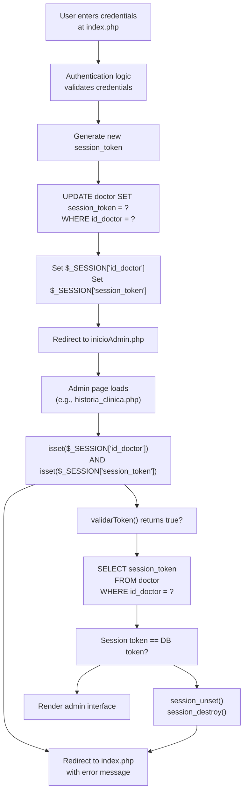

# Token Validation System

> **Relevant source files**
> * [Admin/historia_clinica.php](https://github.com/axchisan/Consultorio_Emily_Bernal/blob/589034b9/Admin/historia_clinica.php)
> * [Admin/inicioAdmin.php](https://github.com/axchisan/Consultorio_Emily_Bernal/blob/589034b9/Admin/inicioAdmin.php)
> * [Admin/ver_historia.php](https://github.com/axchisan/Consultorio_Emily_Bernal/blob/589034b9/Admin/ver_historia.php)

## Purpose and Scope

The Token Validation System provides concurrent session prevention by validating session tokens against the database on every administrative page load. This ensures that when a doctor logs in from a new device or browser, all previous sessions are automatically invalidated, preventing unauthorized access from unattended sessions.

For information about initial session establishment during login, see [Session Management](/axchisan/Consultorio_Emily_Bernal/5.1-session-management). For SQL injection prevention techniques used in token queries, see [SQL Injection Prevention](/axchisan/Consultorio_Emily_Bernal/5.3-sql-injection-prevention). For overall access control mechanisms, see [Access Control & Authorization](/axchisan/Consultorio_Emily_Bernal/5.4-access-control-and-authorization).

---

## System Overview

The token validation system operates as a gateway check on all administrative pages. Every page in the `Admin/` directory performs a two-tier authentication check before rendering:

1. **Session existence check**: Validates that `$_SESSION['id_doctor']` and `$_SESSION['session_token']` are set
2. **Token database validation**: Calls `validarToken()` to verify the session token matches the database record

When token validation fails, the system immediately destroys the session and redirects the user to the login page with an explanatory message.

**Sources:** [Admin/historia_clinica.php L6-L24](https://github.com/axchisan/Consultorio_Emily_Bernal/blob/589034b9/Admin/historia_clinica.php#L6-L24)

 [Admin/inicioAdmin.php L6-L24](https://github.com/axchisan/Consultorio_Emily_Bernal/blob/589034b9/Admin/inicioAdmin.php#L6-L24)

 [Admin/ver_historia.php L6-L23](https://github.com/axchisan/Consultorio_Emily_Bernal/blob/589034b9/Admin/ver_historia.php#L6-L23)

---

## Core Function: validarToken()

The `validarToken()` function is defined in the `consultas.php` abstraction layer and serves as the central validation mechanism. Although the function implementation is not visible in the provided files, its signature and behavior can be inferred from its usage pattern:

```

```

### Function Parameters

| Parameter | Type | Description |
| --- | --- | --- |
| `$link` | mysqli connection | Database connection resource from `conexionDB.php` |
| `$vUsuario` | int | Doctor ID from `$_SESSION['id_doctor']` |
| User type | string | Literal `'Doctor'` indicating the user table to query |
| Session token | string | Token from `$_SESSION['session_token']` |

### Return Value

* **`true`**: Session token matches the database record (valid session)
* **`false`**: Token mismatch detected (concurrent login occurred)

**Sources:** [Admin/historia_clinica.php L17](https://github.com/axchisan/Consultorio_Emily_Bernal/blob/589034b9/Admin/historia_clinica.php#L17-L17)

 [Admin/inicioAdmin.php L17](https://github.com/axchisan/Consultorio_Emily_Bernal/blob/589034b9/Admin/inicioAdmin.php#L17-L17)

 [Admin/ver_historia.php L16](https://github.com/axchisan/Consultorio_Emily_Bernal/blob/589034b9/Admin/ver_historia.php#L16-L16)

---

## Token Validation Flow

The following diagram illustrates the complete token validation sequence executed on every administrative page request:

```

```

**Sources:** [Admin/historia_clinica.php L6-L24](https://github.com/axchisan/Consultorio_Emily_Bernal/blob/589034b9/Admin/historia_clinica.php#L6-L24)

 [Admin/inicioAdmin.php L6-L24](https://github.com/axchisan/Consultorio_Emily_Bernal/blob/589034b9/Admin/inicioAdmin.php#L6-L24)

 [Admin/ver_historia.php L6-L23](https://github.com/axchisan/Consultorio_Emily_Bernal/blob/589034b9/Admin/ver_historia.php#L6-L23)

---

## Implementation Pattern

All administrative pages implement an identical validation pattern at the beginning of the file. The following sections detail each step of this pattern:

### Step 1: Session Initialization and Basic Checks

```

```

This block establishes the session, loads database utilities, and performs the first tier of authentication by checking session variable existence.

**Sources:** [Admin/historia_clinica.php L2-L12](https://github.com/axchisan/Consultorio_Emily_Bernal/blob/589034b9/Admin/historia_clinica.php#L2-L12)

 [Admin/inicioAdmin.php L2-L12](https://github.com/axchisan/Consultorio_Emily_Bernal/blob/589034b9/Admin/inicioAdmin.php#L2-L12)

 [Admin/ver_historia.php L2-L12](https://github.com/axchisan/Consultorio_Emily_Bernal/blob/589034b9/Admin/ver_historia.php#L2-L12)

### Step 2: Token Validation Against Database

```

```

This block calls `validarToken()` and, on failure, performs a complete session cleanup before redirecting.

**Sources:** [Admin/historia_clinica.php L14-L24](https://github.com/axchisan/Consultorio_Emily_Bernal/blob/589034b9/Admin/historia_clinica.php#L14-L24)

 [Admin/inicioAdmin.php L14-L24](https://github.com/axchisan/Consultorio_Emily_Bernal/blob/589034b9/Admin/inicioAdmin.php#L14-L24)

 [Admin/ver_historia.php L14-L23](https://github.com/axchisan/Consultorio_Emily_Bernal/blob/589034b9/Admin/ver_historia.php#L14-L23)

---

## Database Schema Integration

The token validation system relies on the `session_token` field in the `doctor` table. The following diagram shows the data structure and validation query flow:

```css
#mermaid-o3pz6d3404{font-family:ui-sans-serif,-apple-system,system-ui,Segoe UI,Helvetica;font-size:16px;fill:#333;}@keyframes edge-animation-frame{from{stroke-dashoffset:0;}}@keyframes dash{to{stroke-dashoffset:0;}}#mermaid-o3pz6d3404 .edge-animation-slow{stroke-dasharray:9,5!important;stroke-dashoffset:900;animation:dash 50s linear infinite;stroke-linecap:round;}#mermaid-o3pz6d3404 .edge-animation-fast{stroke-dasharray:9,5!important;stroke-dashoffset:900;animation:dash 20s linear infinite;stroke-linecap:round;}#mermaid-o3pz6d3404 .error-icon{fill:#dddddd;}#mermaid-o3pz6d3404 .error-text{fill:#222222;stroke:#222222;}#mermaid-o3pz6d3404 .edge-thickness-normal{stroke-width:1px;}#mermaid-o3pz6d3404 .edge-thickness-thick{stroke-width:3.5px;}#mermaid-o3pz6d3404 .edge-pattern-solid{stroke-dasharray:0;}#mermaid-o3pz6d3404 .edge-thickness-invisible{stroke-width:0;fill:none;}#mermaid-o3pz6d3404 .edge-pattern-dashed{stroke-dasharray:3;}#mermaid-o3pz6d3404 .edge-pattern-dotted{stroke-dasharray:2;}#mermaid-o3pz6d3404 .marker{fill:#999;stroke:#999;}#mermaid-o3pz6d3404 .marker.cross{stroke:#999;}#mermaid-o3pz6d3404 svg{font-family:ui-sans-serif,-apple-system,system-ui,Segoe UI,Helvetica;font-size:16px;}#mermaid-o3pz6d3404 p{margin:0;}#mermaid-o3pz6d3404 .entityBox{fill:#ffffff;stroke:#dddddd;}#mermaid-o3pz6d3404 .relationshipLabelBox{fill:#dddddd;opacity:0.7;background-color:#dddddd;}#mermaid-o3pz6d3404 .relationshipLabelBox rect{opacity:0.5;}#mermaid-o3pz6d3404 .labelBkg{background-color:rgba(221, 221, 221, 0.5);}#mermaid-o3pz6d3404 .edgeLabel .label{fill:#dddddd;font-size:14px;}#mermaid-o3pz6d3404 .label{font-family:ui-sans-serif,-apple-system,system-ui,Segoe UI,Helvetica;color:#333;}#mermaid-o3pz6d3404 .edge-pattern-dashed{stroke-dasharray:8,8;}#mermaid-o3pz6d3404 .node rect,#mermaid-o3pz6d3404 .node circle,#mermaid-o3pz6d3404 .node ellipse,#mermaid-o3pz6d3404 .node polygon{fill:#ffffff;stroke:#dddddd;stroke-width:1px;}#mermaid-o3pz6d3404 .relationshipLine{stroke:#999;stroke-width:1;fill:none;}#mermaid-o3pz6d3404 .marker{fill:none!important;stroke:#999!important;stroke-width:1;}#mermaid-o3pz6d3404 :root{--mermaid-font-family:"trebuchet ms",verdana,arial,sans-serif;}validates againstDOCTORintid_doctorPKstringnombreDstringapellidostringcorreo_electronicostringpasswordstringsession_tokenCurrent active tokenSESSION_DATAintid_doctorFrom $_SESSIONstringsession_tokenFrom $_SESSION
```

### Token Storage and Comparison

| Component | Location | Purpose |
| --- | --- | --- |
| **Stored Token** | `doctor.session_token` column | Authoritative token, updated on each login |
| **Session Token** | `$_SESSION['session_token']` variable | Token established at login time |
| **Validation Query** | `validarToken()` function | Compares session token against database |

When a doctor logs in from a new device, the login process updates `doctor.session_token` to a new value. This immediately invalidates all other sessions holding the old token.

**Sources:** [Admin/historia_clinica.php L17](https://github.com/axchisan/Consultorio_Emily_Bernal/blob/589034b9/Admin/historia_clinica.php#L17-L17)

 [Admin/inicioAdmin.php L17](https://github.com/axchisan/Consultorio_Emily_Bernal/blob/589034b9/Admin/inicioAdmin.php#L17-L17)

 [Admin/ver_historia.php L16](https://github.com/axchisan/Consultorio_Emily_Bernal/blob/589034b9/Admin/ver_historia.php#L16-L16)

---

## Page Coverage

The token validation system is implemented across all administrative interfaces. The following table documents the implementation consistency:

| Page | File Path | Token Check Line | Purpose |
| --- | --- | --- | --- |
| Dashboard | `Admin/inicioAdmin.php` | [17](https://github.com/axchisan/Consultorio_Emily_Bernal/blob/589034b9/17) | Appointment management |
| Clinical History List | `Admin/historia_clinica.php` | [17](https://github.com/axchisan/Consultorio_Emily_Bernal/blob/589034b9/17) | Completed appointments |
| Clinical History Viewer | `Admin/ver_historia.php` | [16](https://github.com/axchisan/Consultorio_Emily_Bernal/blob/589034b9/16) | Detailed patient records |
| Calendar | `Admin/calendar.php` | (not provided) | Schedule management |
| Medical Report Editor | `Admin/informe.php` | (not provided) | Report creation |
| Doctor Management | `Admin/doctores.php` | (not provided) | Staff administration |
| Consultation Interface | `Admin/realizar_consulta.php` | (not provided) | Diagnosis entry |

**Sources:** [Admin/historia_clinica.php L17](https://github.com/axchisan/Consultorio_Emily_Bernal/blob/589034b9/Admin/historia_clinica.php#L17-L17)

 [Admin/inicioAdmin.php L17](https://github.com/axchisan/Consultorio_Emily_Bernal/blob/589034b9/Admin/inicioAdmin.php#L17-L17)

 [Admin/ver_historia.php L16](https://github.com/axchisan/Consultorio_Emily_Bernal/blob/589034b9/Admin/ver_historia.php#L16-L16)

---

## Security Mechanisms

The token validation system provides multiple layers of security:

### Concurrent Login Prevention

The primary security feature prevents simultaneous access from multiple locations. When a doctor's credentials are used to log in from a second device:

1. New login generates a fresh `session_token`
2. Token is written to `doctor.session_token` in database
3. Original device's next page request fails `validarToken()` check
4. Original session is destroyed automatically

### Session Destruction Process

On token validation failure, the system performs a thorough cleanup:

```

```

This two-step process ensures complete session termination, preventing any residual access.

**Sources:** [Admin/historia_clinica.php L18-L19](https://github.com/axchisan/Consultorio_Emily_Bernal/blob/589034b9/Admin/historia_clinica.php#L18-L19)

 [Admin/inicioAdmin.php L18-L19](https://github.com/axchisan/Consultorio_Emily_Bernal/blob/589034b9/Admin/inicioAdmin.php#L18-L19)

 [Admin/ver_historia.php L17-L18](https://github.com/axchisan/Consultorio_Emily_Bernal/blob/589034b9/Admin/ver_historia.php#L17-L18)

### Immediate Exit Pattern

All validation failures use the `exit()` statement after the redirect to prevent any further code execution:

```

```

This ensures that even if output buffering or other factors prevent the redirect from being immediate, no sensitive data is processed or displayed.

**Sources:** [Admin/historia_clinica.php L11-L23](https://github.com/axchisan/Consultorio_Emily_Bernal/blob/589034b9/Admin/historia_clinica.php#L11-L23)

 [Admin/inicioAdmin.php L11-L23](https://github.com/axchisan/Consultorio_Emily_Bernal/blob/589034b9/Admin/inicioAdmin.php#L11-L23)

 [Admin/ver_historia.php L11-L22](https://github.com/axchisan/Consultorio_Emily_Bernal/blob/589034b9/Admin/ver_historia.php#L11-L22)

---

## Error Messages and User Feedback

The system provides context-specific error messages through the session-based flash messaging system:

### Session Not Initiated

```

```

Displayed when: User attempts to access an admin page without logging in.

**Sources:** [Admin/historia_clinica.php L8-L9](https://github.com/axchisan/Consultorio_Emily_Bernal/blob/589034b9/Admin/historia_clinica.php#L8-L9)

 [Admin/inicioAdmin.php L8-L9](https://github.com/axchisan/Consultorio_Emily_Bernal/blob/589034b9/Admin/inicioAdmin.php#L8-L9)

 [Admin/ver_historia.php L8-L9](https://github.com/axchisan/Consultorio_Emily_Bernal/blob/589034b9/Admin/ver_historia.php#L8-L9)

### Concurrent Login Detected

```

```

Displayed when: Token validation fails due to a new login from another device.

**Sources:** [Admin/historia_clinica.php L20-L21](https://github.com/axchisan/Consultorio_Emily_Bernal/blob/589034b9/Admin/historia_clinica.php#L20-L21)

 [Admin/inicioAdmin.php L20-L21](https://github.com/axchisan/Consultorio_Emily_Bernal/blob/589034b9/Admin/inicioAdmin.php#L20-L21)

 [Admin/ver_historia.php L19-L20](https://github.com/axchisan/Consultorio_Emily_Bernal/blob/589034b9/Admin/ver_historia.php#L19-L20)

### Message Display Mechanism

Both error messages use the Bootstrap class `p-3 mb-2 bg-danger text-white` for consistent danger-level alert styling. These messages survive the redirect and are displayed on the login page through the session-based messaging system described in [Session-Based Flash Messaging](/axchisan/Consultorio_Emily_Bernal/7.5-session-based-flash-messaging).

---

## Integration with Authentication Flow

The following diagram shows how token validation integrates with the broader authentication lifecycle:



**Sources:** [Admin/historia_clinica.php L6-L24](https://github.com/axchisan/Consultorio_Emily_Bernal/blob/589034b9/Admin/historia_clinica.php#L6-L24)

 [Admin/inicioAdmin.php L6-L24](https://github.com/axchisan/Consultorio_Emily_Bernal/blob/589034b9/Admin/inicioAdmin.php#L6-L24)

 [Admin/ver_historia.php L6-L23](https://github.com/axchisan/Consultorio_Emily_Bernal/blob/589034b9/Admin/ver_historia.php#L6-L23)

---

## Code Architecture Summary

The token validation system demonstrates a consistent architectural pattern across the application:

### Required Includes

Every protected page requires two includes:

* `../php/conexionDB.php` - Provides `$link` database connection
* `../php/consultas.php` - Provides `validarToken()` function

### Validation Sequence

The standard validation sequence appears in this exact order on every admin page:

1. `session_start()`
2. Include database utilities
3. Check session variable existence
4. Call `validarToken()` with database connection
5. On failure: destroy session and redirect
6. On success: continue with page-specific logic

This consistency ensures that no admin page can be accessed without proper token validation, creating a defense-in-depth security model.

**Sources:** [Admin/historia_clinica.php L2-L24](https://github.com/axchisan/Consultorio_Emily_Bernal/blob/589034b9/Admin/historia_clinica.php#L2-L24)

 [Admin/inicioAdmin.php L2-L24](https://github.com/axchisan/Consultorio_Emily_Bernal/blob/589034b9/Admin/inicioAdmin.php#L2-L24)

 [Admin/ver_historia.php L2-L23](https://github.com/axchisan/Consultorio_Emily_Bernal/blob/589034b9/Admin/ver_historia.php#L2-L23)