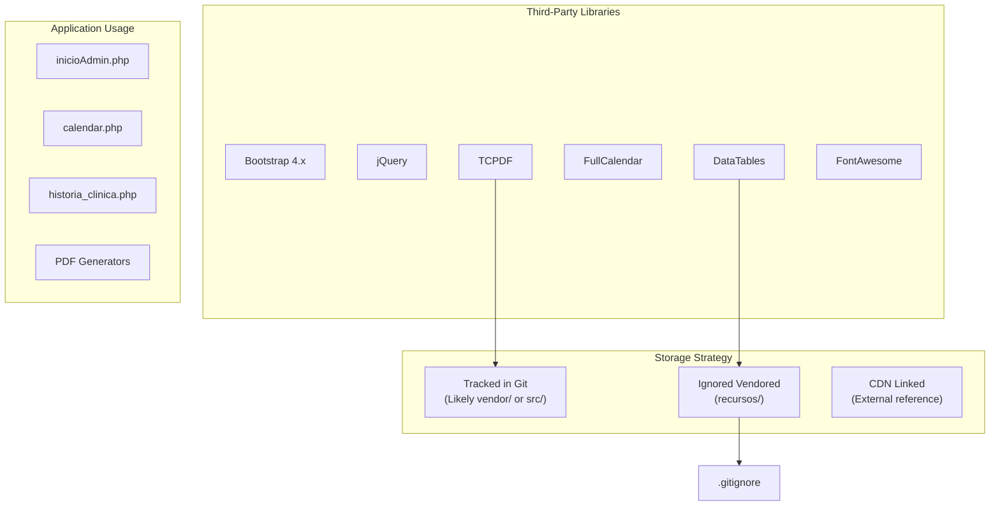
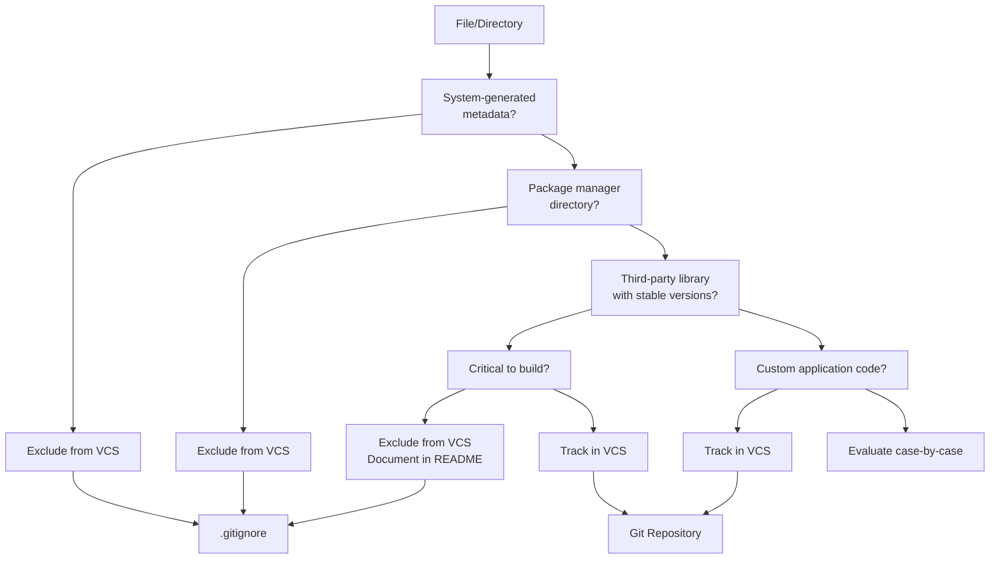
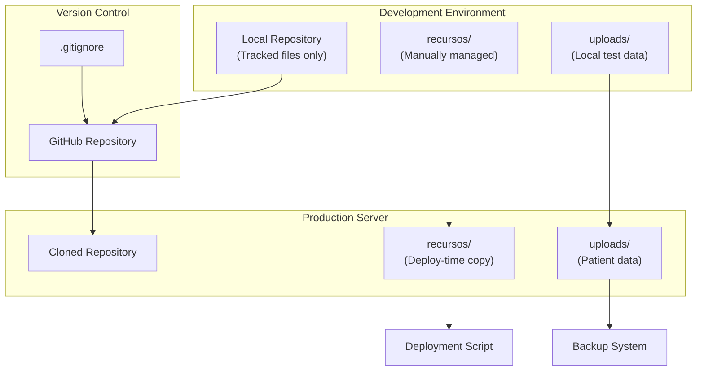

# Version Control Configuration

> **Relevant source files**
> * [.gitignore](https://github.com/axchisan/Consultorio_Emily_Bernal/blob/589034b9/.gitignore)

## Purpose and Scope

This document explains the version control configuration for the Consultorio Emily Bernal project, focusing on the `.gitignore` file and the strategy for managing dependencies and third-party resources. It details which files and directories are excluded from version control and the rationale behind these decisions.

For information about the overall project structure and directory organization, see [Project Structure](/axchisan/Consultorio_Emily_Bernal/8.1-project-structure). For details on external dependencies and their versions, see [Dependencies & Libraries](/axchisan/Consultorio_Emily_Bernal/8.2-dependencies-and-libraries).

---

## Overview of Version Control Strategy

The project implements a selective version control strategy that excludes system-specific files, package manager directories, and certain third-party resources from the repository. This approach balances the need for reproducible builds with repository size management and development workflow efficiency.

The version control configuration is defined in [.gitignore L1-L7](https://github.com/axchisan/Consultorio_Emily_Bernal/blob/589034b9/.gitignore#L1-L7)

 which contains five exclusion rules that protect against committing unnecessary or environment-specific files.

Sources: [.gitignore L1-L7](https://github.com/axchisan/Consultorio_Emily_Bernal/blob/589034b9/.gitignore#L1-L7)

---

## .gitignore Configuration

### Complete Exclusion Rules

The `.gitignore` file defines the following exclusion patterns:

| Line | Pattern | Type | Purpose |
| --- | --- | --- | --- |
| 1 | `.DS_Store` | System File | macOS metadata |
| 2 | `node_modules/` | Package Directory | npm dependencies |
| 3 | `_recursos_/AnyChart` | Third-Party Library | Charting library |
| 4 | `_recursos_/DataTables` | Third-Party Library | Table plugin |
| 5 | `_recursos_/jquery-confirm-v3.3.4` | Third-Party Library | Confirmation dialog plugin |

Sources: [.gitignore L1-L7](https://github.com/axchisan/Consultorio_Emily_Bernal/blob/589034b9/.gitignore#L1-L7)

### System Files

**`.DS_Store`** [.gitignore L1](https://github.com/axchisan/Consultorio_Emily_Bernal/blob/589034b9/.gitignore#L1-L1)

macOS automatically creates `.DS_Store` files in every directory to store custom folder attributes, icon positions, and view settings. These files are system-specific and should never be committed to version control as they:

* Contain no project-relevant information
* Differ between developer machines
* Create unnecessary merge conflicts
* Expose directory structure information

Sources: [.gitignore L1](https://github.com/axchisan/Consultorio_Emily_Bernal/blob/589034b9/.gitignore#L1-L1)

### Package Manager Directories

**`node_modules/`** [.gitignore L2](https://github.com/axchisan/Consultorio_Emily_Bernal/blob/589034b9/.gitignore#L2-L2)

The `node_modules/` directory contains npm package dependencies. This directory is excluded because:

* It can contain thousands of files (typically 50MB-500MB+)
* Dependencies are reproducible via `package.json` or `package-lock.json`
* Including it significantly slows repository operations
* Different platforms may require different native module builds

Sources: [.gitignore L2](https://github.com/axchisan/Consultorio_Emily_Bernal/blob/589034b9/.gitignore#L2-L2)

### Third-Party Resources

The `_recursos_/` directory contains vendored third-party libraries that are excluded from version control:

**`_recursos_/AnyChart`** [.gitignore L3](https://github.com/axchisan/Consultorio_Emily_Bernal/blob/589034b9/.gitignore#L3-L3)

AnyChart is a JavaScript charting library. While not directly referenced in the provided codebase analysis, it is stored in the resources directory and excluded to avoid tracking large vendor files.

**`_recursos_/DataTables`** [.gitignore L4](https://github.com/axchisan/Consultorio_Emily_Bernal/blob/589034b9/.gitignore#L4-L4)

DataTables is used extensively throughout the administrative interface for displaying appointment lists and clinical histories. Despite being a core dependency (referenced in sections [2.1](/axchisan/Consultorio_Emily_Bernal/2.1-dashboard-appointment-management), [2.3.1](/axchisan/Consultorio_Emily_Bernal/2.3.1-clinical-history-list-view), and [7.2](/axchisan/Consultorio_Emily_Bernal/7.2-datatables-implementation)), the library files are excluded from version control because:

* DataTables is a stable, versioned library available via CDN
* The library contains minified files that don't benefit from version control
* It reduces repository size without impacting functionality

**`_recursos_/jquery-confirm-v3.3.4`** [.gitignore L5](https://github.com/axchisan/Consultorio_Emily_Bernal/blob/589034b9/.gitignore#L5-L5)

This jQuery plugin provides styled confirmation dialogs. The version-specific directory name (`v3.3.4`) indicates a vendored copy stored locally but excluded from version control.

Sources: [.gitignore L3-L5](https://github.com/axchisan/Consultorio_Emily_Bernal/blob/589034b9/.gitignore#L3-L5)

---

## Version Control Architecture

### Dependency Distribution Strategy

```

```

**Diagram: Version Control Architecture**

This diagram illustrates the three-tier dependency distribution strategy: version-controlled source code, excluded third-party libraries, and external dependency sources.

Sources: [.gitignore L1-L7](https://github.com/axchisan/Consultorio_Emily_Bernal/blob/589034b9/.gitignore#L1-L7)

---

## Tracked vs. Ignored Dependencies

### Dependency Management Matrix

The project uses multiple strategies for managing different types of dependencies:



**Diagram: Dependency Storage and Distribution Model**

This diagram maps third-party libraries to their storage strategies and shows how they flow into application layers.

Sources: [.gitignore L3-L5](https://github.com/axchisan/Consultorio_Emily_Bernal/blob/589034b9/.gitignore#L3-L5)

---

## Rationale for Exclusion Strategy

### Why Third-Party Resources Are Ignored

The decision to exclude `_recursos_/` subdirectories while potentially tracking other dependencies reflects several architectural considerations:

#### 1. Repository Size Management

Third-party libraries, especially minified versions with source maps, can add significant size:

* DataTables: ~2-5 MB (full distribution)
* AnyChart: ~10-20 MB (with all modules)
* jquery-confirm: ~500 KB

Excluding these from version control reduces clone time and storage requirements.

#### 2. Dependency Reproducibility

The `.gitignore` configuration assumes that excluded libraries can be obtained through:

* Direct download from vendor websites
* CDN links in HTML files
* Alternative package managers (npm, Composer)

The versioned directory name `jquery-confirm-v3.3.4` [.gitignore L5](https://github.com/axchisan/Consultorio_Emily_Bernal/blob/589034b9/.gitignore#L5-L5)

 suggests a manual download process where developers reference specific versions.

#### 3. Update Workflow Isolation

By excluding vendored libraries, updates to third-party code don't create version control noise:

* No binary diff pollution
* No merge conflicts in minified JavaScript
* Cleaner commit history focused on application code

Sources: [.gitignore L3-L5](https://github.com/axchisan/Consultorio_Emily_Bernal/blob/589034b9/.gitignore#L3-L5)

---

## Ignored vs. Tracked Resource Patterns

### Decision Tree for Version Control Inclusion



**Diagram: Version Control Decision Tree**

This flowchart represents the decision logic for determining whether files and directories should be tracked in version control or excluded via `.gitignore`.

Sources: [.gitignore L1-L7](https://github.com/axchisan/Consultorio_Emily_Bernal/blob/589034b9/.gitignore#L1-L7)

---

## Missing Configuration Elements

### Potential .gitignore Gaps

The current `.gitignore` configuration [.gitignore L1-L7](https://github.com/axchisan/Consultorio_Emily_Bernal/blob/589034b9/.gitignore#L1-L7)

 is minimal and may benefit from additional exclusions:

| Missing Pattern | Reason for Exclusion | Impact |
| --- | --- | --- |
| `uploads/` | User-generated medical images | PHI/PII data should not be in version control |
| `.env` | Environment-specific configuration | Database credentials |
| `*.log` | Runtime log files | Temporary debugging information |
| `vendor/` | Composer dependencies (if used) | PHP package manager directory |
| `.idea/` or `.vscode/` | IDE configuration | Developer-specific settings |

**Critical Note**: The `uploads/` directory containing medical images [.gitignore L1-L7](https://github.com/axchisan/Consultorio_Emily_Bernal/blob/589034b9/.gitignore#L1-L7)

 is **not** currently excluded. This is a potential security and compliance issue as it may result in Protected Health Information (PHI) being committed to version control. The directory structure includes:

* `../uploads/radiografias/`
* `../uploads/fotos_boca/`

Referenced in sections [6](/axchisan/Consultorio_Emily_Bernal/6-file-management-system), [6.1](/axchisan/Consultorio_Emily_Bernal/6.1-image-upload-system), and [6.3](/axchisan/Consultorio_Emily_Bernal/6.3-file-storage-architecture).

Sources: [.gitignore L1-L7](https://github.com/axchisan/Consultorio_Emily_Bernal/blob/589034b9/.gitignore#L1-L7)

---

## Project-Specific Considerations

### The _recursos_/ Directory Structure

The naming convention `_recursos_/` (Spanish for "resources") suggests this project may have Spanish-language development team preferences. The underscore prefix typically indicates:

* A private or internal directory
* A directory that should be excluded from web server public access
* A staging area for vendored dependencies

The excluded subdirectories [.gitignore L3-L5](https://github.com/axchisan/Consultorio_Emily_Bernal/blob/589034b9/.gitignore#L3-L5)

 represent only a subset of potential resources:

```markdown
_recursos_/
├── AnyChart/           # Excluded (.gitignore:3)
├── DataTables/         # Excluded (.gitignore:4)
├── jquery-confirm-v3.3.4/  # Excluded (.gitignore:5)
├── [Other libraries?]  # Unknown - may be tracked or ignored
```

Other dependencies mentioned in the system architecture (Bootstrap, jQuery, FullCalendar, FontAwesome) are **not** explicitly excluded, suggesting they may be:

* Tracked in version control (possibly in a different directory)
* Linked via CDN
* Present in `_recursos_/` but not yet listed in `.gitignore`

Sources: [.gitignore L3-L5](https://github.com/axchisan/Consultorio_Emily_Bernal/blob/589034b9/.gitignore#L3-L5)

---

## Version Control Best Practices for This Project

### Recommended Developer Workflow

When setting up a new development environment:

1. **Clone the repository** ``` ```
2. **Install npm dependencies** (if `package.json` exists) ``` ``` This populates `node_modules/` which is ignored [.gitignore L2](https://github.com/axchisan/Consultorio_Emily_Bernal/blob/589034b9/.gitignore#L2-L2)
3. **Download excluded third-party libraries** Manually download and extract to `_recursos_/`: * DataTables from [https://datatables.net/download/](https://datatables.net/download/) * AnyChart from [https://www.anychart.com/download/](https://www.anychart.com/download/) * jquery-confirm v3.3.4 from [https://craftpip.github.io/jquery-confirm/](https://craftpip.github.io/jquery-confirm/)
4. **Configure database connection** Edit connection parameters in `php/conexionDB.php` (not tracked if `.env` pattern is added)
5. **Set up uploads directory permissions** ``` ```

### Verification Checklist

Ensure the following before committing:

* No `.DS_Store` files included [.gitignore L1](https://github.com/axchisan/Consultorio_Emily_Bernal/blob/589034b9/.gitignore#L1-L1)
* `node_modules/` not staged [.gitignore L2](https://github.com/axchisan/Consultorio_Emily_Bernal/blob/589034b9/.gitignore#L2-L2)
* `_recursos_/` excluded libraries not staged [.gitignore L3-L5](https://github.com/axchisan/Consultorio_Emily_Bernal/blob/589034b9/.gitignore#L3-L5)
* No database credentials in committed files
* No patient data or uploaded medical images committed
* File permissions for web server access configured (not committed)

Sources: [.gitignore L1-L7](https://github.com/axchisan/Consultorio_Emily_Bernal/blob/589034b9/.gitignore#L1-L7)

---

## Integration with Deployment

### Production Deployment Considerations

The `.gitignore` configuration impacts deployment workflows:



**Diagram: Deployment Architecture with Version Control**

This diagram shows how `.gitignore` exclusions affect the deployment pipeline, requiring separate processes for third-party resources and user data.

**Deployment Steps Affected by `.gitignore`**:

1. **Application Code**: Deployed via `git pull` or `git clone`
2. **Third-Party Libraries** [.gitignore L3-L5](https://github.com/axchisan/Consultorio_Emily_Bernal/blob/589034b9/.gitignore#L3-L5) : Must be copied separately or linked via CDN
3. **Patient Uploads**: Must never be deployed from development; production data managed independently
4. **Configuration Files**: May require manual creation on production server

Sources: [.gitignore L1-L7](https://github.com/axchisan/Consultorio_Emily_Bernal/blob/589034b9/.gitignore#L1-L7)

---

## Summary

The `.gitignore` configuration for Consultorio Emily Bernal implements a focused exclusion strategy:

* **System files** (`.DS_Store`) prevent platform-specific metadata pollution
* **Package directories** (`node_modules/`) avoid tracking reproducible dependencies
* **Vendored libraries** (`_recursos_/` subdirectories) reduce repository size while maintaining functionality

However, the configuration is minimal and should be enhanced to exclude:

* Environment-specific configuration files
* User-uploaded medical images (critical security concern)
* IDE and editor configuration files
* Runtime logs and cache files

The current strategy balances repository cleanliness with development workflow simplicity, though it requires manual setup of excluded dependencies when establishing new development environments.

Sources: [.gitignore L1-L7](https://github.com/axchisan/Consultorio_Emily_Bernal/blob/589034b9/.gitignore#L1-L7)