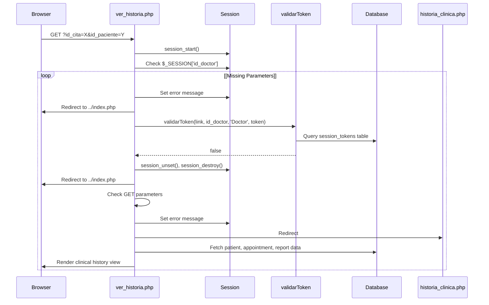
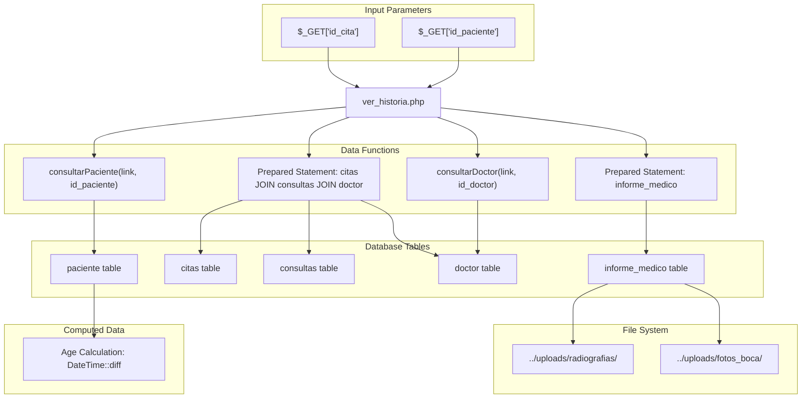
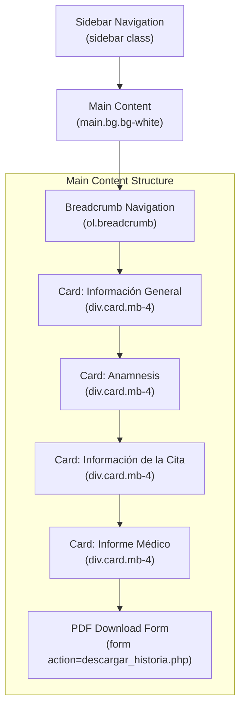
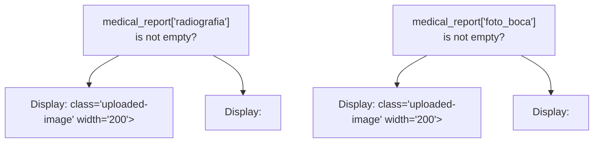
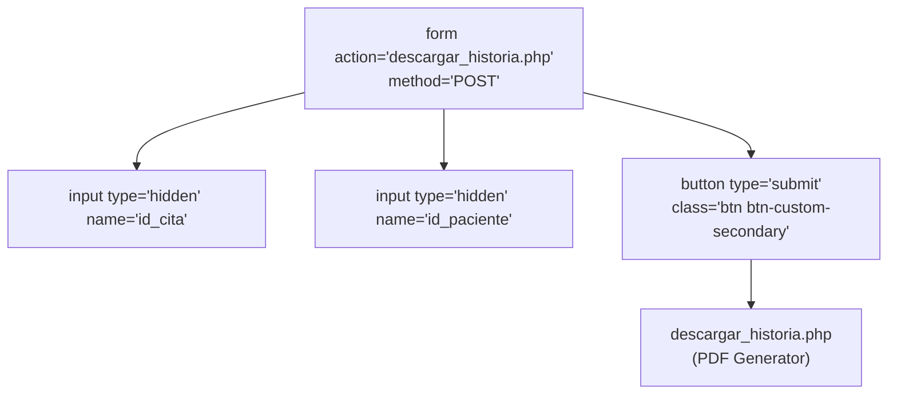
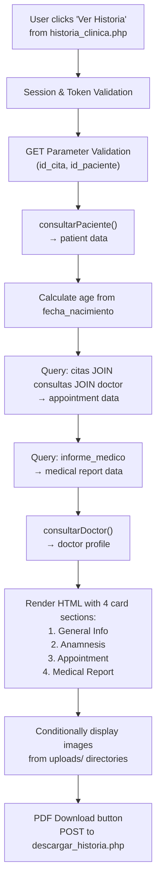

# Visor de detalles del historial clínico

> **Archivos fuente relevantes**
> * [Admin/ver_historia.php](https://github.com/axchisan/Consultorio_Emily_Bernal/blob/589034b9/Admin/ver_historia.php)

## Propósito y alcance

El Visor de Detalles del Historial Clínico ( `ver_historia.php`) es una interfaz completa de solo lectura que muestra los historiales clínicos completos del paciente para una cita específica. Esta página reúne los datos demográficos del paciente, la anamnesis (historial médico), los detalles de la cita y los informes médicos en una vista unificada. Para editar informes médicos, consulte [el Editor de Informes Médicos](/axchisan/Consultorio_Emily_Bernal/2.3.3-medical-report-editor) . Para ver todos los historiales clínicos, consulte [la Vista de Lista del Historial Clínico](/axchisan/Consultorio_Emily_Bernal/2.3.1-clinical-history-list-view) . Para generar versiones en PDF, consulte [el Generador de PDF del Historial Clínico](/axchisan/Consultorio_Emily_Bernal/3.1-clinical-history-pdf-generator) .

**Fuentes:** [Admin/ver_historia.php L1-L302](https://github.com/axchisan/Consultorio_Emily_Bernal/blob/589034b9/Admin/ver_historia.php#L1-L302)

---

## Flujo de solicitud y autenticación

La página sigue un estricto modelo de seguridad que valida tanto la existencia de la sesión como la autenticidad del token antes de mostrar cualquier dato del paciente.

### Secuencia de autenticación



**Fuentes:** [Admin/ver_historia.php L2-L43](https://github.com/axchisan/Consultorio_Emily_Bernal/blob/589034b9/Admin/ver_historia.php#L2-L43)

---

## Arquitectura de agregación de datos

La página consolida datos de múltiples tablas de bases de datos y fuentes del sistema de archivos para crear una vista completa del historial clínico.

### Flujo de recopilación de datos



**Fuentes:** [Admin/ver_historia.php L25-L78](https://github.com/axchisan/Consultorio_Emily_Bernal/blob/589034b9/Admin/ver_historia.php#L25-L78)

---

## Implementación de consultas de base de datos

### Recuperación de datos de pacientes

La página utiliza la función de abstracción `consultarPaciente()`de la biblioteca de consultas para recuperar información completa del paciente.

```
// Function call
$patient = consultarPaciente($link, $id_paciente);
```

**Fuentes:** [Admin/ver_historia.php L37](https://github.com/axchisan/Consultorio_Emily_Bernal/blob/589034b9/Admin/ver_historia.php#L37-L37)

### Recuperación de datos de citas

Una declaración preparada con múltiples JOIN recupera los detalles de la cita junto con el tipo de consulta y el nombre del médico:

| Fuente de la columna | Mesa | Objetivo |
| --- | --- | --- |
| `c.*` | `citas` | Todos los campos de cita |
| `con.tipo` | `consultas` | Descripción del tipo de consulta |
| `d.nombreD` | `doctor` | Nombre del doctor |

**Estructura de la consulta:**

```sql
SELECT c.*, con.tipo, d.nombreD 
FROM citas c 
LEFT JOIN consultas con ON con.id_consultas = c.id_consultas 
LEFT JOIN doctor d ON d.id_doctor = c.id_doctor 
WHERE c.id_cita = ? AND c.id_paciente = ?
```

**Fuentes:** [Admin/ver_historia.php L51-L66](https://github.com/axchisan/Consultorio_Emily_Bernal/blob/589034b9/Admin/ver_historia.php#L51-L66)

### Recuperación de informes médicos

A separate prepared statement fetches the associated medical report if it exists:

```sql
SELECT * FROM informe_medico WHERE id_cita = ?
```

The result is handled with a ternary operator to return an empty array if no report exists.

**Sources:** [Admin/ver_historia.php L69-L75](https://github.com/axchisan/Consultorio_Emily_Bernal/blob/589034b9/Admin/ver_historia.php#L69-L75)

---

## Age Calculation Logic

The system calculates patient age dynamically using PHP's `DateTime` class:

```
$birthDate = new DateTime($patient['fecha_nacimiento']);
$currentDate = new DateTime();
$age = $currentDate->diff($birthDate)->y;
```

This computed value is displayed in the patient information section and determines whether minor-specific fields (guardian information) are shown.

**Sources:** [Admin/ver_historia.php L46-L48](https://github.com/axchisan/Consultorio_Emily_Bernal/blob/589034b9/Admin/ver_historia.php#L46-L48)

---

## UI Component Structure

The page uses Bootstrap 4 card components to organize information into distinct sections.

### Layout Architecture



**Sources:** [Admin/ver_historia.php L93-L296](https://github.com/axchisan/Consultorio_Emily_Bernal/blob/589034b9/Admin/ver_historia.php#L93-L296)

---

## Patient Information Display

### Información General Card

The patient information is split into two columns within a Bootstrap grid:

**Left Column (Datos Principales):**

* Full name (`nombre` + `apellido`)
* Calculated age
* Birth date (`fecha_nacimiento`)
* Email (`correo_electronico`)
* Address (`lugar_direccion_residencia`)

**Right Column (Datos Adicionales):**

* Document number (`cedula`)
* Phone (`telefono`)
* Health insurance (`eps`)
* Gender (`sexo`)
* Occupation (`ocupacion`)
* Marital status (`estado_civil`)
* Emergency contact name and phone
* Blood type (`tipo_sangre`)
* Medical alerts (`alertas_medicas`)

**Conditional Minor Fields:**

For patients under 18 years old, additional guardian information is displayed:

| Field | Database Column | Condition |
| --- | --- | --- |
| Guardian name | `menor_acompanante` | `$age < 18` |
| Relationship | `menor_parentesco` | `$age < 18` |
| Guardian phone | `menor_telefono` | `$age < 18` |

**Sources:** [Admin/ver_historia.php L134-L168](https://github.com/axchisan/Consultorio_Emily_Bernal/blob/589034b9/Admin/ver_historia.php#L134-L168)

 [Admin/ver_historia.php L158-L162](https://github.com/axchisan/Consultorio_Emily_Bernal/blob/589034b9/Admin/ver_historia.php#L158-L162)

---

## Anamnesis Display Table

The anamnesis section presents family and personal medical history as a read-only table with checkmarks indicating yes/no responses.

### Medical History Fields

| History Type | Database Column | Display Label |
| --- | --- | --- |
| Cardiovascular diseases | `historia_cardiovasculares` | Enfermedades Cardiovasculares |
| Hemorrhagic diseases | `historia_hemorragicas` | Enfermedades Hemorrágicas |
| Dermatological diseases | `historia_dermatologicas` | Enfermedades Dermatológicas |
| Mental illnesses | `historia_mentales` | Enfermedades Mentales |
| Diabetes | `historia_diabetes` | Diabetes |
| Cancer | `historia_cancer` | Cáncer |
| Arthritis | `historia_artritis` | Artritis |
| Allergies | `historia_alergias` | Alergias |
| Surgeries | `historia_cirugias` | Cirugías |
| Other | `historia_otros` | Otros (free text) |

### Checkmark Rendering Logic

Each row uses conditional PHP to render FontAwesome check icons:

```php
<?php echo (isset($patient['historia_cardiovasculares']) && 
           $patient['historia_cardiovasculares'] == 'Sí') ? 
           '<i class="fas fa-check"></i>' : ''; ?>
```

**Sources:** [Admin/ver_historia.php L171-L237](https://github.com/axchisan/Consultorio_Emily_Bernal/blob/589034b9/Admin/ver_historia.php#L171-L237)

---

## Appointment Information Display

### Displayed Appointment Fields

| Display Label | Data Source | Transformation |
| --- | --- | --- |
| Fecha | `$appointment['fecha_cita']` | None |
| Hora | `$appointment['hora_cita']` | None |
| Doctor | `$appointment['nombreD']` | From JOIN |
| Motivo de Consulta | `$appointment['tipo']` | From JOIN |
| Estado | `$appointment['estado']` | 'A' → "Realizada", else "Pendiente" |

The appointment data comes from the prepared statement that joins `citas`, `consultas`, and `doctor` tables.

**Sources:** [Admin/ver_historia.php L240-L251](https://github.com/axchisan/Consultorio_Emily_Bernal/blob/589034b9/Admin/ver_historia.php#L240-L251)

---

## Medical Report and Image Display

### Text Fields Display

The medical report section displays multiple clinical examination fields:

| Field Label | Database Column | Default |
| --- | --- | --- |
| Examen Intraoral | `examen_intraoral` | 'N/A' |
| Examen Extraoral | `examen_extraoral` | 'N/A' |
| Examen ATM | `examen_atm` | 'N/A' |
| Evolución | `evolucion` | 'N/A' |
| Diagnóstico | `diagnostico` | 'N/A' |
| Plan de Tratamiento | `plan_tratamiento` | 'N/A' |
| Costo | `costo` | 0 (formatted as currency) |

**Sources:** [Admin/ver_historia.php L259-L277](https://github.com/axchisan/Consultorio_Emily_Bernal/blob/589034b9/Admin/ver_historia.php#L259-L277)

### Image Display Logic

Images are conditionally displayed based on database field values:



**Image Display Implementation:**

**Radiograph:**

```php
<?php if (!empty($medical_report['radiografia'])) { ?>
    " 
         class="uploaded-image" alt="Radiografía" width="200">
<?php } else { ?>
    <p>N/A</p>
<?php } ?>
```

**Oral Photo:**

```php
<?php if (!empty($medical_report['foto_boca'])) { ?>
    " 
         class="uploaded-image" alt="Foto de la Boca" width="200">
<?php } else { ?>
    <p>N/A</p>
<?php } ?>
```

**Sources:** [Admin/ver_historia.php L262-L273](https://github.com/axchisan/Consultorio_Emily_Bernal/blob/589034b9/Admin/ver_historia.php#L262-L273)

---

## PDF Download Integration

The page includes a POST form that submits to `descargar_historia.php` to generate a PDF version of the clinical history.

### PDF Form Structure



**Form Parameters:**

| Parameter | Source | Purpose |
| --- | --- | --- |
| `id_cita` | `$_GET['id_cita']` | Identifica la cita |
| `id_paciente` | `$_GET['id_paciente']` | Identifica al paciente |

**Fuentes:** [Admin/ver_historia.php L283-L290](https://github.com/axchisan/Consultorio_Emily_Bernal/blob/589034b9/Admin/ver_historia.php#L283-L290)

---

## Navegación y migas de pan

### Navegación de la barra lateral

La barra lateral incluye enlaces a todas las secciones administrativas principales:

| Elemento del menú | Enlace | Estado activo |
| --- | --- | --- |
| Citas | `inicioAdmin.php` | No |
| Dentistas | `doctores.php` | No |
| Calendario | `calendar.php` | No |
| Mensajería | `consultarrepor.php` | No |
| Historia Clínica | `historia_clinica.php` | **Sí** |
| Cerrar sesión | `../php/cerrar.php` | No |

El elemento de menú "Historia Clínica" tiene la `active`clase aplicada.

**Fuentes:** [Admin/ver_historia.php L109-L118](https://github.com/axchisan/Consultorio_Emily_Bernal/blob/589034b9/Admin/ver_historia.php#L109-L118)

### Ruta de migas de pan

La página incluye una ruta de navegación para el contexto:

```
Historia Clínica > Ver Historia
```

La ruta de navegación permite a los usuarios regresar a la vista de lista de historial clínico.

**Fuentes:** [Admin/ver_historia.php L128-L131](https://github.com/axchisan/Consultorio_Emily_Bernal/blob/589034b9/Admin/ver_historia.php#L128-L131)

---

## Características de seguridad

### Sanitización de entrada

Todos los parámetros GET se desinfectan mediante `mysqli_real_escape_string()`:

```
$id_cita = mysqli_real_escape_string($link, $_GET['id_cita']);
$id_paciente = mysqli_real_escape_string($link, $_GET['id_paciente']);
```

**Fuentes:** [Admin/ver_historia.php L33-L34](https://github.com/axchisan/Consultorio_Emily_Bernal/blob/589034b9/Admin/ver_historia.php#L33-L34)

### Escape de salida

Todos los datos mostrados se escapan utilizando `htmlspecialchars()`para evitar ataques XSS:

```php
echo htmlspecialchars($patient['nombre'] . ' ' . $patient['apellido']);
```

Este patrón se aplica a las más de 50 ubicaciones de salida en toda la página.

**Fuentes:** [Admin/ver_historia.php L142](https://github.com/axchisan/Consultorio_Emily_Bernal/blob/589034b9/Admin/ver_historia.php#L142-L142)

(y en todo el archivo)

### Manejo de errores y redirecciones

La página implementa el manejo de errores defensivos con redirecciones para todos los escenarios de falla:

| Condición de error | Mensaje de sesión | Redirigir objetivo |
| --- | --- | --- |
| Sin sesión | "Error acceso al sistema: Sesión no iniciada." | `../index.php` |
| Token inválido | "Tu sesión ha sido cerrada por inicio en otro dispositivo". | `../index.php` |
| Parámetros faltantes | "Error: ID de cita o paciente no proporcionado." | `historia_clinica.php` |
| Paciente no encontrado | "Error: No se pudo obtener la información del paciente." | `historia_clinica.php` |
| Cita no encontrada | "Error: No se encontró la cita". | `historia_clinica.php` |

Todos los mensajes de error se almacenan `$_SESSION['MensajeTexto']`con el tipo `$_SESSION['MensajeTipo']`establecido en `"p-3 mb-2 bg-danger text-white"`.

**Fuentes:** [Admin/ver_historia.php L7-L43](https://github.com/axchisan/Consultorio_Emily_Bernal/blob/589034b9/Admin/ver_historia.php#L7-L43)

 [Admin/ver_historia.php L62-L65](https://github.com/axchisan/Consultorio_Emily_Bernal/blob/589034b9/Admin/ver_historia.php#L62-L65)

---

## Visualización del perfil del médico

La barra lateral muestra la información del perfil del médico que inició sesión:

### Fuentes de datos del perfil

| Elemento de visualización | Fuente de datos | Lógica |
| --- | --- | --- |
| Imagen de perfil | Selección basada en el género | `$row['sexo']`== 'Masculino' → `odontologo.png`, 'Femenino' →`odontologa.png` |
| Nombre | `$row['nombreD']`+`$row['apellido']` | UTF-8 decodificado |
| Ubicación | Texto estático | "Barbosa Santander" |

**Fuentes:** [Admin/ver_historia.php L100-L108](https://github.com/axchisan/Consultorio_Emily_Bernal/blob/589034b9/Admin/ver_historia.php#L100-L108)

---

## Dependencias de CSS y JavaScript

### Dependencias de la hoja de estilo

| Hoja de estilo | Objetivo |
| --- | --- |
| `bootstrap.min.css` | Marco Bootstrap |
| `all.css`(Fuente Impresionante) | Fuente de icono |
| `admin.css` | Estilo de la interfaz de administración |
| `informe_paciente.css` | Estilos específicos de informes de pacientes |

**Fuentes:** [Admin/ver_historia.php L87-L90](https://github.com/axchisan/Consultorio_Emily_Bernal/blob/589034b9/Admin/ver_historia.php#L87-L90)

### Dependencias de JavaScript

| Guion | Objetivo |
| --- | --- |
| `jquery.js` | biblioteca jQuery |
| `bootstrap.min.js` | Componentes de JavaScript de Bootstrap |
| `admin.js` | Funcionalidad específica del administrador |

**Fuentes:** [Admin/ver_historia.php L298-L300](https://github.com/axchisan/Consultorio_Emily_Bernal/blob/589034b9/Admin/ver_historia.php#L298-L300)

---

## Resumen del flujo de datos



**Fuentes:** [Admin/ver_historia.php L1-L302](https://github.com/axchisan/Consultorio_Emily_Bernal/blob/589034b9/Admin/ver_historia.php#L1-L302)