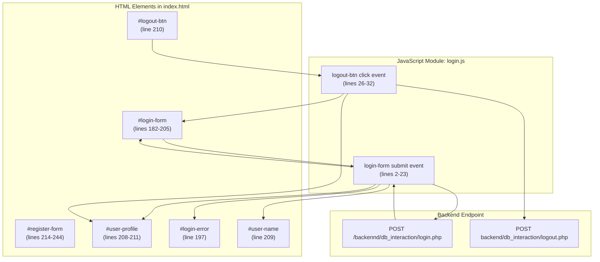
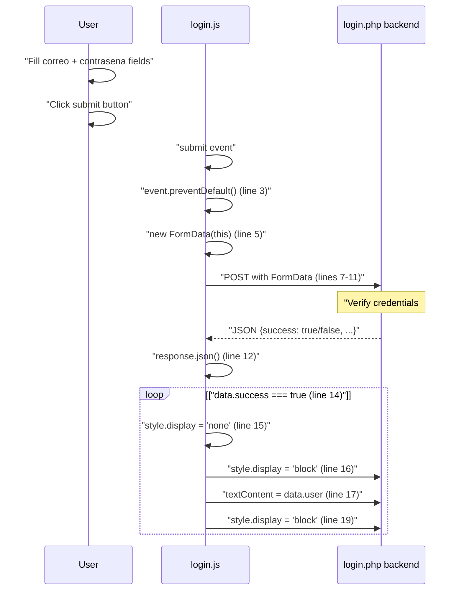
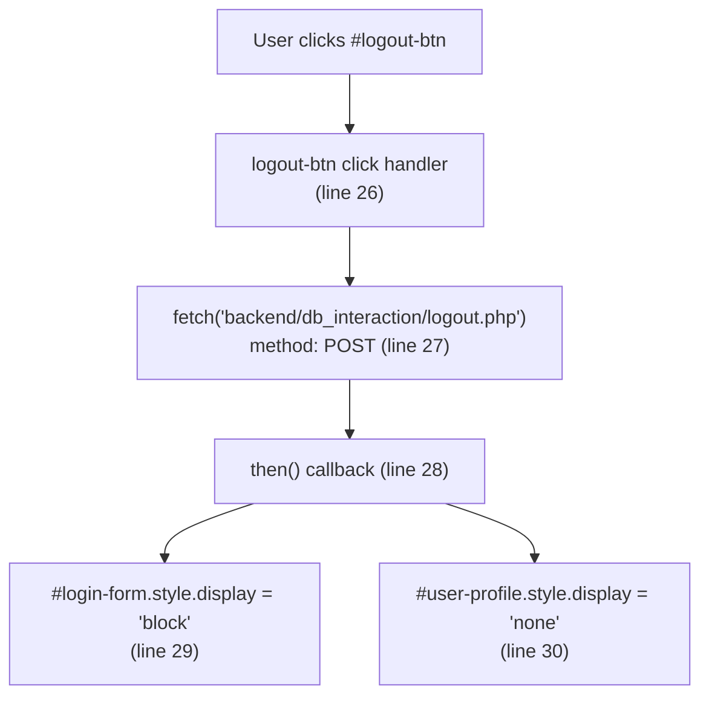
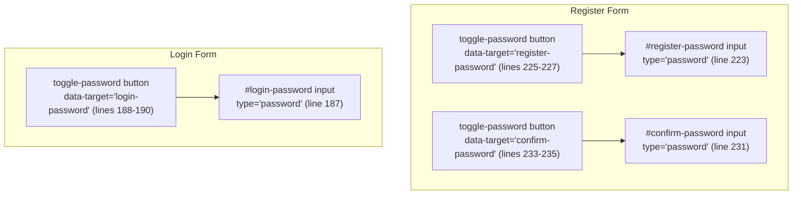
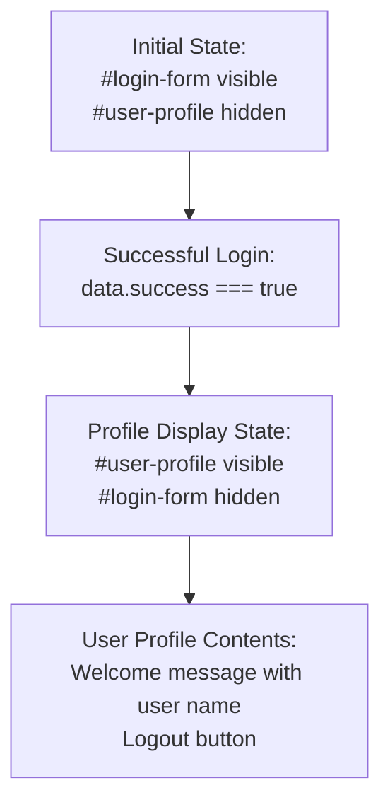
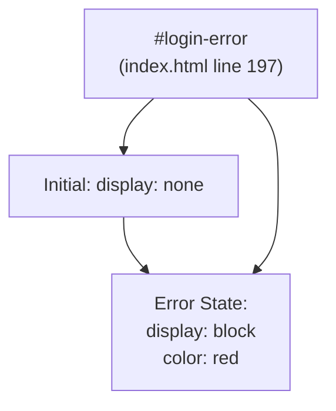
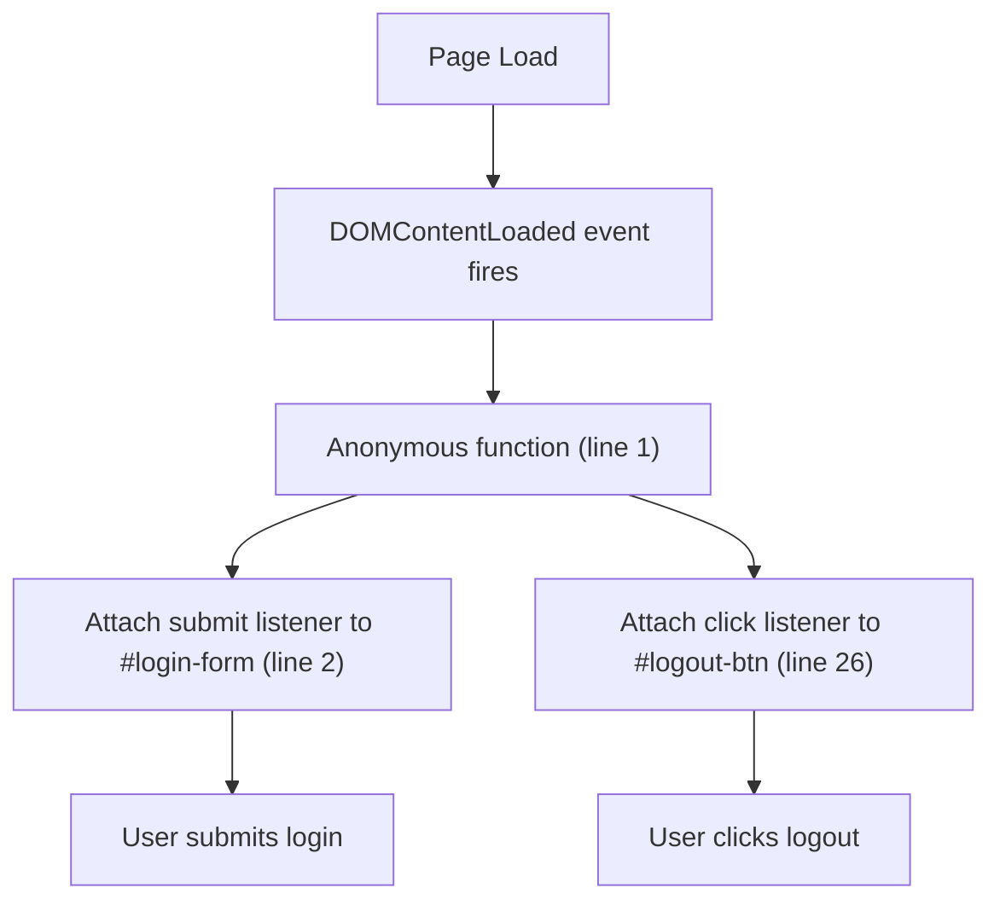

# Authentication Frontend

> **Relevant source files**
> * [backennd/db_interaction/login.php](https://github.com/axchisan/CoopAgronet/blob/e8818744/backennd/db_interaction/login.php)
> * [front end/index.html](https://github.com/axchisan/CoopAgronet/blob/e8818744/front end/index.html)
> * [front end/login.js](https://github.com/axchisan/CoopAgronet/blob/e8818744/front end/login.js)

## Purpose and Scope

This document describes the client-side authentication system implemented in `login.js`, which manages user login, logout, and UI state transitions for authentication flows. The module handles form submission to the backend authentication endpoint, displays user profile information after successful login, and manages the visibility toggling between login and registration forms.

For backend authentication processing including password verification and session management, see [2.2](/axchisan/CoopAgronet/2.2-user-authentication-system). For registration form handling, note that registration uses direct HTML form submission rather than JavaScript interception (see [2.2.2](/axchisan/CoopAgronet/2.2.2-registration-endpoint)).

**Sources:** [front L1-L34](https://github.com/axchisan/CoopAgronet/blob/e8818744/front end/login.js#L1-L34)

 [front L177-L246](https://github.com/axchisan/CoopAgronet/blob/e8818744/front end/index.html#L177-L246)

---

## Component Overview

The authentication frontend consists of three primary DOM elements and a JavaScript module that orchestrates their interactions:



**Sources:** [front L1-L34](https://github.com/axchisan/CoopAgronet/blob/e8818744/front end/login.js#L1-L34)

 [front L182-L211](https://github.com/axchisan/CoopAgronet/blob/e8818744/front end/index.html#L182-L211)

---

## Login Flow

The login authentication flow is implemented as an event-driven process using the Fetch API:



The login handler performs the following steps:

1. **Event Interception** [login.js L2-L3](https://github.com/axchisan/CoopAgronet/blob/e8818744/login.js#L2-L3) : Attaches a submit event listener to `#login-form` that prevents default form submission behavior
2. **FormData Creation** [login.js L5](https://github.com/axchisan/CoopAgronet/blob/e8818744/login.js#L5-L5) : Extracts form field values (`correo` and `contrasena`) into a `FormData` object
3. **HTTP POST Request** [login.js L7-L11](https://github.com/axchisan/CoopAgronet/blob/e8818744/login.js#L7-L11) : Sends POST request to `/proyecto_pagina_asociacones/CoopAgroNet/backennd/db_interaction/login.php` with form data
4. **JSON Response Parsing** [login.js L12](https://github.com/axchisan/CoopAgronet/blob/e8818744/login.js#L12-L12) : Converts response to JSON format
5. **Conditional UI Update** [login.js L14-L21](https://github.com/axchisan/CoopAgronet/blob/e8818744/login.js#L14-L21) : * On success: Hides login form, shows user profile section, populates `#user-name` span with `data.user` value * On failure: Displays `#login-error` element with predefined error message
6. **Error Handling** [login.js L22](https://github.com/axchisan/CoopAgronet/blob/e8818744/login.js#L22-L22) : Logs fetch errors to console

**Sources:** [front L1-L23](https://github.com/axchisan/CoopAgronet/blob/e8818744/front end/login.js#L1-L23)

 [backennd/db_interaction/login.php L10-L44](https://github.com/axchisan/CoopAgronet/blob/e8818744/backennd/db_interaction/login.php#L10-L44)

---

## Logout Functionality

The logout handler provides session termination:



The logout process [login.js L26-L32](https://github.com/axchisan/CoopAgronet/blob/e8818744/login.js#L26-L32)

:

| Step | Action | Code Line |
| --- | --- | --- |
| 1 | User clicks `#logout-btn` | 26 |
| 2 | Fetch POST request to `backend/db_interaction/logout.php` | 27 |
| 3 | On response, show `#login-form` | 29 |
| 4 | On response, hide `#user-profile` | 30 |

**Note:** The logout endpoint path uses a different directory structure (`backend/` instead of `backennd/`) compared to the login endpoint, which may indicate a path configuration issue.

**Sources:** [front L25-L32](https://github.com/axchisan/CoopAgronet/blob/e8818744/front end/login.js#L25-L32)

---

## Form Toggle Mechanism

The authentication section includes functionality for switching between login and registration forms, implemented via inline JavaScript in `index.html`:

```

```

The toggle mechanism [index.html L302-L318](https://github.com/axchisan/CoopAgronet/blob/e8818744/index.html#L302-L318)

:

* **Link Elements**: * `#show-register-form` [index.html L201-L203](https://github.com/axchisan/CoopAgronet/blob/e8818744/index.html#L201-L203) : Link in login form that triggers registration form display * `#show-login-form` [index.html L242](https://github.com/axchisan/CoopAgronet/blob/e8818744/index.html#L242-L242) : Link in registration form that triggers login form display
* **Event Handlers**: * `showRegisterFormLink.addEventListener('click', ...)` [index.html L308-L311](https://github.com/axchisan/CoopAgronet/blob/e8818744/index.html#L308-L311) : Hides `#login-form`, shows `#register-form` * `showLoginFormLink.addEventListener('click', ...)` [index.html L314-L317](https://github.com/axchisan/CoopAgronet/blob/e8818744/index.html#L314-L317) : Hides `#register-form`, shows `#login-form`
* **preventDefault()** [index.html L309-L315](https://github.com/axchisan/CoopAgronet/blob/e8818744/index.html#L309-L315) : Prevents default anchor navigation behavior

**Sources:** [front L302-L318](https://github.com/axchisan/CoopAgronet/blob/e8818744/front end/index.html#L302-L318)

 [front L201-L203](https://github.com/axchisan/CoopAgronet/blob/e8818744/front end/index.html#L201-L203)

 [front L242](https://github.com/axchisan/CoopAgronet/blob/e8818744/front end/index.html#L242-L242)

---

## Password Visibility Toggle

Both login and registration forms include password visibility toggle buttons:



Each password field [index.html L186-L235](https://github.com/axchisan/CoopAgronet/blob/e8818744/index.html#L186-L235)

 is wrapped in a `<div class="password-container">` containing:

* Password `<input>` with unique `id` attribute
* Toggle button with `class="toggle-password"`
* `data-target` attribute linking button to corresponding input field
* Font Awesome eye icon (`fa-eye`)

The toggle functionality is not implemented in the provided `login.js` file but appears to be handled by CSS or external JavaScript that manipulates the input `type` attribute between `"password"` and `"text"`.

**Sources:** [front L186-L191](https://github.com/axchisan/CoopAgronet/blob/e8818744/front end/index.html#L186-L191)

 [front L222-L236](https://github.com/axchisan/CoopAgronet/blob/e8818744/front end/index.html#L222-L236)

---

## User Profile Display

After successful authentication, the UI transitions to display user information:



The `#user-profile` element [index.html L208-L211](https://github.com/axchisan/CoopAgronet/blob/e8818744/index.html#L208-L211)

 structure:

| Element | Purpose | Populated By |
| --- | --- | --- |
| `<div id="user-profile">` | Container (initially `display:none`) | [login.js L16](https://github.com/axchisan/CoopAgronet/blob/e8818744/login.js#L16-L16) <br>  sets to block |
| `<h3>` | Welcome header | Static HTML |
| `<span id="user-name">` | User's name display | [login.js L17](https://github.com/axchisan/CoopAgronet/blob/e8818744/login.js#L17-L17) <br>  sets `textContent` to `data.user` |
| `<button id="logout-btn">` | Logout trigger | Event listener at [login.js L26](https://github.com/axchisan/CoopAgronet/blob/e8818744/login.js#L26-L26) |

The profile display does not include additional user information such as email address or registration date, only the user's full name (`nombre_completo`) returned from the backend.

**Sources:** [front L208-L211](https://github.com/axchisan/CoopAgronet/blob/e8818744/front end/index.html#L208-L211)

 [front L14-L17](https://github.com/axchisan/CoopAgronet/blob/e8818744/front end/login.js#L14-L17)

---

## Error Display System

The login form includes a dedicated error message element:



Error handling characteristics [front L197](https://github.com/axchisan/CoopAgronet/blob/e8818744/front end/index.html#L197-L197)

 [front L18-L20](https://github.com/axchisan/CoopAgronet/blob/e8818744/front end/login.js#L18-L20)

:

* **Static Error Message**: The text "Usuario o contraseña incorrectos" is hardcoded in HTML, not dynamically set from backend response
* **Display Control**: JavaScript only toggles visibility via `style.display = "block"`, doesn't update message content
* **No Auto-Dismiss**: Error remains visible until user interacts with form again (unlike support form which auto-dismisses after 5 seconds)
* **Backend Error Ignored**: Backend returns specific error messages in `data.error` field [backennd/db_interaction/login.php L16-L40](https://github.com/axchisan/CoopAgronet/blob/e8818744/backennd/db_interaction/login.php#L16-L40)  but frontend doesn't display them

**Limitation:** The generic error message provides no distinction between invalid email, incorrect password, or server errors, potentially impacting user experience and debugging.

**Sources:** [front L18-L20](https://github.com/axchisan/CoopAgronet/blob/e8818744/front end/login.js#L18-L20)

 [front L197](https://github.com/axchisan/CoopAgronet/blob/e8818744/front end/index.html#L197-L197)

 [backennd/db_interaction/login.php L15-L41](https://github.com/axchisan/CoopAgronet/blob/e8818744/backennd/db_interaction/login.php#L15-L41)

---

## Module Initialization

The authentication module uses the `DOMContentLoaded` event to ensure DOM availability:



Initialization sequence [front L1](https://github.com/axchisan/CoopAgronet/blob/e8818744/front end/login.js#L1-L1)

:

1. `document.addEventListener("DOMContentLoaded", function() {...})` wraps all module code
2. Ensures `#login-form` and `#logout-btn` elements exist before attaching listeners
3. Executes after HTML parsing completes but before external resources load

**Sources:** [front L1-L34](https://github.com/axchisan/CoopAgronet/blob/e8818744/front end/login.js#L1-L34)

---

## Data Flow Summary

The complete authentication data flow involves three layers:

| Layer | Component | Responsibility |
| --- | --- | --- |
| **Presentation** | `#login-form` [index.html L182-L205](https://github.com/axchisan/CoopAgronet/blob/e8818744/index.html#L182-L205) | Collect user credentials |
| **Client Logic** | `login.js` [login.js L1-L34](https://github.com/axchisan/CoopAgronet/blob/e8818744/login.js#L1-L34) | Submit credentials, manage UI state |
| **Server Logic** | `login.php` [backennd/db_interaction/login.php L10-L44](https://github.com/axchisan/CoopAgronet/blob/e8818744/backennd/db_interaction/login.php#L10-L44) | Verify credentials, create session |
| **Data Store** | `usuarios` table | Store hashed passwords |
| **Session** | `$_SESSION["user"]` [backennd/db_interaction/login.php L29](https://github.com/axchisan/CoopAgronet/blob/e8818744/backennd/db_interaction/login.php#L29-L29) | Maintain authentication state |

**Authentication Token Storage:** The system uses server-side PHP sessions exclusively. No JWT tokens, localStorage, or cookies are used on the client side for authentication state management.

**Sources:** [front L1-L34](https://github.com/axchisan/CoopAgronet/blob/e8818744/front end/login.js#L1-L34)

 [front L177-L246](https://github.com/axchisan/CoopAgronet/blob/e8818744/front end/index.html#L177-L246)

 [backennd/db_interaction/login.php L1-L45](https://github.com/axchisan/CoopAgronet/blob/e8818744/backennd/db_interaction/login.php#L1-L45)