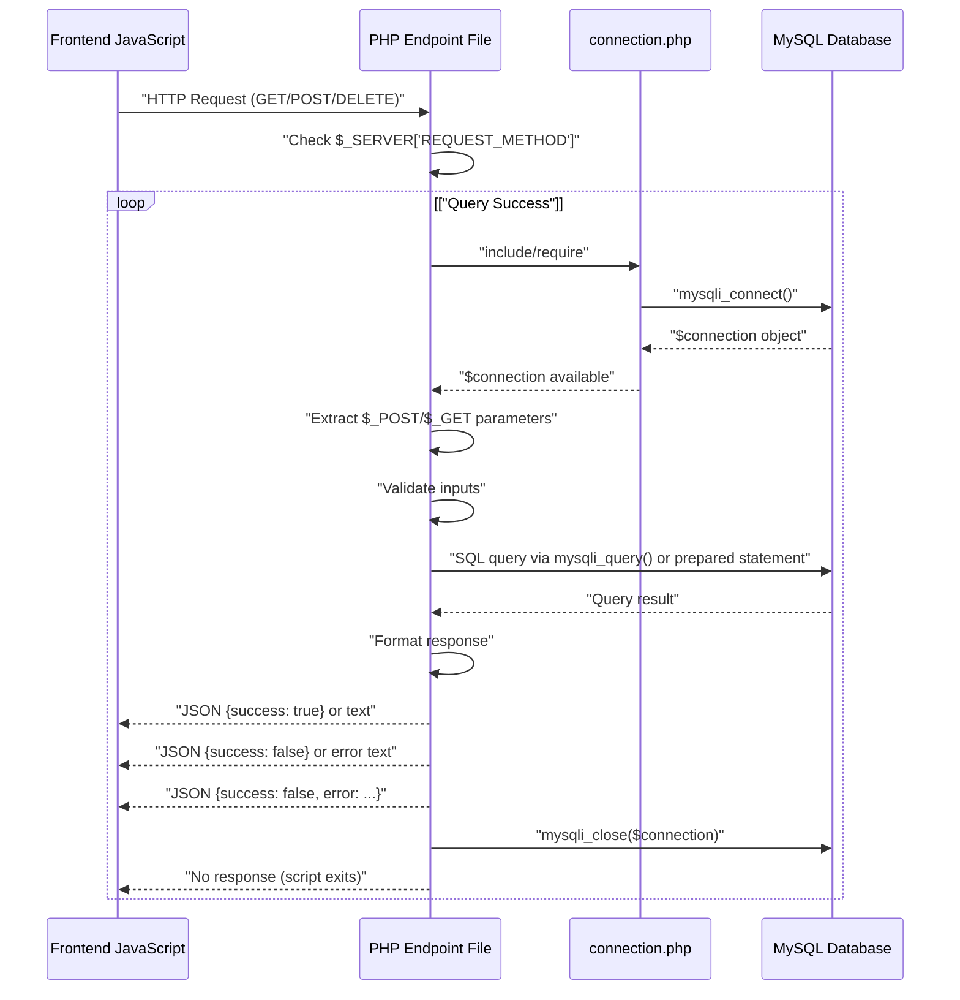
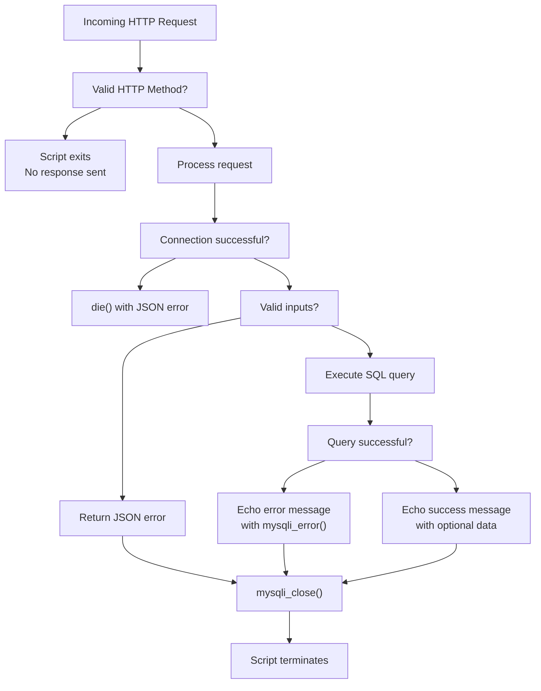
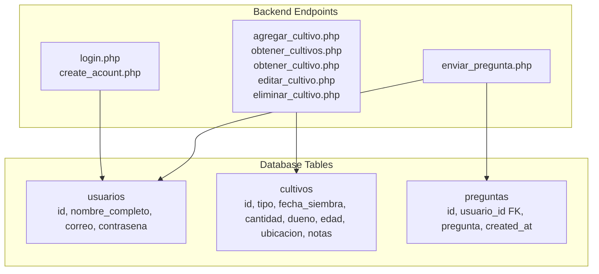

# Backend System

> **Relevant source files**
> * [backennd/db_interaction/agregar_cultivo.php](https://github.com/axchisan/CoopAgronet/blob/e8818744/backennd/db_interaction/agregar_cultivo.php)
> * [backennd/db_interaction/connection.php](https://github.com/axchisan/CoopAgronet/blob/e8818744/backennd/db_interaction/connection.php)
> * [backennd/db_interaction/login.php](https://github.com/axchisan/CoopAgronet/blob/e8818744/backennd/db_interaction/login.php)

## Purpose and Scope

This document introduces the PHP backend layer of CoopAgroNet, explaining its procedural architecture, endpoint organization, and database interaction patterns. The backend consists of standalone PHP scripts that handle HTTP requests and communicate with a MySQL database through a shared connection object.

For detailed documentation of specific subsystems, see:

* Database connection management: [Database Connection Layer](/axchisan/CoopAgronet/2.1-database-connection-layer)
* User authentication implementation: [User Authentication System](/axchisan/CoopAgronet/2.2-user-authentication-system)
* Crop CRUD operations: [Crop Management API](/axchisan/CoopAgronet/2.3-crop-management-api)
* Support question handling: [Support Question System](/axchisan/CoopAgronet/2.4-support-question-system)

**Sources:** All files in `backennd/db_interaction/` directory

## Architectural Overview

The backend implements a **procedural PHP architecture** rather than an object-oriented MVC framework. Each endpoint is a self-contained script that:

1. Includes the shared database connection
2. Validates the HTTP request method
3. Extracts and validates input parameters
4. Executes SQL queries directly via mysqli
5. Returns responses (JSON or text)
6. Closes the database connection

This approach prioritizes simplicity over architectural complexity, making the codebase accessible to developers with basic PHP knowledge but introducing challenges for code reuse and testing.

**Sources:** [backennd/db_interaction/agregar_cultivo.php L1-L27](https://github.com/axchisan/CoopAgronet/blob/e8818744/backennd/db_interaction/agregar_cultivo.php#L1-L27)

 [backennd/db_interaction/login.php L1-L45](https://github.com/axchisan/CoopAgronet/blob/e8818744/backennd/db_interaction/login.php#L1-L45)

### Backend File Structure

```

```

**Diagram: Backend Endpoint Organization and Database Connection Dependencies**

Each endpoint includes `connection.php` to obtain the `$connection` mysqli object. There is no routing layer or controller hierarchy—URLs map directly to PHP filenames.

**Sources:** [backennd/db_interaction/connection.php L1-L15](https://github.com/axchisan/CoopAgronet/blob/e8818744/backennd/db_interaction/connection.php#L1-L15)

 [backennd/db_interaction/agregar_cultivo.php L2](https://github.com/axchisan/CoopAgronet/blob/e8818744/backennd/db_interaction/agregar_cultivo.php#L2-L2)

 [backennd/db_interaction/login.php L3](https://github.com/axchisan/CoopAgronet/blob/e8818744/backennd/db_interaction/login.php#L3-L3)

## Shared Connection Pattern

All backend endpoints rely on [backennd/db_interaction/connection.php L1-L15](https://github.com/axchisan/CoopAgronet/blob/e8818744/backennd/db_interaction/connection.php#L1-L15)

 which establishes a mysqli connection using the following pattern:

```

```

This connection object (`$connection`) is included via `include "connection.php"` or `require_once "connection.php"` statements at the beginning of each endpoint file. The connection is closed at the end of each request via `mysqli_close($connection)`.

**Key Characteristics:**

* **No connection pooling:** Each HTTP request creates a new database connection
* **Global scope:** The `$connection` variable is available in the global scope after inclusion
* **Error handling:** Connection failures trigger a `die()` with JSON error message [backennd/db_interaction/connection.php L12-L14](https://github.com/axchisan/CoopAgronet/blob/e8818744/backennd/db_interaction/connection.php#L12-L14)
* **Development credentials:** Uses root user with no password, suitable only for local development

**Sources:** [backennd/db_interaction/connection.php L1-L15](https://github.com/axchisan/CoopAgronet/blob/e8818744/backennd/db_interaction/connection.php#L1-L15)

 [backennd/db_interaction/agregar_cultivo.php L2](https://github.com/axchisan/CoopAgronet/blob/e8818744/backennd/db_interaction/agregar_cultivo.php#L2-L2)

## Request-Response Flow



**Diagram: Generic Backend Request Processing Flow**

This pattern is consistent across all endpoints, with variations in:

* Input extraction methods (`$_POST`, `$_GET`, `$_DELETE`)
* Validation logic complexity
* SQL query construction (prepared statements vs. direct interpolation)
* Response format (JSON vs. plain text)

**Sources:** [backennd/db_interaction/agregar_cultivo.php L7-L26](https://github.com/axchisan/CoopAgronet/blob/e8818744/backennd/db_interaction/agregar_cultivo.php#L7-L26)

 [backennd/db_interaction/login.php L10-L44](https://github.com/axchisan/CoopAgronet/blob/e8818744/backennd/db_interaction/login.php#L10-L44)

## Endpoint Inventory

The backend provides eight operational endpoints organized by functional domain:

| Endpoint File | HTTP Method | URL Parameters | Purpose | Response Format |
| --- | --- | --- | --- | --- |
| `login.php` | POST | `correo`, `contrasena` | Authenticate user, create session | JSON |
| `create_acount.php` | POST | `nombre`, `correo`, `contrasena` | Register new user account | JSON |
| `agregar_cultivo.php` | POST | 7 crop fields | Insert new crop record | Plain text |
| `obtener_cultivos.php` | GET | None | Retrieve all crops | JSON array |
| `obtener_cultivo.php` | GET | `id` | Retrieve single crop by ID | JSON object |
| `editar_cultivo.php` | POST | `id` + 7 crop fields | Update existing crop | Plain text |
| `eliminar_cultivo.php` | DELETE | `id` | Delete crop by ID | Plain text |
| `enviar_pregunta.php` | POST | `nombre`, `correo`, `pregunta` | Submit support question | JSON |

**Sources:** All files in `backennd/db_interaction/` directory

## Input Handling Patterns

The backend employs two distinct patterns for extracting request parameters:

### Direct POST Array Access

Used by crop management endpoints and registration:

```

```

Example: [backennd/db_interaction/agregar_cultivo.php L8-L14](https://github.com/axchisan/CoopAgronet/blob/e8818744/backennd/db_interaction/agregar_cultivo.php#L8-L14)

### Null Coalescing Operator

Used by authentication endpoints for safer access:

```

```

Example: [backennd/db_interaction/login.php L11-L12](https://github.com/axchisan/CoopAgronet/blob/e8818744/backennd/db_interaction/login.php#L11-L12)

The second pattern provides default values when parameters are missing, enabling subsequent validation checks. The first pattern relies on PHP's error suppression or assumes parameters are always present, which can cause undefined index warnings.

**Sources:** [backennd/db_interaction/agregar_cultivo.php L8-L14](https://github.com/axchisan/CoopAgronet/blob/e8818744/backennd/db_interaction/agregar_cultivo.php#L8-L14)

 [backennd/db_interaction/login.php L11-L12](https://github.com/axchisan/CoopAgronet/blob/e8818744/backennd/db_interaction/login.php#L11-L12)

## SQL Query Approaches

The backend demonstrates two contrasting approaches to SQL query execution:

### Prepared Statements (Secure)

Used in authentication endpoints:

```

```

Example: [backennd/db_interaction/login.php L21-L38](https://github.com/axchisan/CoopAgronet/blob/e8818744/backennd/db_interaction/login.php#L21-L38)

**Benefits:**

* Protection against SQL injection
* Type safety via `bind_param()`
* Automatic escaping of user input

### Direct String Interpolation (Vulnerable)

Used in crop management endpoints:

```

```

Example: [backennd/db_interaction/agregar_cultivo.php L16-L23](https://github.com/axchisan/CoopAgronet/blob/e8818744/backennd/db_interaction/agregar_cultivo.php#L16-L23)

**Security Risk:** This approach is vulnerable to SQL injection attacks. User-supplied values are directly concatenated into SQL strings without sanitization or parameterization. See [Security Considerations](/axchisan/CoopAgronet/4-security-considerations) for detailed analysis.

**Sources:** [backennd/db_interaction/login.php L21-L38](https://github.com/axchisan/CoopAgronet/blob/e8818744/backennd/db_interaction/login.php#L21-L38)

 [backennd/db_interaction/agregar_cultivo.php L16-L23](https://github.com/axchisan/CoopAgronet/blob/e8818744/backennd/db_interaction/agregar_cultivo.php#L16-L23)

## Response Format Inconsistencies

The backend returns responses in two distinct formats:

### JSON Responses

Used by authentication and support endpoints:

```

```

or

```

```

Example: [backennd/db_interaction/login.php L7](https://github.com/axchisan/CoopAgronet/blob/e8818744/backennd/db_interaction/login.php#L7-L7)

 sets `Content-Type: application/json` header

### Plain Text Responses

Used by crop management endpoints:

```
Cultivo agregado con éxito
```

or

```
Error al guardar el cultivo: [MySQL error message]
```

Example: [backennd/db_interaction/agregar_cultivo.php L20-L22](https://github.com/axchisan/CoopAgronet/blob/e8818744/backennd/db_interaction/agregar_cultivo.php#L20-L22)

This inconsistency requires frontend code to handle different parsing strategies depending on which endpoint is called. JSON responses enable structured error handling, while plain text responses are simpler but harder to parse programmatically.

**Sources:** [backennd/db_interaction/login.php L7](https://github.com/axchisan/CoopAgronet/blob/e8818744/backennd/db_interaction/login.php#L7-L7)

 [backennd/db_interaction/agregar_cultivo.php L20-L22](https://github.com/axchisan/CoopAgronet/blob/e8818744/backennd/db_interaction/agregar_cultivo.php#L20-L22)

## Error Handling Strategy



**Diagram: Backend Error Handling Flow**

**Error Handling Characteristics:**

1. **Connection Failures:** Terminate execution via `die()` with JSON error message [backennd/db_interaction/connection.php L13](https://github.com/axchisan/CoopAgronet/blob/e8818744/backennd/db_interaction/connection.php#L13-L13)
2. **Validation Failures:** Return JSON with `success: false` and descriptive error message [backennd/db_interaction/login.php L16-L17](https://github.com/axchisan/CoopAgronet/blob/e8818744/backennd/db_interaction/login.php#L16-L17)
3. **Query Failures:** Echo error text including `mysqli_error()` output [backennd/db_interaction/agregar_cultivo.php L22](https://github.com/axchisan/CoopAgronet/blob/e8818744/backennd/db_interaction/agregar_cultivo.php#L22-L22)
4. **No HTTP Status Codes:** All responses use HTTP 200, regardless of success/failure
5. **Error Reporting Enabled:** All files set `error_reporting(E_ALL)` and `display_errors` for development debugging

**Sources:** [backennd/db_interaction/connection.php L2-L3](https://github.com/axchisan/CoopAgronet/blob/e8818744/backennd/db_interaction/connection.php#L2-L3)

 [backennd/db_interaction/agregar_cultivo.php L3-L4](https://github.com/axchisan/CoopAgronet/blob/e8818744/backennd/db_interaction/agregar_cultivo.php#L3-L4)

 [backennd/db_interaction/login.php L4-L5](https://github.com/axchisan/CoopAgronet/blob/e8818744/backennd/db_interaction/login.php#L4-L5)

## Session Management

Authentication state is maintained via PHP sessions initialized in [backennd/db_interaction/login.php L2](https://github.com/axchisan/CoopAgronet/blob/e8818744/backennd/db_interaction/login.php#L2-L2)

:

```

```

After successful login:

* `$_SESSION["user"]` stores the user's full name
* Session persists across subsequent HTTP requests
* No user ID or role information is stored in the session
* Session timeout relies on PHP's default configuration (typically 24 minutes)

**Limitation:** The current session design stores only the username, not the user ID. This makes it impossible to implement ownership checks (e.g., verifying that a user can only edit their own crops) without additional database lookups.

**Sources:** [backennd/db_interaction/login.php L2](https://github.com/axchisan/CoopAgronet/blob/e8818744/backennd/db_interaction/login.php#L2-L2)

 [backennd/db_interaction/login.php L29](https://github.com/axchisan/CoopAgronet/blob/e8818744/backennd/db_interaction/login.php#L29-L29)

## Backend-to-Frontend Contract

Frontend JavaScript communicates with backend endpoints using the following patterns:

| Communication Type | Frontend Method | Backend Receives | Backend Returns |
| --- | --- | --- | --- |
| Form submission | `FormData` object in `fetch()` body | `$_POST` array | JSON or text |
| Query parameters | URL parameters in `fetch()` | `$_GET` array | JSON or text |
| DELETE operations | Custom HTTP method in `fetch()` | `$_SERVER['REQUEST_METHOD']` | Text |
| Session state | Automatic cookie transmission | `$_SESSION` array | N/A |

The backend does not validate content types or enforce CORS policies, accepting requests from any origin. This is suitable for development but would require CORS headers in production deployments.

**Sources:** [backennd/db_interaction/agregar_cultivo.php L7](https://github.com/axchisan/CoopAgronet/blob/e8818744/backennd/db_interaction/agregar_cultivo.php#L7-L7)

 [backennd/db_interaction/login.php L10](https://github.com/axchisan/CoopAgronet/blob/e8818744/backennd/db_interaction/login.php#L10-L10)

## Database Table Access

The backend endpoints interact with three MySQL tables:



**Diagram: Backend Endpoint to Database Table Mapping**

**Access Patterns:**

* **Authentication endpoints** verify user credentials and create new accounts in `usuarios`
* **Crop endpoints** perform full CRUD operations on `cultivos` without ownership validation
* **Support endpoint** validates user existence in `usuarios` and inserts questions into `preguntas` with foreign key reference

For complete database schema details, see [Database Schema](/axchisan/CoopAgronet/1.3-database-schema).

**Sources:** [backennd/db_interaction/login.php L21](https://github.com/axchisan/CoopAgronet/blob/e8818744/backennd/db_interaction/login.php#L21-L21)

 [backennd/db_interaction/agregar_cultivo.php L16](https://github.com/axchisan/CoopAgronet/blob/e8818744/backennd/db_interaction/agregar_cultivo.php#L16-L16)

## Development Configuration

All backend files include development-oriented configuration:

```

```

Example: [backennd/db_interaction/agregar_cultivo.php L3-L4](https://github.com/axchisan/CoopAgronet/blob/e8818744/backennd/db_interaction/agregar_cultivo.php#L3-L4)

This configuration:

* Displays all PHP errors, warnings, and notices in HTTP responses
* Enables debugging during development
* **Must be disabled in production** to prevent information disclosure

Database credentials in [backennd/db_interaction/connection.php L5-L8](https://github.com/axchisan/CoopAgronet/blob/e8818744/backennd/db_interaction/connection.php#L5-L8)

 are also development-oriented:

* Root user with no password
* Localhost-only access
* Default MySQL port (3306)

**Sources:** [backennd/db_interaction/agregar_cultivo.php L3-L4](https://github.com/axchisan/CoopAgronet/blob/e8818744/backennd/db_interaction/agregar_cultivo.php#L3-L4)

 [backennd/db_interaction/connection.php L5-L8](https://github.com/axchisan/CoopAgronet/blob/e8818744/backennd/db_interaction/connection.php#L5-L8)

---

This backend architecture prioritizes simplicity and rapid development over architectural patterns like MVC, dependency injection, or clean architecture principles. While this approach reduces initial complexity, it introduces challenges for testing, code reuse, and security hardening as the application grows. For security concerns, see [Security Considerations](/axchisan/CoopAgronet/4-security-considerations).