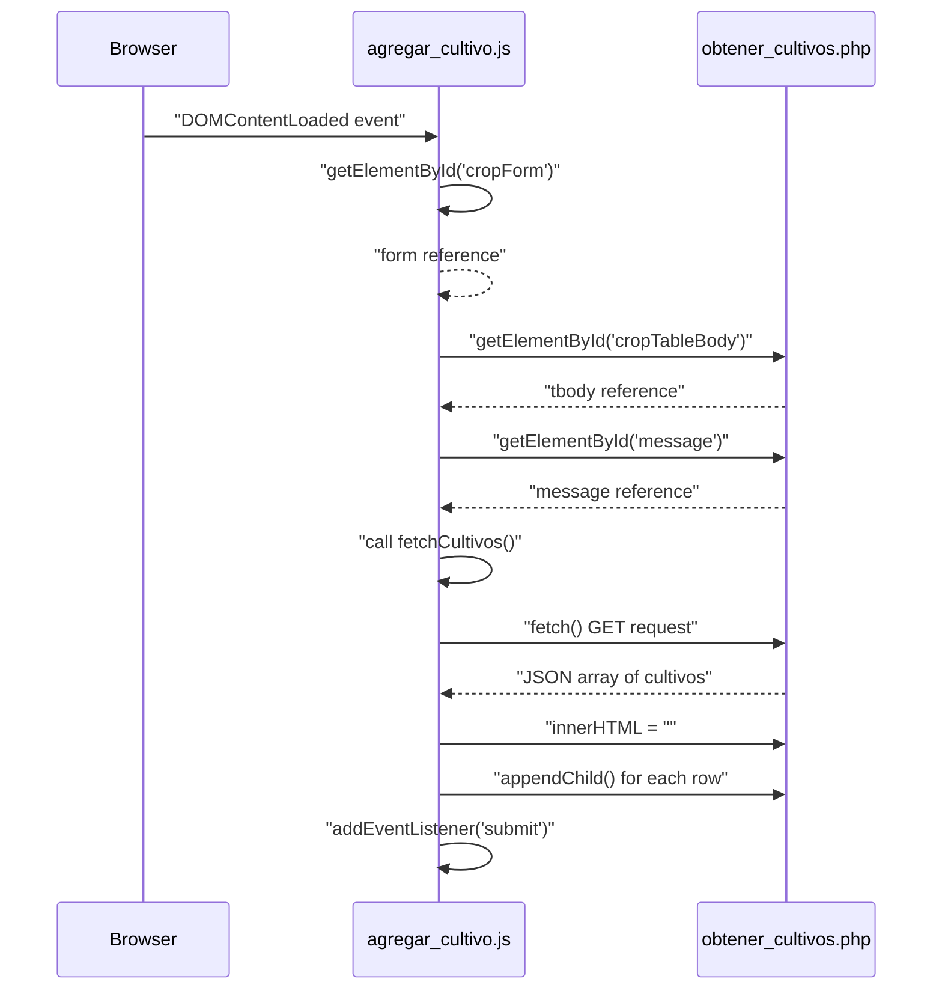
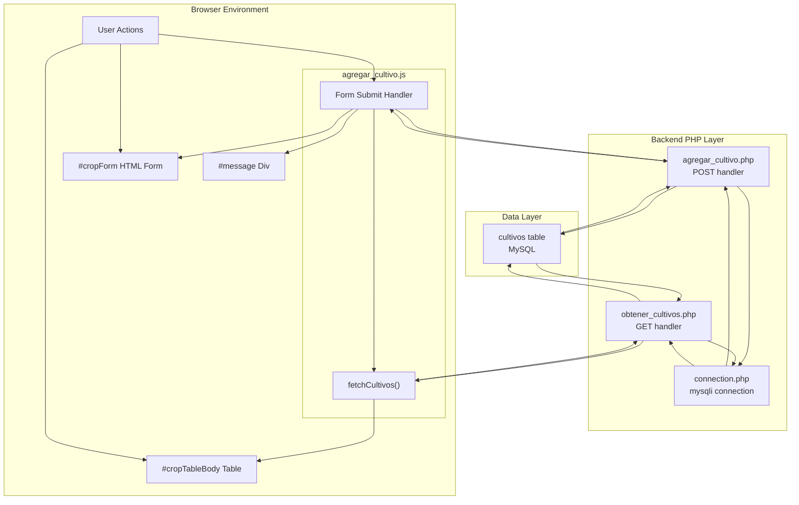
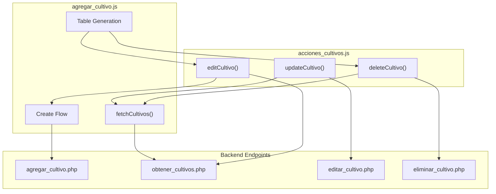

# Crop Creation and Listing

> **Relevant source files**
> * [backennd/db_interaction/agregar_cultivo.php](https://github.com/axchisan/CoopAgronet/blob/e8818744/backennd/db_interaction/agregar_cultivo.php)
> * [backennd/db_interaction/obtener_cultivos.php](https://github.com/axchisan/CoopAgronet/blob/e8818744/backennd/db_interaction/obtener_cultivos.php)
> * [front end/agregar_cultivo.js](https://github.com/axchisan/CoopAgronet/blob/e8818744/front end/agregar_cultivo.js)

## Purpose and Scope

This document details the frontend module responsible for creating new crop records and displaying the complete list of crops in a table format. The module is implemented in `agregar_cultivo.js` and coordinates with two backend endpoints to perform these operations.

This page covers:

* The `fetchCultivos()` function that retrieves and displays all crops
* The form submission handler that creates new crop records
* DOM manipulation for table population
* Success/error message display patterns

For information about editing and deleting crops, see [Crop Edit and Delete Actions](/axchisan/CoopAgronet/3.3.2-crop-edit-and-delete-actions). For backend endpoint implementation, see [Create Crop Endpoint](/axchisan/CoopAgronet/2.3.1-create-crop-endpoint) and [Read Crop Endpoints](/axchisan/CoopAgronet/2.3.2-read-crop-endpoints). For the React-based alternative interface, see [React Crop Component](/axchisan/CoopAgronet/3.3.3-react-crop-component).

---

## Module Structure and Dependencies

The `agregar_cultivo.js` module initializes on `DOMContentLoaded` and manages three primary DOM elements: the crop form, the crop table body, and the message display area.

**DOM Element Dependencies**

| Element ID | Purpose | Manipulated By |
| --- | --- | --- |
| `cropForm` | HTML form for crop data entry | Form submission handler |
| `cropTableBody` | `<tbody>` element for crop rows | `fetchCultivos()` function |
| `message` | Feedback message container | Success/error handlers |

**Module Architecture Diagram**

```mermaid
flowchart TD

DOM["DOMContentLoaded Event"]
INIT["Module Initialization"]
FORM_HANDLER["Form Submit Handler"]
FETCH["fetchCultivos() Function"]
FORM_REF["#cropForm"]
TABLE_REF["#cropTableBody"]
MSG_REF["#message"]
FORM_ELEM[""]
TABLE_ELEM[""]
MSG_ELEM[""]
CREATE_EP["agregar_cultivo.php"]
READ_EP["obtener_cultivos.php"]
EDIT_FN["editCultivo()"]
DELETE_FN["deleteCultivo()"]

DOM --> INIT
FORM_REF --> FORM_ELEM
TABLE_REF --> TABLE_ELEM
MSG_REF --> MSG_ELEM
FORM_ELEM --> FORM_HANDLER
FORM_HANDLER --> CREATE_EP
FORM_HANDLER --> MSG_ELEM
FETCH --> READ_EP
READ_EP --> FETCH
FETCH --> TABLE_ELEM
FETCH --> EDIT_FN
FETCH --> DELETE_FN

subgraph subGraph4 ["External Dependencies"]
    EDIT_FN
    DELETE_FN
end

subgraph subGraph3 ["Backend Endpoints"]
    CREATE_EP
    READ_EP
end

subgraph subGraph2 ["HTML Elements"]
    FORM_ELEM
    TABLE_ELEM
    MSG_ELEM
end

subgraph subGraph1 ["agregar_cultivo.js Module"]
    INIT
    FORM_HANDLER
    FETCH
    INIT --> FORM_REF
    INIT --> TABLE_REF
    INIT --> MSG_REF
    INIT --> FETCH
    FORM_HANDLER --> FETCH

subgraph subGraph0 ["DOM References"]
    FORM_REF
    TABLE_REF
    MSG_REF
end
end
```

Sources: [front L1-L8](https://github.com/axchisan/CoopAgronet/blob/e8818744/front end/agregar_cultivo.js#L1-L8)

---

## Initialization Workflow

The module executes immediately when the DOM is ready, establishing event listeners and loading initial data.

**Initialization Sequence**



Sources: [front L1-L8](https://github.com/axchisan/CoopAgronet/blob/e8818744/front end/agregar_cultivo.js#L1-L8)

---

## Crop Creation Flow

When a user submits the crop form, the module intercepts the submission, sends data to the backend, and updates the UI based on the response.

### Form Submission Handler

The submit event listener prevents default browser behavior and uses the Fetch API to send form data asynchronously.

**Implementation Pattern:**

[front L9-L40](https://github.com/axchisan/CoopAgronet/blob/e8818744/front end/agregar_cultivo.js#L9-L40)

**Form Submission Sequence Diagram**

```mermaid
sequenceDiagram
  participant User
  participant Submit Handler
  participant FormData Object
  participant agregar_cultivo.php
  participant fetchCultivos()

  User->>User: "Submit form"
  Submit Handler->>Submit Handler: "submit event"
  Submit Handler->>Submit Handler: "e.preventDefault()"
  Submit Handler->>FormData Object: "new FormData(form)"
  FormData Object-->>Submit Handler: "FormData with 7 fields"
  Submit Handler->>agregar_cultivo.php: "fetch() POST with body"
  note over agregar_cultivo.php: Inserts into cultivos table
  loop [Success Response]
    agregar_cultivo.php-->>Submit Handler: "text: 'Cultivo agregado con éxito'"
    Submit Handler->>fetchCultivos(): "innerText = data"
    Submit Handler->>fetchCultivos(): "style.color = 'green'"
    Submit Handler->>fetchCultivos(): "style.display = 'block'"
    Submit Handler->>Submit Handler: "reset()"
    Submit Handler->>fetchCultivos(): "call fetchCultivos()"
    note over fetchCultivos(): Reloads table with new crop
    Submit Handler->>Submit Handler: "setTimeout 3000ms"
    Submit Handler->>fetchCultivos(): "style.display = 'none'"
    agregar_cultivo.php-->>Submit Handler: "error text"
    Submit Handler->>fetchCultivos(): "innerText = 'Error al agregar el cultivo'"
    Submit Handler->>fetchCultivos(): "style.color = 'red'"
  end
```

Sources: [front L9-L40](https://github.com/axchisan/CoopAgronet/blob/e8818744/front end/agregar_cultivo.js#L9-L40)

### Request Payload Structure

The form submits seven fields via `FormData` to the backend endpoint. These fields correspond directly to columns in the `cultivos` database table.

| Form Field Name | Data Type | Backend Parameter | Database Column |
| --- | --- | --- | --- |
| `tipo` | VARCHAR | `$_POST["tipo"]` | `tipo` |
| `fecha_siembra` | DATE | `$_POST["fecha_siembra"]` | `fecha_siembra` |
| `cantidad` | INT | `$_POST["cantidad"]` | `cantidad` |
| `dueno` | VARCHAR | `$_POST["dueno"]` | `dueno` |
| `edad` | INT | `$_POST["edad"]` | `edad` |
| `ubicacion` | VARCHAR | `$_POST["ubicacion"]` | `ubicacion` |
| `notas` | TEXT | `$_POST["notas"]` | `notas` |

Sources: [front L12](https://github.com/axchisan/CoopAgronet/blob/e8818744/front end/agregar_cultivo.js#L12-L12)

 [backennd/db_interaction/agregar_cultivo.php L8-L14](https://github.com/axchisan/CoopAgronet/blob/e8818744/backennd/db_interaction/agregar_cultivo.php#L8-L14)

### Backend Processing

The `agregar_cultivo.php` endpoint processes POST requests by extracting form fields and executing an INSERT statement.

**Key Implementation Details:**

* **Request Method Check**: [backennd/db_interaction/agregar_cultivo.php L7](https://github.com/axchisan/CoopAgronet/blob/e8818744/backennd/db_interaction/agregar_cultivo.php#L7-L7)
* **Field Extraction**: [backennd/db_interaction/agregar_cultivo.php L8-L14](https://github.com/axchisan/CoopAgronet/blob/e8818744/backennd/db_interaction/agregar_cultivo.php#L8-L14)
* **SQL Execution**: [backennd/db_interaction/agregar_cultivo.php L16-L17](https://github.com/axchisan/CoopAgronet/blob/e8818744/backennd/db_interaction/agregar_cultivo.php#L16-L17)
* **Response Format**: Plain text (success message or error with `mysqli_error()`)

**Security Vulnerability Note**: The endpoint uses direct string interpolation in the SQL query rather than prepared statements, making it vulnerable to SQL injection attacks. See [Security Considerations](/axchisan/CoopAgronet/4-security-considerations) for details.

Sources: [backennd/db_interaction/agregar_cultivo.php L7-L26](https://github.com/axchisan/CoopAgronet/blob/e8818744/backennd/db_interaction/agregar_cultivo.php#L7-L26)

### Success Feedback Pattern

Upon successful creation, the module implements a three-step feedback pattern:

1. **Display Message**: Sets `#message` element text, color (green), and visibility
2. **Reset Form**: Clears all input fields using `form.reset()`
3. **Reload Table**: Calls `fetchCultivos()` to display the newly created crop
4. **Auto-Hide**: Uses `setTimeout()` to hide the message after 3 seconds

Sources: [front L21-L33](https://github.com/axchisan/CoopAgronet/blob/e8818744/front end/agregar_cultivo.js#L21-L33)

---

## Crop Listing Flow

The `fetchCultivos()` function retrieves all crop records from the backend and dynamically generates table rows to display them.

### Fetch Function Implementation

**Data Retrieval and Table Population Sequence**

```mermaid
sequenceDiagram
  participant Function Caller
  participant fetchCultivos()
  participant obtener_cultivos.php
  participant MySQL cultivos table
  participant Edit/Delete Buttons

  Function Caller->>fetchCultivos(): "invoke fetchCultivos()"
  fetchCultivos()->>obtener_cultivos.php: "fetch() GET request"
  obtener_cultivos.php->>MySQL cultivos table: "SELECT * FROM cultivos"
  MySQL cultivos table-->>obtener_cultivos.php: "Result set"
  obtener_cultivos.php->>obtener_cultivos.php: "mysqli_fetch_assoc() loop"
  obtener_cultivos.php->>obtener_cultivos.php: "json_encode(cultivos)"
  obtener_cultivos.php-->>fetchCultivos(): "JSON array"
  fetchCultivos()->>fetchCultivos(): "response.json()"
  fetchCultivos()->>MySQL cultivos table: "innerHTML = ''"
  loop [For each cultivo in data]
    fetchCultivos()->>fetchCultivos(): "createElement('tr')"
    fetchCultivos()->>fetchCultivos(): "set innerHTML with cultivo fields"
    fetchCultivos()->>MySQL cultivos table: "appendChild(row)"
  end
  fetchCultivos()->>Edit/Delete Buttons: "querySelectorAll('.edit-btn')"
  fetchCultivos()->>Edit/Delete Buttons: "addEventListener('click', editCultivo)"
  fetchCultivos()->>Edit/Delete Buttons: "querySelectorAll('.delete-btn')"
  fetchCultivos()->>Edit/Delete Buttons: "addEventListener('click', deleteCultivo)"
```

Sources: [front L41-L74](https://github.com/axchisan/CoopAgronet/blob/e8818744/front end/agregar_cultivo.js#L41-L74)

### Backend Query Implementation

The `obtener_cultivos.php` endpoint performs a simple SELECT query and returns all rows as JSON.

**Query Structure:**

[backennd/db_interaction/obtener_cultivos.php L4](https://github.com/axchisan/CoopAgronet/blob/e8818744/backennd/db_interaction/obtener_cultivos.php#L4-L4)

**Response Generation:**

1. Execute `SELECT * FROM cultivos`
2. Loop through results with `mysqli_fetch_assoc()` [backennd/db_interaction/obtener_cultivos.php L8-L10](https://github.com/axchisan/CoopAgronet/blob/e8818744/backennd/db_interaction/obtener_cultivos.php#L8-L10)
3. Encode array as JSON with `json_encode()` [backennd/db_interaction/obtener_cultivos.php L12](https://github.com/axchisan/CoopAgronet/blob/e8818744/backennd/db_interaction/obtener_cultivos.php#L12-L12)

**Response Format Example:**

```json
[
  {
    "id": "1",
    "tipo": "Maíz",
    "fecha_siembra": "2024-01-15",
    "cantidad": "500",
    "dueno": "Juan Pérez",
    "edad": "45",
    "ubicacion": "Parcela A",
    "notas": "Primera cosecha del año"
  },
  {
    "id": "2",
    "tipo": "Tomate",
    "fecha_siembra": "2024-02-01",
    "cantidad": "200",
    "dueno": "María García",
    "edad": "30",
    "ubicacion": "Invernadero 1",
    "notas": "Variedad cherry"
  }
]
```

Sources: [backennd/db_interaction/obtener_cultivos.php L1-L15](https://github.com/axchisan/CoopAgronet/blob/e8818744/backennd/db_interaction/obtener_cultivos.php#L1-L15)

### Table Row Generation

For each crop in the response array, the function generates an HTML table row with eight columns: seven data columns and one action column.

**Row Structure:**

[front L48-L60](https://github.com/axchisan/CoopAgronet/blob/e8818744/front end/agregar_cultivo.js#L48-L60)

**Column Mapping:**

| Column | Data Source | Display Format |
| --- | --- | --- |
| 1 | `cultivo.tipo` | Plain text |
| 2 | `cultivo.fecha_siembra` | Plain text |
| 3 | `cultivo.cantidad` | Plain text |
| 4 | `cultivo.dueno` | Plain text |
| 5 | `cultivo.edad` | Plain text |
| 6 | `cultivo.ubicacion` | Plain text |
| 7 | `cultivo.notas` | Plain text |
| 8 | Action buttons | Edit and Delete buttons with `data-id` attribute |

### Action Button Integration

Each generated row includes two buttons with event listeners that connect to functions defined in `acciones_cultivos.js`:

**Edit Button:**

* CSS class: `edit-btn`
* Data attribute: `data-id="${cultivo.id}"`
* Event: Click → `editCultivo()` function
* Icon: ✏️ Editar

**Delete Button:**

* CSS class: `delete-btn`
* Data attribute: `data-id="${cultivo.id}"`
* Event: Click → `deleteCultivo()` function
* Icon: 🗑️ Eliminar

**Event Listener Attachment:**

[front L65-L71](https://github.com/axchisan/CoopAgronet/blob/e8818744/front end/agregar_cultivo.js#L65-L71)

These listeners are reattached every time `fetchCultivos()` runs because the table rows are completely regenerated. For implementation details of these handlers, see [Crop Edit and Delete Actions](/axchisan/CoopAgronet/3.3.2-crop-edit-and-delete-actions).

Sources: [front L56-L71](https://github.com/axchisan/CoopAgronet/blob/e8818744/front end/agregar_cultivo.js#L56-L71)

---

## Data Flow Architecture

The complete data flow for crop creation and listing involves coordination between client-side JavaScript, backend PHP endpoints, and the MySQL database.

**End-to-End Data Flow Diagram**



Sources: [front L9-L74](https://github.com/axchisan/CoopAgronet/blob/e8818744/front end/agregar_cultivo.js#L9-L74)

 [backennd/db_interaction/agregar_cultivo.php L1-L27](https://github.com/axchisan/CoopAgronet/blob/e8818744/backennd/db_interaction/agregar_cultivo.php#L1-L27)

 [backennd/db_interaction/obtener_cultivos.php L1-L15](https://github.com/axchisan/CoopAgronet/blob/e8818744/backennd/db_interaction/obtener_cultivos.php#L1-L15)

---

## Error Handling Patterns

The module implements basic error handling for network failures and backend errors.

### Network Error Handling

The fetch operation includes a `.catch()` block that handles network failures or invalid responses:

[front L35-L39](https://github.com/axchisan/CoopAgronet/blob/e8818744/front end/agregar_cultivo.js#L35-L39)

**Behavior:**

* Displays generic error message: "Error al agregar el cultivo"
* Sets message color to red
* Logs detailed error to browser console

### Backend Error Propagation

When the backend SQL execution fails, `agregar_cultivo.php` returns an error message:

[backennd/db_interaction/agregar_cultivo.php L22](https://github.com/axchisan/CoopAgronet/blob/e8818744/backennd/db_interaction/agregar_cultivo.php#L22-L22)

This error text is displayed in the `#message` element but maintains green styling (a UX inconsistency).

### Missing Error Scenarios

The implementation does not handle:

* Empty form field validation (relies on HTML5 `required` attributes)
* Field format validation (e.g., date format, numeric values)
* Duplicate crop detection
* Backend timeout scenarios
* JSON parsing errors in `fetchCultivos()`

Sources: [front L35-L39](https://github.com/axchisan/CoopAgronet/blob/e8818744/front end/agregar_cultivo.js#L35-L39)

 [backennd/db_interaction/agregar_cultivo.php L19-L23](https://github.com/axchisan/CoopAgronet/blob/e8818744/backennd/db_interaction/agregar_cultivo.php#L19-L23)

---

## Invocation Context

The `fetchCultivos()` function is called from multiple contexts within the application lifecycle:

| Invocation Point | Purpose | Source |
| --- | --- | --- |
| Module initialization | Load crops on page load | [front L7](https://github.com/axchisan/CoopAgronet/blob/e8818744/front end/agregar_cultivo.js#L7-L7) |
| After successful create | Refresh table with new crop | [front L29](https://github.com/axchisan/CoopAgronet/blob/e8818744/front end/agregar_cultivo.js#L29-L29) |
| After update operation | Reload table with updated data | Referenced in `acciones_cultivos.js` (see [3.3.2](/axchisan/CoopAgronet/3.3.2-crop-edit-and-delete-actions)) |
| After delete operation | Remove deleted crop from display | Referenced in `acciones_cultivos.js` (see [3.3.2](/axchisan/CoopAgronet/3.3.2-crop-edit-and-delete-actions)) |

This pattern of reloading the entire table after mutations ensures UI consistency but involves redundant data transfer, as the client fetches all crops even when only one has changed.

Sources: [front L7](https://github.com/axchisan/CoopAgronet/blob/e8818744/front end/agregar_cultivo.js#L7-L7)

 [front L29](https://github.com/axchisan/CoopAgronet/blob/e8818744/front end/agregar_cultivo.js#L29-L29)

---

## Integration with Other Modules

The `agregar_cultivo.js` module serves as the foundation for the crop management interface, providing the table structure that other modules interact with.

**Module Integration Diagram**



**Key Integration Points:**

1. **Event Listener Delegation**: This module attaches listeners to edit/delete buttons that call functions from `acciones_cultivos.js` [front L65-L71](https://github.com/axchisan/CoopAgronet/blob/e8818744/front end/agregar_cultivo.js#L65-L71)
2. **Shared Form Element**: The `#cropForm` is used by both create and update operations
3. **Table Refresh**: Other modules call `fetchCultivos()` after modifications (though this requires the function to be accessible in global scope or through proper module exports)

Sources: [front L65-L71](https://github.com/axchisan/CoopAgronet/blob/e8818744/front end/agregar_cultivo.js#L65-L71)

---

## Performance Considerations

### No Pagination

The `obtener_cultivos.php` endpoint returns all crop records without pagination [backennd/db_interaction/obtener_cultivos.php L4](https://github.com/axchisan/CoopAgronet/blob/e8818744/backennd/db_interaction/obtener_cultivos.php#L4-L4)

 As the number of crops grows, this will cause:

* Increased database query time
* Larger JSON payload transfer
* Slower DOM manipulation (clearing and regenerating all rows)
* Higher memory consumption in the browser

### Full Table Regeneration

Every call to `fetchCultivos()` clears the entire table body and recreates all rows [front L45-L62](https://github.com/axchisan/CoopAgronet/blob/e8818744/front end/agregar_cultivo.js#L45-L62)

 This approach is simple but inefficient for large datasets and causes visible UI flicker.

### Synchronous Operations

The module uses `location.reload()` in the update/delete workflows (from `acciones_cultivos.js`), which forces a full page reload rather than updating the UI incrementally.

Sources: [backennd/db_interaction/obtener_cultivos.php L4](https://github.com/axchisan/CoopAgronet/blob/e8818744/backennd/db_interaction/obtener_cultivos.php#L4-L4)

 [front L45-L62](https://github.com/axchisan/CoopAgronet/blob/e8818744/front end/agregar_cultivo.js#L45-L62)

---

## Summary

The crop creation and listing system implements a straightforward CRUD pattern using vanilla JavaScript and procedural PHP endpoints. The `agregar_cultivo.js` module coordinates form submission for new crops and table population for displaying all crops, while delegating edit/delete functionality to the `acciones_cultivos.js` module.

**Key Components:**

| Component | File | Responsibility |
| --- | --- | --- |
| Form Handler | `agregar_cultivo.js` | Submit crop creation form |
| Fetch Function | `agregar_cultivo.js` | Retrieve and display all crops |
| Create Endpoint | `agregar_cultivo.php` | Insert crop record into database |
| Read Endpoint | `obtener_cultivos.php` | Query all crop records |
| Database Table | `cultivos` | Store crop data (7 fields + ID) |

**Data Flow Pattern:**

1. User submits form → POST to `agregar_cultivo.php` → INSERT into `cultivos`
2. Success response → Display message → Call `fetchCultivos()`
3. `fetchCultivos()` → GET from `obtener_cultivos.php` → SELECT from `cultivos`
4. JSON response → Generate table rows → Attach edit/delete listeners

For the continuation of the CRUD workflow, see [Crop Edit and Delete Actions](/axchisan/CoopAgronet/3.3.2-crop-edit-and-delete-actions).

Sources: [front L1-L76](https://github.com/axchisan/CoopAgronet/blob/e8818744/front end/agregar_cultivo.js#L1-L76)

 [backennd/db_interaction/agregar_cultivo.php L1-L27](https://github.com/axchisan/CoopAgronet/blob/e8818744/backennd/db_interaction/agregar_cultivo.php#L1-L27)

 [backennd/db_interaction/obtener_cultivos.php L1-L15](https://github.com/axchisan/CoopAgronet/blob/e8818744/backennd/db_interaction/obtener_cultivos.php#L1-L15)