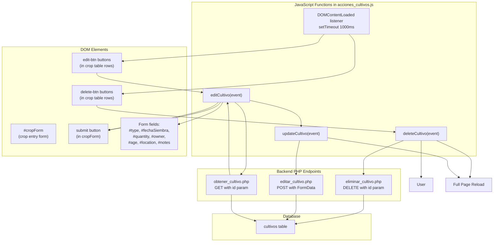
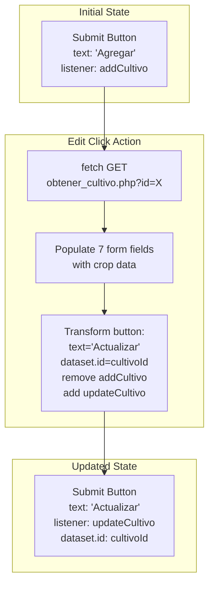
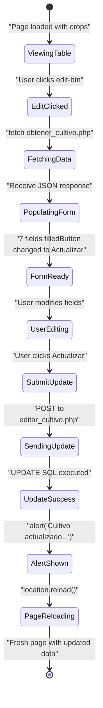

# Crop Edit and Delete Actions

> **Relevant source files**
> * [backennd/db_interaction/editar_cultivo.php](https://github.com/axchisan/CoopAgronet/blob/e8818744/backennd/db_interaction/editar_cultivo.php)
> * [backennd/db_interaction/eliminar_cultivo.php](https://github.com/axchisan/CoopAgronet/blob/e8818744/backennd/db_interaction/eliminar_cultivo.php)
> * [backennd/db_interaction/obtener_cultivo.php](https://github.com/axchisan/CoopAgronet/blob/e8818744/backennd/db_interaction/obtener_cultivo.php)
> * [front end/acciones_cultivos.js](https://github.com/axchisan/CoopAgronet/blob/e8818744/front end/acciones_cultivos.js)

## Purpose and Scope

This document describes the `acciones_cultivos.js` module, which provides edit and delete functionality for crop records in the CoopAgroNet frontend. This module attaches event handlers to action buttons in the crop table, manages the edit workflow by repurposing the crop creation form, and handles deletion with user confirmation.

For information about crop creation and initial table population, see [Crop Creation and Listing](/axchisan/CoopAgronet/3.3.1-crop-creation-and-listing). For the React-based alternative UI, see [React Crop Component](/axchisan/CoopAgronet/3.3.3-react-crop-component).

**Sources:** [front L1-L74](https://github.com/axchisan/CoopAgronet/blob/e8818744/front end/acciones_cultivos.js#L1-L74)

## System Overview

The `acciones_cultivos.js` module implements the Update and Delete operations of the CRUD pattern for crop management. It operates on crop records that are displayed in the `#cropTableBody` table, which is populated by `agregar_cultivo.js`. The module communicates with three backend PHP endpoints to retrieve crop data, update records, and delete records.

The module follows an event-driven architecture where button clicks trigger asynchronous fetch requests to the backend, followed by full page reloads to reflect changes in the UI.

**Sources:** [front L1-L74](https://github.com/axchisan/CoopAgronet/blob/e8818744/front end/acciones_cultivos.js#L1-L74)

## Module Architecture Diagram



**Sources:** [front L1-L74](https://github.com/axchisan/CoopAgronet/blob/e8818744/front end/acciones_cultivos.js#L1-L74)

## Event Listener Initialization

The module uses a `DOMContentLoaded` event listener with a 1-second `setTimeout` delay before attaching click handlers to edit and delete buttons. This delay is implemented as a workaround to ensure the crop table has been fully populated by `agregar_cultivo.js` before attempting to attach listeners.

| Code Element | Purpose |
| --- | --- |
| `DOMContentLoaded` listener | Ensures DOM is ready before accessing elements |
| `setTimeout(..., 1000)` | Delays execution by 1000ms to wait for table population |
| `querySelectorAll(".edit-btn")` | Selects all edit buttons in the table |
| `querySelectorAll(".delete-btn")` | Selects all delete buttons in the table |
| `.forEach(button => ...)` | Iterates through buttons to attach individual listeners |

```mermaid
sequenceDiagram
  participant Browser
  participant DOMContentLoaded
  participant listener
  participant setTimeout
  participant (1000ms)
  participant .edit-btn
  participant elements
  participant .delete-btn

  Browser->>DOMContentLoaded: "DOM fully loaded"
  DOMContentLoaded->>setTimeout: "Start 1s timer"
  note over setTimeout,(1000ms): "Wait for table
  setTimeout->>.edit-btn: "querySelectorAll
  setTimeout->>.delete-btn: forEach attach editCultivo"
```

**Sources:** [front L1-L11](https://github.com/axchisan/CoopAgronet/blob/e8818744/front end/acciones_cultivos.js#L1-L11)

## Delete Operation Workflow

The `deleteCultivo` function handles crop deletion with user confirmation. It extracts the crop ID from the button's `dataset.id` attribute, displays a browser confirmation dialog, and sends a DELETE request to the backend if confirmed.

### Delete Function Implementation

| Step | Code Action | Purpose |
| --- | --- | --- |
| 1 | `event.target.dataset.id` | Extract crop ID from button's data-id attribute |
| 2 | `confirm("¿Estás seguro...")` | Display browser confirmation dialog |
| 3 | `fetch(..., {method: "DELETE"})` | Send DELETE HTTP request to backend |
| 4 | `.then(response => response.text())` | Parse plain text response from PHP |
| 5 | `alert(data)` | Display server response message |
| 6 | `location.reload()` | Reload page to reflect changes |

The backend endpoint `eliminar_cultivo.php` receives the crop ID via GET parameter and executes a DELETE SQL statement directly against the `cultivos` table without prepared statements.

**Backend Processing:**

* [backennd/db_interaction/eliminar_cultivo.php L4-L5](https://github.com/axchisan/CoopAgronet/blob/e8818744/backennd/db_interaction/eliminar_cultivo.php#L4-L5) : Checks for DELETE HTTP method and extracts `id` from `$_GET`
* [backennd/db_interaction/eliminar_cultivo.php L7](https://github.com/axchisan/CoopAgronet/blob/e8818744/backennd/db_interaction/eliminar_cultivo.php#L7-L7) : Constructs DELETE SQL with direct string interpolation (SQL injection vulnerability)
* [backennd/db_interaction/eliminar_cultivo.php L8-L12](https://github.com/axchisan/CoopAgronet/blob/e8818744/backennd/db_interaction/eliminar_cultivo.php#L8-L12) : Executes query and returns plain text response

```mermaid
sequenceDiagram
  participant User
  participant delete-btn
  participant button
  participant deleteCultivo()
  participant confirm()
  participant dialog
  participant eliminar_cultivo.php
  participant cultivos table
  participant Browser

  User->>delete-btn: "Click delete"
  delete-btn->>deleteCultivo(): "event with dataset.id"
  deleteCultivo()->>deleteCultivo(): "Extract cultivoId from
  deleteCultivo()->>confirm(): event.target.dataset.id"
  confirm()->>User: "Show confirmation"
  loop [User confirms]
    User->>confirm(): "¿Estás seguro de eliminar
    confirm()->>deleteCultivo(): este cultivo?"
    deleteCultivo()->>eliminar_cultivo.php: "OK"
    eliminar_cultivo.php->>cultivos table: "true"
    cultivos table-->>eliminar_cultivo.php: "DELETE request
    eliminar_cultivo.php-->>deleteCultivo(): ?id=${cultivoId}"
    deleteCultivo()->>User: "DELETE FROM cultivos
    deleteCultivo()->>Browser: WHERE id = $id"
    Browser->>Browser: "Success/Error"
    User->>confirm(): "Plain text response"
    note over deleteCultivo(): "No action taken"
  end
```

**Sources:** [front L13-L28](https://github.com/axchisan/CoopAgronet/blob/e8818744/front end/acciones_cultivos.js#L13-L28)

 [backennd/db_interaction/eliminar_cultivo.php L1-L17](https://github.com/axchisan/CoopAgronet/blob/e8818744/backennd/db_interaction/eliminar_cultivo.php#L1-L17)

## Edit Operation Workflow

The `editCultivo` function retrieves a single crop's data and populates the existing crop creation form with that data, effectively repurposing the form for editing. This approach avoids duplicating form HTML but requires careful state management of the submit button.

### Edit Function Implementation

The edit workflow consists of three phases:

1. **Data Retrieval:** Fetch crop data from `obtener_cultivo.php`
2. **Form Population:** Fill form fields with retrieved values
3. **Button Transformation:** Change submit button from "Add" mode to "Update" mode

| Form Field ID | Backend Field | Data Type |
| --- | --- | --- |
| `#type` | `cultivo.tipo` | VARCHAR |
| `#fechaSiembra` | `cultivo.fecha_siembra` | DATE |
| `#quantity` | `cultivo.cantidad` | INT |
| `#owner` | `cultivo.dueno` | VARCHAR |
| `#age` | `cultivo.edad` | INT |
| `#location` | `cultivo.ubicacion` | VARCHAR |
| `#notes` | `cultivo.notas` | TEXT |

**Button State Transformation:**

* [front L46-L47](https://github.com/axchisan/CoopAgronet/blob/e8818744/front end/acciones_cultivos.js#L46-L47) : Changes button text to "Actualizar" and stores crop ID in `dataset.id`
* [front L49](https://github.com/axchisan/CoopAgronet/blob/e8818744/front end/acciones_cultivos.js#L49-L49) : Removes the `addCultivo` listener (from `agregar_cultivo.js`)
* [front L50](https://github.com/axchisan/CoopAgronet/blob/e8818744/front end/acciones_cultivos.js#L50-L50) : Attaches `updateCultivo` listener for update submission



**Backend Data Retrieval:**

* [backennd/db_interaction/obtener_cultivo.php L4-L6](https://github.com/axchisan/CoopAgronet/blob/e8818744/backennd/db_interaction/obtener_cultivo.php#L4-L6) : Checks for `id` GET parameter and executes SELECT query
* [backennd/db_interaction/obtener_cultivo.php L9-L10](https://github.com/axchisan/CoopAgronet/blob/e8818744/backennd/db_interaction/obtener_cultivo.php#L9-L10) : Returns single row as JSON object
* [backennd/db_interaction/obtener_cultivo.php L12](https://github.com/axchisan/CoopAgronet/blob/e8818744/backennd/db_interaction/obtener_cultivo.php#L12-L12) : Returns error JSON if crop not found

**Sources:** [front L30-L53](https://github.com/axchisan/CoopAgronet/blob/e8818744/front end/acciones_cultivos.js#L30-L53)

 [backennd/db_interaction/obtener_cultivo.php L1-L17](https://github.com/axchisan/CoopAgronet/blob/e8818744/backennd/db_interaction/obtener_cultivo.php#L1-L17)

## Update Operation Workflow

The `updateCultivo` function is triggered when the user submits the form after it has been populated by `editCultivo`. It collects all form data, appends the crop ID, and sends a POST request to the update endpoint.

### Update Function Implementation

| Step | Code Action | Purpose |
| --- | --- | --- |
| 1 | `event.preventDefault()` | Prevent default form submission |
| 2 | `event.target.dataset.id` | Retrieve crop ID from button's dataset |
| 3 | `new FormData(document.getElementById("cropForm"))` | Collect all form field values |
| 4 | `formData.append("id", cultivoId)` | Add crop ID to form data |
| 5 | `fetch(..., {method: "POST", body: formData})` | Send POST request with all data |
| 6 | `alert(data)` | Display server response |
| 7 | `location.reload()` | Reload page to show updated crop |

**Backend Update Processing:**

* [backennd/db_interaction/editar_cultivo.php L4-L12](https://github.com/axchisan/CoopAgronet/blob/e8818744/backennd/db_interaction/editar_cultivo.php#L4-L12) : Extracts 8 POST parameters (id + 7 crop fields)
* [backennd/db_interaction/editar_cultivo.php L14-L15](https://github.com/axchisan/CoopAgronet/blob/e8818744/backennd/db_interaction/editar_cultivo.php#L14-L15) : Constructs UPDATE SQL with direct string interpolation (SQL injection vulnerability)
* [backennd/db_interaction/editar_cultivo.php L17-L21](https://github.com/axchisan/CoopAgronet/blob/e8818744/backennd/db_interaction/editar_cultivo.php#L17-L21) : Executes query and returns plain text response

```mermaid
sequenceDiagram
  participant User
  participant Submit Button
  participant (Actualizar mode)
  participant updateCultivo()
  participant FormData
  participant object
  participant editar_cultivo.php
  participant cultivos table
  participant Browser

  User->>Submit Button: "Click Actualizar"
  Submit Button->>updateCultivo(): "event"
  updateCultivo()->>updateCultivo(): "event.preventDefault()"
  updateCultivo()->>updateCultivo(): "Extract cultivoId from
  updateCultivo()->>FormData: event.target.dataset.id"
  FormData-->>updateCultivo(): "new FormData(cropForm)"
  updateCultivo()->>FormData: "All form fields"
  updateCultivo()->>editar_cultivo.php: "formData.append('id', cultivoId)"
  editar_cultivo.php->>editar_cultivo.php: "POST with FormData
  editar_cultivo.php->>cultivos table: (8 parameters)"
  loop [Update successful]
    cultivos table-->>editar_cultivo.php: "Extract $_POST values:
    editar_cultivo.php-->>updateCultivo(): id, tipo, fecha_siembra,
    cultivos table-->>editar_cultivo.php: cantidad, dueno, edad,
    editar_cultivo.php-->>updateCultivo(): ubicacion, notas"
  end
  updateCultivo()->>User: "UPDATE cultivos SET
  updateCultivo()->>Browser: tipo='...', fecha_siembra='...',
  Browser->>Browser: cantidad='...', dueno='...',
```

**Sources:** [front L55-L72](https://github.com/axchisan/CoopAgronet/blob/e8818744/front end/acciones_cultivos.js#L55-L72)

 [backennd/db_interaction/editar_cultivo.php L1-L26](https://github.com/axchisan/CoopAgronet/blob/e8818744/backennd/db_interaction/editar_cultivo.php#L1-L26)

## Complete Edit-Update Flow

This diagram shows the complete user journey from viewing the crop table to successfully updating a crop record:



**Sources:** [front L30-L72](https://github.com/axchisan/CoopAgronet/blob/e8818744/front end/acciones_cultivos.js#L30-L72)

## Backend Endpoint Details

### obtener_cultivo.php

Retrieves a single crop record by ID for the edit form population.

**HTTP Method:** GET
**Parameters:** `id` (query string)
**Response Format:** JSON object with crop fields or error object

**SQL Query Pattern:**

```sql
SELECT * FROM cultivos WHERE id = $id
```

**Security Concerns:**

* [backennd/db_interaction/obtener_cultivo.php L6](https://github.com/axchisan/CoopAgronet/blob/e8818744/backennd/db_interaction/obtener_cultivo.php#L6-L6) : Direct string interpolation in SQL (vulnerable to SQL injection)
* No authentication check (any user can retrieve any crop data)
* No input sanitization on `id` parameter

**Sources:** [backennd/db_interaction/obtener_cultivo.php L1-L17](https://github.com/axchisan/CoopAgronet/blob/e8818744/backennd/db_interaction/obtener_cultivo.php#L1-L17)

### editar_cultivo.php

Updates an existing crop record with new field values.

**HTTP Method:** POST
**Parameters:** 8 POST fields (id, tipo, fecha_siembra, cantidad, dueno, edad, ubicacion, notas)
**Response Format:** Plain text message (success or error)

**SQL Query Pattern:**

```sql
UPDATE cultivos SET tipo='$tipo', fecha_siembra='$fecha_siembra', 
cantidad='$cantidad', dueno='$dueno', edad='$edad', 
ubicacion='$ubicacion', notas='$notas' WHERE id=$id
```

**Security Concerns:**

* [backennd/db_interaction/editar_cultivo.php L14-L15](https://github.com/axchisan/CoopAgronet/blob/e8818744/backennd/db_interaction/editar_cultivo.php#L14-L15) : Direct string interpolation in SQL (critical SQL injection vulnerability)
* No prepared statements or parameter binding
* No authentication check (any user can update any crop)
* No ownership verification (user can modify crops belonging to others)
* No input validation on field values

**Sources:** [backennd/db_interaction/editar_cultivo.php L1-L26](https://github.com/axchisan/CoopAgronet/blob/e8818744/backennd/db_interaction/editar_cultivo.php#L1-L26)

### eliminar_cultivo.php

Deletes a crop record from the database.

**HTTP Method:** DELETE
**Parameters:** `id` (query string)
**Response Format:** Plain text message (success or error)

**SQL Query Pattern:**

```sql
DELETE FROM cultivos WHERE id = $id
```

**Security Concerns:**

* [backennd/db_interaction/eliminar_cultivo.php L7](https://github.com/axchisan/CoopAgronet/blob/e8818744/backennd/db_interaction/eliminar_cultivo.php#L7-L7) : Direct string interpolation in SQL (SQL injection vulnerability)
* No authentication check (any user can delete any crop)
* No ownership verification (user can delete crops belonging to others)
* No soft delete implementation (permanent data loss)
* No audit trail of deletions

**Sources:** [backennd/db_interaction/eliminar_cultivo.php L1-L17](https://github.com/axchisan/CoopAgronet/blob/e8818744/backennd/db_interaction/eliminar_cultivo.php#L1-L17)

## Data Flow Summary Table

| Operation | Frontend Function | HTTP Method | Backend Endpoint | SQL Operation | Reload Required |
| --- | --- | --- | --- | --- | --- |
| Delete | `deleteCultivo()` | DELETE | `eliminar_cultivo.php` | DELETE FROM | Yes |
| Fetch for Edit | `editCultivo()` | GET | `obtener_cultivo.php` | SELECT WHERE | No |
| Update | `updateCultivo()` | POST | `editar_cultivo.php` | UPDATE SET WHERE | Yes |

**Common Patterns:**

* All operations use plain `fetch()` API with `.then()` promise chains
* All mutation operations (delete, update) trigger `location.reload()` after success
* All operations use `alert()` for user feedback instead of a notification system
* All backend endpoints return plain text responses except `obtener_cultivo.php` which returns JSON
* No operation includes authentication tokens or session verification

**Sources:** [front L1-L74](https://github.com/axchisan/CoopAgronet/blob/e8818744/front end/acciones_cultivos.js#L1-L74)

 [backennd/db_interaction/editar_cultivo.php L1-L26](https://github.com/axchisan/CoopAgronet/blob/e8818744/backennd/db_interaction/editar_cultivo.php#L1-L26)

 [backennd/db_interaction/eliminar_cultivo.php L1-L17](https://github.com/axchisan/CoopAgronet/blob/e8818744/backennd/db_interaction/eliminar_cultivo.php#L1-L17)

 [backennd/db_interaction/obtener_cultivo.php L1-L17](https://github.com/axchisan/CoopAgronet/blob/e8818744/backennd/db_interaction/obtener_cultivo.php#L1-L17)

## Race Condition Workaround

The 1-second delay in event listener attachment ([front L2](https://github.com/axchisan/CoopAgronet/blob/e8818744/front end/acciones_cultivos.js#L2-L2)

) indicates a race condition between `agregar_cultivo.js` and `acciones_cultivos.js`. The crop table is populated asynchronously by `fetchCultivos()` in `agregar_cultivo.js`, but `acciones_cultivos.js` needs the table rows to exist before it can attach click handlers to the buttons within those rows.

**Current Approach:** Hard-coded 1000ms delay
**Limitations:**

* If network is slow, table may not be ready after 1 second
* If network is fast, 1 second is unnecessary wait time
* No guarantee of synchronization

**Alternative Approaches Not Implemented:**

* Mutation Observer to watch for table changes
* Custom event dispatched by `agregar_cultivo.js` after table population
* Centralized state management to coordinate module initialization
* Single module handling all crop table operations

This pattern suggests the codebase evolved organically with modules added incrementally rather than designed with clear initialization order.

**Sources:** [front L1-L11](https://github.com/axchisan/CoopAgronet/blob/e8818744/front end/acciones_cultivos.js#L1-L11)

## Error Handling Patterns

All three functions use minimal error handling with `.catch()` blocks that only log to console:

```javascript
.catch(error => console.error("Error al eliminar cultivo:", error));
```

**Limitations:**

* User sees no feedback if network request fails (except if browser alert shows after error)
* No retry mechanism for failed requests
* No distinction between network errors, server errors, and validation errors
* Console errors are not visible to end users
* `alert()` may not fire if promise chain fails before `.then(response => response.text())`

**User Impact:**

* Failed deletions may leave user confused (confirmation shown but record remains)
* Failed updates may cause data loss if user closes page thinking save succeeded
* No indication of whether failure is client-side, server-side, or database-side

**Sources:** [front L26](https://github.com/axchisan/CoopAgronet/blob/e8818744/front end/acciones_cultivos.js#L26-L26)

 [front L52](https://github.com/axchisan/CoopAgronet/blob/e8818744/front end/acciones_cultivos.js#L52-L52)

 [front L71](https://github.com/axchisan/CoopAgronet/blob/e8818744/front end/acciones_cultivos.js#L71-L71)